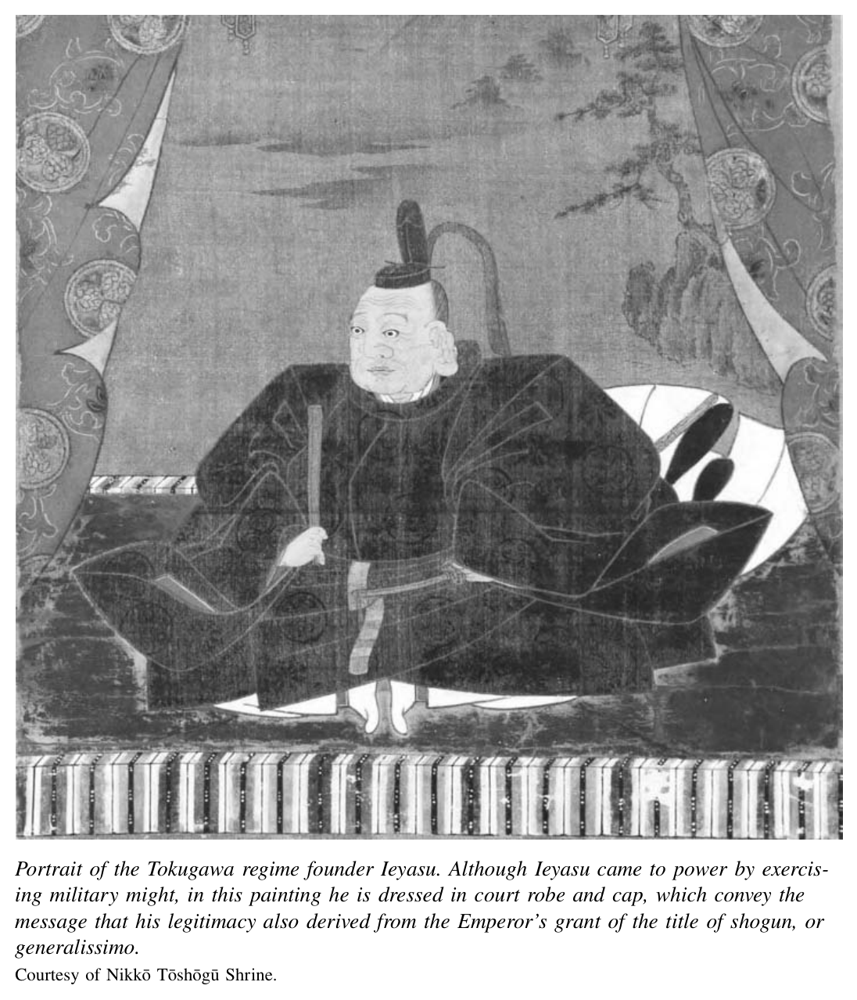

*Part 1. Crisis of the Tokugawa Regime*

# 1. The Tokugawa Polity

The tumultuous changes of modern times in Japan unfolded against the backdrop of more than two centuries of unprecedented peace and social order. This era, called the Tokugawa period after the family name of Japan’s military rulers between 1600 and 1868, has left a variety of images for later ages. The Tokugawa order was bolstered by harsh laws and restrictions on social and geographic mobility. Officials are said to have ruled by the motto, “Sesame seeds and peasants are very much alike. The more you squeeze them, the more you can extract from them.”[^1] At the same time, the Tokugawa centuries were an era of flourishing rural production and commerce and lively city life. One careful European observer wrote in the 1690s that “an incredible number of people daily use the highways of Japan’s provinces, indeed at certain times of the year they are as crowded as the streets of a populous European city.”[^2]

Numerous formal restrictions coexisted with an energetic, at times rambunctious, population over the Tokugawa centuries. And important changes took place. These did not set the Tokugawa system on a smooth course toward modernity, but they were important nonetheless. By the nineteenth century, the regime faced grave problems. Underemployed warriors suffered a troubling identity crisis. Established institutions and ideas seemed inadequate to deal with new pressures at home and from outside. Rulers strongly committed to maintaining order faced social tensions and protests. A look at the origins of Tokugawa society and the emergence of these problems helps one make sense of the unexpected and hardly predictable modern transformations that began when the regime eventually collapsed.

## Unification

The most important feature of Tokugawa history was the absence of warfare. The ¯ contrast to what came before was immense. From 1467 to 1477, the Onin War destroyed the ancient capital of Kyoto, the emperor’s home since 794, a beautiful city of temples and aristocratic residences. For the next century, warfare was constant. Hundreds of thousands of samurai men in arms clustered around provincial military rulers called daimyo¯. These regional rulers jockeyed for control of land, people, and commerce.

Although war was a dominant theme of the age, this was by no means a century of unrelieved misery for all. Commerce flourished, and several cities emerged as relatively autonomous international trading ports. Some devotees of Buddhism organized powerful communities called ikko¯ (single-minded) sects. They too won autonomy from daimyo¯ control.

Then, between the 1570s and 1600, three remarkable, often ruthless rulers pulled together an enduring political order. From the 1600s through the mid-1800s, people in Japan enjoyed over 250 years free of war. The warrior elite of daimyo¯ and samurai retained their place as political rulers, but the character of the warriors changed dramatically. Immense change likewise came to economic and cultural life.

The first of the so-called unifiers was Oda Nobunaga.* He began as modest lord of the Owari domain in the vicinity of present-day Nagoya. In 1555 Nobunaga began his rise to power, soon embarking on a ruthless campaign of terror. He laid waste to the Buddhist strongholds, killing thousands of monks and burning great libraries and temples. In 1574, he overcame the independent villages whose residents supported the ikko¯ sect of Buddhism. By 1582, when he was assassinated by a treacherous underling, he had consolidated control over roughly two-thirds of Japan.

Viewed with fear and awe at the time, Nobunaga has not been remembered kindly by historians, who have called him “a magnificent savage,” a “cruel and callous brute,” even “a Japanese Attila.”[^3] But Nobunaga was more than a butcher. He also fashioned political institutions that his successors used to good effect in establishing and sustaining the Tokugawa peace. He encouraged or allowed relatively autonomous village organization as long as villagers paid taxes. He developed a bureaucratic program of tax collection, so that his vassals did not collect revenue directly from villages. Instead, specialized tax collectors did this, and they gave the loot in part to the vassals, in part to Nobunaga. He simultaneously separated the thousands of petty military lords from their fiefs. He took “proprietorship” from these men, and in exchange he guaranteed the petty lord an income reflecting the size and output of his land. In doing this, he established the right to reassign a subordinate lord.

For this system to work, a systematic survey of the land, its productive capacity, its size, and its ownership was crucial. Nobunaga pioneered in the use of surveys of the quality and quantity of agricultural land, and this constituted a foundation of the early modern political system. He also began the practice of disarming villagers and establishing a fairly sharp class boundary between warriors and farmers.

In the wake of Nobunaga’s death, one lieutenant took up the banner as aspiring hegemon. This was Toyotomi Hideyoshi, a low-born foot soldier of unimposing appearance. His contemporaries dubbed him “the monkey.” His wife is said to have called him a “bald rat.” Epithets aside, he was a brilliant political strategist. In contrast to Nobunaga, who obliterated rivals and gave their lands to trusted underlings, Hide-

*A note on names: In the Japanese language people typically are identified with their family name first, followed by their given name (so-called first name), and we will follow this pattern in this book. Thus, Oda was this ruler’s family name. His given name was Nobunaga. Historians refer to most important figures by their family name (for example, Prime Minister Ito), but a few especially famous or notorious figures in political or cultural life are called by their given (“first”) names, much the way speakers of English refer to the British royal family members as “Charles” or “Elizabeth.” Oda Nobunaga (as well as Toyotomi Hideyoshi and Tokugawa Ieyasu) are such figures in Japan. In these cases we follow the Japanese practice and use their given names.

yoshi pursued a politics of alliance-building. He attacked enemies who resisted, but he accepted oaths of loyalty from those who came over to his side. In such fashion, he extended domininion over all of Japan by 1591.

Hideyoshi continued and systematized the institutions of Nobunaga, and he added some twists of his own. He took hostages from the daimyo¯ to ensure their loyalty. In 1588 he extended throughout his lands the practice of disarming peasants through so-called sword hunts. He also launched two massive and disastrous invasions of Korea in 1592 and 1597, seemingly with the intention of conquering China as well. Hideyoshi simultaneously turned against the Jesuit missionaries who had been winning converts in Japan since they first arrived in the 1550s. At the time of his death in 1598, Hideyoshi stood unchallenged at the apex of a federation of daimyo¯ that covered the entire territory of Japan. He left behind a council of his most trusted lieutenants, called regents. They pledged to rule on behalf of his young son until the boy came of age. This was an unstable plan for succession, and a power struggle soon broke out among the regents.

## The Tokugawa Political Settlements

These decades of swift political innovation culminated in rule by the Tokugawa family’s bakufu, or military government. The first Tokugawa ruler was Ieyasu. One of his foreign biographers, a British scholar writing in 1937 with a sympathetic eye on the programs of Adolf Hitler in Germany, excused his ruthless side by noting that “the virtues desirable in the ordinary farmer or bourgeois are hardly of much use to a military dictator.”[^4]

Ieyasu was a harsh ruler. He was also a patient tactician who knew how to compromise. He was a peer of Hideyoshi, and his strongest potential opponent, but he held back from challenging the “bald rat.” Ieyasu rather consolidated a base in the region of the eastern Kanto¯ Plain, and he waited. Following on Nobunaga and Hideyoshi’s models, he built up an effective domain government in the 1580s and 1590s. After Hideyoshi died, Ieyasu—who was one of the regents—lost little time in gathering his allies. In 1600 he destroyed the forces of the other regents, loyal to Hideyoshi’s son, in the famous battle of Sekigahara. This gave him essentially unchallenged hegemony. In 1603 he had the emperor grant him the ancient title of shogun.

In 1605, just five years after Sekigahara, while he was still energetic and healthy, Ieyasu “retired.” He put his own son, Hidetada, in the office of shogun to ensure a smooth succession. He continued to rule from behind the scenes until he died in 1616. The son had only seven unchaperoned years as shogun until his own death in 1623.

Ieyasu’s grandson, Tokugawa Iemitsu, was the third shogun and a ruler almost as important as Ieyasu. His rule from 1623 to 1651 was the height of the Tokugawa dictatorship. It was Ieyasu and Iemitsu, in particular, who consolidated the institutions that remained in place when Western powers threatened to colonize Japan in the 1850s.

Ieyasu and Iemitsu built upon the achievements of Nobunaga and Hideyoshi to

put in place a series of what we can call “settlements.” These various arrangements secured the Tokugawa position at the apex of political power. They neutralized all possible opposition, from daimyo¯ and the emperor’s court, to samurai, peasants, merchants, and priests. These settlements eliminated tensions of previous decades, even centuries. They brought to Japan the most stable political order in its history. Of course, historical processes of creating or sustaining institutions are never entirely stable. The settlements of the 1600s generated new contradictions that eventually eroded the Tokugawa order, but this was a gradual process that unfolded over the course of more than two centuries.

## The Daimyo¯

Most of the specific Tokugawa policies had precedents in Hideyoshi’s institutions of rule or those of Nobunaga, but Ieyasu and his successors implemented them more systematically. The settlement with the daimyo¯ was one of the most important. Ieyasu enforced an order limiting castles to one per domain. He required daimyo¯ to swear oaths of loyalty to him. He forbade them from concluding alliances among themselves and dispatched inspectors to make sure the daimyo¯ were in compliance. Ieyasu further controlled the daimyo¯ by mandating that all their marriages receive Tokugawa approval.

Ieyasu periodically required the daimyo¯ to give him expensive contributions to building projects, including his great castle at Edo, which he established as his seat of power. But occasional coerced “gifts” of this sort were the closest Tokugawa Ieyasu or his descendants came to taxing the daimyo¯. The fiscal autonomy of domains was a significant limit to Tokugawa power. Following the precedent of Hideyoshi, Ieyasu opted to rule through a political system of alliances with weaker military rulers. He left roughly 180 daimyo¯ in place as hereditary rulers of relatively autonomous domains as long as they showed respect and followed his orders.[^5]

His grandson, Iemitsu, extended the Tokugawa reach considerably. Iemitsu established the right to confiscate daimyo¯ lands and give them to other lords he considered more reliable. He also exercised power by ordering some daimyo¯ to trade domains, which weakened them considerably. He confiscated portions of many domains and gave them to lieutenants under his direct command. These territories were called Tokugawa “house” lands. On other occasions he took the land of former opponents of the regime and granted them to his most loyal daimyo¯ allies, called fudai daimyo¯. Through such steps, he was able to ensure the hegemony of the Tokugawa clan and its allies in other domains.

All told, Iemitsu redistributed control over about five million koku,[^6] fully one-fifth of Japan’s arable land. In these maneuvers, Iemitsu was especially tough on the daimyo¯ who had opposed his grandfather in the battle of Sekigahara. These were called the tozama, or outer, daimyo¯. He protected his power base by building a concentric pattern of Tokugawa house lands close to Edo, surrounded by lands of allied fudai daimyo¯ and Tokugawa relatives called shinpan. He placed the former oppo-nents—the tozama daimyo¯—in lands at the farthest reaches of the three main islands.

Iemitsu also put in place one extremely important innovation, actually a dramatic extension of a pre-Tokugawa practice. This was the system of “alternate attendance” (sankin ko¯tai). It completes the picture of Tokugawa rule at the peak of hegemony over once-dangerous rivals. It had roots in the treatment of some daimyo¯ by an earlier shogun, in the 1300s. The daimyo¯ of this era were required to “attend” in the capital of the time, Kyoto, rather than live in domains, so the shogun could keep tabs on them. On several occasions in the late sixteenth century Hideyoshi likewise required leading daimyo¯ to remain close by in “attendance.” But this early form of attendance was not ongoing, scheduled, or universal. Between 1635 and 1642 Iemitsu regularized the attendance system.

Iemitsu required all daimyo¯ to maintain residences in Edo as well as in their home domain. They would have to attend upon the shogun by residing in Edo in alternate years. Their wives and children had to remain behind in Edo when they went home for a year before the next period of attendance. This was a most effective system of political control. It created what were essentially hostage neighborhoods of daimyo¯ families (although the conditions of these “hostages” were quite comfortable as long as they did not try to leave the city). The attendance system led to the watchword at the guard posts of Edo: Beware of women going out, guns coming in. These would have been signs of rebellion in the making. But for two hundred years, there were no serious challenges to the Tokugawa.

In addition to controlling them, attendance dramatically weakened the daimyo¯. It forced them to spend great sums to maintain several households, one back home and two or three in Edo. They also had to pay for their grand processions back and forth between the home castle and Edo. Daimyo¯ lords typically used up two-thirds of their annual tax revenues on staffing their Edo residences. Forced attendance weakened the daimyo¯ politically by removing them from a hands-on role in local rule, since they were absent half the time. In addition, a daimyo¯’s sense of identification with his home domain was often weak because he would be raised by his mother and her staff in Edo, never setting foot in his own domain until adulthood.

## The Imperial Institution

A second critical settlement gave the shogun effective control over the potentially most potent Japanese political symbol, the emperor. Ieyasu continued the Nobunaga and Hideyoshi policies of economic support for the court, raising it considerably from the genteel poverty of the previous century. The position of supreme military ruler, or shogun, was in theory a grant from the emperor. For this reason, the Tokugawa family could raise their own legitimacy by simultaneously enhancing imperial prestige and carefully controlling the emperor. To this end, the shogun promulgated a set of “laws for nobles.” The shogun claimed the power to make court appointments and grant land incomes. He held an imperial prince hostage at the Tokugawa family’s own shrine at Nikko¯. To monitor the imperial court, he stationed his own deputy at a highly visible outpost in Kyoto, the Nijo¯ palace not far from the emperor’s palace, while he flattered the court with minor courtesies.

These policies presented the shogun as a virtual equal to the emperor. One result was to create significant confusion in the minds of Westerners in the mid-nineteenth century as to who was, in fact, the sovereign ruler. In 1857, the American trade negotiator Townsend Harris presented the shogun a letter from President Pierce addressed to “His Majesty the Emperor of Japan.”[^7] But at least among the samurai who joined political agitation against the Tokugawa in the 1850s and 1860s, the notion that legitimacy stemmed from the emperor remained powerful.

## The Samurai

Several hundred thousand samurai warriors had been more or less permanently mobilized by hundreds of daimyo¯ to fight the wars of the late 1500s. In a political system that closely resembled that of feudalism in Europe, these samurai had controlled small portions of land, called fiefs, as well as the peasants who farmed them. They had drawn tax income from this land to support their military endeavors. But controlling this land and its residents, and defending it from neighboring warriors, could be difficult. By pledging loyalty and offering military service to more powerful daimyo¯ rulers, these samurai warriors gained protection from predatory neighbors as well as rebellious peasants. After the wars of unification ended, however, few of these samurai returned to supervise their lands directly. Instead, most became town- and city-dwellers. Many were instructed by their daimyo¯ rulers to take up residence in the so-called castle towns that had sprung up around each domain’s castle. Others were told to serve at the domain residence nearby the shogun’s castle at Edo. Still others were posted as officers in rural towns, who oversaw a complex bureaucracy that surveyed land, assessed output, collected taxes, and kept local order. The samurai’s fief lands came to be administered by these specialized officers of the daimyo¯ or the shogun. The officials would collect tax revenues from the lands originally controlled by the samurai and forward the funds to the daimyo¯’s castle or his Edo residence. The daimyo¯ would then pay out to each samurai an amount equivalent to the expected income from that man’s original fief.

The samurai in the city retained the right to wear two swords. Some served as policemen and keepers of order, but the majority no longer had official military duties. Assigned to a variety of administrative positions, or sometimes to none at all, the samurai received from the daimyo¯ their annual salaries, called “stipends,” reflecting the value of a fief of origin. But over time, the samurai’s sense of connection to this fief became increasingly abstract and weakened. Samurai were subject to Tokugawa or domain law. Private vendettas of honor or loyalty were harshly punished in the interests of a broader concept of social order.

At first, with the unification wars still fresh in living memory, these citified samurai were a rough-and-tumble lot. Samurai gang wars—a West Side Story in the shadows of Edo castle—were frequent in the early 1600s. Over time, however, most samurai turned in swords for calligraphy brushes. They came to occupy a theoretically privileged but often quite confined position as a hereditary elite that managed the business of bakufu and domain. Assignments to high office, and prospects for promotion, came to depend on literacy, especially for samurai sons born into the middle and upper ranks. The samurai were transformed from warriors into bureaucrats. Those on the bottom of the salary scale lived in very modest, often impoverished, circumstances. During the Tokugawa era, roughly 6 to 7 percent of the population was from samurai families.

Villagers and City-Dwellers The fourth settlement that bolstered the Tokugawa peace was that imposed upon the remainder of the population, the commoners, who were divided into several subgroups. In the 1630s, Tokugawa Iemitsu ordered all commoners to register with a Buddhist temple. The system was tightened in 1665 when the shogun ordered the temples to guarantee each person’s religious loyalty. Villagers were not allowed to change places of residence or even travel without permission. The system of registration was thus a tool of political and social control. It was also a means to enforce the ban on Christianity that had been inconsistently imposed on the population since the 1590s.

The statuses of farmer and of merchant or artisan townspeople thus became fixed and hereditary. Roughly 80 percent of the population was farmers. The remainder were townspeople of various sorts. But despite many restrictions on what people in each status group were allowed to do, the Tokugawa did not micromanage the lives of ordinary people. Within the confines of a circumscribed world, commoners had considerable autonomy. It is true they needed permission to travel and were not supposed to move to cities. But enforcement of such rules was often quite lax. In practice, the bakufu and domain governments kept out of the internal affairs of villages, as long as the villagers paid their taxes. The bakufu collected taxes from a whole village, not from individuals. The village, in turn, retained the collective responsibility for managing internal affairs, maintaining order, and delivering criminals to the bakufu or domain authorities.

The settlement imposed upon city-dwellers, whether merchants or artisans, whether in bakufu centers of Edo or Osaka or in the hundreds of domain castle towns, was similar in broad outlines to that imposed upon villagers. As they had done with village headmen, samurai officials delegated responsibility for keeping order and regulating economic activity to councils of leading merchants. A group of city elders was given responsibility for enforcing laws, investigating crimes, and collecting taxes.[^8]

## The Margins of the Japanese and Japan

In the orthodox vision of the Tokugawa social order, which drew on Chinese Confucian ideas, society was divided into four classes arranged in a hierarchy of moral virtue as well as secular authority: warrior, farmer, artisan, and merchant. Many, however, did not quite fit into any of these groups. Some were people of respect or celebrity: Buddhist priests, actors, and artists. Others were subject to society’s scorn, including prostitutes and various groups of outcastes. The main outcaste group was called eta (literally, “much filth,” today a pejorative term). This was a hereditary group of unclear origins. Its members lived in scattered communities, where they performed tasks deemed unclean by mainstream society, such as burials, executions, and the handling of animal carcasses. The outcastes also included criminals assigned to a separate category of “nonpersons” (hinin), who were forced to subsist on jobs such as ragpicking.

In Edo in the 1600s, the entertainment quarters of brothels, theaters, and restaurants developed into a flourishing district called Yoshiwara, near the shogun’s castle. Its presence offended moralistic officials and tempted samurai to neglect duty for the pursuit of male pleasure. But the rulers were practical men and were not inclined to ban prostitution. Instead, the bakufu authorities took the occasion of a fire that destroyed this district in 1657 to locate a new Yoshiwara on the far outskirts of the city. In addition to brothels, the district was home to teahouses, Kabuki theaters, and restaurants. Near the Yoshiwara district one found most of the city’s Buddhist temples as well as its public execution grounds, which were supervised by the hereditary outcastes. All of these people—outcastes of various categories, as well as prostitutes and priests—were literally as well as conceptually relegated to the margins of society by the physical placing of their communities on the edge of cities.

The Tokugawa paid particular attention to religious institutions. Not only was the entire population required to register with temples, but the temples themselves were also closely regulated. Their numbers and locations were specified, and they were required to report annually to the bakufu (or the daimyo¯). Such rules were intended to prevent Buddhist temples from growing in strength, as they had in the past, to a point where they might challenge secular authority.[^9]

Another important marginal status group were the Ainu people, who trace complex roots back to aboriginal inhabitants of the Japanese islands. For centuries preceding the Tokugawa era they maintained a relatively separate culture in the northern reaches of Honshu and the northern island called Ezo (present-day Hokkaido). In Tokugawa times the Ainu numbered roughly twenty-five thousand. For the most part, they subsisted by hunting and gathering. The northernmost daimyo¯, of the Matsumae domain, was given the responsibility for trading with the Ainu, and also for keeping them at bay. The Ainu occupied an ambiguous status on the margins of society. In the Tokugawa order they were not viewed as fully part of the civilized world of Japanese people. But neither were they considered fully part of the barbaric world of foreigners.

Foreigners were the final key group kept carefully on the margins. The foreign relations of Tokugawa Japan are often summed up in a single word, “seclusion,” or by two words, “closed country.” Indeed, in the 1600s the Tokugawa did cut off trade with countries that insisted on selling religion together with material goods. This ruled out the Spanish and the Portuguese, who had been active in both pursuits since the 1540s. Their emissaries would not abandon missionary work for the sake of worldly profit.

From 1633 to 1639, the same years during which he initiated the policy of alternate attendance, Iemitsu issued a series of edicts that restricted the interaction of people in Japan with those outside. He prohibited the Japanese from voyaging overseas to the west of Korea or to the south of the Ryu¯kyu¯ Islands (Okinawa). He restricted the export of weapons and banned the practice and teaching of Christianity and the travel of Catholics to Japan. In 1637–38, peasants in the Christian stronghold of Shimabara (near Nagasaki) rebelled, moved by a combination of economic grievances and a millenarian hope for spiritual deliverance. Bakufu forces viewed this as a challenge by traitorous Christians. They suppressed the rising brutally, killing perhaps thirty-seven thousand people, young and old, men and women. Iemitsu also expelled the Portuguese traders. Their last ships left Nagasaki in the summer of 1639. Finally, he forbade all remaining foreigners from traveling inland or from selling or giving books to anyone in Japan.

The English had already abandoned the Japanese trade in 1623. The Spanish followed in 1624. When the Portuguese were forced to leave, only the Dutch remained. They were content to keep their religious ideas to themselves and focus only on trade. They took up residence on a tiny outpost in Nagasaki harbor, a landfill island called Dejima.

These steps had a major impact. They sharply reduced Japanese ties to the West for over two hundred years, from the 1630s to the 1850s. This was a critical time in European history. It was the era of the industrial and bourgeois revolutions and the colonizing of the New World. It encompassed the entire colonial period in North America and the first seven decades of the history of the United States.

But to simply understand the Tokugawa foreign policy as one of seclusion is ultimately quite misleading. Not until much later in the Tokugawa era, in the 1790s, did people within Japanese society identify “seclusion” as the defining essence of the system. From the rulers’ perspective at the time, by issuing these edicts the Tokugawa had simply ousted those Westerners who insisted on promoting a religion that appeared to be a political threat. They still tolerated some Western trade and continued to cultivate foreign relations in Asia, except to forbid private travel abroad. They promoted officially sponsored trade and diplomatic travel, both for its own sake and to maintain domestic hegemony.

Satsuma domain was allowed to trade with the Ryu¯kyu¯ Islands (Okinawa). This was a source of Chinese goods throughout the Tokugawa era. Even in 1646, despite the uncertainty of wars in China as the Qing established their dynasty, bakufu officials in Edo decided that Satsuma should maintain this trade. The bakufu also continued trade with China through Nagasaki throughout the Tokugawa era. This provided access to intelligence as well as goods.

The Tokugawa also maintained important economic and political relations with Korea. These links were reopened just about a decade after Hideyoshi’s invasion. The Japanese set up an outpost in Pusan much like the Dutch trading house in Nagasaki. This trade reached a tremendous volume. The domain of Tsushima, a small island with almost no agriculture located about halfway between Kyushu and southern Korea, handled this trade. By 1700 it earned profits comparable to the rice tax revenue of the largest domains in Japan.

In addition, the Tokugawa made active use of foreign policy to shore up their political legitimacy, especially through the exchange of embassies with Korea. Diplomatic relations with Korea were carried out beginning in the early 1600s. The Koreans sent twelve major embassies to Japan between 1610 and 1764, roughly one visit each ten to fifteen years. Each embassy brought from three hundred to five hundred members. They would come on occasions of congratulation, such as the birth of a shogunal heir or the accession of a new shogun. There were no missions in the reverse direction. While the Japanese actively sought to have Koreans come, the Koreans never invited the Japanese, and they rebuffed occasional Japanese inquiries.

A similar diplomatic relationship developed between the Ryu¯kyu¯ Islands and the bakufu. The Ryu¯kyu¯ ans sent twenty-one embassies of congratulation between 1610 and 1850. With China, however, the Tokugawa established no official relations. The Japanese refused to conduct relations in a way that acknowledged Chinese superiority, as the Chinese wanted.

Through these several diplomatic initiatives the Tokugawa rulers rejected the premises of a China-centered order emblematized by the tribute system to which other Asian rulers submitted. They were attempting to develop a vision and a reality of a different regional order. This was not a blatantly hegemonic vision. The Koreans were treated with a certain respect. They were not expected to prostrate themselves or to convey symbolic servitude, as they were in visits to the Chinese court. They interacted more or less as equals (although the Japanese clearly placed themselves as superiors to the Ryu¯kyu¯ans).

Through such diplomacy, the Tokugawa sought to legitimize its domestic position as the hegemon of Japan. It hoped in particular to impress the many daimyo¯ with the respect shown by foreigners to the Tokugawa. This goal is most evident in the way the Korean embassies were used, especially in 1617 and in 1634 around the time of the so-called expulsion edicts. The tozama and collateral lords were all commanded to attend a reception for 428 Korean visitors, a grand procession, and a visit to Ieyasu’s grave. They were to be impressed by the many gifts to the Tokugawa and the congratulations given by the Koreans on unification of the country. Over the ensuing decades, Korean missions served to show the elite daimyo¯ and top samurai that Japan’s domestic political order was respected by a wider world.

By the late 1700s, this system of foreign relations had implanted a firmly held belief among bakufu officials and daimyo¯, and many informed samurai and educated, wealthy villagers, that legitimate rule must exclude relations with the West. In the feisty words of Aizawa Yasushi, a very important critic of Tokugawa policies in the 1820s:

Recently the loathsome Western barbarians, unmindful of their base position as the lower extremities of the world, have been scurrying impudently across the Four Seas, trampling other nations underfoot. Now they are audacious enough to challenge our exalted position in the world. What manner of insolence is this?[^10]

Three decades later, such views clashed head on with the Western belief in the universal validity of its civilization—backed by the force of gunboats. As this happened, the Tokugawa order fell apart.

The settlements described in this chapter were worked out in the main under Tokugawa Ieyasu. They were consolidated by his grandson Iemitsu. The settlements were described at the time as eternal reflections in social order of a natural hierarchy of cosmic or sacred origin. They constituted a system that one pioneering American historian of Japan, John W. Hall, called “rule by status.”[^11] By this phrase he meant that the separate statuses of daimyo¯, samurai, court noble, villager, merchant or artisan, priest or prostitute, and outcaste or Ainu all had their own laws. Each status had its own relationship to the Tokugawa rulers. People were in theory restricted to their status niche, but they were given responsibility for self-regulation as well.

Tokugawa rulers could be harsh and arbitrary in their efforts to uphold order and their own position. But the political regime of these centuries was durable, and it was able to accommodate considerable change over time. It brought unprecedented peace to the Japanese islands. The economy grew substantially. The cultural life of both city and countryside was often vigorous and creative. Judged against the standards of the previous centuries in Japan, these achievements were considerable.

But the flexibility and the reach of the Tokugawa order had limits. Compared to the Western nation-states that projected their military and economic power into Japan in the 1850s, the Tokugawa polity was a clumsy and divided structure. It was incapable of taxing the economic resources of the entire country, or of mobilizing human resources throughout the land, and it could not sustain a monopoly on the conduct of international relations. By the early nineteenth century, powerful underlying tensions, both socioeconomic and ideological, had significantly weakened the political and social control of the Tokugawa rulers.

## Footnotes

[^1]: Cited in Mikiso Hane, Peasants, Rebels, and Outcastes: The Underside of Modern Japan (New York: Pantheon Books, 1982), p. 8.

[^2]: Engelbert Kaempfer, Kaempfer’s Japan, ed. and trans. Beatrice M. Bodart Bailey (Honolulu: University of Hawaii Press, 1999), p. 271. Kaempfer was a German scholar who spent the years 1690 to 1692 with Dutch traders at their outpost in Nagasaki.

[^3]: James Murdoch and George Sansom cited in George Elison, “The Cross and the Sword,” in Warlords, Artists, and Commoners: Japan in the Sixteenth Century, ed. George Elison and Barwell L. Smith (Honolulu: University of Hawaii Press, 1981), pp. 67–68.

[^4]: A. L. Sadler, The Maker of Modern Japan: The Life of Tokugawa Ieyasu (1937; reprint, Rutland, Vt.: Charles E. Tuttle Company, 1984), p. 25.

[^5]: With the division of some domains and promotion of some direct vassals to daimyo¯ status, the number of daimyo¯ increased over time, stabilizing at about 260 in the eighteenth century.

[^6]: A koku is a unit of measure equivalent to about 180 liters.

[^7]: The Journal of Townsend Harris (Tokyo: Kinko¯do¯ Shoseki, 1913), pp. 468–80.

[^8]: James L. McClain, Kanazawa: A Seventeenth-Century Japanese Castle Town (New Haven, Conn.: Yale University Press, 1982), p. 151.

[^9]: The regulations also had an unintended consequence important to historians. Like the data stored in parishes of early modern Europe, the population records collected in Japan’s temple registers provided the raw materials in recent decades for sophisticated analysis of demographic and social history.

[^10]: Bob Tadashi Wakabayashi, Anti-Foreignism and Western Learning in Early-Modern Japan: The New Theses of 1825 (Cambridge: Harvard Council on East Asian Studies, 1986), p. 149.

[^11]: John W. Hall, “Rule by Status in Tokugawa Japan,” Journal of Japanese Studies 1, no. 1 (Fall 1974): 39–49.

