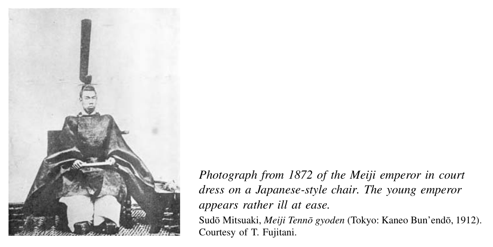
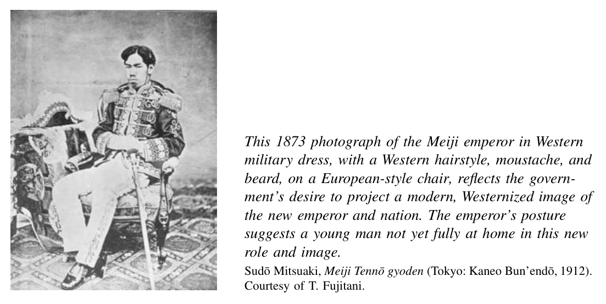
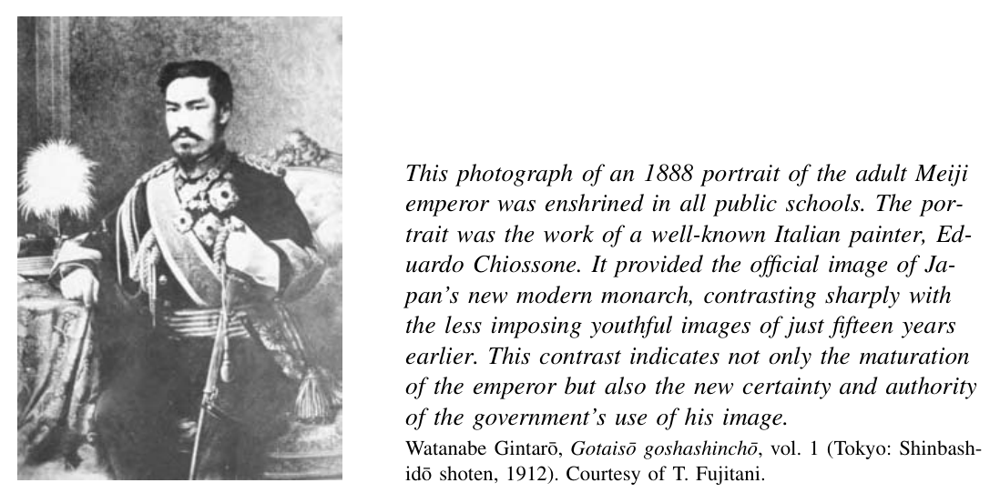

*Part 2. Modern Revolution, 1868–1905*

# 5. The Samurai Revolution

The “restoration” of the young Emperor Meiji in 1867–68 was little more than a coup d’e´tat. A relatively small band of insurgents had toppled the Tokugawa bakufu. They stated their intent to restore direct imperial rule, but this was not likely to occur. Strong emperors who exercised power directly had been exceptional in Japanese history. Political contenders at the time feared that the rebels from Satsuma and Cho¯ shu¯ would simply form a new bakufu and use the name of the emperor to rule from a narrow base of power. After all, beyond the political upheaval in Kyoto and Edo, little had changed. The islands of Japan were still divided into nearly two hundred relatively autonomous domains. Each maintained its own treasury and army. The samurai were still receiving stipends, which they viewed as a hereditary birthright. The daily life of the countryside and cities had gone through some tumult. But the scattered peasant rebellions were short-lived.

However, if we compare this situation of 1868 in any aspect—political, economic, social, cultural—to that of just a decade later, the changes are breathtaking and fully merit the term revolution. Of course, no society ever totally severs itself from its past, and Japan was no exception. But the range and depth of change were astonishing to observers at the time. It remains so when looking back after 150 years. One of the most insightful contemporaneous observers was a British scholar named Basil Hall Chamberlain. He lived in Japan for over thirty years beginning in 1873. In 1891, he wrote:

To have lived through the transition stage of modern Japan makes a man feel preternaturally old; for here he is in modern times, with the air full of talk about bicycles and bacilli and “spheres of influence,” and yet he can himself distinctly remember the Middle Ages. The dear old Samurai who first initiated the present writer into the mysteries of the Japanese language, wore a queue and two swords. This relic of feudalism now sleeps in Nirvana.

His modern successor, fairly fluent in English, and dressed in a serviceable suit of dittos, might almost be European, save for a certain obliqueness of the eyes and scantiness of beard. Old things pass away between a night and a morning.[^1]

Although Chamberlain here stresses how unusually swiftly the events of this “transition stage” unfolded, his writing also suggests that Japan’s transition was part of a broader global shift. And indeed, the revolution that began in the 1860s was a Japanese variation on a global theme of modern revolution. Changes that took place in societies around the world in the nineteenth and twentieth centuries also unfolded in Japan.

Although sharing much with a global history of modernizing societies, the Japanese revolution did take place through a process that differed from the revolutions in Europe of the late eighteenth and the nineteenth centuries. In Europe, members of newly powerful classes, especially the urban bourgeoisie, challenged and sometimes overturned the privileges of long-entrenched aristocrats. By contrast, in Japan of the Meiji era it was members of the elite of the old regime, the samurai, who spearheaded the attack on the old order. Their role has led many historians to describe Japan in the nineteenth century as undergoing a “revolution from above” or an “aristocratic revolution.”[^2]

In the twentieth century, other modernizing revolutions also unfolded through a process in which members of elite groups undermined their own well-established positions while they restructured the political order. The Japanese mode of modern revolution was not unique. Rather, it contrasted with earlier Western revolutions and resembled some later ones. This sort of elite-led revolution took place in Japan because of particular features of the samurai class, both weaknesses and strengths. On the negative side, change was possible because the samurai were not a securely landed elite. They were essentially salaried employees of their lords. Although this status was hereditary, it was less rooted in property than a European-style feudal estate, a Chinese gentry holding, or a Korean aristocratic status (yangban). The samurai had less to lose than elites in such societies. They were hard-pressed to protect their privilege as hereditary government employees once the new rulers decided to revoke it. Some did protest the actions of their former comrades bitterly, but others were either unable or unwilling to resist. On the positive side, many of the activists in the restoration movement had already developed a commitment to serving and building a realm that went beyond the narrow confines of a single domain. This emerging national consciousness offered a compelling reason for many to accept programs of far-reaching change.

## Programs of Nationalist Revolution

The leaders of the new Meiji government in 1868 were thrilled at the ease and speed with which they overcame the Tokugawa. They remained insulted by the unequal and coerced foreign presence and worried about the prospect of continued foreign encroachment. They were simultaneously fearful of resistance from domestic opponents. Domain armies remained in place, after all. Some had considerable stocks of Western arms.

The Meiji revolutionaries were motivated by fear of these challenges. They were also moved by their own sense of the ongoing problems of the Tokugawa order: military and economic weakness, political fragmentation, and a social hierarchy that failed to recognize men of talent. Propelled by both fear and discontent with the old regime, they generated an ambitious agenda, through a process of trial and error, aiming to build a new sort of national power.

## Political Unification and Central Bureaucracy

Their first dramatic step was to abolish all the daimyo¯ domains, thus dismantling a political order in place for 260 years. By 1868, almost immediately after the restorationist coup, top leaders of the new provisional government such as Kido Ko¯in of Cho¯shu¯ and Saigo¯ Takamori of Satsuma decided that the politically fragmented system of domains had to be overhauled. They acted with careful tactics and reached their goal in just three years. One British observer marvelled at this and other changes in 1872: “[F]our years ago we were still in the middle ages—we have leapt at a bound into the nineteenth century—out of poetry into plain useful prose.”[^3]

The move toward an integrated national polity began in March 1869. The new government convinced key daimyo¯ of prestige and power, especially those of Satsuma, Cho¯shu¯, Tosa, and Hizen, to voluntarily surrender their lands back to the emperor. As the patrons of many of the coup planners, these men were guaranteed respect and a voice in the new order if they wished. In fact, they were all quickly reappointed as domain governors with handsome salaries. Nonetheless, the “return of lands” established the principle that all lands and people were subject to the emperor’s rule. By early 1870, all daimyo¯ had formally returned their lands and taken appointments as governors of their domains, but they retained significant autonomy, as in the past.

Preparing the ground for the complete abolition of the daimyo¯ domains, the Meiji reformers worked to place domain governments in sympathetic hands. They pressed the daimyo¯ to appoint men of talent and often modest rank to key adminstrative posts. Such people would be likely to welcome further reform. Kido Ko¯in and other top officials in the Meiji government also won support of powerholders in many domains, both daimyo¯ and their followers, by promising them posts in the new central government. They backed such persuasion by threat of force, creating an imperial army primarily from Satsuma and Cho¯shu¯ samurai. It was untested, but it was stronger than any single domain’s forces or any likely combination of forces.

Having bought off potential opposition leaders and built support in key domains with these measures, the government in August 1871 had the emperor announce that all domains were immediately abolished. They were replaced with “prefectures” whose governors were appointed from the center. This was much more than a renaming of domains into prefectures. It was a stunning change, with immediate visible consequences. The central government would now collect taxes from domain lands. The daimyo¯ were ordered to move to Tokyo. Many castles were dismantled. Within just three months, the number of political units was consolidated dramatically, from 280 domains to 72 prefectures. Most of the new governors were not former daimyo¯. They were middling samurai from the insurgent domains now controlling the government.

This decree was accompanied by a large payoff to the daimyo¯ themselves. They were granted permanent yearly salaries equivalent to roughly 10 percent of their former domain’s annual tax revenue. Daimyo¯ were simultaneously relieved of all the costs of governing. Most were quite content to take early retirement on such generous terms. Thus, within the short span of three years, a political order in existence for over two and a half centuries simply disappeared. The Tokugawa bakufu, on the one hand, and the hundreds of semi-autonomous domains on the other, no longer existed.

Simultaneously, of course, the Meiji leaders had to erect a new national political structure to govern these domains turned prefectures. For several years they groped in this direction, experimenting with a confusing variety of political forms. They bolstered their claim as restorationists by labeling these first government offices with ancient Chinese terms used by the Japanese court in the Heian period (794–1192). In early 1868, the Sat-Cho¯ rebels and court officials placed themselves atop a provisional government to rule in the name of emperor. Later that year they established the Council of State as the highest political authority and monopolized its highest posts. The organization of this council was revised in 1869 and again in 1871. Later in 1871 it was replaced by a tripartite set of ministries of the Center, Left, and Right, further subdivided into various functional ministries (Finance, Foreign Affairs, Public Works, Home Affairs).

This format proved relatively effective. It persisted until 1885, when the Meiji leaders inaugurated a cabinet system modeled explicitly along European lines. At the head of this government was a prime minister. He presided over a cabinet that ran the bureaucratic agencies—the several ministries—of the Japanese state. This structure was codified in the Meiji constitution of 1889, discussed in detail later in this chapter. Although this constitution provided for a deliberative assembly (the Diet), state ministers were responsible not to the Diet but to the emperor.

In the early Meiji years, the ministerial staff was recruited mainly by personal connections from the ranks of Satsuma and Cho¯shu¯ samurai and their allies. But the government rather quickly moved toward a more impersonal, merit-based mode of recruitment. In 1887 it began a system of civil service examinations. From this point on, performance on this exam became the primary qualification for service in the prestigious ranks of the ministries of the Japanese imperial state.

The creation of this bureaucratic state was a step of great importance in the history of modern Japan. The Meiji rulers inherited a Tokugawa legacy of bureaucratic rule by civilianized samurai. They extended its reach by eliminating domains. They deepened its reach by replacing the clumsy Tokugawa administrative machinery of overlapping jurisdictions with functional ministries with clearly defined responsibilities. They bolstered its legitimacy by putting the meritocratic ideals of the Tokugawa system into practice. And finally, they elevated its prestige by defining the bureaucratic mission as one of service to the emperor. They gave the state a greater legitimacy and power than it had ever held in the past.

## Eliminating the Status System

The second great change of early Meiji was even more remarkable. It was achieved at greater cost. By 1876, less than a decade after the restoration coup, the economic privileges of the samurai were wiped out entirely. The coup leaders expropriated an entire social class, the semi-aristocratic elite from which they came. They met some stiff, violent resistance, but they managed to overcome it. This remarkable change amounted to a social revolution.

The government moved to expropriate the samurai primarily for financial reasons. The government reduced samurai stipends when it abolished the domains, but in the mid-1870s these payouts still consumed a huge chunk—roughly half—of state revenues. The new rulers had other uses in mind for this money. They believed that the samurai gave back relatively little value for their high costs. Their ranks included many talented people sitting idle. Their time-honored military skills, focused on swords and archery, were useless. Thus the samurai’s stipends were basically welfare for the well-born.

This case for expropriating the samurai was clear enough to government leaders soon after the restoration. But taking this step was a major undertaking. It took nearly a decade and enraged many former samurai. In particular, many of those who had supported the restoration drive, but remained in their domains after 1868, felt betrayed by their former comrades now running the Meiji government. The latter moved in small steps first, as they had with domain abolition. In 1869 they reduced the large number of samurai ranks to two, upper samurai (shizoku) and lower samurai (sotsu). In 1872 a large portion of the lower samurai were reclassified as commoners (heimin), although they retained their stipends for the moment.

In 1873, the government announced that stipends would be taxed. The next year it announced a voluntary program to convert stipends to bonds. The right to a stipend could be traded for an interest-bearing bond with a face value of five to fourteen years of income (in general, the lower the stipend, the higher the multiple). The bond would pay interest ranging from 5 to 7 percent, with smaller bonds paying higher rates. The income stream from all but the most generous bonds was a good bit lower than the annual stipend. Few samurai volunteered for this program.

The government made this program compulsory in 1876: All stipends were converted to bonds. In contrast to the well-compensated daimyo¯, many samurai suffered significant losses. Their annual incomes fell by anywhere from 10 to 75 percent. They further lost pride and prestige: The right to wear swords was denied to all but solidiers and policemen.

The elimination of samurai privilege allowed the new regime to redirect financial and human resources alike and was part of a larger transformation of society from a system of fixed statuses to a more fluid, merit-based social order. The other side to the abolition of samurai privilege was the end to formal restrictions on the rest of the population. At least in theory, this constituted social liberation. In 1870, all non-samurai were classified in legal terms as commoners (heimin). With some important gender-based exceptions noted later, the restrictions of the Tokugawa era on modes of travel, dress, and hairstyle were eliminated. Restrictions on occupation were abolished. The government ended legal discrimination against the hereditary outcaste groups of Tokugawa times such as eta and hinin. These terms came to be considered slurs and were replaced in official language by the label burakumin (literally, “village people,” in reference to their segregated villages). The descendants of these outcastes, however, continued to face prejudice and discrimination.

Some commoners fared well. Not surprisingly, many of those with education and money, in particular the landowners, moneylenders, and petty manufacturers at the upper levels of rural society, thrived in the more open social order of the Meiji era. Others, especially those with weak claims to farmland, lived in desperate poverty. They depended on the unreliable benevolence of landlords to survive illness, crop failures, or price declines. Although the samurai lost their income and social privilege, they were educated and ambitious. Many landed on their feet. Others invested their bonds in new businesses and failed miserably. Still others took up arms against the new government or joined political movements on behalf of a parliament and constitution.

The literature of the Meiji period offers one window into the excitement, the opportunities, and the risks of this era of change. One example is this comment by the narrator of Footprints in the Snow, a vibrant and widely read novel set in the 1880s and written in 1901 by Tokutomi Roka:

The race will go to the swift, not the empty-headed! The real testing-time in politics will come after the Diet gets going in 1890—and in everything, not only politics: the further Japan advances on the world stage, the more opportunities for the really able![^4]

## The Conscript Army

Even before the samurai were fully dispossessed, the Meiji leaders decided they had to renovate the military from the bottom up. Key figures from Cho¯shu¯ were deeply impressed at the superior performance of their mixed farmer-samurai militias in the

¯ restoration wars. These men—Kido Ko¯in, Omura Masujiro¯, and Yamagata Aritomo—argued forcefully for a conscript army drawn from the entire population. Their views were controversial, to say the least. In October 1869 a group of samurai in Kyoto,

¯ outraged at the conscript proposal, assassinated Omura. And among top government figures, the Satsuma men saw things differently from the Cho¯shu¯ clique. They came from a domain where nearly one-fourth of the population had been samurai. They feared arming ignorant and potentially rebellious commoners. They wanted to ensure a major role for samurai in the new Meiji order. The champion of this position was

¯Okubo Toshimichi, who ranked with Kido as one of the two most powerful leaders in the first decade of the Meiji era. At first he prevailed, with the support of Iwakura Tomomi, the most important court noble in the Meiji government. In April 1871 the government created an imperial army of just under ten thousand samurai recruited from the restoration forces.

The conservative military leadership seemed to be in control, but their ascendance was short-lived. Yamagata Aritomo returned from a trip to Europe fully convinced that mass conscription was the key not only to building military strength but also to disciplining a loyal populace. By 1873 his arguments had prevailed. The government decreed a system of universal conscription. Beginning at the age of twenty, all males were obligated to give three years of active service and four years on reserve status.

The draft was not popular. The 1873 decree noted several exemptions, for household heads, criminals, the physically unfit, students and teachers in many prescribed schools, and government officials. It also allowed people to buy their way out for a huge fee of 270 yen. This sum represented more than the annual wage of a common laborer. Large numbers of people sought to qualify for exemption or somehow scrape together the buyout fee. The army had trouble meeting the quotas for what the government itself labeled a “blood tax” (following European terminology). In 1873–74 angry crowds attacked and destroyed numerous registration centers in sixteen riots; nearly 100,000 people were arrested and punished.

As this resistance makes clear, the strong discipline and fierce loyalty shown by Japanese soldiers in later decades were by no means timeless traditional elements of Japan’s “national character.” Such resistance also took place in Europe and in the United States, where large anti-draft riots erupted during the Civil War. In Japan as elsewhere, a patriotic spirit that could induce willing military service—a key element of modern nationalism—had to be drummed into the masses of people over several decades. Japan’s army passed its first major test when it put down a large samurai rebellion in 1877. An imperial rescript of 1882 addressed to soldiers and sailors enjoined youths to serve the emperor with loyalty and valor. Teachers and texts in the new public school system echoed the message. The navy was built up in the 1880s and 1890s. By the mid-1890s, Japan’s military was strong enough to move from the task of keeping order at home to that of imposing its will overseas. Military service came to be accepted as the patriotic obligation of Japanese men by most recruits and their families.

Compulsory Education Parallel to its program of military reform, the Meiji government instituted a new system of education with remarkable speed. With grand language, in 1872 it declared four years of elementary education to be compulsory for all children, boys and girls: “In a village there shall be no house without learning, and in a house, no individual without learning.” This important step reflected the new leaders’ understanding of the sources of Western power. Observation of European and American societies convinced leaders such as Kido Ko¯in that mass schooling, like mass conscription, was a fundamental source of the economic and military power of the West. Their initial models were primarily American and French, and the 1872 decree established a system of elementary and middle schools and national universities. At the outset, the government announced that schools were to encourage practical learning as well as independent thinking. By this means commoners would find their own way to serve the state.

Mass compulsory education was a bold initiative, and a risky one for the government. Tokugawa thinkers such as Aizawa Yasushi had complained endlessly of the “stupid commoners” who would easily be tricked by demagogic Christian missionaries into betraying the authorities, even the emperor. Such attitudes could have led the Meiji leaders to hold back from imparting literacy and potentially subversive “enlightenment” to imperial subjects who were expected to follow orders. The Meiji leadership consciously took this risk. They concluded that an ignorant populace would be a greater danger to their projects to build political and economic power. They also developed rather different views of the value of learning for girls and boys. The former were expected to learn the skills needed for future domestic roles as wives and mothers as well as loyal subjects of the emperor. The latter were expected to take their knowledge into a wider public realm of endeavor in the cause of building the nation.

Reactions to compulsory education were mixed. The era’s literature conveys the excitement of many young men at the opportunity to better themselves and serve their country, if possible in the new capital of Tokyo. In Footprints in the Snow, Tokutomi also evoked the enthusiasm for learning of the early 1880s:

About the end of August a letter came from Matsumura with a tremendous piece of news. “Tremendous news.” For us boys, in those days, these words could have only one meaning: Matsumura was leaving next month, to study in the capital—in Tokyo! You could feel his excitement in the hardly legible scrawl; his handwriting was none too firm at the best of times, but this! The characters fairly danced their way down the page in a kind of dishevelled ecstasy.[^5]

Not everyone was so happy at the obligation to attend school and the opportunity to graduate. The elementary schools were to be financed by a 10 percent local surcharge to the national property tax. In the 1870s angry taxpayers reacted to compulsory schooling as they had to the draft: They rioted. Crowds of people destroyed at least two thousand schools, usually by setting them afire. This represented close to one-tenth of the total number of schools. The passive resistance of simply not going to school was even more widespread. Rates of attendance for school-age boys and girls stood at 25 to 50 percent of the eligible population for the first decade of the new system.

But eventually, as with serving in the military, attending school became a well-accepted obligation of the emperor’s subjects. By the end of the nineteenth century, rates of elementary school attendance reached levels of 90 percent or more. By 1905, 98 percent of school-age boys and 93 percent of girls were attending elementary schools as the law required. As compulsory education took root, the idea that one’s life course—at least that of young men—should be open at the outset and should reflect one’s talent and efforts became one of Japan’s most fundamental and widely held social values. In Tokugawa Japan, a major tension set the merit ideal—that men of talent should hold office—against the hereditary status system. The Meiji social revolution resolved this ideological tension clearly in favor of merit.

## The Monarch at the Center

Finally, one of the most portentous new departures of the revolutionary years of early Meiji was the decision to put the emperor at the very center of the political order. The restoration activists carried out their coup in the name of the Meiji emperor. But once in power, they held no consensus on what to do with him. The populace was not particularly committed to the emperor as a political symbol. Nor was the emperor an impressive young man, whether in court garb or in Western military uniform.

After the emperor’s triumphal progress from Kyoto to Edo in 1868, the early Meiji government struggled to decide where to locate a permanent capital. Some officials supported moving the capital permanently to Edo (renamed Tokyo, or Eastern capital), some wished to send the emperor and capital back to Kyoto, and still others spoke of establishing two capitals. Not until 1889 was the decision for Tokyo made permanent. The government called the emperor’s Tokyo residence a “temporary court” until that year, when it officially renamed it the “Imperial Palace.”[^6]

Over these same two decades, as the capital moved, the image of the monarchy was transformed as well. The government heaped more and more symbolic weight upon the emperor and empress. The empress and her retinue adopted Western clothes in the 1880s as part of the effort to project an image of the monarchy as a modern institution. The emperor also underwent a striking metamorphosis to become the symbol of a modern monarch. The contrast between his earlier portraits and the famous portrait prepared by an Italian artist in 1888 best illustrates this dramatic change. The

painting was subsequently photographed and enshrined in schools throughout the nation. It has defined the Meiji emperor’s image ever since.

At the same time, the constitution greatly elevated the emperor’s legal and cultural authority. From the 1880s through the 1930s, the imperial institution became an all-too-powerful unifying force. It served as a touchstone for personal, social, and national identity. It came to link individuals to immediate communities of family, workplace, and neighborhood—and beyond that to the imagined community of nation and empire.

## Building a Rich Country

The Meiji leaders, especially those who traveled abroad, were profoundly impressed with the energies unleashed by industrial capitalism. Manufacturing and trade seemed as important a source of European national power as did battleships and cannons. Economic strength, in fact, appeared to be the base that supported the military superstructure of European states. Kido Ko¯in was typical of his colleagues in the new government. While traveling in the United States and Europe in 1872 he filled his diary with references to the “astonishing,” the “indescribable,” or the “magnificent” achievements of Western architecture, education, and industry.[^7]

Motivated by such awestruck views of Western learning and industry, government leaders undertook numerous steps to realize the foremost Meiji slogan of building a “rich country, strong army” (fukoku kyo¯hei). Some initiatives were indirect measures to build the infrastructure of an industrial economy. Others were direct measures to construct and operate mines and factories as government projects.

The most important economic reform of the 1870s was the new tax system. The new Meiji government began its life in poverty. It drew revenue from a narrow base of former Tokugawa lands and borrowed funds from some of the major Osaka merchant houses. When it replaced autonomous domains with centrally managed prefectures in 1871, it inherited the huge obligation of samurai stipends and daimyo¯ pensions, but it also gained the opportunity to draw taxes from all the former domains.

¯ In 1873, the government announced a new national land tax designed by Okubo Toshimichi. It was intended to stabilize state revenues at a level roughly comparable to the sum total of bakufu and domain taxes.

The significance of the new tax system went beyond securing revenue. It changed the economic relationship of individual landowners to the state and to each other. In the Tokugawa system, land ownership had been decided by custom in villages. Revenues were collected in lump sums from villages, not from individuals. There was no state-supervised system of title deeds or land registration and no officially sanctioned market in the purchase and sale of land. In addition, taxes were based on assessed yield, not assessed value. They were usually collected in kind (in rice). This meant that the government and not the taxpayer stood to lose (or gain) from fluctuating commodity prices: If the price of rice fell, so did government revenue.

The tax system of 1873 changed all this. It provided for a national land survey, conducted in the mid-1870s, that matched an owner to every piece of land and issued deeds. It also assessed the market value of all plots of land. Finally, it set the land tax at 3 percent of assessed value. This new system gave the government a predictable annual revenue. The new tax system also brought the national government into a direct economic relationship with individual (male) household heads. It shifted the risk and the opportunity of commodity price changes onto the taxpaying farmer. A farmer would have to sell a larger portion of his crop to pay the tax if grain prices fell. He would conversely profit from inflation. This made people aware of their economic and political ties to the state as they had never been before. Not surprisingly, taxes and state budgets became two of the most contentious political issues of the Meiji era.

Over a period of decades, the new government used a portion of these tax revenues for public works and institution-building projects to create the infrastructure of a capitalist industrial economy. It dredged harbors and built lighthouses to improve coastal shipping. It built telegraph lines beginning in 1869, and in 1871 it opened a postal system modeled on British practices. It encouraged the founding of joint stock companies among private investors. By the mid-1880s it had established a uniform national currency, the yen, backed by a central bank modeled along European lines.

Most important of all, the government took the lead in building a railroad network. The first line connected Tokyo to Yokohama and was completed in 1872. It was extended as far as Kobe by 1889. The government also encouraged private investment in railroads. Many former daimyo¯ and high-ranking samurai pooled their pensions to join wealthy commoners in a railroad investment boom in the 1880s that helped bring a modern stock market into existence. By 1890, Japan boasted fourteen hundred miles of railroad, about 40 percent owned and operated by the government, the rest in private hands.

As it did all over the world, the “iron horse” had a huge cultural as well as economic impact. It changed people’s sense of time, of distance, and of social behavior. As in the West several decades earlier, Japanese observers in the 1870s and 1880s invoked now-hackneyed metaphors. The train was a projectile “faster than an arrow”; it was a conveyance that “shrunk the world.” They also noted that trains, with their precise timetables, promoted punctuality. These changes came slowly. Complaints about “lax and perfunctory” railway performance were common into the early 1900s. Nevertheless, the fact that customers were complaining itself indicates that attitudes had changed. The advent of trains meant that for the first time in Japanese history, it became important to calculate time to the minute—rather than the half-hour. This promoted the use of watches and clocks. Gradually, increased attention to precise timekeeping spread among the entire population.[^8]

Beyond projects of infrastructure building, the Meiji government played an unusually direct role in building and operating industrial enterprises. Government leaders were convinced that private investors lacked the initiative and the knowledge to run modern factories. They were also convinced that foreign investment was dangerous. They had learned this lesson from their earlier study of “barbarian affairs,” which taught them that the British and French had gotten their start in colonizing the Middle East through loaning money to local rulers. Foreign capital was not banned outright. But it was certainly not welcomed.

As a result, the first modern industrial enterprises in Japan were financed largely from domestic sources, especially from the national treasury. In the 1870s, the state financed and ran a number of so-called model enterprises: shipyards, coal and copper mines, engineering works, arsenals, and cotton-spinning, silk-reeling, glass, sugar, and even beer factories—about two dozen large enterprises in total. Although it was reluctant to use foreign money for these projects, it was for a time quite anxious to import foreign people as consultants and managers. At great expense in the 1870s, the new government engaged several thousand “hired foreigners” (oyatoi gaijin) from over twenty nations. This term had a pejorative connotation suggesting that the foreigners brought no value beyond detailed technical expertise. These technicians and experts offered important advice in a wide range of economic and social endeavors. They were handsomely paid. Most received salaries at the level of top officials in the Japanese government.

Economic historians disagree over the importance of the government’s role in orchestrating economic development in Japan. Some stress that the total investment in state enterprises was far less than in the military; that the government only built twenty or so factories, a few mines, a telegraph system, and some rail lines; and that none of these turned a profit. Indeed, most of the “model factories” lost money. In the early 1880s the government sold the money losers among its enterprises at bargain prices to private investors. The few more successful ventures, primarily coal and metal mines, were sold later in the decade at more competitive prices. But to dismiss the significance of this experience is too narrow. A first generation of managers and engineers had been trained. A small industrial wage labor force had been created. These state enterprises constituted an important launching pad for further growth.

In fact, the government initially had hoped to encourage private investors in new industrial fields, but it could not entice or force the Edo era merchants, or landlords, ¯ or others, to take the risk. As Okubo Toshimichi wrote in 1874, “the volume of goods produced arises partly from the industriousness of the people, but more fundamentally it must depend upon prior guidance and encouragement by the government and its officials.” Ten years later, after the model factories had been sold off, officials were hardly more optimistic. One leading bureaucrat wrote in 1884 that “the Japanese people [are] generally unaccustomed to handling foreign machinery. They are so ignorant of the science of mechanics that they cannot easily open an ordinary Western lock. Even if they order machinery from abroad, they cannot operate it.”[^9] It is probably fairer to say that the people lacked experience and were appropriately cautious given the risks faced by these early endeavors, than to call them ignorant or clumsy. But in any case, it seems certain that few of the “model factories” would have been started so soon by private individuals or groups.

These state activities were important for another reason as well. They generated faith, both within the government and outside it, in the potential and the importance of the state’s role in supporting economic development. The idea that the state should take a hands-on stance as promoter of the economy, as opposed to a more detached role as referee and regulator, took root in this era. It remained powerful throughout the twentieth century. The experience of running domain monopolies in Satsuma and Cho¯shu¯ during the Tokugawa era may have given impetus to the government’s economic programs. But the hands-on state role was less a heritage of traditional Japanese economic thinking than it was a well-considered new choice made by the Meiji leaders. They were developing a view that the world was divided into competing national economic units. They saw Japan as a latecomer. They were desperate to catch up and to escape semicolonial dependence. To this end, they turned to a German philosophy of state-led development, in particular to the economic thinking of Friedrich List, rather than to the British laissez-faire logic of Adam Smith. Other Asian political elites have followed their lead, with consequences that remain controversial to this day.

## Stances Toward the World

The revolutionary Meiji agenda of the 1870s drew inspiration from a fervent curiosity about Euro-American technology and ideas. This openness to the West is remarkable when compared to the expulsionist rhetoric and action of the 1850s and 1860s, which had been indulged in by some of the very people who led the new government. They typically began to change their attitudes by accepting the foreign presence and foreign technologies as an expedient measure: One had to learn barbarian tricks to defeat them. But many of the Meiji leaders went on to develop a more profound appreciation for the enduring power of Western things and ideas.

Travel abroad was the most important educational experience for the young rulers of the Meiji state. In the 1860s both Satsuma and Cho¯shu¯, as well as the bakufu, sent students to study in Europe. These experiences gave future government leaders such

¯ as Ito¯ Hirobumi and Inoue Kaoru of Cho¯shu¯ and Okubo Toshimichi of Satsuma and business leaders such as Shibusawa Eiichi valuable firsthand exposure to the West. But the most important venture abroad was the Iwakura Mission of 1871–73. Several dozen people, including some of the most powerful figures in the new government

¯ (Iwakura Tomomi, Okubo, Kido, and Ito¯) spent eighteen months traveling through the United States and Europe. They observed all manner of institutions and practices, from schools and factories to parliaments. The economic power of modern industry and the social power of the educated citizens and subjects of the Western nation-states impressed the mission members profoundly. This experience powerfully motivated the ensuing shopping spree in the mall of Western institutions, from central banks and universities to post offices and police forces.

This newfound respect for the value and power of Western ideas coexisted with ongoing anger at the unequal political relationship between Japan and the Western powers. The primary reason for sending the Iwakura Mission in the first place was to revise the terms of the unequal treaties of 1858. This prospect was slapped down sharply by the Americans and Europeans whenever it was raised. The Japanese were told they had to bring their legal and political system up to European standards before treaty revision could even be considered.

In such a context, the West continued to be seen as a source of danger as well as opportunity. Dangers included not just foreign armies and navies. The Meiji leaders viewed democratic political ideas with great concern. They decided that parliaments could be divisive institutions rather than sources of unity and strength. From an early point they worried about how to encourage popular support without inviting dangerous political challenge or mass rebellion.

In addition to political turbulence, the West was seen as a potential source of social anarchy. This was often described with reference to topsy-turvy relations between men and women. The diaries of bakumatsu and early Meiji travelers to the West are full of horror at the casual intimacy of men and women, and the unpleasant boldness of the latter. Such observers came to believe—wrongly perhaps—that the status of women in the West was higher than in Japan. Some Meiji men worried that they might face demands by women for equality in marriage or society at large.

The Meiji leaders and prominent intellectuals held similarly ambivalent attitudes toward Asia. On one hand, they sometimes called for an Asia-wide (or “pan-Asian”) solidarity against the predatory imperialism of Western powers. At the same time, the 1870s saw the first clear signs of a high-handed Asian diplomacy backed by a scornful attitude that placed Japan above its Asian neighbors. In this view, Japan was Asia’s natural hegemon. It would lead its benighted neighbors to modernization and equality with the West, whether they liked it or not.

This attitude surfaced with a vengeance in 1873 while the Iwakura Mission was abroad. Saigo¯ Takamori, a zealous patriot from Satsuma, prodded the caretaker government to plan an invasion of Korea. Japanese traders in the early 1870s were pushing the Korean government to open trade relations. When the Koreans firmly refused, Saigo¯ proposed an invasion to force the issue. In addition to considerations of national pride, Saigo¯ and his supporters in the government such as Tosa samurai Itagaki Taisuke, hoped to ensure for the samurai invasion force a proud role in the new Meiji order.

Neither advocates nor opponents of invasion seemed particularly troubled by the irony that their behavior replicated that of the offensive Westerners in the 1850s. But the members of the Iwakura Mission strongly opposed the plan on strategic grounds. Their travels were daily making them more certain that before Japan could project its power outward, it needed to enact major reforms at home. Alarmed at news of the

¯ impending invasion, Kido and Okubo cut short their itinerary and returned to Tokyo, where they managed to squash Saigo¯’s plan. They did not, however, repudiate the notion that Japan might impose its will on its neighbors by force.

Instead, they agreed the next year (1874) to a smaller action against the island of Taiwan. Taiwanese aborigines had killed several dozen shipwrecked Okinawan sail-ors—inhabitants of the Ryu¯kyu¯ Islands—in 1871. The new Japanese government sought to include these islands in its territories, so it had demanded reparations, but the Chinese government also claimed control of the Ryu¯kyu¯ Islands and had refused

¯ to pay. In 1874, with Okubo Toshimichi now in charge of the government, Japan sent a punitive military expedition of three thousand soldiers to Taiwan. They lost over five hundred men to tropical disease and made no significant military gains. But the Japanese government did extract a modest reparation payment from China.

The fact that military action came three years after the original incident reveals it to have been in part a strategic concession to the continued strong emotions of the faction in the government that had pushed to invade Korea in 1873. In addition, however, Japan’s young government initially sought to use the expedition to establish military colonies on the island with the long-term goal of “civilizing” the native inhabitants. Japanese leaders were influenced in their thinking by Western diplomatic practice of the time, which justified colonization when carried out in the name of a mission to civilize native populations. The plan to set up colonies was not made public, and it was shelved as the expedition began in fear that it might incite a war with China.[^10] But through the planning and execution of the Taiwan expedition new ground was broken. Japan’s rulers not only established a precedent for gunboat diplomacy but also articulated among themselves the concept of a Japanese mission to bring “civilization” to the rest of Asia.

The rulers also established an expanded set of borders to the Japanese nation in this first decade of nation-building. The northern island known to the Tokugawa rulers as Ezo, home to the Ainu, was formally incorporated into the Meiji state as the prefecture of Hokkaido in 1869. Over the following years, Meiji rulers sent former samurai and others, including prison labor, north to open farmland in this newly claimed territory. A decade later, in 1879, Japan forced the Ryu¯kyu¯ king to abdicate and incorporated the Ryu¯kyu¯ Islands as the prefecture of Okinawa. But the matter of integrating the inhabitants of these territories as members of the Japanese nation was not resolved simply by drawing new borders. The Ainu living in the northern island of Hokkaido were included in the new system of family registration of 1872, by which the government defined people as “Japanese.” But they were marked off from the rest of the nation in these registers with the label “former native,” and they were not drafted for military service until the 1890s.[^11] Okinawans were drawn into the nation even more slowly, for fear that a full-scale “Japanization” program would provoke conflict with China. Not until the late 1890s and early twentieth century were policies such as the draft or the new land tax system extended to Okinawa. While people in the newly claimed borderlands thus were recognized as Japanese subjects from early in the Meiji era, the policies to include them in the nation were ambivalent and slow to develop.

For more than a century, historians have been arguing over how to describe the profound changes of the first decades of the Meiji era. Early historians typically used the French and other European revolutions since the late eighteenth century as their model, describing the changes set in motion by the Meiji restoration as an incomplete or distorted revolution. If one accepts the premise that France in the 1790s furnishes the paradigm for a true revolution, then the changes in Japan indeed were not “complete.” If one argues that the untrammeled ascendance of a capitalist bourgeoisie that attacks and defeats an aristocratic old regime is the essence of modern revolution, Japan’s changes do appear “distorted.” After all, it was a faction of the samurai “aristocracy” more than an emerging class of bourgeois capitalists that imposed the Meiji changes.

Even in recent years, many historians, both in Japan and outside it, have explicitly or implicitly understood the history of the Meiji era and the early twentieth century from this sort of comparative perspective. But such an analysis is not helpful. It arbitrarily imposes a Eurocentric model onto world history and does not make sufficient effort to understand the history of other places on their own terms.

The great changes of the Meiji era constituted a sort of modern “revolution from above” because they were imposed by members of the hereditary samurai elite of the old regime. But until 1868, many of these leaders had been frustrated, insecure, and ambitious men in the middle to lower ranks of the samurai class. They held greater privilege than the mass of the population, but to call them aristocratic revolutionaries from above and leave it at that is misleading. It leaves us with an image of men who were cosseted in privilege and then gave it up. It was precisely their intermediate status and their insecure salaried position, coupled with their sense of frustrated ambition and entitlement to rule, that account for the revolutionary energy of the Meiji insurgents and their far-reaching program of reform. This was a revolution of a frustrated subelite.[^12]

In addition to avoiding Eurocentric comparisons, it is crucial to recognize that the Meiji revolution, like modern revolutions the world over, was an ongoing, turbulent process. Public schools, the new tax system, and the draft were imposed upon an often defiant population. The unequal treaties remained extremely controversial. Beginning with the birth of the new Meiji regime, the question of who would participate, and on what terms, was of the greatest importance to a quickly expanding public. The Meiji revolution had changed much but settled little.

## Footnotes

[^1]: Basil Hall Chamberlain, Things Japanese (London: K. Paul, Trench, Trubner & Co., Ltd., 1891), p. 1.

[^2]: Historian Thomas C. Smith has written a wonderful short essay on this topic: “Japan’s Aristocratic Revolution”; see in Thomas C. Smith, Native Sources of Japanese Industrialization 1750 to 1920 (Berkeley: University of California Press, 1988).

[^3]: Yokoyama Toshio, Japan in the Victorian Mind: A Study of Stereotyped Images of a Nation 1850–80 (Houndmills, Basingstoke, Hampshire: Macmillan, 1987), p. 109.

[^4]: Tokutomi Kenjiro¯ (penname, Roka), Footprints in the Snow, trans. Kenneth Strong (New York: Pegasus Books, 1970), p. 107. Originally published as Omoide no ki, 1901.

[^5]: Tokutomi, Footprints in the Snow, p. 107.

[^6]: Takeshi Fujitani, Splendid Monarchy (Berkeley: University of California Press, 1996), p. 36.

[^7]: Kido Ko¯in, The Diary of Kido Ko¯in, vol. 2, Sidney D. Brown, trans. (Tokyo: Tokyo University Press, 1982)

[^8]: Stephen J. Ericson, The Sound of the Whistle: Railroads and the State in Meiji Japan (Cambridge: Harvard Council on East Asian Studies Monographs, 1996), pp. 66–73. ¯ ¯

[^9]: The Okubo quote is cited in Sidney D. Brown, “Okubo Toshimichi: His Political and Economic Policies in Early Meiji Japan,” Journal of Asian Studies Vol. 21, No. 2 (February 1963), p. 194. The statement on locks was made by Maeda Masano, cited in Thomas Smith, Political Change and Industrial Development in Japan: Government Enterprise, 1868–1880 (Stanford: Stanford University Press, 1955), p. 39.

[^10]: On the Taiwan expedition and the plan for colonization, see Robert Eskildsen, “Of Civilization and Savages: The Mimetic Imperialism of Japan’s 1874 Expedition to Taiwan,” American Historical Review, 107, no. 2 (April 2002): 388–418

[^11]: For an interesting account of peoples on Japan’s northern frontier, see Tessa Morris- Suzuki, “Becoming Japanese: Imperial Expansion and Identity Crises in the Early Twentieth Century,” in Japan’s Competing Modernities: Issues in Culture and Democracy: 1900–1930, ed. Sharon Minichiello pp. 157–80. (Honolulu: University of Hawaii Press, 1998)

[^12]: One historian has suggestively called this a revolution of the “service intelligentsia.” Thomas Huber, The Revolutionary Origins of Modern Japan (Stanford, Calif.: Stanford Uni versity Press, 1981).

