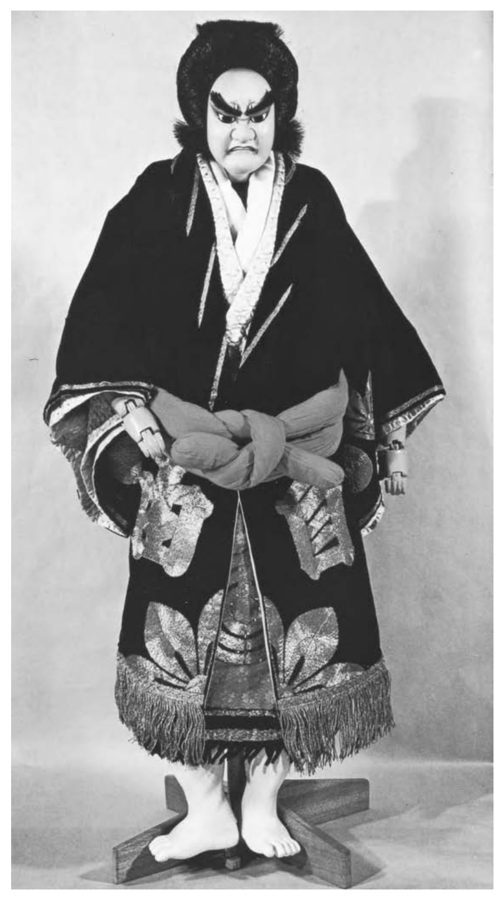
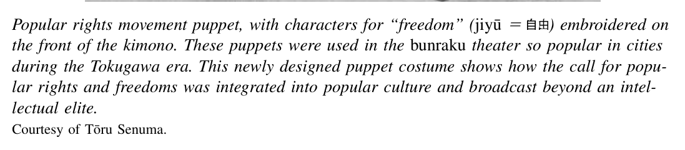
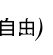
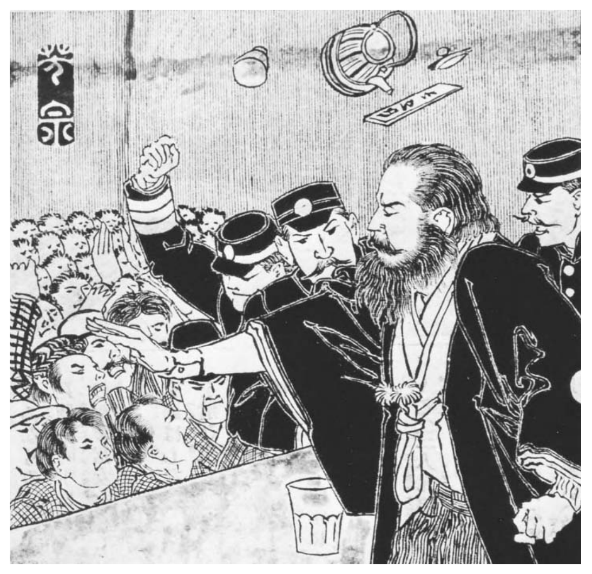

*Part 2. Modern Revolution, 1868–1905*

# 6. Participation and Protest

In Japan of the Tokugawa era, the idea that common people could play a legitimate political role hardly existed. Commoners were to be the object of political action, not actors in their own right. A good ruler kept the common people alive, but barely so. In one stern Edo era injunction, attributed to Tokugawa Ieyasu, “peasants should be neither dead nor alive.” Alternatively, peasants were likened to oil-producing sesame seeds: “The harder you squeeze them, the more you extract.”[^1] Political debate among educated samurai often centered on what one might call the “stupid commoner” problem. Thus, Aizawa Seishisai in 1825 had written:

[T]he great majority of people in the realm are stupid commoners; superior men are very few in number. Once the hearts and minds of the stupid commoners have been captivated, we will lose control of the realm.... The barbarians’ religion [Christianity] infiltrated Kyushu once before, and spread like the plague among stupid commoners. Within less than a hundred years, 280,000 converts were discovered and brought to justice. This indicates how fast the contagion can spread.[^2]

What to do to keep the plague of barbarians from capturing the hearts and minds of the stupid commoners? Aizawa’s solution in the early 1800s was certainly not to seek commoner loyalty by drawing them into politics as active participants. He wanted to indoctrinate them more thoroughly than before with a sense of the glorious essence of the emperor and their need to be loyal to him.

The Meiji political elite extended Aizawa’s reasoning in some very important ways. They came to anchor the new political order in the absolute sovereignty and transcendance of the imperial institution. But in order to do this, they sought to keep the emperor outside of politics and above it. The effort contained contradictions and a certain danger. The logic of the emperor-centered polity offered the potential for various actors to claim to represent the imperial will.

Despite (and in some ways because of) government efforts to contain and indoctrinate the populace, the Japanese political world was quickly opened up to far more of the “stupid commoners” than the early Meiji leaders—not to mention Aizawa—could have possibly envisioned. Already in the early 1880s popular movements had some impact on the critical decision to promulgate a constitution. In the late 1880s political agitation in the streets of Tokyo derailed diplomatic negotiations to revise the unequal treaties between Japan and the Western powers. In 1890 a parliament, called the Diet, was opened. Elected representatives immediately began to play a significant political role. The political debates and practices of the first decades of the Meiji era opened the way to this unexpected outcome.

## Political Discourse and Contention

Already in the closing decades of the Tokugawa era, the door to legitimate political participation was being pushed open a few significant cracks in practice and in theory. Daimyo¯ large and small had been invited to offer opinions to the bakufu on how to handle the black ships of Perry and their long-nosed passengers. A belief that an expanded public was entitled to play a role in politics also spread beyond the daimyo¯ elite. In the 1850s and 1860s, samurai of various ranks and some of the more affluent commoners in the cities and countryside were meeting at a variety of sites to discuss contemporary issues. Their activities were diverse. Schools, study groups, and cultural groups such as poetry circles were among the most important incubators of a sense of political awareness in the late Tokugawa countryside. Many people, not only the privileged or powerful, were gripped with a sense that great change was approaching. They came to feel concerned and sometimes even moved to act.

Especially as the fall of the bakufu loomed imminent in 1866 and 1867, people from all walks of life came to believe that vast, unpredictable changes were on the way. In the final months of Tokugawa rule, showers of good luck charms and impromptu carnivals in city streets were signs of this vague expectation of change. More focused and immediately relevant were proposals worked up in several domains to create deliberative assemblies. These bodies were supposed to play a major role in any new governing structure. Among the most important was Sakamoto Ryo¯ma’s plan, supported by the Tosa and Echizen daimyo¯, for a bicameral national assembly. The upper house would be composed of court nobles and daimyo¯. Samurai and perhaps even commoners would be represented in the lower house.

As the new government anxiously looked to consolidate its power in early 1868, its leaders knew very well that such proposals, and the desire to participate, were widespread among allies as well as potential opponents. They were anxious both to tap into and to control these energies. One very important brief statement of such a strategy was the Charter Oath of 1868 (also called the Five-Article Oath), issued in March in the name of the emperor after considerable internal debate by the new government. It read as follows:

By this oath we set up as our aim the establishment of the national weal on a broad basis and the framing of a constitution and laws.

1. Deliberative assemblies shall be widely established and all matters decided by public discussion.

2. All classes, high and low, shall unite in vigorously carrying out the administration of affairs of state.

3. The common people, no less than the civil and military officials, shall each be allowed to pursue their own calling so that there may be no discontent.

4. Evil customs of the past shall be broken off and everything based upon the just laws of Nature.

5. Knowledge shall be sought throughout the world so as to strengthen the foundations of imperial rule.

This remarkable document, especially articles 3–5, expressed a spirit of reform that informed the revolutionary changes imposed by the new government over the next decade. Equally important were the first two articles. They promised to involve some portion of the population in a process of “public discussion” (in Japanese, ko¯gi). This was to be carried out in “deliberative assemblies” with unspecified powers. These ambiguous promises were touchstones for much of the political contention of the following decades. Political activists within and outside the government struggled to give the articles specific meanings that suited their interests and visions.

The government, for its part, later in 1868 built on the vocabulary of the Charter Oath when it founded a bicameral “national deliberative assembly” (the Ko¯gisho). This body was comprised of two houses, along the lines of the Tosa proposal of two years earlier. The assembly was appointed, not elected, but it had legislative powers. The new rulers modified the governing structure several times over the next two decades. This first assembly was discontinued early on, by July 1869. A second consultative assembly replaced this body. It lasted for about a year before it, too, was adjourned permanently. But the early Meiji government had at least nodded in the direction of “widely established” deliberation by creating such assemblies.

Simultaneously, those outside the government looked to realize the promise of the Charter Oath with great enthusiasm. The question of whether to create a constitutional order was a central concern of the expanding world of public debate in the early Meiji years. Of greatest interest was the possible place of assemblies and popular representatives within a constitutional system. Debate on these matters played out in the thriving new forums of opinion journals and newspapers of what has come to be called the “Japanese enlightenment” of the 1870s.

In this decade a vigorous and partisan press emerged. The first daily newspaper in Japan, the Yokohama Mainichi Shinbun, was established in 1871. A daily newspaper began publication in Tokyo the following year. Called the Nichinichi (Daily) News, it is predecessor to today’s Mainichi Shinbun. Such publications quickly became the center of public debate over the direction of the Meiji government. They called for establishment of a parliament. Less political and more commercially oriented papers began publishing at the end of the 1870s, with the founding of the Asahi Shinbun in Osaka in 1879 (this paper also survives to the present). These newspapers quickly developed mass circulations. The ensuing competition led to mergers of many smaller papers. By the end of the 1870s, a core of powerful newspapers was located in Tokyo and Osaka, and local papers were found in most prefectures.

Translations of Western books formed an important part of this expanding cultural output. A vast range of political thought was translated. By the late 1870s curious readers could dip into the works of John Stuart Mill and Jean-Jacques Rousseau. Works of conservative German statism and the social Darwinism of Herbert Spencer were translated and found enthusiastic readers among an increasingly educated public.

The most important single publication of the 1870s enlightenment was probably the Meiji Six Journal (Meiroku Zasshi). The most important intellectual voice of this journal, and indeed of the entire Meiji era, was certainly Fukuzawa Yukichi. The journal took its name from the year of its founding (1873). It was published by the Meiji Six Society, of which Fukuzawa was a founding member. He and his colleagues played an immensely important role in both introducing and promoting Western ideas in Japan. Fukuzawa’s many writings are estimated to have sold a total of several million copies from the 1860s to 1890s. His Conditions in the West, published in three volumes from 1866 to 1870, was a best-selling introduction to Western institutions, customs, and material culture. His major works of the 1870s, Encouragement of Learning and Outline of Civilization, promoted a vision of a new Japan marked by a spirit of practical learning, free and skeptical inquiry, and a spirit of independence and equality of opportunity among the population.

At the heart of the writings of Fukuzawa and colleagues such as Nishi Amane and Nakamura Masanao (who introduced the utilitarian ideas of John Stuart Mill to Japan) was a belief in the inevitability and value of “progress” toward a state of “civilization.” These men saw the nation-states of the contemporary West as the forefront of world civilization. They valued the strivings of individuals in Japan not so much for the sake of individual happiness as for their contribution toward national progress and strength.

## Movement for Freedom and People’s Rights

From the 1870s into the 1880s, such ideas mixed with earlier hopes for expanded participation and social renovation to spark much political debate. The most significant political drive was the “movement for freedom and people’s rights.” This was a beast of many faces, a varied series of popular initiatives that posed a major challenge to the new Meiji government. Two fundamental questions concerned the politically aware men, and some women, who sustained the popular rights movements. First, what sort of new political structure should be adopted? Second, who would participate? Discussion very quickly focused on the need to write a fundamental document that would answer these questions, that is, a constitution.

By the early 1870s, a simple logic framed virtually all political discourse, both among those serving in the government and those on the outside. The strongest states in the world were in the West. They had constitutions. Japanese people wanted to form a strong state, so they needed a constitution, too. The premise of this syllogism was that national power was of primary importance. Constitutions were seen by the rulers, and by most of those who objected to the narrow base of the new government, not mainly as guarantees of individual freedom and happiness or welfare. They were at their root documents whose basic laws would contain and mobilize the energies of the populace on behalf of a great national mission to build wealth and power.

From 1872 to 1873 a consensus in support of adopting a constitution of some sort emerged within the government. At almost the same time, and with a particular plea for a representative assembly, the call for a constitution became the rallying cry for a variety of non-government, or anti-government, organizations. These were formed in localities scattered around the country. They gradually came to coordinate their efforts and form the national networks that comprised the core of the Movement for Freedom and Popular Rights. As the new Meiji leaders gradually concentrated political power in the hands of a narrow group of former samurai from Satsuma and Cho¯shu¯, the popular rights activists were able to make increasingly credible charges that a new “Sat-Cho¯” dictatorship had replaced the old Tokugawa tyranny.

The first local popular rights group was founded in the former Tosa domain in early 1874 by Itagaki Taisuke. The group was called the Patriotic Public Party (Aikoku Ko¯to¯). The priority given to the concept of patriotic action on behalf of the nation is significant. Itagaki had left the government several months earlier in a rage when the plan to invade Korea was overturned. Unlike Saigo¯ Takamori, who took his anger in the direction of armed rebellion, Itagaki and his allies submitted a memorial to the government calling for a national assembly. They argued that free discussion and representative government were necessary to build a strong nation, as in this statement in their famous “Memorial on the Establishment of a Representative Assembly” of January 1874:

The object which our government ought therefore to promote is by the establishment of a council-chamber chosen by the people to arouse in them a spirit of enterprise, and to enable them to comprehend the duty of participating in the burdens of the empire and sharing in the direction of its affairs, and then the people of the whole country will be of one mind.[^3]

This manifesto won wide attention. Itagaki himself gained a reputation as the premier advocate of parliamentary constitutional government. The reputation was only partly deserved. Itagaki was an opportunist who more than once left his fellow activists in the lurch to return to the government with high rank. His organizing began with a relatively narrow base of support, primarily among former samurai. In addition to calls for political reform, he focused on winning relief for the once-proud, now impoverished samurai. Further, despite the calls for free deliberation, some former samurai supporters of the movement inherited the violent spirit of the bakumatsu “men of action,” for whom pure motives were sufficient to justify dramatic acts of political terror.

Itagaki’s initial organizations soon collapsed. But by the late 1870s, a fast-spreading interest at the grass roots of society in a constitution and parliament sustained a renewed movement for popular political participation. In the years from 1879 to 1881, in particular, local activists formed nearly two hundred political societies in the cities and countryside. Members included both farmers and former samurai. They undertook an unprecedented popular mobilization that gradually came together into two national political parties, with all the features of such bodies except the chance to contest national elections. They had dues-paying members in local units. They wrote bylaws to allow local groups to send representatives to national conventions to hammer out a platform and action program. These groups held rallies and founded journals. Leading members barnstormed on speaking tours of the Japanese countryside, holding grand fund-raising banquets with local supporters. They also collected tens of thousands of signatures on hundreds of petitions demanding a constitution and a parliament, which they submitted to the government.

In addition, the popular rights movement gained power by appropriating traditional symbols for its cause. Supporters performed plays with Tokugawa-vintage bun-raku puppets, whose kimono were adorned with the written characters for “freedom”

(jiyu¯). New children’s rhyming songs echoed the call for popular rights. And the ideas of many activists mixed Confucian concepts of the ruler’s obligation to practice benevolent government with Western ideas of natural human rights in political affairs.

What was particularly noteworthy about political life in Japan at this time is the self-generated activity of so many people at the grass roots of society. They came together in ad hoc study groups to read and debate, to write petitions or manifestos, or even to draft model constitutions. Some met in relatively elegant townhouses in Tokyo. Others met in crude rural huts. Some of their efforts lay buried in storehouses for the better part of a century, finally to be discovered in recent years by scholars practicing a so-called people’s history, which searched for the political creativity of common people in such documentary remains.

Popular rights activity took place in a variety of forums. Groups called “industrial societies” were formed in the countryside to discuss issues such as new farming techniques, cooperative experimental stations, or high rates of taxation. Landowners and leading local families were usually the organizers. Typical members included village heads, teachers, local merchants, shrine officials, and doctors. The government decision to establish a Ministry of Agriculture and Commerce in 1881 was a step to coopt and control such local energies.

Popular political education and activism also took place in city-based study groups. These were comprised primarily of journalists and educators, often former samurai, who made up the urban intelligentsia of the Meiji era. The most famous study societies evolved into Japan’s leading private universities: Fukuzawa Yukichi’s

¯ group developed into Keio University, and Okuma Shigenobu’s organization formed the core of Waseda University.

Parallel to these urban academic groups were many rural cultural societies and political associations. These were the most numerous organizing units of the political ferment for popular rights. In contrast to those in rural “industrial societies,” the members of these study groups tended to be former samurai. They read and discussed political philosophy as well as economic and agricultural texts. Often their deliberations led to a decision to take action, most typically in the form of submitting a petition to the Meiji government calling for a constitution and popular assembly.

The total membership of such organizations was a small minority of the entire population of Japan. But measured against the standard of the Tokugawa past, it seems appropriate to regard the glass of political activism in the 1870s and 1880s as half full rather than half empty. A larger portion of the populace than ever was engaged in the great political issues of Japan’s modern emergence.

First and foremost among the issues so intensely debated was the place of the emperor. What would his powers and role be, in relation to bureaucrats, parliament, and the populace as a whole? With the rare exceptions of intellectuals strongly influenced by the model of France and its Declaration of the Rights of Man and Revolution, in Meiji Japan one finds no “republicans” in the classic sense of that term. That is, all parties to the political debate wanted the emperor to be a sovereign figure at the center of the political order. But there were vigorous discussions of how such an order was to be arranged, and one finds rather little evidence of the taboos and sense of awe that later came to be so oppressive in any discussion of the emperor. Some local groups talked freely of sharply restricting the emperor’s powers. One of the most famous “draft constitutions” was discovered in a farm storehouse outside the town of Itsukaichi in 1967. It included an article giving the national assembly power to “pass judgement on and revise proposals emanating from the bureaucracy and from the Emperor.”[^4]

The proper extent of rights and powers of the people was the second, closely related issue at the center of public debate. The privately drafted constitutions typically provided for elected assemblies with powers over the purse and some authority to make treaties with foreign nations, draft legislation, and control the executive branch. For example, the Itsukaichi document, considered to stand on the moderate side of the various drafts discovered in recent decades, stipulated that

if the government transgresses the constitutional principles of religion, morality, freedom of belief, and individual freedom, or if it does not respect the principle of the equality of all people and the right to property as written in the constitution... then the national assembly shall have the power to argue resolutely against... and prohibit such acts.[^5]

This was not a very practical legal provision. It did not specify who would decide when the government “transgresses constitutional principles.” But it is a clear example of a grassroots interest in limiting the power of the state.

The peak of popular rights activism came from 1880 to 1881. Groups all around the country collected at least 250,000 signatures on more than one hundred petitions submitted to the government in Tokyo. Hundreds of local organizations joined into a national federation that organized three “preparatory conventions” in Tokyo. The delegates to the third such gathering met in October 1881. They declared themselves a “political party,” the Liberal Party (Jiyu¯to¯), and immediately held their first national convention. The party platform called for popular sovereignty and the convening of a constitutional convention.

¯ A few months later, in early 1882, a second group coalesced around Okuma Shigenobu. This former samurai activist from the domain of Hizen had just been ousted from his position as government minister, in part because he advocated a constitution that provided for a powerful parliament on a British model. His Progressive Party (Kaishinto¯) was more moderate than the Liberal Party in its demands. It had strong support among the emerging business elite.

It is no coincidence that in October 1881, precisely as this political mobilizing was reaching a peak of intensity and size, the Meiji government had the emperor announce that a constitution would be written and promulgated by 1890. The leaders who took this step were spurred by a sharp sense of crisis. In 1879 Yamagata Aritomo had written to Ito¯ Hirobumi that “every day we wait, the evil poison [of popular rights agitation] will spread more and more over the provinces, penetrate into the minds of the young, and inevitably produce unfathomable evils.”[^6] Two years later, in 1881, Ito¯’s trusted aide, Inoue Kowashi, wrote in a similar spirit. He wanted the government to quickly write a conservative, state-centered constitution:

If we lose this opportunity and vacillate, within two or three years the people will become confident that they can succeed and no matter how much oratory we use...

public opinion will cast aside the draft of a constitution presented by the government, and the private drafts of the constitution will win out in the end.[^7]

The popular rights movement was an important factor influencing the timing and direction of the government’s decision to adopt a constitution. But the Meiji leaders were not simply caving in to the opposition. They had already decided that constitutional government was needed to secure international respect for Japan and to mobilize the energies of the people behind projects to build a “rich nation and strong army.” In 1878 they took a first step in this direction by establishing elected prefectural assemblies nationwide, with advisory powers only. The government hoped thereby to win the support of the rural elite of property owners (voting rights were limited to those who paid the highest land taxes). In fact the assemblies often became hotbeds of popular rights agitation.

The unprecedented popular rights campaigns of petitioning and speechmaking influenced the decision to adopt a constitution in two ironic ways. First, they led the government to adopt repressive censorship laws. The first set was promulgated in 1875. These were tightened the following year and reinforced once more in 1887. Second, the campaigns also intensified the determination of government figures to write a conservative constitution modeled on the Prussian constitution of 1854. This document gave the king and his ministers much power and limited the rights of the people. For the Meiji rulers to write a constitution that upheld their vision of limited civil rights and marginal popular participation was not particularly difficult. Actually using the constitution to enforce such a vision would prove much harder.

## Samurai Rebellions, Peasant Uprisings, and New Religions

Several other sharp challenges to the authority of the new government took place in these decades. Volatile reactionary demands to stem the pace of change or turn back the clock exploded in the 1870s. Commoners opposed to the military draft destroyed registration centers. Those upset at compulsory education and local school taxes demolished thousands of newly built schools. In addition, several rebellions of the expropriated former samurai took place in the mid-1870s.

These samurai uprisings had some motives and goals in common with the less violent popular rights agitation. They shared anger at being left out of the decision-making process. Frustrated former samurai in the 1870s saw two ways to influence the new government. Some tried to write new rules of participation. Others forced the issue with swords and guns. In addition, both the popular rights activists and the samurai rebels shared a very bellicose stand on foreign policy. They were in fact more aggressive than those in the government. Thus, when the debate over a Korean invasion split the government in 1873 both Itagaki Taisuke and Saigo¯ Takamori quit their posts. Itagaki launched the popular rights movement. Saı¯go eventually led an armed rebellion.

Saigo¯’s insurrection, the Satsuma rebellion, was the largest of several. In 1874 another member of the war faction who left the government, Eto¯ Shinpei, led a force of twenty-five hundred warriors in an attack on the prefectural government of Saga

Police interrupting a speaker at a popular rights rally in the 1880s draw the wrath of the crowd for this suppression. In response to the agitation for popular rights, the government tightened censorship laws and stationed police observers on the stage at all political rallies. Speakers who crossed the line of acceptable rhetoric with strong anti-government statements were first cautioned, and then halted. For audience members, part of the excitement of attending these rallies was the possibility of watching or joining such a raucous moment. Courtesy of Meiji Shinbun Zasshi Bunko¯, Faculty of Law, University of Tokyo.

(in Kyushu). They wanted to reinstate their daimyo¯ and reclaim their samurai stipends. Similar but smaller insurgencies, each involving several hundred former samurai, took place in Kumamoto and Fukuoka prefectures in 1876, also both in Kyushu. All these actions were quickly suppressed by troops of the new government, and the leaders were executed.

During these years, Saigo¯ himself returned to his home of Kagoshima (the former Satsuma domain), also in Kyushu. There he founded a private military academy. His local support was so strong that Kagoshima prefecture had effectively seceded from the national government by 1876. The prefecture forwarded no taxes to Tokyo. It ignored other social reform orders of the Meiji government. Then, in the winter of 1877, Saigo¯ set off with a force of fifteen thousand soldiers from Kagoshima on a march ultimately headed for Tokyo. His goal was to overthrow the government and restore samurai privilege. As the rebels proceeded through strongly anti-government territory into the neighboring prefecture of Kumamoto, Saigo¯’s army quickly mushroomed to forty thousand men. It attacked the government troops who occupied Kumamoto castle. This siege failed when a large government army (over sixty thousand men) arrived to reinforce the local garrison. Three weeks of bloody fighting ended in a massive defeat for the rebels. They suffered about twenty thousand casualties. More than six thousand goverment soldiers were killed, and ninety-five hundred were wounded. Saigo¯ committed suicide rather then be captured and executed. To this day, he remains a popular hero, revered as an exemplar of pure motives and loyalty to a cause, however hopeless. But his defeat made it clear that there would be no turning back to the old social order. Farmer conscripts had proven their worth against the samurai troops. Armed resistance to the new government was widely recognized to be impossible.

Even so, the poverty suffered by some farmers in the following years led them to raise arms against vastly superior forces on several occasions. These peasant uprisings were sparked especially by high levels of debt suffered by tenant farmers and small-scale producers of silk cocoons. Government economic policies of the early 1880s brought on sharp deflation. Rice and raw silk prices fell to roughly half their 1880 levels by 1884. Since overall prices fell by just one quarter, farmers who depended heavily on revenue from the sale of rice and silk products fared worse than others. Ambitious small landholders, sparked by dreams of just a bit more income in a new era of opportunity, had already taken loans to convert hillside fields to mulberry production for raising silkworms. They suddenly had to borrow even more simply to pay their taxes, which did not decrease with deflation. Many defaulted and lost their fields to moneylending landlords.

In numerous prefectures, especially in the silk-intensive regions in the Kanto¯ region, these farmers organized groups with names such as Debtors Party or Poor People’s Party. They demanded that creditors, usually local landlords, reduce or cancel their debts or suspend demand for payments. The largest uprising took place in the Chichibu region about fifty miles west of Tokyo. In early November 1884, six thousand men raised a ragtag army. They attacked and destroyed government offices and debt certificates. Marching from village to village, they drew in new supporters and trashed the homes of moneylenders. Local police were overwhelmed. The government eventually called in the army, and after about ten days the Meiji state’s troops put down this rebellion rather easily. Five leaders were later tried and executed. A number of local Liberal Party members took part in these rebellions, and some of the rebels called themselves “soldiers of the Liberal Party.” The party’s national leadership was not involved, but they nonetheless disbanded the party rather than risk accusation of supporting insurrection.

In addition to armies of samurai rebels and parties of poor farmers, a number of powerful new religions constituted a third challenge to the new government. Some of these, such as the Tenri and Konko¯ religions, had been founded in the late Tokugawa ¯ decades. Others, such as the Maruyama and Omoto religions, emerged early in the Meiji era. By the late 1870s the Maruyama and Tenri organizations each claimed several hundred thousand adherents. These religions typically began when a founding figure, often a woman, became possessed of divine inspiration and wrote down or dictated the sacred scripture of the sect. Their teachings often called for restraint in this life in the expectation of salvation in the next. But as in Tokugawa times, they also preached messages of present-day deliverance through a sudden equalization of wealth, so-called yonaoshi, or “world rectification.” They shared fury at the inequitable social and economic system with supporters of the Debtors and Poor Farmer’s parties. On occasion this led to similar sorts of violent action and rumors of organizational links. In one incident in 1884, for example, just a week after the Chichibu uprising, supporters of the Maruyama sect in Shizuoka prefecture demanded immediate equalization of wealth and launched attacks that destroyed government offices.

These challenges to the new regime had complex social and regional sources. Former samurai, wealthy farmers, and poor farmers were three groups behind popular rights activism, while the former samurai and indebted farmers were main supporters of armed rebellion or new religions. Ironically, samurai resistance, whether through the popular rights movement or via rebellion, was strongest in the areas of greatest support for the 1868 restoration. These samurai, in Kyushu and Tosa above all, had expected to play a role in the new government that they brought to power. When they became disillusioned at its course, or felt excluded, they were more likely than others to act. Peasant protests were greatest in areas of commercialized farming, especially silk-producing regions where farmers were most vulnerable to the fluctuations of national and international markets.

## Participation for Women

The turbulent social responses to the Meiji revolution also involved extensive questioning of gender roles and ideologies. Horror at the anarchic mixing of men and women in the West had been apparent in the writings of some of the earliest Japanese official travelers. In 1860, for instance, Muragaki Norimasa wrote this account of a bakufu mission to the United States, which was entertained at a ball at the State Department:

Men and women moved round the room couple by couple, walking on tiptoe to the tune of the music. It was just like a number of mice running around and around. It is indeed odd that the Prime Minister should invite an ambassador of another country to an event of this sort! My sense of displeasure is boundless; there is no respect for order and ceremony or obligation.[^8]

He was equally aghast when a young American woman had the impudence to quiz him rather naively about Japanese political and social customs at a state dinner.

Despite such views, the new government cautiously encouraged select women to play an active role in support of its programs. It included five young women (ages nine through sixteen) in the group of students who accompanied the Iwakura Mission. These youths stayed on in the United States to receive an American education and become model women for constructing a new Japan. Compared to the young men who accompanied the mission, they received less attention and support. One returned almost immediately; one died in America. Two returned and married comfortably into the ruling elite, leaving little independent legacy. But the youngest of these students, Tsuda Ume (nine years old when she left Japan), became a powerful figure promoting expanded social roles for women. Upon her return, she founded a college for women today known as Tsuda University, and she became a leader in women’s education.

In these same years, a vigorous debate on appropriate roles and rights for women and men unfolded among those outside the government. At least in the documentary sources left to historians, this debate began with men discussing how women ought to be treated. The best known forum was the Meiji Six Journal. Some of the most important intellectuals of the time, including Fukuzawa Yukichi and Mori Arinori (later to be minister of education), wrote on the meaning of equality between men and women, the value of education for women, and the demerits of legally recognizing concubines and giving their children rights of inheritance.[^9] Opinions on all these issues ranged widely. But as in the West in the late nineteenth century, the mainstream of reformist sentiment was decidedly cautious. Contributors to the Meiji Six Journal took care to distinguish between equal respect for men and women in their separate spheres, which they usually encouraged, and equality of political or legal rights in society at large, which they rarely favored. Commentators feared that the latter would only bring divisive conflict between the sexes and destroy social harmony. Consider, for example, this 1875 essay by Sakatani Shiroshi:

The words equal rights, therefore, should not establish equality in life generally, although they may provide equality in the bedchamber. If today we establish this equality between the sexes in all aspects of life, we shall reach the point where the men will strive to oppress the women while the women attempt to oppress the men.... In sum, the word “rights” includes evil.[^10]

Some women took their own steps to give meaning to the concepts of civilization and enlightenment that had been put forward in the first instance for men only. In one example, the early Meiji government promoted dramatic change in personal grooming for samurai men in 1871. It issued an order “encouraging them” to abandon the old top-knot for a Western haircut. Once the emperor did this, most samurai men followed his model. Some women in Tokyo then decided to make a similar change on their own. They organized an association calling for shorter and more practical hairstyles. They set an example with their own short cuts. The government responded in 1872 by outlawing short hair for women. According to this order of the state, even older women who had health reasons to wear short hair had to get a license to do so, at least if they were to go to a barbershop or hairdresser for the procedure.

Other women took demands for change into the political forum of the Movement for Freedom and Popular Rights. For a brief span from the late 1870s into the early 1880s, women played a significant role both as speakers and in large numbers as members of the audience at popular rights rallies. A few stalwarts, most famously Kishida Toshiko and Fukuda Hideko, began to make well-attended speeches advocating equal political and legal rights for women and men. Kishida condemned what she called outmoded notions of “contempt for women and respect for men.” She defined “progress” and “civilization” as a situation in which women would have political and economic rights on a par with men. She called for education for women and equality within the family. She attacked the legality of concubines, which gave a man’s wife and her children no greater claim on the husband’s resources than a mistress had.

Fukuda later recalled in her autobiography:

Listening to her [Kishida Toshiko] speech, delivered in that marvelous oratorical style, I was unable to suppress my resentment and indignation... and began immediately to organize women and their daughters... to take the initiative in explaining and advocating natural rights, liberty, and equality... so that somehow we might muster the passion to smash the corrupt customs of former days relating to women.[^11]

For the men in the popular rights movement, a speaker like Kishida was both a threat and an opportunity. She increased the likelihood that the government might crack down on the movement. But she was a marvelous draw who brought enthusiastic and curious crowds into lecture halls or open-air rallies.

For their part, the Meiji rulers by the 1880s had concluded that their own wives might play a semipublic role as models and representatives of the nation to the world. Muragaki’s shock at American dancing in the 1860s became an old-fashioned attitude. Elite men and women took up ballroom dancing and entertained foreigners at grand parties in the heart of Tokyo. And in public discussions among men, even in the government, the idea that women might support the nation with a political role had some support. Top officials as well as journalists discussed whether it might not be appropriate for female as well as male children in the imperial line to ascend to the throne. In the mid-1880s some prominent government figures supported this idea.

The two major popular rights parties both collapsed in 1884 because of factional infighting, the taint of association with peasant rebellions, and state repression. Their leaders soon regrouped. But the close alliance between male party politicians and activist women was not revived, even after the constitution was promulgated. Women interested in political or social action turned to activity as teachers or writers or organized nominally apolitical groups such as the Tokyo Women’s Reform Society.

The government was in large part responsible for this retreat in women’s political activity. It decided to limit imperial succession to males. On the eve of promulgating the constitution in 1889, it issued a series of laws that barred women from joining political organizations, speaking at or attending political gatherings, or even sitting as observers in the Diet gallery. These measures provoked a flurry of outraged commentary by leading women educators and social reformers, such as Shimizu Toyoko and Yajima Kajiko. They particularly ridiculed the ban on observing Diet proceedings. They asked: Did this mean that Japan’s male elites expected their own behavior to offer a harmful example to observers? A number of male politicians and journalists echoed this question. The government backed down on this one point and allowed women into the Diet gallery. But most men in the popular rights movement were closer to their government colleagues than to their erstwhile female allies in their discomfort with the notion of political rights for women; the other more substantial prohibitions remained in force.

As Japan’s rulers were promoting change, they were anxiously seeking to manage and control it. A fear of allowing women to transgress narrow boundaries of proper place and behavior remained powerful. The rulers’ ambivalent reformism was partic ularly strong when it came to defining appropriate roles for women in realms as personal as hairstyles and as political as speaking at public rallies.

## Treaty Revision and Domestic Politics

Although the two parties that emerged at the forefront of the popular rights movement both collapsed in 1884, energetic popular activism continued through the decade. If anything, despite the folding of the Liberal and Progressive parties, the government’s ability to impose its will against popular wishes decreased in the late 1880s. Nowhere was this as clear as in the tortured effort to negotiate more equal treaties with the Western powers. The government’s plan to partially revise these treaties in the mid-to late 1880s sparked opposition and emotional discussion of Japan’s proper place in the world. In addition, like the controversial question of the constitution in the 1870s, the treaty issue in the 1880s stimulated powerful demands for a political order that respected the popular will.

The Iwakura Mission had failed in its effort of 1873 to open negotiations to revise the “unequal treaties.” For the rest of the decade, the government focused on more limited goals. It offered to open more ports to foreign trade if the Western powers would return partial Japanese control over tariffs. The British refused any concessions, and these efforts came to naught. In the early 1880s a new foreign minister, Inoue Kaoru, pleaded with more success for a multi-national conference in Tokyo to discuss treaty revisions. Ministers from all the treaty powers finally gathered in Tokyo in May 1886. By the following April they had drafted an agreement that Japan could regain tariff autonomy and nearly complete jurisdiction over the treaty ports. In exchange, Japan would open all its territory to foreign residence and commerce.

There were two crucial limitations in the agreement. First, it called for the Japanese government to submit the text of the new Japanese legal codes, just being drafted at that time, to all the powers for their inspection before new treaties could take effect. In addition, the agreement committed the Japanese government to hire foreign judges to sit in Japanese courts and hear cases concerning foreigners. A vociferous chorus of protest arose in response. People complained that these conditions allowed intolerable ongoing violation of Japanese sovereignty. One key government official, Minister of Agriculture and Commerce Tani Kanjo¯, quit his post in anger at the proposed changes. He blasted them as worse than the status quo. He became a somewhat reluctant popular hero. Former Liberal and Progressive party activists renewed their organizing nationwide. They flooded the government with petitions against treaty revision on these terms. The major newspapers ran fierce anti-revision editorials. Roughly two thousand youths streamed into Tokyo to protest the proposed changes. They held demonstrations and mass visits to government offices. In the words of one official, “The hearts of the people are stirred to an extreme degree, and this invites the collapse of the cabinet.”[^12]

In the face of this protest, the government was indeed forced to abandon the proposed revisions, and Inoue resigned as foreign minister.

¯ His successor, Okuma Shigenobu, fared little better. He managed to negotiate a slightly more favorable set of revisions with the treaty powers in 1889, but these also ran into a mixed reaction within the government and strong opposition outside it.

Once again, petitions demanding completely equal treaties poured into the capital. In October 1889, a member of an ultra-nationalist political organization, the Genyo¯sha,

¯ hurled a bomb at Okuma and then committed suicide by cutting open his stomach. ¯Okuma lost a leg but survived. The government abandoned the revision plan, and the cabinet resigned.

The participants in the turbulent politics of treaty revision mixed the fierce, violent politics of the bakumatsu “men of action” with a Western-style politics of editorial writing, petitioning, and lobbying. They ranged from knowledgeable democratic nationalists to small-time thugs looking for action. They carried forward an enduring anti-foreign sentiment and loyalty to the emperor from the final years of the Tokugawa era. They combined these older views with a new belief that only a political system that gave freedom and political rights to the people could bring national strength and international respect.

## The Meiji Constitution

As the government polished the final drafts of the constitution, these agitations—which forced two cabinet ministers to resign—vividly reminded the Meiji rulers of the messiness and danger of popular participation in politics. It is no surprise that the document formally promulgated in a grand ceremony in 1889 was written and presented in a way that sought to maximize the power of the state and minimize that of the people.

The constitution was drafted secretly in 1886 and 1887 by a talented group under the direction of Ito¯ Hirobumi and Inoue Kowashi. Ito¯ had studied European constitutions in Europe. He brought first-rate foreign legal advisors back to Japan, most prominently a German professor of law, Hermann Roessler. The document was discussed by top government officials in 1888 in a body newly created for this purpose, the Privy Council. This council continued to function as an extra-constitutional advisory group once the constitution was promulgated. It served as one site where the Meiji leaders could manage the political system. This small group of leaders came be know as the Meiji “oligarchs” (genro¯ in Japanese), a term coined by the press in 1892. The original oligarchs were the key men, such as Ito¯ Hirobumi and Yamagata Aritomo, who had come to dominate the cabinet and the bureaucracy in the 1880s. The genro¯ were an informal body, in the sense that there was no constitutional provision for them. But informal did not mean ambiguous or unclear. The identity of the oligarchs was well known.[^13] For the rest of their lives, they continued to pull the strings of politics, but as they grew older they stepped back from the front lines of political battle to positions such as leadership of the Privy Council.

The constitution was handed down, quite literally, as a gift from the emperor to his prime minister and the people on February 11, 1889. It began, in the preamble, with an unequivocal declaration of imperial sovereignty: “The right of sovereignty of the State, We have inherited from Our Ancestors, and We shall bequeath it to Our descendants.” Cabinet ministers were to be responsible to the emperor and not to the Diet. However, the prospect of direct imperial despotism was checked in a general way in the preamble, which went on to state that “Neither We nor [our descendants]

shall in the future fail to wield the [rights of sovereignty], in accordance with the provisions of the present Constitution and of the law.” In the constitution itself, the power of the bureaucracy in relation to the throne was bolstered by the requirement that cabinet ministers cosign all imperial orders. The constitution gave a special independence to the military general staff, via the “right to supreme command.” This was article 11, which specified that the military was directly responsible to the emperor. The constitution granted a variety of civil rights to the people. All of these, however, were made conditional on “limits established by law.”

The Diet itself was composed of an elected House of Representatives and a House of Peers. In preparation for the latter, the government had instituted a European-style system of peers in 1885. It variously titled about five hundred prominent court, government, and military officials as prince, marquis, count, viscount, and baron. Members of the House of Peers consisted of some of these figures, in addition to distinguished individuals appointed by the emperor and a handful of the highest taxpayers in the nation. This house was intended to be one more restraint on popular participation.

Even so, the constitution left important room for the electorate to assert its wishes. The definition of eligible voters was to be set by law, and the Diet had power to write and pass laws. It also had the crucial power to approve or veto the annual state budget. The government created a loophole with a clause that provided for the previous year’s budget to automatically take effect if the Diet failed to pass the new budget. But as costs of government steadily increased, this escape hatch was of little help. Once the constitution took effect, the Meiji oligarchs were forced to take heed of the wishes of Diet representatives far more than they had expected or hoped.

The promulgation of a constitution and the convening of an elected Diet meant that Japan was a nation of subjects with both obligations to the state and political rights. Obligations included military service for men, school attendance for all, and the individual payment of taxes. Rights included suffrage for a few and a voice in deciding the fate of the national budget. The fact that these rights were limited to men of substantial property is important. Under the first election law, only about 1 percent of the total population paid sufficient taxes to qualify for the vote. Clearly the constitution was expected by its authors to contain the opposition. But to stress only the limitations placed on popular rights by the Meiji constitution is to miss its historical significance as a source of future change. The undeniable fact was that a constitutionally mandated, elected national assembly—with more than advisory powers—now existed. This clearly implied that a politically active and potentially expandable body of subjects or citizens also existed. Indeed, as the oligarchs decided to adopt a constitution, they were acutely aware that such a body politic was in the process of forming itself and developing its own ideas about the political order.

## Footnotes

[^1]: Furushima Toshio, Nihon ho¯ken no¯gyo¯shi (Tokyo: Kowa Shobo, 1947), p. 83.

[^2]: Bob T. Wakabayashi, Anti-Foreignism and Western Learning in Early Modern Japan: The New Theses of 1825 (Cambridge: Harvard Council on East Asian Studies Monographs, 1986), p. 211.

[^3]: Soyejima Taneomi et al., “Memorial on the Establishment of a Representative Assem bly,” in Japanese Government Documents, ed. W. W. McLaren, published in Transactions of the Asiatic Society of Japan 42, Part 1 (1914) pp. 426–432.

[^4]: Irokawa Daikichi, The Culture of the Meiji Period (Princeton, N.J.: Princeton Univer sity Press, 1985), p. 101.

[^5]: Irokawa, Culture of the Meiji Period, p. 111.

[^6]: Cited in Stephen Vlastos, “Opposition Movements in Early Meiji,” in The Cambridge History of Japan, vol. 5, The Nineteenth Century, ed. Marius Jansen (Cambridge: Cambridge University Press, 1989), p. 411.

[^7]: Cited in Richard Devine, “The Way of the King,” Monumenta Nipponica (Spring 1979): 53. vol. 34, No. 1.

[^8]: Cited in Masao Miyoshi, As We Saw Them: The First Japanese Embassy to the United States (1860) (Berkeley: University of California Press, 1979), p. 71.

[^9]: These various essays are available in William Braisted, ed. and trans., Meiroku Zasshi: Journal of the Japanese Enlightenment (Cambridge: Harvard University Press, 1976).

[^10]: Braisted, Meiroku Zasshi, p. 395, quotes Sakatani Shiroshi, “On Concubines,” March 1, 1875.

[^11]: Cited in Sharon Seivers, Flowers in Salt (Stanford, Calif.: Stanford University Press, 1983), p. 36.

[^12]: Inoue Kiyoshi, Jo¯yaku kaisei: Meiji no minzoku mondai (Tokyo: Iwanami shoten, 1955), p. 117.

[^13]: The original seven oligarchs (genro¯) were Ito¯ Hirobumi, Kuroda Kiyotaka, Matsukata ¯ Masayoshi, Oyama Iwao, Saigo¯ Tsugumichi, Yamagata Aritomo, and Inoue Kaoru. In the early 1900s, Katsura Taro¯ and Saionji Kimmochi were added to their ranks.

