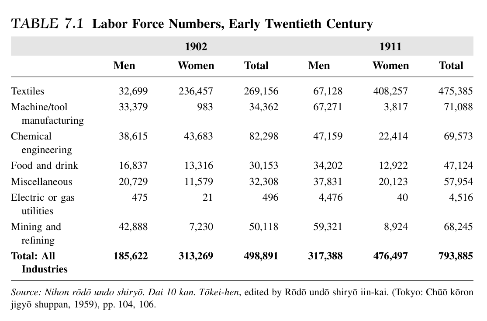
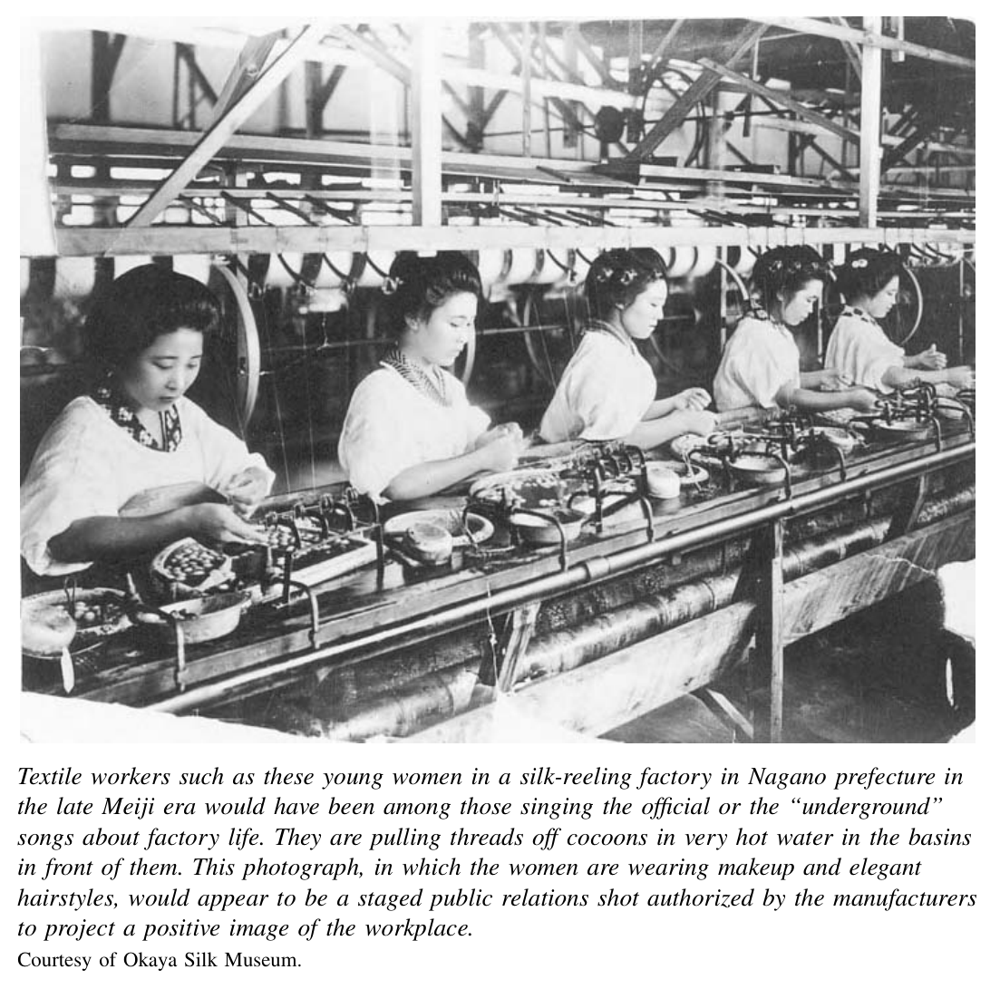
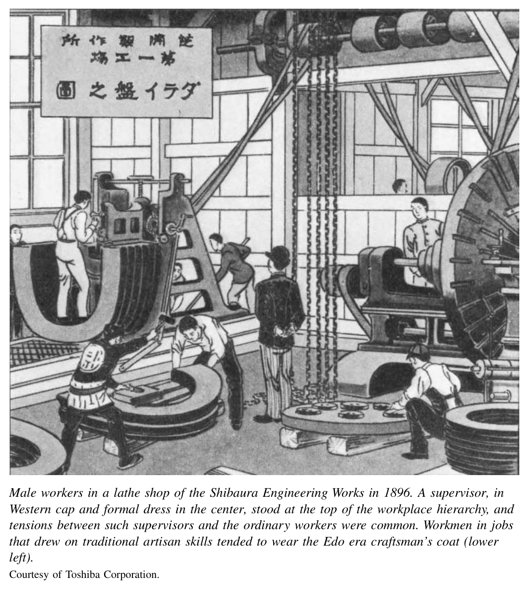
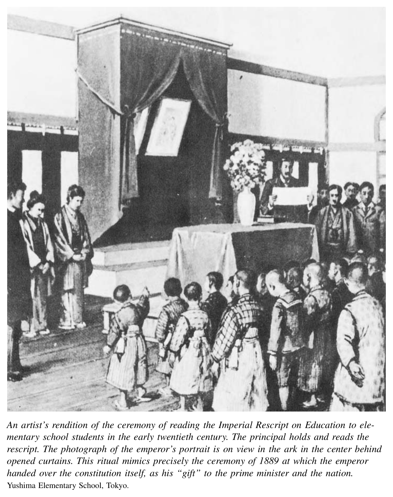

*Part 2. Modern Revolution, 1868–1905*

# 7. Social, Economic, and Cultural Transformations

In just three decades, from the 1860s to the 1890s, the Japanese economy emerged as an Asian powerhouse. It came to be called “the Workshop of Asia,” a cliche´ that persisted far into the twentieth century. By the 1890s, textile manufacturers dominated home markets. They began competing successfully with British firms in China and India, as well. Japanese shippers were competing with European traders to carry these goods even to Europe.

Taking a long view, the economic takeoff of Meiji Japan was a formidable achievement. This is the case whether one compares Japan to other countries or compares the standards of living within Japan in the 1860s to those of decades later. But the immediate impact of the industrial revolution was disastrous for many people in Japan. Especially hard hit were members of two large, overlapping groups: small-scale family farmers and young women workers. Huge numbers of farmers lost their lands to moneylenders, and hundreds of thousands of teenage girls experienced the hardship of labor in the thread mills, the weaving sheds, the match factories, and the expanding brothels of the new Japan.

A divided judgment applies also to the cultural transformations of these decades. Japanese writers and artists embraced new forms from novels to oil painting, while older traditions from poetry writing to bunraku chanting showed ongoing vitality. But a profound anxiety that something was being lost in the headlong rush to a Western-focused modernity surfaced with increasing intensity in the 1880s and 1890s. This worry pushed intellectuals to improvise new concepts of Japanese “tradition.” It also linked up with the fear of social disorder and political challenge among state officials. They responded by putting in place oppressive limits on individual thought and behavior.

## Landlords and Tenants

Agrarian society played a critical role in the economic transformation of Meiji Japan. It was a vital source of the labor power, food, tax revenues, and export earnings that made the industrial revolution possible.

From 1880 through 1900 Japan’s population rose from about thirty-five to forty-five million people. At the same time, the rural, agricultural population declined slightly. Millions of people migrated from villages to towns or from towns to major cities. They moved as well from agriculture to commerce and manufacturing industries. Given these shifts, a demographic crisis could be avoided only by food imports or increased domestic output. Until about 1920, Japanese farmers supported the growing population with increased output. Agricultural productivity steadily increased for two reasons. The best practice of existing farms, previously limited to the most advanced areas, diffused more broadly. In addition, new crops, new seeds, and more fertilizer came into use. The precise extent of the increased productivity of land is a subject of controversy. Estimates of annual increase in output vary from 1 to 3 per-cent.[^1] Even if the lower estimate is more accurate, the productivity gain was substantial and crucial. It fed a growing population. It also preserved scarce foreign exchange for imports of industrial and military technologies rather than food.

In fact, the agrarian sector was a crucial source of state tax revenues used for a wide range of modernizing projects. The land tax accounted for about 80 percent of government income in the 1870s and early 1880s. This fell to around 60 percent by the early 1890s when new taxes were imposed on consumer goods, including necessities such as soy sauce and salt and virtual necessities such as sugar and sake. But taxes on agricultural land still provided the majority of the government’s revenues.

Simultaneously, farmers brought in crucial foreign exchange by exporting tea and silk products. A silk blight in Europe in 1868 opened the way for a booming export trade in silk cocoons raised in small sheds on family farms. When the European blight ended, the emphasis shifted to exports of silk threads. Between 1868 and 1893 Japanese raw silk production rose almost fivefold, from 2.3 million pounds to 10.2 million pounds. Most of this was sold overseas. Silk accounted for 42 percent of all Japanese export revenues during this quarter-century.

Agriculture had a further indirect economic impact through the export of people. After tea and silk, the third highest source of foreign exchange earnings in Japan around the turn of the century came from emigrant laborers who sent a portion of their earnings in Hawaii, California, or Latin America to relatives in their home villages.

Silk thread was often spun and woven in small factories in rural locations. The owners and operators were members of an entrepreneurial rural elite. The members of the upper crust of agrarian society played a crucial role in building a capitalist economy in Japan. They invested in and ran factories, paid large amounts of taxes, and sent their children on to higher education. Their educated sons, in particular, went on to leading positions in business, politics, or bureaucracy. They also foreclosed on high-interest loans to impoverished neighbors, and they hired the daughters of such farmers to work fourteen-hour days in spinning and weaving sheds. These landlords were playing a part in a much larger story of economic policy and its social consequences.

The huge costs of putting down the Satsuma rebellion, on top of the numerous costly projects to build the economy and military, left the Meiji government faced with a drastic revenue shortfall in 1878. It responded first by printing money. The result was a surge of price inflation. This only worsened the deficit, since tax revenues were based on land assessments that did not automatically rise with inflation. The real value of taxes fell. Japanese farmers briefly prospered.

In 1881 Finance Minister Matsukata Masayoshi, one of the surviving Satsuma activists of the 1860s and among the most important Meiji leaders, launched draconian fiscal and monetary policies. Seeking to halt the inflation, he cut state expenses sharply. By 1880 the government had already fired most of the foreign advisors hired in the 1870s. It now sold off the unprofitable government industries that these advisors helped build. Matsukata also shrunk the money supply by shutting down the printing presses that had produced cheap paper money in the late 1870s and returning to a silver-backed currency.

The result has come to be called the Matsukata deflation of the early 1880s. Agricultural commodity prices crashed by as much as 50 percent by 1884. To survive, small-scale landholders took new loans from moneylenders who were often nearby wealthy landlords. Thousands defaulted and lost their fields to these neighbors. One response was the wave of rebellion led by the Debtors or Poor Farmers parties in places such as Chichibu.

A related result of the great deflation was a dramatic shift in landownership. Like the rise in agricultural production, the precise increase in the number of tenant farmers is still subject to debate. A conservative estimate holds that the proportion of agricultural land worked by tenants rose from 30 percent in the late 1870s to 40 percent in the late 1880s. Even by this account, at least one-tenth of the arable land of Japan changed hands in one decade. The financial program of shock therapy indeed stabilized Japan’s economy by the end of the 1880s. It was also a devastating experience for millions of people.

## Industrial Revolution

The Meiji state had begun to put in place the infrastructure of a capitalist industrial economy by the early 1880s. It continued to build the economic foundation over the next two decades: railway lines, a new code of commercial law, specialized banks to provide long-term credit to industry. But relatively small numbers of private investors struggled with limited success to produce manufactured goods profitably through the rest of the 1880s. Then, in the two decades spanning the turn of the century, Japan’s industrial economy took off. Manufacturing output rose 5 percent annually over these years. This was a much stronger performance than the worldwide annual growth rate of 3.5 percent. Japan’s production even outpaced that of the United States, where industry was also booming. American manufacturing doubled from 1895 to 1915. In Japan manufacturing rose 2.5 times over the same period.

Industrialization was led by the textile industry. From the 1890s through 1913, output of silk quadrupled. By the eve of World War I, three-fourths of these threads were produced by machine, whereas earlier most silk had been reeled by hand. In addition, about three-fourths of silk output was being exported each year. Production of cotton thread increased at similar rates. Mechanized production also replaced hand spinning. And about half of the cotton output came to be exported, mainly to China and Korea.

Coal and metal mining was a second leading sector in Japan’s early industrial era. Mineral production in Japan increased 700 percent from 1876 to 1896. After textiles mills, mines were the nation’s major employers of wage labor. About half of the output from coal fields in Kyushu and Hokkaido provided fuel to Japanese factories. Most of the rest supplied steamships calling in Japanese ports. In addition, by the early twentieth century, the Ashio copper mine and refinery was one of the largest producers of this metal in the world.

A revolution in transport supported these new industries. By the late 1880s, Ja-pan’s railway lines extended over one thousand miles. By 1900 the total stood in excess of thirty-four hundred miles. The building of this rail system was a formidable technical feat in a mountainous country. And the rail system promoted other industrial ventures, most importantly textiles and coal mining, by lowering the transport cost of raw materials to factories and cutting the cost of sending finished goods to domestic markets and to harbors for export.

Rapid industrialization brought with it important innovations in social and economic organization. A boom in private railroad investment in the late 1880s sparked a more generalized “private company boom.” Between 1886 and 1892, private investors established fourteen new railway companies. The total length of private lines was more than double that of government lines. This investment boom spread to spinning and mining and beyond. The experience taught some investors hard lessons in how to organize joint stock companies or trade in the stock market when the “enterprise mania” culminated in Japan’s first modern financial crisis in 1890. The stock market crashed. Many poorly conceived speculative enterprises failed. But the boom also had some enduring impact. Most of the new railroad companies were solid ventures. They and a number of other new businesses survived the panic of 1890 to become leaders in the private sector of the economy.

The most distinctive feature of Japan’s emerging system of capitalism was the central role played by monopolies that later came to be called zaibatsu (the term literally translates as “financial clique”). Several of the zaibatsu—most notably Mitsui and Sumitomo—had roots in merchant houses dating back to the Tokugawa era. Others, including the famous Mitsubishi zaibatsu, were founded from scratch by entrepreneurs in the Meiji era. In all cases, it was the 1870s and 1880s when these combines began to coalesce in their modern form. Their founders exploited long-standing close ties to the government and synergistic links between key industries to found their business empires. The Mitsui family, for example, had been dry-goods retailers in Kyoto and Edo since the 1670s. They had been moneylenders to the shogunate through the end of its days. In the 1860s, Mitsui’s general manager cultivated ties to antishogunal forces as well. The family built on these ties after 1868. It handled a portion of the new government’s tax collection operations, and from this founded the Mitsui Bank in 1876. The same year, it founded a general trading company. Soon thereafter Ito¯ Hirobumi, the minister of public works at the time, offered Mitsui Trading Company an exclusive contract for sale of coal from the government’s Miike mine. As Ito¯ neatly put it, “We will not be tight. You can acquire the coal at cost price and get started on it directly.”[^2] Mitsui made immense profits from this arrangement. In 1888 it bought the mine outright, although it paid a handsome price to the government. It also sold much of this coal to British steamers, and these contacts helped Mitsui Trading open branch offices in Shanghai, Hong Kong, and then London. This dynamic triad of banking, mining, and trading came together in the 1880s. In the following decade, Mitsui built on this base and used its profits to acquire or found engineering ¯ (Shibaura), cotton-spinning (Kanegafuchi), and paper pulp (Oji) companies and numerous other firms.

With slight differences in emphasis—shipping, then shipbuilding and railroads, were more important to the Mitsubishi combine—other zaibatsu emerged in similar fashion in the 1880s and 1890s. Although the founding families retained financial control of the each zaibatsu complex, from the start they avoided the drag of nepotism. Owners recruited able young men from outside the family and delegated important management responsibilities to them. This practice clearly separated ownership from management of Japanese business at a comparatively early stage in modern industrial development.

Why did these highly concentrated zaibatsu emerge to such prominence? Part of the answer must be that all capitalist economies generate momentum toward concentration. A glance at the railroad, steel, oil, tobacco, and financial empires of Americans such as Vanderbilt, Carnegie, Rockefeller, Duke, and Morgan makes clear that powerful monopolies were not unique to Japan. But the zaibatsu were unusual in their broad reach. They were not limited to particular industries or even to particular fields such as finance or manufacturing. Each zaibatsu spanned the entire range of business endeavor from trade and shipping to finance, mining, and all sorts of factory production. One cannot explain their emergence simply by referring to factors found in all capitalist economies.

One persuasive interpretation links the dominant position of entities such as the zaibatsu (or the bank-centered monopolies of late nineteenth-century Germany or state-run businesses in Russia) to the relative “lateness” of Japanese, German, and Russian economic development. A late-developer, the argument goes, can only catch up and compete internationally by swiftly mobilizing scarce resources of capital, skilled labor, and technology in new industrial endeavors. Only large organizations are able to do this. In some late-developing cases, the state will play this mobilizing role. In others—such as Japan—the lead will be taken by a mix of government projects and huge private combines.[^3]

This logic of late development helps explain why the zaibatsu emerged. But it cannot fully account for the impressive performance of Japanese capitalism of the Meiji era, which was certainly unprecedented outside the West. The Tokugawa economic and demographic heritage was one factor. From well before the time of the Meiji reforms, one found widespread entrepreneurial and manufacturing skills with potential application in modern industry and a sophisticated network of commercial finance and coastal transport. In addition, population growth was slow, which allowed agricultural revenues to be shifted to new fields.

Building from this base, the ability of Japanese producers to draw from a pool of relatively inexpensive labor was a crucial part of the story. In the late nineteenth and early twentieth centuries, Japanese industry became steadily more mechanized. Nonetheless, labor productivity (the monetary value of goods or services produced by an average worker) lagged far behind the value of output per worker in advanced economies of the West. With relatively less productive workers, the only way Japan’s economy could have been competitive was if the workers were relatively low paid.

Indeed, they were. Comparatively puny wages for relatively unproductive workers was crucial to the strong performance of Japanese manufacturers in these decades.

The proactive role of the state was another important factor. The state built an economic infrastructure and provided a base for the early zaibatsu in the 1870s and 1880s. In the following years the state took the lead in promoting—indeed enabling—the development of capital-intensive, higher technology industries. This was an area in which Japan lacked a comparative advantage in labor costs. For example, through the 1890s Japanese railroad companies imported locomotives and rails from the West because Japanese ironmakers or engineering firms either did not exist or were unable to offer competitive products. In the early twentieth century, the government took key steps that changed the situation on both the supply and demand side of this economic equation. On the supply side, it used government funds to found the Yahata iron and steel mill in 1896. State funds were also used to subsidize the shipping industry as well as private manufacturers in machine-making, engineering, and shipbuilding. On the demand side, the government nationalized almost all intercity railroads in 1906. It used this control of the railroads to direct orders for locomotives and rails to Japanese producers. It simultaneously placed tariffs on competing imports.[^4] All these steps combined to nurture private sector heavy industries that otherwise would not have come into existence at this time or on such a scale.

Finally, the visible hand of the state was complemented by significant competition and entrepreneurship in the private sector. Young men inspired by dreams of great personal wealth found patrons who sent them abroad, where they apprenticed to European or American spinning mills, paper mills, engineering works, and the like. They returned home to manage factories and occupy top positions in the expanding zaibatsu. Multiple engineering and shipbuilding firms competed for government railway or naval procurements. Private steelmakers spun off from Yahata to compete with it. Tariffs offered these emerging Japanese firms some protection from foreign imports in the early twentieth century, but they were forced by domestic competitors to increase productivity and quality.

Japan’s economic growth thus depended on a dynamic mix of state and private initiative. In parallel fashion, the ethos of the business elite mixed ideals of service to the nation with a drive for personal wealth. Japanese capitalists, like state bureaucrats, did not exalt the creativity of the market pure and simple. Neither did they laud the untrammeled pursuit of profit as the ultimate social benefit. Rather, they drew on Confucian language to put forward a philosophy of what might be called “selfless” profit-seeking.

Shibusawa Eiichi made this point with particular force. He was the most important financier and industrialist of the Meiji era. As an energetic entrepreneur he introduced the concept of joint-stock companies to Japan. He founded some of Japan’s first successful large-scale textile mills, pulp mills, and private banks. Shibusawa preached the virtues of self-reliance, but he also argued strongly against the view that “through individualism or egoism the State and society can progress most rapidly.” He countered that “I cannot support such a theory.... Although people desire to rise to positions of wealth and honor, the social order and the tranquillity of the State will be disrupted if this is done egoistically.” In the words of a like-minded Meiji era trader, “the secret to success in business is the determination to work for the sake of society and of mankind as well as for the future of the nation, even if it means sacrificing oneself.”[^5]

## The Work Force and Labor Conditions

Such idealistic public statements probably reflected the sincere beliefs of many business leaders. Yet the goal of developing industry for the nation rarely led to generous treatment of working people. Female laborers—often the teenage daughters of the farm families who suffered in the Matsukata deflation—bore a particularly heavy burden.

By 1911, government statistics reported that just under 800,000 people labored in factories or mines with ten or more employees. About 475,000 of these worked in textile mills, either cotton or silk spinning or weaving. More than four out of five textile workers were women. They typically were required to live in company-owned dormitories that were locked at night. When fires occasionally broke out, these literally became death traps. A belief that women were fragile creatures was widespread among the upper classes of the time, but it had little impact on the treatment of the female textile laborers. They worked twelve to fourteen hours a day or more, compared to about twelve hours per day on average for males in industries such as machine manufacturing. Their wages were 50 to 70 percent of those paid to men in the same industry, and 30 to 50 percent of average male wages in heavy industries. Wages were based on the results of competition over output and quality. Discipline was harsh and sometimes arbitrary. Sexual harassment by male supervisors cannot be documented with numerical certainty, but it was a constant theme in the songs of these women.

Finally, the poorly ventilated mills were incubators of disease, especially tuber-

culosis, which was the AIDS of its day: debilitating, incurable, and fatal. This disease had been a chronic but limited problem in Tokugawa times. It became an acute epidemic from the late nineteenth into the early twentieth century. The means of transmission were poorly understood. Women who contracted the disease in the mills were sent home to rest, and die. They spread the plague to their home villages.

The alternative to textile labor was not a life of leisure. Those who stayed with their families in rural villages had to help out with equally or more demanding farm labor. The memoirs of many textile workers offer divided judgments. They present a grim picture of unhappiness at harsh discipline and punitive incentive wages. They also recall pleasant friendships with other workers, full stomachs, and better food than on the farm. Wages were low compared to those of men, but they were high compared to most alternative work for women, such as unpaid labor on a family farm or home-based piecework for a manufacturing broker.

One job that paid higher wages to young women was prostitution. After textiles, the sex industry was the largest employer of women in the late nineteenth century.

Prostitution was legal. Brothels were licensed and regulated by the state, although there were many unlicensed practitioners as well. At the turn of the century, about fifty thousand licensed prostitutes worked in Japan, not far below the sixty thousand women in cotton spinning mills (although less than the number in silk spinning and far less than in weaving). If the pay was relatively high, so too were the costs in health, in dignity, and in loss of freedom. Families often took substantial advances in “selling” a teenage girl to a brothel. She could not quit until the advance was repaid, which usually took three to five years.

It is not easy to discover how women workers in the early industrial era viewed their situation. Most had only an elementary education. They did not leave behind extensive memoirs. Until recent decades they have not been seen as important subjects of history writing. But some clues survive in accounts of social reformers, journalists, and government surveyors. Not surprisingly, statistical surveys of factory labor show that many women responded to poor conditions by quitting. Annual rates of turnover in excess of 100 percent of the work force were common. A famous government study, entitled Workers’ Conditions, published in 1902 using data from the Kanegafuchi Cotton Spinning Mill, the largest in Japan, offers some dramatic numerical evidence of this. At the start of the year 1900, the company employed 4,500 women. Even though it cut back the work force to about 3,500 women by the end of the year, the company was forced to hire 4,762 new workers over these twelve months because of massive attrition. Fully 4,846 female employees “escaped or fled” their jobs, 692 were fired, 255 left due to illness, and 31 (nearly 1 percent) died.[^6]

On occasion these workers came together in acts of collective protest. From 1897 to 1907, textile workers went on strike thirty-two times at spinning mills and weaving sheds large and small to demand higher wages or improved working conditions. Most of these actions lasted only one or two days, or a few hours. Few succeeded. The fact that the women lived in tightly supervised company dormitories made it difficult for them to organize protests or link up with social activists outside the factory walls. If they did protest, they were typically fired and had no choice but to return home.

The improvised songs of the textile workers were written down by observers. They reflect the attitudes that led to high quit rates and strikes. They reveal the anger and despair of the workers, but also dreams of better lives for themselves and pride in their contribution to Japan’s national income and power. This pride was the message promoted every day by the mill supervisors and recruiters. They taught an offical message to silk spinners as they hiked together across mountain passes on the way to the factories:

Raw silk, Reel, reel the thread. Thread is the treasure of the empire! More than a hundred million yen worth of exports, What can be better than silk thread? Factory girls, We are soldiers of peace. The service of women is a credit To the empire and to yourselves.

There are trials and hardships, yes, But what do they matter?

The songs that the women improvised on their own were different:

If a woman working in an office is a willow, A poetess is a violet, And a female teacher is an orchid, Then a factory woman is a vegetable gourd.

Or,

How I wish the dormitory would be washed away, The factory burn down, And the gatekeeper die of cholera, At six in the morning I wear a devil’s face, At six in the evening a smiling face. I want wings to escape from here, To fly as far as those distant shores.[^7]

Communities of skilled male factory workers also came into being in Japan’s early industrial era, although their numbers were smaller than the number of women factory laborers. By 1902, approximately 33,000 men worked in shipbuilding, machine and machine tool industries, and railroad companies. Another 40,000 worked in mines and metal refineries—alongside a significant minority of female coal miners. An additional 100,000 men labored in a wide variety of different industrial sites.

These men mixed a sense of humiliation at the condition of their lives, and even self-loathing, with pride, assertiveness, and a commitment to self-help. They were footloose. Unlike the well-known “lifetime employees” of the decades after World War II, male workers in early industrial Japan believed that the only way to become a skilled worker deserving of the name was to gain experience at a number of factories, learn diverse skills, and thus advance. These men were as quick to leave their jobs as were the textile women. But where the young women were often escaping to leave factory work altogether, the men—called “traveling workers”—were job-hopping as part of a career strategy. They typically aspired to save money and start up their own small factory. A few succeeded.

They also organized a number of strikes, and in the 1890s undertook a few short-lived drives to organize unions. A union of metalworkers founded in 1897 enrolled nearly three thousand at its peak. But turnover among members was high, and by 1899 the union was losing support. In 1900 the government passed a Public Order Police Law that made organizing difficult, and the union collapsed. Strikes and labor organizing reflected anger at dignity denied as much as a desire for higher pay. The best organized strike of the era took place among locomotive engineers at the Japan Railway Company in 1899. They argued that “our occupation is not base but noble; it should be accorded respect, not contempt.” One core demand of the workers was for a change in the wording of their job title, which conveyed an image of low-grade status in comparison to clerks and station-masters whose jobs required less skill and who bore less weighty responsibility.[^8]

Their bosses saw such skilled workers as notoriously unreliable. One manager at a major engineering firm vented his anger in a magazine for young boys after a visit to the United States in 1908. Well-educated young workers were uppity and did not know their place, he fumed. Older laborers were stubborn men who relied only on past experience, so that “teaching them anything is like trying to teach a cat to chant Buddhist prayers.” Unlike America, he claimed, where workers were docile and “carried out a job after just one order... in Japan things don’t get done without constant instructions and the lot of a supervisor is difficult.”[^9]

This negative view of workers must be viewed critically. It contrasts sharply with testimony from many workers themselves. They told of their determination to study, improve their skills, and one day open their own small workshop. The managerial view that employees were stubborn and poorly disciplined did not reflect a genuine deficit of talent or energy among laborers. It reflected the unwillingness of these workers to devote themselves to bosses who offered unreliable treatment.

## Spread of Mass and Higher Education

In the 1880s and 1890s, as protest against compulsory schooling decreased and attendance rose, the government also changed the curriculum. It became clear that commoners were using their education to read newspapers and sign petitions that criticized the government. The Ministry of Education responded with a more state-centered, moralistic curriculum. The leader in this shift away from the more liberal and pragmatic spirit of public education in the 1870s was Mori Arinori, a former Satsuma samurai who served as minister of education from 1886 to 1889. Under his leadership the ministry put in place tighter central controls over textbooks. Mori also introduced a regimented system of teacher training in government schools, complete with military drills. The government promoted Confucian ideals of loyalty, obedience, and friendship in the schools. It also turned to German advisors as it adopted a moralistic curriculum that stressed lessons of filial piety and loyalty to the state.

The culminating statement of this conservative reform came in the Imperial Rescript on Education, promulgated in the name of the emperor on October 30, 1890. The document reflected the beliefs of high government officials and their advisors that the goal of education was learning to serve society and the state. These officials argued that the early Meiji education system betrayed this objective by stressing individual initiative. But officials disagreed on the wisdom of grounding a statement of the state-centered purpose of education primarily in Confucian rhetoric. Confucian scholars such as Motoda Eifu, a tutor to the Meiji emperor, wanted to establish loyalty and filial piety as unshakeable social values. Pragmatists such as Ito¯ Hirobumi resisted a narrow imperial statement of orthodox morality. They feared it might draw the throne into political debates.

The result of this debate was a somewhat schizophrenic document. Parts of the rescript invoked core Confucian values concerning human relations:

Ye, Our subjects, be filial to your parents, affectionate to your brothers and sisters; as husbands and wives be harmonious, as friends true; bear yourselves in modesty and moderation; extend your benevolence to all....

Other phrases invoked a spirit of allegiance to the state that was common to the nationalism of nineteenth century Euro-American political systems:

... advance public good and promote common interests; always respect the Constitution and observe the law; should emergency arise, offer yourselves courageously to the State....

Binding together these moralistic injunctions to filial piety and patriotism were statements linking such values directly to the emperor and his ancestors. The rescript began with the claim:

Our Imperial Ancestors have founded Our Empire on a basis broad and everlasting, and have deeply and firmly implanted virtue....

It ended with a stirring charge:

The way set forth here is indeed the teaching bequeathed by Our Imperial Ancestors, to be observed alike by Their Descendants and the subjects, infallible for all ages and true in all places.

In the years after its promulgation, this document took on a sacred aura of remarkable power. Together with a portrait of the emperor, a copy was enshrined in every school in the nation. It was read to the assembled students on ceremonial occasions. Stories circulated of heroic school principals who risked—or lost—their lives when they dashed into burning buildings to retrieve the imperial rescript or photograph. Students had trouble making full sense of the rescript’s archaic language. But they could understand the basic messages: The imperial institution made Japan a special place and subjects should obey authorities ranging from parents all the way to the emperor.

The spirit and structure of higher education were rather different from that of the rescript and the elementary schools. By 1905, about 104,000 students, roughly 10 percent of the eligible population, went on to attend a variety of middle schools. The “normal schools” trained students, young boys as well as some girls, for careers as teachers. In addition, a huge variety of vocational middle schools prepared youths for careers as technicians, clerks, or engineers. A small minority of middle-schoolers continued to climb the education ladder by attending private and public higher schools. Some of these schools undertook to educate young women. In 1899 the government required each prefecture to found at least one higher school for girls. A number of Western missionary groups also opened higher schools for young women. The most prestigious higher schools were seven national institutions for young men. Beginning with the First Higher School, in Tokyo, these were founded between 1886 and 1901. Together they admitted 5,300 male students per year.

Beyond this, at the pinnacle of the system, stood seven imperial universities, also for men only. Among the universities, it was Tokyo Imperial University, its law faculty above all, that provided the best ticket to the upper reaches of the bureaucracy or the business world.

Schooling beyond the lower elementary level was voluntary. It was limited to those who could pass the entrance examinations and whose parents could afford the tuition and the loss of a working child’s income. Ironically, as students climbed to the higher reaches of this very hierarchical order, they were encouraged to think more freely. The higher schools and universities in particular gave the students a large degree of autonomy. Students organized the school’s extracurricular life on their own. In the classroom they were encouraged to read widely in Western philosophy and political thought. This openness at the top reflected the thinking of Mori Arinori, the minister of education who oversaw the founding of the higher schools. His goal was to nurture an elite of patriotic future leaders of the nation. He believed such people needed to learn initiative and responsibility. For this purpose, they had to be given autonomy in their formative years.

Literature offers one view of the social and psychological world of the students of this era. One of the great writers of the era, Natsume So¯seki, framed his memorable novel of 1914, Kokoro, around the experience of two generations of university-educated characters. In a tale of death and suicide, he offered a grim but powerful

statement of the alienated existence of the modern man. So¯seki’s novel was preceded by the real case of one unfortunate Tokyo Imperial University boy named Fujimura, who threw himself off the famous Kegon waterfall in 1903. He left a note that could have been written by a character in Kokoro:

Ensconced in the vastness of space and time, I with my meager body, have tried to fathom the enormity of this universe. But what authority can be attributed to Horatio’s philosophy? There is, after all, only one word for truth: “incomprehensible.” My agony over this question had brought me, at last, to a decision to die, and yet now, standing at the precipice, there is no anxiety in my heart. For the first time, I realized that great sorrow is at one with great happiness.

This suicide became a media event: Postcards, picturebooks, and souvenirs were spawned by it, as well as imitators. One historian claims there were almost two hundred death leaps from the same falls over the next eight years.[^10]

Such episodes capture only one aspect of the culture of late Meiji Japan. Other memoirs and novels (such as Soseki’s slightly more cheerful Sanshiro¯) show the city and the university as sites of dreams, adventure, and longing. Young boys, and young girls at a few private higher schools, came to the city with ambition and energy. They fell in love with its anonymity and excitement. They cherished its sense of motion and change. Reading Western literature and philosphy was a standard element of higher education at the time. It sometimes sparked a flamboyant sense of rebellion and assertion. Meiji youths read Kant, Rousseau, and Mill, among others. The decades around the turn of the century were exciting times for many youths privileged to go beyond elementary education and think about their role in the “new Japan.”

## Culture and Religion

The Meiji era drive to construct a modern nation of “civilization and enlightenment” remade the Japanese cultural landscape as well as the economy and political system. Beginning in the 1870s, government officals, educators, and artists began to explore what it might mean to “Westernize” the entire spectrum of cultural life. This sometimes took place in a force-fed spirit of “whole-package” modernization. Organizers of the Japanese military, for example, decided in 1871 that if Western armies all had military bands, and if Japan was to remake its military on Western lines, then Japanese forces had best follow suit. They quickly established a new, enduring tradition of Western-style military music. In a similar fashion, in 1880 the Meiji government engaged a Boston public school teacher to bring “proper” modern music education into the new Japanese schools. He helped prepare the first school children’s songbook in 1881. Half the tunes were Western melodies with new lyrics by Japanese poets. “Auld Lang Syne” became a syrupy ballad about “the light of fireflies.” Other songs were older Japanese melodies rearranged into Western-style harmonies.[^11]

In a similar practical spirit that mixed a commitment to building a strong nation with the vocation of an artist, important painters in the 1870s and 1880s gained government support to promote Western styles of oil painting. They drew on the experience of some Edo era painters with Western art media and styles, such as the use of vanishing-point perspective in eighteenth-century woodblock prints. The Meiji government set up art contests and schools to teach Western techniques. Also, beginning

¯ in the late 1880s Japanese writers such as Futabatei Shimei, Mori Ogai, and then Natsume So¯seki began to produce widely read works of prose fiction in forms comparable to Western novels.

New forms of theater were slower to develop, even as older forms came under fire. In Tokugawa times leading practioners of Noh theater had been patronized with stipends by the shogunate and daimyo¯. The Meiji reforms cut off this source of support, and the Noh theater briefly floundered. Kabuki had a firmer popular audience, but it too faced problems in early Meiji years. Western-oriented reformers criticized it as “decadent” (because plots were set in brothels) or feudalistic. The emphasis in the 1880s and 1890s was on “reform” of the Kabuki theater. Playwrights brought in Western dress and plots centered on modern life, but these new plays proved most unpopular.

Despite such broadly based efforts to modernize or Westernize Japanese culture, older forms persisted and even flourished, often without state support. Statistics are not available, but musical traditions from shamisen and koto playing to the chanting of puppet-theater narratives (joru¯ri) may actually have increased in popularity even as schoolchildren learned new Western tunes. The Kabuki survived its critics. Leading actors called for the preservation of the classical plays, and the Edo era repertory remained most popular.

Beginning in the mid-1880s, a drive to preserve or revive a so-called traditional Japanese culture emerged in a mood of confrontation with Western-oriented reformers. Leaders included both Westerners and Japanese. Two of the most famous such cultural missionaries to the world were Ernest Fenellosa and Okakura Kakuzo¯. Fenellosa came to Japan to teach philosophy in 1878 after graduating from Harvard University with a strong background in the history of art. He developed an abiding love for Japanese art and culture. Okakura began as his student and became a close colleague.

The two worked together for many years. As Motoori Norinaga and his followers had done in the 1700s in reaction to the popularity of Chinese thought, they articulated and vigorously promoted a notion that Japan in particular, and the Orient in general, was home to a glorious spiritual and aesthetic sensibility. This contrasted sharply in their view to the materialism of the West. More reactionary cultural conservatives picked up such themes to simply attack Western influence in Japan. Okakura and Fenellosa spoke in less combative Hegelian terms of a superior “synthesis” of a global culture that would result from the interaction of East and West.[^12]

There is an important twist in this cultural history of mid- to late Meiji Japan. Western imports coexisted, mixed, and sometimes conflicted with a resilient set of indigenous cultural forms. As this happened, many older cultural forms were dramatically reshaped. Later generations came to view these as “traditional” and typically Japanese. In the process they articulated new concepts of “Japanese-ness.” The Noh theater, for example, survived in part because government officials promoted it as a Japanese parallel to Western opera. They treated visitors such as former American President Ulysses Grant (in 1879) to command performances. Noh performance took on ritualistic aspects that had not been present before. Modern martial arts such as judo, sports such as sumo wrestling, and arts such as the cultivation of bonsai plants were both transformed in practice and took on symbolic meaning as emblems of Japanese-ness for the first time.[^13]

This modern process of inventing traditions was striking. But neither it nor the concern to preserve spiritual values at a time of materialistic modernization was peculiar to the history of Japan or of the non-Western world. In modernizing Europe no less than in Japan, artists and poets were among many who turned to their own past to find or invent spiritual traditions in the face of a modernity seen as inhumane or excessively materialistic.

Religion faced similar turmoil and transformation in the Meiji era. Evangelical religious organizations with indigenous roots, founded in the Tokugawa era, expanded dramatically in the Meiji era. Another newly energized religious movement of the Meiji era was Christianity. Approximately sixty thousand “hidden Christians” (kakure kirishitan) had survived the often fierce persecutions of the Tokugawa era. They were still practicing their faith when the bakufu collapsed. In 1873, the Meiji government repealed the bakufu’s anti-Christian laws, but offered no specific protection to religious activity. The 1889 constitution guaranteed a limited religious freedom “within limits not prejudicial to peace and not antagonistic to duties as citizens.”

In this ambiguous context, Catholic, Russian Orthodox, and Protestant missionaries returned to Japan in the 1870s. They enjoyed just moderate numerical success. Christians remained well under 1 percent of the population. But these men and women played a disproportionately large role in Japanese cultural and political life. In the late nineteenth and early twentieth centuries Christian activists became leaders of social reform movements including socialism and the labor movement. Such people were committed to following the dictates of individual conscience that in theory transcended or opposed the dictates of the state. In the face of a government that made an all-encompassing claim on the loyalty of imperial subjects, this was a brave position. It often proved impossible to sustain. Many Christians responded by defining their religion as an entirely apolitical commitment.[^14]

The Meiji state consistently took an active role in managing all religious practice as part of its effort to establish legitimacy. It created a national organization of Shinto shrines for the first time in Japanese history. The important Ise Shrine had long been associated with the emperor, but before 1868 Shinto consisted primarily of decentralized local shrines for the worship of community deities without close ties to the state. The government set up a Department of Shinto in 1868. In 1870 it issued a proclamation stating that the nation was to be guided by the “way of the kami (Shinto deities).” In 1871 Shinto shrines were officially designated as government institutions for the observance of “national rites.” Many government officials as well as religious figures questioned the wisdom of this close relationship over the next several decades. But the state continued to patronize Shinto and to stress its close links to the newly important imperial institution. The process culminated in 1900 when the Home Ministry created a Shrine Office and a nationally certified priesthood. In these ways the notion that Shinto was the ancient religion of all Japanese was invented by the modern state-builders of Meiji times, as were the institutions to promote this idea.

As Shinto was elevated and transformed, the Buddhist priesthood and worshipers faced criticism and persecution. The government ended the semiofficial status of Edo era Buddhist temples with the Separation Edict of 1868. This banned Buddhist priests from holding simultaneous positions in Shinto shrines. It replaced the Edo era requirement that every person register at a local Buddhist temple with a system of compulsory registration at local Shinto shrines. These steps crystallized a more explicit awareness among ordinary people that Shinto and Buddhist practices and dieties indeed were different. They also sparked a wave of popular attacks on Buddhist temples. These peaked in 1871 when numerous temples, statues, and relics were destroyed.

Some Buddhists fought fire with fire. They staged demonstrations and riots of their own. They demanded the freedom to preach Buddhist doctrine. They called for the ouster of Christianity. From the 1870s through the 1890s, Buddhist priests and thinkers followed contradictory impulses as they sought to protect themselves and regain popular and official support. Some issued strong calls for the state to respect freedom of religion. Others sought legitimacy by jumping on the bandwagon of a reactionary nationalism that criticized Christianity and the materialist West for destroying Asian spirituality. Still other critics took an opposite tack and condemned Christianity for betraying the rational spirit of modernity. Among the most prominent of such voices was that of Inoue Enryo¯, a philosopher and teacher. He founded an important institute of philosphical studies in 1885 and argued that Christian beliefs in a divine being were actually less rational or modern than relatively nontheistic Buddhist ideas.

## Affirming Japanese Identity and Destiny

The dizzying pace of change in Japan of the Meiji era provoked varied reactions. For some, change offered liberation and personal opportunity. For some, it offered a chance to achieve collective, national glory. For others (or for these same people at other times), change meant danger, decadence, and loss of moral virtue. Such fears broke to the surface in at least three arenas of discussion and policy: fear of political disorder, fear of gender disorder, and cultural concern to answer the question, Who are “we Japanese”?

Fear among government leaders that a restless populace might challenge their political control led to the decision for a conservative constitution modeled on Prussian lines. It sparked the push for military drills in the schools. It inspired the call for a spirit of sacrifice for the state in the Imperial Rescript on Education. Fear of gender anarchy amidst a headlong rush to modernity had surfaced early in the decision to ban women from adopting short hairstyles in 1872. It emerged again when the government sharply restricted women’s political activity in 1890.

The third great fear in the face of the changes of the Meiji era was present before Perry’s ships appeared. It was crystallized in the phrase, “Expel the barbarians.” This was the notion that outsiders from across the seas would poison the souls of Japanese people, convert them perhaps to Christianity, and demolish their true identity. In the early Meiji years, these fears were submerged for the most part. Government leaders and many others joined a rush to modernize. The dominant view through the 1870s and early 1880s was that the essence of being a Japanese patriot was to embrace change. Loyal Japanese were told to help build the army and the state along Western lines.

But lurking behind such reforming projects—and breaking to the surface in occasional rebellions—was a logic that differentiated people in Japan from those elsewhere. It lead to the question: To what ultimate end are we making these changes? As we build railroads and adopt a European-style constitution, do we have a unique identity as Japanese people? If so, what is it?

Many people raised such questions, especially from the mid-1880s onward. Some of the most pointed and thoughtful early questioners included a group of young men who in 1888 formed the Society for Political Education (Seikyo¯sha) and began to publish a magazine called The Japanese. These writers feared that as the nation followed a path toward so-called civilization, it might “forfeit our national character and destroy all elements of Japanese society.” As one wrote: “What is today’s Japan? The old Japan has already collapsed, but the new Japan has not yet risen. What religion do we believe in? What moral and political principles do we favor? It is as if we are wandering in confusion through a deep fog, unable to find our way.”[^15]

Fears of political disorder, gender anarchy, and the loss of a cultural soul resolved themselves to some degree, although never definitively, around the turn of the century. By this time a sort of political, social, and cultural orthodoxy was articulated widely by political leaders such as Ito¯ Hirobumi and by major journalists and scholars as well.

First and foremost, these anxieties were met by a turn toward the emperor as a political and cultural anchor. The Meiji oligarchs unambiguously anchored the political order in the emperor, who invoked “the supreme power We inherit from Our Imperial Ancestors” to promulgate an “immutable fundamental law” in the form of the constitution.

The symbolic management of the imperial institution was a risky project. On one hand, the oligarchs desperately wanted to keep the emperor above politics so that their opponents could not do as they had done in the 1860s, and turn the emperor against the government. Simultaneously, they were committed to using his image and words to ensure political order, as in the Imperial Rescript on Education. And just as some in the government had feared, a small incident within months of the rescript’s promulgation sparked a huge controversy. In January 1891, an “installment ceremony” for an imperially autographed copy of the rescript took place at the First Higher School in Tokyo. The principal asked all present to bow to the imperial signature. But Uchimura Kanzo¯, a Christian and an English teacher at the school, aware that the constitution guaranteed “freedom of conscience” to all subjects, refused to do so. He believed that such a bow amounted to “idol worship” and violated his faith.

Within a few days, a huge storm of protest at this act of disloyalty erupted in the press. Uchimura soon repudiated his action and repeatedly made public bows to the rescript on other occasions. But the outcry eventually forced Uchimura to resign his position. The incident prompted some of the nation’s most prominent philosphers and educators to defend the forced bow to the rescript as a constitutional act. They argued that the moral essence of both documents was a public one. Obedience to the state and emperor, that is, was presented as the highest secular obligation, one that transcended private ethics or religious belief.

Parallel to its efforts to elevate and reinforce ultimate imperial authority, the state dealt with fears of gender anarchy and its desire for loyal subjects of both sexes by articulating an important new concept aimed at women. This was the ideal of the “good wife and wise mother.” A member of the Meiji Six Society, Nakamura Masanao, first put forward this slogan. It had restrictive implications of course. A woman’s vocation was to be that of nurturer. Her role was to be centered on the home. Women were barred from politics, from inheritance, and from any independent legal standing in civil law.

But the idea that the primary duty of women was to serve in the twin roles of good wife and wise mother was not purely reactionary or restrictive. In some ways it was an innovative effort to change the role of women in a new era. In Tokugawa Japan, women, especially samurai women, had been seen as relatively unteachable and not much in need of formal education. They were not given any public role of importance. In the Meiji formulation, wise women needed schooling. To raise children well in a new era, the mother had to be literate. She had to know something of the world beyond the home. If her sons were to serve the state in the military, the home had to play a quasipublic role as incubator of these soldiers. The notion of “good wife, wise mother” that Meiji government officials began to promote aggressively around the turn of the century was new in that women were to be educated. It was also new in that women’s work at home, and also in the factory, was valued as a form of service to the state.

The imperial institution took part in this project to prescribe new roles for women and for men. The emperor gave the signal that men could wear Western haircuts by adopting that style himself. The empress mixed old and new styles of personal grooming. On one hand, her traditional hairstyle signaled to women that they should keep their hair long and braided up. On the other hand, her Westernized facial appearance encouraged women to stop shaving their eyebrows or blackening their teeth. Both raised hair and blackened teeth had been marks of beauty in the elite culture of the Tokugawa era and before, but the latter practice was changed with support from the throne in the face of Western examples and criticisms.

Beyond politics and gender, people such as Okakura, Fenellosa, and the writers in the magazine The Japanese at the turn of the century began to define “Japanese culture” as the essence of their identity. Like the ideology of “good wife, wise mother,” this was not a purely reactionary turn. The men in the Society for Political Education agreed that Japan’s government should build national economic and military strength by using Western technology. But they also developed an idea of particular “Japanese” values that should be cultivated in the process. Perhaps the most powerful value was said to be a unique conception of beauty, an aesthetic sense rooted in art and the natural environment. A special aesthetic and moral sense could serve as a cultural anchor in a time of great change. Such concern to defend “Japanese-ness” reinforced stereotypes of feminine virtue as well, for Japan’s traditional culture was defined by such writers in feminine terms centered on beauty and grace. From the late nineteenth century to the present day, this desire to define a Japanese essence has been a near constant concern, at times an obsession, of Japanese intellectual and cultural life.

Official orthodoxy was neither perfectly secure nor unchallenged. Despite the promulgation of the Imperial Rescript on Education with its stress on loyalty, and its oppressive interpretations and uses, dissenters did emerge in the following decades. They ranged from feminists to socialists and communists. They would challenge the orthodoxy of imperial supremacy and win thousands of adherents. But it is certain that the political and cultural reactions of late Meiji restrained these trends. They defined and limited the cultural as well as social and political terms of debate, as people sought to make sense of the continuous changes that were now part of Japan’s modern condition.

The Meiji changes remain among the most controversial topics in Japanese his tory. In 1968, the Meiji centennial set off a ferocious debate on whether one should celebrate anything at all. The shadow of World War II defined this debate, and to some extent it still does. Critics argued that an authoritarian, emperor-centered Meiji system of politics and culture combined with an economic order that impoverished the peasantry and limited the domestic market to pave the road to a disastrous war fifty years later. Since the 1960s, a more positive view of the Meiji era has become widespread in Japan and abroad. This narrative of progress stresses that in 1889 Japan became the first non-Western nation to adopt a constitutional political system, while at roughly the same time it became the first non-Western industrial, capitalist economy. These were indeed impressive political and economic achievements. After all, much of the non-Western world at this time was subjected to increasing economic and political subordination under the expanding hegemony of Euro-American nation-states. Some of the “advanced” Western nations were no less authoritarian than the new Meiji system. But like all modern revolutions, the changes of the Meiji era left a complex legacy of progress and pain.

## Footnotes

[^1]: See James Nakamura, Agricultural Production and the Economic Development of Ja pan, 1873–1922 (Princeton, N.J.: Princeton University Press, 1966), and Henry Rosovsky, “Rumbles in the Rice Fields,” Journal of Asian Studies (February 1968): 347–60. vol. 27, No. 2

[^2]: Cited in Eleanor Hadley, Antitrust in Japan (Princeton, N.J.: Princeton University Press, 1970), p. 35.

[^3]: Alexander Gerschenkron, Economic Backwardness in Historical Perspective (Cam bridge: Harvard University Press, 1962), ch. 1, pp. 5–30.

[^4]: For a more detailed account, see Steven J. Ericson, The Sound of the Whistle: Rail roads and the State in Meiji Japan (Cambridge: Harvard Council on East Asian Studies, 1996).

[^5]: Shibusawa Eiichi and Morimura Ichizaemon, both cited in Byron Marshall, Capitalism and Nationalism in Japan (Stanford, Calif.: Stanford University Press, 1967), pp. 35–36.

[^6]: This report is cited in Hazama Hiroshi, Nihon ro¯mu kanri shi kenkyu¯ (Tokyo: Ochan omizu shobo, 1978), p. 277.

[^7]: E. Patricia Tsurumi, Factory Girls: Women in the Thread Mills of Meiji Japan (Prince ton, N.J.: Princeton University Press, 1990), pp. 93, 97, 99.

[^8]: Thomas C. Smith, Native Sources of Japanese Industrialization 1750–1920 (Berkeley: University of California Press, 1988), p. 257.

[^9]: Cited in Andrew Gordon, The Evolution of Labor Relations in Japan (Cambridge: Harvard Council on East Asian Studies, 1985), p. 83.

[^10]: Donald Roden, Schooldays in Imperial Japan: A Study in the Culture of a Student Elite (Berkeley: University of California Press, 1980), pp. 165–73.

[^11]: William P. Malm, “Modern Music of Meiji Japan,” in Tradition and Modernization in Japanese Culture, ed. Donald Shively (Princeton, N.J.: Princeton University Press, 1971), p. 259–77.

[^12]: John M. Rosenfield, “Western Style Painting in the Early Meiji Period and Its Crit ics,” in Tradition and Modernization in Japanese Culture, pp. 181–219.

[^13]: See Stephen Vlastos, Mirror of Modernity: Invented Traditions of Modern Japan (Berkeley: University of California Press, 1998).

[^14]: See Irwin Scheiner, Christian Converts and Social Protest in Meiji Japan (Berkeley: University of California Press, 1970).

[^15]: Statement by Tanabashi Ichiro¯, cited in Kenneth Pyle, The New Generation in Meiji Japan: Problems of Cultural Identity, 1885–1895 (Stanford, Calif.: Stanford University Press, 1969), p. 66.

