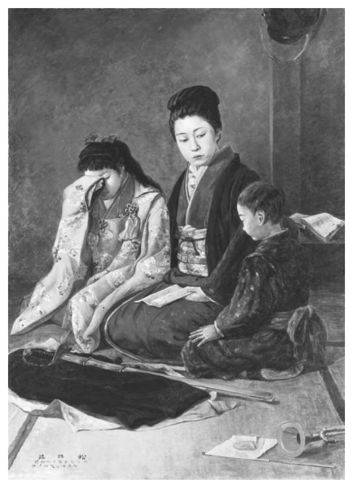
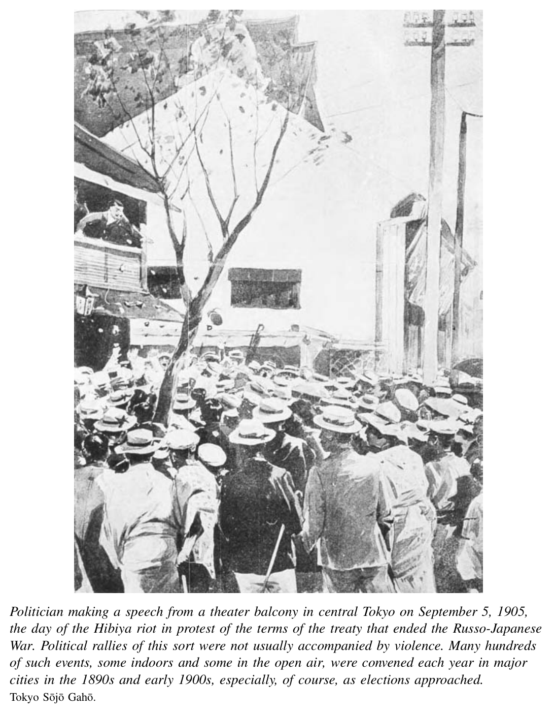
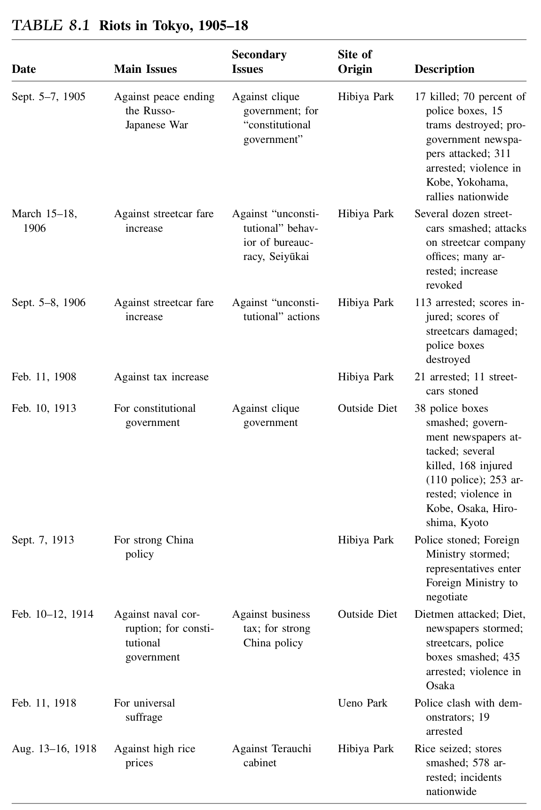
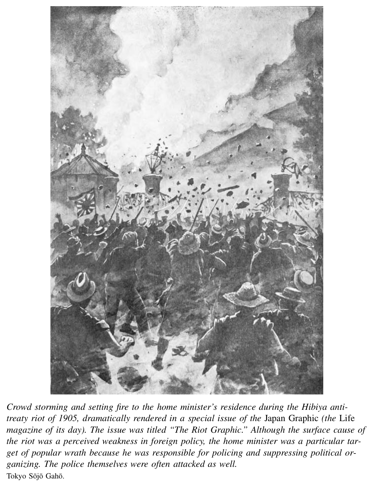

*Part 2. Modern Revolution, 1868–1905*

# 8. Empire and Domestic Order

The Meiji revolution transformed the domestic space of Japan. Railroads linked the countryside in newly intimate fashion to ports and urban centers such as Tokyo, Yokohama, Osaka, and Kobe. The Meiji revolution also transformed the relationship between Japan and the world. By the end of the nineteenth century, Japan had shifted from a relatively marginal position to a dominant place in Asia. It was seeking control over Korea and had won colonial control over Taiwan. It gained formal equality with the Western powers by revising the unequal treaties, and it established a strategic position as junior partner to the British. It both absorbed and exported products and people, importing grain from Korea, selling textiles to China, and both sending and receiving men and women to and from Asia and the Americas as laborers and students. People in Japan were making themselves an integral part of a broader East Asian and global system.

Just as Japan’s domestic transformation had global causes and consequences, its drive for empire had domestic roots and ramifications. The nation-building projects described in the previous chapters inspired a new patriotism among masses of Japanese people. This bolstered the assertive external agenda of the government. Nation-building projects also sparked calls for participation and reform, which struck the same rulers as threatening or even subversive. They responded with programs to shore up the domestic social and political order. They also made empire a potent symbol of the identity and unity of the Japanese people.[^1] In these ways, imperialism reflected and also contributed to a changed relationship of Japanese subjects to their state.

## The Trajectory to Empire

The most important focus of Japanese overseas activity in the 1870s and 1880s was the Korean peninsula. In 1876, Japan employed gunboat diplomacy to force the Treaty of Kanghwa on Korea. This opened three ports to trade with Japan and gave the Japanese extraterritorial jurisdiction. Both the process and the result were little different from those pursued by Commodore Perry in Japan two decades before. Japanese traders used this opening to economic advantage. They sharply expanded exports to Korea, primarily by reselling European manufactured goods first imported to Japan.

They also began to import significant amounts of rice and soybeans from Korea. Japan was the destination for about 90 percent of exports from Korea through the 1870s.

The Japanese government sought to forge a close political relationship to Korea in the 1880s, which would supersede Korea’s intimate and dependent ties to China rooted in the centuries-old tribute system. Its goal was to promote a regime in Korea that was independent of both China and Russia and deferential to Japan. In the strategic thinking of Yamagata Aritomo, the most important geopolitical strategist among the Meiji leaders, Korea was to be part of a buffer “zone of advantage” protecting Japan’s home-island “zone of sovereignty.”

As one step to secure this zone, in 1881 Japan sent military advisors to help modernize the army of the Korean court, at the time led by the reform-minded King Kojong. He and his top aides were impressed at the modernizing projects underway in Japan, but they faced powerful conservative and anti-foreign opposition. Over the following years, political turmoil left Korea vulnerable to outside pressures. The Japanese government, members of Japan’s mainstream political opposition, and Japanese political adventure-seekers and gangsters with shadowy ties to the government all sought to exploit this opening. In 1882 anti-foreign opponents of the king killed several of the Japanese military advisors and took power in a coup. The Japanese responded by forcing the new government to offer an indemnity and accept Japanese troops stationed in Seoul to protect Japan’s diplomats there.

Both the Japanese government and private citizens continued to support the reformist “independence” faction in Korea. Its members understood independence somewhat differently from the Japanese. They wanted greater independence from the Qing rulers in China as well as independence from other foreign powers, Japan included. But they were interested in Japanese assistance, and some of their leaders had received education and funding in Japan. Support for the reformers set the Japanese against the conservative Korean government, which still accepted a close relationship with China. It also pitted Japan against the Chinese rulers, who were intervening far more in Korean politics than they had in their long-standing role as patron of a tributary state.

In 1884 one reformer, Kim Ok-kyun, led a coup d’e´tat with secret promises of support from the Japanese legation in Seoul. Kim had been influenced by Fukuzawa Yukichi in Tokyo a few years before. Fukuzawa had advised him to promote nationalism and modernize Korea along Japanese lines. Kim’s rebel forces assassinated conservative ministers and seized the Korean king, but two thousand Chinese troops intervened to put down his coup. Crowds of Koreans angry at the Japanese role behind the uprising joined the counterattack. They killed ten Japanese military advisors and about thirty other Japanese residents.

The Japanese press and political organizations responded with furious calls for revenge. Japan and China were close to war. Some former Liberal Party activists even organized private militias. They hoped to send these across the sea to promote Korean “independence.” But in the government, the bloody and economically disastrous Satsuma rebellion was still a fresh memory, and a major military buildup was just underway. The Meiji rulers were reluctant to send their forces overseas just yet. Neither did they want private adventurers to get out of hand. In the Osaka Incident of 1885, Japanese police thwarted a secret plan to lead a militia expedition to Korea. They

¯ arrested the key conspirators, including Oi Kentaro¯, a popular rights activist, and Fukuda Hideko, a leading advocate of women’s rights. The government also upset domestic opponents by reaching a compromise agreement with China in 1885, the Li-Ito¯ pact. This was concluded between Ito¯ Hirobumi and the Chinese minister in charge of Korean affairs, Li Hongzhang. The two sides pledged to take their military forces out of Korea and offer advance warning of any plan to return.

These incidents of 1881 through 1885 established a pattern that would repeat itself several times over the next twenty-five years as Japan carved out a colonial empire in Asia. The Japanese press and political opponents of the government would put forth a rhetoric of Asia-wide (pan-Asian) solidarity as they beat the drums on behalf of causes such as Korean independence from China or Asian equality with the West. Their vision of Asian unity placed Japan in charge, as tutor and military hegemon. The Japanese government would rein in but not repudiate such voices, as it moved more cautiously in a similar direction. Korea would remain the principal but not the sole overseas site of expanding overseas control. It was the place where the Japanese military, diplomatic officers, and civilian “patriots” opposed the Chinese, the Russians, the British (who also sought a foothold on the peninsula), and of course the Koreans. Many of the latter developed a forceful new nationalism that rejected Chinese as well as Japanese, Russian, or any foreign domination.

One key to explain the timing of the Japanese push was the ongoing project to build a powerful military, both as a force to keep order at home and as an instrument of empire. In the 1880s and early 1890s, the government funded a substantial buildup of the navy as well as the army. In addition, Yamagata consolidated institutions of military command that were as insulated as possible from popular and Diet control. Looking to German models, he founded elite officer training academies and a military general staff with direct responsibility to the emperor. This structure gave the military field command considerable independence from the prime minister and even from the ministers of the army and navy.

In the short run, Yamagata’s policies put in place a relatively cautious military command. These men resisted the more reckless popular jingoists. They used force outside Japan only in favorable situations. In the long run, the lack of external constraint would enable the military itself to engage in reckless bids for conquest.

After the Li-Ito¯ agreement in 1885, the Japanese government kept a low profile in Korea for nearly a decade. The Chinese gained control by stationing “advisors” at the Korean court to reform the Korean military and communications network. In addition, Russian diplomats won increased influence at the court, where some Koreans viewed them as a counterforce to excessive Chinese authority. This in turn led the British to occupy a small island off the Korean coast. The British demanded that Russia pledge to respect Korean territorial “integrity” before they withdrew in 1887. The United States also joined the contest for influence in Korea. Several Americans served as foreign affairs advisors to the throne from 1886 into the 1890s.

With foreign powers pressing from all directions, Korea’s own leaders desperately maneuvered to gain some breathing space and independence. This proved impossible. In the early 1890s long-simmering peasant anger at economic distress and the foreign presence erupted in a major uprising, the Tonghak rebellion. In 1894 this led directly to a war between China and Japan, fought in Korea.

The Tonghak was a religious movement whose adherents blamed their impover ished plight on both the Korean elite and foreigners—the Japanese in particular but the Chinese as well. By the spring of 1894, Tonghak rebels had taken control of much territory and a major provincial capital, and the Korean government asked China to send troops to put down the uprising.

The commitment of Chinese troops gave the Japanese government an opening it was hoping for, leading to the outbreak of the Sino-Japanese War of 1894–95. Japan’s military buildup had by now given it a rough naval parity with China. Yamagata Aritomo and other top leaders decided the time had come to secure the upper hand in Korea. In the name of “protecting Japanese residents,” in June 1894 they sent eight thousand troops to Korea and demanded an equal voice with China in administering Korea’s internal affairs. The Chinese refused. Japan responded by seizing control of the Korean royal palace in July and forcing the Korean court to declare war on China.

This war was in fact a battle between China and Japan. It consisted primarily of naval engagements, and it ended in complete Japanese victory by April 1895. In the peace treaty concluded at the Japanese port of Shimonoseki, Japan made clear its aspirations for an area of advantage well beyond Korea. It won control of Taiwan and some nearby islands, as well as the Liaodong peninsula and railroad building rights in southern Manchuria. Taiwan indeed became a Japanese colony, although not at the simple stroke of a pen. Japan had to send an army of sixty thousand troops to put down fierce Taiwanese resistance to Japan’s initial colonial occupation, and forty-six hundred Japanese troops died from combat or disease. The Southern Manchurian Railway did become the foundation of an expanding Japanese presence in Manchuria, but in a tripartite intervention in 1895, the Russians worked with French and German diplomats to force Japan to return the Liaodong peninsula (see map on p. 191).

The outcome of the Sino-Japanese War had a huge impact around the world and in Japan. The Western powers and their publics had expected the Chinese to prevail, and in Western eyes Japan came out of the war with vastly increased prestige as the model modernizer of the non-Western world. In one typical example of the astonished reaction to Japan’s swift rise to the status of a global power, the Times of London quoted Lord Charles Beresford in April 1895:

Japan has within 40 years gone through the various administrative phases that occupied England about 800 years and Rome about 600, and I am loath to say that anything is impossible with her.[^2]

At home, the war inspired a huge outpouring of nationalist pride. It won the government strong support in the Diet for its previously controversial budget proposals. The press led a chorus of contempt for the Chinese “who ran from battle disguised in women’s clothes.” It praised the righteousness of Japan’s war on behalf of “civili-zation.”[^3] The unifying effect of expansionism was a lesson not lost upon the government, which indeed went into the war in part to shore up support at home.

The war proved economically as well as politically valuable. As part of the peace settlement, Japan gained an extraordinary indemnity of 360 million yen from China. This amounted to about four and a half times Japan’s annual national budget of the year before the war. Most of the bounty (300 million yen) went to military spending. A small portion was invested in a modern, state-run iron and steel mill at Yahata on the island of Kyushu. Indirect benefits were substantial. Military procurements helped industries such as arms production. By taking pressure off the rest of the budget, this indemnity allowed the government to grant huge subsidies to the shipping and shipbuilding industry.

Parallel to this successful drive for empire of the 1890s, the Japanese government also achieved its long-sought goal of treaty revision. After the failed attempts to negotiate new treaties with the Western powers in the 1880s (discussed in Chapter 6), a new round of negotiations took place from 1890 to 1894. In July 1894, barely two weeks before the start of the Sino-Japanese War, Japan and Britain signed a new treaty. It stipulated a full end to extraterritoriality in 1899. It returned tariff autonomy to Japan less immediately; the new treaty limited Japanese duties on most imports to 15 percent or less until 1911. In contrast to the treaty proposals of the 1880s, the new treaty was to take effect without the much-criticized transitional period when foreign judges would sit on Japanese courts. The other powers soon followed suit and signed similar treaties.

Now that the constitution was in effect, public support for the treaties was more important to the government than ever. Although the constitution gave the emperor power to make treaties, it also permitted the Diet to “make representations to the Government as to laws or upon any other subject.” An unpopular treaty could provoke serious disruption of Diet proceedings and impede passage of other laws or the budget.

As matters turned out, with the Sino-Japanese War in the background, opinion in the press and the political parties wholeheartedly welcomed the new treaties, with one noteworthy reservation. The old treaties gave Westerners special privileges, but they also restricted foreigners to a few residential enclaves, the so-called treaty ports. Foreigners were not allowed to live or own property in the Japanese interior. In exchange for the end to extraterritoriality, Japan agreed to end these prohibitions in 1899 and accept so-called mixed residence. This sparked a surge of fears of everything from the unbridled spread of foreign materialism and gender equality to “foreign insects poisoning the nation.”[^4]

The hysteria soon subsided; the new treaties and mixed residence took effect without incident. The insect invasion did not come to pass, although both capitalism and feminism had enduring impact (the former more than the latter). In Japanese popular and official thinking at the turn of the century, as at the start of the Meiji era, Western institutions and technologies were sources of strength, but the West and Westerners remained a menacing presence. The intervention by the Russians, French, and Germans that had forced return of the Liaodong peninula to China in 1895 only increased this view. One famous journalist, Tokutomi Soho¯, recalled that “the retrocession of Liaodong dominated the rest of my life. After hearing about it I became almost a different person psychologically. Say what you will, it happened because we were not strong enough. What it came down to was that sincerity and justice did not amount to a thing if you were not strong enough.... Japan’s progress... would ultimately depend upon military strength.”[^5]

Despite such views, other international trends around the turn of the century offered some prospect that strength might grow from more peaceful ground. Japan’s overseas trade expanded sharply before and after the Sino-Japanese War. From 1880 through 1913 both imports and exports increased eightfold in volume, roughly doubling every decade. This was more than twice the growth rate of world trade overall.

As a result, the yearly value of imports and exports as a proportion of the total national product rose from about 5 percent in 1885 to 15 percent by the eve of World War I.[^6]

Japan was able to grow economically by importing both raw materials and sophisticated machinery and exporting manufactured goods, textiles in particular.

Emigration was another important international element in Japan’s economic growth. Japanese business leaders and writers beginning in the 1880s envisioned emigration as a way to allow impoverished Japanese to better their own lives and to enrich Japan by sending their earnings home. Emigrants were few at first. By 1890 no more than five thousand Japanese were living in Hawaii, one thousand in California, and a comparable number in Korea and China. But emigration surged in the next two decades, strongly encouraged by the Japanese government. By 1907 there were sixty-five thousand Japanese in Hawaii and sixty thousand in the continental United States. The wages sent home by these emigrants, for the most part agricultural laborers, accounted for about 3 percent of all Japanese foreign exchange earnings in these years.[^7] Some prominent Japanese at the time considered this peaceful emigration and trade to be an alternative to colonization by force. But most Japanese journalists, intellectuals, and government officials came to see economic expansion and emigration as partners to, and not substitutes for, an expanding colonial empire backed by a powerful military.[^8]

From 1895 through the early 1900s, Korea remained their primary strategic concern. The Shimonoseki treaty of 1895 forced China to recognize Korea as an “independent” state. With this provision, the Japanese expected to keep the Chinese at bay. They tried to dominate the Korean government by stationing advisors in Seoul to administer Meiji-style reforms. But Korean leaders were unhappy with Japanese control and the direction of reforms. They continued to play foreign powers against each other by turning to Russia for help. Over the next decade, the Russians came to rival the Japanese position in Korea. They challenged it in Manchuria as well by seizing the Liaodong peninsula in 1898.

Japanese leaders responded with several initiatives to regain control in Korea and establish themselves as an imperial power in Asia. In 1900–01 Japan sent ten thousand troops to China—the largest single national contingent—to join the multinational force that put down the Boxer Rebellion. This rebellion involved several months of violent attack on foreigners in Peking and the port city of Tientsin. The rebels were members of a secret society that practiced traditional calisthenics (hence, the Westerners called them Boxers) and other rituals said to make them immune to bullets. But the Boxer forces could not, after all, resist foreign troops. Japan joined the subsequent peace conference as an equal to the other powers and won the right to station a “peacekeeping force” in the vicinity of Peking.

In the wake of the Boxer uprising, the Japanese drew closer to the British, while the Russians kept their troops in Manchuria and sought to extract further exclusive concessions from China before leaving. The Japanese and British formalized their cooperative ties with an alliance in 1902. By this agreement the British recognized Japan’s special interests in Korea. Each nation pledged to aid the other if Russia and a fourth party attacked either one. Such a combined attack never took place. Nonetheless, with a colony in Taiwan, troops in Peking, and an alliance with the British, Japan had secured a place as one of Asia’s imperial powers.

Over the next several years, Japanese leaders sought above all to solidify hegemony in Korea. One option viewed with favor by Ito¯ Hirobumi in particular was a diplomatic deal with the Russians. Japan would grant them primacy in Manchuria if they would retreat in Korea. Through 1903, the government negotiated in a halfhearted way with Russia. In fact, Japan was unwilling to concede full control of Manchuria to the Russians, and the latter were equally insistent on maintaining a Korean presence. In addition, political parties, journalists, and leading intellectuals, including a group of prominent Tokyo Imperial University professors, held rallies and issued increasingly forceful calls for war. This strengthened the hand of hawkish voices among the Japanese negotiators. The atmosphere—and the role of a jingoistic press—was quite similar to that in the United States on the eve of the Spanish-American War of 1898. By February 1904, the Japanese government had decided to secure its position in Korea as well as Manchuria by force. It declared war on Russia. This began the Russo-Japanese War, Japan’s second major military struggle over Korea in a decade.

From the outset, leaders of the Japanese army and navy viewed this war as a risky endeavor. Confirming their fears, the military results were mixed. Japan won a string of land battles as it advanced north on the Korean peninsula toward Manchuria. The army also prevailed in January 1905 in a half-year siege of Port Arthur at the tip of the Liaodong peninsula. In May 1905 the navy destroyed the Russian fleet off the coast of Korea. Yet the Japanese could not rout the Russian forces completely, and their own human and material losses were high. Japanese armaments were running short. Funds were scarce. The Russians also had motive to stop fighting. They feared that a continued war would incite revolutionary movements back home.

In May 1905 the Japanese oligarchs secretly asked the American president, Theodore Roosevelt, to mediate. A treaty of peace was negotiated at Portsmouth, New Hampshire, and signed on September 5, 1905. The settlement reflected the uncertain military situation. The Japanese gained control of Russian railway lines in southern Manchuria and took over Russian leases in two Manchurian ports as well. They also won recognition of their exclusive rights in Korea. But aside from territorial rights on the southern half of the virtually uninhabited Sakhalin island, Japan emerged with no outright gains of land and no financial compensation. This contrasted sharply with the Sino-Japanese War. Public opinion at home was severely disappointed.

Nonetheless, Japan was now clearly in control of Korea. Its advisors in fact ran the government. The Japanese army, through the office of resident general, administered Korean foreign relations. The resident general increased his power in 1907 when Japan forced the Korean monarch to resign and disbanded the Korean army. Japan then annexed Korea outright as a colony in 1910. Until 1945, the offices of the governor general of Korea, appointed by the emperor, held complete military, judicial, legislative, and civil authority.

From the end of the Russo-Japanese War through the annexation, Japanese international relations remained troubled. The Koreans and Chinese deeply resented and often resisted Japanese domination. The United States had become a naval power in the Pacific in the 1890s. American hostility to Japanese immigration grew sharply in the early 1900s. In 1907–08 the United States forced Japan to accept the so-called Gentleman’s Agreement. This limited Japanese immigration to close relatives of people already there. In addition, the United States had adopted its “Open Door policy” in 1899, which insisted that all nations have equal access to any of the ports open to trade in China. This position set the Americans against Japanese claims to hold special rights in Manchuria.

But at the very least, Japan’s position in Taiwan and Korea was secure from international challenge; Korea had been shifted from a “zone of advantage” to a “zone of sovereignty,” now ringed by an expanded area of advantage. A broad range of foreign opinion admired these achievements, using invidious racial comparisons. Beatrice Webb, the famous British socialist, wrote during a 1911 trip to Asia that the Chinese were “a horrid race.” She voiced similar scorn for Koreans. But the Japanese, she said, “shame our administrative capacity, shame our inventiveness, shame our leadership.”[^9]

The Japanese state in this way acquired economic privilege beyond its borders. It eroded, then denied, the political autonomy of other people. Several actors and forces drove Japan to become an imperialist power. First, indigenous intellectual traditions developed by scholars of National Learning or those of the Mito domain rejected both Sino-centric and Western models of international relations. They claimed a special place for Japan as a divine realm that “constitutes the head and shoulders of the world and controls all nations.”[^10] The new rulers of Meiji Japan drew on such attitudes as they looked to secure Japan’s position in Asia and enshrine the emperor as the pillar of the domestic order as well. The jingoistic press, the public, and adventurers seeking pan-Asian unity with Japan at the head were inspired by such ideas as well.

Second, the Meiji rulers accepted a geopolitical logic that led inexorably toward either empire or subordination, with no middle ground possible. They saw the non-Western world being carved up into colonial possessions by the strong states of the West. They decided that Japan had no choice but to secure its independence by emulating the imperialists. Thus, Yamagata Aritomo developed the strategic vision of zones of sovereignty ringed by zones of advantage. As this doctrine took root in a world of competing powers, it contained a built-in logic of escalation. Conceivably Japanese leaders could have defended national independence and prosperity in Asia by promoting trade and emigration with both neighbors and distant nations, without seeking an imperialist advantage. But no leaders believed this was possible. The behavior of other powers hardly encouraged them to change their minds.

Third, influential Japanese also developed substantial overseas business interests, especially in Korea. Trade to and from the peninsula grew sharply from the 1880s. Leaders of the financial world staked important claims as well. In 1878, led by the great entrepreneur Shibusawa Eiichi, Japan’s First National Bank began opening Korean branches. It became the major financial institution in Korea by far, a combination of a commercial and a central bank handling customs, currency issue, loans, and insurance to traders. Shipping lines and railway promoters were also prominent players in the Korean economy. The sum total of these activities was modest in comparison to the entire Japanese economy, but the leading Japanese businessmen active in Korea were politically influential figures in Japan. They had particularly close ties to Ito¯ Hirobumi, who served as the first resident general in Korea after the Russo-Japanese War. Ito¯ paved the way toward formal annexation by forcing the Korean king to abdicate in 1907. He was assassinated in 1909 by a Korean nationalist.

Military and economic domination were two sides of a single coin. All of Japan’s elites as well as the vigorously opinionated public saw Korea, and Asia more generally, as a frontier for Japan’s expanding power and prestige. The move to empire was thus “overdetermined.” That is, it was propelled by connected logics of military power, competitive geopolitics, expanding trade and investment, as well as nativist ideals of Japanese supremacy. These ideas were reinforced in turn by the racialist thinking so dominant in the West at this time.

## Contexts of Empire, Capitalism, and Nation-building

From the Meiji restoration through 1890, civilian bureaucrats and the military had ruled in the name of the sovereign emperor. Ito¯ Hirobumi and his colleagues who wrote the Meiji constitution of 1889 gave the Japanese people a limited political voice through the elected lower house of the Diet. But they expected bureaucrats and generals to continue to rule without significant accountability to the broader populace.

Things did not turn out as planned. A vigorous drive for participatory, parliamentary politics emerged from the 1890s into the early twentieth century. Its supporters accepted, and even embraced, both imperial sovereignty and the emergence of Japan as an imperialist power in Asia. But they sharply challenged the leaders in the bureaucracy and military. The anchors put in place by Japan’s rulers around the turn of century failed to bind people completely to their rulers’ wishes.

Three related projects of Japan’s modernizing elite provided the context for the unexpectedly turbulent politics of the late nineteenth and early twentieth centuries: the drive for empire, the industrial revolution, and policies of nation-building.

Imperialism shaped domestic politics in large part because it was expensive. Beginning in 1896 the government consistently sought new taxes to enforce Japan’s foothold on the Asian mainland. People protested these impositions, even though they approved of the result. The imperialist project had a more indirect political impact as well. The numerous parades and demonstrations of the Sino-Japanese and Russo-Japanese wars gave new legitimacy to public gatherings, especially in cities. As the government mobilized people behind wars it unwittingly fostered the belief that the wishes of the people, whose commitment and sacrifice made empire possible, should be respected in the political process.

The rise of industrial capitalism in late nineteenth-century Japan brought on a related set of politically important changes. Expansion of heavy industry beginning in the interwar decade around the turn of the century was financed in part by fruits of empire such as the demand for arms production and the Sino-Japanese War indemnity, which subsidized steelmaking and shipbuilding in particular. Industrialization then produced a growing class of wage laborers, skilled male workers as well as female textile workers. These people tended to cluster in the cities, especially Tokyo and Osaka. They played key roles in political agitations of the early twentieth century.

Further, as industry and commerce expanded, the number of retail shops, wholesale enterprises, and small factories increased in both new and old industries. Small

Mother and children receive word of husband/father’s death in the Sino-Japanese War. Painted in 1898 by Matsui Noboru. Such paintings conveyed the grief of the survivors, but they sought to do so in a way that suggested the nobility of sacrificing one’s life for the country and exalted the stoic response of the family members. Ironically, when this painting—a proud possession of the Imperial Household Agency—was used in a high school textbook in the 1960s to illustrate the character of prewar society and politics, the Ministry of Education refused to authorize the textbook. A major controversy ensued for decades when the author (Ienaga Saburo¯) sued the government for its action. Museum of the Imperial Collections, Sannomaru Sho¯zo¯kan, Imperial Household Agency.

business proprietors—whose Euro-American counterparts are called petty bourgeoi-sie—had to pay various local and national taxes. But in the first thirty years of Diet politics, their tax payments rarely qualified them to vote. The burden of taxation without representation, familiar to students of history elsewhere, greatly angered these people. They launched several energetic anti-tax movements from the 1890s to the 1920s.

The impact of nation-building programs on politics was also profound. The simple fact that the constitution created an elected Diet sent to any attentive person a message that Japan was a nation of subjects with some degree of political rights in addition to duties. Obligations to the state included serving in the military, attending school, and paying taxes. Rights for men included suffrage and a voice in deciding the fate of the national budget. Electoral politics encouraged a vigorous partisan press, political parties, and other practices of democratic political systems: speech meetings and rallies, speaking tours and demonstrations. By the 1890s, hundreds of legal, open political rallies were convened each year in major cities. This was something new in Japanese history.

The right of even a few men to vote for members of a national assembly implied that a potentially expandable body of politically active subjects existed. Virtually all political leaders and most followers in these early days of the twentieth century were men of means and education: landlords, capitalists, and an emerging class of urban professionals such as journalists and lawyers. But the formerly parochial, apolitical, and often impoverished commoners of Japan, some women as well as men, were swelling the ranks of political rallies and movements. They, too, were developing a sense of themselves as members of the nation, ready to voice opinions on foreign and domestic policy.

## The Turbulent World of Diet Politics

Called into being by the Meiji constitution, the bicameral Diet had the power to pass laws and approve the government’s annual budget. From the time of the first election in 1890, it immediately became a focal point of Japanese political life.

The election law promulgated together with the constitution in 1889 limited both suffrage and office to men of substantial property. It allocated three hundred seats across 257 districts to the House of Representatives (some large districts were given two members). The first men elected to the Diet were primarily landlords. In addition, a sprinkling of businessmen and former bureaucrats won seats, as did some urban professionals such as journalists, publishers, and lawyers. Roughly one-third of these representatives were former members of the samurai class.

The House of Peers, in contrast, was not elected. Members were appointed by the emperor from several categories, including the hereditary peerage created in 1885, males in the imperial family, and the highest taxpayers in the nation. A few imperial appointees won posts for distinguished government service or scholarship. The Peers collectively formed a privileged and extremely conservative group of top former bureaucrats, former daimyo¯, a few members of the Tokugawa family, as well as the wealthiest men in the nation. They were intended to restrain any liberalizing pressures from the House of Representatives.

Diet members voted on legislation introduced either by government ministers or by the representatives themselves. They voted on the budget, and they debated numerous other matters. One controversial issue was the expansion of the electorate. Beginning in late 1897 some Diet representatives joined with activists in the press to promote the suffrage movement. In 1900 the government lowered the tax qualification for voting from 15 to 10 yen per household. This step doubled the electorate from about 1 percent to 2 percent of the population.

From the first sessions in the 1890s, members of the Diet discussed social problems as well. They looked into the health and conditions of factory workers, and they debated the merits of protective “factory laws” on European models. Government officials argued in favor of steps such as limited hours of night work for women and children. Representatives allied to textile magnates and other industrialists fiercely opposed such a law. They reached a compromise in 1911 with passage of the relatively weak Factory Act. Diet members also addressed issues of foreign policy. They uniformly rallied behind the flag during Japan’s wars of imperialist expansion, but they just as consistently balked at the high cost of the military during peacetime and resisted proposals to expand the size of the military.

But in the early years of Diet politics, local issues loomed largest. Taxes and their uses were certainly the most controversial matters. Landlords in the Diet pushed the government not to rely solely on the land tax, and the Diet passed a new “business tax” in 1896. It levied a charge on businesses that rose in proportion to numbers of employees and buildings as well as revenues. Over time, the proportion of national revenues derived from the land tax declined substantially. Not surprisingly, Diet representatives with close ties to leading capitalists launched a vigorous campaign to repeal the business tax.

As they struggled with these issues, ministers of state and elected representatives simultaneously wrangled over what to do with tax revenues. Should they go primarily to the army and navy? Should they be used for local projects such as harbor improvements and roads? If so, in which districts? As elsewhere, this was the everyday stuff of parliamentary politics in modern Japan.

The first six Diet sessions took place from 1890 to 1894. They were contentious in the extreme. On one side stood the government: cabinet ministers appointed by the emperor, who supervised a bureaucracy of state employees selected by the new civil service examination system. Against the government stood the members of opposition political parties. Their members consisted mainly of former popular rights activists. They grouped into a Liberal and a Progressive party for the first election, in July 1890, and together won a majority with 171 seats. The oligarchs were able to pull together a pro-government party of just 79 members. The opposition immediately pushed to cut the budget. The no-nonsense prime minister, Yamagata Aritomo, was inclined to override this opposition and even dissolve the Diet. But in order to make the first session a smooth one, he compromised and a budget was passed.

The next several sessions, through 1894, saw repeated confrontation between the Diet members in the Liberal and Progressive parties and hardliners among the oligarchs, in particular Yamagata and Matsukata Masayoshi (prime minister initially from 1891 to 1892). The Diet members were intent on cutting the budget. The oligarchs had little use for parliament. They tried to invoke the emperor’s name, with some success, to force politicians to support the government position. The Home Ministry had the job of supervising elections. It often pressured voters to support government candidates with police violence and bribery. (See Appendix A for full list of Prime Ministers.)

The second Diet election in 1892 was particularly violent. No less than twenty five voters died, and several hundred were injured in fighting at the polls. Even so, the opposition parties together retained a majority of seats. In this and the following three sessions, the government resorted to threats, bribes, admonitions issued by the emperor, and dissolution of the Diet to pass its agenda. Japan’s experience with parliamentary politics got off to a very rocky start.

The start of a move toward a more cooperative politics of compromise began with the Sino-Japanese War. Members of the Diet enthusiastically supported the war. They put political struggles with the government on hold under Prime Minister Ito¯’s wartime unity cabinets. For his part, Ito¯ also came to support a cooperative political strategy. He was willing to offer Diet representatives bureaucratic posts and a voice in the allocation of funds in exchange for their support of the government budget.

After the war, the cooperative mood receded for several years. Although Matsu-kata Masayoshi (prime minister once more from 1896 to January 1898) did appoint ¯ the party politician, Okuma Shigenobu, as foreign minister, he was not willing to ¯ concede as many favors as Okuma’s party sought. He dissolved the Diet after suffering a no-confidence vote. Similar reluctance to share the spoils of office with party men doomed the cabinet of the hardline oligarchic leader Yamagata Aritomo, prime minister from November 1898 to 1900.

The year 1900 marked the start of Ito¯ Hirobumi’s final stint as prime minister. The turn to the twentieth century inaugurated an era of gradually more stable compromise between state ministers and elected Diet politicians. Ito¯ committed himself to a strategy of compromise and alliance with Diet representatives. In 1900 he organized a new political party, called the Friends of Constitutional Government (Rikken Seiyu¯kai, abbreviated as Seiyu¯kai). The core of the Seiyu¯kai was comprised of former members of Itagaki’s Liberal Party. After Ito¯ resigned as prime minister in 1901, the prime minister’s office alternated for twelve years between Yamagata Aritomo’s right-hand man, a general from Cho¯shu¯ named Katsura Taro¯, and Ito¯’s close prote´ge´, Saionji Kimmochi, a liberal-minded court noble who helped lead the Seiyu¯kai. Katsura held office three times (1901–06, 1908–11, 1912–13), and Saionji served twice (1906–08 and 1911–12). Each man ruled by making alliances with the Seiyu¯kai, which was becoming an increasingly cohesive force in the House of Representatives. Saionji cooperated out of conviction. He believed a more inclusive body of men of substance would bring political and social stability to Japan. Katsura was more suspicious of the parties. He made reluctant deals of convenience or necessity.

The other truly important political figure in these years was a well-to-do son of a former samurai family, Hara Kei. He was the effective leader of the Seiyu¯kai from about 1904.[^11] His varied career reflects his character as a master networker. He began with a brief stint in the government, then turned to journalism, where he was a successful editor. In the 1880s he was recruited into the Foreign Ministry, then returned to journalism in the early 1890s, before entering the Seiyu¯kai party as secretary general in 1900. He was elected to the Diet in 1902 and held a seat until his death.

Hara was the master of what one historian has called “the politics of compromise,” practiced behind the scenes to increase the power of elected politicians and political parties.[^12] Hara traded his party’s support of the government budget for one of two sorts of political goods. The first was government office, especially cabinet positions, for party members. This helped ensure the second, which was public spending in member districts for roads, harbor improvements, schools, and railroad lines. He perfected Japan’s version of “pork barrel” politics, a practice that has continued ever since.

One key deal came in late 1904. Hara offered to support Katsura’s wartime budget in exchange for a promise that the Seiyu¯kai president, Prince Saionji, would be the next prime minister. Katsura honored the bargain, and the Seiyu¯kai was able to place its members in every cabinet through 1912. Through such maneuvering, the Seiyu¯kai became more cohesive and bureaucratic, while the bureaucracy became more partisan. When a party leader such as Hara served as home minister, he would advance the careers of ministry bureaucrats who pledged allegiance to his party by promoting them to higher posts in prefectural government or the police. In return, such men provided sympathic policing of local and national elections, which gave the Seiyu¯kai a powerful boost at the polls.

From its founding in 1900 through 1912 the Seiyu¯kai was the only effective political party in the national Diet. At this point, the greatest political confrontation since the inauguration of Diet politics in 1890 took place. It unfolded just months after the death of the Meiji emperor in July 1912, which began the reign of his son, the Taisho¯ emperor. The political battle that began that autumn was aptly labeled the “Taisho¯ political crisis.”

Novelist Natsume So¯seki has left the most memorable evocation of the emperor’s death as a symbol of the passing of an era in his famous novel of 1914, Kokoro. The main character concludes, “I felt as though the spirit of the Meiji era had begun with the emperor and had ended with him.”[^13] Millions of people shared the belief that the modernizing nation stood at a moment of transition. This impression intensified powerfully when General Nogi Maresuke and his wife committed suicide on the day of the emperor’s funeral. Nogi had become a military hero for his role in the Sino-Japanese War, but his leadership in key battles of the Russo-Japanese War had been disastrous, leading to huge casualties in futile attacks. His suicide appeared to be an act of atonement for this failure. The press blared out headlines of this shocking final act of loyalty of a military couple to their ultimate commander, the emperor.

The major political battle that unfolded as the Taisho¯ emperor began his reign confirmed the popular sense that a new era had begun. The crisis erupted in November 1912. Prime Minister Saionji had for some time faced strong pressure from the army to provide funds for at least two new divisions. This was part of a plan to expand the military that had been approved by the government in general outline in 1906. But Saionji wanted to reduce government expenses, so he refused funding for the divisions. At this point, the army minister resigned. The military further refused to supply a replacement (by law, the ministers of the army or navy had to be active duty officers). Unable to form a cabinet, Saionji resigned.

At this point the Seiyu¯kai held a majority in the Diet as well as strong popular support. The press and leading intellectuals viewed the military’s tactics as an affront to “constitutional government.” By this term they meant a system that respected the power of the elected members of the Diet. Business leaders were less ideologically committed, but they supported the Seiyu¯kai drive to cut government expenditures. When Katsura Taro¯ replaced Saionji as prime minister and refused any concessions to the Seiyu¯kai, all of Katsura’s opponents joined forces in the unusually vigorous Movement to Protect Constitutional Government. They issued manifestos and held dozens of well-attended indoor and outdoor rallies. These reached a peak in February 1913.

Katsura, for his part, understood that he needed a base of some sort in the Diet. He believed he could win the support of nationalistic representatives who would defect from the Seiyu¯kai. But when he launched a new party, the Rikken Do¯shikai, in December 1912, he drew a mere eighty-three members. Not one man came over from the Seiyu¯kai. Katsura faced an aroused populace outside the Diet and a no-confidence vote within it. He was increasingly desperate, so he turned to the emperor as other oligarchs had done before. He had the emperor issue a rescript calling on Saionji to cooperate.

At this point something quite unusual happened. Seiyu¯kai members called Ka-tsura’s bluff, while the demonstrations continued outside. In one of the most memorable speeches in the brief history of the Diet, Ozaki Yukio, a famous advocate of parliamentary government, declared on February 5 that Katsura and his supporters

always preach loyalty, as if they alone know the meaning of loyalty to the Emperor and love for the country, while in reality, they conceal themselves behind the throne and snipe at their political enemies. Do they not indeed seek to destroy their enemies by using the throne as a parapet and the imperial rescripts as bullets?[^14]

Katsura had tried and failed to use the emperor to influence a partisan political battle. By one account he “turned deathly pale... His facial expression was like one being sentenced to death.”[^15]

Several days later, major riots broke out in Tokyo and other cities. On February 10, anxious crowds gathered outside the Diet, hoping to learn firsthand of Katsura’s expected resignation. When word spread that the Diet would not convene that day, the crowd turned violent. Groups of rioters destroyed thirty-eight police sub-stations in Tokyo, and they attacked pro-government newspapers. Several people were killed, and hundreds were injured and arrested. Hara wrote fearfully in his diary that “if [Katsura] still refuses to resign, I think a practically revolutionary riot will occur.”[^16]

Katsura did in fact resign. The surviving oligarchs (Yamagata and Matsukata, plus Saionji) asked a navy man, Yamamoto Gonnohyo¯e, to form a new cabinet, with the understanding that the Seiyu¯kai would have a place in it. Hara bitterly disappointed the leaders of the Movement to protect Constitutional Government. They wanted him to hold out for complete party control of the new cabinet. Instead, he accepted three posts, including one for himself as home minister, and some key policy concessions. Yamamoto agreed to revise regulations that had given the military a de facto veto over cabinet formation. In the new rules, not only active duty officers but also retired military men could serve as army and navy ministers in the cabinet. Yamamoto also widened the doorway to party influence in the bureaucracy by making the vice min-ister’s position a political appointment in addition to the minister’s. He also reduced the budget and cut the size of the bureaucracy.

In this fashion, it became clear at the end of the Meiji emperor’s reign that political rulers could not ignore the power of elected representatives in the Diet, and that one party above all, the Seiyu¯kai, had fashioned a cohesive system to control a majority of Diet representatives. But it is also important to note that while Katsura thus lost the political battle of 1913 in humiliating fashion, his hastily formed Do¯shikai party would persist and improve its fortunes. The tumultuous events of these months had put in place a structure of two-party rivalry that persisted through the 1930s.

## The Era of Popular Protest

The riots that marked this Taisho¯ political crisis go a long way toward explaining why Hara accepted a compromise that betrayed the hopes of hardline advocates of “constitutional government.” On one hand Hara insisted that landlords and business leaders deserved a political voice through their representatives such as his Seiyu¯kai party. But no less than his rivals in the bureaucracy or military such as Katsura or Yamagata, he was terrified by the specter of aroused and politically focused masses. He did not want to encourage them or their leaders.

Such fear was not paranoia. The first twenty years of the twentieth century not only saw the Diet and its representatives win seats at the table of elite politics but were also a time of chronic public disturbance. One historian has dubbed this “the era of popular riot.”[^17] The prospect of popular unrest mixing with new ideologies of political radicalism eventually led the oligarchs and party politicians to join hands to secure social order and their own positions of privilege.

In addition to the riots during the Taisho¯ political crisis of 1913, crowds of Tokyoites took violent steps to air their grievances on eight occasions between 1905 and 1918, and similar riots took place in other cities.

The first riot came in 1905. The treaty announced after the Russo-Japanese War had greatly disappointed most Japanese people. The war had been eight times as expensive as the Sino-Japanese conflict a decade before. War dead numbered sixty thousand fallen in battle, plus twenty thousand taken by disease, four times the toll of the Sino-Japanese War. The government and the press had led people to expect an indemnity and territorial gains. But the peace settlement offered neither.

Members of the Diet, intellectuals, journalists, and the mass of the populace were all furious. Dietmen formed groups to oppose the treaty. They called for a rally to convene at the Hibiya Park in the heart of Tokyo on September 5, 1905. The police forbade it. A crowd gathered anyway, heard speeches, and spilled out in all directions to launch a massive three-day riot. Violence broke out in numerous cities nationwide. Tokyo was reported to be in a state of anarchy. Seventeen rioters were killed. No less than 70 percent of the city’s police substations were destroyed.

For Japan’s bureaucratic and military rulers, the Hibiya riot was a frightening event. By their actions as well as in speeches, people were saying that if they were to pay for empire, and die for it, their voice should be respected in politics. Although the people were vociferous supporters of empire and the emperor, they were condemning his ministers for ignoring what they called “the will of the people.” The men who organized the rallies and led the riots called in their speeches for a political system that would respect the shared wishes of the people and the emperor. Several such “wishes” emerged with particular clarity. People wanted lower taxes, hegemony in Asia, the respect of the West, and the freedom to assemble and make these demands.

For a time, men of substance in the Diet were willing to encourage these voices.

They called for rallies during political upheavals in 1912–13, and again in 1913–14, knowing full well that riots might follow, because they stood to benefit if popular energies discredited the oligarchs. But this was an alliance of temporary convenience. By the end of World War I, elite politicians came to see that they shared with bureaucrats and military men an interest in social order and control that was threatened from several directions.

They identified one such threat in Japan’s first generation of socialists. Interest in Western socialism, now translated into Japanese, began to increase in the late 1890s. A group centered on Abe Isoo, Katayama Sen, and Ko¯toku Shusui announced the founding of a Social Democratic Party in 1901, but the Katsura cabinet banned the party that same day. Socialist supporters nonetheless continued their activities, launching a weekly paper, the Commoner News (Heimin Shinbun) in 1903. In addition to reporting on labor unrest, the paper offered a singular voice of opposition to the Russo-Japanese War.

This small group of socialists staked out increasingly militant positions after the war. In 1906 they led protests against increased streetcar fares that ended with minor riots. In 1908 sixteen of them were arrested at a rally featuring flags emblazoned with the words “Anarchism” and “Communism.” Three years later, a handful of activists in the socialist camp plotted to assassinate the Meiji emperor. The police uncovered the plan and used it as pretext to arrest a far larger number of socialists. Twelve of these people were executed in what came to be called the Great Treason Incident of 1911. This harsh and widely publicized action silenced left-wing activists for several years.

One of the conspirators executed in 1911 was a woman named Kanno¯ Suga. In addition to supporting socialism, Kanno¯ and several other unconventional women pioneered the feminist cause in the early twentieth century. Like socialism, their ideas inspired fear and loathing among male rulers. Their major publication, founded in 1907, was called Women of the World (Sekai Fujin). It covered the conditions of Japanese women workers in mines, textile mills, and brothels. It also offered news of suffrage and peace movements of women in other countries.

Most of these early feminists put their demands forward from the position of mothers and wives. These special roles, they claimed, deserved special protection. To that extent, they were not necessarily challenging accepted gender roles head on. Nevertheless, they did challenge the right of the state to demand that their husbands or sons give their lives as soldiers. The government condemned their activity as subversive. Facing constant police harassment, Women of the World was forced to close in 1909.[^18] Nonetheless, feminist voices continued to be raised in following years.

The concern of feminists with women’s labor conditions points to a third area of challenge to elite authority in the early twentieth century. Miners and factory workers, both women and men, challenged their bosses and company owners with increasing frequency. In Tokyo, just fifteen labor disputes took place from 1870 to 1896, but over the following twenty years, from 1897 to 1917, 151 such events occurred. Women in textile mills as well as men in coal mines, copper mines, arsenals, shipyards, and engineering works organized most of these strikes. Their demands often focused as much on dignity and decent food as on pay. For instance, in 1908 a group of workers at Japan’s largest arsenal, in Tokyo, launched a protest described in an English-language column by socialist activist Katayama Sen. He had learned English during a sojourn in the United States:

Government arsenal has been treating its employees in the most cruel manner. They cannot go to the W.C. without a permission ticket during recess. The number of the tickets is only 4 for a hundred workers, consequently some must wait five hours.... Every and all little mistakes are fined at least 5 hours’ earnings. They are fined 10 to 20 hours’ earnings if they forget any thing their personal belongings. They are now limited to drink hot water in the meal time.... Being unbearable at the treatment, they 15,000 in number in a body petitioned the authorities for the immediate remedy with a tactic threat of a strike.[^19]

This event stopped short of an actual strike and did not achieve its demands. Over time, such protests became more effective. By the years of World War I, they typically lasted several days rather than a few hours, resulted from more careful advance planning, and drew in a larger proportion of the work force at any given factory.

Another sign of the increased coherence of labor protest was the appearance of relatively stable unions. In the 1890s, men in a few trades with preindustrial roots, such as ship carpenters, had organized effective labor unions. In addition, some heavy industrial workers in the 1880s and 1890s sporadically sought to create labor unions, but these efforts (described in Chapter 7) had collapsed by 1900. A successful unionizing effort began in late 1912. The founder was Suzuki Bunji, a Christian and graduate of Tokyo Imperial University. Looking to much older organizations in Britain as a model, he began by founding a tiny self-help group of artisans and factory workers called the Friendly Society (Yu¯aikai) in a church basement in central Tokyo with thirteen members. By 1915 he had built an organization of fifteen thousand dues-paying members. The Yu¯aikai boasted locals in factories large and small in the industrial areas of Japan’s major cities.

The moderate spirit of this organization in its early years is captured in a play written by a member with literary ambitions, Hirasawa Keishichi. In it, a sympathetically portrayed worker refuses to join a strike. He addresses the issue of how workers were to secure their dignity:

The Japanese blood is not fit for shouts of socialism.... The time has come for the Japanese people to take back their souls as Japanese. The enemy of Japan’s worker is not the government or the capitalist. Japanese workers should not act as workers. We should act as humans and people of the country [kokumin].[^20]

That is, Hirasawa and Suzuki believed that if working people appealed to their bosses in a moderate spirit as fellow Japanese, they could reasonably expect improved treatment in response.

A new political language of both propertied political activists and plebian protesters thus emerged in the early twentieth century. It was heard in new sites such as the Diet and the public park. It was presented in new forms of action, from elections and rallies to riots and strikes. One key word in this political language, which appeared in Hirasawa’s play, was kokumin. It literally means “people of the country” and is usually translated as “the people” or “the nation.” By the early twentieth century it was as common as the term empire. Both were watchwords of popular movements in Japan that pushed the government to open up the political process and rule with popular interests in mind. The irony is that the concepts of both nation and empire took root because of the government’s own nation-building programs dating from the 1880s. The rulers of Meiji Japan had established an emperor-centered constitutional order. They had promoted a capitalist, industrializing economy. They had led Japan to imperial power in Asia. By doing this, they provoked movements that challenged their monopoly on political power.

## Engineering Nationalism

The years from the turn of the century through World War I were marked by contradictory political trends. Rulers and the populace alike delighted in the heady achievement of empire and an alliance with Britain, the greatest power of the day. But bureaucratic and military rulers simultaneously lamented the challenges from party politicians, as well as the protests and violence of working people, socialists, and feminists. From the turn of the century through the’teens, three groups in particular—the Home Ministry, the army, and the Ministry of Education—responded with initiatives to generate greater nationalism and greater loyalty to the state and to authority more generally.

The Home Ministry took steps to dramatically reorganize the system of local government beginning in the 1890s. By the end of the Russo-Japanese War, it ordered the nation’s seventy-six thousand small hamlets to merge into just twelve thousand larger villages. Fewer villages, the government believed, would be easier to control from the center. The Home Ministry for similar reasons ordered the merger of 190,000 Shinto shrines—often tiny sites maintained by villagers in the absence of a priest—to just twelve thousand officially recognized shrines, part of the state-administered Shinto network created in 1900. The ministry also sought to involve women as well as men in a variety of centrally controlled bodies, such as rural credit societies, to promote collective spirit under a central umbrella. The ministry had created a Ladies’ Patriotic Association in 1901, and the group grew during the Russo-Japanese War to include five hundred thousand members nationwide. After the war, the Home Ministry drew together scattered local Gratitude Societies (Ho¯tokukai) into a national network with official sponsorship. These groups had been founded in the early Meiji era, usually by landlords hoping to improve technology and community cooperation. They honored the spirit of a famous agrarian moralist of Tokugawa times, Ninomiya Sontoku. A set of Women’s Gratitude Societies was launched in 1907.[^21]

The army, for its part, in 1910 founded the Imperial Military Reserve Association (Teikoku zaigo¯ gunjinkai). Its members were volunteers, recruited from among young men who had passed the conscription exam. By 1918 the group had branches in virtually every village in Japan, boasting over two million members. Its founders wished to raise military preparedness among men who might be called to active duty in an emergency. They also had a more general goal of reinforcing social order in turbulent times. As one founder (General Tanaka Giichi) wrote in 1913, “If we think toward the future and correctly guide reservists... we can control completely the ideals of the populace and firm up the nation’s foundation.”[^22]

The Ministry of Education joined the drive to promote nationalism and respect for authority by adding two years to compulsory education in 1907. It further stabilized school finances and changed the curriculum to emphasize nationalism and the emperor more heavily. The ministry also boosted the status of teachers by stressing their role as national servants and social and cultural leaders of local society.

The government thus reached far into local society to bolster social order. One final example is the effort of the Ministry of Education to remake the customary youth groups found in most Japanese villages since Tokugawa times. Such groups had consisted of separate bodies for young boys and girls. They were not unlike fraternities or sororities on college campuses. The groups typically gathered members together in the evenings for drinking and singing or gambling. The boys’ group would seek out village girls. Government surveys from around 1910 hint at a lack of discipline or some delinquent behavior in these groups. They noted that members “demand a day off from farm work even if it rains a little” and that “if one member is arrested, others help him escape.” The officials also lamented “licentious dancing from midnight till dawn at festival time, even 2 or 3 days before the festival, forcing young women of the village to join in, even physically dragging them to dance.”[^23]

The Ministry of Education tried to replace these groups in the years after the Russo-Japanese War with a nationally controlled network of officially sponsored and registered village youth groups. This project was similar in spirit to efforts in Britain to found the Boy Scouts around the same time, although the British initiative was nongovernmental while the Japanese push to reform came from the state. The new youth groups were designed to be carriers of government messages throughout the nation. Led by mayors and school principals, the groups sponsored festivals, sports events, and lectures on the virtue of good citizenship.

In the early twentieth century, this wide range of government campaigns, implemented through the leadership of local elites, aimed to reinforce social order and link it to the national government. They sought to transfer people’s loyalties away from independent social groups on the hamlet level and link them instead to groups on the village and town level controlled by the state. By the time of World War I, many ties bound the Japanese people to the state. In theory, these included the ties of dutiful soldiers in reserve associations, obedient wives and daughters in women’s groups, respectful tenant farmers in Gratitude Societies or credit associations, pious villagers supporting local shrines, and earnest students in youth groups.

Natsume So¯seki wickedly satirized these efforts when he lamented in 1914 the “horror” of encouraging the Japanese people to “eat for the nation, wash our faces for the nation, go to the toilet for the nation!”[^24] But these links of people to the state were not always tight. Official reports complained of unreceptive coldness among the people. The Ministry of Education surveyed youths in 1915 and discovered with alarm that only 20 percent could identify the Shinto diety, the sun goddess Amaterasu. Only 30 percent knew of the Yasukuni Shrine to Japan’s war dead. Rural youth, it seemed to many in the government, were looking to the city, not the countryside, for excitement and for models. The continued energy of a wide array of popular activity outside the purview of the state makes it clear that the impact of these varied efforts to engineer and coordinate a new degree of national loyalty was limited.

At the same time, the campaigns of the late Meiji years did put in place organizations that promoted nationalistic and patriotic ideals with new energies. They reinforced an orthodox view of Japanese-ness. This centered on a set of nested loyalties—of youths to adults, women to men, tenants to landlords, workers to bosses, soldiers and subjects to the emperor and the state. People had room to maneuver and even to challenge this system at times, but the political order of imperial Japan had a powerful constraining force as well.

## Footnotes

[^1]: For an interesting discussion of this topic, see David Howell, “Visions of the Future in Meiji Japan,” in Historical Perspectives on Contemporary East Asia, ed. Merle Goldman and Andrew Gordon (Cambridge, Harvard University Press, 2000).

[^2]: The Times, April 20, 1895, p. 7.

[^3]: See Carol Gluck, Japan’s Modern Myths: Ideology in the Late Meiji Period (Princeton, N.J.: Princeton University Press, 1985), pp. 135–36.

[^4]: Cited in Gluck, Japan’s Modern Myths, p. 137.

[^5]: Cited in Howell, “Visions of the Future,” p. 117.

[^6]: See William Lockwood, The Economic Development of Japan (Princeton, N.J.: Prince ton University Press, 1968), ch. 6.

[^7]: Known remittances from Hawaii alone were 1.6 percent of Japanese exports. If we assume that some remittances were hidden from government statisticians and that a comparable amount came from emigrants to the continental United States, the total was over 3 percent. See Suzuki Jo¯ji, Nihonjin dekasegi imin (Tokyo: Heibonsha, 1992), p. 67.

[^8]: See Akira Iriye, Pacific Estrangement: Japanese and American Expansionism, 1897– 1911 (Cambridge: Harvard University Press, 1972), ch. 5.

[^9]: Cited in J. M. Winter, “The Webbs and the non-White World: A Case of Socialist Racialism,” Journal of Contemporary History (January 1974): Vol. 9. No. 1. 181–92.

[^10]: Bob Tadashi Wakabayashi, Anti-Foreignism and Western Learning in Early-Modern Japan: The New Theses of 1825 (Cambridge: Harvard Council on East Asian Studies, 1986) p. 149.

[^11]: Hara’s given name can be read as “Takashi” or as “Kei.” He did not become president of the Seiyu¯kai until 1914, but from 1904 he was the de facto leader in the Diet, with Saionji presiding in the formal role of party president.

[^12]: Tetsuo Najita, Hara Kei and the Politics of Compromise (Cambridge: Harvard Uni versity Press, 1967).

[^13]: Natsume Soseki, Kokoro (New York: Regnery, 1957), p. 245.

[^14]: Cited in Tetsuo Najita, Hara Kei in the Politics of Compromise, p. 147.

[^15]: Tetsuo, Hara Kei in the Politics of Compromise, quoting Abe Shinnosuke.

[^16]: Cited in Andrew Gordon, Labor and Imperial Democracy in Prewar Japan (Berkeley: University of California Press, 1991), pp. 106–7.

[^17]: Miyachi Masato, Nichiro sengo seijishi kenkyu¯ (Tokyo: Tokyo University Press, 1973), p. 226.

[^18]: Vera Mackie, Creating Socialist Women in Japan: Gender, Labour and Activistm, 1900–1937 (Cambridge: Cambridge University Press, 1997), pp. 60–62.

[^19]: Shakai shinbun, March 8, 1908, p. 4, cited in Gordon, Labor and Imperial Democ racy, pp. 74–75.

[^20]: Cited in Matsumoto Gappei, Nihon shakaishugi engeki shi (Tokyo: Chikuma shobo¯, 1975), p. 406.

[^21]: Sharon Nolte and Sally Hastings, “The Meiji State’s Policy toward Women,” in Re creating Japanese Women, ed. Gail Bernstein (Berkeley: University of California Press, 1991), pp. 163–64.

[^22]: Cited in Richard Smethurst, A Social Basis for Prewar Japanese Militarism: The Army and the Rural Community (Berkeley: University of California Press, 1974), p. vii.

[^23]: Miyachi Masato, Nichiro sengo seijishi kenkyu¯ (Tokyo: Tokyo University Press, 1973), p. 24.

[^24]: From “My Individualism,” a speech given on November 25, 1914, cited in Natsume Soseki, Kokoro: A Novel and Selected Essays (Lanhan, Md.: Madison Books, 1992), p. 313.

