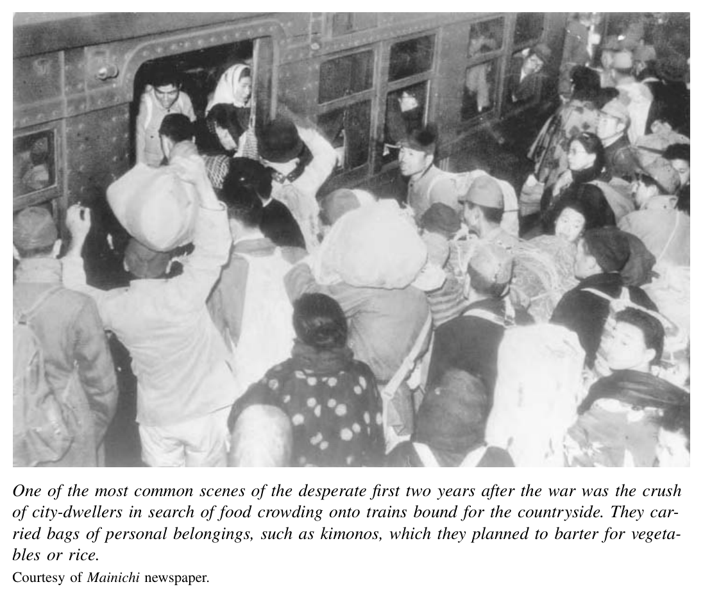
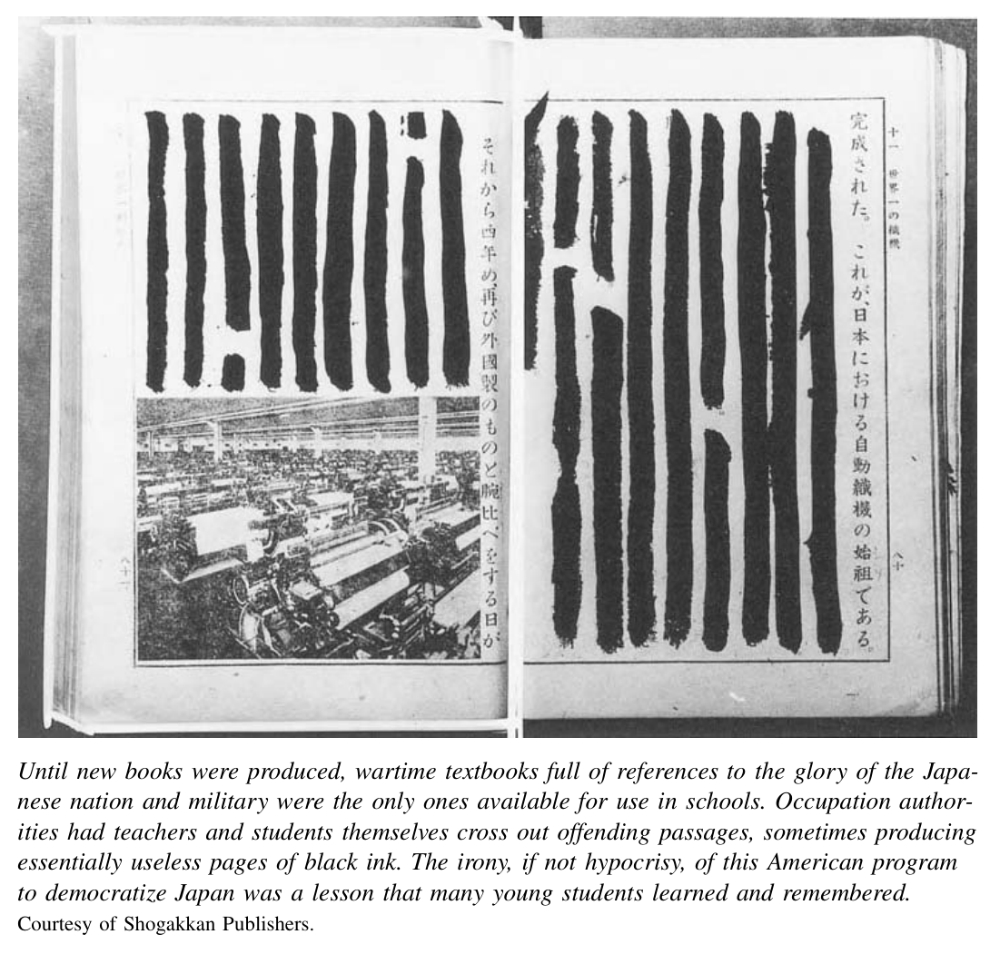
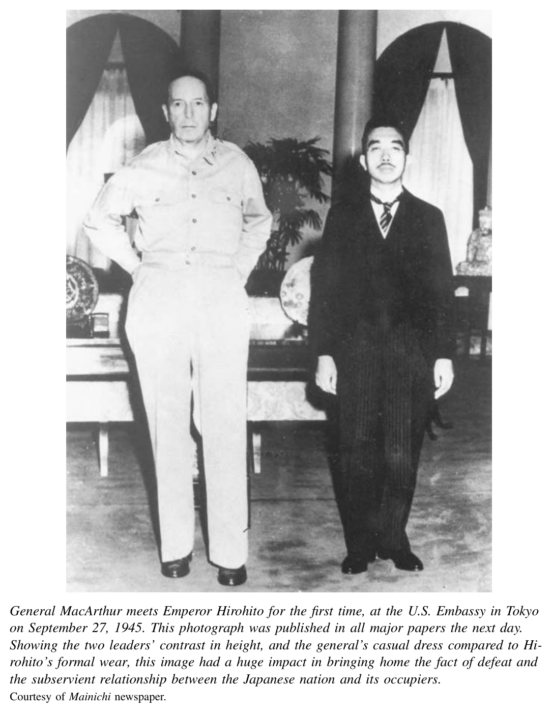

*Part 3. Imperial Japan from Ascendance to Ashes*

# 13. Occupied Japan: New Departures and Durable Structures

On August 15, 1945, the emperor of Japan announced the nation’s surrender to the Allied powers with his first radio broadcast ever. Some of his stunned listeners would later recall that August noon as an instant of “rebirth.” For these people, the surrender was a moment when past experience and values were rendered illegitimate. They decided to chart a totally new course, whether personal, on behalf of a national community, or both. Other listeners, already struggling to find food and shelter in bombed-out cities, fell into a condition of despair and passivity. Still others—especially those in positions of power—resolved to defend the world they knew. Despite the shared national experience of defeat, individual experience varied greatly.

Even before the war ended, many court figures, as well as some politicians, businesspeople, and bureaucratic leaders, feared that defeat might bring a revolution that would sweep away the imperial institution and replace it with state socialism on a Soviet model. After surrender, these fears only intensified, although the United States came to be seen as the agent of revolution. These apocalyptic visions of revolution—for some fearful visions, for others hopeful ones—were not realized. Profound tensions and conflict have remained constant features of Japanese life. But, as one examines the history of the second half of the twentieth century, a central task must be to explain a process of stabilization that somehow contained these tensions. How and why did a conservative political and social order emerge and endure in the decades after 1945?

## Bearing the Unbearable

Hardly any of the millions of people who listened to the surrender announcement had ever heard their sovereign’s voice. Their surprise at the sound of his high-pitched words fighting through the radio static compounded their shock at the content of the message. For eight years Japan’s rulers had exhorted the Japanese people endlessly to sacrifice in the emperor’s name for the sake of a great and certain victory to liberate Asia from the tyranny of the “British and American devils.” Japanese soldiers had killed millions of soldiers and civilians throughout Asia, and about 2.5 million out of 70 million Japanese subjects had perished. Now, suddenly, in stilted and deliberately ambiguous language, the emperor was telling them that the war was over, and Japan was defeated.

Hirohito explained the decision to surrender with one of history’s most remarkable understatements: “The war has not turned in Japan’s favor.” He stressed the destructive power of the enemy’s new “cruel bombs,” which threatened “not only the extermination of our race, but the destruction of all human civilization.” He offered words of regret for other peoples who had worked with Japan “for the liberation of East Asia.” The emperor then announced his intent “to open the way for a great peace for thousands of generations to come.” He ended by urging his subjects “to endure the unendurable, bear the unbearable” and unite “to keep pace with the progress of the world.”[^1]

This announcement was a noteworthy first effort of the emperor and his closest advisors to justify the past as a selfless war of liberation and defend their continued authority in a world about to turn upside down. It presented the Japanese people and even the state as victims of the war and cruel weapons. Although Hirohito ended by invoking Meiji era rhetoric in which Japan sought to emulate the progress of the Western world, his overall thrust was a call for endurance more than great change. He was urging his subjects to “sacrifice as usual.”[^2]

For a few, the prospect of defeat was literally unbearable. About 350 military officers committed suicide soon after this announcement. But when measured against the strident calls by military rulers for soldiers to give their lives for the state in a battle to the death, this was not a large proportion of the roughly six million men in arms at the war’s end. Most civilians and soldiers responded more practically or passively, and far less dramatically.

One of the most practical immediate steps took place in bureaucratic, military, and corporate offices. During the two weeks that elapsed between the end of the fighting on August 15 and the arrival of General MacArthur and the occupation army in early September, hundreds of bonfires flared all around Tokyo. To erase evidence of their wartime activities, which might bring on retribution from the occupiers, officials and managers by the thousands destroyed all manner of documents.

In another swift and practical step, the government took a page from its wartime policy book by recruiting women to work as prostitutes and thereby “defend and nurture the purity of our race.” Planning for official comfort stations began on August 18. By year’s end, thousands of women, most with no previous experience as prostitutes, were serving Allied soldiers in dozens of “Recreation and Amusement Centers” in cities throughout Japan. In January 1946, the occupation authorities condemned and outlawed this official prostitution. They called it a violation of the human rights of the women. But the occupiers accepted the decision of the Japanese government to continue the prewar system of licensed, privately run brothels. The soldiers of the occupation army provided a steady source of customers. The women who worked as prostitutes, and sometimes developed long-term relationships with particular men, faced a double-bind of discrimination. Although American officials allowed brothels to function, they strongly discouraged GIs from marrying Japanese women. Yet mixed-race children born to these women faced considerable discrimination in Japan.

Energetic entrepreneurship, legal or not, was another notable practical response to defeat. Within hours of the emperor’s broadcast, an editor named Ogawa Kikumatsu was inspired with the realization that English conversation books would soon be in huge demand. He hastily produced a language manual that sold 3.5 million copies by the year’s end. It remained the all-time bestseller in Japan until 1981.[^3] More typical was the turn to the black market. As wartime rationing and price controls continued after the war, many men, and a few women, including numerous Koreans and Taiwanese, made fortunes selling scarce food and household items to desperate buyers. Gangsters ran these illegal, but openly tolerated, outdoor markets. They battled violently to protect their turf. By October 1945, approximately seventeen thousand “blue-sky markets” had sprung up in cities and towns nationwide. Sellers procured their goods wherever they could: from farmers, from caches of Japanese war supplies, from prostitutes and GIs with access to the abundant stores on American bases. Some clothing and blankets for sale had even been lifted from corpses.[^4]

For several years, millions of people faced starvation. Thousands actually starved to death.[^5] By the spring of 1946 poor harvests and a paralyzed rationing system had produced a serious urban food crisis. The average household spent 68 percent of its income on food in 1946. The average height and weight of elementary school children decreased until 1948.[^6] Newsreels recorded tragic scenes of emaciated youths with distended bellies being examined by anxious officials from the Ministry of Welfare. Adults and children, women and men, crowded onto trains bound for the countryside to barter kimonos for cabbage. One memoir notes that “shedding clothes to buy food

was first compared to the snake’s shedding of its skin, then to the peeling of an onion, because it was accompanied by tears.”[^7]

The clinical word for exhaustion—kyo¯datsu—was one defining term for the state of mind of Japanese people in these early postwar years. Alcohol and drug abuse were identified in the media as major social problems. Newspapers published numerous reports of deaths from homemade liquor. Rates of armed robbery and theft rose sharply from levels of the 1920s or 1930s. On the other hand, murder rates did not increase. The perception of social disorder as recorded by anxious observers in the government and press was probably exaggerated.

Another byword of the era was kasutori culture. The term referred to a popular cheap wine brewed from sake dregs (kasu). It suggested a psychological world of sentimental self-pity balanced by a defiant resolve to live for the day at a time when the future seemed hopeless. As one black marketeer put it, “I drank trying to forget a life that hung suspended like a floating weed.” In both their writing and their own lives, several famous writers, most notably Dazai Osamu and Sakaguchi Ango, celebrated the humanity of peacetime decadence in contrast to the inhumanity of wartime loyalty. In a brilliant essay “On Decadence,” Sakaguchi wrote:

Could we not say that the kamikaze hero was a mere illusion, and that human history begins from the point where he takes to black-marketeering? We have only returned to being human. Humans become decadent—loyal retainers and saintly women become decadent.[^8]

## The American Agenda: Demilitarize and Democratize

In sharp contrast to people in Japan, the American occupiers who began to arrive in September 1945 were well fed, well equipped, and overflowing with confidence. They brought a vision of far-reaching reform. For nearly seven years the Japanese people faced the unprecedented experience of occupation by a foreign power wielding the authority to rewrite laws, restructure the economic and political system, and even seek to redefine culture and values.

The occupation in theory was a collective endeavor of the Allied powers. A four-nation Allied Council for Japan was created in early 1946 to advise the Supreme Commander for the Allied Powers (SCAP). An eleven-member Far Eastern Commission was charged to formulate occupation policy and review SCAP actions.[^9] In fact, the supreme commander, in the imposing person of General Douglas MacArthur and a mostly American staff, took orders from the U.S. government and paid scant attention to these bodies. As a matter of convenience, the acronym SCAP quickly came to refer both to MacArthur himself and to his extensive administrative bureaucracy.[^10]

The initial American strategy in Japan was encapsulated in two words: demilitarize and democratize. To achieve the first goal, SCAP dissolved the army and navy immediately: Japan’s armed forces were officially disbanded on November 30. To follow up on this order was a daunting task. It meant demobilizing the gigantic Japanese military, and repatriating to the home islands a total of 6.9 million people. When the war ended, nearly ten percent of the population of Japan was overseas: 3.7 million soldiers and 3.2 million civilians in Korea, Manchuria, Taiwan and the Chinese main land, as well as the far-flung wartime empire to the south. With the exception of about 400,000 people who remained prisoners in the Soviet Union, and smaller numbers left behind in Manchuria, demobilization and repatriation were completed by the end of 1948. While this was a relatively swift and smooth process, to absorb such a vast number of people was a complex undertaking which left a legacy that has not yet been fully studied or understood. Repatriates, both civilian and military, often felt out of place back “home,” regarded with a mixture of pity for their poverty and scorn for their role in pursuing what now appeared to have been a hopeless war. Returned veterans were prominent among those who organized politically in the 1950s and thereafter to pressure the government to rearm and revise the American-imposed reforms of the occupation era.

Other demilitarizing steps focused on those outside the military who had supported the war machine In October 1945 the Americans disbanded the oppressive Special Higher Police (dubbed “thought police” by Western critics). Between 1945 and 1948, the occupiers purged over two hundred thousand men from positions in the government and business world who were judged responsible for leading the war effort. They disestablished the official state Shinto religion. During and immediately after the war, the allies tried some six thousand military men for conventional war crimes, such as abuse of prisoners. They convicted and executed over nine hundred. They also set in motion an ambitious plan for war reparations. Significant portions of Japan’s industrial plant were to be loaded onto ships and given to the wartime victims of Japanese expansion in Asia.

The most significant arena of retribution was the International Military Tribunal for the Far East, also called simply the Tokyo Trial. It dragged on from May 1946 to November 1948 and put Japan’s wartime rulers on trial. Beginning with General To¯jo¯ Hideki, twenty-eight men were charged with both conventional war crimes and the newly minted crime of engaging in conspiracy to wage war. All were found guilty of some charges. To¯jo¯ and six others were executed. Another seventeen defendants were sentenced to life in prison.[^11]

The United States in 1945 sought to do far more than demilitarize Japan and punish the nation’s leaders. It was striving to reconstruct the entire world in its image, Japan included. In this spirit, SCAP imposed a rush of reforms in the fall of 1945 and 1946. They were based on a simple logic: Militarism stemmed from monopoly, tyranny, and poverty. To construct a peaceful, nonmilitaristic Japan required more than just disbanding the military. It required vast reforms to smash authoritarian political rule, equalize political rights and even wealth, and transform values.

SCAP announced the first major reforms in October 1945, with declarations that guaranteed freedoms of speech, press, and assembly and the right to organize labor or farmer unions. SCAP also ordered the Japanese government to extend civil and political rights to women. A bit later, in December, the occupiers told the Japanese government to undertake land reform that would allow tenant farmers to purchase their fields.

With these steps, the Americans sent a clear message that democracy should be the cornerstone of a new Japan. The capstone of this effort was the rewriting of the constitution. This was drafted by a committee of occupation officials in the winter of 1946. It was vigorously discussed and ratified that spring in the imperial Diet (still in existence until the new constitution replaced it). It was promulgated in November 1946 and took effect in May 1947.

The postwar constitution downgraded the emperor from absolute monarch to a “symbol of the State and of the unity of the people.” It granted to the people of Japan an array of “fundamental human rights,” including the civil liberties of the American Bill of Rights such as freedoms of speech, assembly, and religion. It also boldly extended the concept of rights into the social realm. The new constitution guaranteed rights to education “correspondent to ability” and to “minimum standards of wholesome and cultured living.” It assured the right (and obligation) to work, to organize, and to bargain collectively. It outlawed discrimination based on sex, race, creed, social status, or family origin. It gave women explicit guarantees of equality in marriage, divorce, property, inheritance, and “other matters pertaining to marriage and the family.” Finally, its article 9 committed the Japanese people to “forever renounce war as a sovereign right of the nation and the threat or use of force as means of settling international disputes.”

Japanese elites were stunned by these sweeping guarantees, especially when the Americans insisted that the Japanese government present them to the people as the government’s own recommendation. But the draft document met an enthusiastic popular response. As officially sanctioned goals or ideals, its ambitious provisions have framed the discourse and institutions of contemporary Japanese life ever since.

From 1945 through 1947 occupation officials imposed important additional changes. SCAP freed Communist Party members from jail as early as October 4, 1945. It outlawed Japanese institutions of censorship and arguably allowed a greater range of political expression than was possible in the United States at the time. At the same time, with little sense of irony, SCAP put in place its own program to censor the newly “liberated” Japanese cultural world to prevent continued support of the military or war regime.

The occupation reformers attacked the sprawling business empires of the zaibatsu. They took away ownership and control from holding companies dominated by the zaibatsu families (Mitsui, Sumitomo, Yasuda, Iwasaki [who owned Mitsubishi], Asano, and others). They broke up some of the larger firms within each zaibatsu network. They encouraged and advised labor unions, and at first SCAP officials welcomed the extraordinary drive of organizing and strikes. The program of land reform enacted under SCAP order revolutionized the distribution of social and economic power in rural Japan. It essentially expropriated the holdings of landlords, gave them to former tenants, and created a countryside of small family farms.

The schools were also subject to reform. SCAP ordered the Ministry of Education to replace lessons for war and loyalty to the state with teachings of peace and democracy. Wartime textbooks were quickly rewritten, although for the first year or so students had to cross out offending phrases about tanks and battleships and use the old books. Some of them were little more than a mass of inked-over paragraphs. In 1947 compulsory education was extended through the ninth grade. The university system was dramatically enlarged. The “imperial” label was removed from the handful of elite state-funded prewar universities, renamed simply as Tokyo University or Kyoto University. These were joined by dozens of newly founded or expanded four-year colleges throughout Japan. In 1947 women were granted access to private and public universities. SCAP also sought to implement an American-style system of local school boards and local control.

These sweeping measures changed the climate of ideas and the distribution of

economic and social power. A fever of “democratization” swept Japan. The projects of democracy and equality were understood in extremely expansive terms by their advocates; they meant far more than voting and land reform. They implied to many—and this was both promise and threat—a remaking of the human soul. Intellectuals engaged in searching and sophisticated debate over how to nurture the autonomous subjectivity of a truly democratic person. Many looked to Marxism for inspiration and the Japan Communist Party for leadership, and the political parties and philosophies of the left enjoyed unprecedented support. Crowds of people as hungry for ideas as for food rummaged through used book stalls. Others camped overnight outside major bookstores to purchase the latest installment of major works of political philosophy. Talk of renovating and remaking and transforming echoed throughout Japan.

General Douglas MacArthur stood as the human symbol of the American power that was imposing these massive reforms. He was a charismatic leader of extraordinary confidence. A master of the sparing and symbolic use of his own image, MacArthur kept himself hidden from direct contact with ordinary Japanese people but still released

to the public one of the most remarkable political photographs in Japanese or world history. The picture, taken on the occasion of his first meeting with Emperor Hiro-hito—in MacArthur’s headquarters and not in the palace—on September 27, 1945, was published in all the major newspapers. It conveyed the subordinate position of the Japanese state and people with shocking force to the entire population.

It is important to note that despite the supreme commander’s strong personality and emperorlike image, he was not an independent ruler imposing policies of his own design. SCAP policies had been designed by planners in Washington, DC, during the war and approved by President Harry Truman. Both the initial reforms, and the shifts in American policy that became visible in 1947, generally reflected the thinking of the mainstream of American policymakers.

One exceptional area where MacArthur clung to a very personal agenda was religion. He was a devout Christian and he wanted to use his prestige and power to spiritually transform the Japanese people by Christianizing them. He encouraged Western missionaries to come back to Japan. He requested that ten million translated copies of the Bible be distributed to the Japanese people.[^12] In the end, his efforts bore little fruit. Some people did turn to Christianity for explanations or comfort in the face of the disaster of the war. But the overall proportion of Japanese Christians remained relatively constant at approximately 1 percent of the population.

Of greater long-term consequence, MacArthur’s personal views did shape American policy toward the imperial institution. A significant group of “soft peace” advocates in Washington favored preserving the emperor and using his prestige to legitimize occupation reforms. But this issue was not firmly settled as the occupation began. In the fall of 1945, MacArthur emerged as a decisive supporter of the throne. He sent home alarming reports of the threat to social order and American policies that would ensue should Hirohito be forced to stand trial for war crimes or even simply abdicate. His lobbying ensured that Japan’s postwar political system would be a hybrid form that some have called “imperial democracy.”[^13]

## Japanese Responses

Despite the surface appearance of overwhelming American power in occupied Japan, both elites and ordinary citizens retained space to interpret the reforms of the occupiers. SCAP ruled indirectly, implementing changes through the existing Japanese bureaucracy. This choice was probably inevitable. The occupiers simply did not have sufficient personnel or language ability to staff a full government to put the vast changes into practice. Instead SCAP’s General Headquarters (GHQ) consisted of a shadow government of smaller offices parallel to the Japanese government bureaucracy. SCAP/GHQ passed orders to its Japanese counterparts through a liaison office staffed by bilingual Japanese officials. This structure offered government officials and other wartime elites some important room to maneuver, whether to resist or reshape the occupation directives.

Ordinary citizens likewise enjoyed considerable freedom to improvise upon the American agenda. In such a context, the fate of reforms was only determined in part by the extent to which the occupiers consistently promoted them. Even more importantly, it was determined by a transwar legacy of prewar and wartime history. Individuals and groups in Japanese society and government who had long been concerned with shaping their modern institutions continued their efforts, in conflict with each other as much as with the occupation forces.

Land reform, for example, proved to be one of the most thoroughgoing and long-lived changes of the occupation era. Landlords had been on the defensive in the 1920s and early 1930s. Organized groups of tenants had frequently confronted them with successful demands for rent reductions or more secure tenancy rights. Many landlords had responded by selling off holdings. During the war, the government had stepped in, less to promote social reform than to spur food production. Its program of subsidized purchases of tenant rice further weakened the economic power of landlords. In addition, bureaucrats within the Ministry of Agriculture had been calling for land reform since the 1930s as a way to bring social stability to the countryside. And of course, the tenants wanted to own their fields.

Land reform was thus a transwar endeavor, and this historical context explains the deep, enduring impact of reforms initiated by SCAP. At the same time, SCAP certainly pushed for reforms that went beyond the intentions of Japanese officials themselves. The Japanese government enacted its own land reform law in December 1945. SCAP judged this to be too weak and demanded that the government draft a second reform measure. A stronger law was approved in October 1946. It forced each landlord to sell all but a small, family-sized plot of farmland to tenants at 1945 prices. Observers joked—with justification—that by the time the payments were actually made, inflation had reduced the real cost of a tenant’s field to the price of a carton of cigarettes.

In the realm of social policy, transwar continuities were important as well. Several key Home Ministry bureaucrats had pushed for a labor union law in the late 1920s. They were still at their jobs in 1945. The Home Ministry, seen by SCAP as a bastion of domestic repression, was the only bureau outside the military to be dissolved during the occupation. But these officials shifted to the new Labor Ministry (founded in 1947). From this perch they oversaw the occupation labor reforms. They called for cooperation between management and labor, sometimes echoing the wartime rhetoric of the Industrial Patriotic Association. But they returned to their position of the 1920s that a regulated system of unions and collective bargaining would bring the greatest social stability, and most productive economy, in the long run.

Of equal importance, a minority of industrial workers had prewar experience in labor unions. These people helped lead a great rush to embrace unions, collective bargaining, and strikes. The labor movement also quickly drew in millions of newly active men and women discontent with their low wages, poor job security, and lack of power in their working lives. Union membership surged from zero to nearly five million by the end of 1946. The proportion of wage workers in unions reached a peak of more than 56 percent of the work force by 1949.

Business leaders had no choice in the immediate postwar years of 1945–47 but to give way to this powerful labor movement. They conceded large wage increases in collective bargaining. They concluded thousands of contracts that gave real power to new labor-management councils including union representatives. In the face of strikes, despite dire business circumstances, some of the nation’s leading employers revoked plans to dismiss workers.

But in contrast to the land reform, countervailing forces remained powerful in the case of labor reform. Even as they made concessions, business leaders and many in the government feared that militant unionism was leading straight to communism. They were determined to change the balance of power and the character of unions. Beginning in 1947 and 1948, as the Americans shifted their focus from democratization to promoting economic recovery, these managers were able to regain the upper hand and cultivate enduring alliances with more cooperatively inclined union leaders.

In the case of women’s rights, important political reforms took root thanks to an alliance between reformers in SCAP’s headquarters and a small band of Japanese women who had been seeking the vote and other civil rights since the 1920s. In 1945, even before revising the constitution, the Americans ordered the Japanese government to give women the vote. In the first postwar elections, thirty-nine women were elected to the Diet, accounting for just under 10 percent of the seats. Women’s suffrage was a wildly popular reform.

Beyond political reform, SCAP put a powerful statement of social and legal equality for women in the constitution. These clauses were the work of a remarkable young woman, Beate Sirota, who had lived in Japan as a child in the 1930s and become fluent in Japanese. She returned in 1945 as a recent college graduate working as a researcher in SCAP offices. In the winter of 1946 Sirota suddenly found herself appointed to the SCAP committee to draft the new Japanese constitution. She seized the opportunity to author the provisions that guaranteed “the essential equality of the sexes” in marriage and all other legal matters pertaining to inheritance and the family.

In this instance, the existing balance of power and ideas was not congenial to radical change. Despite the presence of some Japanese feminists who supported basic change in gender roles and power relations, the dominant position of males in the family and in society at large was not overturned by constitutional reform. Nonetheless, Sirota’s constitutional provisions remained on the books. They provided a new context in which women and men would debate the merits of changed gender relations for decades.

In some areas, the occupation reforms found little domestic support. The Americans came to Japan convinced that the zaibatsu trusts bore major responsibility for expansionism and the war. Initial SCAP policy called for the zaibatsu owners to sell off their assets and for the constituent corporations to be dissolved into independent, smaller companies. But the bureaucrats charged with responsibility for postwar economic affairs were the same men who had forged close ties with the zaibatsu from the depression through the drive for wartime mobilization. They saw collaboration between state bureaucrats and big business as the best strategy for economic recovery. They viewed American policies to dissolve the zaibatsu as utterly naive. The postwar political leadership agreed. At the same time, although the parties of the left opposed capitalist monopolies, they did not oppose large-scale economic organizations in themselves. They rather wanted a strong state to nationalize industries to serve workers and the people. There was little intellectual or popular support for thoroughgoing free markets and economic deconcentration.

The program of zaibatsu dissolution therefore proceeded slowly. When the American commitment shifted from reform to recovery, pressure on the zaibatsu diminished. In the end, the power of the privately owned holding companies was destroyed, but the zaibatsu enterprises regrouped around the banks of the dissolved combines. They also proved willing to cooperate with state bureaucrats. This set in place a pattern of bank-centered capitalism and bureaucratic guidance of the economy that persisted for decades.

Likewise, American initiatives to decentralize the police and education systems did not last. The projects reflected peculiar American ideas about the importance of local self-government, which had no natural constituency in Japan. SCAP dictated that cities, towns, and villages were to fund and control their own police departments. Conservative politicians feared these forces would be ineffective at monitoring left-wing challenges. Local taxpayers, especially in small communities, were not enthusiastic about paying for their police forces. As the occupation ended, the government gave communities the power to end support for local police. Most did so immediately, and by 1954 a national police agency had been created. In similar fashion, a 1948 reform provided for elected local school boards throughout Japan, but the Japanese government delayed implementation. After the occupation ended, a revised education law replaced elected with appointed school boards. Fierce debate raged over the content of education for decades, but neither conservative nor liberal or radical voices were particularly concerned with carrying out the debate in autonomous local units.

The political context for such debates was a sharp division between parties of the left and right. This divide also had prewar roots. After the five year hiatus of the Imperial Rule Assistance Association, the two major prewar parties regrouped under new names. The remnants of the Seiyu¯kai came together into the Liberal Party (Jiyu¯to¯), while the Minseito¯ politicians for the most part joined in a new Progressive Party (Shinpoto¯), which later evolved into the Democratic Party (Minshuto¯). Although these parties managed to cling to power through most of the occupation era, they got off to a rough start when the majority of their founding members were purged for their role as part of the wartime political elite. They were far less dominant than they had been before the war.

The non-communist parties of the left, which had spoken on behalf of wage laborers and tenant farmers before the war, had actually supported the wartime government with great enthusiasm. A number of their leaders were purged as well. Nonetheless, the surviving leaders of the prewar socialist camp formed the Japan Socialist Party in late 1945. They won much support by criticizing the wartime regime and the postwar successor elites of businessmen, bureaucrats, and “established” politicians. And for the first time, the Japan Communist Party was able to function openly and legally. The communists were the one group with a consistent (underground) record opposing the imperialism and expansionism of the prewar and war years, and they gained much moral support for these stands.

In elections of the 1920s and 1930s, the Seiyu¯kai and Minseito¯ had together controlled roughly 80 to 90 percent of the votes. The proletarian parties had grown from as little as 3 or 4 percent of the vote in the first elections under universal male suffrage to almost 10 percent by the mid-1930s. After the war, the socialists and communists continued this upward trend. The socialists won 92 seats and 18 percent of the vote in the first postwar election of 1946. They surged to 143 seats and 28 percent of the vote in a general election the following April 1947. The Communist Party had greater strength in labor unions and among intellectuals than among the populace at large; they managed just 3 to 4 percent of the vote and 4 or 5 seats in these early postwar ballots. In addition, significant numbers of independent candidates won votes and seats, as many as 20 percent in the first postwar election of April 1946. As the left and these independents gained ground, the combined votes of the established parties fell to roughly 50 percent. (See Appendix B for detailed election results.)

Despite these opposition gains, the Liberal Party, led by Yoshida Shigeru, man aged to form a cabinet after the 1946 election, working together with the other conservative party. Yoshida was a former diplomat. He had served as Japan’s ambassador to Great Britain in the late 1930s. He was a strong supporter of the Japanese empire who energetically pushed the British to accept Japan’s hegemony in China. But Yoshida kept some distance from the military during the war. He was the key supporter of Prince Konoe’s direct appeal to Hirohito in 1945 seeking to bring about an early surrender. For this effort, Yoshida had been briefly put in jail in April 1945. The episode gave him postwar legitimacy as a liberal who had opposed the military.

But his hold on power was tenuous. The socialists and communists rode a surge of unionizing, strikes, and protest demonstrations over the next twelve months. They criticized in particular the government’s corruption and mismanaging of the economy. A broad coalition of unions planned a national “general strike” on February 1, 1947. The stated goal was to overthrow the Yoshida cabinet. In dramatic fashion, SCAP forbade this strike late on the night of January 31. This delivered a severe blow to the revolutionary hopes of the communists and left-wing socialists. Even so, just two months later in April 1947, when the first election was held under the new constitution, the Japan Socialist Party won a plurality. They formed a government in coalition with the Democratic Party, headed by the socialist leader Katayama Tetsu as prime minister. In March 1948, Katayama was forced to step down after just eight months in office. The cabinet fell in part because his agenda to nationalize major industries was rejected, although factional strife between the left and right wings of the party was the fundamental cause. Even so the socialists continued as partners in a governing coalition, this time led by the Democrats, which continued until the end of 1948. Japan appeared to be on a political course in which socialist rule was a real possibility.

In fact, the Katayama cabinet proved to be a brief interlude of socialist power-sharing. The liberals under Yoshida staged a major comeback in the elections of 1949. They won over half the seats in the House of Representatives and were able to rule on their own. The fact that this “established party” of prewar vintage managed such a strong comeback is as impressive as the earlier gains of the socialist opposition. The Liberal Party returned to power despite the fact that its Seiyu¯kai predecessor had controlled the cabinet at the outset of Japan’s expansionist adventures in 1931–32. And of course, despite his wartime call for an early surrender, the Liberal Party’s prime minister, Yoshida Shigeru, had served as a loyal diplomat in the 1930s. One could imagine many people condemning such politicians as responsible members of the wartime elite that brought death and ruin to millions.

Despite this, the staying power of the prewar parties was substantial. It was probably rooted in fear of the unknown and a deep desire for the return of some sort of familiar “normalcy.” Having been pushed to the margins of government in the 1930s and 1940s, the Liberal and Democratic parties could present themselves as reluctant wartime collaborators. They could claim to be champions of modest reform, determined to rebuild a peaceful Japan but determined not to change too much. In addition, and perhaps even more important, it was this old guard that could deliver the goods of state subsidies or protections to many of their prewar supporters, from small and large businesses to farmers, including the new owners of formerly tenanted fields.

Thus, through the era of American occupation and beyond, the old guard parties returned to power based on their prewar experience and promises of normalcy and political spoils. The socialists and communists emerged as leaders of a combative opposition, but they were to remain more or less permanently in the minority.

## The Reverse Course

The peak years of reform in Japan were also the years when tension in American-Soviet relations reached a peak. The Cold War came to the fore of international politics in 1946 when Winston Churchill gave his famous speech about the Iron Curtain descending in Europe. In 1947 American Secretary of State George Marshall announced his famous plan to offer massive economic aid to promote European recovery. In Asia, the Nationalists in China had been seen by the United States as the anchor to a postwar Asian order. By 1947 they were losing ground to the communists. In Japan the Socialist Party was gaining ground at the polls, huge crowds were marching in the streets, and the communists were dominating labor unions that planned strikes with explicitly political goals.

These trends led to an important shift in the balance of power and views among American government officials. Even during the presurrender planning, some policymakers in Washington had questioned the assumption that far-reaching reform was the best way to ensure a stable new Japan. These were members of the so-called Japan crowd, led in Washington by Joseph Grew, the former ambassador to Japan. They called for quite modest reforms. In Tokyo, key aides to MacArthur, in particular the chief of his intelligence staff General Charles Willoughby (referred to by MacArthur as “my pet fascist”), took a similar position.

In their view, the war was a slight misstep in which a few militarists had hijacked a relatively sound and well-run ship of state. Simply dismantling the military and putting in place the basic laws of political democracy would be enough. Other reforms went too far, they argued, toward a dangerous socially based democracy of the masses. They advocated handing power back to the “responsible elements” of the prewar elite: business leaders and relatively pro-Western Foreign Ministry veterans such as Shidehara Kiju¯ro¯ and Yoshida Shigeru. They supported using the emperor as an anchor to keep Japan socially conservative and cohesive.

Beginning in 1947, such attitudes began to shape policies in Washington and Tokyo. These new departures have come to be known as the occupation’s “reverse course.” In 1948 the Americans sharply scaled back plans to dissolve the former subsidiaries of the zaibatsu combines, and in 1949 they relinquished all claims to war reparations. In 1948 SCAP encouraged the Japanese government to revise the new postwar labor laws to outlaw strikes by public employees and weaken protective labor standards. They encouraged the Japanese to create a national police force beginning as early as 1947 and promoted Japanese rearmament (within limits) thereafter.

The Americans also promoted a crackdown on the Japan Communist Party. In 1950, the Japanese government launched the so-called Red Purge with SCAP encouragement. Roughly thirteen thousand people alleged to be Communist Party members were ousted from their public or private sector jobs, on the grounds that their political activities were impeding the goals of the occupation. This was the same justification for the 1945–46 SCAP purge of wartime leaders. The Red Purge coincided with the de-purging of some of these men, who quickly returned to prominent positions in the political world. It was perhaps the most dramatic example of the “reverse course.”

The shift in American policy was very controversial at the time. It remains a topic of debate among historians, especially those in Japan. Some condemn the reverse course as an American betrayal of an immediate postwar promise to build a true democracy, which then enabled the Japanese elite to continue a program of reaction and reversal after the occupation ended. Others praise the new direction as a prudent step, necessary to ensure stability and the long-run success of earlier reforms.

Coupled with the initial decision to retain the imperial institution, the shifting American policy did make Japan’s postwar transformation less thoroughgoing than it would have been. The Red Purge surely changed the political balance in many labor and cultural organizations. But the reverse course left some crucial early reforms untouched, including the new constitution and the land reform. It did not rig elections or shut down newspapers or prevent defenders of the peace clause (article 9) in the constitution from continuing their activity. It changed the political environment, but it did not simply determine the outcome of ongoing contention among vigorous actors in political or cultural life. The shifting course of American reforms was part of an improvised recipe for stabilization that first opened politics to an unprecedented degree and then shored up the many surviving elements of the old order.

## Toward Recovery and Independence: Another Unequal Treaty?

Economic recovery was also a basic ingredient of postwar stabilization. At the outset of the occupation, SCAP rejected any responsibility for helping Japan’s economy to revive. Left to their own devices in an uncertain context, business leaders combined fear with greed in disastrous ways. The early postwar government offered reconstruction subsidies to major firms in hopes the funds would be used to revive production. Rather than processing them into finished goods, businesses found it more profitable to use these funds to buy and resell raw materials to black market brokers. Many of the industrial plants that had survived stood idle. From 1945 to 1949, inflation surged out of control. As one American on the scene recalled: “For four years after the war, the great inflation hung over Japan like some immense, brooding presence... By 1949, when inflation was finally contained, the price level had risen 150 times in four years.”

The first glimmer of hope in the effort to revive confidence and restart production came in 1947. Economic policymakers observed a vicious cycle of coal shortages that inhibited the recovery of other industries, especially the crucial iron and steel industry, in turn keeping coal demand low. Their answer was the Priority Production program. Drawing on wartime experience, bureaucrats in the Ministry of Commerce allocated both coal and imported fuel on a preferential basis to steelmakers. This allowed steel companies to revive production and feed steel back to the coal industry, which in turn could rebuild the mining infrastructure and raise productivity. The program succeeded modestly in reviving both industries and generating coal supplies for other customers.

But throughout 1948 the economy remained relatively stagnant, and inflation continued to surge. The Americans were now committed to Japan as Asia’s “bulwark against communism,” in the words of Secretary of the Army Kenneth Royall.

They were now anxious to promote economic recovery. George Kennan, among the most important American strategists of the postwar era, put it bluntly in October 1949:

[T]he terrific problem [is] how then the Japanese are going to get along unless they reopen some sort of Empire toward the South. Clearly we have got... to achieve opening up of trade possibilities, commercial possibilities for Japan on a scale very far greater than anything Japan knew before. It is a formidable task.[^14]

As a step in this direction, the United States in February 1949 sent a special financial advisor to Tokyo, a Detroit banker named Joseph Dodge. He was an orthodox economist who detested government support or regulation of the economy. SCAP took his advice and imposed a harsh medicine in three doses: a balanced budget, the suspending of all state loans to industry, and the abolition of all state subsidies. SCAP also followed the advice to set a favorable exchange rate of 360 yen to the dollar to encourage Japanese exports. This “Dodge line” program indeed halted inflation, but industry found itself starved for capital. In the spring of 1950, a year after this deflationary program had been implemented, Japan appeared on the brink not of recovery but of a deepening depression.

In June 1950, just as it appeared SCAP’s medication might kill the patient, the Korean War began. This tragedy across the straits conferred great fortune on Japan. With the war came a surge of American military procurement orders placed with Japanese industries, which were located conveniently close to the front. In the years 1951–53, war procurements amounted to about two billion dollars, or roughly 60 percent of all Japan’s exports.[^15] Japanese leaders tastelessly celebrated what Prime Minister Yoshida called a “gift of the gods” and businessmen dubbed “blessed rain from heaven.”[^16] From 1949 to 1951 exports nearly tripled, and production rose nearly 70 percent. Corporations began to show profits for the first time since the surrender, and they responded with a surge of investment in new plants and equipment. The gross national product began to increase at double-digit rates. Japan’s recovery was underway.

With reforms in place and the economy on the mend, and with the Korean War placing great demands on American military resources, pressures in Washington mounted to end the occupation. The end came sooner than many had anticipated; in 1945, some top officials in the United States had spoken of the need to occupy Japan for two decades, or even a century. As it turned out, the era of formal occupation lasted just under seven years.

Some of America’s wartime allies were reluctant to sign a treaty so quickly that would bring the occupation to a close. The British, the Chinese, and Southeast Asian governments wanted a harsh peace with reparations paid and with strong guarantees against a revival of the Japanese military. Led by Secretary of State John Foster Dulles, the United States negotiated vigorously on multiple fronts to hasten a settlement. It concluded defense agreements with the Philippines, Australia, and New Zealand that assuaged the fears of these nations. Asian nations were also given the right to follow the treaty by negotiating bilateral reparations agreements with Japan. In September 1951, representatives of forty-eight nations met in San Francisco and signed a treaty to end the state of war that still formally existed with Japan. The occupation officially ended in April 1952.

Several key issues remained unresolved. The United States retained control of Okinawa indefinitely, although most Japanese saw the island as part of their nation. Both the Republic of China (Taiwan) and the mainland People’s Republic of China wanted to sign the treaty as the sole Chinese government. Neither was invited to the peace conference, and Japan was instructed to reach agreements on its own. And the Soviet Union and other European communist states walked out of the conference. They were particularly angry that a large force of American troops was going to remain in Japan after the occupation ended. The Soviets retained control of several disputed islands just north of Hokkaido.

Two hours after the San Francisco treaty was signed, the United States and Japan ratified the controversial U.S.–Japan Security Treaty. It granted the United States the right to keep bases and troops in Japan. The official mission of the troops was to protect Japan from attack and guarantee international peace and security. From the perspective of the Americans and many in Asia, the function of the American troops was to contain Japan as much as to protect it. Not surprisingly, the security treaty faced much opposition in Japan. Some on the political left quite logically saw it as a violation of Japanese neutrality and the principle of unarmed peace enshrined in the constitution. They feared that U.S. troops made Japan a lightning rod for an attack by America’s enemies. Others on the left, together with many in the conservative camp, saw the treaty—again with considerable justification—less as a violation of Japanese neutrality than as a betrayal of its sovereignty. They scorned Prime Minister Yoshida for accepting a “subordinate independence.” Yoshida indeed had been convinced for several years that an American military presence and a secure, if subordinate, place in a Pax Americana was the best Japan could hope to achieve. He got his way. But the agreement that some labeled a “second unequal treaty” would be subject to fierce debate and political struggle for decades.

The occupation forces arrived in 1945 determined to engineer a root-and-branch transformation of Japan. They did change a great deal, but a considerable portion of the old order of imperial Japan, and the revised order of wartime mobilization, remained in place when the Americans packed their bags in 1952.

The occupiers had intended to destroy the zaibatsu, seen as the moneybags of militarism. They had intended to destroy the centralized control held by the bureaucracy over key realms such as education and policing. They had intended to purge from public life, forever, the militarists in the army and navy and their supporters in civilian life, politicians and businessmen as well as intellectuals.

Japan’s American rulers made attempts in each of these areas. But by the early 1950s, the subsidiaries of the prewar zaibatsu were on the way toward regrouping around banks instead of holding companies, the prewar political parties had survived to dominate the Diet and cabinet, and the civilian bureaucracy was as strong as ever, or perhaps even stronger. These enduring features of political and economic life are what one historian has called the “passage through” of the old guard, from prewar, through war, to postwar.[^17]

The relative stability of postwar Japan, however, rested on more than continuity in the power of the old guard, even though various transwar continuities noted earlier were important. The postwar order also was rooted in great changes that would endure: in civil rights granted under the constitution as well as in land reform, labor reform, and legal changes for women that went well beyond what Japan’s rulers would have enacted on their own. These gave more people than ever a stake in the system. The postwar stabilization of Japan was far from a static process involving little change. It was precisely the result of massive change. Reforms accelerated changes underway and set renewed struggles in motion. The political and social realm ultimately settled into a sort of isometric stability: Important, and occasionally explosive, tensions remained at the center of society, culture, and politics, but these were ultimately contained.

Over the next several decades, as the economy boomed, the three interlocking institutions of big business, establishment political parties, and the bureaucracy achieved a remarkably durable hegemony. This postwar stability was importantly rooted in the “passage through” of the old guard. But one also sees great social stability anchored in large and growing middle classes focusing their energies on gaining a stake in the system through education and employment in factories as well as office buildings. This was the legacy of the reforms.

## Footnotes

[^1]: For a fuller discussion of the surrender, see John W. Dower, Embracing Defeat: Japan in the Wake of World War II (New York: W.W. Norton, 1999), pp. 34–39. For the text of the surrender, see Robert J. C. Butow, Japan’s Decision to Surrender (Stanford, Calif.: Stanford University Press, 1967), pp. 1–4.

[^2]: This is the very apt phrase of Theodore Cohen, a midlevel SCAP official. He was referring to the stance of the Japanese cabinet in 1946, but the statement applies equally to the emperor and his attitude. See Theodore Cohen, Remaking Japan: The American Occupation as New Deal (New York: The Free Press, 1987), p. 262.

[^3]: Dower, Embracing Defeat, pp. 187–8.

[^4]: Dower, Embracing Defeat, pp. 139–48.

[^5]: For example, see “Drastic Steps Set to Fight Food Lack,” Japan Times, June 6, 1946.

[^6]: Kawasaki ro¯do¯ shi hensan iinkai, ed., Kawasaki ro¯do¯ shi (Kawasaki: pub, 1987), pp. 7–8, 410.

[^7]: Cohen, Remaking Japan, pp. 171, 179.

[^8]: Dower, Embracing Defeat, pp. 145, 156 for the quotes in this paragraph.

[^9]: Allied Council members were the United States, Great Britain, the Soviet Union, and China. Far Eastern Commission members were Burma, Canada, China, France, India, the Neth erlands, New Zealand, Pakistan, the Phillipines, the Soviet Union, the United Kingdom, and the United States.

[^10]: The supreme commander’s bureaucracy was also abbreviated GHQ (General Head quarters). Thus the occupation leadership was variously labeled SCAP, SCAP-GHQ, or simply GHQ.

[^11]: Three died during the trial, and the two men found guilty only of conspiracy to wage war received finite prison terms of seven and twenty years.

[^12]: On MacArthur’s evangelism in Japan, see Ray A. Moore, “Reflections on the Oc cupation of Japan,” Journal of Asian Studies 38, no.4 (August 1979): 724, 729, and Richard Finn, Winners in Peace: MacArthur, Yoshida, and Postwar Japan (Berkeley: University of Cal ifornia Press, 1992), pp. 62–63.

[^13]: Dower, Embracing Defeat.

[^14]: Cited in Bruce Cumings, “Japan in the World System,” in Postwar Japan as History, ed. Andrew Gordon (Berkeley: University of California Press, 1993), p. 40.

[^15]: Thomas R. H. Havens, Fire across the Sea: The Vietnam War and Japan, 1965–1975 (Princeton, N.J.: Princeton University Press, 1987), p. 93. Nippon Ko¯kan, Nippon Ko¯kan 40 nen shi (Kowasahi: 1952) (place: pub, year), p. 382.

[^16]: John W. Dower, Empire and Aftermath: Yoshida Shigeru and the Japanese Experience (Cambridge: Harvard Council on East Asian Studies, 1980, p. 316. Nippon Ko¯kan, Nippon Ko¯kan 40 nen shi, p. 382.

[^17]: Dower, Empire and Aftermath, p. 306.

