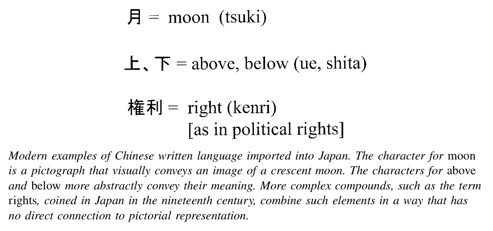

# 导论：久远过去的深刻印记

1868年夺取政权的统治者们发起了一系列堪称日本现代革命的变革。要理解这一变革时代，首先必须密切关注十七世纪形成的政治、社会和文化秩序，以及十八、十九世纪发生的诸多变化。这段被称为德川时代（以统治家族之名命名）的历史，是本书第一部分的核心内容。然而，在考察这一引人入胜的时期之前，初次接触日本近世和近代研究的读者，有必要先了解地理、政治与国际关系以及文化等方面的若干关键特征——这些特征可追溯至更为久远的过去，且在现代时期依然举足轻重。

## 地理与气候

今日日本的领土由一条狭长的岛链组成，最近处距朝鲜半岛约一百英里，距中国海岸约五百英里。四个主要岛屿分别是九州、本州、四国和北海道（日本统治者直到十九世纪才控制了北海道的土地和人民）。这一列岛从东北向西南斜向延伸约一千二百英里，大致相当于美国东海岸的长度。在日本，人们从未远离大海——国内最深入内陆的地点距海岸也不超过八十英里。日本总面积略低于十五万平方英里，大致相当于美国蒙大拿州的面积。低地平原面积不超过国土总面积的百分之十三，高原地带另占约百分之十二。超过三分之二的国土由陡峭的山地构成。降雨充沛。六月至七月初的梅雨季节介于春季与炎热潮湿的夏季之间。梅雨季节的降水强度不及亚洲其他地区的季风，但已足以支撑灌溉和水稻种植的成功。

这一地理状况的若干方面与日本的现代史密切相关。从南部的九州岛到亚洲大陆的距离，近到足以在两千多年前就允许海上航行，但又远到使这种航行充满危险。在近代以前，这一距离使得从大陆发动军事入侵或从日本发起征服远征虽有可能，但并不常见。这种适度的距离也使得生活在今日日本国土上的人们——无论是在近代以前还是晚近时期——对自身与亚洲大陆文化之间的关系持有一种矛盾心态。日本人时而为其中华文化遗产而自豪，时而又倔强地宣示独立的身份认同。

温和湿润的气候——尤其是从本州主岛中部到西南部的地区——使农业成为可能，并养育了不断增长的人口。在公元第一个千年定居农业的早期阶段，居民约有五百万人。到十九世纪初，人口增长至约三千万。两片特别广阔而肥沃的平原在经济、政治和文化生活的中心地带发挥了关键的战略作用。在日本中西部，关西平原是古代和中世纪城市的所在地，位于今日大阪和京都一带。在日本中东部，关东地区是全国最大的平原。德川统治者在关东平原沿海的一个小渔村基础上发展出了巨大的江户城。1868年以后，江户更名为东京，成为日本著名的现代首都。

尽管气候和农业平原的地理禀赋使人口得以增长，但地形却将人们彼此隔离。日本列岛虽然紧凑，但山脉、森林以及缺乏长而平坦的河流，阻碍了交通运输和信息传递，使中央集权的政治统治困难重重。审视今日日本的政治统一和强烈的国民认同，人们很容易假设这种统一和共同认同深深植根于漫长而连续的历史经验之中。事实并非如此。在前近代的大部分时期，中央权力对其政治首都周边以外地区的控制十分有限。在德川家族于1600年确立其权威之前的三个世纪里，权力尤为分散。即便在以政治秩序与和平著称的德川统治时期，地方统治者仍保有相当大的自主权。普通民众在多大程度上共享一种作为共同日本文化拥有者的身份认同，实际上是相当有限的。在许多方面，日本是一个统一的地方、其人民构成一个具有内聚力的民族——这一观念是现代的产物。“日本性”这一概念，是在抵抗地理阻隔的过程中拼凑而成的身份认同。

## 政治制度

日本天皇在现代史中扮演了核心角色。皇室制度是少数几个在现代革命动荡中幸存下来的君主制之一。事实上，可以说除了公元七、八世纪之外，日本的君主制在十九和二十世纪的现代化形态中，比此前任何时期都更具实际影响力。

现任皇室的世系可追溯至六世纪初。它最初是大和家族，作为祭司长主持祭祀，同时也是争夺政治霸权的数个氏族之一（早期有八位女性天皇）。到八世纪初，大和氏族已取得了无可争议的政治权威和神圣权威。它建造了都城，并委托编纂了历史编年史，虚构了一条从公元六世纪经二十八位传说中的统治者上溯至公元前660年的神话世系。这一古老神话在十九世纪后期被复兴，成为关于皇室历史的正统“现代”观点。

强势且积极参与政治的天皇这一早期现象并未延续下去。

除少数例外，从九世纪到十九世纪的天皇在政治上几乎无足轻重。他们继续在本土神道传统中扮演祭司的宗教角色，但其他人物开始以天皇之名进行统治：先是与皇室宫廷有关联的贵族家族，继而是拥有多元社会和政治基础的武家。因此，十九世纪现代化君主制的高度政治化，是与过去的重大断裂。

在十九世纪的革命动荡中，拥有悠久历史的武家人物发挥了关键作用。“武士”（samurai，亦称bushi）一词指的是日本的武士阶层，这是一个多元的群体，在后续的叙述中占有突出地位。早期武士大约在十世纪进入历史学家的视野。他们是地方武士，效力于京城的贵族家族或皇室宫廷本身。弓箭是他们首选的武器。在后来的几个世纪中，武士取得了与贵族平等的地位，继而凌驾于贵族之上。第一个军事政府——称为幕府（bakufu，即“帐幕政府”）——于十二世纪八十年代在关东地区沿海的镰仓镇建立。其首领以武力夺取了权力，随后诱使天皇授予“将军”（征夷大将军）的称号以使其统治合法化。此后的武家统治者，包括近世时期掌权的德川家族，同样通过接受将军封号从皇室宫廷获取统治的正当性。

战争技术随时代而演变，从弓箭到刀剑，再到十六世纪的火器。此外，武士的社会和政治组织也发生了巨大变化。早期武士从事个人格斗。地方武士家族散布于乡间各地，他们对民众的控制往往薄弱。到十五、十六世纪，更具凝聚力的武士集团在被称为大名（daimyō，字面意思是“大的名字”）的军事领主的领导下聚合起来。到十六世纪中叶，政治权力极度分散。日本列岛被分割为数百个政治单位——即藩国——由野心勃勃且相互猜忌的大名领主控制，每位大名都能动员一支可观的武士力量。日本近世政治史始于一个统一进程，在这一进程中，少数大名赢得了对其余大名的霸权。

## 列岛之外的早期交往

直到十六世纪四十年代——恰在统一进程启动前夕——第一批欧洲传教士和商人才来到日本，随身带来了枪炮与上帝。火器为志在统一的军事领袖提供了助力，加速了主要岛屿归于统一政权的进程。相比之下，基督教的影响要小得多。到1600年，西班牙和葡萄牙传教士已使多达三十万人皈依天主教。然而，日本统治者担心臣民信奉外来神明会动摇其政治忠诚，从十六世纪九十年代起便着手禁止基督教，并限制与欧洲人的贸易往来。到十七世纪三十年代，这些禁令已全面生效。总而言之，在近代到来之前的一个世纪里，欧洲人在日本虽发挥了一定作用，但终归处于次要地位。

相比之下，亚洲其他民族——尤其是中国人和朝鲜人——在日本历史上扮演了长达数个世纪的重要角色。事实上，中国大陆、朝鲜半岛和日本列岛的前近代历史是不可分割的。

在近代以前的数个世纪里，亚洲各统治者之间的关系松散地围绕着一个以中国为中心的“朝贡”体系组织起来。中国皇帝是从印度支那到东北亚广大地区最强大的人物。他们视境外之人为较低文明的拥有者。他们期望周边统治者——被称为“国王”——的使节前往中国都城，俯首叩拜，呈献贡品，颂扬中国皇帝——即“天子”——的荣光。作为回报，皇帝承诺提供保护并给予有利可图的贸易机会。朝鲜半岛和越南的统治者对其在朝贡关系中的从属地位往往心怀不满。他们之所以接受这一体系的义务（及其经济利益），是因为他们认识到支撑中国朝贡要求的强大实力——包括偶尔的军事入侵。尽管日本精英在漫长的世纪中自由地汲取了中国和朝鲜文化的成就，但他们中的大多数——包括德川统治者——也不愿接受朝贡关系体系所暗含的从属地位。得益于海洋的屏障，他们在抵制朝贡要求方面更为成功。即便如此，直到十九世纪，他们仍难以构想或推行一种不同的区域体系。日本现代革命的一个重要元素——使其有别于邻国——是迅速决定拥抱西方的外交和国际关系体系，并按照西方的规则参与帝国主义地缘政治博弈。

前近代亚洲各民族之间关系的遗产，远不止这些正式外交传统。亚洲大陆是几乎所有构成日本文化之要素的发源地。从公元前三百年到公元三百年的数个世纪间，移民经由中国和朝鲜将水稻农业带入日本，而稻作农业直到二十世纪仍是整个东亚经济的核心。新的军事技术也在那时传入。在随后的几个世纪中，移入日本的移民和外出游历的日本人引进了以中国表意文字（汉字）为基础的书写语言。他们还引进了政治以及宗教方面的思想和制度。这些为奈良和平安时代（约公元七百年至一千一百年）日本古典文明的成就奠定了基础。在中世纪（约十三至十六世纪），与亚洲大陆的重要宗教和经济关系仍在延续。在近世时期之前的一千多年里，日本的居民和移入日本的移民不断引进并改造亚洲大陆的文化形式。

在这些文化形式中，佛教和儒学是在宗教、哲学和政治生活中具有特殊重要性的传统。佛教修行诞生于公元前五世纪的南亚。它蓬勃发展，于公元一、二世纪传入中国，并进一步传播到朝鲜半岛。六世纪初，朝鲜半岛百济国王将佛教经典和艺术介绍给了与天皇关系密切的日本精英氏族。

佛教从一开始就强调苦是人生的本质。一套丰富多样的思想和修行体系先在印度、后在整个亚洲发展起来，其目标是引导人们达到一种超越或觉悟的境界，以消解或克服人类存在的苦难。一些

佛教徒强调禅修和苦行修炼。另一些人则寄望于祈祷和向更高力量的祈求来获得救赎。

在日本，佛教在七、八世纪达到了文化和政治影响力的早期巅峰。这些最初的宗派后来衰落了，但新的宗派——包括注重冥想的禅宗以及更重信仰的净土宗和日莲宗——在随后的几个世纪中继续发展。佛教逐渐将其社会影响力扩展到乡村，深入武士和平民阶层，而不再局限于宫廷贵族。一些佛教寺院建立了私人武装或谋求政治影响力。中世纪时期，少数宗派建立了广泛的独立政治权力网络。在德川时代，佛教各宗派被置于严密的政治控制之下。隶属于某一宗派的寺院几乎遍布每一个城镇和村庄，统治者利用它们来掌握人口动态。经过数个世纪的发展，佛教在日本确立了自身作为一种充满活力的文化力量的地位。它既是新思想潮流——如中世纪的新儒学——的源泉，也是旧传统的守护者。

儒学思想的道德和政治维度从古代到近代在日本一直具有重要意义。儒学强调统治者应选拔具有最高伦理和智识素养的官员。道德品格据说始于家庭，始于子女——尤其是对父亲——所应尽的孝道和敬意。具备领导他人资质的“君子”，是那些广泛学习并培养仁爱精神的人。古代中国的精英创建了一套考试制度来检验这些品质，他们认为这些品质体现在对儒学主要经典的精通之中。在近两千年的时间里，直到二十世纪初，中国皇帝和政治精英都根据考试成绩来选拔政府官员。这些儒学思想和著作最初以与佛教类似的方式——经由百济王国——传入日本。儒学与佛教一样，在七、八世纪达到了政治重要性的第一个高峰。仿照中国的科举考试曾一度被采用。日本统治者有意识地以中国强大的唐朝的儒学实践为蓝本来建构自己的制度。

在随后的几个世纪中，儒学思想和政治实践的重要性有所下降。但在中世纪——从十三世纪到十六世纪——日本的佛教僧侣前往中国，带回了一项新的发展成果：新儒学。这是对儒学的一种复兴性诠释，强调直接阅读古代中国经典原文的重要性。新儒学的学术传统最早由朱熹——十二世纪（1130-1200）一位杰出的中国思想家——所开创。他通过强调忽略晚近的注释、直接回归孔子和其他早期圣贤的原始文本，复兴并修正了儒学传统。在数个世纪中，朱熹的思想在日本被佛教僧侣悉心研究。新儒学在中世纪的寺院中引起了强烈共鸣，那些被称为“儒佛兼修”的僧侣尤为推崇。正如我们将看到的，在德川时代，新儒学思想进入了世俗领域，成为一股重要的文化和政治力量。

佛教徒和儒学信奉者之间偶尔也会出现严重的紧张关系，他们为争夺贵族的庇护或政治权力而相互角逐。但总体而言，佛教和儒学的传统及其倡导者在前近代时期和平共处，关系尚属融洽。两种思想体系都不以排他性地宣称真理和价值为首要关切。佛教和儒学都成为日本文化中根深蒂固的组成部分。

佛教和儒学还与更早的神道教（“神之道”）宗教实践实现了共存。“神道”一词实际上是在八世纪首次使用的，用以描述一套多样化的更早期的仪式活动和神圣场所。神道教的神灵被称为“神”（kami）。许多神灵与农业周期和地方社区生活相关联。它们在遍布各地的小型神社中受到供奉，并在一年中的各种节庆和仪式中被祈请。神道教的仪式和信仰侧重于维护人类社会和自然界的纯净与生命力。另一些神灵则是强大政治家族的守护神，其中最重要的是皇室家族。皇室自称是太阳女神天照大神的后裔。若干大型神社——尤其是日本中部的伊势神宫——在公元最初几个世纪发展成为皇室家族的神圣祖先圣地。

经过数个世纪的发展，神道教的神官、佛教僧侣和儒学学者（其中一些人身兼数职）将神道教的神灵体系和实践与佛教、儒学传统融为一体。从八世纪起，佛教寺院和神道教神社往往比邻而建。中世纪时期出现的新教义将各种神灵认定为佛性以不同形式的显现。在德川时代初期，一些儒学学者同样强调神道教与儒学信仰的相似性。

但这三种宗教和伦理传统之间的差异感始终存在，其信奉者为争夺意识形态或政治优势而相互竞争的可能性也一直存在。从近世到近代，日本文化遗产中的多元要素被人们热烈地讨论和重新诠释——有时被抨击为与现代化无关或有害的障碍，有时又被尊崇为特殊“日本”身份认同的源泉。

1800年的日本列岛，是约三千万以农业为主的人口的家园。商业充满活力且不断扩展。城市生活同样生机勃勃——大约十分之一的人口居住在城市或城镇中。在德川家族的半中央集权统治下，这些岛屿是东北亚区域贸易和外交关系体系的一部分。

但从全球视角来看，这些岛屿是一个相对偏僻的角落。它们几乎未被纳入东亚以外的政治或经济关系之中。资本主义的萌芽已经显现，政治危机的迹象也随处可见，但很少有人能预见到经济与社会、政体与文化在不远的将来会发生革命性的转变。

然而到1900年，一场多层面的革命已经发生。日本是欧洲和美洲以外唯一的立宪民族国家。它是唯一的非西方帝国主义强国。它是第一个、也是当时唯一一个发生工业革命的非西方国家。

二十世纪同样经历了非凡的变革。最初几十年见证了充满活力的民主运动。劳动者与雇主之间、佃农与地主之间爆发了尖锐的对抗。现代也给性别角色带来了创新——以及不确定性。二十世纪上半叶的政治史充斥着恐怖和暗杀，帝国主义史上则是侵略性的扩张，以及一场包含了这个世纪——一个不乏杀戮行径的世纪——中最恶劣暴行的战争。到二十一世纪初，和平主义的日本已成为世界上最富裕的社会之一，但其人民面临着新的严峻挑战：振兴经济、教育年轻一代并赡养老年人口，以及在全球事务中发挥建设性作用。

本书的目标是在这段历史中厘清因果关系，认识延续性与突变，并理解日本人自身如何看待他们的经历。这些仍然是充满争议且意义重大的课题，是世界公民共同遗产的一部分。
