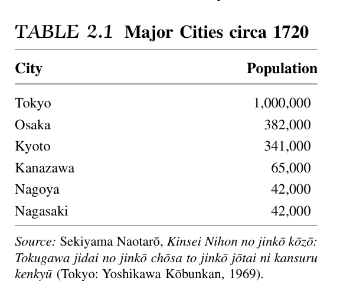
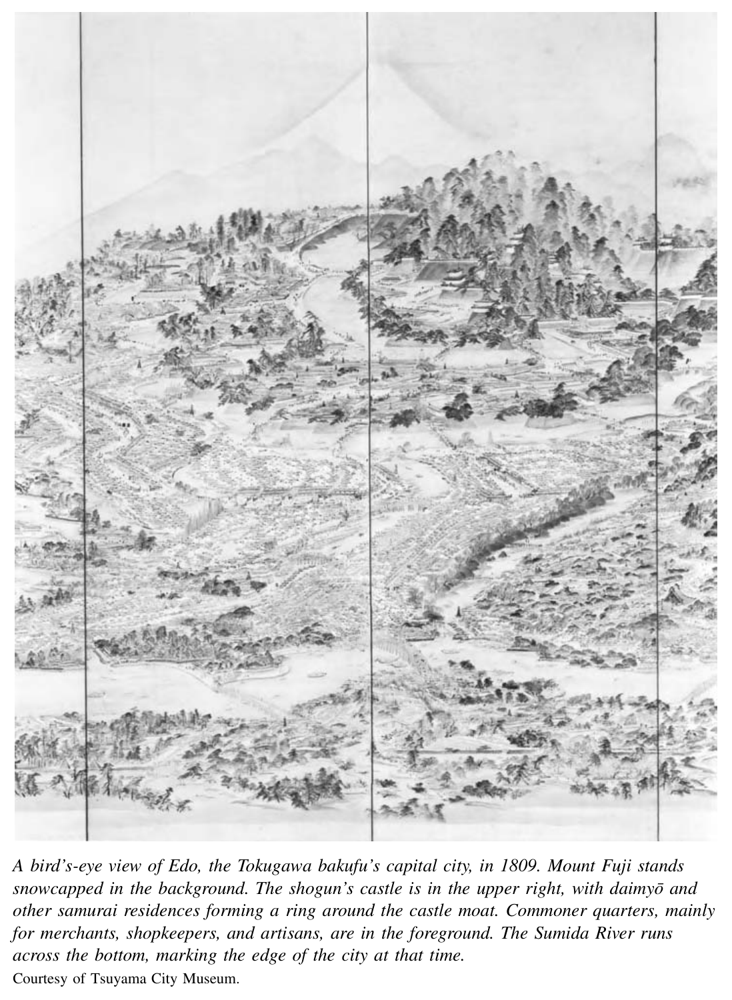
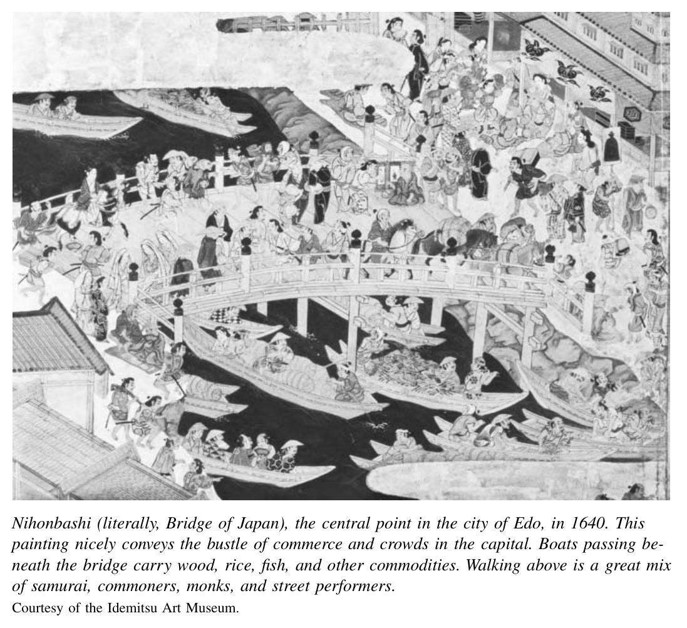
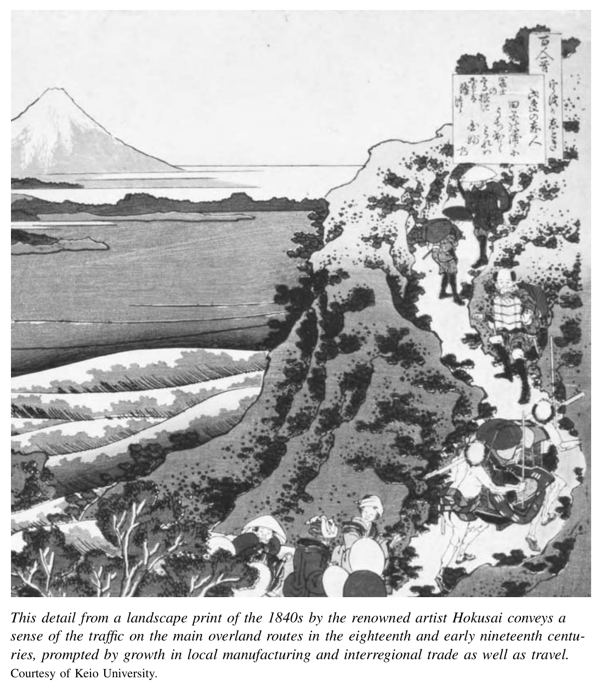
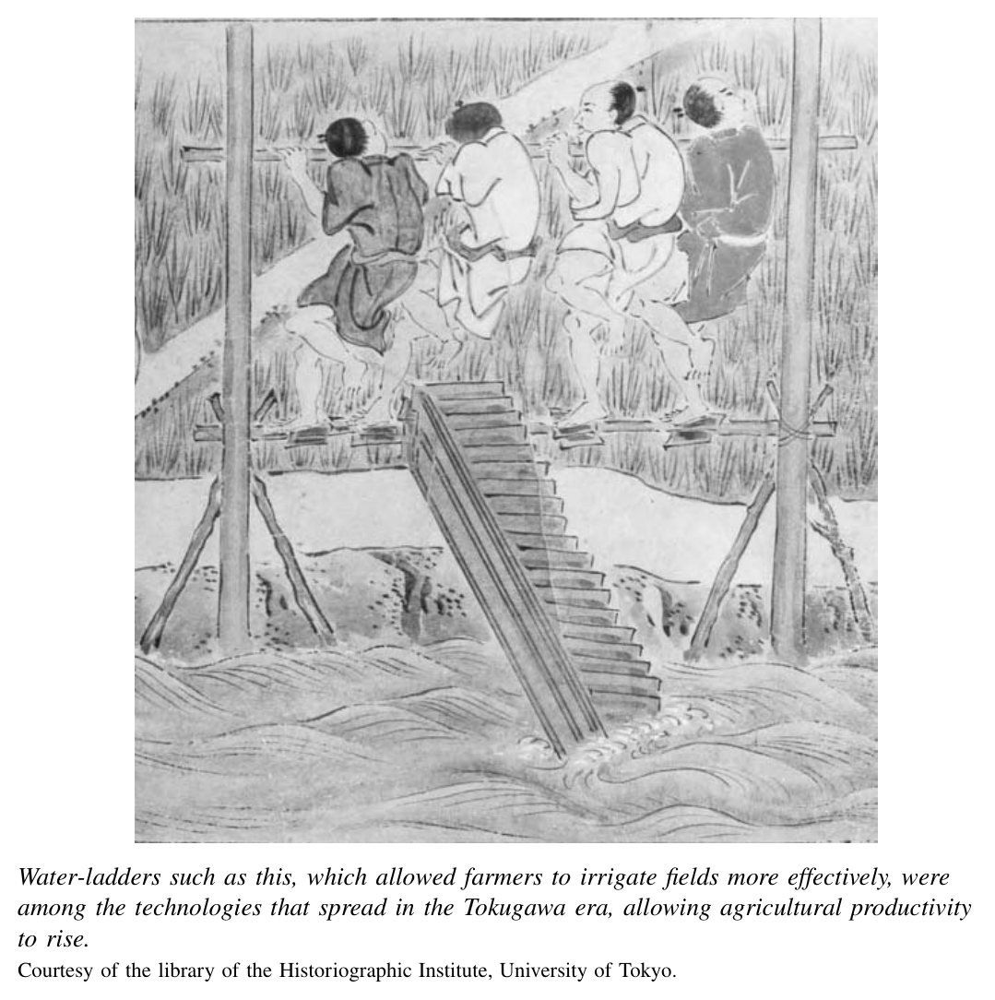
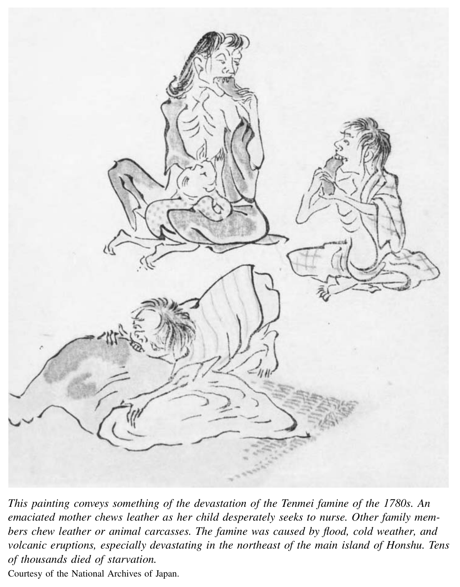
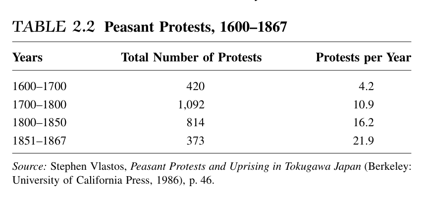

*第一编 德川幕府的危机*

# 第二章 社会与经济变革

德川体制的正式身份秩序在两个多世纪中几乎没有变化。但这一政治制度结构建立在不断变动的社会经济基础之上。两个世纪的经济增长和社会变迁侵蚀了各身份群体之间的界限，并在农民和武士这两个主要身份群体之间产生了新的紧张关系。这些紧张关系催生了强烈的改革压力。

压力有多强烈？到十九世纪初，德川日本是否已是一个处于革命边缘的社会？几乎可以肯定不是。如果没有西方势力重新出现所引发的动荡，德川政权很可能在十九世纪六十年代之后还能延续数十年。但同样确切的是，新的明治政权推行现代化事业的广度和速度，在很大程度上得益于此前文化和社会经济领域的渐进变化，以及德川末期日益高涨的改革呼声。日本十九世纪革命的化学反应，是外部催化剂与内部要素之间的强烈作用。

## 十七世纪的繁荣

在德川统一前夕的十六世纪，日本列岛各地的城市在规模和数量上都在增长。相互争斗的军事统治者（大名）将其武士追随者拉入城下町的半永久性驻军中，推动了这一城市增长。除武士外，这些城镇还居住着后勤人员：军需官、工匠和聚集在城堡周围的商人。〔1〕

但在十六世纪晚期的权力斗争和战争中，大名的命运起伏不定。这些城镇及其商人的根基同样不稳固。直到德川政权巩固了统治并赋予各联邦藩国新的稳定性之后，城市中心才变得更加稳定。当这一切在十七世纪发生时，城市和商业出现了前所未有的繁荣。在大多数藩国，武士成为永久的城市居民。即使是一个小藩的城下町也会有大约五千名武士居民，他们靠俸禄生活，并将全部收入花在城市中。

一项单独的制度创新对促进城市化和将各藩独立经济与大阪、江户整合起来发挥了最大的作用。这

就是参勤交代制度。没有它，各藩很可能会发展成为独立的小国。每个城下町的农村腹地将在一个自给自足的地方经济中供养中心城镇。藩国之间的经济互动将相当有限。

各藩城下町的人口中心确实与其农村腹地建立了经济联系。但除此之外，参勤交代制度的旅行和居住要求促成了人员、现金、商品和服务跨越藩界的大规模流动。参勤交代制度耗尽了大名的财库——旅行费用由他们承担。但它促进了跨区域贸易的扩展和面向远方城市市场——尤其是江户和大阪——的地方专业化生产。

德川首都江户是最大的城市中心和幕府的行政中心。它以将军宏伟的城堡和大量被迫在江户侍奉将军的德川及各藩武士人口为主导。大阪的规模几乎与江户相当，但更深地卷入了商业竞争，是德川时代的商业枢纽。推动这座城市经济运转的是十几家或更多的大米商行。它们经营着将来自日本各地作为赋税缴纳的稻米兑换成现金的业务，大名随后可以将现金拨付给驻扎在江户的武士家臣；商人们还将稻米出售给城市消费者。

这两座城市以及它们之间的道路都充满了生机。见证这一切的人之一是恩格尔贝特·坎普费尔，一位德国医生，曾在长崎的荷兰商馆担任医师。他在1691年和1692年作为荷兰年度朝贡使团的一员前往江户。

> 这个国家人口之稠密超乎想象，人们几乎难以相信，一个面积并不算大的国家竟能养活如此众多的居民。大道两旁几乎是连绵不断的村庄和市镇：你刚走出一个，便进入了另一个；你可以行走许多里路，却仿佛不知道所经之处是由许多村庄组成的。〔2〕

这些城市也是拥挤而肮脏的地方。十八世纪江户的平民区，其人口密度甚至超过了二十世纪晚期东京的住宅区——而东京是世界上最拥挤的城市之一。

总体而言，到1700年，大约百分之五到六的日本人居住在人口超过十万的城市中。以这一标准衡量，当时的欧洲城市化程度还不到日本的一半；只有百分之二的欧洲人居住在这种规模的城市中。如果将城市的定义扩大到包括较小的地方，城市化的程度同样令人印象深刻。到1700年，大约百分之十的日本人口——约三百万人——居住在人口超过一万的城镇中。拥有百万人口的江户是当时世界上最大的城市。京都和大阪各有约三十五万居民，与伦敦或巴黎相当。无论以何种标准衡量，1700年的日本都是世界上城市化程度最高的社会之一。

城市的增长产生了若干深远的经济影响。首先，一套交通和通讯基础设施被建立和维护起来，既为城市居民供应物资，也为大名的盛大队列——每位大名都有数百名随从——在往返途中提供便利。

陆路交通和旅行得益于一套广泛的道路系统。两条主要道路连接江户与京都及大阪：沿海的东海道和穿越日本中部山区的中山道。其他道路则从江户向北、南、西各方向辐射延伸。为接待这些旅客，旅馆网络应运而生。在东海道沿线，有五十三处官方指定的驿站旅馆供大名和高级武士旅客使用，其地位和奢华程度堪比五星级酒店，而平民则只能将就较为简陋的住处。当大名的参勤队列与众多因商务或前往神社朝圣的平民在路上相遇时，场面相当热闹。

到十八世纪晚期，旅行变得如此普遍，以至于一个活跃的出版业发展起来，专门制作地图、旅行日记以及德川时代版的现代旅行指南。1810年一位旅行作家提供的一些建议，对当代游客来说似乎颇为熟悉：“只住老字号的旅馆……即使饥饿，也不要暴饮暴食……只喝干净的水。不要随意饮用旧池塘或山泉的水。”另一些建议则仅针对特定身份群体。普通武士被提醒“就寝时，将刀或双刀放在被褥下面。长戟或长枪应放在身旁。”高级旅客可以找到关于“乘坐轿子时预防疾病”的实用建议，例如饮用“加入少许姜汁的开水”。但对历史学家最有价值的，是那些揭示德川社会如何以特定的身份秩序为标志、并特别注重遵守该秩序规则的建议：

> 旅馆的客人应按照店方安排的顺序入浴。然而，当旅馆繁忙、入浴顺序混乱时，有时会出现棘手的情况。在这种场合，应观察其他客人的外表，如果其中有身份尊贵之人，应让他先行。谁先谁后入浴的问题很容易引发争吵。〔3〕

道路运送的不仅是人，还有货物。为此，一个繁忙的驮马运输业应运而生，数以千计的马夫与旅客争夺道路空间。历史学家分析了这些运输商的记录，揭示了十八世纪经济活动的密度。以中山道——从江户到京都的内陆路线——沿线的一个主要运输中心为例。许多点缀着小城镇和村庄的支线道路汇入这条主要“干道”。在其中点坐落着饭田镇。在典型的一年中，大约有两万一千匹满载货物的驮马从此出发，将当地产品运往远方市场。这相当于一年中每天六十个驮载，全年无休。如果假设马夫只在白天作业，那么每小时就有大约五匹驮马从饭田出发。而这些精确的记录仅涵盖了从该镇发出的业务。过境交通量估计是其五到十倍。十八世纪的一句流行谚语——大概只是略有夸张——声称每天有一千匹马经过。因此，在这个相当偏远的内陆小镇，人们必须想象镇中心的交通拥堵——以及铲子和簸箕的活跃交易。沿海航运实际上比陆路运输更为经济，货船贸易同样蓬勃发展。

江户居民的现金需求巨大。来自日本各地的大名必须将其赋税稻米运到市场出售，兑换成现金，再将现金送到江户以维持其府邸和侍奉的武士。中部和西南部的大名以大阪作为稻米运输和出售给商人的港口。到十八世纪初，大阪中心的河流上挤满了船只，河岸两旁排列着气势恢宏的商人仓库。米商是当时的商业巨头。他们向大名放贷，积累了巨额财富。

除了人和物之外，日益复杂的经济还流通着货币——而且不仅仅是现金。在大阪出售稻米的大名需要将收入转移到江户。这促使商家在首都设立分号。他们在大阪收到大名的赋税稻米后，便在江户向大名交付资金。商人们还开始在收获之前预先以信用方式发放这些资金。实质上，这些商人创造了一个稻米期货市场。大名以预期的赋税稻米为抵押，向商人银行家开具期票，以换取预付现金。这些期票可以按照随收获稻米预期价值波动的价格进行买卖。

在这个日益复杂和高产的经济中，城市是商业的磁石，城镇、道路和海路是经济生活的节点和动脉。而村庄则提供了大部分被消费和加工的原材料。

在重要的方面，德川政府止步于村庄的大门。武士监督者或警察很少驻扎在村庄中。无论是藩政府还是德川幕府都不直接向个别农户征税。整个村庄被统一评定赋税。村庄的头人和长老负责在村民之间分摊税负。这使得村民在完成基本的稻米赋税义务后，可以相对自由地管理自己的事务并为市场生产。

在这种情况下，农民改进了耕作方法，农业生产和产出在江户时代大幅增长。可靠的总体数据并不存在，但保存下来的个别田地的生产记录显示，十八世纪和十九世纪初的产出有时在五十年间翻了一番。〔4〕 这些增长的背后，与其说是新技术，不如说是对现有技术的微小改进以及更好的推广和使用。一些变化简单到只是更多地使用锄头和更好的脱粒工具。此外，农民采用了更高产的稻种，更多地使用诸如磨碎的干鲱鱼等肥料，并通过更多地使用水车改善了灌溉系统。

使这种更好做法的推广成为可能的一个根本性变化是识字率的提高。受过教育的武士以及一些僧侣和农民（包括相当多的女性）开始在非官方学校为乡村民众开设课程。这些学校通常设在村庄的佛教寺院中。越来越多的农家子弟——男孩和女孩都有——学会了阅读。有进取心的农民开始撰写描述有效农业技术的“指南”手册。这些手册从十七世纪起便广泛流传。估计数字不一，但到十九世纪初，似乎有三分之一到二分之一的日本男性和大约五分之一的女性具备读写能力。〔5〕

在和平环境下，加上土地产出的提高，日本人口在十七世纪急剧增长。虽然没有进行过可靠的全国人口普查，但零散的寺院记录和赋税收入记录综合表明，从1600年到1720年，农业人口从约一千八百五十万增长到两千六百万。如果加上约七百万城市居民和非农人口——商人、工匠和武士家庭——总数达到约三千三百万。人口在大约一百二十年间似乎几乎翻了一番，年均增长率达到令人瞩目的百分之零点八。

## 停滞与活力之谜

十七世纪繁荣之后一百五十年间的经济和社会证据，呈现出一个停滞与活力并存的表面悖论。从消极的一面来看，首先引人注目的是本州中心地带最大城市——尤其是城下町——的萎缩。来自三十七个主要城下町的数据显示，从1700年到1850年，平均人口减少了百分之十八。经济发达的西南部各藩遭受了最严重的人口流失。唯一增长的城镇位于偏远地区。〔6〕

此外，总体人口增长在十八世纪二十年代到十九世纪六十年代之间几乎完全停滞。十八世纪晚期，几场毁灭性的饥荒夺去了数千人的生命。在1786年的天明饥荒中，数十年来最恶劣的天气导致了歉收、饥饿

和村庄的荒废。城市中传来尸体堆积无人掩埋、甚至出现人相食的报告。十九世纪三十年代，又有大范围的饥荒被记录下来，在一些地区造成了数万乃至数十万人因饥饿和相关疾病而死亡。报告的细节令人信服：人们

在吃树叶、野草甚至蓑衣；官员们发布指令，允许农民不必等待官方许可便可掩埋死者。

除饥荒之外，一个令人困惑和不安的现象是溺婴的做法。出于至今仍有争议的原因，农家遗弃或杀害不想要的婴儿——无论男女——显然并非罕见。当时的道德家以及直到二十世纪七十年代的大多数历史学家，都将溺婴视为走投无路的农民的最后手段。但对寺院登记簿等人口记录的仔细分析提出了另一种解释。至少在一些村庄，溺婴的证据在较富裕的农民中更为明显。它可能是一种家庭计划手段，不仅被最贫困者用来避免饥饿，也被成功的农民用来防止众多子女将一个稳定的家业分割成无法养活一家人的微小单位。〔7〕

面对这些趋势，来自城市的抱怨在数量和强度上都在增加。武士官员将饥荒和溺婴视为统治者和被统治者道德败坏的证据。精英阶层未能履行其义务——以足够的仁政来调和等级制度，至少让农民能够生存（并缴纳赋税）。更切身的是，居住在城市的大名和武士的生活成本不断攀升。很少有藩国成功地增加了收入来弥补这些开支，尽管它们本可以更积极地对农民不断增长的产出征税。大名和武士转而向商家借贷，而且往往难以偿还。到十九世纪初，在官僚化的武士精英看来，世界似乎已经失序。如下的哀叹屡见不鲜：

> 今日之武士，已在奢靡中度过了近两百年……五六代人不曾见过战阵。他们的武艺已经消失殆尽，……十之七八已柔弱如妇人。〔8〕

城市商人也好不到哪里去。将军和主要大名拥有足够的政治权力来直接赖账不还。他们相当有规律地这样做。商人除了吞下损失、发放新贷款之外别无选择。同样令人担忧的是，新兴的农村生产者正在有效地与官方认证的城市供应商竞争。1789年的一份抱怨来自冈山——一座拥有约两万平民且人口急剧下降的城下町：

> 本城的商业持续衰退，许多小商人陷入了极大的困境。另一方面，来自其他藩国的船只在下石井村和西大寺村等地停靠的越来越多，使乡村贸易日益繁荣。过去人们从周边地区进城购物，现在城里人反而到乡下去购物。过去乡村店主进城领取寄售商品，现在城里店主派人到乡下安排领取寄售商品……农民和商人的位置已经互换。这自然使城中许多人陷入了贫困。〔9〕

这些报告——无论来自武士行政官、学者还是城市商人——反映的是那些对世界应有的自然等级秩序遭到破坏而感到愤怒之人的焦虑。它们同时也揭示了在现实世界中，大名或官方特许商人的不幸正是他人的收益。冈山作者关于“农民和商人的位置已经互换”的哀叹，是对经济账簿另一面证据的反应：十八世纪和十九世纪初，农村生产和商业出现了巨大的增长。

一份来自一个小镇的文献记载，该镇从1757年到1855年因专门从事纺织而规模扩大了两倍：“前来谋生的织工雇用女工纺纱织布，人们从其他藩国蜂拥而至，在镇上甚至周围的村落租房居住。”〔10〕 其他资料描述了拥有三十到五十甚至一百名雇工的纺织作坊。

大量其他产业在乡村各地发展起来，包括清酒（米酒）和味噌、酱油、醋、精炼油、干果等食品的生产。在丝绸、棉花和粗布的纺纱和织造中，复杂的家庭手工业生产网络逐渐形成。经纪人协调多达十几个生产环节，每个环节都有其专业化生产者网络。类似的生产网络也出现在漆器、陶瓷、日用木碗、纸张和纸制品、蜡烛、绳索、木屐、织物染料以及梳子和发饰等装饰品的生产中。到十九世纪，这些以及许多其他产品早已不再被城市工匠或城市市场所垄断。这一变化可以被称为乡村的“原始工业化”。其特征是经营规模的扩大和服务于远程市场的专业化生产网络。这些网络深深嵌入了农村社会和经济之中。农村人口中一个相当大且不断增长的少数群体——男女皆有——开始在家庭之外从事各种制造业的雇佣劳动。一些人签订了年度或季节性合同。另一些人则成为临时日薪劳动力的一部分。

这种经济发展有时使新兴的农村生产者与老牌的城市商人和工匠对立起来。同时，在乡村内部，它也使繁荣的、具有企业家精神的上层与处境艰难的小农或佃农对立起来。后者在一个危险与机遇并存的世界中挣扎求存。

在德川日本，较贫困的农民几乎没有有效的合法抗议手段。如果赋税或债务过高，他们可以干脆逃往另一个藩国，有些人确实这样做了。但这在法律上和经济上都是一个冒险的选择。通过正当渠道向当局请愿寻求救济并不违法，但如果请求被驳回，请愿者面临被惩罚的风险。任何其他形式的越级请愿都是违法的，所有集体性的群众行动也是如此。但这种违反秩序的行为确实发生了，而且随着时间的推移频率不断增加。

趋势明显朝着更多抗议的方向发展。这些抗议包括集体请愿和示威，以及对官员或富人的攻击。随着时间推移，一个重要的转变发生了——行动变得更加激进。从1600年到1650年，相对被动的逃亡行为和卑微的递交请愿书的行为合计占所有农民“抗议”的近一半。到十九世纪上半叶，这些行为仅占所有抗议的百分之十三，而被归类为“直接攻击”和“打毁”的行为现在占到了百分之四十三。〔11〕

其中一些抗议是农村生产者因商业限制而对官方特许的城市竞争对手发起的。但许多行动——尤其是当时俗语中所谓的“打毁”——发生在乡村内部和农民阶层内部，是贫苦农民攻击富裕邻居。抗议者往往捣毁成功的农民生产者的住宅，洗劫他们的仓库。他们有时按照大致估算的“公平价格”分发其中的物品。他们很少对人造成身体伤害。遭受攻击的通常是地主、放贷者、商人和制造商（往往是同一个人身兼数职）。例如，他们就是那些以高利贷向试图在旁边种植桑树、养蚕的小农放贷的人。如果价格下跌、贷款无法偿还，抗议就可能爆发。小农们在利用贸易和农村工业扩展所带来的机会。同时，他们也惧怕商业和市场渗透到村庄后带来的更大脆弱性。他们深深怨恨那些利用自身地位收取高额利息、以借贷者为代价牟利的富裕农民。

在这个社会和经济世界中，人们还发现男女之间在规定角色与实际做法之间存在着重要的张力。德川社会的正统理想认为，女性应当被保持在无知和厨房之中。这种态度的经典表述是一部受中国思想启发的文本，名为《女大学》。这部手册被归于儒学学者贝原益轩，写于十七世纪七十年代。它很可能是由其他人所写，甚至可能是益轩的妻子——她本人也是一位学者。无论作者是谁，这部著作流传甚广。它包含十九章，提出了教育女性的一般原则和要求顺从行为的具体训诫。正如一位学者所指出的，“[作者]宣称女性的生殖器官虽然对于繁衍男性继承人是必要的，但与愚钝、懒惰、淫荡、暴躁的脾气以及极强的记仇能力相关联。”〔12〕

社会实践往往违背这些严苛的规训。女性在家庭经济内部——一如既往——以及外部都发挥着至关重要的生产作用。她们偶尔担任富裕农户以及城镇商铺或手工作坊的管理者或共同管理者。较为普通的农家妇女会从农村纺织经纪人那里接受纺纱或织布等计件工作，城市妇女同样也接受计件工作。此外，年轻女性常常离家成为季节性或更长期合同的雇佣劳动者。与早期一样，富裕农家的女儿在京都的贵族府邸中充当家仆，而贫困家庭的女儿则在城市或城镇的妓院中充当妓女。在这些情况下，父母会收到一笔可观的预支工资。她们的女儿有义务在三到六年的期限内以劳动偿还这些合同的债务。

家庭之外的其他女性工作是这一主题的新变奏。乡村蓬勃发展的纺纱和织造中心的劳动力大部分是女性。这些女工与从事性服务行业的人一样，往往长途跋涉，住在工作场所。她们居住在小型织造作坊中，这些作坊事先与其父母签订了一个季度或更长时间的合同。所有这些形式的雇佣劳动——在家庭中、妓院中和工厂中——都将延续下去，并在此后日本近代的经济和社会史中扮演核心角色。

武士上层以外的男性，在日常实践中也比性别分离和等级制度的意识形态所暗示的要灵活得多。德川时代和明治初期的证据都表明，他们在育儿和家务中发挥了积极作用。1610年一位富商对其子的书面训诫中，包括了处理诸如为仆人准备食物、购买和储存柴火、分拣垃圾等事务的命令：“如果一个男人不亲自承担这些琐事，他就永远无法成功地持家。”〔13〕 家庭既是工作场所也是居所，家务劳动并未被严格地划定为女性的活动领域。1878年，一位美国旅行者伊莎贝拉·伯德描写了一个清晨的乡村场景：“十二到十四个男人坐在一堵矮墙上，每人怀中抱着一个不到两岁的孩子，逗弄着、玩耍着，炫耀着孩子的体格和聪明。”〔14〕

如何调和饥荒和溺婴、城市和大城镇人口下降、社会抗议增加等不可否认的证据，与同样有力的社会活力和农村贸易及制造业扩张的证据？我们可以首先通过认识到阶层之间和阶层内部以及地区之间资源分配的不均衡来调和这些相互矛盾的证据。解释社会阶层和地区不同命运的第二个因素，是德川经济融入亚洲范围或全球贸易网络的程度相对有限。

城市衰落的同时，较小的城镇却在繁荣。这些乡村地方有若干优势。它们靠近原材料和水力资源，接近不断增长的农村市场，也离城市市场足够近。它们依靠商人和生产者之间紧密的人际关系网络来维系。在缺乏系统性商法的情况下，这些联系对稳定的经济关系至关重要。它们受益于农村劳动者在农业和其他职业之间灵活转换的能力。它们不受赋税和行会限制的束缚——这些限制更多地妨碍了处于德川或藩当局更严密监视下的城市商人。在乡村内部，一些地区也比其他地区发展得更好。特别是，农村生产和贸易在从本州中部向西南延伸到北九州的地区最为广泛地扩展，而本州北部则相对落后。

乡村部分地区以城市为代价的繁荣，与十七、十八世纪欧洲的经验形成了有趣的对比。在欧洲，农村经济倾向于增长，但城市中心并未同时衰落。差异在于欧洲人如此积极追求的蓬勃的对外贸易。它增加了城市就业，允许粮食进口，似乎也促进了总体人口增长以及向城市的迁移。

在德川日本，国际贸易的重要性仅属中等。十七和十八世纪的日本人确实通过长崎港向中国出口了大量丝绸和铜，以及大量白银到朝鲜。这一贸易支撑了长崎附近、矿区以及从南部九州到中部京都和大阪的丝绸产区的就业。即便如此，日本的对外贸易并未像同一时期的欧洲那样发挥经济和城市增长引擎的作用。取而代之的是一种内向型的、以农村为中心的增长。

经济命运因阶层而异，也因地区而异。随着经济变得更加复杂和高产，它既提供了机遇，也带来了风险。这是一个变革过程，其中失败的严酷后果并未得到系统性社会福利政策的缓冲。相反，村庄中的贫富差距和权力差距越来越大。农村上层变得更有文化、更具流动性。富裕农民拥有可供投资的土地和现金。他们拥有做出更好决策所需的教育和信息。

德川社会从来不是平等的。在这个时代的末期，改革者有时提出这样的观念：家康的早期时代是一个黄金时代，那时村庄里居住的是财力相当的自耕农。这是一个神话。其倡导者往往是试图“矫正”一个实际上一直包含着贫困村民的世界的叛逆者——这些贫困村民依赖藩主或村庄领袖的仁慈来获得减税或贷款以度过荒年。但德川早期的依附性村民往往是仆人或分家成员。他们的贫困因庇护者对其所负有的照顾义务感而得到缓冲。

到十九世纪，家长式的仁慈并未消失，但似乎变得不那么可靠了。依附性平民与其上层之间的联系越来越多地通过雇佣劳动合同而非亲属纽带来维系。他们更经常需要这种救济，却更难以指望得到。德川时代社会抗议的逐渐但显著的增加，并非对一般意义上的不平等——这并不新鲜——的回应，而是对一种新型不平等——市场的不平等——的回应。统治者和富人遭到攻击，与其说是因为他们的身份本身，不如说是因为他们未能履行被认为与身份相伴的仁慈义务。

## 注释

〔1〕 参见约翰·W·霍尔，《城下町与日本的近代城市化》，载约翰·W·霍尔、马里乌斯·詹森编，《近世日本制度史研究》（普林斯顿，新泽西州：普林斯顿大学出版社，1968年）。

〔2〕 引自迈克尔·库珀，《他们来到日本：1543-1640年欧洲人关于日本的报告选集》（伯克利：加利福尼亚大学出版社，1965年），第292页。

〔3〕 所有引文均取自八隅芦庵，《旅行用心集》，康斯坦丁·N·瓦波里斯翻译并导读，《旅人须知：江户时代的旅行建议》，《日本学纪要》第44卷第4期（1989年冬），第461-483页。

〔4〕 托马斯·C·史密斯，《日本工业化的本土源泉，1750-1920》（伯克利：加利福尼亚大学出版社，1988年），第51页。

〔5〕 关于识字率的讨论，参见罗纳德·多尔，《德川日本的教育》（伯克利：加利福尼亚大学出版社，1965年）。

〔6〕 史密斯，《本土源泉》，第20-21、46-47页。

〔7〕 参见托马斯·C·史密斯，《中原：一个日本村庄的家庭农业与人口，1717-1830》（斯坦福，加利福尼亚州：斯坦福大学出版社，1977年）。丹尼尔·斯科特·史密斯在《日本研究杂志》第5卷第1期（1979年冬）上对此书的书评提供了对数据的一些替代性解释。

〔8〕 杉田玄白的陈述，引自哈罗德·博利索，《天保危机》，载马里乌斯·詹森编，《剑桥日本史》第5卷《十九世纪》（剑桥：剑桥大学出版社，1989年），第128页。

〔9〕 引自史密斯，《本土源泉》，第25-26页。

〔10〕 引自史密斯，《本土源泉》，第29页。

〔11〕 斯蒂芬·弗拉斯托斯，《德川日本的农民抗议与起义》（伯克利：加利福尼亚大学出版社，1986年），第46页。另见詹姆斯·W·怀特，《一揆：近世日本的社会冲突与政治抗议》（伊萨卡，纽约州：康奈尔大学出版社，1995年），第157页。

〔12〕 珍妮弗·罗伯逊，《心学中的女性》，载盖尔·伯恩斯坦编，《重塑日本女性，1600-1945》（伯克利：加利福尼亚大学出版社，1991年），第91页。

〔13〕 凯瑟琳·S·宇野，《女性与家庭劳动分工的变迁》，载《重塑日本女性》，第33页。

〔14〕 宇野，《女性与家庭劳动分工的变迁》，引用伊莎贝拉·伯德，《日本未踏之路》（纽约：G·P·普特南出版社，1880年）。
