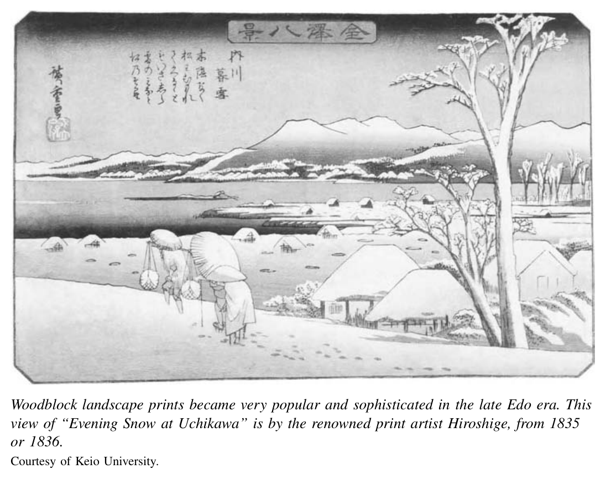

*第一编 德川幕府的危机*

# 第三章 德川晚期的思想世界

面对从大名和武士的长期债务到毁灭性饥荒和暴力抗议事件增加等广泛的困顿与衰落迹象，统治者和被统治者都对其不断变化的世界提出了激烈的批判。这些言论的要旨往往既回顾过去，也展望未来：需要进行改革，使当下的世界回归往昔的美好时代。颇具讽刺意味的是——这种情况屡见不鲜——保守的改革实际上启动了一连串事件，使回归过去变得不可能。要理解德川晚期的文化与思想激荡，必须首先审视改革者所希望恢复的那个理想世界。

## 德川政权的意识形态基础

任何政治秩序要像德川体制那样长久存续，都不能仅仅依靠霸主及其党羽的强制力量。权威必须建立在被接受的合法统治理念之上。与所有有抱负的统治者一样，织田信长和丰臣秀吉面临着这一意识形态困境。然而，他们面对这一困境的紧迫性尤为突出。由于他们如此赤裸裸地使用了强制手段，就比通常更需要说服人们相信其统治的合法性。这两人以及德川家康都试图将自己的权威建立在宗教和世俗的象征与理想之上。

信长在向民间宗教教派开战并杀害数以万计的人的同时，将自己塑造为神圣的统治者。他要求武士“崇敬”他。作为回报，他不仅提供军事保护，还提供神圣的庇佑。他宣称，今生所尽的忠诚将使忠实的家臣在来世获益。他发布告示，要求人们崇拜他以获得财富和幸福。他还逐渐将自己呈现为“天下”的化身（日语为“tenka”，字面意思是“天之下”）。与此前的军事霸主不同，他拒绝了将军的职位，因为这将使他在象征意义上从属于天皇，成为接受天皇任命的臣下。他让家臣在效忠誓词中使用“为天下，为信长”的措辞。他由此将自己与天下等同起来，而天下本身被定义为普天之下的一切。他以一种类似于——但早于——法国路易十四那句著名宣言“朕即国家”（“l'état, c'est moi”）的方式宣示了主权。

秀吉也有这种自我神化的倾向。他在京都的宫殿中以平等的身份接待天皇。他的正室被赋予与天皇之母同等的地位。他的儿子被赋予与天皇之子同等的身份。他还将侵朝战争包装为神圣的国家征伐，在神社举行隆重的仪式。尽管神道传统视血为严重的污秽之源，秀吉却为自己举办了一场“血祭”。死后，他安排为自己建造神社，尊号为“丰国大明神”，并在全国各地设立分社。

德川家族延续了这些与皇室神圣地位相抗衡的个人神化计划。家康控制并支配着宫廷家族的一举一动，甚至连琐碎的行为也不放过，并在他们面前接见外国使节。家光则在1634年率领三十万九千人浩浩荡荡地前往天皇所在的京都巡幸。

德川家康还修建了宏伟的日光神社。在二十世纪，这里已成为日本首屈一指的旅游胜地，但家康追求的并非旅游收入。他是在其直接前任者那种夸张的、巴洛克式的传统中寻求自我神化。他知道信长辉煌的安土城——在信长死后不久即被毁——并有意识地试图消除和取代秀吉的神社网络。他指定自己死后葬于日光。在一个具有象征意义的身后政治举措中，这座神社与他的江户城之间的距离，恰好等同于伊势神宫与京都皇宫之间的距离。他为自己取了“东照大权现”的谥号。这一称号同时援引了佛教的转世概念和神道的光辉意象。他还将自己塑造为一位亚洲乃至世界性的神祇：在家光时代，朝鲜使节到日光参拜，琉球群岛的官方代表也来朝拜，甚至荷兰人也不例外。在选址、仪式用途和命名上，家光都试图取代伊势神宫作为国内首要神圣政治象征的地位。1645年，他将日光神社提升为“宫”的等级，与伊势神宫使用同一称号。朝廷的敕使被迫前往日光参拜，而非相反。

德川统治者在通过象征性地神化统治者个人来巩固其统治权的同时，也将其合法性锚定于宗教和世俗传统的哲学主张之中。在德川统治的第一个世纪里，从多元的思想源流中逐渐形成了关于正当政治和社会秩序的几项核心共识。第一，等级制度是自然的、正义的。第二，无私的奉献和安于等级社会中自身的位置是崇高的美德。第三，德川家康是伟大的圣人创业者，一切智慧的源泉。他所创建的秩序据说根植于宇宙的秩序之中。

佛教、神道和朱子学（新儒学）元素的复杂混合构成了这一意识形态综合体的基础。一位由武士转为禅僧的铃木正三（1579-1655）是这一意识形态的来源之一。他主张，今生是报答恩人（主君、父母）之恩的机会。人不是为自己而存在，而是为主君和社会而存在。人通过恪守自己的本分来服务于他们。铃木劝诫平民通过积极履行日常工作来追随自己的“天职”。他教导说，其结果将是来世的救赎。一位名叫山崎闇斋（1618-1682）的神道学者在神道传统中寻找一种“日本之道”的思想来解释他所认知的世界。他运用数秘术论证日本古代神祇的教诲与中国圣贤之间的平行或对应关系，并由此构建了一套支持德川之道的论证。〔1〕

最后，在十七世纪末日益多元和充满争论的思想世界中，众多思想家援引朱子学思想来教育统治者和被统治者，阐明正义政治秩序的特质。自中世以来，朱熹强调直接研读古代儒家经典的新儒学思想，在日本主要由佛教僧侣研习。江户一所重要的新学院开始改变这一状况。它由藤原惺窝及其弟子林罗山创立。这两人说服幕府以官方认可的智囊机构的形式支持他们的事业。1630年，幕府为其建筑提供了资金，以一座1633年落成的尊崇孔子的“圣堂”为中心。1670年，林家学院被正式认定为幕府的官学。作为世俗学者，林家与家康和家光的佛教顾问产生了冲突。后者反对在寺院之外推广儒学。林家学者成功地挑战了寺院的学术霸权，但从一开始他们自身也面临着来自对手世俗学者和学院的挑战。在这一过程中，日本的大量学术活动被带入了一个世俗领域，其中的学生不仅有武士，还有富裕的平民。林家学者及其对手强调知识的实用价值，同时动员儒学思想来支持国家。

这些思想家所发展的朱子学综合体的核心是“理”的原则。这一不变的自然法则据说是一切学问和行为的基础。它渗透于物质宇宙和人类的社会世界之中；因此自然法则和社会法则具有相同的形而上学基础。中国和日本的朱子学者都主张积极地“格物”——探究物质世界和社会世界，以发现理在其中的作用。观察据说证实了理支配着天体的运行。它将大地置于底部，太阳置于上方，星辰围绕两者运转。同样，统治者居于上位，人民居于下位。所有人之间也有着恰当的关系：父子、夫妻、君臣、朋友、兄弟。具体到日本，将军统治者据说居于其余人民之上。天皇作为至高天体——太阳——的后裔，将权力委托给他。人民——分为武士、农民、工匠和商人四种基本身份——居于其下，武士则作为统治权力的辅佐。在德川时代初期，这一秩序在字面意义和象征意义上都被奉为圣人家康的神圣创造。所有德川改革者——即便来自对立的哲学传统——的首要目标都是维护这一秩序。

## 文化多元与内在矛盾

朱子学的综合体将自然世界和人类世界描绘为浑然一体、井然有序的。然而事实上，德川时代的许多日本人——包括儒学者自身——都认识到他们的世界是一个复杂的所在。各个部分并不总是契合无间；人的欲望和政治忠诚可能与正统的理想社会观念相悖。在探索这些矛盾的过程中，不断扩大的参与者群体为城市和乡村、平民和武士精英的思想文化生活注入了活力并使之多元化。论争始于十七世纪六十年代，恰逢朱子学说获得幕府庇护而得到认可之际。这场论争持续了近两百年。各种各样的个人和学派就儒学的正确诠释展开争论。在儒学传统内部工作的学者还面临着来自完全不同思想流派的学者的挑战。

古学派（Kogaku）或许是从试图为当世诠释孔子的学术传统内部对朱子学思想发起的最重要挑战。一系列杰出学者阐发了古学思想。其中最著名的是荻生徂徕（1666-1728）。该学派的名称源于其坚持认为，正确的知识有赖于对孔子本人古代文本的直接、无中介的理解。他们主张，朱熹或其在朝鲜、中国、日本的追随者对新儒学的诠释未能理解古代词语的真正含义。这一立场颇具讽刺意味。朱熹本人在十二世纪的出发点同样是呼吁忽略中间的诠释，直接回归古代儒家经典。

徂徕尊崇孔子以及在儒学思想基础上建立政治制度的中国古代圣王。他强调武士需要以古代儒家统治者为楷模，修养德行，恪尽职守。他要求他们以古代制度为范本来塑造当代的制度。与此同时，徂徕认识到，古代圣王的“道”——即政治伦理秩序——是他们凭借自身的高度智慧和洞察力所创造的，并非直接由神圣力量所施加。这就隐含地为后世的统治者——如德川日本的统治者——开辟了进行适当调整的道路，前提是这些调整必须基于对古代文本、礼仪和制度的正确理解。

对于徂徕、他的同时代人及其后继者而言，核心问题在于如何为创造性的政治行动和制度革新提供正当性。社会在他们眼前明显地发生着变化，但它理应根植于古代的思想和实践之中。徂徕致力于维护一种源自古代中国的永恒不变的“道”。作为十八世纪初的幕府顾问，他的一些政策建议要求幕府采用中国古代的税制或官僚体制。但他也足够务实，主张当世的统治者应采取一些革新措施，例如允许农民买卖土地。〔2〕

到十八世纪初，商人与徂徕等武士学者一道，积极投入到对古代文本和当代世界的研究与批判之中。尤其是在大阪及其周边地区，涌现出一批由平民资助的学院。

其中最重要的一所获得了德川统治者的官方认可，名为怀德堂商人学院。近年来对怀德堂学者的研究改变了历史学家长期以来的看法——即德川商人阶层接受了儒学身份秩序中的从属地位，并未提出任何政治诉求。怀德堂学者实际上主张政治与经济不可分割。他们将武士和商人置于功能上等价的角色中：前者负责运营官僚行政，后者则管理对整个社会都至关重要的经济事务。

诚然，怀德堂知识分子并未挑战武士的统治权。我们不能简单地将德川商人的思想与十八世纪开始反对贵族权力的欧洲城市资产阶级的思想相类比。但德川时代的这些学说确实强调了商人与官僚之间在德行和公共职能上的相互依存和相对平等。这些观念构成了一个文化世界的重要组成部分，这个文化世界延续到了后来的时代——那时城乡商人都成为了致力于富国利己的实业领袖。〔3〕

德川时代文化激荡的一部分，不仅发生在严肃的武士学者之间，或同样庄重的商人资助的学院之中，还展开在大城市——尤其是大阪和江户——的娱乐区里。在这里，剧场和书店与茶馆和妓院比邻而立。在这里，武士与平民混坐在人偶剧和歌舞伎的观众席中。这些剧目的脚本取材于耸人听闻的流言和轰动一时的犯罪事件，探讨义务与欲望、公法与私义之间冲突的深刻主题。

德川时代的城市孕育了繁荣的散文小说、诗歌和绘画艺术，它们歌颂平民和浪子的生活，温和地挑战着既定秩序的道学家们。例如，井原西鹤创作的通俗小说嘲讽宗教、商人及其贪婪，以及人的欲望。他的作品聚焦于社会底层的人物，将他们塑造为英雄和女主角。在《好色一代女》中，他以一个游女寻找理想情人的故事，对宗教真理的追寻进行了辛辣的戏仿。最后一幕中，这位游女站在寺庙里，凝视着一百尊佛像，每一尊都让她想起一位旧日的情人。另一位具有不同批判敏感性的江户作家是诗人松尾芭蕉（1644-1694）。他优雅的俳句赞美自然世界和正在消逝的过去。身居大都市的他，在作品中怀旧地欣赏着他不时逃离前往的宁静乡村。

> 古池や
> furuike ya
> 蛙飛び込む
> kawazu tobikomu
> 水の音
> mizu no oto〔4〕

一个前所未有的文学和艺术市场还支撑了德川时代最为今日海外所知的文化产品——木版画，即浮世绘。这个词的字面意思是“浮世之画”。“浮世”指的是妓院和剧场世界中转瞬即逝的娱乐。当木版画艺术在德川中期开始繁荣时，著名游女和歌舞伎明星演员的版画被大量制作。画师们

自身也成为文化界的名流。后来的版画艺术家还转向了风景画这一题材。他们创作了许多著名作品，以图像形式呼应了芭蕉对乡村的探索。版画还经常与文字相结合；二十世纪漫画的一个灵感来源很可能就是德川时代的版画艺术。

城市文化生活的核心涌现出两大戏剧传统：歌舞伎和文乐人偶剧。前者最初是男女妓女吸引人群的手段，这些观众随后可能被引诱购买性服务。演出通常在干涸的河床上的露天剧场举行，与驯熊、老虎表演或相扑摔跤等嘉年华娱乐并列。1629年，幕府禁止女性演员登上歌舞伎舞台，以图压制卖淫活动。颇具讽刺意味的是，歌舞伎不仅存活了下来，有人说还因此而进步了。它无疑变得更加独特。女形（onna-gata）——男性扮演女性角色——的精彩表演成为歌舞伎剧场的标志性亮点。在十七、十八世纪的剧场中，我们可以找到后现代观念的一个早期范例：性别认同并非固定于人的肉体之中，而是表演的可变结果。

文乐人偶剧是江户时代文化的第二大创新。其“演员”是大约真人三分之二大小的人偶。每个人偶由多达三名操偶师操控。一位技艺高超的太夫吟唱各个角色的台词和叙述，由乐师伴奏。人偶剧对作家颇具吸引力，因为他们无需应付傲慢的演员，剧本的文学品质因此得到了精美的发展。最伟大的文乐剧作家是近松门左卫门（1653-1725）。他的作品以描写普通人的悲剧生活而著称，包括家庭凶杀等轰动一时的当代事件。

近松精妙地捕捉了德川思想和社会中的张力。他的作品常常探索义理与人情之间的冲突——一方面是义务或责任，另一方面是人的感情（义理对人情）。《曾根崎心中》大致取材于一个真实故事，讲述了一个纸商无可救药地爱上了一个妓女。他的亲属批评他，生意也随之失败。他典当了妻子的和服来赎买情人的契约。在妻子和家人准备与他断绝关系之际，他和情人在愧疚与欲望的撕扯中私奔，最终殉情自杀。最终，义理摧毁了欲望，但观众却不禁希望事情不是这样的结局。

近松在《假名手本忠臣藏》中以更直接的政治意涵探索了类似的矛盾结局。浪人是没有大名或主君可以效忠的武士。近松于1706年创作了这个故事的人偶剧版本。十八世纪四十年代，一个歌舞伎版本问世，名为《忠臣藏》，成为德川时代上演最频繁的剧目（在现代日本，它仍然是电影和舞台上极受欢迎的题材）。人偶剧和歌舞伎的脚本通过将事件移置到数百年前来薄薄地掩饰其取材于1703年一起真实事件的出处。故事歌颂了一群武士的忠义——他们的主君被政敌陷害并处死。为了复仇，他们违法攻杀了前主君的仇敌。与曾根崎殉情的家庭悲剧一样，对法律和秩序的违反最终受到了惩罚。四十七名家臣被当局要求切腹自尽，作为他们成功实施私人复仇的代价。但这些忠义之士在死后成为英雄——无论是在真实事件中还是在剧作中——这暴露了德川政治世界中一个关键的张力：终极的忠诚究竟应归于谁？

剧作家和演员们探索这些张力，令大批观众为之倾倒。德川的政治顾问和学者则试图遏制这些文化形式，并解决它们所揭示的问题。娱乐区本身被围墙环绕，在物理上被隔离在城镇的边缘。武士被告诫不得进入其大门。幕府和各藩颁布了所谓的“奢侈禁令”，以使社会行为与世袭身份保持一致。这些法令限制了不同等级的武士以及商人和其他平民所允许穿着的服饰。它们规定了谁可以乘坐轿子出行。它们按照身份和等级限制建筑的规模。法律甚至规范了饮食习惯，禁止农民享用茶这种不可言喻的奢侈品。农民只能以白开水自足。

这些禁令中有许多被反复重新颁布，这一事实有力地证明了许多人对它们置若罔闻。在这个意义上，幕府的专制统治有其局限。尽管如此，这些法律确立了一种严肃的基调，而这个时代的张力在近代也有回响。与许多社会一样，一种谴责奢靡生活、颂扬节俭的道德主义倾向至今仍存在于日本的文化生活和公共政策之中。然而，大众文化的另一面则赞美财富的积累和丰裕商品的时尚消费。

当局还对歌舞伎的题材加以限制，并规范演出的时间和场次。这是遏制德川秩序内部张力的更广泛努力的一部分。荻生徂徕就如何处理四十七浪士复仇事件向将军提出的意见，正是针对对特定主君的忠义之德与对整个社会的秩序之价值之间的张力。他承认他们的行为是正义的。它源于一种正当的羞耻感——一种“使自己免受任何玷污”的决心。即便如此，他得出结论认为，全国的法律必须得到维护，这些人必须受到惩罚。“未经官方许可的暴力行为”是不可容忍的。如果“普遍原则因特殊例外而受损，这个国家将不再有对法律的尊重”。〔5〕

其他一些张力最终无法遏制。其一是才能与世袭之间的冲突。儒家的统治者凭才能获得其地位。在中国，才能通过学习来培养，通过考试来确认。日本在更早的世纪里也曾使用过考试制度，但在德川时代，武士并不面临这样的考核。他们对等级和俸禄拥有世袭的权利。官职的任命大致与这些与生俱来的权利挂钩。在德川时代的大部分时间里，人们几乎没有努力去调和唯才是举的原则与世袭实践之间的矛盾。学者和统治者都在原则上宣扬招募贤能之士到藩和幕府任职的重要性。然而在实践中，世袭的等级和家族俸禄仍然是影响武士仕途的最重要因素。

随着十八世纪社会面临危机的认知日益加深，关于统治者未能任用“有才之士”担任要职的抱怨也随之增多。“大名之才”一词变成了一种侮辱。十八、十九世纪的众多思想家——一位历史学家称之为“唯才改革者”——呼吁统治者通过任用有才之士来振兴体制。他们声明的目标是维护和加强现有政权。但他们的批判清楚地暗示，无限期地拒绝有才之士将威胁统治者的合法性和存续。〔6〕

第二个最终具有颠覆性的张力集中在天皇与将军的关系上。一方面，德川统治者密切监视和管控宫廷生活。他们利用日光等神社以及外交活动来象征性地宣示一种或多或少独立的合法性来源。但在理论上，是天皇任命了家康及其继承者为将军。在整个德川时代，德川统治圈之外的有抱负的政治行动者，以及一些处于其边缘的人，维持着这样一种观念：德川的权威是被委托的、有条件的。例如，水户藩是德川家族的一个分支。如果将军的直系血脉断绝，它有可能提供继承人。其十七世纪末的藩主德川光圀每逢元旦清晨都会穿上朝服，朝京都方向行礼。他会对家臣说：“我的主君是天皇。当今将军是我的家长。”〔7〕 鉴于这样的观点，几乎不可避免的是，在重大危机时刻，那些对德川统治者失去信心的人会转向天皇来支持他们的反叛行动。

## 改革、批判与叛逆思想

从十八世纪初开始，长期的债务以及对政权面临道德和财政双重危机的认知，引发了第一轮官方改革运动。此后又有数轮改革，每一轮都比前一轮更为短暂。没有一轮产生了持久的影响。第八代将军德川吉宗在1716年至1745年在位期间，主持了第一轮改革运动，称为享保改革（以当时天皇的年号命名）。从1767年到1786年，幕府顾问田沼意次发起了一系列非正统的经济改革，旨在扩大政府收入。他挥霍无度的习性给了保守派对手攻击他的把柄。他被迫在耻辱中去职。取代他成为首席幕府顾问的是他的政敌松平定信。松平发动了宽政改革（1787-1793）。这些改革旨在稳定消费者米价、削减政府开支并增加收入。最后一轮改革发生在天保年间（1841-1843），目标类似。尽管幕府的措施收效甚微，但改革者在少数藩中取得了一些成功。

这些改革努力呈现出两种不同的路径。一种可以称为“强硬儒学路线”。这是十八世纪初吉宗改革和世纪末松平短暂改革的精神。除了颂扬节俭、抨击奢靡和削减政府开支之外，他们还试图通过道德劝化来巩固身份等级制度。武士被要求既要更加勤奋地学习，又要重新投身于武艺。松平承诺，那些证明了自己才能和勤勉的人将被提拔到要职，即使他们是低级武士。他还试图通过在十八世纪九十年代颁布法令来消除非正统思想，重申朱子学为幕府的官方哲学。这道法令还实施了更严格的审查制度，包括禁止色情作品。它在负责培训高级官员的幕府学院中实行了年度考试制度。理论上，这为幕府内部的有才之士打开了大门。实际上，考试仍然严重不利于出身卑微的武士。〔8〕

与之形成对比的是田沼意次的方案——他在1777年至1786年间先于松平主持幕政——以及此后十九世纪三十年代天保改革中的部分举措，它们试图鼓励或利用变革。这里的精神类似于欧洲历史学家所说的重商主义，即国家通过促进经济发展来增强自身实力的政策。与松平一样，田沼推动农民开垦土地的努力，以扩大税基。但他比前任走得更远。他促进幕府与商人的合作，目标是对商人的经营活动进行许可或征税。他支持对华贸易，希望出口制成品以换取白银。他还鼓励科学研究和西方书籍的翻译。

强硬派回归黄金时代的努力在意识形态上颇具吸引力，但并不可行。相反，接受变革并从中获利的尝试虽然务实，但在意识形态上令人生疑且难以自圆其说。德川统治者缺乏追求这一路线的团结或意志。一些外样藩则表现得更为灵活。这使它们在十九世纪中叶的危机中处于有利的竞争地位。

激进改革的呼声并不限于统治者及其顾问。早在十八世纪初，商业和教育的普及就促进了城市中有文化的商人和武士与乡村中有文化且富裕的上层农民之间日益密切的联系。这一农村上层阶级已经开始对超越村庄边界的政治和经济事务产生兴趣。

这些家庭是乡村寺院学校的资助者。在某些情况下，他们将子女送入主要面向武士的藩校。一旦受过教育，这些农民——包括少数女性和男性——就会与城市中的教师和作家就文化事务通信往来。他们交流和评论汉诗。他们讨论日本古代文学或儒学哲学。他们将子女送到京都的宫廷家族或大阪、江户的商家做仆人。

在许多地区，这些受过教育的农民成为一群被称为国学派的知识分子的追随者。这一学术传统的先驱之一是本居宣长（1730-1801）。他在一定程度上是对荻生徂徕等人作品中对中国思想的极端崇拜的反动。他和他的追随者与徂徕一样依赖古代文本。与徂徕一样，他们利用这些文本来支持当代的批判和改革呼吁。但宣长主张，日本人应当在自身的天赋中寻求知识，而非在异质的中国源流中。

宣长对纯粹日本文化的追寻使他回溯到最早的日本文学，包括历史编年史（《古事记》，公元712年）和散文小说（《源氏物语》，十一世纪）。他在这些作品中发现了他所颂扬的日本民族的核心价值：对他人的同情性、感性的理解，以及无需复杂推理即可直觉地辨别善恶的能力。他推崇神道为一种思想传统，它设定了从人到神的渐进连续体。后者栖居于一个仅在人类触及之外的神秘领域，而非根本性地超越。在这样的愿景中，天皇是一个至关重要的存在，他在灵界与人间之间居中调停。

国学学者及其乡村追随者的网络在十九世纪初显著扩展。宣长本人的著作并未明确涉及政治，但他的追随者——尤其是平田笃胤（1776-1842）——在十九世纪初将他的思想政治化。他们阐述了对“日本”的忠诚理想，这种忠诚超越了对大名及其藩的较狭隘的忠诚——后者构成了德川时代大多数人的主要政治认同。也就是说，日本的大多数居民将自己的藩视为自己的“国”。事实上，“国”（kuni）这个词在近代用来指称国家单位（日本），在德川时代却是用来指称各藩的。平田的思想超越了藩的忠诚，指向一种民族主义，这种民族主义将在此后数十年中成为人们回应西方列强的特征。平田在十九世纪五十年代去世后，其登记在册的弟子达3745人。〔9〕 这些弟子中的许多人又作为国学教义的教师和推广者影响着更多的人。

平田将日本推崇为神道诸神之国。他将日本提升到国际秩序中的优越地位。他和他的追随者将外部和内部的困顿迹象视为当前统治者未能履行其对神祇、天皇和人民之义务的证据。国学的支持者并未领导推翻德川的攻击。但他们构成了一种舆论氛围的一部分，这种氛围使得以一个超越德川体制的国家实体的名义进行的巨大动荡和变革变得更有可能、更容易实现。

对现状最深刻且最直接产生后果的批判之一，来自水户藩的学者——水户藩是统治德川家族的一个潜在对手分支的所在地。其中最重要的是会泽安（1782-1863），他是水户藩主的顾问，也是一部名为《新论》（Shinron）的煽动性著作的作者。这部作品将明确的反西方信息与隐含的反幕府批判混合在一起。写于1825年的会泽文本在十九世纪四十和五十年代被秘密抄写并在持不同政见的武士中流传。

《新论》谴责了统治精英的软弱。大名及其高级幕僚据说过着放荡奢靡的生活。他们未能为西方船只这一前所未有的外来威胁做好准备——这些船只的来访逐年增加。幕府因为了确保自身霸权而削弱其他藩，从而在面对外敌时削弱了整个日本而受到谴责。民众据说愚昧而不忠。正如会泽喜欢写的那样，平民是“愚蠢的”。他恐惧基督教传教士能够轻易地使民众改宗，从而摧毁日本作为神国的本质。

会泽希望统治者招募有才之士。他希望他们重新强调对人民的道德教化，并以身作则。这些对于一个德川改革者来说是相当普通的建议。会泽还呼吁加强中央集权以应对共同的威胁。《新论》提出这些建议是为了使德川能够自强并强化整个天下。尽管如此，对天皇的更大尊崇和为应对外来威胁而进行的激烈国内改革的呼吁，对德川来说具有潜在的颠覆性。

在西方产生的知识被称为“兰学”，因为长崎的荷兰商人是其主要来源。它是另一个具有潜在变革力量的思想源泉。幕府从十七世纪四十年代起禁止进口“基督教书籍”，但关于外科手术或航海等实用主题的书籍被允许进入，在此后数十年间，少量西方书籍以及中文译本陆续传入日本。〔10〕 这一禁令在1720年有所放宽。一个规模不大的荷兰语西学传统主要在长崎扎下了根。其从业者研究西方自然科学、医学和植物学，并编纂了辞典和地图。这一学术活动一直保持着超然的学术性质，直到十九世纪四十年代，所谓的兰学者才转向军事技术的研究。

国学、水户学派的改革主义以及以荷兰为媒介的西方学问，主要吸引的是农村上层的次精英群体和中下级的受过教育的武士。它们的感召力在德川秩序的边缘地带最为强大——在乡村，在与幕府传统上关系紧张的外样藩和亲藩中，或在遥远的南方长崎。

另一股具有潜在颠覆性的思潮在较贫困的农民中孕育。它表现在前一章提到的日益增多的叛乱事件中，也表现在强大的新兴宗教运动中。德川晚期新创立的几个民间宗教各自赢得了数以千计的信众。其中包括黑住教（1814年）、天理教（1838年）和金光教（1857年）等。每一个都由一位经历了神启或奇迹般治愈的男性或女性所创立。它们各自不同程度地汲取了神道或佛教的元素。这些宗教获得了大批农民的支持，这些农民已经开始期待一场巨大的变革即将来临。这场变革将把世界“矫正”（世直し，yonaoshi）到一种人人平等、繁荣富足的正当状态。一些宗教劝导信众耐心等待更新的时刻，但信众也可能被激励起来采取行动，以加速此世救赎之日的到来。当局对这些团体深感忧虑。

此外，德川日本的乡村民众在几个令人惊叹的大规模朝圣时刻中尽情释放。这些朝圣被称为“御荫参”或“伊势参”，以许多朝圣者的目的地伊势神宫命名。这类事件在整个德川时代大约每六十年爆发一次。在最后两次中急剧加强。据1771年的观察者报告，约有两百万农民收拾行囊，踏上了前往伊势的道路。与此同时，有报道称神社护身符——小型吉祥物——等物品从天而降。1830年，这一现象以更加非凡的规模重演。大约五百万人（在一个约三千万人口的国家中）在大约四个月的时间里踏上旅途，参拜了伊势。他们一路上推搡、歌唱、呼喊、乞讨，有时还互相偷窃和争斗，直到抵达神社。大规模朝圣本身并非革命行为，但它确实加剧了人们对变革的普遍期待。

总而言之，到十九世纪初，贯穿许多德川思想家和批评者著作的一条线索是一种广泛的感受：时代已经脱节。事物并非如其应然。需要采取行动来拨乱反正。拨乱反正通常意味着回归德川初期一个理想化的黄金时代。即便是会泽安也意图以其著作帮助幕府自我振兴。但在表面之下不远处，许多人被这样一种观念所吸引：一个比幕府更大的实体和利益——以天皇为中心——应当成为改革的焦点。在十九世纪五十年代日本被屈辱地、被迫地纳入西方主导的世界秩序所创造的全新背景下，这些行动的呼吁与许多人的不满和受挫的抱负交织在一起。这被证明是一剂强烈的、日益民族主义化的混合药剂，其中改革的思想产生了革命性的后果。

## 注释

〔1〕 关于这一主题的更多内容，参见赫尔曼·奥姆斯，《德川意识形态：早期建构，1570-1680》（普林斯顿，新泽西州：普林斯顿大学出版社，1985年）。

〔2〕 塞缪尔·H·山下，《荻生徂徕的著作》，载彼得·诺斯科编，《儒学与德川文化》（普林斯顿，新泽西州：普林斯顿大学出版社，1984年），第161-165页。

〔3〕 内田哲雄，《德行的愿景：大阪怀德堂商人学院》（芝加哥：芝加哥大学出版社，1987年），第1-17页。

〔4〕 引自白根治夫，《梦之痕迹：风景、文化记忆与芭蕉的诗歌》（斯坦福，加利福尼亚州：斯坦福大学出版社，1998年），第13页。

〔5〕 引自《忠臣藏：忠义家臣的宝库》，唐纳德·基恩译（纽约：哥伦比亚大学出版社，1971年），第2-3页。

〔6〕 托马斯·C·史密斯，《作为意识形态的“才能”在德川时代》，载《日本工业化的本土源泉，1750-1920》第7章（伯克利：加利福尼亚大学出版社，1988年），第156-172页。

〔7〕 凯特·怀尔德曼·中井，《德川儒学史学》，载彼得·诺斯科编，《儒学与德川文化》（普林斯顿，新泽西州：普林斯顿大学出版社，1984年），第86页。

〔8〕 辻达也，《十八世纪的政治》，载约翰·W·霍尔编，《剑桥日本史》第4卷（剑桥：剑桥大学出版社，1991年），第468-469页。

〔9〕 卡伦·维根，《日本边缘的形成》（伯克利：加利福尼亚大学出版社，1995年），第169页。

〔10〕 彼得·F·科尼基，《日本的书籍：从起源到十九世纪的文化史》（莱顿：布里尔出版社，1998年），第300-306页。
