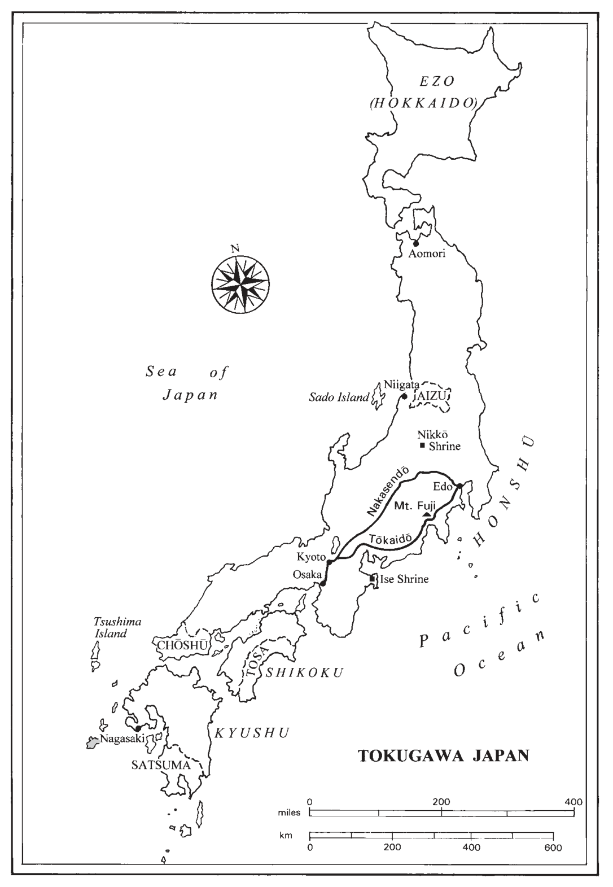
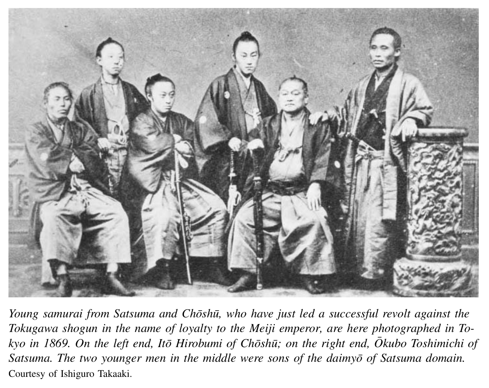

*第一编 德川幕府的危机*

# 第四章 德川幕府的覆灭

在1800年前后的数十年间，来自欧洲和美国的捕鲸船、商船和炮舰以令人不安的频率出现在日本海域，并以日益强硬的姿态提出各种要求。它们是资本主义革命和民族主义革命的有力象征和使者——这些革命正在改变欧美社会，并向外扩展以改变整个世界。在日本，它们将一场长期的低烈度危机转变为一场尖锐的革命形势。数十年来，德川秩序的管理者们一直在勉强维持。将军和大名设法应对了农民和武士的社会不满以及自身财政危机的双重压力。在这一混合局面中，又加入了前所未有的外国力量——军事的、经济的和文化的——提出了建立新型国际关系的空前要求。德川幕府的合法性骤然受到质疑。

即便如此，在相当一段时间内，德川体制似乎可以弯曲而不至于断裂。到1860年代中期，幕府已着手改造军队、调整藩与幕府之间的权力平衡，并引进新技术。外国外交官们分散下注。英国官方保持中立，但其首席代表与叛乱的外样藩保持着非官方联系，一些英国商人还提供了直接支持。法国则支持那些试图主导日本融入西方外交和经济秩序进程的德川改革派。

英国人通过两面下注，最终证明自己是更精明的赌徒。归根结底，德川统治者在旧秩序中投入了太多。外样藩的藩主往往也很谨慎，有时还会镇压本藩的叛乱者。但在关键时刻，他们支持了社会地位更低的新行动者的倡议。这些人就是自封的英雄——“志士”，他们高举“尊王攘夷”的旗帜，将德川赶下了权力宝座，随后发动了近代史上最伟大的革命之一。

## 西方列强与不平等条约

西方重新关注日本的最初征兆来自陆路。1780年代，俄国探险家已经抵达广袤的西伯利亚森林的远东海岸。

从那里，他们测绘沿海水域，而猎人和商人则在库页岛和千岛群岛北部诸岛以及北海道一带活动。1792年在北海道，以及1804年在长崎，俄国商人请求幕府给予贸易特权，但接受了德川方面的礼貌拒绝。这些试探标志着此后数十年间断断续续但日益频繁、偶尔伴有暴力的入侵的开端。1806至1807年，俄国海军军官对日本在北海道、库页岛和择捉岛的定居点发动了破坏性攻击。

一年后，英国人加入了追逐。1808年，军舰“费顿号”驶入长崎港，威胁要攻击荷兰人（两国在拿破仑战争中是敌对方）。1818年，一艘英国船驶入江户附近的浦贺湾。幕府迅速拒绝了他们开始贸易关系的请求。为应对此类来访，幕府于1825年发布命令，对“锁国”政策作出了迄今最为极端的解释：以武力驱逐日本海域内的任何外国船只。因此，当美国商船“莫里森号”于1837年提出类似的贸易请求时，遭到了更为严厉的回应：一阵无伤大雅的炮火。数年后的1844年，荷兰人从其在长崎的老据点发出了一次外交试探。他们向幕府递交了荷兰国王威廉二世的一封礼貌恳请书。他们解释说世界已经改变：日本人不能再安全地置身于西方列强正在全球范围内扩展的商业网络和外交秩序之外了。

荷兰人的论点得到了近期中国鸦片战争这一令人震惊的证据的支持。1839年，中国人试图禁止在社会上造成灾难性后果的鸦片贸易。英国人以武力捍卫“自由贸易”。到1842年，他们的炮舰已将自己的意志强加于中国人。在一项预示了日本未来命运的条约中，英国人强行开放了新的通商口岸，迫使中国人接受由英国人设定的关税水平。他们赢得了治外法权——即在涉及英国臣民的案件中，由英国官员在中国领土上依据英国法律进行审判的权利。

那些知悉这一结果的日本人深感不安。幕府首席官员水野忠邦指出：“此事发生在外国，但我相信其中也包含着对我们的警示。”〔1〕 德川官员礼貌地拒绝了荷兰人关于迅速签订贸易条约——当然首先与荷兰签订——以避免未来战争的建议。但他们确实做出了一些改变。1842年，幕府放宽了1825年先开火后提问的政策。漂流到日本海域的西方人将获得燃料和给养，然后被和平地送走。此外，幕府听取了水户学派等原民族主义改革者的部分建议。首席老中阿部正弘在1845年就任后，在德川核心地带逐步加强了海防建设。他还允许其他藩采取同样的措施。

外国压力与幕府的应对以最终削弱幕府的方式相互交织。与此同时，它们在日益壮大的政治行动者群体中强化了一种新兴的民族意识。鸦片战争证实了所有视西方蛮夷为贪得无厌、意图征服和牟利的掠夺者之人最深切的恐惧。这赋予了锁国的基本立场比以往任何时候都更强有力的理据。然而，任何有效的实际应对都必须在各藩和幕府加强防御的同时避免战争。这至少需要在短期内从强硬的锁国立场后退，并引进一些使这种威胁成为可能的西方技术。幕府陷入了进退维谷的困境。在试图积蓄力量的过程中，它几乎无法避免示弱的表象。

将当时许多日本人的排外论调简单地斥为徒劳和非理性，是很有诱惑力的。至少在亚洲，西方列强并不认为领土征服是唯一可行的选择。他们要贸易甚于要领土。但偏执的观点有时也有坚实的根据。西方的自由贸易意识形态被一种道德确信和扩张性的影响力所支撑，这种力量不接受拒绝。它们当然也不排除殖民化。德川末期的日本人认为与西方蛮夷的任何进一步接触都无益可言，他们感到受威胁是正确的。他们的生活方式——从物质层面到政治层面——即将发生不可逆转的改变。

1853年，美国海军准将马修·佩里作为迄今为止最坚定的这一简单信息的传递者抵达日本：和平同意贸易，否则承受战争的后果。他的使命标志着美国向西扩张的新一步。随着大西洋水域的资源几近枯竭，美国捕鲸船已冒险远渡太平洋。1848年从墨西哥手中夺取加利福尼亚后，美国人在太平洋地区产生了新的商业和军事雄心。他们还想与英国人竞争。最直接的是，佩里希望日本人向海军舰船出售煤炭，并允许捕鲸船停靠补给。

他于1853年7月出现在江户湾，以及翌年的再次到来，引发了许多困惑而兴奋的互动。在1854年的回访期间，日本人试图以一场相扑表演来震慑入侵者。美国人并不以为然。一位美国人在日记中描述了一场“推搡、叫喊、拉扯、嚎叫、扭打、腾跃的活动，似乎毫无目的”。他总结道：“这是一次非常令人不满意的力量较量，有一两次摔倒，但总的来说，我以前见过的任何一个只有他们一半肌肉的摔跤手都会嘲笑他们。”〔2〕 另一方面，美国人带来了一些最新技术，包括一台四分之一比例的蒸汽机车和一段370英尺长的环形轨道。“蒸汽已升起，一名工程师坐上了煤水车，一位[幕府]奉行坐在车厢上，机车开动了，以每小时18英里的速度绕圈行驶。”〔3〕 据报道，这位衣袍在风中飘扬的日本官员对这次乘坐感到非常高兴。

尽管有这些插曲，佩里是一个强硬而不苟言笑的人。他在1853年7月留下了一封措辞严厉的信函，并承诺会回来等待答复：“签署人作为其友好意图的证明，此次仅带来了四艘较小的[军舰]，打算在必要时于来年春天率一支大得多的舰队返回江户。”〔4〕 这一事件在江户及其周边地区引发了恐慌。它还促使幕府采取了一个极不寻常、实属史无前例的步骤。幕府希望为其做出某些让步以避免战争的选择争取共识，竟然要求大名就如何最好地应对美国人提交书面意见。

佩里信守承诺，于1854年初率一支由九艘舰船组成的庞大舰队返回日本，其中包括三艘蒸汽护卫舰。幕府同意允许美国船只在相对偏远的下田和箱馆两港停靠。美国人还赢得了在下田驻扎领事的权利。这份《神奈川条约》的条款也被扩展适用于欧洲列强——法国、英国、荷兰和俄国。幕府的这一让步尚未立即开放贸易，但西方列强迅速乘胜追击。第一任美国领事汤森·哈里斯于1856年在伊豆半岛南端的下田就任。哈里斯以英国人会提出更苛刻条件这一合理威胁来支持其签订贸易条约的要求。他指出，这第一份全面贸易条约必将成为其他列强的范本。

到1858年2月，幕府谈判代表签署了一份几乎完全复制鸦片战争后中国协议的条约，而且未发一枪。他们清楚地知道，国内反对者会利用这一步骤来攻击幕府。但他们相信别无更好的选择。战争将是徒劳的。其他谈判者的要求也不会更低。

该条约开放了八个通商口岸。最值得注意的是，日本人交出了关税自主权和条约口岸的司法管辖权。进出日本货物的关税在条约中规定，日本政府无权更改。在日本被指控犯罪的外国人将在由外国法官依据外国法律主持的领事法庭上受审，这种做法被称为治外法权。很快，幕府与其他西方列强也签订了类似的协议。

这些“不平等条约”在理论上和实践中都是屈辱的。确实值得一提的是，美国人接受了日本人关于禁止鸦片贸易的坚持，英国人也未表示反对。如果鸦片自由进入日本，它可能会以重大方式改变此后日本历史的进程。尽管如此，这些条约将半殖民地地位强加于日本。在政治和经济上，日本在法律上从属于外国政府。在此后数十年间，琐碎的侮辱接踵而至。许多恶劣的犯罪行为即使受到惩罚也极为轻微。在1870和1880年代，这些不公正——一桩未受惩罚的强奸或一次被宽恕的殴打——成为新兴全国性报刊的头版新闻。每一次都被体验为对自尊的又一次打击，对日本主权的又一次侵犯。

然而，如果简单地得出结论说这些条约践踏了一种先已存在的民族自豪感和主权，那将是误导性的。确切地说，从1800年代初到1860年代，与蛮横的外国人打交道的过程本身创造了近代日本民族主义。在幕府官员中间、在大名的城堡里、在关心政治的武士讨论历史和政策的私塾中，一种新的观念逐渐形成——“日本”是一个统一的国家，应当作为一个整体来保卫和治理。随着这一观念的确立，德川作为日本合法保卫者的主张开始枯萎。

## 德川统治的瓦解

新条约口岸贸易的直接经济影响是巨大的。外国商人发现，在日本可以用白银以大约全球通行价格三分之一的价格购买黄金。他们欣喜若狂。在贸易开放的第一年，他们购买了大量黄金，在中国以三倍于购入价的价格出售。1860年，幕府通过降低金币成色使其与世界标准接轨，止住了这一金融大出血。但这扩大了货币供应量，引发了剧烈的通货膨胀。此外，外国需求导致丝绸价格到1860年代初对国内外买家都上涨了两倍。与此同时，税率低廉的外国商品——尤其是成品棉布——进口增加。这有利于消费者，却使许多日本生产者破产。

消费者和生产者都以暴力抗议作为回应。城市居民对不断上涨的粮价怒不可遏。在1866年通货膨胀达到顶峰时，他们在江户和大阪的大规模粮食暴动中捣毁了数百家米商店铺。类似的抗议也波及两城周边地区的较小城镇和村庄。1866年还出现了丝绸生产者骚乱的激增。在江户以西的武州地区，约六千名农民和丝绸生产者发动了为期一周的暴力抗议运动。他们从一个村庄行进到另一个村庄，沿途扩充队伍。他们捣毁了债权人——即村长、地主和放贷者等农村上层阶级——的住宅。〔5〕 幕府军队最终将他们镇压。

暴动者通常将同为日本人的剥削者作为攻击目标。他们尤其指责城市米商和农村放贷者。但1860年代的许多人——包括本可从产品需求和价格上涨中获利的丝绸生产者——将普通民众的困境归咎于外国商人，并由此暗示归咎于最初同意贸易的日本政府。平田笃胤国学门人中的乡村弟子所写的诗歌热切地传达了这种情感。请看松尾多势子的这些文字——她是日本中部山区伊那谷的一位养蚕妇女：

> 令人厌恶啊
> 当今之世
> 围绕蚕丝的骚动
> 自从异国的船只
> 来到神国天皇之土
> 觊觎那珍贵的
> 蚕茧以来
> 人心
> 虽令人敬畏
> 却被撕裂
> 被愤怒所吞噬。〔6〕

暴动和这类诗歌中所反映的民众愤怒并未直接导致德川幕府的覆灭。但它无疑鼓舞了那些指责幕府使人民贫困、有辱天皇的反德川活动家。

条约口岸的被迫开放还产生了更为直接的政治影响。在试图阻挡外国人的过程中，幕府与大名及全国日益壮大的政治活动家群体打交道的方式削弱了幕府的合法性，加速了其灭亡。

1853年，幕府首席老中阿部正弘曾要求大名就如何回应佩里的首次来访提出意见。他希望通过协商为一个艰难的决定建立共识。这是一次与更著名的对西方“开国”相平行的国内政治“开放”。它产生了暴露幕府软弱的意外后果。它激发了一些关键藩的领导者对权力的渴望——这些藩有着长期受挫的政治抱负传统。其中包括萨摩、长州和土佐等外样藩，它们在1600年德川崛起时曾站在对立面。两个多世纪后，它们的大名和武士仍在维系着反德川的情感之火。在更近的范围内，强大的水户藩——德川家族的一个分支——以及越前和会津等亲藩也成为要求改变政策和幕藩、朝廷之间权力平衡的强有力声音。水户藩由坚定的排外大名德川齐昭领导，也是会泽安等同样排外、尊皇（虽名义上拥护德川）学者的故乡。

德川软弱的下一个戏剧性标志出现在1857至1858年，是一场涉及将军继嗣争议和与美国签约的纠缠不清的闹剧。将军本人家定是一个体弱多病、没有子嗣的年轻人。他的首席老中是幕府内部最重要的人物。面对大名对其处理佩里要求方式的批评，阿部正弘于1855年辞去了这一职务。他的继任者堀田正睦面临两个紧迫的挑战。随着家定病入膏肓，他必须主持选定新将军。而汤森·哈里斯在下田焦躁不安，他必须在不疏远躁动的大名的情况下与美国人及其他列强缔结条约。他和垄断将军评定众的谱代大名内部圈子所选定的将军人选，是一个软弱、易于控制的人物——来自亲藩纪伊的一位十二岁大名。与之对立的，同时也反对签约的，是水户、萨摩和其他几个藩的强大改革派和排外大名。他们推举德川齐昭（水户藩主）之子——一位据说才华出众的年轻英才，名叫庆喜。

在这一关头，堀田决定通过寻求天皇对哈里斯条约的批准来加强自己在外交政策和继嗣争议中的地位。他携带大量礼物，打破长期惯例，以隆重的排场访问京都以获取天皇的祝福。作为回应，孝明天皇采取了同样史无前例的步骤介入外交和内政决策：他拒绝支持幕府。他自身的排外倾向得到了朝廷官员和改革派大名——尤其是德川齐昭——的支持。天皇告诉堀田，他不赞成该条约。他表示支持齐昭之子为下任将军。

在两个问题上都遭受了巨大屈辱的堀田别无选择，只能辞职。德川再也不能指望朝廷的支持了。幕府的威望遭受了沉重打击。由此，一场复杂的三方政治博弈开始了。它将持续十年。幕府的顽固派——尤其是来自较小谱代藩的老中——希望通过按自己的条件推行外交政策以及军事和财政改革来巩固传统的德川权威。在精英层面上，他们遭到了外样藩和亲藩的强大大名以及朝廷官员的反对。这些有力的权力竞争者使用排外、尊皇的辞令，试图将政治权力的中心向自己的方向转移。这场博弈的第三方地位较低。他们就是所谓的尊皇志士，或“有志之士”（志士）。他们以针对国内政敌或外国敌人的政治恐怖行动推动事态发展。

这些志士最常见的是来自武士阶层中下级的愤怒青年。他们中还有一些政治上积极参与的农村和城市精英成员，包括少数活跃的女性。这些人是日本思想和政治行动革命史上的关键人物。武士志士是极度自尊的人，他们凭借出身和训练将自己理解为藩主的仆从，并且超越于此，是以天皇为象征的更大而模糊界定的日本国的仆从。在德川官僚体制的传统中，他们兼修文武。他们研习儒家经典，同时训练剑术和击剑。反映这种双重修养，他们感到一种双重责任——思考与行动：为当下的问题提出解决方案，并无私地在实践中加以实现。

这种情感和行为的一个先兆是大盐平八郎。1830年代，他是大阪市政府中的一名低级武士。大盐受到一种强调正义个人行动重要性的儒学流派的熏陶。对高级官员无视他在天保饥荒（1838年）期间救助贫困平民的呼吁感到愤怒，大盐领导了一场大阪居民的激烈起义。他的队伍烧毁了整整四分之一的城市，才被幕府军队镇压。

在1850年代，类似的愤怒而行动导向的异见者群体在日本各藩凝聚起来。他们在若干藩中尤其具有影响力——在这些藩中，他们得到了大名和高级官员的同情倾听，尤其是萨摩、长州、土佐和肥前。最著名的志士群体是吉田松阴的学生——他是长州一位富有魅力的学者武士。吉田本人于1859年在幕府镇压异见的行动中被处决。他的追随者后来在推翻德川和巩固新的明治政权中发挥了领导作用。城下町和京都的旅馆与寺庙曾是这些活动家的秘密聚会场所，它们勾勒出一条通往革命的路径，类似于波士顿或费城等美国城市中的“自由之路”，为后世提供了历史的感知。

志士们从理想主义和务实改革主义的折衷混合中汲取思想灵感。他们支持直接的暴力行动。他们相信现行体制否认了像他们这样的“有才之士”应得的尊重和权力。他们尊崇天皇，痛恨强行闯入日本的外国人。他们将仇恨付诸行动，不仅暗杀国内政敌，也暗杀外国人。他们的受害者中包括汤森·哈里斯的荷兰翻译和一位知名的英国商人。但——这是至关重要的一点——尽管他们带着用锋利的刀剑对抗外国炮舰、立即驱逐蛮夷的粗糙而无望的想法踏上了政治道路，许多志士很快就以实际经验磨砺了他们的极端主义。

尤其是那些活得足够长以讲述这段经历的人，逐渐认识到向西方学习甚至与之共存的必要性。一个典型的案例是土佐志士坂本龙马。在一个至今仍是历史剧最爱的场景中，坂本于1862年某日冲入一位幕府官员的住所。他拔剑在手，意图杀死这个正在按西方模式改造德川海军的人。他的目标——胜海舟——说服了这位未遂的刺客先听他说完。在一个下午的时间里，胜海舟既保住了自己的性命，又说服了坂本：现代化改革是不可避免的。随着时间的推移，像坂本这样的人对西方思想、制度和技术发展出了深刻的理解，这些理解将在日本深深扎根。

## 恐怖与妥协的政治

德川幕府因此面临来自外国列强、躁动的大名和冲动的武士的三重威胁。它以前后不一的政策应对这一新局面。其领导者在妥协与强硬路线之间摇摆不定，始终希望加强幕府并尽可能少地分享权力。堀田的继任者、幕府最高官员井伊直弼否定了寻求共识的政治。他试图恢复传统的德川独裁。他在未获天皇批准的情况下于1858年7月签署了哈里斯条约。他任命了那个软弱的少年候选人为将军。他告诫朝廷和外样大名不要干涉幕府事务，包括外交政策和将军继嗣。井伊于1858年实施了戏剧性的安政大狱（以年号命名）。他迫使数位改革派大名辞职，将德川齐昭软禁，并处决或监禁了六十九名反幕府武士活动家。

这次镇压为时已晚、力度不足，无法将反幕府的精灵重新塞回瓶中。1860年3月，一群水户志士在江户城门外暗杀了井伊。他们视他为杀害同志、背叛天皇的可恨暴君。井伊忧心忡忡的继任者们在幕府评定众中回归了妥协路线。他们的目标是通过战略性让步赢回朝廷和强大大名的支持，同时镇压极端主义武士。天皇的首都京都成为所有竞争者的实际和象征性战场。

新德川领导层寻求共识的政策被称为“公武合体”。这一口号对不同的人意味着不同的东西。对幕府而言，其含义是做出和解姿态，例如安排天皇的妹妹与新即位的年轻将军联姻。萨摩、长州和土佐等强大的外样大名以及水户和会津等亲藩则有其他想法。对他们来说，公武合体意味着将决策权大幅转移到以京都为中心的诸侯会议。这样的体制将把将军降为同侪中的首席，作为忠诚的天皇臣仆。

幕府认定别无选择，只能接受这些强烈的改革呼声中的一部分。1862年，它同意废除历史悠久的参勤交代制度，作为允许各藩节省开支的经济措施。这当然也松动了幕府对大名政治活动日益岌岌可危的控制。幕府同意各大名可以将这些资金用于通过扩建藩军和海军来加强“国防”——这又是一个可能壮大大名反对势力的步骤。幕府还同意任命三位强大的大名为将军的特别顾问。

幕府希望这些步骤能在武士激进分子与其藩主之间打入楔子，从而得以镇压前者。这并未立即奏效。相反，来自日本各地的志士武士于1862和1863年汇聚京都。这座城市成为朝廷官员和来自众多藩的排外志士的骚动温床——这些人愿意以自己的生命为代价驱逐外国蛮夷、尊崇日本天皇。这些忠诚青年据称纯洁的动机，以及他们阴谋和行动的纯粹戏剧性，为后世留下了强有力的政治灵感遗产。他们也迫使幕府采取进一步有争议的步骤以重新掌控局面。

1863年，志士们说服孝明天皇正式要求将军立即驱逐西方蛮夷。幕府的回应是派将军前往京都（这是自1634年家光盛大巡幸以来的首次此类出行）商讨此事。这次出行代表着地缘政治权力的戏剧性转移。幕府期望其在公武合体政治中的新大名“盟友”能帮助说服天皇撤回攘夷要求。强大的大名——最著名的是萨摩藩主——明白立即攘夷是不可能的。但他们保持沉默。事实上，萨摩藩主在谈判的关键时刻悄然离开了京都。在攘夷派控制朝廷的情况下，将军别无选择，只能在接受了一个确切日期——1863年6月25日——作为驱逐蛮夷的确切时刻后返回江户。

幕府官员清楚地知道他们的军队无法执行这一命令。最后期限在江户悄然过去。但在本州最南端的长州，藩军中的志士士兵向一艘美国船发动了炮击。美国和法国军舰立即进行了报复。他们在下关登陆，摧毁了数座岸防炮台，尽管长州的攻击又持续了数周。在条约列强考虑进一步报复之际，幕府和萨摩军队终于联手将长州志士和反幕府的朝廷顾问逐出了京都。

幕府着手巩固控制。它组织了一支由会津藩主指挥的民兵，以严密监控京都的活动。它承诺在不久的将来通过关闭横滨港来适时履行“立即”攘夷的命令。失去了最激进分子的朝廷接受了这一承诺。但眼前的危机又持续了一年。1864年，来自日本各地的志士武士退往长州，藩的领导者允许他们留下并密谋。他们从那里发动了新的进攻。他们向京都进军，计划发动政变以俘获天皇，将其从德川的控制下“解放”出来。他们遭到了效忠幕府的萨摩和会津联军的迎击和击溃。

幕府乘胜追击，对长州发动了征讨。作为允许长州藩存续的代价，幕府要求藩主处决进攻京都的领导者，藩主同意了。确信长州现已由较为温和的武士派系控制后，幕府军队班师回朝。主张公武合体温和政治的人似乎重新掌握了主动权。

## 幕府的复兴、萨长叛乱与国内动荡

事后看来，幕府胜利的表象具有欺骗性，这一点很容易看出。但在当时，这并不明显。长州已经蒙羞。精力充沛的新领导者执掌幕府。显而易见的是，前几年的动荡已经启动了一系列事件，无论谁掌权，都将在一定程度上改变日本。深远的社会和政治改革在幕府内部和一些关键藩——尤其是长州——都得到了推行。这些改革的核心是更广泛地向各种背景的有才之士开放军事和文官行政，并精简更大的政治结构。

在幕府内部，财务奉行小栗忠顺从1865年开始领导了一场按西方模式重组军队的运动。小栗甚至考虑过完全废除各藩，建立一个中央集权的国家政府。他从法国驻江户公使莱昂·罗什那里获得了重要的建议和财政支持。但他也遭到了保守派幕府官员和急于保护世袭特权的德川家臣的反对。他的行政和军事改革计划不如某些藩所推行的那样深入。1866年夏天，他获得了一些有力的支持——新将军德川庆喜就任。这正是改革派大名在1857至1858年的政治斗争中推举为将军人选的那个人。如今有了执政的机会，庆喜决心与小栗和罗什合作，将幕府改造为西方式的国家政府。幕府内部的保守势力继续抵制变革。但这些人试图引入的改革与数年后新明治政权所实施的改革颇为相似。即使幕府“存活”下来，它也将通过把自己转变为一个与取代它的政治体制并无太大不同的体制来实现。

这并未发生，原因有二且相互关联。尝到了权力的滋味后，外样藩的领导者——尤其是萨摩和长州——不愿回到德川统治下的从属地位。更重要的是，他们领地内的武士——有时甚至违抗藩主——推行了戏剧性的改革。他们积聚了足以挑战和击败德川军队的军事力量。

长州志士在1864年战败失势，但幕府并未将他们彻底铲除。残余力量继续使用西方武器和军事技术组织民兵。在一项突破性的社会创新中，这些民兵的组织者——尤其是高杉晋作——允许（有时是强迫）农民加入。在农民被严格禁止携带武器和接受军事训练长达250年之后，他们获得了参战的机会。无论他们将此视为个人荣耀的机会还是更宏大事业中的角色，这些农民士兵和他们的武士伙伴建立了士气高昂且技艺精湛的部队。1865年，高杉的军队在长州打赢了一场内战。他们重新夺回了藩政府的控制权。与萨摩一样，长州的藩库因数十年前启动的有效财政改革而资金充裕。这使该藩得以从英国商人那里购买武器和船只，建立起一支强大的力量。

萨摩虽未经历如此戏剧性的内战，也一直在实现军事力量的现代化。藩的财政状况良好，这得益于促进和征税贸易以及经济作物——尤其是蔗糖——生产的重商主义政策。此外，萨摩与长州共有的特点还包括：极高的武士与平民比例、与德川的敌对传统，以及因地处偏远而能逃脱幕府严密监视的能力。这使两藩看起来是天然的盟友。事实上，需要外人的大量斡旋才能将它们联合起来。

这里的关键人物是坂本龙马——那位在与幕府官员胜海舟的邂逅后从排外刺客转变为开国改革者的土佐武士。坂本于1866年促成了萨摩与长州之间的秘密同盟。两藩承诺在幕府攻击任何一方时相互支持。这很快就应验了，因为德川无法容忍志士在长州重新掌权。1866年夏，幕府军队发动了第二次西南征讨以惩罚长州。它要求其他藩提供支援，但萨摩——受秘密同盟的约束——以及其他几个藩拒绝出兵。这次征讨以士气低落的幕府军队的惨败告终。

这支庞大军队横跨本州全岛的败退是公开的耻辱，使德川政权的覆灭不可避免，并在民间激起了对变革——甚至末世救赎——的广泛期待。一些农民以起义来回应即将到来的崩溃，抗税或攻击村庄精英的权威。此类事件在幕府统治的最后两年中广泛发生。尤其是在1866年，至少发生了35次城市暴动和106次农民起义。它们集中在幕府征讨长州失败后的数月间。

更为不寻常和引人入胜的是1867年末席卷从大阪到江户的中部地区的狂欢歌舞。在大阪、京都、名古屋和许多其他城镇，小小的护身符不知怎地开始从天而降。当局在少数情况下抓到有人从屋顶抛撒这些东西，实际上是在“播种”。无论这些护身符是否真的具有神奇来源，它们都产生了强大的效果。在它们降落的地方，人们涌上街头，连续数日醉酒歌舞、纵情狂欢。他们无视停止的命令。他们的歌曲——被当时的观察者记录下来——显示出对正在进行的政治角逐及其可能以德川失败告终的结果的敏锐意识。一位英国作家描述了1867年大阪的场景：

> 身着节日盛装的人群，边跳边唱“ええじゃないか、ええじゃないか（这不是很好吗）”，房屋装饰着各色米糕、橙子、小袋子、稻草和鲜花。穿着的衣服主要是红色绉纱，少数蓝色和紫色。许多舞者头顶红灯笼。这些庆祝活动的借口是据称最近发生的一场印有伊势两位神明名字的纸片雨。〔7〕

在这些非凡的骚动为背景下，幕府和主要藩的关键人物就德川统治时代将以何种确切方式终结展开了角力。争论的焦点是谁将拥有发言权。幕府将被一种包容性的、在某种粗略意义上“代议制”的政府形式——也许是大名会议——所取代？还是一小群叛乱者能够垄断新政权的权力？这个问题并未迅速得到解决。它将在此后数十年间始终处于日本政治生活的核心。

再一次，是土佐藩主——在坂本龙马和后藤象二郎的建议下——作为中间人发挥了关键作用。土佐的目标是以大致英国式的模式取代幕府统治：由诸侯会议和代表下级武士（也许还有平民）的第二会议实行两院制统治。到1867年11月，将军德川庆喜已被说服接受这一方案。他将辞去职务，将最高权力和主权“奉还”天皇。但德川将保留对其自身相当可观的领地的控制。庆喜期望德川家在统治诸侯会议中继续发挥重要作用。

这一妥协方案——即使已经大幅削减了德川的权力——仍未能满足萨摩和长州的叛乱力量及其在朝廷中的盟友。1867年12月，萨摩和长州军队进军京都。他们控制了皇宫。1868年1月初，叛乱者促使刚刚在其父1867年去世后即位的明治天皇宣布了一次天皇“复古”。幕府将被废除。它将被一个由天皇统领的公卿和大名组成的新政府所取代。德川将完全没有位置。庆喜进行了抵抗，但他的军队在京都城外的一场战斗中轻易被击败。他退回江户，但1868年4月，他的军事指挥官胜海舟在未经战斗的情况下将江户移交给了叛军。胜海舟确信，和平地建立新的政治秩序比为一项失败的事业战斗到底更为可取。

并非所有德川的支持者都认同这种以天皇为中心的更大国家政治秩序。日本北部数个藩的武士尤其不信任叛乱者。他们担心来自萨摩和长州的新统治者会将他们排斥在新政权之外。他们以武力抵抗，进行了顽强的战斗。最后的幕府及其盟藩抵抗据点直到1868年1月天皇正式“复古”后十八个月才被粉碎。在最激烈的进攻中——以顽抗的会津藩为目标——多达三千人阵亡。

旧政权就这样崩溃了，并非没有动荡和流血，伴随着巨大的政治戏剧。在多年的排外和反幕府活动中，各方参与者都大幅改变了他们对理想政治或社会秩序的愿景。在1860年代初，一些人曾随其藩或幕府派遣的使团前往欧洲或美国。他们大多放弃了立即“攘夷”的粗糙计划。他们对西方技术乃至政治制度的潜力发展出了相当成熟的认识。

到1868年，一些人走得更远。他们甚至放弃了战略性让步的立场——即应当师夷长技以在一二十年内制夷驱夷。他们转而决定日本可以永久地成为全球民族国家秩序的一部分。这些活动家正在创造一种民族意识，至少在他们自己的队伍中是如此。在他们之外，广大民众——绝非许多武士所认为的那样愚蠢或无知——怀着对变革、也许是救赎的热切期待。很少有人哀悼幕府的消亡。但也很少有人认同新秩序。谁将领导新政权，它将如何构建？连同从天而降的护身符一起，这些以及许多根本性的问题在1868年明治天皇的统治宣告之时，似乎几乎真的悬在空中。

## 注释

〔1〕 哈罗德·博利索，《天保危机》，载马里乌斯·詹森编，《剑桥日本史》第5卷《十九世纪》（剑桥：剑桥大学出版社，1989年），第157页。

〔2〕 爱德华·约克·麦考利，《随佩里在日本：爱德华·约克·麦考利日记》，艾伦·B·科尔编（普林斯顿，新泽西州：普林斯顿大学出版社，1942年），第98-99页。

〔3〕 麦考利，《随佩里在日本》。

〔4〕 威廉·G·比斯利编，《日本外交政策文献选编，1853-1868》（伦敦：牛津大学出版社，1955年），第102页。

〔5〕 帕特里夏·西佩尔，《近世日本的民众抗议：武州骚乱》，《哈佛亚洲研究杂志》第37卷第2期（1977年），第273-322页。

〔6〕 引自安妮·沃尔索尔，《无用女人的柔弱身躯：松尾多势子与明治维新》（芝加哥：芝加哥大学出版社，1998年），第98页。

〔7〕 引自乔治·威尔逊，《日本的爱国者与救赎者：明治维新的动机》（芝加哥：芝加哥大学出版社，1992年），第105-106页。
