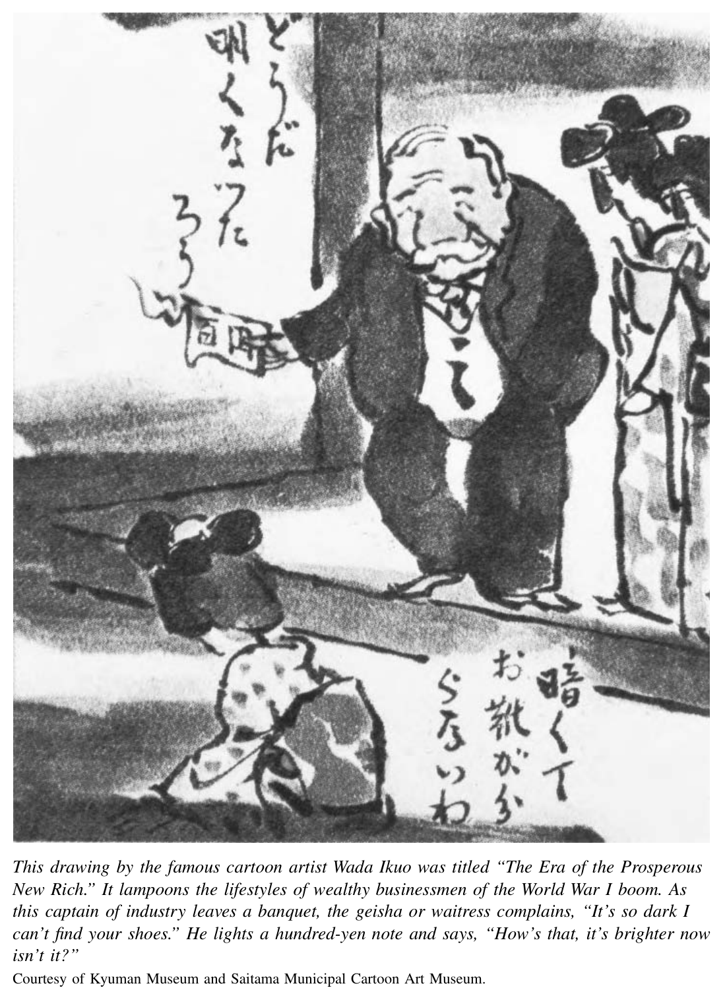
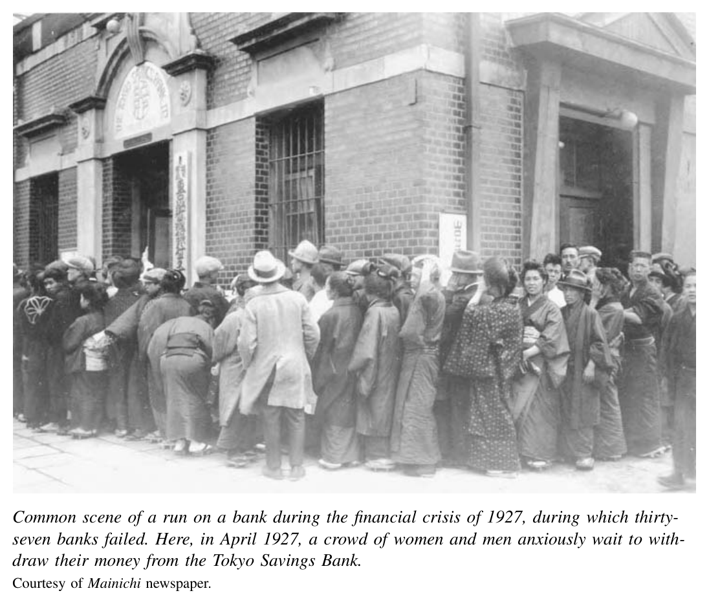
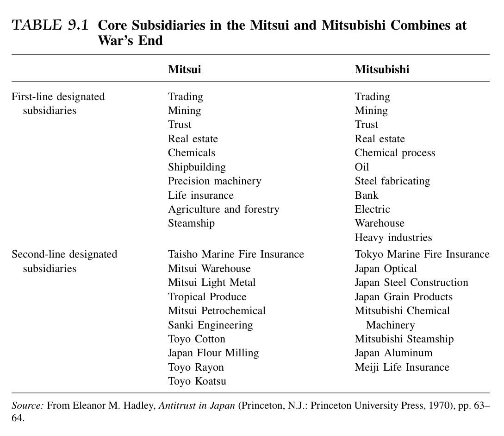
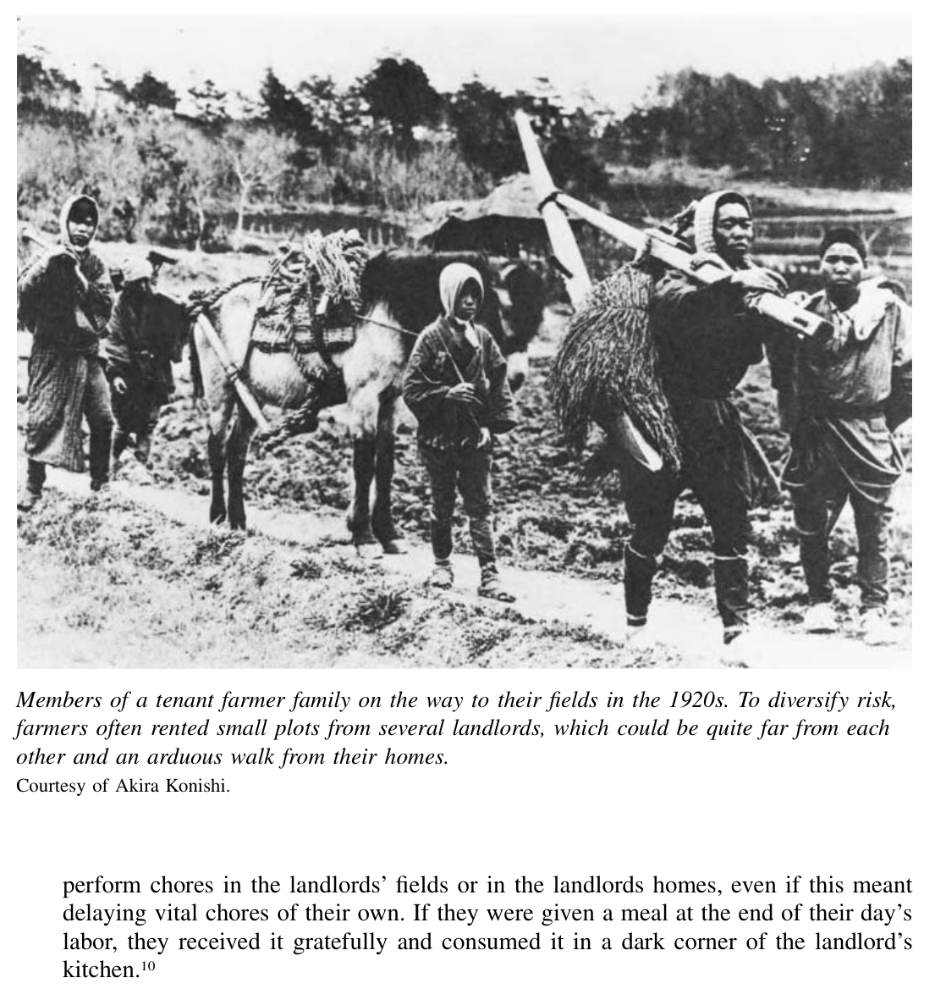
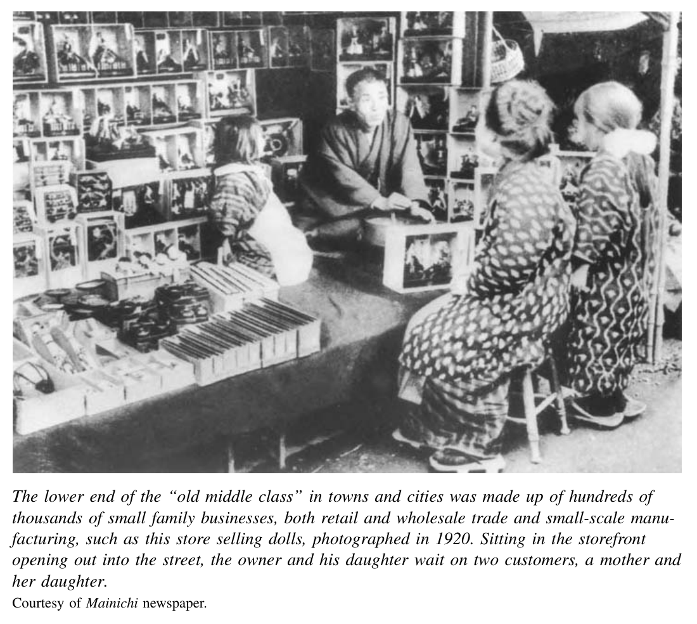
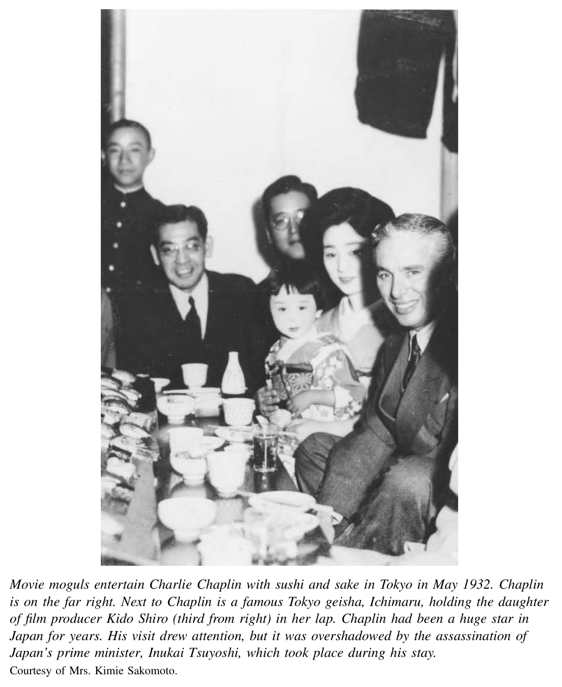
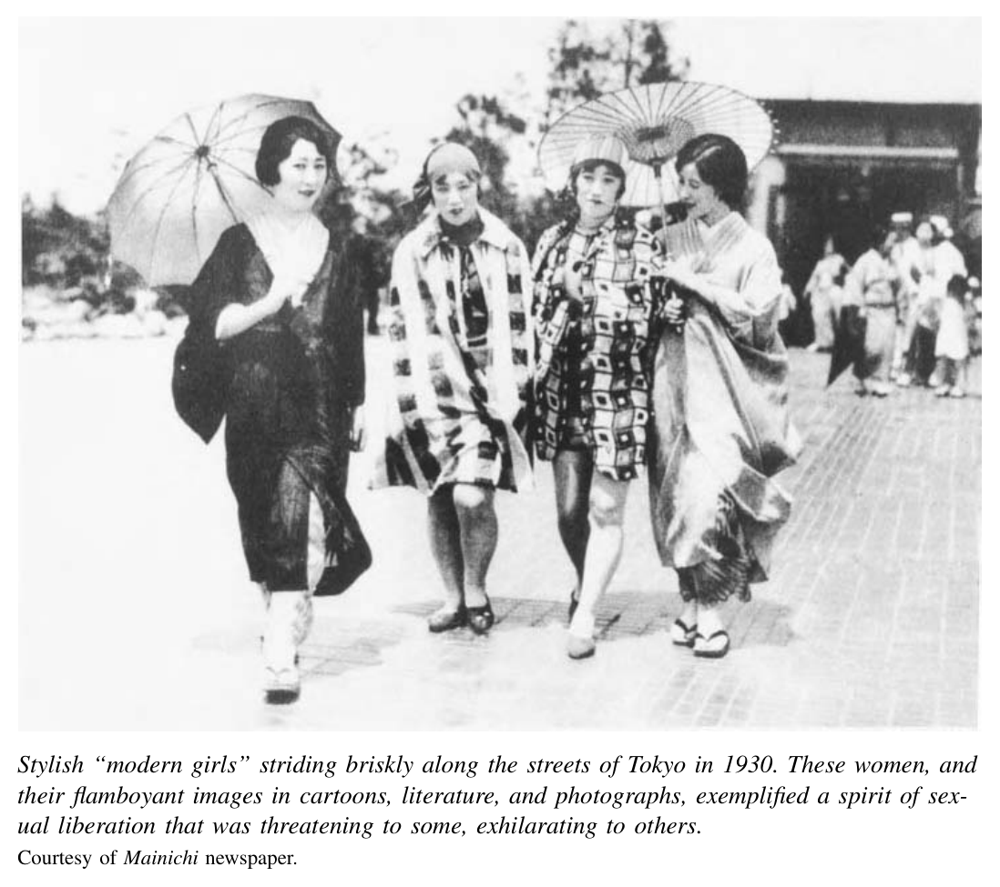

*第三编 帝国日本：从崛起到灰烬*

# 第九章 经济与社会

多样性与紧张感，构成了日本1910、1920年代经济社会史的基本底色。经济上，日本先经历了一场战时空前繁荣，随后又陷入旷日持久的战后萧条。工业部门与农业部门之间，技术先进的财阀企业与大量规模较小、生产率较低的企业之间，表现都大不相同。社会生活中，男女所处的世界迥然有别，城市居民与乡村民众也是如此。即便同在乡村，大地主、小自耕农与无地佃农的生活方式与人生处境，也处处悬殊。至于城镇与都市，则是各色各样的人群挤在一起：有出卖劳力的工薪者，有小店主，也有大公司与国家机关里的受薪“新中间阶层”；与此同时，城市景观中还点缀着少数财阀家族和高层政治领袖那一座座气派森严的深宅大院。

新近兴盛起来的出版业——包括大销量杂志、图书和报纸——热烈歌咏中产男女的现代生活。报刊既报道那些想要跟上时代、甚至想要出人头地者的焦虑，也不断提炼出一些共同主题，使人们相信自己正参与着一种“现代日本生活”的共同经验：既有对帝国成就的自豪，也有对经济转型的兴奋。而与此同时，它又提供了一个公共空间，让各种批评者得以哀叹：在一个多元而现代的社会里，社会与政治的紧张，本就是难以避免的。

## 战时繁荣与战后萧条

第一次世界大战给欧洲带来了前所未有的人间灾难；在亚洲，它却意外开启了一些机遇。大战切断了欧洲商人与亚洲客户之间的联系，日本这个新近工业化的经济体因而获得巨大推动。1914年至1918年间，日本工业产值从14亿日元跃升至68亿日元。出口增长尤为迅猛：这几年间，日本棉布的海外销售额增长了185%。〔1〕 工业就业也迅速膨胀，劳动力骤然短缺，工资随之猛涨。可惜对多数工人和消费者而言，物价涨得更快。日本经历了近代以来最严重的一轮通货膨胀。1914年至1920年，米价零售价上涨了174%，批发物价总水平则上升了将近150%。〔2〕 这轮战时繁荣在社会上的象征人物，是所谓的 narikin——也就是“暴发户”。在日本和其他地方一样，漫画里常把他们画成肥头大耳的商人，拿钞票当灯火点亮房间。为这些新贵效劳的白领职员也跟着发了财，有时拿到的奖金竟相当于平时工资的四倍。

战争结束后，这些人及其家庭的好日子又短暂维持了一阵子，但繁荣在1920年4月戛然而止。股票市场暴跌，日本主要出口商品生丝的行情也随之崩盘。许多银行倒闭，若干关键产业的产值一年内跌去多达40%，大企业一次又一次裁减成千上万的工人。

在此后的整个20年代，日本经济始终在一场又一场危机之间踉跄前行。一个根本问题是：战时日本商品成本猛增，而战后在国际市场上依旧居高不下。等欧洲竞争者重返亚洲市场，日本出口商品立刻处于明显劣势。本来，一条可行的路是让日元对其他主要货币贬值，从而压低日本出口品的价格。但这与当时流行的“正统”经济观念相违背。那套观念主张，国家应追求稳定而坚挺的货币，并牢牢与金本位挂钩。照此逻辑，要恢复日本经济的竞争力，就得靠压低国内物价。于是，政府一再宣称，紧缩与节制才是恢复经济健康所必需的苦药，尽管它在实际政策上有时又与这套说辞自相矛盾。〔3〕

到1922、1923年，制造业产出曾略微露出一些复苏迹象。然而，就在1923年9月1日，关东大地震袭击东京及其周边，后果惨绝人寰。地震发生在正午时分，城中成千上万户人家正生着炭火或煤气灶做午饭。木造房屋倒塌，火盆（hibachi）倾覆，在一片排屋密布、巷道狭窄的街区里，大火四处蹿起。接下来的两天里，特别巨大的火旋风席卷了东京东部各区。东京那种住宅、商业与工业犬牙交错的独特街区格局，被摧毁殆尽。死亡和失踪人数的估计，在十万到二十万之间；57万户房屋毁于地震或火灾，约占全市住宅总数的四分之三。〔4〕

一时间，这座日本最大城市的经济活动几乎陷于停顿。

灾后数年中，日本又出现了一些试探性的复苏征兆。震后重建热暂时刺激了东京地区的就业与商业。政府又鼓励银行放宽贷款，以进一步提供刺激——这同样背离了“紧缩”的正统逻辑。机械制造、造船等关键产业的工业产出确实稳步增长。但高价问题这个根本症结并未消失，许多企业的地基依旧松动。例如国内纺织厂，就正被中国成本更低的竞争者挤压，其中还包括那些在海外投资设厂的日本资本自己。

1927年，日本金融体系的若干长期弱点终于汇聚成一场严重的银行危机。日本银行数量众多，却普遍规模很小，抵御风险的能力很差。许多银行的业务分散程度不足，账面看起来尚可，实际状况却远比资产负债表显示的糟糕，因为它们迟迟没有把战后最初那轮萧条中形成的坏账注销掉。再加上震后恢复时期所发放的许多新贷款本身就很不稳妥，问题更加严重。各家银行的贷款对象往往集中在本地少数几个大借款人和少数几种产业上。政府又没有为存款人提供任何有保障的保护。

就像把火柴扔进一堆干柴，帝国内外发生的几件事在1927年春天点燃了恐慌。先是谣言四起，说1923、1924年为震后重建而发出的可疑贷款已使许多银行濒临倒闭；紧接着又传来消息：日本殖民地机构台湾银行也要撑不住了。台湾银行是带有半官方性质的银行，本为推动台湾开发而设立，却激进扩张业务，向在台经营的一家日本大企业的投机性项目提供贷款。1927年初，这家借款企业——铃木商店——传出资不抵债的消息后，台湾银行的出资者纷纷抽回短期资金，迫使银行停业。帝国扩张与本土经济社会之间的紧密关联，在这里体现得极其鲜明：这些事引发了本土储户对国内银行的恐慌性挤兑，继而出现了1927年4月至5月间长达三周的“银行休业令”，几十家中小银行相继倒闭。

在随后数年中，由于破产和兼并，日本银行数量几乎减半。虽说制造业产出一直增长到20年代末，但整个20年代的经济增长率，只有此前三十年的一半。甚至在1929—1930年世界性经济大萧条冲击日本之前，这个国家的经济其实已经踉跄了将近十年。无论大众舆论还是知识界，普遍都把责任归咎于政治领导人，认为他们牺牲大多数人的利益，只顾中饱私囊。

在各种批评中，财阀（zaibatsu）尤为成为众矢之的。几大财阀多形成于19世纪后半期，且往往可以追溯到德川时代。不过，“财阀”这个说法本身，直到第一次世界大战前后才开始广泛流行。认为财阀不当地支配了经济、乃至政治的那种普遍印象，也正是从那时开始定型的。

三菱、三井、住友、安田几大集团，以及少数稍次一级的综合性企业联合体，的确构成了压倒性的存在。到20年代，这些主要财阀已经发展成熟，每一家都成为横跨金融、运输、贸易、采矿和制造业的庞大商业帝国，旗下拥有数十家企业。其顶端由控股公司统摄全局。直到第二次世界大战爆发前，这些控股公司都为特定家族所独占：三井、安田、住友各由本家掌控，而三菱则由岩崎家控制。借由这些控股公司，他们得以统辖整个财阀的总体运作。

财阀在某些方面是封闭而排他的。比如三井系制造企业约定，出口只能通过三井物产来经销；集团内部企业之间交易，还会给予更低价格。当然，这种排他性也有两个重要例外。其一是财阀银行会向集团外放贷，以分散风险并扩展势力；其二是管理层并非全由家族成员出任，而会从东京帝国大学招募优秀毕业生担任经理人。但即便如此，在这些任用中，除了经营才能和干劲，对主家家族的忠诚也被高度看重。若有经理新星与财阀家女儿结亲，这种忠诚关系就更被进一步巩固了。

在20年代持续不断的经济困局中，财阀的势力仍不断向外伸展。早在1918年，八大财阀已掌握制造、矿业和商业部门全部民间资本中的20%以上；其中最大的三井与三菱两家，就占到了这几大部门总资本的12%。1927年银行危机更为财阀银行进一步支配金融世界打开了通道，也让它们得以吞并大量较小的企业。三井与三菱帝国在巅峰时期的触角之广，实在惊人（见表9.1）。

财阀在当时极具争议。到20年代末、30年代初，右翼刺客开始把矛头对准财阀高层，他们行刺时甚至宣称：“政党背后站着的，就是财阀头子。”〔5〕 自那以后，财阀在历史学界也始终是争论不断的话题。一方面，它们在日本工业化进程中扮演了核心角色，能够以小企业无力做到的方式，将资本、劳动力、原料和技术整合调度起来。另一方面，在积聚惊人财富的同时，财阀也制造并加剧了极端不平等的财富与收入分配。财阀巨头虽然慷慨资助帝国议会中的政党政治，却也同时与军部和官僚精英保持亲密关系，处处两头下注。商界精英最看重的，归根到底是自主与稳定；他们从未对民主政治或自由主义政治给予过一贯而有原则的支持。

## 地主、佃农与乡村生活

从20世纪初直到30年代，乡村生活有一件事始终相当稳定：地主、自耕农与佃农的相对比例几乎没有变化。这与更早几十年形成鲜明对照——当时佃农数量曾大幅增加。若说有变化，那么与1870、1880年代相比，20世纪初佃农的处境其实还略有改善。比起从前，更多佃农在留出自家口粮并缴纳地租之后，还能剩下一点可供出售的余粮。征兵统计表明，从19世纪90年代中期到1905年，平均应征青年——主要是农村青年——的身高增长了多达三厘米，也就是一英寸以上。这固然是个粗略指标，但毕竟相当清楚地显示出：大多数人口的生活水准和膳食质量确有提升。

即便如此，到20年代，日本农村依然是个问题重重的地方。经历了数十年总产出上升后，日本农业整体生产率停止了增长。在较发达的中西部地区，依靠较低成本的农具改良和耕作技术改进所换来的增产空间，已经差不多用尽；而这些进步向更北地区扩散得又十分缓慢。随着增长趋于停滞，社会与政治上的紧张开始升高。乡村上层与其余乡民之间，在生活条件和生活方式上依然横亘着巨大鸿沟。因此，处于中下层的人，比过去更强烈地发出了抗议。

最富有的地主——约占全部农村家庭的2%到3%——自己根本不下地耕作。〔6〕 他们靠无数佃农家庭替其耕种的土地收租，日子过得相当优裕。其住处宽敞舒适，陈设讲究，家中仆役成群。明治维新以来，这类地主有时还曾在农业改良方面走在最前面，推动提高产量的种种做法，既有利于自己，也惠及佃农。〔7〕 在诸如把电力引入村庄之类的新事务上，他们仍然是先行者。这样的家庭中，妻子往往会领导新成立的女性团体，比如1901年创建的“爱国妇人会”，动员村里的妇女给海外作战的日军寄送“慰问包裹”。她们彼此喝茶聚会，抱怨佣人；也为子女在附近寻觅门当户对的婚配对象。丈夫们除了收租外，还会把钱投进放贷业或小规模制造业。闲暇时，他们既可能延续旧式享乐，在温泉旅馆与艺伎宴饮作乐，也可能投身较新的活动，例如参政，自己竞选地方或国家公职，或支持其他地主候选人的选举。他们过着安逸而体面的生活，怀着雄心和自信，相信自己是地方社会的栋梁，也是这个正在崛起、并在世界上日益举足轻重的国家与帝国的支柱。〔8〕

至于乡间其余的人，经济生活从勉强小康到艰难困苦，直至穷途末路，层层不一。在景气好的年头，有些佃农也能把相当可观的剩余农产拿到市场上卖，以此改善生活；可他们始终要面对地租上涨与农产品价格波动的双重风险。较幸运的农民或许拥有自己的土地，但地块很小，往往只消两三年歉收，就得为了缴地税而把田地抵押出去。此后，如果境况仍未好转，他们便会面临土地被查封、失去土地，并坠入更为依附的佃农生活。

1910年，长塚节在小说《土地》中，对这种处境有过极其有力的描绘。他写道：“贫苦农民长时间在田里劳作，竭尽所能，只为种出足够的粮食。可一到收成之后，他们又不得不交出自己生产的大部分。那些庄稼，只有还扎根在土地里时，才算是他们自己的。”〔9〕 这些佃农住在阴暗狭小的屋子里，厨房是泥地，别处铺着木板，却连榻榻米都没有；屋里四处透风，一到冬天便冷得刺骨。他们靠单调的麦粥和咸菜度日，偶尔才能吃到一点米饭和新鲜蔬菜。真遇上难关时，他们只能仰赖“上头人”的仁慈施舍，才能勉强活下去。

这种依附关系，正是20世纪初日本乡村怨恨与冲突最重要的来源。农民生活在一个等级森严的世界里。正如社会史家安·沃斯沃所说：

> “佃农在村路或田埂上，若遇到身份比自己高的人，必须退到一边让路。他们对地主得随叫随到，听凭差遣……”〔译注：原文引语在此因插图插入而中断。〕〔10〕

而在这样的时刻，表面之下往往潜伏着翻涌欲出的愤怒。以1915年出生的上村秀次为例。等到七十五岁接受童年访谈时，他对地主与父亲之间那种屈辱互动的记忆，依旧鲜明。20年代里，每到12月，他父亲都要从田里特意请一天假，去给地主送租米。上村有时会跟着去。把米交上时，父亲总是深深鞠躬，向地主道谢。上村回忆说，他小时候看着这一幕，心里想的是：“这到底是怎么回事？为什么要谢地主？该谢的明明是我们呀！”〔11〕

然而，这样一种极不平等的制度，并非单凭赤裸裸的强制就能维持。地位与权力的等级秩序，还被一整套习俗化的“恩惠姿态”所缓冲。地主按惯例会出钱操办节庆活动；一遇灾年，他们被期待减租；佃农生病，也理应由地主出医药费。正是因为地主自觉也付出了这种照拂，上村父亲的地主才会觉得：交租时顺带一句道谢，原是理所当然。村落生活中的不平等，也因一支相当可观的中间层自耕农而得到缓和。处在上层的这类家庭，会把多出的几块田再租给别的佃农；处在下层的小土地所有者，则可能还得再向大地主租上一两块地。他们分布在一道层级渐次递降的序列中，在极少数富豪地主与极少数赤贫无地佃农之间，起到了重要的缓冲与连接作用。

可即便如此，对立也并不总能被压住。到了1910、1920年代，地主对本地较低层依附者那种带有家长主义色彩的照拂责任，似乎已在减弱。越来越多地主搬到县城或大城市去住——那里不仅有更大的经济与政治机会，也有更丰富的文化生活。他们把土地管理委托给庄头或代管人，而这些人待佃农往往冷冰冰、毫无人情。即便留在村里的富农，也常把子女送到县城或大城市接受中学乃至更高层次的教育。与常住本地的乡绅相比，这些“不在地主”为贫苦村民提供的那套传统照顾更少，这便成为新的社会紧张来源。到了20年代末，左翼作家小林多喜二曾形象地写道：不在地主“简直像一种怪鱼——仿佛人鱼。上半身是地主，下半身却是资本家，而且那下半身正迅速吞没整个躯体”。〔12〕

大约从第一次世界大战前后起，佃农开始联合起来，要求地主降低地租。他们常采用一种非常有效的“分而制之”战术。为了不完全受制于某一个人，多数佃农会同时向好几位地主租地（正如多数地主也会把地分租给好几个佃农一样）。若组织得当，一群佃农完全可以在收获季只对某一位地主的田地集体停工。这样一来，那位地主面临的是颗粒无收的全部损失，而每个佃农承担的却只是一部分风险。面对这种策略，多数地主最后都会妥协，答应短期或永久减租。1923年至1931年间，每年发生的佃农—地主纠纷在1500起到2700起之间浮动。70%的纠纷，其主要诉求都是减租。参加者少则一个村里几户，多则跨好几个村、涉及数百户佃农。四分之三以上的纠纷中，佃农至少能赢得部分诉求。〔13〕

许多纠纷背后，都有一个当时新出现的农村组织——佃农组合。到20年代中期的鼎盛时期，这类组合吸纳了全国约十分之一的佃农家庭。有些地方组合进一步联合成地区性乃至全国性的组织，其中规模最大的是1922年成立的“日本农民组合”。这些组织及其成员并不享有任何法律上的承认或保护。村里的头面人物会施加强大的社会压力，并以明示或暗示的方式加以威胁，阻止人们加入。在这样的环境下，短短几年内就能把10%的佃农家庭组织起来，已是一项十分了不起的成就。

不过，到了20年代后期，地主也开始有效地反向组织起来。他们通过自己的联合组织募集资金、聘请律师、协调应对，在一定程度上成功压制了佃农的要求。与此同时，尤其是一些最富有的地主越来越觉得，经营农地太麻烦，不值得再操心。整个20年代中，尤其在临近年代末时，许多不亲自耕作的大地主开始卖地、缩减田产，转而把资金投入股市和工业，因为那里的回报看起来更高，且无需个人投入过多精力。

1910、1920年代乡村社会的动荡，其根源并不主要在于“落后”——不是单纯的赤贫，也不只是传统等级制本身。它从根本上说，是一个更现代化乡村社会的产物。20年代的佃农纠纷，在中西部那些商业化程度较高、农业生产力较强的地区，大约是东北等较不发达、较不商业化地区的两倍。领导纠纷的往往也不是最穷的佃农，而是那些从市场性经济作物生产中看到利益前景的人。纠纷还更多发生在“不在地主”较多的地方——那些住在城市、生活方式更“现代”的地主，正越来越普遍。换言之，这些纠纷显示出日本农村社会关系正在缓慢转变：由过去那种带有私人依附色彩的相互关系，转向一种更冷漠、更非人格化的经济等级秩序。

农业抗争者在某种意义上，是在要求以更好的条件进入资本主义经济；同时，这个现代世界比起过去，虽然提供了更多机会，却也带来了更大风险，并削弱了传统社会支持。面对这种局面，农民既希望继续得到上层人物的尊重与照拂，也想争取一点属于自己的控制权与安全感。在保守观察者看来，乡村社会这种新图景，正是现代时代社会解体的一个令人不安的征兆。

## 城市生活：中间阶层与工人阶级

正如乡村居民分属复杂多样的社会位置，20世纪初的城市人口也绝不只是拿工资的群众与其富有雇主这两极。庞大而多样的中间层群体，他们的住宅与店铺，为城市生活带来了一份稳定、一种社区感，也注入了极大的活力。

以1908年的东京为例，“商人和手工业者”这一类职业，占到了全部就业人口的41%。〔14〕 走在任何一个大城市街区里，眼前都会是一片杂然并陈的景象：鱼贩、米店、豆腐铺和蔬菜店、澡堂老板和书商、理发匠、木炭商、玩具店与照相馆，间杂着成千上万家小餐馆。零售街后面的小巷里，又挤满了为这些店铺供货的成千上万家批发商，还有同样数量、在自家后屋生产的小手工业者：草鞋匠、榻榻米匠、油纸伞匠，也有制造机器零件、铸件、陶瓷器物或食品的小作坊。

这些以家为厂的小生意，几乎无一例外都是家庭经营。妻子与丈夫一道劳作。〔15〕 其中经营较成功者，往往是地方社区的支柱。他们会竞选区议会或市议会的代表，也会组织行业公会，向国家争取各种保护，例如减税。第一次世界大战后，各地地方政府还征用了成千上万这类人，让他们代国家从事福利服务。到1920年前后，全国大约有一万人担任这种“方面委员”（district commissioner）的角色，入户探访贫困邻里，并发放少量救济金。〔16〕

这个庞大群体中的中下层小业主，其收入往往还不如大公司里的低级文员，甚至不如部分工厂工人。但“给自己当老板”的吸引力毕竟很大。1908年，日本一家顶尖工程企业的经理就曾抱怨说，工厂工人既傲气又躁动，“教他们什么，简直像在教猫祈祷”。可他也不得不承认，这些人一旦为自己干活时，反而极其精明能干。他的公司常常丢掉合同，输给一些“机灵的工人”——这些人把家里的地板掀开，安上一两台机器，就自立门户开起了作坊。〔17〕

这数以百万计的店主、批发商、小制造业者，以及他们报酬微薄的雇工，共同构成了历史学家所说的日本近代城市“旧中间阶层”。这个群体的某些根脉可以追溯到德川时代的平民社会，尽管其中也不乏旧武士出身者。大约从世纪之交开始，人们又开始辨认出另一个较小的新群体在他们身旁兴起——那就是由企业和政府机关中的受薪雇员及其家庭所组成的“新中间阶层”。

这一社会阶层在19世纪末已初露端倪。大约从1890年前后开始，三井、三菱之类的大企业就从大学中招募未来经理人。一些顶尖公私立学校的毕业生，也开始把私人企业视为不逊于政府官僚体系的就业去处。同时，职业中学数量在这些年里显著增加。一个分层而多轨的招募体系逐渐形成，把职业中学、高等学校和大学与企业、官厅的用人机制连接起来。于是，大城市里公私部门的白领人数稳步上升。以东京为例，这类人在全部就业人口中的比例，从1908年的6%上升到1920年的21%。〔18〕 这些受薪雇员，便是20世纪“新中间阶层”中的主要养家者。这个群体当然也能在德川时代文职化的武士官僚身上找到某些前身，但20世纪初争夺这些日益增多职位的人，早已不只是旧武士的子弟。城市里旧中间阶层的店主或小制造业者的子女，以及乡村里的中农子弟，也都在争取跻身新的城市中间阶层。〔19〕

中产阶层的办公室职员，并不只有男性，也包括女性。已知第一起著名的大企业雇用年轻女性从事文书工作的案例，出现在1894年。三井银行大阪分行的经理访美时，在费城的沃纳梅克百货公司受到启发，回国后便雇用了几名十来岁的女孩。她们刚从高等小学毕业，被安排在会计部门工作。此后十余年里，百货公司与办公室雇用年轻女性从事文书和销售工作的做法，渐渐扩展开来。〔20〕

不过，真正能大享其用、从这些华丽百货店和制服女售货员所营造的世界中获得乐趣的，毕竟只是城市居民中的少数。低薪文员是当时社会评论中既令人同情、又常遭讥讽的典型形象。1928年，有观察者把男性办公室职员的低收入范围界定为每月20至30日元。相比之下，1927年一个熟练男机工的平均日薪为2.6日元，折合月收入大约是文员的两倍。女纺织工的日薪约为1日元，跟女打字员差不多。〔21〕 因此，一战时期通胀最猛烈的时候，连小学教师，甚至大商社的职员，也会自发结成斗争团体，要求加薪。到1919年，在东京，这些团体汇合成“东京薪俸生活者联合会”。1920年3月，东京和横滨公司的女打字员又组建了日本第一个女性办公室雇员工会，要求提高工资，并要求在地位上与正式男职员看齐。〔22〕

这些女打字员，其实是在追随另一股日益强硬的潮流：不断扩大的都市周边地区里，工厂劳动者——不论男女——正越来越积极地维护自身权益。自1916年起，数百名女纺织工开始加入社会改革家铃木文治于1912年创办的“友爱会”（Yūaikai，Friendly Society）。男性工会领袖默认丈夫与父亲才是家庭中的主要养家者，于是把这些女性放在“辅助会员”的类别里。在纺织业及其他行业，女性平均工资不到男性的一半。男性的工资在整个工厂劳动生涯中往往会随年龄略有上升，而女性即便到了四十多岁，收入也不过比二十来岁时高出区区10%左右。起初，这些女性对自己的劳动条件大多隐忍不言。

这种局面到了20年代中后期才开始改变。出于几方面原因，日本女性开始以前所未有的力度加入劳动抗争。

首先，随着工业经济扩展，女性工作的场所日益多样。她们不再只在大纺织厂劳动，也进入了更多较小规模的工厂，尤其是化工和食品加工行业。小厂女工通常从家里通勤，而不是住在宿舍里；她们行动更自由，也更容易与在旁边工作的男工建立联系，因此更便于参加劳资纠纷。

其次，即便仍在纺织厂工作的女工，受过小学教育者也越来越多，能读懂组织者发放的小册子和传单。第三个因素，则是政府在1922年取消了女性不得参加和发言于政治集会的禁令。这使女性参与工会组织和示威的风险大为降低。此后数年间，女性加入工会、发起斗争的数量都创下了前所未有的新高。

促使她们行动的，当然有低工资与工作不稳定带来的不满；但更深一层的，是她们对主流文化怀有一种强烈的疏离感，于是希望在劳动生活中获得更多尊重。作家佐多稻子在短篇《从焦糖工厂》中，对这种精神状态有过细腻而传神的刻画。故事背景是20年代末东京的一个街区。女主人公 Hiroko 在酗酒父亲逼迫下，不情不愿地到一家糖果厂打工。劳动时，她从窗外望见河对岸屋顶上的肥皂广告牌，广告牌整天反射着阳光，而她所在的车间却终日背阴。“那照在广告牌上的阳光，看上去是快活的。”她和工友们抱怨说：“我们连过年的礼物都买不起。”每天唯一一次休息时，工人们被允许两两结伴，到外面去买点零嘴。在 Hiroko 眼里，这些衣着寒酸的工厂女孩，走在大街上时，仿佛都显得有些畸形。等到一天结束，工人们还得在厂门口排队接受搜身检查。她们在凛冽寒风中等着，逐一被检查和服袖袋、胸前口袋和饭盒，看有没有偷拿糖果。Hiroko 和朋友们满腹怨气，痛骂检查员的傲慢。〔23〕

1929年，一位女性工运组织者在东京创办了“妇女劳动学院”，课程既有“无产阶级经济学”，也有更典型的女性科目。她回忆说，这所学校最吸引人的地方，恰恰是可以学缝纫、学做饭。她写道，这些女性“都说，她们不过是想做一个人该做的事”。〔24〕 大阪和东京纺织厂的女工，率先争取她们所说的“人的待遇”。除抗议减薪之外，她们尤其关心的是改变宿舍生活中过分严苛的规矩。在多数大企业，尤其是纺织业，女工仍被要求住在公司宿舍里，宿舍管理压抑而严厉。她们只有在上工时和偶尔公司组织的出游时才能出门。20年代末，多起涉及数千名女工的大罢工爆发，她们赢得了更好的伙食，也争取到了更多自由出入宿舍的权利。这正是一部分女性在战前达到高峰的一场斗争：她们想过上自己所谓“像人一样”的生活。说到底，她们争取的只是最起码的自由，以及对她们自身、对她们为家庭和国家所作贡献的尊重。

工厂和矿山里的男性劳动者，在抗议时也用类似的语言。他们同样要求得到与“人”相称的待遇，要求作为国家共同体中堂堂正正的一员而受尊重。由于根深蒂固的性别分工观念，男性与女性的劳动人生道路并不相同，所以他们对“像人一样的待遇”的理解、以及为之采取的手段，也与女性不同。

19世纪末，纺织业仍主导着工业经济，女性在产业工人中人数多于男性。此后数十年里，以男性为主的重工业——造船、钢铁、机械工程和金属加工——增长速度超过了轻工业。到1933年，全国男性产业工人约为96.8万人，只比女性雇佣劳动者的93.3万人略多一点。〔25〕

20世纪10年代和20年代，女性工人中接近一半是十几岁的少女，而男性工人中则有80%以上是二十岁以上的成年人。男女都频繁换工作，但流动模式并不相同。一个典型的女工往往换一两次工作后，便因结婚而离开劳动市场；而男性工人则通常把流动当作长期向上爬升的一种策略。

他们中的很多人都向往终有一日独立自立。1898年，一位匿名机工留下了一句话，后来成了20世纪初所谓“走四方工人”的座右铭：“工人，就是凭手艺进入社会、走遍四方……最后成为一个名副其实的工人。”〔26〕 内田藤七就是后来许多年里这种精神的一个典型例子。1908年，二十岁的他进入东京一家庞大的海军工厂工作，但他相信，要在社会上站住脚，必须不断打磨自己的技术。于是他晚上又到一家小型金属铸造作坊兼差。两年后，他已能独自做出火盆架。“我觉得，这门做火盆的手艺将来就是我的保障，所以一直没放下，同时尽可能地把需要的工具一点点买齐。”到了1939年，五十一岁的内田终于开办了自己的金属加工厂。〔27〕 对于日本工厂里的男性来说，这样的人生轨迹相当常见；即便做不到，这种愿望本身也更为普遍。

辞掉一个工作、另找一家干，单这一举动本身就是对恶劣环境的一种抗议。而在一战期间及战后数年间，这些男性当中的许多人更进一步，通过加入工会、组织罢工，来争取更高工资和更好的待遇。内田藤七便是其中之一。1913年，也就是友爱会创立几个月后，他便加入其中。后来他回忆说：

> “我在心理上已经到了快要爆炸的边缘。海军工厂里等级森严……一年两次加薪，可行贿送礼却有很大作用；而我相信，这个世界本该凭手艺吃饭，靠努力得到回报，所以心里实在难平。”〔28〕

到1919年，友爱会已走过七年历程，拥有三万名会员。〔29〕 这一年，它改名为“大日本劳动总同盟”（简称“总同盟”），并采取了更具战斗性的路线，正式宣布自己是一个会考虑以罢工来争取诉求的劳动工会。当年也见证了日本历史上规模最大的有组织劳资纠纷：共有497次罢工，另有1891起纠纷在未发展成罢工之前即告解决。总计牵涉33.5万人，其中绝大多数是男性。〔30〕

此后十年间，其他工会也纷纷成立。有些支持革命政治，并不时与新生的日本共产党建立联系；另一些——包括总同盟在内——则试图在资本主义体制内提高劳动者的地位。整个20年代，罢工始终频繁发生，而且逐步扩展到较小的工场，不再局限于大工厂。到战前最高峰的1931年，工会会员约占工业劳动力的8%，人数达36.9万。〔31〕

乍看之下，这个比例并不算很高。但判断其意义时，必须记住几点。其一，工会没有任何法律保护，加入工会是极其冒险的决定。若因工会活动被开除，工人根本无从依法申诉。其二，会员流动率很高，而且许多罢工是在并无正式工会的情况下发生的，因此，真正接触过工会或罢工经验的人，远比任何一个时点上的工会会员数要多。就那些处于相似法律环境、工业化阶段也相近的国家而言，日本的工会组织率并不算低。〔32〕

20年代，企业主和经理人开始把熟练工人的高流动率视为一种巨大成本。他们也对工会组织和罢工的扩散深感不安。于是，他们一方面想办法打击工会，一方面又试图留住有价值的技术男工。仿效西方模式，他们设立厂内“工厂委员会”（factory councils），作为交换意见的场所，希望藉此吸走独立工会的支持。他们开始为受青睐的男性工人提供厂内培训，对这些受训者许下长期就业的承诺——虽然这种承诺并无法律约束力。他们还陆续设立医务室和储蓄制度（有时甚至是强制储蓄），并开始定期每半年给忠诚而有技术的男性工人发放奖金和加薪。

工人的反应则不尽相同。面对20年代大部分时间里都不景气的就业市场，有些人放弃了“走四方”工人的理想，转而死守一家公司的工作。尤其在那些福利较优厚的大工厂里，为了讨好老板，这些人往往与工会划清界限，转而支持厂内委员会。但另一些工人并不买账，也不肯噤声。他们坚持要老板拿行动兑现口头承诺。正如一位历史学家所言，他们要求的是“享有恩恤的权利”。〔33〕 即使在20年代和30年代初的经济低迷期，也有人发动从策略上看并不高明的罢工，要求企业撤销解雇，履行其曾承诺的父爱式照顾。也有人罢工，坚持要求所有工人都应定期获得半年一次的加薪，而不应只优待少数人。正如英国工人曾诉诸“自由生而为英国人之权利”一样，日本工人也坚持说：“我们在天皇面前人人平等。”他们要求的是一种配得上“日本臣民”身份的“人的待遇”。

有些雇主冷酷地回应：“我们同情你们的困境，但无法为你们的贫穷负责。”〔34〕 也有些人同意改善遣散费，或实行更系统化的按年资加薪制度。到了20年代末，虽然在现实中仍常常被背弃，但“好雇主应当给忠诚的男性工人提供长期工作和可预期的涨薪”这一期待，已经开始扎根。

城市社会边缘还有另外两类人，也在这些年中为谋生与尊严展开了越来越激烈的斗争。首先是朝鲜人。从世纪之交起，少量朝鲜人为找工作迁往日本。1910年日本吞并朝鲜时，在日朝鲜人大约只有2500人，主要集中在大阪和东京。随后几十年里，迁移急剧增加。到1930年，朝鲜人人口已增至约41.9万。他们多住在破败的贫民区，从事危险而低薪的工作，如建筑、煤矿，以及橡胶、玻璃、染色品生产中的苦役。

和世界各地的移民一样，朝鲜人遭遇的是赤裸裸的种族主义与歧视。日本人往往用刻板成见来解释他们的贫穷，认定这些移民懒惰或愚钝。那些自己也挣扎度日的日本工人阶层，对新来者争抢工作机会尤其愤恨。这些偏见在1923年关东大地震后终于酿成惨剧。地震发生后几小时内，谣言便迅速扩散：说火是朝鲜人和社会主义者放的；说井水被他们投了毒；说他们正准备叛乱。在当局怂恿下，灾区各地居民组织起近三千个自警团，名义上是维持秩序，防止劫掠，并防备“暴民”般的朝鲜人和左翼分子。可其中有些团体很快转入暴行。他们强迫路人说几句简单的话，凡被认定带有朝鲜或中国口音者，便当场杀害。新闻界、警察和军队共同煽动了这场歇斯底里。一家报纸甚至写道：“朝鲜人与社会主义者正在策划叛乱与卖国阴谋。我们呼吁市民同军警合作，严防朝鲜人。”警察和军队本身也至少在东京的两起事件中围捕并杀害了数百名朝鲜人。具体死难人数已无从精确统计，但这场大屠杀大致夺去了三千到六千条生命。〔35〕

另一群以更激烈方式回应歧视的人，是旧日贱民的后裔——当时通常被称为“部落民”（burakumin）。他们是江户时代被排斥群体的后代，虽然早在19世纪70年代改革中已在法律上“解放”，却依旧遭受官方与民间的双重歧视，人数大约有五十万，分布于日本城乡各地，尤其集中在京都和大阪一带。和从前一样，他们多从事与屠宰牲畜有关、在佛教观念里被视为“秽”的职业：皮革加工、制鞋、肉类加工与贩卖。

但与过去不同的是，他们开始组织起来，试图改变自身命运。大约在1900年前后，一些年轻男性部落民创立了若干温和的自助团体，主张通过教育与勤勉工作来赢得主流社会的接纳。然而此路收效甚微。1922年，一股更强硬的精神催生了“水平社”（Suiheisha，Levellers Association）的成立。其成员会公开对峙、谴责那些被控实施歧视的人，甚至不惜威胁，乃至诉诸暴力。政府则以严密监视和不时镇压作为回应。

## 社会变迁的文化回应

真正因这些少数群体的遭遇而忧心不已的日本人，其实并不多。值得注意的是，与这一时期经济上的不确定恰成鲜明对照的，是一种弥漫在文化生活中的新兴奋感——不仅在繁荣的1910年代如此，整个20年代也莫不如此。新商品与新的消费可能性，激发了人们对于现代生活的想象。这种生活的关键词是“合理”“科学”“文化”，最受喜爱的形容词则是“明亮”和“崭新”。百货公司就是这种“明亮新生活”的一个象征。顾客在这里可以在同一屋檐下找到最精美的国产和进口商品：服装、化妆品、鞋履、精致食品、家具、漆器、陶瓷和玩具；而且楼内还配有餐厅、艺术展厅和音乐演出空间。〔36〕 许多百货店建在大车站旁，由新兴的通勤铁路公司兴办，后者把东京或大阪不断扩展的郊区人口运进城市。百货店所推广和赞颂的，是一种享受劳动成果的新方式，尤其是面向那些丈夫从事受薪中产职业的家庭。〔37〕

这样的家庭，可能会从东京郊外某个新开发的“田园都市”乘通勤列车进城。他们住在所谓“文化住宅”里，通常还会以有一间西式客厅为荣。周日一家人去银座逛街，先看看橱窗，也许再到三井旗下、开风气之先的三越百货店买一件最新款成衣。逛累了，便进咖啡馆或啤酒馆歇一歇——这也是20世纪初都市生活的新风物。最后，可能再到一家讲究的西式餐馆吃顿饭。人们甚至为这种现代休闲造出了一个新词：Gin-bura，大致可译作“逛银座”。

现代日本生活中那些层出不穷的新词，本身就足以说明当时人们的兴奋心情。一个江户时代的说法“腰弁”（koshi-ben），就是用来指称新兴中间阶层的早期名称之一。这个词字面上指的是江户武士把便当（bentō）系在腰间（koshi）的做法。到了19世纪后半，它则指代穿着西装、手提便当去上班的办公室雇员。1910年代，另一个新词 sarariiman（salary-man，今常译“薪水族”）又出现在题为《薪水族的天堂》和《薪水族的地狱》的漫画中。这些漫画拿中层公司职员开涮：他虽有现代都市人的体面身份，但办公室压力和微薄薪水，却不断戳穿这种体面的幻象。〔38〕 整个20年代，“薪水族”这个称呼又与其他许多表达并存，比如“知识阶级”“新中间阶层”，更口语一点的“脑力劳动者”，以及熟悉的“便当阶层”。〔39〕 直到年代末，这一堆名称才逐渐理顺；sarariiman 最终成为最常见的称呼，用来指代那种住在城市里、受过中等至高等教育、在政府机关或私人公司任职、并凭借这些学历和资格得到工作机会的中产男性。

百货店、田园都市式郊区，以及围绕中间阶层而逐渐固定下来的那套新名词，只是1910、1920年代更广泛的政治、社会和文化勃兴的一部分。好莱坞电影和日本电影开始把全国数百家影院的观众吸引得座无虚席；留声机与爵士乐也风靡一时。

其中一些最引人注目的新文化趋势，与女性有关。在1910年代和20年代初，报刊杂志上曾围绕所谓“新女性”展开过一场情绪激烈的大争论。参与者中有不少女性，后来都成为著名诗人、小说家和评论家。她们讨论的是极为严肃的问题：女性教育、女性在政治中的角色、她们在家庭与职场中的权利，以及对自身性欲的自主权。可是主流媒体在报道这场争论时，最关心的却是这些女性的私生活，尤其是她们那些据称不检点、放纵的情史。〔40〕

这种处理方式，反映出社会对于性别角色既定观念受到挑战时的焦虑。类似焦虑在围绕“摩登女郎”（modan gaaru，常简称 moga）的热烈讨论中继续发酵——而且主要是由男性作者所推动。大约从1925年到30年代初，摩登女郎作为一种形象，吸引了极大的社会注意。人们说，她是日本前所未有的新女性：时髦，追逐流行，且以自己纤瘦的新体态自豪。有一篇赞美她解放姿态的文章，结尾甚至高呼：“向前吧！跳舞吧！双腿！双腿！双腿！” 对这一形象持肯定态度的人认为，她戳穿了一个虚伪的世界——那个世界里，经济独立、性自由与政治自由本来都只属于男人；如今，据说摩登女郎也可能同时拥有这三样：她在城市办公室上班，支持妇女政治权利，也主动结交男性伴侣。〔41〕

如果说摩登女郎主要因其新的性姿态而同时被歌颂和畏惧，那么“摩登男郎”最引人侧目的，则是新的政治激进性。1918年，东京帝国大学法学部一小群学生组织起“新人会”（Shinjinkai，New Man Society）。他们以体制核心地带为据点，建立起战前最有影响力的学生政治团体。随后，各大学也陆续出现类似组织。最初，学生运动提出的还是较温和的民主改革诉求；可到20年代中期，新人会已经转向马克思列宁主义立场，主张经济与社会平等，并要求实行政治革命。〔42〕

受俄国革命鼓舞，他们打出“到民众中去”的口号，投身工人和佃农的组织运动。

与中间阶层、文化住宅、百货公司、电影和爵士乐、摩登女郎与马克思主义青年这些新鲜事物所带来的热情兴奋不可分割的，是另一种新焦虑。现代生活那枚闪亮硬币的另一面，是关于贫困、挣扎与社会失序的阴郁话语。随着1900、1910年代中间阶层扩大，承诺“通向中间阶层之门”的学校也在增加；然而，即使受过教育，一个人是否真能进入那个世界，也并无把握。办公室职员会在周期性经济萧条中成批失业。哪怕是在一战带来的繁荣时期，有关中产生活的讨论里也充满了急迫感。比如1918年，一位小学教师给报纸写信，说明自己一家五口每月支出共20.75日元后，接着写道：

> “扣除各项之后，我每月收入……不过十八日元出头。连二十日元都不够，十八日元还怎么过？除了在米里掺进一半以上的大麦、每天有一顿只喝麦饭粥，稍微省一点米钱之外，别无他法。木炭太贵，全家已经一个多月没洗过澡了；别说一杯酒、几片肉，连一个土豆都几乎买不起。买件新和服更是想都不敢想。还有什么比这样一个小学教师的生活更可怜呢？连给孩子做件过年的新和服、连一口年糕都供不起。”〔43〕

像这样挣扎求生的教师，当时会被称为“洋服贫民”（yōfuku saimin）。这是20世纪初广泛流行起来的一个带着明显反讽、近乎自相矛盾的说法。穿洋服的人，本来理应是新日本中受过教育、生活安稳的上层人物，按理说本应与城市贫民窟的穷苦世界隔着十万八千里。这个说法恰恰表明：即使拥有跻身中间阶层社会的学历与资格，也仍可能过着收入不足、前途不定的生活。〔44〕 连政友会总裁原敬都曾在1910年的日记里感叹：“像教师和警察这种人，只要一步踏错，就可能变成社会主义者，所以最该留意的，正是他们的待遇。”〔45〕

比这些“洋服贫民”更让统治者担心的，是组织化程度越来越高、斗争性也越来越强的工厂工人。1925年，一位高级官僚就曾说，国家不应支持工会，因为“就像车子一旦下坡便停不住一样”，工会一旦形成，也绝不会停在温和立场上。〔46〕 每一次劳动集会，舞台一侧总坐着一名警察。若有演讲者越过了官方话语允许的边界——比如说出“革命”“资本主义”或“打倒”之类的字眼——先会遭到警告，随后便会被制止，甚至逮捕。警察与演讲者之间这种你来我往，的确让工会大会多了点戏剧性和看头，但它同时也构成了严重限制。

青年，尤其是年轻女性，则成了人们对于“失控的现代性”最敏感的另一个焦点。有人赞赏摩登女郎那轻快洒脱的身影，也有人担心她意味着社会深层腐败的开端。他们害怕：解放了的女性，或许比愤怒的教师、激进的工人更可能打乱既有秩序，削弱日本国家。带着焦虑的报刊报道说，摩登女郎和摩登男郎其实是共产主义阴谋的一部分：他们把原本优越的青年诱成堕落的享乐主义者，以此削弱国力。舆论还担心，越来越多由女性提出的离婚，将会摧毁家制度。1925年，报纸甚至把一名被控谋杀外国人的短发洋装女子称作“先锋派摩登女郎”。〔47〕 这种命名暗示着：摩登女郎本身就是“不日本的”，甚至带着某种犯罪性。

20世纪前几十年中，人们对所谓“新宗教”的兴趣陡然升高，这也是日本人在追求与恐惧之间摆荡的又一种文化表现。与其说这些宗教多源自佛教，不如说更多是主流神道教派分出的支流。它们通常由富有魅力的男女教主创立，而这些人往往把自己塑造成信徒面前的在世神明。有些教派是全新的，有些则已在19世纪诞生。到30年代中期达到高峰时，这些“新宗教”拥有数百万信众。它们最主要的支持者，来自城市以及商业化、工业化程度较高的农村地区。许多信徒都是刚迁入城镇的新移民，他们在寻找新的共同体，也在寻找新的精神依靠。与主流佛教宗派或国家神道相比，这些团体更能提供实际而具体的帮助。它们承诺可以治病，也能帮助成员渡过经济困难和其他个人问题。改宗者留下的记录表明，这些宗教所“解决”的问题，小到尿床，大到夫妻失和，无所不包。〔48〕

这些新宗教或许为信徒提供了精神与物质的双重支撑，但国家官员却把它们视为威胁。主管劳动问题等“社会问题”的内务省官员，给它们贴上的标签是“伪宗教”或“邪教”。20年代，政府通过逮捕其领袖来镇压其中若干团体；有些人还被以“对天皇不敬”的重罪——即大不敬罪（lèse-majesté）——起诉并定罪。〔49〕 不过，这些宗教本身并未因此消失，反而一路活跃到了30年代。

所有这些关于社会变迁方向、关于“现代日本生活”究竟意味着什么的争论，都是在正在膨胀的大众传媒里展开的。杂志如雨后春笋般涌现，发行量也大幅攀升。其中最成功的是讲谈社的《Kingu》杂志。这本仿照《星期六晚邮报》打造的刊物，1924年12月创刊，首期销量就达到74万册。〔50〕 到1928年11月，发行量已升至150万册。专门面向女性读者的杂志，其受欢迎程度丝毫不逊于那些一般性的——其实更偏向男性读者的——刊物。1925年开始的无线电广播，又逐渐把爵士乐、广播剧以及政府官方讯息传播给日本更广泛的听众。1926年至1930年间，日本收音机数量从36万台猛增到140万台。〔51〕

文学作品——往往以连载形式刊登在杂志和报纸上——也拥有越来越大的读者群。自明治以来，日本作家深受西方文学影响，曾尝试过包括浪漫主义、自然主义在内的多种写作流派。到20年代，多数作家已不再拘泥于这些旧流派，而开始探索新的风格。当时占主导地位的是“私小说”：这类作品往往近乎自传式、告白式，试图重现作者自身的内在心理。不过，这一时期又出现了两个新运动，开始从私小说的写法中走出来：其一是“新感觉派”，它是日本最早明确具有现代主义特征的文学；其二是“无产阶级文学”，强调作家的社会角色与社会责任。

然而，真正经得起时间考验的作家，并不是任何一种流派的死忠信徒。芥川龙之介（1892—1927）的作品笔力遒劲，有时又带着奇诡幻想；他往往不是从最新的欧洲潮流中，而是从日本古典文学中汲取灵感。他改写12世纪故事而成的《竹林中》，后来成为著名电影《罗生门》的素材之一。谷崎润一郎（1886—1965）则毫不掩饰地书写人类性欲，同时又不断拆解私小说所要求的那种叙述可信性。

文学——不论日本作品还是翻译作品——日益流行，也体现在“一日元书”的普及上。这种廉价出版物开启了日本文学的大规模量产时代。1926年，改造社开始出版共六十三卷的《现代日本文学全集》。一夜之间，凡作品被收入这一系列的作家，身价都水涨船高。写作这一职业也因此更加商业化：成功作家所能获得的回报骤然增大。而这一丛书也使文学第一次作为一种文化商品，进入了日本更大范围的人口之中，包括新旧两类中间阶层在内的广大读者。

20世纪初的这些社会分化与文化潮流，很少有哪一样是全然崭新的。德川时代的乡村，本来就有贫富农民，也有无数夹在中间的人；德川时代的城市里，也住着做文书和差役的武士，以及平民出身的商人、店主和后巷小手工业者。文学与艺术在当时也已繁荣，商业出版亦已萌芽。到了现代的1910、1920年代，城乡居民有时仍借用这些旧时代的语言来理解自身处境。流动不居的工厂工人仍用江户时代“走四方工匠”一类的旧词来称呼自己；办公室文员，也仍可被唤作江户时代式的“腰弁”。

但有些东西毕竟是新的。和世界其他地方一样，日本的现代与过去截然不同。资本主义社会中的经济机会与经济不安，都远比德川时代来得更强烈。市场所受到的国家或地方精英那种“恩惠式”缓冲，比过去更少。到世纪之交，日本已几乎实现了全民识字。比以往任何时候都更多的人，得以参与更广大意义上的公共生活，也得以把自己同一个更大的民族共同体，以及那个由帝国主义列强构成的全球世界联系起来。现代媒体的扩展既让人们彼此相连，也让他们彼此分裂。那些忧心忡忡地谈论“摩登女郎”或马克思主义学生的文章，那些没完没了地报道工人和农民抗议的新闻，都加深了人们对国民内部紧张的认识。其中一些社会与文化冲突，反映的正是：人们害怕旧共同体正在失去，同时又渴望把它重新寻回。〔52〕 农民和工人都在敦促那些掌握财富与权力的人，继续履行旧式的“仁恤”责任；但他们已经开始把这种仁恤说成一种“权利”。他们使用的是一种新的、现代的政治与文化语言。他们争论的，与其说是如何维系旧传统，不如说是如何界定新传统。

## 注释

〔1〕 工业生产数字所指的是雇工五人以上的工厂。见 William Lockwood, *The Economic Development of Japan: Growth and Structural Change* (Princeton, N.J.: Princeton University Press, 1968), pp. 38–39.

〔2〕 Lockwood, *The Economic Development of Japan*, pp. 39, 56.

〔3〕 关于这一问题的分析，见 Hugh T. Patrick, “The Economic Muddle of the 1920s,” in James Morley, ed., *Dilemmas of Growth in Prewar Japan* (Princeton, N.J.: Princeton University Press, 1971), pp. 211–66.

〔4〕 关于此事的一种英文叙述，见 Edward Seidensticker, *Low City, High City, Tokyo from Edo to the Earthquake* (New York: Knopf, 1983), pp. 3–7。作者指出，厨房炉火并非引发大火的唯一原因，化学品和电线同样是肇因。

〔5〕 这是1932年刺杀三井物产社长团琢磨的刺客所说的话。见 John G. Roberts, *Mitsui: Three Centuries of Japanese Business* (New York: Weatherhill, 1973), p. 276.

〔6〕 见 Ann Waswo, *Japanese Landlords: The Decline of a Rural Elite* (Berkeley: University of California Press, 1977), pp. 99, 108–9；以及 Nakamura Masanori, “Daikyōkō to nōson mondai,” in *Iwanami kōza: Nihon rekishi*, 19 (Tokyo: Iwanami shoten, 1976), p. 145.

〔7〕 见 Ronald P. Dore, “The Meiji Landlord: Good or Bad,” *Journal of Asian Studies* 18, no. 3 (May 1959): 343–355.

〔8〕 关于地主与农村民众对帝国的态度，见 Michael Lewis, *Becoming Apart: National Power and Local Politics in Toyama, 1868–1945* (Cambridge: Harvard University Asia Center, 2000).

〔9〕 Nagatsuka Takashi, *The Soil: A Portrait of Rural Life in Meiji Japan*, trans. Ann Waswo (Berkeley: University of California Press, 1993), p. 47.

〔10〕 Ann Waswo, *Modern Japanese Society, 1868–1994* (Oxford: Oxford University Press, 1996), p. 66.

〔11〕 作者于1992年10月14日对 Hideji Kamimura 的访谈。

〔12〕 Kobayashi Takiji, *The Absentee Landlord* (Tokyo: University of Tokyo Press, 1973), p. 147.

〔13〕 Waswo, *Japanese Landlords*, pp. 99, 108–09。佃农在74%的纠纷中赢得了全部或部分诉求。

〔14〕 约为70万就业人口中的28万人。1908年东京总人口略低于200万。

〔15〕 她们被视为家庭劳力，因此未被计算进这些调查；而女性工厂工人则被计算在内。这意味着“商人与手工业者”一项所占41%的比例，实际上低估了其真实比重。

〔16〕 Sheldon Garon, *Molding Japanese Minds* (Princeton, N.J.: Princeton University Press, 1997), pp. 52–57.

〔17〕 Andrew Gordon, *Evolution of Labor Relations in Japan* (Cambridge: Harvard Council on East Asian Studies, 1985), pp. 83, 85。引自 Kobayashi Sakutarō of Shibaura Engineering Works in *Taiheiyō shōkō sekai*, Nov. 15, 1908, p. 42，以及 *Jitsugyō shōnen*, Sept. 1, 1908, p. 9。

〔18〕 Matsunari Yoshie et al., *Nihon no sarariiman* (Tokyo: Aoki shoten, 1957), p. 31.

〔19〕 Matsunari et al., *Nihon no sarariiman*, p. 35.

〔20〕 Matsunari et al., *Nihon no sarariiman*, pp. 27–31；Margit Nagy, “Middle Class Working Women during the Interwar Years,” in Gail Bernstein, ed., *Re-creating Japanese Women, 1600–1945* (Berkeley: University of California Press, 1991), pp. 199–216.

〔21〕 Takeuchi Yō, “Sarariiman to iu shakaiteki hyōshō,” *Nihon bunka no shakaigaku: Gendai shakaigaku* 23 (1996): 132，引自 Maeda Hajime, *Sarariiman monogatari* (Tokyo: Tōyō keizai shuppan, 1928), pp. 1–2，说明男性文员工资。工厂工人工资则见 Naimushō tōkei kyoku, *Rōdō tōkei jitchi chōsa hōkoku*, vol. 4, 1927 (reprint, Tokyo: Kōshikan, 1970), p. 6。

〔22〕 关于男性和女性的组织活动，见 Matsunari et al., *Nihon no sarariiman*, pp. 46–57.

〔23〕 引自 *Sata Ineko shū*, vol. 25 of *Gendai Nihon no bungaku* (Tokyo: Gakujutsu kenkyūsho, 1971), pp. 255–56。

〔24〕 引自 Watanabe Etsuji and Suzuki Yūko, eds., *Tatakai ni ikite: senzen fujin rōdō e no shōgen* (Tokyo: Domesu shuppan, 1980), p. 206。

〔25〕 *Nihon rōdō undō shiryō hensan iinkai*, ed., *Nihon rōdō undō shiryō*, vol. 10 (Tokyo: Tokyo University Press, 1975), p. 122.

〔26〕 引自 Gordon, *Evolution of Labor Relations in Japan*, p. 36。

〔27〕 引自 Gordon, *Evolution of Labor Relations in Japan*, pp. 85–86。

〔28〕 引自 Andrew Gordon, *Labor and Imperial Democracy in Prewar Japan* (Berkeley: University of California Press, 1991), p. 40。

〔29〕 Stephen Large, *The Rise of Labor in Japan: The Yūaikai* (Tokyo: Sophia University Press, 1972), p. 142。

〔30〕 *Nihon rōdō undō shiryō hensan iinkai*, ed., *Nihon rōdō undō shiryō*, vol. 10, p. 440。

〔31〕 *Nihon rōdō undō shiryō hensan iinkai*, ed., *Nihon rōdō undō shiryō*, vol. 10, p. 424。这是按劳动力比例计算的最高点（7.9%）。若按绝对人数，则峰值在1936年，工会会员为420,600人，占劳动力6.9%。

〔32〕 在美国，1935年《瓦格纳法》授予工会法律保护之前，约有13%的非农业劳动力加入过工会。

〔33〕 Thomas C. Smith, *The Native Origins of Japanese Industrialization* (Berkeley: University of California Press, 1988), pp. 236–270。

〔34〕 引自 Gordon, *Evolution of Labor Relations in Japan*, p. 146。

〔35〕 一个较低估计是2700人，出自 Yoshino Sakuzō 的调查；韩国官方资料则估计为6400人。日本司法省只报告243人死亡，这个数字显然过低。关于死难人数，见 Kang Tok-san, *Kantō daishinsai* (Tokyo: Chūō Kōronsha, 1975)；关于报纸报道，见 *Kantō daishinsai to chosenjin*, vol. 6 of *Gendai shi shiryo*, Part I (Tokyo: Misuzu Shobo, 1963)。关于警察暴行，见 Changsoo Lee and George Devos, *Koreans in Japan* (Berkeley: University of California Press, 1981), p. 23。

〔36〕 关于百货公司，见 Louise Young, “Marketing the Modern: Department Stores, Consumer Culture, and the New Middle Class in Interwar Japan,” *International Labor and Working Class History* 55 (Spring 1999): 52–70。

〔37〕 Young, “Marketing the Modern,” p. 56。

〔38〕 Takeuchi, “Sarariiman,” p. 127。

〔39〕 Ariyoshi Hiroyuki and Hamaguchi Haruhiko, eds., *Nihon no shin chūkansō* (Tokyo: Waseda University Press, 1982), p. 1。

〔40〕 Laurel Rasplica Todd, “Yosano Akiko and the Taishō Debate over the ‘New Woman,’” in *Re-creating Japanese Women*, pp. 175–98。

〔41〕 Miriam Silverberg, “The Modern Girl as Militant,” in *Re-creating Japanese Women*, pp. 239–66；关于“legs”一语，见 p. 242。

〔42〕 Henry DeWitt Smith II, *Japan’s First Student Radicals* (Cambridge: Harvard University Press, 1972), p. 137。

〔43〕 Matsunari et al., *Nihon no sarariiman*, pp. 44–45，引自 *Tokyo Asahi Shinbun*, Feb. 17, 1918。Mochi 是日本人在新年时传统食用的糯米年糕。

〔44〕 Takeuchi, “Sarariiman,” p. 131；Tanuma Hajime, *Gendai no chūkan kaikyū* (Tokyo: Ōtsuki shoten, 1958), p. 6。

〔45〕 *Hara Kei nikki*, June 13, 1910，转引自 Ariyoshi and Hamaguchi, eds., *Nihon no shin chūkansō*, p. 4。

〔46〕 Yoshino Shinji, *Rōdō hōsei kōwa* (Tokyo: Kokumin daigaku kai, 1925), p. 14。

〔47〕 Miriam Silverberg, “The Modern Girl as Militant,” pp. 248, 258–59, 264。

〔48〕 Garon, *Molding Japanese Minds*, pp. 60, 71。

〔49〕 Garon, *Molding Japanese Minds*, pp. 73–74。

〔50〕 Inagaki Tatsurō and Shitamura Toshio, eds., *Nihon bungaku no rekishi*, vol. 11 (Tokyo: Kadokawa Shoten, 1968), p. 364。

〔51〕 Gregory J. Kasza, *The State and the Mass Media in Japan* (Berkeley: University of California Press, 1988), p. 88。

〔52〕 关于这一主题，见 Harry D. Harootunian, *Overcome by Modernity: History, Culture and Community in Interwar Japan* (Princeton, N.J.: Princeton University Press, 2000)。
