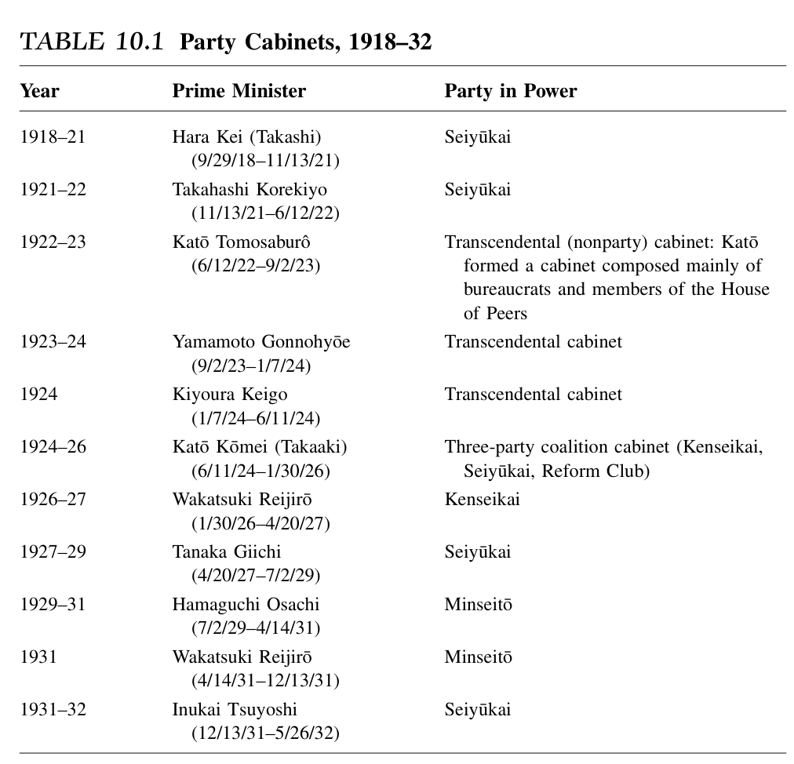
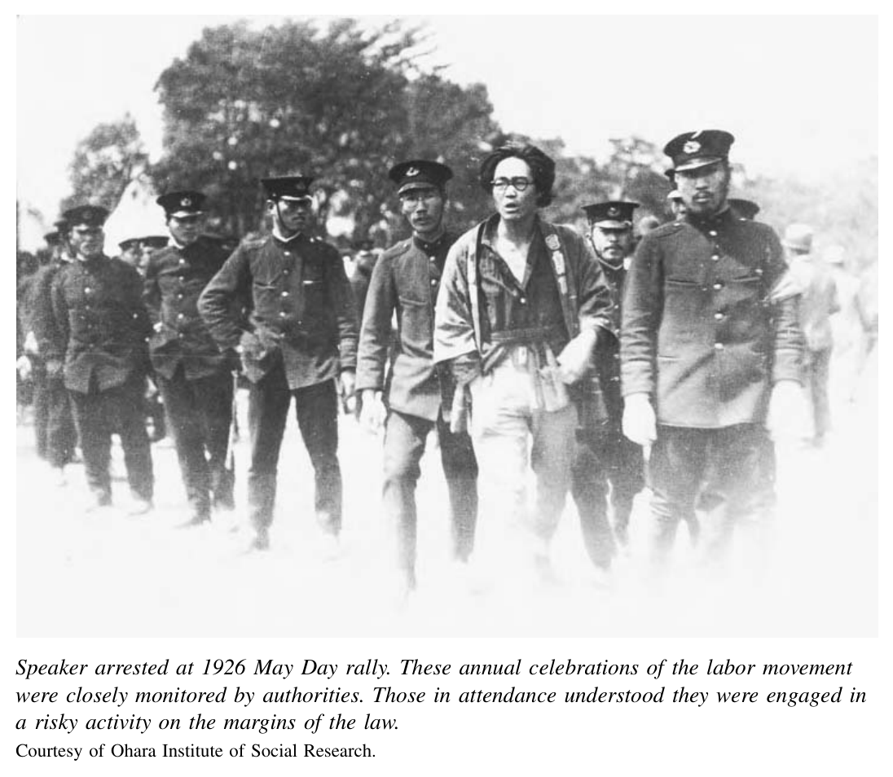

*第三编 帝国日本：从崛起到灰烬*

# 第十章 两次世界大战之间的民主与帝国

1912年，明治天皇去世，大正天皇嘉仁以三十三岁之龄即位。嘉仁幼年曾患脑膜炎，虽然后来康复到足以在皇太子时期多次赴各地巡视，但到1918年，身体状况开始恶化，至1919年已无法履行天皇的正式职责。当时正值欧洲君主纷纷失势之际：1917年俄国沙皇垮台，德国、奥地利和土耳其的国王与皇帝也先后退场。日本国内同样政局动荡。惊惶不安的宫廷官员迫切需要一个能够体面示人的皇室象征，于是事实上为嘉仁安排了一场“强制退休”。1921年，他们让其子皇太子裕仁出任摄政，由皇太子代行父亲的种种皇室职责，直到大正天皇于1926年去世。

因此，大正天皇在位的时期比此前明治天皇的统治短得多；而嘉仁退场的方式，也助长了一种看法：仿佛大正天皇一直体弱多病、精神失常。杰出的思想史家丸山真男后来回忆说，1921年他和小学同学之间常会悄悄传播关于天皇“怪异举止”的流言。据说，天皇曾把御前宣读的开会议会诏书卷成圆筒，当作望远镜似的，朝着满场显贵张望。〔1〕 不论此事真假如何，这类故事连同“大正是一位孱弱君主”的形象，却长期流传了下来。

尽管如此，讽刺的是，大正这一年号后来反倒成了与其统治时期相关联的自由主义精神的代名词。历史学界通常把1905年至1932年视为“大正民主”的时代：它始于1905年围绕结束日俄战争条约而爆发的政治鼓噪，终于1932年政友会内阁的垮台。这个时代也可以用一个乍看自相矛盾的术语来概括：即“帝国民主”。由民选政治家组成内阁、主持政务，在大正时代开始站稳脚跟，这是民主政治方向上的重大转变。但与此同时，我们也会看到连续性：无论是主张议会政治的代表人物，还是明治时代的元老、军部与官僚的支持者，他们无不高声宣示自己对天皇的忠诚，也同样高声维护帝国扩张。在战前日本，正如在英国或荷兰一样，支持更民主政治秩序的人相信，对君主的忠诚、对帝国的追求与民众参与政治，不但彼此相容，而且相互强化。只是事后回望，并以较晚近时代的标准衡量，这些目标才显得彼此矛盾。

## 政党内阁的兴起

在第8章所述1913年“大正政变”的风波之后，海军大将山本权兵卫在政友会支持下出任首相，但只维持了一年，便于1914年初因一桩重大丑闻被迫下台。海军高层从德国西门子公司收受回扣，以购买德国军火作为交换。消息曝光后，和前一年一样，街头再度掀起集会与骚乱。一名在市中心街角演讲的人尤其激动，他冲着聚集的人群高喊：“山本是个大贼！打倒山本！我们得把权兵卫的脑袋从脖子上砍下来！”这位中年裁缝早年曾参加自由民权运动，结果因此惹祸上身，被捕后以煽动暴动罪起诉。他向法官解释动机时说：“因为那是人民的意志，我别无选择。”〔2〕

这类来自民间的控诉力量极大。山本最终因丑闻而蒙羞辞职。1914年至1916年间，前政府领袖、同时也是昔日民权运动人士的大隈重信东山再起，出任首相，并得到新成立的同志会支持。然而，真正由党人出任的阁僚只有五席，大隈的政策仍主要迁就军方旧有议程，尤其是山县有朋与桂太郎长期以来的主张。军方终于拿到了新设两个师团的预算——而这正是此前引发“大正政变”的那项要求。此后，大隈又因1916—1917年的外交处理方式遭元老攻击，其中最具代表性的，便是针对中国提出的《二十一条要求》（下文还会谈到）。随后，出身长州的陆军大将寺内正毅接任首相。寺内内阁名义上超然于党派，实际上却与原敬及政友会配合密切。

就这样，从1913到1918年，这两个政党的领袖延续了此前十年的政治策略：民选议员通过谈判、妥协以及与官僚、军人结盟，一步步争取权力。而在他们背后，是社会上对议会政治相当热烈的支持；在许多观察者看来，这正是立宪政体的真义所在。

1918年时，山县有朋在那个人数寥寥、以天皇名义裁断重大政治事务——包括指定首相——的小圈子元老中，仍居于首席地位。那年夏天，战时通货膨胀达到高峰，米价比上一年翻了一番，全国爆发了袭击米商与政府的暴动浪潮。山县素来严肃克制，不轻易流露情绪，更不是会轻易恐惧的人；但这次米骚动却使他大为震动。他认定，唯有求助于职业政党领袖原敬，才有可能稳定局面。

1918年9月，原敬组成内阁，除陆相、海相和外相外，几乎清一色由党人构成。这是日本历史上第一个稳定而且真正有效运作的政党政府。政友会此后执政将近四年。1920年，原敬果断而强硬地动用政府军队镇压钢铁工人的罢工，就连一向终身厌恶政客的山县，也不禁放下成见，赞叹道：“原敬真了不起！电车和钢厂都平息下来了。原的政策实在高明。”【译注：原文此处标有脚注3，但所附脚注列表中并无对应条目。】不过，原敬本人后来在1921年11月死于刺客之手；但元老们仍同意由其财政大臣高桥是清接任首相，政友会统治又延续了半年。

原敬与政友会的上台，完成了一个历时二十年的过程。这一过程既有危机与骚乱，也有幕后斡旋；到此时，政党及其民选代表已被推到了政治体系的中心，并接近权力顶端。但必须指出，由政党领袖出面组阁的做法，当时还远未成为牢不可破的惯例。高桥是清未能压制党内派阀纷争，1922年便辞去首相职务。此时山县也刚刚去世。接下来的两年间，仅存的三位元老又回到挑选无党籍首相的旧路上，相继任命两位海军出身人物和一位枢密院议长，组成号称超然于党派之上的“超然内阁”，它们与政党的联系都相当薄弱。加藤友三郎于1923年去世后，继任者依次是前首相山本权兵卫和清浦奎吾。清浦的内阁几乎清一色由贵族院人士组成，而不是众议院议员。

这种局面反而迫使多数党领袖在某种程度上暂时搁置派系争吵，尽管政友会中仍有一批人分裂出去，另组第三党，支持清浦的做法。1924年，政友会主流派与宪政会，以及另一个小党革新俱乐部一道，发起一连串集会，要求恢复“正常的立宪政治”——也就是后来常说的“宪政常道”【译注：意指由议会政党依多数原则组成并运行政府，视之为宪政的常规形态】。这些政党还以拒绝配合任何非民选议员组成的内阁相威胁，为自己的“宪政”诉求造势。（宪政会成立于1916年，是同志会改组后的产物。）

与1910年代、尤其“大正政变”时期相比，媒体与公众对这场要求党人执政的运动，热情已经不如从前。即便如此，主张“宪政”的三党联盟仍在1924年议会选举中赢得稳固多数；宪政会更是有史以来第一次成为第一大党。结果，清浦下台，1924年6月，三党联合内阁成立，首相为宪政会总裁加藤高明，而宪政会在联盟中居于主导地位。加藤的精英履历无可挑剔：他毕业于东京帝国大学后，曾短暂任职外务省；其妻是三菱财阀创始人岩崎弥太郎的长女；少年时期旅居英国的经历，更使他相信，议会政治才是确保日本未来强盛与安定之道。

这个联合政府由政友会、宪政会和革新俱乐部三方组成。1927年，宪政会吸纳部分脱离政友会的人士后，改名为民政党。正如党名所示，到20世纪20年代中期，宪政会／民政党在政治立场上已略较政友会自由，更倾向以扩大选举权等办法来维持社会秩序。1925年，一场派阀冲突使这个短命的联合内阁瓦解，但加藤改组为纯宪政会内阁后继续执政。此后直到1932年，政党内阁基本上轮流更替。

政党政府的上升，无疑极为惊人。设计明治宪法的那些精英，本来绝没有预料到这种局面。19世纪80年代末他们起草那部宪法时，原是要让议会在政治上只扮演有限的边缘角色。然而仅仅三十年后，到1918年，民选议员已经从体制外争取分权者，转变为与官僚协商、实际行使行政权的体制内执政者。这一出人意料的结果，正是19世纪国家建构政策的产物。明治改革推动了一种广泛的观念：普通百姓也是国家的一员，他们的意志应当受到尊重。正因如此，才会有像前面那位裁缝那样的人，竟敢公开要求把山本首相“砍头”，并自称是奉“人民的意志”而为。尤其在1910年代，大批日本民众热切要求“宪政”；而在他们心中，“宪政”意味着首相与内阁阁僚应由民选议员出任。

到20世纪20年代中期，这一要求基本得到了满足。但这场政治演变始终伴随着明显的讽刺意味与不确定性。政党在掌权的过程中，不断与非政党精英妥协、合作。一些抱持理想的政治家、许多新闻界与大学人士，以及不少普通民众，都批评政党在上升掌权的同时，也背弃了人民。

## 议会政府的结构

明治宪法所奠定的政治结构，几乎从一开始就注定了：日本的议会政府只能是政党领袖与非政党精英彼此妥协的混合产物。首先，宪法把天皇奉为既神圣不可侵犯、又握有主权的存在。天皇的“玉体”甚至在字面意义上都不可触碰——侍从和御医只要与他接触，必定戴上手套。〔4〕 明治天皇睦仁、其子大正天皇，以及其孙裕仁，都相信自己应当在这套以天皇为中心的立宪秩序顶端，发挥主动的君主作用。裕仁在皇太子时期，因父亲患病，于1921年至1926年担任摄政，实际上相当于先经历了一段事实上的“君主见习期”。大正天皇去世后，他立刻即位，只是盛大的登极仪式直到1928年才举行。

裕仁在位时期的年号是“昭和”，可译作“昭明之和”或“光明和平”。事后看来，这个年号格外讽刺，因为裕仁此后一生既经历战争，也经历和平，直到1989年去世。由于人们很早就意识到他可能年纪尚轻便登基，他所接受的教育从一开始便经过严密安排与监控，使他十分明白自己在日本这套以天皇为中心的宪政体制下应承担的职责。〔5〕 他终身都按英国君主的做法，定期由大臣入内奏报；同时他也相信，君主有责任向这些大臣表达自己的意见，而这些看法往往会造成重大的政治后果。比如在1927—1928年间，裕仁就对首相田中义一处理数次日本军队在中国的军事干预极为不满，甚至亲自申斥田中，此举直接迫使首相辞职。〔6〕

与天皇权力有关的另一个结构性特点是：军队和官僚体系在形式上都不向议会负责。宪法明文规定，天皇直接拥有军队的最高统帅权。军方首脑完全可以把这一条文视作授权，使自己得以绕开首相独自行事。官僚也在一个重要的正式层面上与议会隔绝：尽管他们起草的法律和预算都必须经议会批准，但他们的官职并不来源于议会，而是作为天皇的任命者而存在。

此外，还有两个正式机构进一步强化了帝国国家相对于议会与民众力量的优势。其一是枢密院。这个由十四名成员组成的机构，拥有非常特殊的法律权限。它于1889年以敕令形式设立，原本是负责正式审定明治宪法的机关；在新宪法体制下，它也继续存在。枢密院秘密开会，有时天皇亲临其席，就诸如宪法及其他法律的解释、预算审查、国际条约批准等事项，向天皇提出意见。其成员极端保守，由天皇终身任命，其中包括伊藤博文、黑田清隆、山县有朋等前元老。尤其在20年代，枢密院屡屡与政党内阁的决定相左，并成功否决了一些政府政策。与之类似，贵族院也是以天皇为中心的威权政治的一处堡垒。其成员要么世袭，要么由天皇敕任；在多次关键时刻，贵族院都表现出既有能力、也有强烈意愿去阻挠政党政府的重要改革。

从19世纪90年代到第二次世界大战前，日本政治结构中还有一个关键的非正式环节，那就是被称为“元老”（genrō）的一小群人。与贵族院、枢密院一样——而且成员也部分重叠——元老的存在，确保了政党执政者不能违逆非政党精英的意志。他们最重要的职责，是从19世纪90年代起通过惯例而非法律逐渐形成的：向天皇就首相人选进言，事实上等于裁定首相任命。到1918年，最初七位明治元老中只剩下山县有朋和松方正义。后来，他们又把两人纳入这个非正式圈子：一位是出身华族、做过首相的西园寺公望，另一位则是与宫中关系密切的资深阁僚兼外交家牧野伸显。到了1930年代初，最后一位元老西园寺也因年老——1930年他已八十一岁——再加上军部势力上升，退出了积极政治。取代元老的是一群被称为“重臣”（jūshin）的人，其成员按惯例包括所有在世的前首相。

虽然从1924年至1932年间，元老及其继承者大体上都任命政党领袖出任首相，但他们并不一定任命议会多数党的领袖。事实上，元老只在两次情况下让议会最大党领袖组阁：一次是1918年，政友会本已在议会占多数时，山县请其总裁原敬出面组阁；另一次是1924年，宪政会在选举中取得最多席位后，西园寺请其总裁加藤高明组成联合政党内阁。然而，在接下来八年不间断的政党统治中，权力轮替却常常以相反方式进行。1927年、1929年与1931年，在西园寺主导下，重臣们三次因为认定现任多数党执政失败，而改任少数反对党领袖出任首相。每一次，新首相随即都举行大选，而其所属政党都赢得了众议院多数席位。这与其控制内务省大有关系——内务省不仅掌管警察，还监督选举。换言之，日本选民只是事后追认了政权更替，而不是亲手促成更替。

还有一个削弱议会政府的非正式因素，是不时浮上台面的政治恐怖暗流。一位美国记者把这种现象称作“暗杀政治”。〔7〕 它的高潮要到1930年代才会到来，但即便在1920年代，首相原敬也已遭刺杀，而裕仁在担任摄政王时期，也曾于1923年遭遇未遂刺杀。杀害原敬的刺客年仅十九岁，他是因对原敬及其政党牵涉的多起政治丑闻愤怒不已而下手的。他声称，原敬内阁无视人民福祉，只顾政党私利。袭击裕仁者则是一名左翼人士，意在为1911年被处决的社会主义者幸德秋水复仇。此类袭击既震慑了后来的政党领袖，而社会舆论往往又赞美刺客动机“纯洁”，以之反衬政党领袖肮脏的权谋交易。政治暴力因此侵蚀了议会统治的正当性。

## 意识形态上的挑战

这类行动在一定程度上来自一种政治传统：自认秉持大义、希图引发革命性巨变的人，会以暴力方式将自己所理解的天命正义强加于现实。这正是幕末那些豪侠式尊王志士的精神气质。后来，这种希望借政治暴力推动变革的想象，又被各种秘密结社所延续，其中之一便是1901年由极端尊皇主义者内田良平创立的黑龙会。四十年间，内田始终鼓吹对大陆扩张，同时主张通过国内改革来强化父权体制与皇权荣光。他既抨击元老的软弱，也攻击党人和自由派的民主思想。

在鼓吹一种后来会激发政治恐怖的激进民族主义设想的思想家中，影响最大者恐怕是北一辉。1923年，他在《日本改造法案大纲》中系统阐发了自己的立场。他与内田一样尊皇，但同时也赞同政治左派所主张的某种经济平准化目标。他号召一支由青年军官和青年文人组成的先锋集团夺取政权，暂停宪法，重建政治结构，以实现天皇与人民的直接结合。他还主张重新安排经济秩序：既承认私有财产，又通过一系列“生产省”来重新分配财富、管理增长。北一辉主张把土地还给佃农、让工厂工人分享利润，但同时坚持女性必须继续充当“国民之母与国民之妻”。到了20年代，数十个组织都在不同程度上拥护北一辉这套以内反政党、对外扩张、以天皇为中心的纲领。

而在政党统治者与非政党精英看来，更具威胁性的则是自俄国革命到30年代初蓬勃发展的形形色色左翼运动。早在世纪之交，社会主义、女权主义和劳工抗争就已开始困扰日本统治者（第8章已有所述）。但资本主义渗透的加深、教育普及和政治理想主义的扩展，尤其是1917年俄国革命后共产党政权的建立，激励了日本国内那些批判不平等与贫困的人，更有力也更广泛地投入行动。他们和世界各地左翼一样，既因相似的不满而被推动，也因相似的策略与意识形态分歧而彼此争论。

有些人，如大杉荣，早在20世纪初的社会主义运动中便已开始活动。1911年那场导致多位同志被处决的“大逆事件”中，他之所以幸免，只因当时已经身陷囹圄。到了20年代初，大杉已成为无政府主义的重要倡导者，主张通过罢工和直接攻击当局等方式，建立一个更自由、更平等的社会。

另一些新一代活动家，如山川均和荒畑寒村，则设想效法俄国布尔什维克，由先锋党领导一场共产主义革命。1922年，他们在共产国际支持下共同创建了日本共产党。山川主张通过与非共产党左翼结成统一战线来组织群众；而福本和夫等对手则更强调一种宗派化路线，主张日本共产党单独行动，或秘密借助外围组织活动。由于日本共产党在1945年以前始终非法，成员数字无从确知，但到20年代后期，其追随者大概不过数千人。

这些以大学毕业生为主体的小团体，在20年代开始努力与工会建立联系，扩展更大的支持基础。日本第一次“五一”庆祝活动举行于1920年，现场红旗招展，横幅上写着争取工人阶级解放的口号。此后几年，罢工集会和五一纪念日动辄有数千人参加，已属常态。演讲者不仅要求加薪、改善待遇，还会引述列宁，慷慨陈词：“劳动运动必须前进，以终止资本家的掠夺”，“必须彻底摧毁现存社会秩序”。〔8〕 在战前日本，几乎一切政治集会的讲台边都坐着警察盯梢；一听到这种话，他们往往立刻叫停演讲，甚至干脆驱散会场。

1910年代与1920年代掀起的女权思想浪潮，对统治精英的威胁至少不亚于劳工运动。当时的女性主义写作中，日本女性常被描绘成“笼中鸟”或“脆弱的花朵”。那么，该怎样打开鸟笼，或保护花朵？一些女权主义者，如平冢雷鸟和高群逸枝，发展出一种可称为“女性中心主义”的思路，延续了早期女性倡导者的论点，主张正因为女性具有母亲这一特殊角色，所以应给予其特别保护。高群尤其独立，她主张在地方层面建立共同体机构，照护为人之母者；又谴责婚姻制度对女性而言近乎灾难。她尤为独特之处，在于把目光投向日本古代，认为那曾是一个以女性为中心、尊重并扶助母性的社会。另一些女性主义者，如诗人与散文家与谢野晶子，则主张女性的解放不应只以母亲身份为限，也不应仅仅作为日本人，而应作为更大世界中的“人”来追求。山川菊荣更进一步，把女性主义同社会主义联系起来。她认为，劳动阶级女性同时遭受性别与阶级的双重压迫，因此必须同时组织起来，对抗父权权威与雇主剥削，才能实现“引发妇女问题的经济制度之革命”。〔9〕 和当时许多社会思想领域一样，日本女性主义内部“女性中心”与“人类普遍主义”两种路线之间的分歧，与19世纪、20世纪西方社会内部类似的争论极为相近，也明显受到后者影响。

即使是接受现代资本主义秩序、起初也欢迎议会政治的人，对现实中的政党统治同样可能提出尖锐批评。议会自由主义最重要的思想倡导者，是东京帝国大学法学教授、基督徒吉野作造。1916年，他发表一篇著名论文，提出自己心目中真正适合日本的宪政形式。吉野认为，政府的目标应当是保障国民福祉；选举以及向议会负责的内阁，是实现这一点的最佳保障。这种政治制度应当“以民为本”（minponshugi，通常译作“民本主义”），同时又尊重天皇主权。然而，当吉野在20年代中后期环顾现实，他认定各大政党已被财阀之类自私的“利益勾连”所俘获；在他看来，这些政党在道德上已经腐败，不再真正服务于人民。〔10〕

## 帝国民主统治的策略

既然战前日本的议会政治在制度上受到正式与非正式结构的掣肘，又在意识形态上遭到以天皇为中心的右翼激进派和各种左翼活动家的挑战与攻击，到了20年代末，就连新闻界和许多知识分子这些本该是它“天然盟友”的群体，也至多只是冷淡支持，那么，1918年至30年代初，政党又是如何在相当程度上得以分享权力、组成内阁的呢？

部分原因在于，政党领袖本身就是极其务实的政治家，他们逐渐把官僚与军人视作盟友，而非敌手。从社会属性看，政党领袖与官僚、军方精英并无多大不同：他们中有富裕地主、实业界领袖，也有退休后转入政治、继续追求公共角色的前官僚，还有都市职业人士，如律师、出版人和记者。他们都在同样几所精英高等学校和帝国大学受教育，家庭出身也大都属于相似的优渥阶层；他们出入20世纪初创立的少数几家高尔夫俱乐部，彼此通婚，子女成亲。

政党统治也有其切实的经济基础：它确实能把重要利益带给相当多的人。只要政党内阁掌握公共工程或教育预算，小城镇市长、地方商界领袖或学校校长，就有充分理由支持执政党。作为回报，只要他们能够送出票源，或承诺出面动员选票，就可能换来铁路线改道经过本地、港口获得疏浚预算、学校落户本乡本土。美国当时把这种向选区输送预算与工程的做法叫作“pork-barrel”，也就是“猪肉桶”利益；在日本，这种诱惑同样难以抗拒。也正因此，一旦在野党上台，它几乎总能在下一次选举中取得胜利。另一方面，媒体对这类交易乃至赤裸裸买票行为的揭露，也使不少更有理想色彩的选民对政党愈发反感，损害了其正当性。

从1910年代到30年代初，议会统治之所以还能维系，还因为党内外精英之间共享着一些基本政治态度。很少有政党领袖把民主视作目的本身；他们更愿意把它看作一种手段，用来巩固天皇与帝国的地位、提升国力并维持社会秩序。只要统治者以及更广泛的公众还相信政党统治有助于实现这些目标，它就能获得一定的正当性。

党人、官僚和军方主流人士共同接受了一套“分而治之”的基本政治逻辑。一方面，可以扩大投票权，让那些有财产、有身份的男性在议会中代表民意。正如一位政友会重量级议员所说，这个新时代的政治应当“以民为本（民本主义），并且处理社会问题”。〔11〕 但所有精英也都同意，任何关于经济民主的设想，或任何从政治上挑战皇室制度的言行，都绝对不可越界。1920年，在政友会执政下，原敬严厉镇压了全国最大钢铁厂的罢工。1923年9月关东大地震后的数日里，政府力量在默许、甚至有时煽动对数千朝鲜人的大屠杀的同时，又以一连串臭名昭著的国家暴力行动，残酷打击那些被视作政治“法外之徒”的人。警方杀害了女性主义作家伊藤野枝、她那位著名的无政府主义恋人大杉荣，以及他们的外甥。另一起行动中，警察联合军队，逮捕并杀害了工会领袖平泽计七及另外九名劳工活动家。这些人其实并不构成对日本统治者的迫切重大威胁，但精英中的许多人——尤其是军部、宫廷圈子以及部分官僚——对激进思想采取的是毫不容忍的“零容忍”立场。政党领袖似乎也抱持同样态度；他们几乎未对此提出任何抗议。1925年，在宪政会执政下，议会通过了高压性的《治安维持法》，规定攻击天皇可判死罪，而批评“私有财产制度”则最高可判十年监禁。1928年，在政友会执政时，警方对日本共产党发动大规模镇压，逮捕一千六百人，起诉其中五百人。翌年，警方又在新一轮搜捕中，以共产党员名义再逮捕七百人。

因此，政党是作为其他精英的伙伴而执政的。他们共享社会关系，交换经济利益与政治庇护，也在根本意识形态上彼此一致：他们容许某种程度的民主参与，但都拥护帝国与天皇作为政治秩序的基础。

不过到了20年代，政党内部、官僚体系与军方内部也逐渐出现重要的战略分歧。有些人主张，帝国日本的“民主”只应属于拥有资本和土地财产的男性；另一些人则认为，只要思想和行为不越出可接受的边界，把日本建设成面对全体男性、甚至女性都更开放、更民主的社会，反而更有利于国力与秩序。

这两条道路在20年代都曾被认真探索。较为保守的帝国民主方案，主要与政友会以及农商务省官僚联系在一起，在第一次世界大战刚结束后的几年里主导了国家政策。政友会在扩大合法政治参与范围上相当谨慎。原敬主张降低选举权所需的财产税门槛，这一改革于1919年获得议会通过，使选民人数增至三百万男性，约占总人口的5%。政友会至少也承认了女性在政治边缘可以扮演略扩大的角色：1922年，它修订1900年那部剥夺妇女一切政治权利的法律，允许她们参加政治集会，虽然加入政治组织等其他权利仍然不在其内。但在这些年里，原敬始终反对哪怕只是男性的普选：“还太早了。废除财产税投票限制，以期摧毁阶级差别，是危险的想法。我不能同意。”〔12〕 他的内务大臣支持在工厂设立劳资协商会，以争取工人的忠诚，却拒绝承认工会拥有更自主的活动空间。1919年，这位内务大臣又在国家与企业资助下，促成成立一个名为“协和会”的智库，其任务是研究社会问题，并促进劳资和谐。政友会同时还试图稳固乡村小土地所有者的地位。1920年，它在农商务省内设立委员会，研究租佃改革，但面对地主反对，又搁置了赋予佃农法律权利的立法计划。

1918—1921年的政友会政府，以及1922—1924年的“超然内阁”，还建立起一套较此前更为细致的中央与地方社会福利制度。1920年，原内阁在内务省设立“社会局”，负责处理失业、劳资纠纷和佃农抗争等问题。1922年，它推动《健康保险法》和修订后的《工厂法》通过议会。前者要求所有中大型企业为全体雇员设立健康保险组合，保费由工人与企业共同缴纳；若不设，则须允许员工加入新设的官办保险计划。后者则提高了死亡、工伤补偿和病假工资的最低给付标准。〔13〕

此外，自1918年大阪率先实行以来，日本地方政府还摸索出一套低成本制度，为全国最贫困家庭提供咨询与道德劝导。这个制度把地方社区领袖纳入其行政运行之中，授予他们一种无薪职务——“方面委员”（district commissioner）。这些委员挨家挨户走访贫困家庭，就卫生问题加以劝导，帮助介绍工作，督促他们节俭，同时为他们联系民间慈善或公共救济资源。到20年代末，内务省已把方面委员制度称为日本“社会事业的核心制度”。〔14〕

这些制度与项目并非毫无意义，但又显然受制于政府在社会问题上不愿多花钱。枢密院阻挠了议会的意志，不肯批准落实新健康保险法与工厂法所需的经费。到了20年代末，方面委员也曾发起强烈运动，要求政府提供更慷慨的贫困救济，但短期内几乎没有收到什么效果。

与此相对，宪政会／民政党与新一代内务省官僚结盟，提出了更自由主义的帝国民主版本。后者看到战后欧洲，尤其是英国，自由改革在一定程度上带来了社会稳定，因此深受触动。1924年，加藤高明领导的宪政会内阁上台后，更扩展性的社会政策遂成为主流。加藤推动《佃农争议调停法》通过，这实际上承认了佃农组织的某种法律地位。在此后十六年间，几乎三分之二登记在案的租佃纠纷，都是根据这部法律得到调停的。〔15〕 加藤也试图改革贵族院制度、削弱其权力，虽未成功；但他确实推动了那个时代最著名的改革，即1925年的成年男子普选：凡年满二十五岁、且未接受公费救济的男性，一律获得选举权。

1926年，宪政会又提出所谓“产业界的普选”三项方案：承认工会法律地位的立法、劳资争议调停法案，以及废除1900年《治安警察法》中反工会条款。由于农商务省官僚、政友会和大多数商业团体的反对，工会法案未能通过，但其他措施都成了法律。宪政会还成功争取到经费，使1922年已获通过的《工厂法》与《健康保险法》的改革得以真正实施。1926年，内务省甚至训令各府县当局：尽管工会法案在议会中被否决，仍应依其精神办事。综合来看，这些举措意义重大——它们既为劳动者提供了社会支持，也在事实上承认了其组织工会与罢工的权利。

宪政会／民政党内阁也扩大了女性的政治权利与公民权。1922年那次小幅改革虽已允许女性参加政治集会，但妇女团体仍持续争取尚未获得的权利：政治结社权、选举权和担任地方公职的资格。1929年，首相滨口雄幸、外相和内相曾前所未有地会见主要女性参政权人士，希望她们支持政府的紧缩预算和财政紧缩政策。作为交换，首相承诺支持妇女选举权与公民权。促使他采取这一步的，既有严峻的经济危机，也有其自由主义信念：在长远上，扩大参与将带来稳定。妇女团体则乐观地把这次会面理解为一种象征性的承认——承认女性正走向成为完整政治共同体成员的道路。

这些宪政会／民政党的政策，试图让原本被排斥在外的人群也拥有发声的机会，并在现行制度中获得一席之地。成年男子普选一实施，新的工人阶级政党便立即成立，向所谓“既成政党”发起挑战，但在1928年第一次普选中表现不佳。相反，民政党在大城市工业区赢得了新的支持。其劳工改革也增强了温和工会的地位，这些工会领袖声称，在既有政治秩序内仍有可能争取权益。就此而言，民政党这种更具包容性的帝国民主，似乎确实有助于促进社会秩序，也能换来选票。民政党也因此得以与部分官僚、商界人士和军方人物维持可操作的联盟。

但其他精英却对这些改革深感不安。许多财阀领袖、司法省与农商务省官僚，以及政友会中的不少人，都把这些举措视为过于激进。与此同时，那些对政党长期腐败心灰意冷的知识分子，对民政党的社会自由主义至多只是冷淡支持。其中一些人甚至把对民政党的失望转化为对整个政党内阁体制的攻击。只要社会秩序尚能维持，经济不至于全面崩溃，帝国看上去依然安全，政友会或民政党中的一方就还能推行自己的议程，并保有官僚、军方和商界盟友的支持。但这种权力基础并不牢靠。

## 日本、亚洲与西方列强

日本1910年代和1920年代的外交政策，同样体现出在基本目标上广泛一致、但在实现路径上激烈分歧的特点。主流政党与其他精英一样，热烈支持海外帝国。他们希望与西方帝国主义列强平起平坐；在亚洲，他们甚至要求日本地位高于其他列强，并一再推动西方承认日本在亚洲拥有“特殊利益”。这些总体目标，政党与军方首脑、报界主笔之间大体共享。但就如何实现它们而言，政客彼此之间的分歧，同军方与政党之间一样尖锐。

最具分裂性的争议，主要集中在几个相互关联的问题上。第一，日本应当与欧洲列强和美国合作，以在中国谋取经济和军事优势，还是应采取单边行动？第二，日本是应支持并与辛亥革命后那个艰难求存的年轻中国政府合作，还是应通过与抵抗中央弱势政府的地方军阀做交易，来强行维持中国秩序？第三，日本应承认苏联并与之合作，还是应设法摧毁或遏制它？从第一次世界大战到整个20年代，这几种选项实际上都被尝试过。

第一次世界大战的爆发，使这些问题一下子全都提上了日程，也给日本政府带来在亚洲扩张力量的黄金机会。根据1902年《日英同盟》（1911年修订），日本于1914年8月迅速站到英国一边参战。到当年年底，日本军队已接管德国在中国山东半岛的权益，包括铁路和军事基地，以及太平洋上若干岛屿。

这一路线对英国来说完全可以接受，对仍保持中立的美国也并未立即构成太大刺激。但当日本政府进一步提出臭名昭著的《二十一条要求》时，局面就复杂起来了。1915年1月，大隈重信首相和外相加藤高明——他们的政府得到同志会支持——向袁世凯领导下的中国年轻政府提出五组具体要求，共二十一条。其中第五组尤其令中国人愤怒：它要求在中国设立中日联合警察机构，并迫使中国政府在政治、经济乃至军事事务上聘用日本顾问。这几乎是要把中国径直推上通往日本殖民地的道路。

中国社会对此反应激烈。反日人士发起抵制日货和日本航运的运动。袁世凯一方面抵制要求，一方面争取国际支持。当英国和美国对其中最激进的要求表示反对后，日本同意撤回第五组主张，而袁世凯接受了其余要求。其结果之一，是中国承认日本对原德国在山东权益的控制；同时，中国还给予日本在山东修筑铁路的权利，袁世凯也承认日本在南满拥有特殊地位。

日本军方支持在大陆追求经济与战略权力，但山县有朋等人又对大隈和加藤在中国问题上的做法深感不安，因为这激起了强烈的反日情绪。对山县而言，更令人担心的，是加藤显然意在加强文官对外交的控制、并借此扩张政党对政府的掌握。等到加藤离任、大隈内阁又因丑闻而倒台后，山县便得以借机阻挡政党内阁的进一步发展，安排自己的盟友、陆军大将寺内正毅上台。〔16〕

随着战争继续，日本新政府在几乎不顾与西方摩擦的情况下，继续加紧扩张其利益。1917年美国参战后，一度与日本成为盟友。两国签署了《石井—兰辛协定》：日本同意尊重中国独立，并承诺不妨碍美国在华“门户开放”的商业机会；作为交换，美国承认日本在中国拥有“特殊利益”。实际上，这等于双方默认彼此在亚洲的殖民地权益。1918年，日本又通过所谓“西原借款”进一步巩固这些“特殊利益”（借款以寺内首相特使西原龟三的名字命名）。这些借款名义上由日本民间银行提供，用于铁路建设等经济项目；实际上，则是由日本政府出资，扶持某位中国政治人物对抗其军阀对手，以换取在山东和满洲更多经济特权。

日本在中国权益问题上的野心，也一路延续到1919年凡尔赛和会。作为战胜国之一，日本代表团参加和会，最重要的目标是确认日本对前德国在山东租借地的控制。同时，他们还积极要求把“种族平等原则”写入国际联盟盟约。美国总统伍德罗·威尔逊和其他盟国领袖虽然同意日本保有在山东的立足点，却拒绝把种族平等条款纳入盟约。这两项决定都动摇了西方列强战后关于“平等”和“民族自决”应成为国际秩序基础的理想主义宣称，也进一步激起日本对于西方伪善的愤怒。

与此同时，日本因对苏俄采取的干预政策，也引起西方深深疑忌。这就是所谓“西伯利亚出兵”。1917年11月，布尔什维克革命在俄国胜利后，日本政府便开始寻找一切可能方式，帮助反革命力量推翻新生的共产党政权。至少，日本也希望支持在俄国远东地区建立一个反共政权——因为那里当时尚未完全落入布尔什维克控制。但寺内内阁又不愿单独行动。

1918年，一个出兵机会出现了。3月，英、法、美三国政府同意向西伯利亚派兵，目标是保护储存在海参崴的协约国军需物资以及聚集在那里的亲沙皇武装。威尔逊总统要求日本加入这场干预，寺内首相可谓求之不得。威尔逊原只要求七千兵力；日本答应派一万二千，实际上却一口气派出整整七万人！直到1922年——比其他列强认定白俄运动已无希望、撤军两年之后——日军仍留驻西伯利亚，继续扶植海参崴的一个小型反革命政权。这种毫无前途的单边行动，在国内外招来日益强烈的批评。到头来，日本除了失去三千名士兵、同时引起西方猜忌以及苏联不信任之外，一无所获，只得在1922年末撤军回国。

《凡尔赛条约》和西伯利亚出兵，只是战后“合作式帝国主义”崎岖开端的一部分。整个20年代，列强仍在继续摸索彼此合作的方式。就在西伯利亚干涉接近尾声时，原敬政府同意参加在华盛顿召开的国际和平会议。会议目标之一，是终止日本、英国和美国之间正在形成的海军军备竞赛。原敬当时奉行削减政府支出的经济政策，因此乐见其成。最后达成的条约规定，英、美、日三国主力舰总吨位维持5∶5∶3之比。日本之所以接受低于英美的吨位水平，是因为英美承诺不在西太平洋增建海军要塞。各国都宣称，这一比例既能保障各自安全，也足以避免军备竞赛。

整个20年代，日本政府在战略与财政双重考虑下持续精简军备，大多数军方高层对此亦予支持。政府削减兵员与武器，军费在国家预算中的占比从1918年高峰时的55%，到1924年降至29%。此后数年，裁军仍在继续。1925年，陆军大臣宇垣一成——他曾于1924至1927年以及1930至1931年在宪政会／民政党内阁中任职——裁撤四个师团，共约三万四千名士兵。但节省下来的相当一部分经费，又被转投入购置现代化武器。宇垣还推行多项争取社会支持军队的政策，如在中等学校和高等学校实施军事教育。这种思路，正是日本统帅部从第一次世界大战中汲取的教训：未来战争将要求对平民社会与物资资源进行总动员。

与限制并现代化日本军队的这些政策相并行的是，整个20年代的大部分时间里，日本对华政策也较第一次世界大战时期谨慎得多。

问题在于，如何在不断增长的日本在华存在中保护其利益，同时又如何应对中国内部不断变化的政治权力格局。1900年，在华日本侨民不过四千人左右；到1920年，这一数字已达十三万四千。日本人主要聚居在满洲和华北，但到20年代中期，日本企业在上海，尤其在纺织业方面，也已有相当规模的投资。

这些人是在一个不断变动的中国政治环境中谋求商业利益的。中国国民党这时已接过推翻清朝革命的旗帜，但直到20年代中期，其政权基础仍相当不稳。它既面临城市和乡村中日益壮大的共产党运动，又面对地方军事首领——即所谓“军阀”——的挑战；而这些军阀在华北和满洲尤其强大，偏偏日本又声称在那里拥有特殊的经济与战略权益。

原敬领导下的政友会政府试图通过与西方列强和中国国民政府合作，来保障日本利益。原敬停止了为日本干预中国政局提供便利的“西原借款”。作为1922年华盛顿会议安排的一部分，他同意将山东归还中国，同时保留对关键铁路的长期权益。1924至1927年间，宪政会／民政党内阁在亲西方的外相币原喜重郎主持下，也延续了这种谨慎合作的基调。1925年至1927年初，英国或美国曾三次要求日本共同派兵，以应对据称威胁外国在华利益的局势，但币原每一次都拒绝出兵。

不过，币原也绝不愿意让日本在华企业仅仅依赖“自由进入开放市场”这一套。依照华盛顿会议的承诺，各列强于1925年在北京召开国际关税改革会议，目标是把中国在八十年前鸦片战争后失去的关税自主权重新归还中国。币原从一开始就对支持中国的关税自主要求抱有保留态度。他担心中国会利用这一权力阻碍日本纺织品出口，因此拒绝作出关键让步。最终，会议未能达成协议，以失败告终。

尽管在经济谈判上并不软弱，币原在日本国内仍被批评为“软弱外交”，因为他不愿派兵中国以对抗反日浪潮。另一种方针的可能性，随着1927年陆军大将田中义一出任政友会新内阁首相而浮现。田中是职业军人，1925年才应邀担任政友会总裁。他并未直接否定与西方合作，但其外交方针显然比币原强硬得多。1927年和1928年，他三次派兵中国，名义上是保护日本侨民与经济利益，实际上眼前威胁远没有国内报道得那么严重。真正令他忧心的，是由蒋介石领导的国民革命军到1927年已控制华中，下一步极有可能向华北推进，进而挑战日本在华北和满洲的特殊权益。政友会与军方首脑因此一致认为，日本应当考虑采取独立行动，并与地方军阀结盟，以保全这些利益。〔17〕

日本国内反对与西方在华妥协的情绪，有一部分来自对美国对待日本移民方式的愤怒。到20世纪初，迁往夏威夷和美国本土的日本移民已接近十万人。美国西海岸关于所谓“黄祸”的反移民言论尤其激烈，当地法律甚至规定学校实行种族隔离。1908年，西奥多·罗斯福总统试图通过与西园寺首相达成所谓“绅士协定”来平息风波。这个并非立法的安排，实际上要求日本政府大幅限制赴美移民。

然而，美国对已在当地定居的日本人却谈不上半点“绅士风度”。加利福尼亚的新法律禁止日本人拥有土地或长期租地；1922年，美国联邦最高法院裁定，日本人及其他亚洲移民一律不得归化为美国公民；而1924年出台的新《移民法》则进一步取代“绅士协定”，彻底禁止日本移民入境。这样的措施不仅违背了战后国际合作的精神，也直接削弱了美国要求日本在亚洲支持其“门户开放”政策的道德立场，自然在日本激起巨大愤怒。日本驻美大使埴原正直在致美国劳工部长的信中写道：

问题的要害在于，日本作为一个国家，究竟是否有权获得其他国家应有的尊重与体谅……这项[排斥条款]显而易见的目的，就是把日本人作为一个民族单独拎出来，使其在美国人民眼中被打上“不配”“不受欢迎”的烙印。〔18〕

不过，真正更深刻地刺激日本国内对政府外交政策提出批评的，还是亚洲各地对日本殖民统治和帝国主义愈来愈强烈的反抗。其最大的讽刺在于，日本在日俄战争中的胜利，最初曾点燃从中国、越南到菲律宾、缅甸和印度的反殖民激情。所有这些地区的人都把日本看作一种反殖民力量，并从中得到鼓舞——他们相信，这是现代史上“黄种人”第一次击败“白人”的重大胜利。尤其在20世纪初到1910年代间，数以千计的中国青年、数百名来自朝鲜和台湾殖民地以及越南的学生，还有少数来自印度、缅甸、菲律宾等地的人，都前往日本求学。日本许多政治人物——从反西方民族主义者到具有国际主义眼光的社会主义者——都曾支持这些亚洲青年在本国推动改革的计划。

然而，日本对这些亚洲青年解放梦想的支持，很快就在帝国主义现实政治面前烟消云散。比如1907年，日本与法国结盟，两国政府便秘密约定相互尊重对方的殖民地权益。结果，日本政府开始驱逐在日越南学生。接下来的几年里，在广大亚洲人眼中，日本从一个鼓舞亚洲解放的力量，变成了压迫者本身；从吞并朝鲜到提出《二十一条要求》，其侵略性政策都加深了这一印象。

尤其是1919年，先后发生了两场极为重大的反日爆发。朝鲜方面，流亡海外的爱国者因威尔逊在1918年凡尔赛和会前提出“民族自决”而深受鼓舞。他们曾打算从夏威夷派遣代表与会，但日本拒发护照。1919年2月，在东京的数百名朝鲜学生组建“青年独立团”，通过了要求立即独立的声明。与此同时，朝鲜国内的类似情绪也围绕前朝鲜国王高宗之死而迅速凝聚。高宗于1919年1月去世，人们预料3月3日葬礼当天日本警力必然严密布防，于是民族主义者选择抢先行动，于3月1日发表《独立宣言》。这随即引发数十万学生、工人及各界人士在首尔举行和平示威，并迅速蔓延全国。日本当局对这些行动背后所显示出的强烈情感与精密组织大感震惊，于是惊慌失措地采取暴力镇压。日军杀害了成千上万朝鲜人，逮捕数万人。到4月下旬，一种建立在残酷镇压之上的“秩序”才被恢复。〔19〕

紧接着，类似的大规模示威又在中国爆发。4月下旬，列强在凡尔赛拒绝了中国要求从日本手中收回山东全部控制权的诉求。5月4日，数千名学生在天安门前示威。这场运动同样迅速蔓延到其他城市。它固然也针对中国本国政府的软弱，但驱动其爆发的核心动力，是对日本侵凌中国的愤怒。五四运动标志着中国大众民族主义力量与广度都迈入新阶段。反帝示威，包括多次抵制日货运动，在整个20年代反复出现。1925年，五卅运动起于上海日资纺织厂的罢工；当5月30日英国巡捕枪杀数名示威者后，全国性反日示威、罢工和抵制浪潮的规模，甚至超过了1919年。

某种程度上正是对此类中国局势的回应，日本政治领袖在20年代大多采取了相对和缓的方式，试图在中国保护经济利益。出于同样逻辑，首相原敬也认定，单靠镇压并不是维持朝鲜殖民统治的正确道路。三一运动之后，他任命海军大将齐藤实为新任朝鲜总督，命其恢复所谓“日鲜和谐”。齐藤推行的新政策后来被称为“文化政治”。其核心其实仍是一套分而治之的策略：殖民当局一方面扶植愿意合作的朝鲜领袖和组织，另一方面隔离并镇压一切反日活动迹象。

“文化政治”常被斥为不过是给持续不变的高压统治披上一层化妆而已。齐藤到任后，日本当局在短短一年内便把朝鲜的警察署和派出所数量扩张到原来的四倍，并建立起覆盖全境的庞大告密者和线人网络。殖民当局以“经济开发”名义投资改良灌溉，粮食产量固然增长，但新增部分大多被运往日本，结果朝鲜人均米食消费反而下降了。

然而，齐藤的改革也并不只是纯粹表面文章。他逐步扩大朝鲜人的公立学校数目，吸收更多朝鲜人进入殖民行政体系，并缩小其工资与日本人之间的差距。朝鲜人出版书籍、杂志和报纸的空间，也较此前有所扩大。殖民当局还允许更广泛类型的朝鲜团体从事活动。朝鲜人因此创设了成千上万个新的教育团体、宗教团体、青年组织，以及农民与劳动者组织；少数朝鲜资本家也获得了新的经济机会。

当然，审查与监控依旧严密，任何稍稍挑战日本统治的人，仍可能被监禁和拷打。尽管如此，民族主义政治活动仍在继续，要么公开伪装，要么秘密进行。正如日本本土一样——虽然在朝鲜所受限制更大——一种新的、多元而充满活力的现代文化生活，如电影、广播与文学，也在整个20年代直至30年代初蓬勃发展。

在日本国内，政府圈子之外对战后国际环境的反应也多种多样。少数知识分子如吉野作造，一方面支持国内实行更民主的制度，另一方面也开始主张殖民地人民——尤其是朝鲜人——应逐步走向自决。这一立场尤其值得注意，因为吉野等人先前曾毫无保留地反对朝鲜独立。吉野与另外一些人，如出版家兼政治家岛田三郎，也大力支持裁减军备的主张。到1921年，国内舆论已明显转而反对西伯利亚出兵，报纸纷纷要求撤军。20年代初甚至流传着一种说法：士兵们在公开场合都为穿军装感到难堪。1920年，日本最大的工会联合组织“大日本劳动总同盟”也象征性地删去了名称中的“大日本”，以表示反帝立场。该组织公开主张朝鲜应享民族自决，并偶尔刊文关注朝鲜工人的处境。到了20年代后期，工人阶级政治组织也支持中国人民的自决权，并一致谴责田中义一与政友会发动的军事干涉。

另一些民间声音同样反对西方帝国主义，但却把日本描绘成一种“不同”的力量，因而反过来主张更强硬的日本外交。像内田良平这样的老牌极端民族主义者，自19世纪80年代起便支持日本在亚洲扩张，到了20年代依旧鼓吹向大陆推进，以增益皇权荣耀。但最有影响力的阐释者，恐怕还是北一辉。他在1923年的《日本改造法案大纲》中，在国内反对阶级斗争，却把阶级斗争的逻辑转移到国际舞台上。他把日本称为“国际无产者”，并追问：“日本难道没有权利以正义之名发动战争，夺取英美的垄断利益吗？”〔20〕

这种思想也获得了一定民间支持。某大造船厂机械工神野新一，1920年赴欧洲学习工程学，途中曾经过上海。后来他回忆说，自己看到公园门口写着“华人与狗不得入内”的牌子，深受震撼。从此，他放弃了国际主义社会主义，转而高唱一种自称“日本主义”的激烈主张，号召工人支持天皇与帝国，对抗西方，并赢得了相当响应。在中国，数百名日本冒险家——所谓“中国浪人”（“浪人”原指失去主君的武士）——一面投机牟利，一面以“亚洲解放”为名进行政治活动。到20年代末，一张不断扩大的民族主义政治网络，已经把这些国内外的民间扩张主义者，与军中那些年轻而行动派的军官联系起来。他们获得了军方高层某种程度上的默许，甚至公开支持，其中包括陆相宇垣一成、荒木贞夫，以及朝鲜总督齐藤实。他们的口号是亚洲团结、共同反西方，但始终把日本设想为亚洲的霸权领袖。

在没有大规模舆论调查的时代，我们不可能准确判断上述各种立场在社会上的支持面究竟有多宽。即便如此，国内曾存在某种反军国主义情绪这一点，本身就值得注意。但即使在战后国际主义情绪最浓的时期，它也绝不是社会主流。日本知识界与大众舆论的主流，即便一面批评西方帝国主义，另一面仍然支持本国的帝国。

因此，日本1910年代与1920年代外交争论的主轴，并不是“帝国主义”与“反帝国主义”之争，而是“缓进型帝国主义者”与“急进型帝国主义者”之争。前者更倾向于通过与英国、美国及中国合作来谋取利益；后者则更强调以单边方式解决冲突。这种分野并不总是严格沿着政党界线展开，也并不总是温和的“缓进派”文官对抗扩张性的“急进派”军人。毕竟，第一次世界大战期间，正是与同志会有关的两位政治人物——大隈和加藤——提出了激进的《二十一条要求》。不过，到了20年代末，日本国内围绕外交路线的争论已经出现某些相对稳定的格局：民政党支持与英美谈判时采取更合作的态度，并在面对中国民族主义时较为克制；政友会则在对华、对西方外交中都更倾向强硬和单边主义。军方高层与不少基层军官对合作外交愈发不耐烦，对文官政客也越发轻蔑。陆军最担心、也最看重的，是中国——尤其是华北与满洲——因为在他们看来，日本在亚洲霸权面临的最大威胁与最大机会都在那里；海军则把主要注意力放在太平洋上的西方竞争对手身上。

必须看到，日本外交在基本目标上与其他帝国主义列强并无本质差别。到了20年代，所有列强都还在推进殖民或半殖民统治。有些宣称要“同化”，有些许诺未来独立与自决，但无一例外都以“教化”与“提升殖民地人民”为说辞来合理化自己的统治。各国口头上都谈合作，实际上又都竭力保卫自己在特定地区的帝国霸权。美国谈论其在拉丁美洲的独特权利与利益时，措辞和日本所谓在亚洲的“特殊利益”，并无二致。

但有两点差异最终会变得至关重要。其一，自20年代中期起，西方列强在中国问题上，比日本略更愿意往后退一步，允许中国国民政府恢复一定程度的自主权；此后，日本与西方在中国问题上的分歧只会愈来愈大。其二，也是后果最为深远的一点：到了1930年代，明治宪法之下形成的日本政治体制，已难以调停强势政治行为者之间的冲突。它没有任何制度性制衡，足以约束那些擅自行动的军官。理论上，只有天皇有权压制军队，但他既无力，也不愿真正以这种方式行使自己的权力。〔21〕

总而言之，当帝国民主秩序在20年代末和30年代初同时在国内外遭遇冲击时，日本领导人最终在民主与天皇、帝国之间，选择了后者；在经济大萧条和国际紧张局势加深之际，他们在合作式帝国主义与排他性帝国之间，也选择了后者。他们放弃了议会政治的民主道路，转而走向更为强化的威权政治。

## 注释

〔1〕 参见 Hara Takeshi, *Taishō Tennō*（东京：Asahi shinbunsha，2000）。该书对“大正天皇长期体弱且精神失常”这一通说作了重要修正。丸山的回忆见该书第11页。

〔2〕 引自 Andrew Gordon, *Labor and Imperial Democracy in Prewar Japan*（Berkeley: University of California Press, 1993），第56页。

〔4〕 John W. Dower, *Embracing Defeat: Japan in the Wake of World War II*（New York: W.W. Norton, 1999），第314—315页。

〔5〕 关于年轻天皇所受教育及其世界观，参见 Herbert Bix, *Hirohito and the Making of Modern Japan*（New York: HarperCollins, 2000）第一编。

〔6〕 Edward Behr, *Hirohito*（New York: Vintage, 1990），第65页；另参见 Bix, *Hirohito and the Making of Modern Japan*，第214—220页。

〔7〕 Hugh Byas, *Government by Assassination*（New York: A.A. Knopf, 1942）。

〔8〕 Gordon, *Labor and Imperial Democracy*，第136页。

〔9〕 参见 Vera Mackie, *Creating Socialist Women in Japan: Gender, Labour, and Activism, 1900–1937*（New York: Cambridge University Press, 1997）；Laura Rasplica Rodd, “The Taishō Debate over the ‘New Woman,’” 载 Gail Bernstein 编 *Recreating Japanese Women, 1600–1945*（Berkeley: University of California Press, 1991），第194页；以及 E. Patricia Tsurumi, “Visions of Women and the New Society in Conflict: Yamakawa Kikue versus Takamure Itsue,” 载 Sharon Minichiello 编 *Japan’s Competing Modernities: Issues in Culture and Democracy, 1900–1930*（University of Hawaii Press, 1998），第335—357页。

〔10〕 参见 Tetsuo Najita, “Some Reflections on Idealism in the Political Thought of Yoshino Sakuzō,” 载 Bernard S. Silberman 与 H. D. Harootunian 编 *Japan in Crisis: Essays on Taishō Democracy*（Princeton, N.J.: Princeton University Press, 1974），第56页。

〔11〕 Eguchi Keiichi 编，*Shimupojiumu Nihon rekishi: Taishō demokurashii*（东京：Gakuseisha，1976），第129页，所引为横田之语。

〔12〕 Yoshimi Kaneko, *Kindai Nihon josei shi*（东京：Kagoshima shupparkai，1971），第146页，引原敬语。

〔13〕 Sheldon Garon, *The State and Labor in Japan*（Berkeley: University of California Press, 1987），第62—68页；Andrew Gordon, *Evolution of Labor Relations in Japan*（Cambridge, MA: Harvard Council on East Asian Studies, 1985），第210—211页。

〔14〕 Sheldon Garon, *Molding Japanese Minds: The State in Everyday Life*（Princeton, N.J.: Princeton University Press, 1997），第52—53页。

〔15〕 Ōhara Shakai Mondai Kenkyūjo 编，*Nihon rōdō nenkan*（东京：pub，1925），第509—513页；Richard Smethurst, *Agricultural Development and Tenancy Disputes in Japan, 1870–1940*（Princeton, N.J.: Princeton University Press, 1986），第355页。

〔16〕 关于日本与第一次世界大战，参见 Fred Dickinson, *War and National Reinvention: Japan in the Great War, 1914–1919*（Cambridge: Harvard University Asia Center, 1999），第93—116页。

〔17〕 1927年，首相田中在东京主持一次会议，形成了一份关于日本东亚政策的备忘录，后来被称为“田中奏折”。二战期间及战后，盟国曾宣称该文件是日本征服亚洲乃至世界的蓝图，但这一看法后来大体已被否定。

〔18〕 引自 Roger Daniels, *The Politics of Prejudice: The Anti-Japanese Movement in California and the Struggle for Japanese Exclusion*（Berkeley: University of California Press, 1962），第101页。

〔19〕 关于死亡人数的估计差异很大。日本官方承认约500人死亡、1400人受伤、12000人被捕；朝鲜方面的估计则高达7600人死亡、50000人被捕。

〔20〕 George Wilson, *Radical Nationalist in Japan: Kita Ikki, 1883–1937*（Cambridge: Harvard University Press, 1969），第82页。

〔21〕 参见 Bix, *Hirohito and the Making of Modern Japan*。
