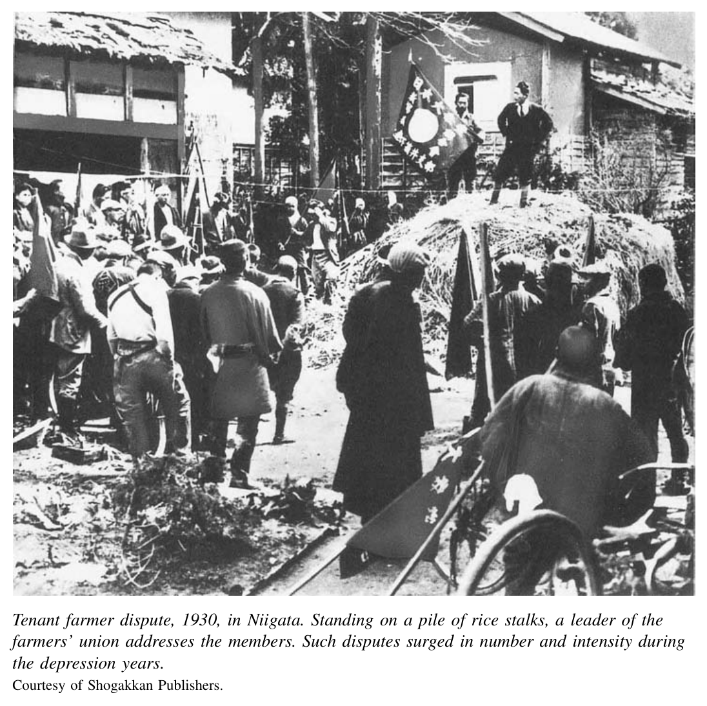
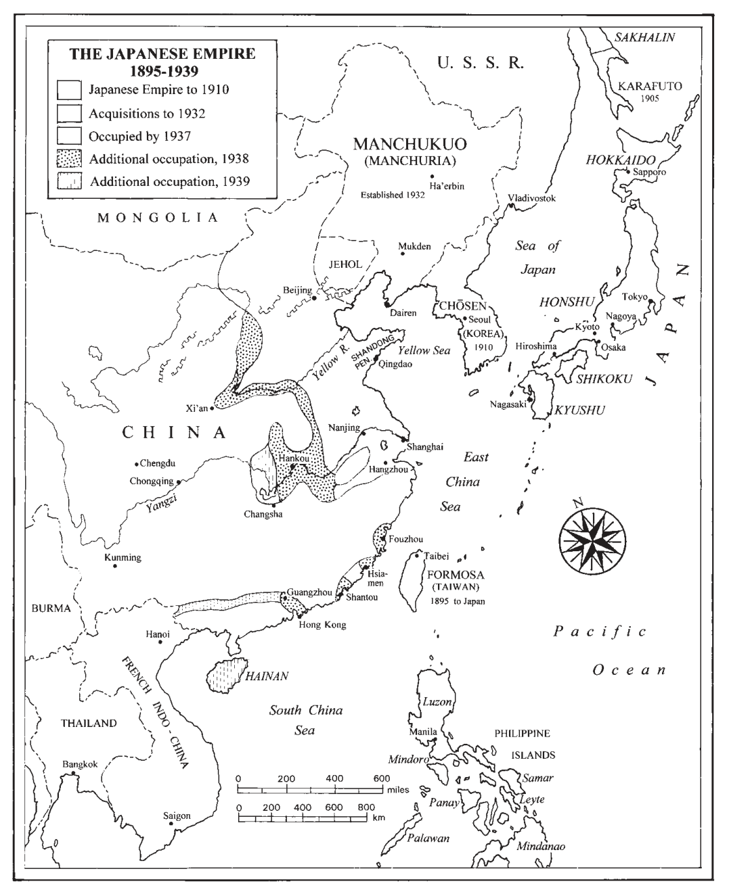
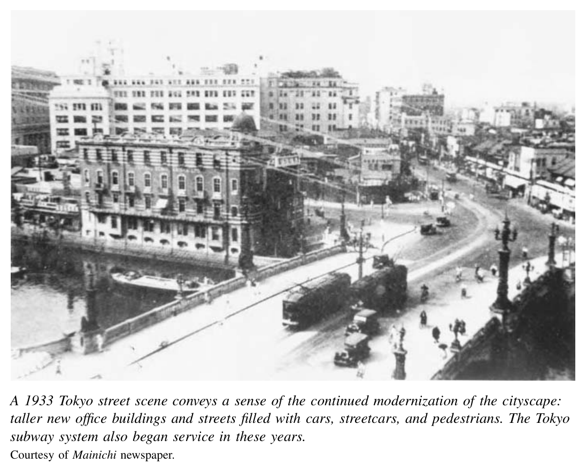
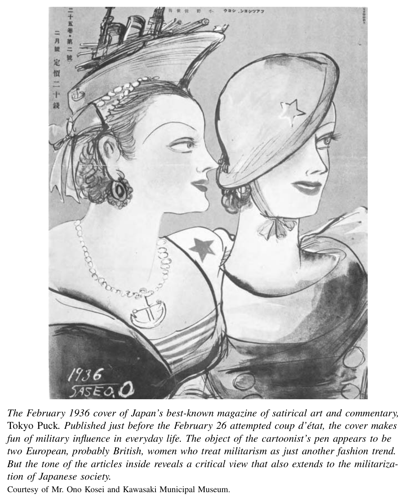
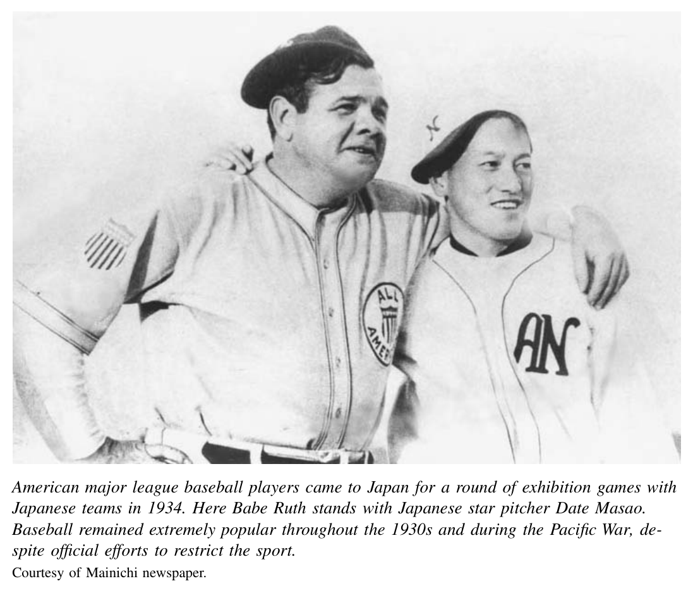

*第三编 帝国日本：从崛起到灰烬*

# 第十一章 萧条危机与应对

*译注：文中政党、机构、人名与专有名词，尽量采用中文史学界常见译法；个别术语在首次出现处酌加说明。为保留原书风格，译文在叙述与分析的节奏上尽量贴近原文。*

自19世纪90年代到20世纪20年代，日本逐渐形成了一种混合性的“帝国民主”政治。这个政治秩序以经现代化改造的天皇制度为支柱；它以英国君主制为参照，又带着几分戒惧与焦虑，为相当程度的多元主义留出了空间。地主与实业家、工厂工人与佃农、女性与男性，都在这种充满对抗与妥协的纷杂政治之中，追求各自的目标。

然而，从1929年至1932年前后开始，一连串冲击——经济萧条、激烈的社会冲突、军事扩张，以及首相和大资本家接连遭刺——改变了日本的政治体制。到20世纪30年代末，独立的政党、商业团体、生产合作社、工会和佃农组织，已被一系列受国家控制的大众组织所取代；这些组织的目标，是为对华“圣战”动员全国，并在国内制造和谐与秩序。一个与德国、意大利法西斯体制颇为相似的新政治秩序已经居于主导地位，并将把日本与亚洲拖入一场灾难性的战争。与此同时，那些在萧条时期、以及以战争动员之名推动的某些变化，却显示出持久性。从国家对经济和社会的政策中，可以辨认出一种跨越战前战后的体制连续性；从日常生活的某些特征中，也能看到一种跨越战前战后的社会延续。

## 经济与社会危机

1929年10月，纽约股市崩盘。随后席卷全球的经济危机，是促成日本政治转向那一连串事件中的关键一环。世界性大萧条，又与日本刚刚启动的一项金融政策不幸相撞，其后果尤具破坏性。1929年7月，滨口雄幸领导的民政党内阁上台，决意实施两项在20年代曾断断续续推行过、旨在振兴停滞经济的政策。第一，通过收缩货币供应、削减政府开支来压低国内物价、刺激出口（即紧缩政策）。第二，通过恢复固定汇率来稳定国际贸易和投资。日本要追随西方列强的做法，按战前汇率恢复金本位——日本和其他列强在第一次世界大战期间都已放弃这一制度。

财政紧缩首先上场。1929年下半年看来似乎颇见成效：批发价格下降了6%。于是，1930年1月，日本如约恢复金本位。可在全球物价一路暴跌之际，这一步却酿成灾难。深重的全球性通货紧缩，抹去了国内降价原本可能带来的好处；固定汇率又阻止了日元进一步贬值，而若能贬值，本可望提振日本出口。〔1〕

此外，日本财阀系银行的做法，在经济算计上固然精明，在政治上却极具破坏性。银行家们很快意识到，政府迟早不得不放弃金本位、让日元贬值。于是，他们大量抛售日元、换取美元。1931年日本果然退出金本位之后，日元对美元的币值迅速腰斩。银行再用手中的美元回购已大幅贬值的日元，转眼之间便把资金翻了一番。这种行为进一步强化了一种广泛流行的看法：资本家及其在政党中的盟友贪婪而自私——在一场令众人陷入贫困的萧条中，他们却靠“出卖国家”大发其财。不仅最初提出此说的那一小圈马克思主义知识分子如此认为，就连更广泛的社会舆论也开始把“日本已经走到体制性的死胡同”视作常识。经济和政治结构似乎都陷入瘫痪；社会失序与道德败坏看上去无处不在。

农民所遭受的危机尤其尖锐。1929年至1931年间，包括稻米和大麦在内的主要农产品平均价格下跌了43%。收入骤降之后，小规模土地所有者无力缴税。许多人试图通过从佃农手中收回土地来增加收入，想依靠家庭劳力耕种这些田地，其中也包括从城市失业返乡的子女。佃农则奋力抵抗被驱逐。土地纠纷的数量激增。

纠纷的性质也发生了变化。20年代大多数佃农与地主之间的斗争，是佃农主动出击，要求减租。如今，佃农转而陷入绝望与防守。围绕驱逐佃户等契约问题的纠纷，在20年代初只占全部纠纷的5%，到萧条年代却已接近50%。佃农常常在自己耕种的地块周围搭起简陋的栅栏，设起纠察线加以保卫。与以往相比，这些纠纷更多地诉诸暴力。

在城市里，萧条不仅威胁工人，也威胁店主与厂主。零售商在顾客因减薪和失业而购买力下降时，纷纷面临破产。1926年至1930年间，东京零售店每年的倒闭率几乎翻了一番。报纸上到处都是小店主趁夜色逃避债主的故事。成千上万的小规模制造业商户也相继倒闭。

许多小商人对既有政党的无能应对深感厌恶，纷纷加入创建新政党的运动。他们把政友会和执政的民政党都斥为“大资本的走狗”。其中一个团体——帝国中产阶级联合同盟——声称：“既成政党背叛了我们，沦为资本家集团的政治走卒，践踏了商业、工业和农业生产者的中产阶级。”若要拯救这个长期受苦的中产阶级——它“在财政上支撑国家

，在保卫国家时又一向坚决”——日本就必须来一场“经济思想上的革命”。这些团体要求推行新的政策，以保障这个纳税者、生产者和出口者构成的“中坚阶级”的“繁荣”。而正是这个阶级，反过来将把日本从“劳资之间的一场血腥战争”中拯救出来。〔2〕

这些发出惊惧呼声的人，确有理由担忧。他们面对的是来自雇员的前所未有的敌意，而后者正遭受失业威胁的急剧加重。一位历史学家的估计认为，1930—1932年间，全国失业人口约占工业劳动力的15%。城市中的失业率可能达到这一数字的两倍，而且无疑超过20%。〔3〕

与那些在夜色中悄然逃债的破产店主不同，失去工作的男女工人并不会悄然退场。和农村斗争一样，劳动争议的数量也达到了空前规模，激烈程度亦前所未有。争议不仅出现在大工厂，也遍及小工厂。参加其中的女性比以往任何时候都多，尤其是在风雨飘摇的纺织业。1930年东京一次罢工集会上，一位女演讲者高声喊道：

就算回到乡下，父母和兄弟也没有足够的饭吃。明知如此，我们还怎么回得去？〔4〕

有组织的工人比过去发动了更持久的斗争，诉诸暴力的频率也更高。某种程度上，这种暴力是经过算计的。工人失业之后，常常就在厂外扎营，要求复工；如果不能复工，就索取相当于半年甚至一年工资的高额遣散费。他们知道，警察最看重的是秩序。一旦他们通过制造事端——例如与厂方警卫发生冲突——把当局拖进来调停，往往就能争得较为有利的折中方案。结果，他们通常能拿到三四个月的遣散费，而不是内务省规定的最低十四天工资。

“烟囱男”的奇招，就是这种策略一个格外富于创意的运用。1930年11月，东京近郊富士纺绩公司的一批纺织工人举行罢工，其中一名年轻工人爬上了工厂烟囱，宣布在罢工得到解决之前决不下来。他这一招高明之处在于：几天之后，天皇将乘坐豪华专列，恰好从他栖身之处脚下经过。警察绝不能允许一个激进工会分子高高在上，从那样的高度俯视天皇的御驾。于是，他们慌忙出面调停，促成了妥协解决；整场戏剧性的事件也被报纸广泛报道。

在另一些场合，爆发的暴力则更少算计，也同样令人震惊。就在那年秋天，东京东洋莫斯林纺织厂因大规模裁员引发争议，数百名年轻女工与社会主义组织者一道，在夜色笼罩的街道上举行夜间游行。她们投石、砸碎电车车窗，并与警察厮打。报纸立刻把这称作“街头战争”。它们用戏剧化的笔调描写这些年轻女工示威者的斗争精神，于是“莫斯林女工”一时声名大噪。

让当局和公众感到震惊的女性，并不只是这些新近变得激进的工厂女工。20年代中期备受瞩目的中产阶级“摩登女郎”，起初因大胆前卫的装束而吸引眼球；到这个十年末，她们那种招摇的生活方式似乎又转向了新的领域。最让社会改良家和国家官员不安的，是大城市中人数迅速膨胀的女招待。她们在各主要城市的咖啡馆和舞厅工作。女招待并非妓女，但她们刻意营造出一种暧昧而挑逗的形象。她们的主要收入来自小费。咖啡馆经理鼓励她们与顾客打情骂俏、卖吻，甚至与中意的常客发生性关系。1929年，全国咖啡馆女招待人数超过5万，已多于持照娼妓。到1936年，警方统计的女招待人数已超过11.1万人。

官僚和公众之所以在某种程度上容忍卖淫，部分是因为他们相信，这既为男性性欲提供了必要出口，又能保护“正经”姑娘和妇女。在他们看来，农村贫家女儿沦为娼妓，是出于经济所迫；她们把收入寄回家中，以尽孝道，应受称赞而非谴责。咖啡馆女招待人数激增，则动摇了这套性与道德秩序背后的社会逻辑。在警察和内务省官员看来，这些女招待追求的是自己的欲望，而不是为家庭奉献。原本应因“公娼”的存在而与性隔离开的中产阶级年轻女性，现在却“放纵自身”，追逐享乐。她们和她们的男性同伴，成了“堕落的摩登男女”。从1929年开始并贯穿整个30年代，官员们陆续发动各种运动，试图压制城市中“红灯与爵士”的世界。他们以从事非法卖淫的罪名逮捕女招待，并禁止学生进入雇用女性服务员的咖啡馆或茶座。〔5〕

大学生的行为，也加剧了萧条时期社会危机感的蔓延。1928年大搜捕中，数百名被怀疑属于共产党的人已经被捕，文部省也解散了东京大学新人会。尽管如此，1930年和1931年，一波学生抗议浪潮仍在几所主要大学爆发。虽然这些抗议既涉及校园问题，也涉及国家政治，但政府当局担心，地下共产主义运动以及更广泛的马克思主义和革命思想吸引力依然强大。文部省深信，国家正面临严重的“学生思想问题”。它大力监控和镇压学生运动，到1934年，学生运动便失去了势头。〔6〕

1930年岁末，著名社会评论家大宅壮一在一篇文章中，精练地概括了日本社会正面临空前危机这一观念。他特别提到了纺织女工走上街头这一景象：

东方第一大活字铸造厂 X 印刷所的监工说，不论铸造多少字模，总有两类字不够用：一类是“女”，一类是“阶级”。尤其前者，最近需求骤增，就算备上一万个，也会不知不觉就用光……这两个字需求的上升，难道不正给1930年的社会面貌添上了最真实的色彩吗……卧室已经移入门厅，移入起居室，最后又移到了街头。〔7〕

尽管当时有此类激烈的言辞，也尽管这些言辞背后确有广泛的社会痛苦与动荡，日本在经济萧条中的实际遭遇，若以失业率或工业产出等统计指标衡量，事实上仍轻于美国。然而，不论在大众之间还是在精英之间，那种危机感都异常深刻，并产生了重大后果。甚至在萧条到来之前，议会政治在民间也只得到相当冷淡的支持。而当这种创伤又与同时发生的国际危机叠加时，萧条时代便在国内外两方面都催生了新的转向。

## 打破僵局：对外的新出路

变局的一大推动力，来自军队中的一批军官及其右翼平民盟友。整个20年代里，军官团内部的年轻人越来越不满于日本的内外政策。他们不满政党所推行的、在他们看来软弱无力的协商外交；对军费与兵力裁减愤愤不平；忧虑中国国民党对日本在满洲和华北霸权的挑战；怨恨军队在国内声望下降。他们把财阀与政党之间的亲密关系，视为资本主义体制的象征；在他们看来，正是这种体制使年轻士兵的家庭陷入贫困，从而削弱了军队。于是，他们以叛乱和擅自行动的方式回应，这些举动极大改变了政治局势。

满洲的关东军便成了这类躁动的一大温床。它设立于1906年，原本是为了守卫日本在1905年日俄战争和约中取得的南满租借地及铁路沿线。*译注：Kwantung 为“关东”的旧式英译。* 到20年代末，关东军已开始通过叛乱式行动和阴谋诡计来执行其任务，而其领导人对这一任务的理解也发生了变化。他们不再把自己的角色仅仅视为保卫日本在满洲利益的武装力量，而是将自己设想为未来日本与西方大战的先锋，并企图在其控制地区打造一种新社会的样板。1928年6月，一名关东军参谋策划炸毁张作霖所乘列车，并把罪责嫁祸给其中国对手。长期以来，日本一直扶持张作霖，希望他成为抵挡南方蒋介石领导的中国国民党的缓冲者。但随着国民党势力增强，张似乎开始转向国民党一边。关东军的阴谋家们希望，刺杀张作霖能够迫使田中义一首相支持更强硬的满洲政策。虽然田中及其政友会比民政党更愿意动用武力来保护日本在华利益，这位首相仍拒绝采取如此激进的一步。然而，当田中发现杀害张作霖的真凶其实就是关东军时，其政府却在皇室方面压力下，不敢公开让军方颜面扫地。政府未对责任者作出严厉惩处，从而开下了一个不祥的先例。昭和天皇裕仁对田中处理此事的方式深感不满，田中遂被迫辞职。

与日本和中国围绕满洲问题日益加深的敌对情绪相并行的，是日本、英国与美国之间围绕海军问题的紧张升级。1922年的华盛顿会议规定，各国应于1930年在伦敦再次会晤，以延长或修订对海军军舰的限制。民政党政府犯下了严重的政治错误，它预先宣布的目标，是把日本海军吨位比例从英美的60%提高到70%，也就是把原来的5∶5∶3提升为10∶10∶7。西方谈判代表直截了当地拒绝了日方的全部要求。尽管如此，滨口在伦敦的谈判代表还是达成了一项折中方案：日本在某些类别的军舰上可以扩大建造能力，但在另一些类别上则不行。

谈判消息传回国内后，报界和海军纷纷将该协定斥为对国家利益的背叛——而这些“国家利益”，恰恰是数月前滨口自己亲自提出过的。随后三年中，反对条约的一派——即所谓“舰队派”——控制了海军。总而言之，这场条约争议削弱了民政党的正当性，也削弱了整个政党政治的正当性。〔8〕

对政治既成秩序的言辞攻击和人身攻击并未停止。从1930年底到1932年，年轻军官与平民盟友联手，制造了一连串令人震惊的暗杀与未遂暗杀。民政党首相滨口雄幸是第一个牺牲者，他于1930年11月遭一名右翼青年枪击，次年8月身亡。1932年2月和3月，前大藏大臣井上准之助以及三井财阀首脑团琢磨，分别被一个名为“血盟团”的极端民族主义平民组织成员刺杀。此外，年轻军官还在1931年3月和10月策划了两次未遂政变，而某些军方高层至少对此持默许态度。

实施这些行动的人，构成了一个横跨帝国各地的秘密研习团体和社团网络，把军官与平民思想家联结在一起。他们认为，政党和资本家精英都是正确政治秩序的敌人；而正确的政治秩序，应当尊重并统一天皇与人民的意志。在这一点上，他们与20世纪初批评明治元勋和官僚、认为后者同样犯下这一罪过的政党领袖，其实遥相呼应。只是他们并未就究竟该由哪些新集团来代表天皇与人民形成共识：有人寄望于军队，有人寄望于作为农业中坚的自耕农，也有人寄望于商工领域的城市中坚阶层。

关东军领导人极大助长了这种思想。他们谋划出一条策略：通过在满洲的大胆行动，来打破对外和对内的僵局。其中关键人物之一，是1929年至1932年间担任关东军作战主任参谋的石原莞尔。石原通过带有强烈个人色彩的佛教与世界史研习，形成了一种近乎末世论的国际局势观。他相信，日本与美国之间终将不可避免地爆发一场“最终战争”。为了让日本能够取胜，他向部下主张，日本必须控制满洲。该地区丰富的矿产资源具有战略价值；而它广阔肥沃的平原，又是日本移民农民的理想去处，既可缓解国内人口压力，也能舒缓农村贫困。此外，石原及其支持者还把满洲视为一处实验室，用以创造一种新的社会秩序；这种秩序将建立在社会平等和对国家的忠诚之上，而非建立在资本主义自私逐利之上。他相信，如果在满洲的试验成功，日后推行到本土，也会增强日本自身的力量。

1931年9月18日，石原的部队采取了大胆而秘密的行动：他们炸毁了南满铁路在重镇奉天（今沈阳）附近的一段铁轨，随即宣称这是中国军队所为。关东军以此为借口，对当地中国地方军队发动了失控般的进攻。

借助这次行动，他们在1931年达成了1928年刺杀张作霖时未能实现的目的。到12月，日本军队已经控制了南满大部分地区。关于东京的军方高层是否事先知道这些计划、若知道又是否予以批准，直到今天仍有争论。可以肯定的是，这场后来被称作“满洲事变”的事件，确实包含了前线军官某种程度上的秘密策划与抗命。同样可以肯定的是，东京的军政领导人都知道关东军内部存在强烈的直接行动倾向，也多少知道他们在谋划行动。因此，他们对当年秋天发生的事，其实并无理由感到意外。

无论此前知情到何种程度，犬养毅和政友会组成的东京政府在事后都反应软弱。犬养本来就比前任民政党首相滨口更同情强硬路线。他抵制军方把满洲正式并入日本殖民地的要求，但允许关东军扶植亲日的中国领导人建立一个傀儡政权。这个政权就是1932年3月成立的“满洲国”。名义上，它是一个独立国家。之所以建立一个“独立”国家而非赤裸裸的殖民地，反映了日本策划者所抱持的泛亚洲解放与反（西方）帝国主义意识形态。但在实际操作中，日本始终牢牢控制着这片被征服的土地。他们把清朝末代皇帝溥仪安置到新造的“满洲皇帝”宝座上。许多历史学家——尤其是日本学者——把1931—1932年的满洲事变视为所谓“十五年战争”的开端，也就是亚洲意义上的第二次世界大战起点。事实上，完全可以有力地主张：正是这次侵略，使此后更大规模的冲突变得不可避免。

尽管关东军占领满洲的导火索，是前线军官的擅自行动，但日本军方高层支持这一亚洲单边扩张的转向。宇垣一成便是其中一例。人们通常认为他是比较温和的军方人物，1927年至1931年间先后在政友会和民政党内阁中担任陆军大臣。随着1930—1931年萧条加深，宇垣也开始相信，日本正面临体制性危机。他谴责左翼和右翼激进派的暴力行为，但与他们一样，也把日本的软弱与混乱归咎于失控的资本主义和民主政治。像许多文官官僚一样，他担心日本社会正走向分裂：一边是大量贫困的无产者和农民，另一边则是少数富有的资本家。从国际上看，他担心“仅限于日本领土的防卫”已经不够。1930年他写道，世界贸易体系正在崩解，在全球市场上的自由竞争已不再可能。只有更积极的对外政策，才能让日本获得市场，从而提高生产率、减少失业，避免“社会悲剧”。〔9〕

军事行动一开始，警察和军方当局便加强了对国内异议的监控与压制。但其实几乎不需要强制手段，就足以为吞并满洲赢得正当性。1931—1932年间，大多数普通日本人，和精英一样，对这些事件都表现出毫不掩饰的欢欣。报纸兴高采烈地报道日军推进；新闻片和广播争相以煽情方式播放最新战况。连一些前左翼人士也改变了调门：既然占领满洲有望减轻失业，那么这就不是资本主义的帝国主义行为，而是惠及整个民族之举。新的流行歌曲、新的歌舞伎剧目，甚至连新的餐馆菜单，也都在庆祝帝国获得了这颗富饶的“皇冠明珠”。〔10〕

就连最为神经紧张的国家官员也稍稍松了一口气。司法省1932年关于“危险思想”的调查，把满洲事变称作社会激烈动荡之际吹来的一阵“神风”。1932年5月，陆军省则认定，这一事件已经以一种新的“团结精神”取代了社会对立。

满洲的占领，是日本外交和内政史上的分水岭。但它远未稳定帝国边疆，反而开启了一个新的扩张时代；它也远未稳定国内政治与社会，反而紧接着引发了又一轮暴力爆发。1932年5月15日，一批年轻海军军官刺杀了76岁的首相兼政友会总裁犬养毅。他们的行动，标志着帝国日本议会政治的终结。

这些阴谋者希望借助暴力促成戒严，并推行“国家改造”政策。他们同时袭击了三菱银行、政友会总部、内务大臣官邸和六座发电站，但这些袭击并没有引发更大规模的叛乱。

尽管如此，他们行动造成的结果，已经近乎一次政变。暗杀发生后，军方与首席元老西园寺公望之间，就新首相和新内阁人选展开了紧张谈判。军方领导人中，有一些军官数年来一直定期会晤，倡导在满洲扩张、在国内改革等相关纲领。他们宣称：“像暗杀这样的激进行为，其根本原因在于政治、经济及其他社会问题，必须加以彻底改造，方能解决。”〔11〕 为推进改革事业，并扶植那些可能约束年轻叛乱军官的领导者，他们拒绝让尽管仍在议会中占多数的政友会来组织新内阁。5月26日，海军大将斋藤实出任首相，组成“国民统一”内阁；十五名阁员中，只有五人出身政党，其余十人均为军界和官僚高层。

接下来的几年里，这批领导人并未认真恢复军中纪律，更未真正扭转日本对外扩张的方向。一种不断升级的逻辑，推动着日本战略继续前行。政府领导人把西方和中国对日本在满洲新利益的挑战，向公众包装成日本必须进一步向中国扩张的理由。1933年2月，国际联盟通过了此前数月拟定的《李顿调查团报告》，其中谴责“满洲国”是一个不合法的傀儡政权，并呼吁召开多边会议，对该地区实行非军事化。日本外交官则高声反击，把日本塑造成敌意世界舆论舞台上的殉道者。1933年3月，日本退出国际联盟。

在“满洲国”南部边界上，与中国军队的冲突仍在继续，关东军则步步推进。到1933年5月，它又吞并了热河省，并将其并入“满洲国”。这样一来，日本的这个事实上的殖民地已经一路延伸到长城脚下，距离北平仅四十英里。接下来的两年中，在东京内阁支持下，日本军队利用边境冲突和反日活动作为借口，一点一点蚕食中国国民政府对华北腹地的控制。1935年6月，关东军迫使国民政府从长城以南地区撤出全部军队，其中包括北京和天津等关键城市。11月，日本又扶植一名中国军阀建立傀儡政权，以统治这一战略地区，进一步削弱了国民政府的控制。这些行动，为中国境内更大规模的冲突铺平了道路。

这些行动也加剧了与西方列强的紧张。英国和美国都支持国际联盟谴责日本占领满洲。虽然部分美国企业希望与日本合作开发这一地区，但美国政府始终拒绝承认“满洲国”。与此同时，日本海军对1930年续订的日、美、英三国海军军备限制也日益不满。日本政府于1934年12月废除了这项协定。次年12月在伦敦召开的三国紧急会议，也未能挽救它。日本政府随即批准大规模扩充海军，并同时决定建立一种既能“北守”（苏联、美国、中国）又能“南进”（东南亚）的军事力量。

在为新的满洲国家制定政策的同时，日本统治者也调整了对旧殖民地朝鲜和台湾的战略。他们已不再认为，只求地方稳定和地方利润就已足够。相反，他们把这些殖民地重新界定为可以动员人力与物力、以支撑帝国扩张的基地。1931年起，宇垣一成出任

朝鲜总督，推行了雄心勃勃而又严酷的经济与社会政策。在农业领域，殖民政权强迫农民种植棉花、饲养绵羊，以便为日本工业提供原料，而不是为当地人口提供粮食。宇垣政权还鼓励日本企业家投资战略矿石和金属开采、电力生产、化学品（尤其是炸药）和肥料制造，以及钢铁生产。一些朝鲜企业家也得以创办盈利企业。但无论企业归谁所有，多数工业都依赖朝鲜廉价劳动力，把产品和资源输送给日本自身日益军事化的经济。为了动员人力资源，宇垣进一步推进学校中的民族同化政策，而且强制性日益增强。他扩大日语必修教育，严格限制学校中韩语的教授；到30年代末，韩语已被彻底禁止。

殖民统治者在台湾的战略视角也发生了同样变化。1936年，台湾总督府设立了半官半民的台湾拓殖公司，最初主要是为促进岛上甘蔗生产并向日本出口。到30年代后期，这家早已成为台湾最大企业的公司，又把使命重新界定为：除台湾本岛外，还要向中国沿海邻近省份以及更南方的岛屿推进工业投资。与此同时，殖民当局也镇压了20年代尚且被容忍的台湾自治运动。

这种面向战略目标、由国家支持的投资计划，与日本在“满洲国”推行的经济战略彼此呼应。1932年至1936年间，“满洲国”政府在采矿、航运、飞机制造等26个关键行业中，各建立起一家垄断性公司，由国家与日本民间资本共同投资。东京政府深信，世界正分裂成彼此敌对的武装阵营，因此把各殖民地，尤其是“满洲国”，都视为一个自给自足贸易集团的一部分。无论军方还是文官官僚，都倾向于把自由市场资本主义看作既浪费又不道德；他们首先把满洲国家视为一间实验室，用来摸索一种由国家主导的经济发展战略。

## 走向新的社会与经济秩序

满洲侵略，与日本国内经济的剧烈变化同时发生，并且在一定程度上正是其诱因。1931年至1934年间，日本工业产出增长了82%，经济复苏速度远快于西方各国。1930年至1936年间，对帝国外部世界的出口量几乎翻了一番。日本不仅成为世界最大的棉织品出口国；其出口品类也大为多样化，从玩具、轮胎到自行车、简易电器，纷纷进入美国百货商店和亚洲各地市场。总计起来，1930年至1936年间，日本经济大约增长了50%。1937年，日本最重要的经济学家之一有泽广巳将30年代称作“经济奇迹”的时代。到1938年，雇主们反而开始抱怨劳动力短缺，工资也明显上涨。

这一经济飞跃有两方面原因。首先，是大藏大臣高桥是清让日本退出金本位，导致日元大幅贬值。1931年末，一美元还能兑换约两日元；一年之后，同样一美元就可以买到五日元的日本商品。结果，日本出口打开了新市场；与此同时，也招来了愤怒的批评。美国和欧洲的竞争者谴责日本搞“社会性倾销”——他们不把出口激增归因于汇率，而是归因于对工人的低工资剥削。许多国家于是提高关税，或对日本商品实行配额限制。在许多日本人看来，这种指责恰恰证明了军方领导人早已反复宣扬的一点：在一个敌意环伺的世界里，日本必须开辟一个自给自足的帝国经济圈。

第二个原因，是日本出于现实需要，相当超前地摸索出了后来所谓的凯恩斯主义经济政策。1936年，英国著名经济学家约翰·梅纳德·凯恩斯发表《就业、利息和货币通论》，主张财政赤字支出可以为萧条经济“启动水泵”，重新带来增长。早在那本书问世四年前，高桥是清就已经在没有读到《通论》的情况下实行了类似政策。〔12〕 他批准通过发行赤字公债来支付在满洲扩张帝国所需的额外开支。正如凯恩斯不久之后所预言的那样，这些所谓“红字公债”确实起到了刺激经济的作用。政府支出尤其惠及重工业和化学工业，这些行业不仅生产军备，也支撑朝鲜和满洲的大型建设项目。于是，这些生产资料工业的扩张，甚至快于因日元贬值而受益的消费品制造业。〔13〕 到1937年，军费已占中央政府总支出的惊人四分之三，而在1930年，这一比例还大致只有三分之一。

这些经济进展始终笼罩在官方所谓“非常时期”的阴影之下。西方列强一面筑起关税壁垒，一面谴责日本占领满洲；中国方面又抵制日本商品；在这种局面下，“国家面临空前危机”的信念，为各式各样的新计划提供了正当性，也改变了国家与社会之间的关系。

在经济领域，萧条与复苏这几年，见证了日本后来被称作“产业政策”的东西的诞生。国家更加积极介入、协调经济活动，这是跨越战前战后的政治经济体制中的核心一环。20年代后期起，商工省的一批官僚便开始拟订计划，希望以他们认为更“合理”的方式组织经济活动。这个部门成立于1925年，是从原有的农商省中分设出来的，目的在于让政府更集中地关注工业经济。1930年，商工省又成立产业合理化局，其使命是通过推动托拉斯和卡特尔，来减少自由竞争所造成的浪费。该局迈出的第一大步，是起草《重要产业统制法》，并于1931年由议会通过。该法使行业性卡特尔合法化，这些卡特尔可以统一决定成员的产量、价格、市场份额以及行业准入条件。几年之内，煤矿、电力、造船、纺织等行业里，已建立起二十六个卡特尔。

对自由市场的深层不信任，推动着这些改革不断前行。日本国家官员——无论文官还是军人——长期以来都担心，不受约束的逐利行为会把投资引向对财阀有利却不符合“国家利益”的方向。比如，国家也许需要在农村修建发电站，但如果农村消费者贫穷，资本家就不会去建。世界性大萧条仿佛证实了官僚最糟糕的担忧：未经改革的资本主义，不仅在经济上低效，在社会上也有害。但与此同时，官员们既不愿意，也没有能力，以全面国家控制来取代私人部门。他们正在摸索一种介于苏联那种严格计划、国家经营的社会主义，与美国和英国那种放任自由的经济自由主义之间的经济政策模式；这种模式将持续贯穿战争时期，并一直延伸到战后很久。

通过30年代初的新政策，国家官员试图更谨慎、更集中地统筹经济决策。但他们讽刺性地发现：由于自己扶植的是由最大企业控制的卡特尔，指挥棒反而仍掌握在财阀首脑手中。于是，政府开始更直接地干预。1936年，在强烈的工商界和政党反对声中，掌控内阁的官僚与将领们推动通过了一项电力国有化法律。1937年，军方与官僚又开始制定五年计划，瞄准特定产业的增长，并将资本引导到这些方向。同年，数个既有机构被合并为一个超级部门——企划院。正如一位学者所说，这批官僚构成了日本的“经济总参谋部”。此时，他们正与军方总参谋部及财阀工业巨头紧密合作，尽管后者仍继续抵制国家对企业过于深入的监管。〔14〕

军方还扶植了若干新的企业集团，尤其是在满洲开发问题上，希望借此培植私人部门中更听命于自己的盟友。这些集团被称为“新财阀”，主要集中于重工业和化学工业。它们大大受益于军需，其中一些企业，如 Chisso Chemical Fertilizer 和昭和电工，后来成长为行业巨头，并挺过了战争。新财阀在朝鲜尤其占优势。但它们并没有自己的银行；事实上，在整个30年代，满洲最主要的直接投资来源，仍是那些既有的老财阀。于是，新旧产业资本家都在军旗指引下，紧密配合军方和文官官僚，把生意扩展到了满洲。

国家触角也以前所未有的方式伸入农村社会。与产业政策一样，萧条是农业新政策的主要催化剂；而政府重新组织农村社会的关切，也将贯穿整个战争时期并延续到战后。1929年至30年代初，随着农产品价格崩跌，无论佃农还是小土地所有者，都不得不举债缴纳地租或税款。1932年，政府估计农村债务总额已相当于国民生产总值的三分之一。内阁于是大幅增加农村公共工程支出，以创造就业；政府还通过提供紧急贷款和帮助农民重新安排债务等立法，推动债务纾困。值得注意的是，这些国家项目不仅帮助地主，也试图援助包括佃农在内的中等农户，而长期以来，地主的政治权势和社会威望一直支配着村庄生活。

这些措施背后的正当化话语，是一种农业民族主义：它把日本国家的强盛等同于和谐而团结的乡村。崇农思想家把农村危机归咎于城市和不受约束的资本主义。1932年刺杀首相犬养毅的年轻军官，正是受这类观念激励。它也促使农林省作出新的努力，试图超越公共工程和债务救助。1932年起，该省集中资源推进“经济更生运动”，强调必须恢复日本农村的合作精神，并指责从城市中心扩散出来的西式个人主义侵蚀了农村团结。农业主义的言辞不再强调阶级冲突，而转向强调城乡分裂。为了强化乡村，更生运动提出了多种举措，如建立产业合作社、推广作物多样化、引入成本核算技术，以及推行长期性的社区规划。运动领导者，无论中央还是地方，都责备农民仍按“凶日”“凶方”之类迷信来作决策；他们转而呼吁实行更理性、更科学的农场经营。成千上万个村庄参加了这场运动，政府还刻意选出“模范村”加以宣传，供其他地方效法。〔15〕

在振兴农村的努力中，一面高唱传统主义的乡村团结，一面又采用更科学的农业经营和生活管理手段，这种并置颇为醒目。它与此前数十年的社会改良计划遥相呼应。和20年代一样，乡村改革者这一次也特别向女性寄予期望，并许诺她们新的角色。女性被勉励去改良厨房设计和卫生条件，把日常生活组织得更有效率、更科学。这些责任事实上使她们在社区中获得了相当重要的公共角色。许多女性也热情回应了这些运动。

无论在工业政策还是农业政策中，国家似乎都在日益收紧对社会的控制。但这种印象其实有几分误导。官僚仍把相当大的权力留在财阀业主手中，而乡村中的地方领袖也保有很大自主性。经济更生运动的领导者中，既有小土地所有者，也有大地主；既有男性，也有女性。国家只是扩展了自身关切和活动的范围，而至少到30年代中期，它主要仍是既有社会组织行动的协调者，而不是一个独裁的命令中心。

不过，在社会事务中，官方之手变得更为可见，也有一些迹象已十分明确。这一点在政府对劳工问题的态度转变上表现得尤为明显。20年代时，内务省和民政党都曾把工会视为可能带来稳定的力量。30年代初期，内务省仍容忍工会存在，尤其是在总同盟采纳了一份适应“非常时期”的新纲领之后：它否认罢工，承诺通过劳资合作来提高产量、改善劳动条件。但政府很快改变了看法，开始以另一种方式来维持秩序，并动员劳动者为国家服务。

1936年底，陆军担心军工厂里会形成由工会与无产阶级政党组成的“反法西斯统一战线”，于是强迫八千名兵工厂工人退出总同盟所属的官业工会。军方要人与官僚随后拟定了一套“非工会式”的劳资和平和增产方案；到1937年，他们决定在全国所有工作场所建立“协议会”网络。这些机构由工人代表和管理者代表组成，意在通过合作预防冲突。这样的方案明显借鉴了法西斯模式，例如1934年纳粹《国家劳动组织法》在二十人以上的所有工厂内设立“信托委员会”。虽然日本方面有意淡化其对德国模式的借鉴，但两套制度都追求一个无阶级的民族共同体，也都以普遍设立的工厂咨询机构来取代工会。两者都大谈一种工业“职场共同体”的有机和谐与统一，而这一共同体又建立在被神话化了的乡村、民众或家庭模型之上。日本这些劳资和平的鼓吹者，既反对自由主义，也反对阶级斗争。他们肯定一种真正意义上的“共同体式”企业观；这一观念会贯穿战时，并在战后继续回响。企业被看作一种共同体，其成员在天皇面前一律平等，也都拥有同样有价值的职责。那个时代最爱用的比喻之一，是把劳资双方比作鸟之双翼。经过数年的筹划，1938年7月，政府成立“产业报国会”，在全国推动这类协议会。

## 走向新的政治秩序

与其在经济和社会领域角色扩张相并行，国家也开始更严密地控制政治生活。这一转变的一个标志，就是席卷全国的“选举肃正运动”。自1935年起，内务省主导这一运动，旨在消除官场上的腐败——比如官僚偏袒某政党的候选人——以及政党方面的腐败——比如买票。这一运动一方面大张旗鼓地宣传“肃正选举”，另一方面又加强警方对选举的监控。到1937年，这场“肃正”已不仅仅停留在相对中性的监督层面。内务省开始更直接地介入，以确保各党候选人都能动员民意来支持国家目标。用内务大臣的话说，“在立宪政治之下，人民有一项重大责任，那就是以自己投下的一票来辅弼皇治……”〔16〕 警察经常打断竞选演说，以防任何言论把人民置于军队或官僚的对立面。凡是批评“法西斯主义”或者哪怕只是提到“军民之间有鸿沟”的演说者，都必定会被警告，甚至被当场制止。

这些肃正运动，并没有使日本选民在选举中抛弃主流政党。例如，妇女团体一方面大力支持肃正运动，另一方面又继续支持主流政党。整个30年代，民政党和政友会在全国选举中的得票和议席合计从未低于90%。即便如此，政党的影响力仍在衰退。到30年代中期，投票率已明显下降；在城市选区，合格选民去投票的比例低至60%。与1910年代和1920年代不同，此时几乎已听不到为“正常”的立宪政治辩护的声音。即便选举产生了强有力的政党多数，也没有人为非政党内阁执政而举行集会抗议。1932年至1937年间，在五位无党籍首相统治之下，内阁中军人和官僚越来越多，而职业政治家越来越少。斋藤实这个“非常时期”第一个非政党内阁，还让三分之一的阁位由政党人士占据；但海军大将冈田启介（1934—1936）和职业外交官广田弘毅（1936—1937）的内阁中，政党出身者分别只剩五人与四人。等到林铣十郎（1937）和近卫文麿（1937—1939）的内阁成立时，来自议会的阁员已只剩一人和两人。

随着军人与官僚在国家权力顶端巩固地位，他们几乎没有必要再通过逮捕或暴力等激烈手段来恐吓政党领袖。大多数政治家对外扩张，无论在事前还是事后，基本都予以支持。他们试图通过与新统治者合作，而不是抵抗，来保住自己的职位，并维护其支持者——尤其是财阀首脑和地主——的利益。就这一点而言，他们做得相当成功。主流政党设法拖延或削弱了不少军方提案，例如某些会损害企业自治的战略产业国有化计划。主流政党固然处于守势，但仍然赢得选举，仍然在官僚、军方与各自组织化支持者之间扮演中介角色。它们失去了执政权，却并非全然无力。

30年代政治中的一个新趋势，是出现了一个声称代表下层民众的统一政党。1932年，安部矶雄、麻生久等社会主义领袖创建了社会大众党。它把随着1925年普选而出现的那些规模不大、彼此竞争的“无产阶级政党”中的大多数联合起来。到1936—1937年间，它在地方选举和国政选举中都赢得了相当可观的支持。1936年，它向议会送入18名议员；1937年选举中，又赢得37个席位和9%的选票。在1937年若干关键的多议席城市选区中，社会大众党候选人甚至以超过20%的高得票率名列第一。

1937年选举后，民政党和政友会都未能取得议会多数，社会大众党因此握有一个可能决定胜负的“摇摆集团”地位，本可以借此与两大党之一结成联合内阁。然而，它却转而更加靠近执政的军方。这种趋同的基础，在于双方都对资本主义和既成政党的“自私”逐利深怀不信任。社会大众党试图“骑上威权统治这只虎”，以便为大众争取利益。它主张地方层面的改革，如房租管制、降低公用事业收费，也主张全国层面的措施，如健康保险、养老金和保护劳动者的法律。它把这套纲领表述为“使民众富足，以成全国防”。〔17〕 社会大众党还接受这样一种前提：日本控制满洲，乃至后来控制整个中国，都是为了在反西方的斗争中实现民族自决。

30年代政治最关键的特征，是军内部持续不断的动荡，以及陆军对官僚、宫廷和政党的影响力不断上升。这两种趋势彼此相关。之所以逐渐放弃政党内阁，一个原因就在于元老们相信：只有军方领导人才能压住军中的激进“少壮派”。从20年代后期到1936年，军队中最激进的一批人，大都汇聚于皇道派。这个派系中的军官及其部分平民同情者，不仅想铲除政党和财阀的影响，也想消灭那些主张维持现状的元老和宫廷人物。他们强调精神教育和对天皇的忠诚，认为这是国家强盛的基础。这一派中的年轻行动者，在荒木贞夫等高层人物那里获得了支持，尤其是在荒木于1932年至1934年出任陆军大臣期间。

皇道派同情者制造了许多恐怖行动，从1930—1932年间对政治领袖和企业领袖的暗杀，到刺杀军内反对者，不一而足。由于在高层也有靠山，这些刺客有时甚至被允许利用法庭证言作为宣传自己“纯洁动机”和“崇高理想”的舞台。这类“样板审判”往往赢得有利的报刊舆论和公众同情。一个臭名昭著的例子，是1935年相泽三郎的审判。相泽是皇道派中的一名年轻军官，他枪杀了陆军中一位位高权重的计划派人物永田铁山。相泽之所以愤怒，是因为他所追随的领袖荒木贞夫，刚刚被一批更重视经济和物质现代化、而不是精神教育的军官挤到一边。

永田被视为皇道派宿敌——统制派——的代表。这个派系的成员通常资历更老，其中包括东条英机等将领。他们偏好与既有精英合作；他们不赞成恐怖暴力，但在其他方面绝非温和。他们希望把权力集中到军方手中，并把整个社会动员起来，为即将到来的总体战做准备。

两派冲突最终在战前时代最令人震惊的一场政治动乱中达到顶点。1936年2月26日清晨，大雪中的东京，约一千五百名忠于皇道派领袖、如荒木贞夫等人的陆军部队，占领了东京市中心。他们派出小队刺杀内阁多数成员、前首相斋藤实，以及军界和宫中顾问中的反对者；同时要求元老们任命一位同情他们的新首相及其他新领导人。他们模糊的计划，号称要实现“昭和维新”——这个措辞显然是刻意模仿“明治维新”，以暗示其政治抱负。他们希望通过尊皇、保卫帝国和改善平民处境，来恢复日本的荣光。

首相冈田启介靠躲进家中储物间才逃过一劫。叛军误把他的妹夫当成冈田本人并加以杀害。他们还杀死了斋藤实、高桥是清——这位德高望重的政界元老、时任大藏大臣——以及陆军教育总监。但尽管在高层也有一些支持，他们更大的计划仍然在天皇的严厉谴责和命令投降之下土崩瓦解。这一次，再没有供刺客“表演”的公开审判。十九名主谋很快被秘密审判并处决。虽然政变失败了，陆军却比以往任何时候都更加强大。其领导层终于下定决心，清洗军中那些热衷暗杀的激进分子。官僚和文职政治家都被这场兵变吓坏了，于是欢迎一个更有纪律的军队所作出的承诺。

在这种国内权力格局变化，以及与中国和西方紧张关系不断升级的背景下，30年代的军政统治者对可接受思想的限制也日益严苛。共产主义和马克思主义一直为日本精英所憎恶。除了20年代末对共产党政治活动家的大搜捕之外，左翼文学人物也遭到打击。1933年，富有感染力的无产阶级文学作家小林多喜二被虐杀于狱中；而他的作品原本很有可能超越这一常显生硬的文学类型之局限。〔18〕

到30年代中期，即便是此前广获支持、相当保守的思想，也开始受到攻击。最著名的一例发生在1935年，目标是东京帝国大学广受尊敬的法学者美浓部达吉。他的“天皇机关说”认为，既然天皇的角色由宪法规定，那么天皇就是国家结构中的一个机关，而不是一个凌驾于国家内外之上的神圣合法性源泉。几十年来，这种解释一直在帝国大学这样的精英高等学府中讲授，几乎没有遭到严重异议。但在30年代这个“危机时代”的高压政治气候中，一批与皇道派有关的学者和军人却斥责美浓部为“叛逆书籍”的作者。1935年，这场风波在贵族院达到高潮，一名议员甚至痛骂他是“学界无赖”。〔19〕

贵族院与众议院都对美浓部作出了谴责决议。他被控犯有“大不敬罪”，罪名是诽谤天皇。虽然美浓部最终并未因此获罪，但他有数部著作因“有悖国体真义”而被禁，他本人也在骚扰和压力之下辞去了贵族院议员职务。

越来越不宽容的政治气候中，其他受害者也远非激进人物，例如泷川幸辰和河合荣治郎。两人都只是大学教授。泷川因其自由主义观点，在1932年遭右翼思想家攻击；次年，文部大臣迫于压力，逼他辞去京都帝国大学的教职。河合则是英国自由主义哲学的信徒，1938年因触犯出版法、输入“危险”的西方思想而遭起诉。此外，那些在20年代就已遭受打压的新宗教，在这一时期更是受到空前迫害。大本教于1934年、天理教于1938年、耶和华见证人于1940年，先后被控以各种罪名并遭解散。〔20〕

20年代那种暧昧的民主观念，曾把立宪政体和人民参与视为拥护天皇与帝国的手段；30年代的新正统却把天皇抬升为超越一切的存在。1937年，文部省向整个学校体系颁布了一份著名纲领，题为《国体之本义》。*译注：战前日本所谓“国体”，大体指以天皇为中心的国家根本秩序。* 它把日本的社会与思想危机归咎于各种西方信念，从个人主义一直到共产主义。作为替代，它断言，“奉侍天皇、并以天皇之圣意为己意”，应当成为社会生活与道德的根本原则。它把忠诚与军人精神奉为国家的核心价值，又把等级分明的家族制度奉为国家的核心制度。

通过这些不同方式，审查与僵硬正统的阴影，逐渐笼罩了政治生活。所谓日本传统美德被极端地颂扬。但必须看到，即使在1937年全面侵华战争爆发之后，普通日本人的社会生活与物质生活在许多方面仍然本质上是现代的，而且相当乐于接受西方影响。某些情形下，国家与既有组织合作，例如由财阀主导的商业联合会或农村互助组织；另一些情形下，它又扶植新的组织，例如产业报国会和国防妇人会。但无论是哪种情形，它都在继续一种现代性的努力：把社会组织成一个个分工明确的功能性群体。

物质文化的机械化也在持续推进，尤其是在中产阶级家庭之中。城市里的美发店越来越多，

为成千上万中产女性提供“烫发”（permanent）。到1939年，仅东京一地便有约850家这类美发店。许多企业和不少私人住宅都安装了电话；全国电话用户从1926年的55万增加到1937年的98.2万，几乎翻了一番。城市街道上开始出现越来越多的公共汽车和出租车，少数私人汽车与自行车、有轨电车和行人一同争道。1927年，日本第一条地铁在东京隆重开通；1933年，大阪第一条地铁也开始运营。到1939年，东京已有三条地铁线蜿蜒于主要商业与购物区地下。

大众文化仍然活跃而繁盛。收音机成为中产生活的固定用品。1932年，城市家庭中拥有收音机者多达26%，虽然农村能收听广播的家庭还不到5%。到1941年，全国有660万台收音机，把新闻和娱乐节目送入日本45%以上的家庭。〔21〕 广播和留声机一道，推动了爵士乐、西洋古典音乐、日本流行歌曲以及军歌的普及。小津安二郎等才华横溢的电影导演，开始拍出以普通人生活为题材的卖座影片；其他导演则继续推出大受欢迎的武士剑戟片。好莱坞影片吸引的人群并不逊于本土作品，甚至往往有过之而无不及。1932年5月，查理·卓别林访日，引起了巨大的公众兴趣，尽管这一访问恰与犬养毅遇刺同时发生。1934年，日本第一批职业棒球队开始比赛。也就在这一年，贝比·鲁斯率领美国球队展开一个月巡回，在12个大城市进行了18场表演赛，数以千计的人涌去观看。东京神宫球场第一场比赛即吸引了满场的6.5万名观众。由此不难看出，许多人对道学式谴责西方文化的声音，不过报以淡淡附和，甚至冷然置之。

总的说来，日本30年代确实见证了“传统主义”的兴起。所谓传统主义，是指一种被大声宣扬的信念：日本那些历久弥新的、最具“日本性”的做法和理想，理应成为道德与行动的准绳。然而，这并不意味着日本真的退回到一个更早的“传统社会”。

大众文化仍然是世界性的、活跃的；物质文化也持续吸纳全球新潮流。甚至30年代新占主导地位的政治力量，本身也是明治革命的一部分。一个经改造的天皇制度、一支自负而择优的官僚体系——它以管理社会为己任——以及一支技术先进而高效的军队，自19世纪80年代以来就一直是这个现代国家的标志。

看到这些延续性，并不等于否认变化。暗杀政治、压制与军官—官僚统治、尖刻而狭窄的文化正统，以及在大陆上的单边扩张，所有这些力量累积起来，已经使日本现代经验的性质发生了剧烈转变。而这一转变，将给数以百万计的人带来悲剧性后果。

那么，我们是否应把30年代概括为一个“日本法西斯主义正在兴起的时代”？我的回答是：可以，尽管也有其他历史学家持不同意见。但在思考这一时期历史时，我们不必被定义上的纠葛缠住。把30年代的日本政治秩序叫作“法西斯”还是“军国主义”，并不是最重要的；更重要的是看清，日本政治与文化生活的动力机制和最终结果，与欧洲法西斯国家的经验有许多共通之处。

在德国、意大利和日本的经验中，我们可以看到第二代现代化国家的一种共同回应。欧洲法西斯模式启发了30年代日本的统治者。三国统治者都有一个共同目标：把一个被神圣化的民族共同体——无论是“民族共同体”（Volk）还是“大和民族”——的全部活力，导向对军事霸权、封闭型经济帝国，以及反民主、等级化的国内政治、文化与经济秩序的追求。日本和意大利的统治者，甚至在较小程度上还有希特勒本人，也都面临同样的局限：他们最终都没能把现存的、多元的政治经济权力基础彻底熔铸成一个真正意义上的极权体制。

当然，这些国家之间也存在重要差异。日本从未出现一个法西斯政党上台执政；也没有任何一位人物，在魅力和长期统治力上足以与希特勒或墨索里尼相比。但产生这些政权的历史过程，确实有许多相似之处。它们都经历了经济危机、左右两极尖锐分化、工业工厂和农村社会中的剧烈冲突，以及致命的右翼恐怖。在每一种情形下，知识界和政治精英中都滋长出一种认知：国家正被某种文化性病症所困扰。人们普遍担忧既有性别角色正在崩解。无论精英还是大众，也都相信盎格鲁—美利坚力量阻碍了本国理应享有的帝国扩张抱负。30年代日本所面对的问题，归根结底并不是一种铁板一块的同质社会，或某种封建社会及其信念的残余；它真正面对的，是如何处理现代社会的多样性与紧张关系。这个国家对这些问题所作的回应，把它引向了战争的灾难，也在战后激起了对法西斯主义和军国主义的深刻反感。但与此同时，政治与经济上的改革和动员计划，也推动了工业、农业和社会政策方面那些跨越战前战后的持久变化。

## 注释

〔1〕 关于这些年份日本经济政策的详细讨论，参见 Hugh T. Patrick, “The Economic Muddle of the 1920s,” in *Dilemmas of Growth in Prewar Japan*, ed. James Morley (Princeton, N.J.: Princeton University Press, 1971), pp. 252–55.

〔2〕 这些引文见 Eguchi Keiichi, *Toshi shōborujoa undō shi no kenkyū* (Tokyo: Miraisha, 1976), pp. 418–19, 430–31, 438–39.

〔3〕 参见 Sumiya Mikio, *Shōwa kyōkō* (Tokyo: Yūhikaku, 1974).

〔4〕 Suzuki Yūko, *Jokō to rōdō sōgi* (Tokyo: Renga shobō shinsha, 1989), pp. 16–17.

〔5〕 关于这些引文以及这一问题的更多讨论，参见 Sheldon Garon, *Molding Japanese Minds: The State in Everyday Life* (Princeton, N.J.: Princeton University Press, 1997), pp. 106–111.

〔6〕 Henry D. Smith, *Japan’s First Student Radicals* (Cambridge: Harvard University Press, 1972), pp. 199–230.

〔7〕 Ōya Sōichi, “1930 nen no kao,” *Chūō kōron* (December 1930): 303–4.

〔8〕 关于这一事件，参见 Stephen Pelz, *Race to Pearl Harbor: The Failure of the Second London Naval Conference and the Onset of World War II* (Cambridge: Harvard University Press, 1974).

〔9〕 参见 Ugaki Kazushige, *Ugaki Kazushige Nikki*, vol. 1 (Tokyo: Misuzu Shobō, 1968), pp. 747, 758–60, 766–67, 782–83；以及 Andrew Gordon, *Labor and Imperial Democracy* (Berkeley, Calif.: University of California Press, 1991), pp. 266–67.

〔10〕 Louise Young, *Japan’s Total Empire* (Berkeley: University of California Press, 1998), pp. 55–114，尤其是其中关于 “War Fever” 的章节。

〔11〕 “Suzuki Teiichi nikki: Shōwa 8 nen,” *Shigaku zasshi* (January 1978): 87, No. 1, p. 93.

〔12〕 不过，凯恩斯在更早发表的作品中，其实已经提出了若干核心思想；高桥是清有可能接触过这些论述。

〔13〕 William Lockwood, *The Economic Development of Japan* (Princeton, N.J.: Princeton University Press, 1968), pp. 64–77，对这一时期的经济趋势作了详细综述。

〔14〕 Chalmers Johnson, *MITI and the Economic Miracle* (Stanford, Calif.: Stanford University Press, 1982).

〔15〕 关于农业政策及其影响，参见 Kerry Smith, *A Time of Crisis: Japan, the Great Depression, and Rural Revitalization* (Cambridge: Harvard Asia Center, 2001).

〔16〕 Susan Beth Weiner, “Bureaucracy and Politics in the 1930s: The Career of Gotō Fumio” (Ph.D. diss., Harvard University, 1984), p. 144.

〔17〕 Gordon, *Labor and Imperial Democracy*, pp. 310–15.

〔18〕 小林多喜二有两部作品有英译本，见 Takiji Kobayashi, *The Factory Ship and the Absentee Landlord* (Seattle: University of Washington Press, 1973).

〔19〕 Frank O. Miller, *Minobe Tatsukichi: Interpreter of Constitutionalism in Japan* (Berkeley: University of California Press, 1965), pp. 217–18.

〔20〕 Garon, *Molding Japanese Minds*, pp. 61, 70–76.

〔21〕 Gregory J. Kasza, *The State and the Mass Media in Japan: 1918–1945* (Berkeley: University of California Press, 1988), pp. 88, 252–53.
