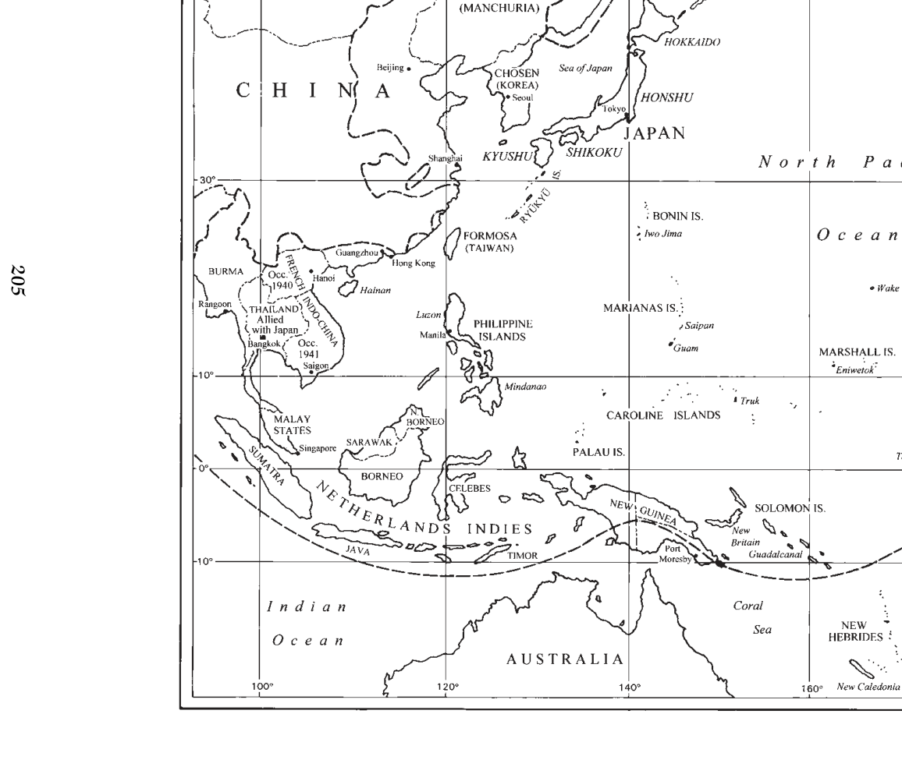
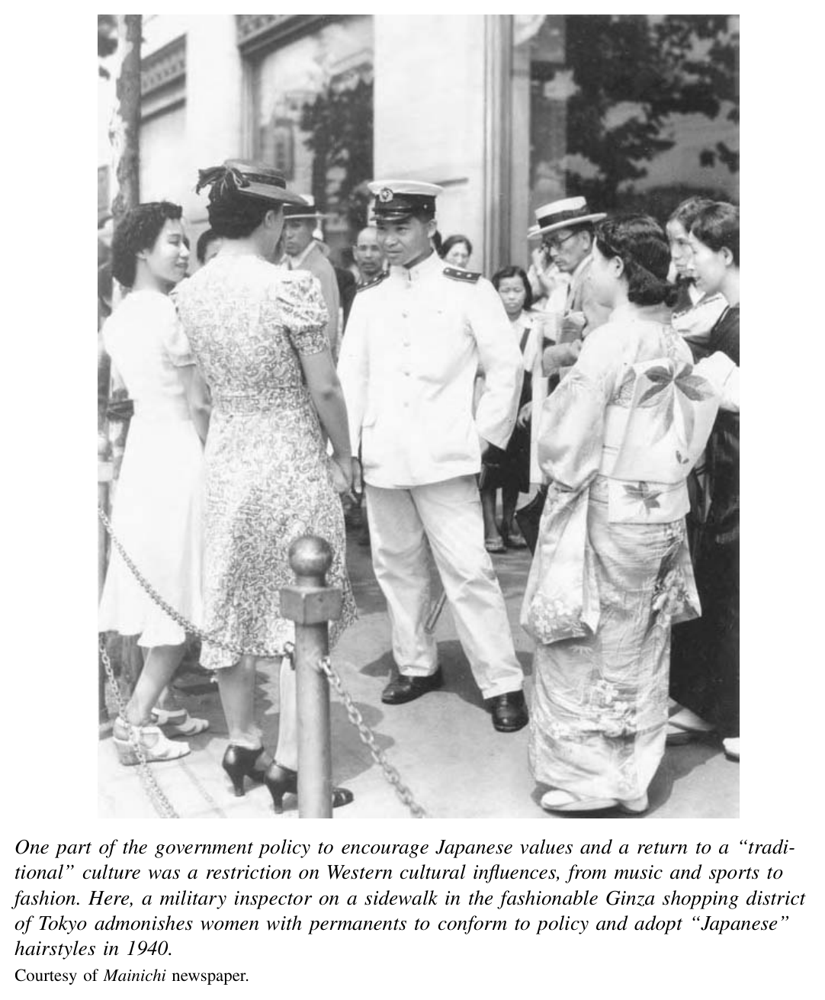
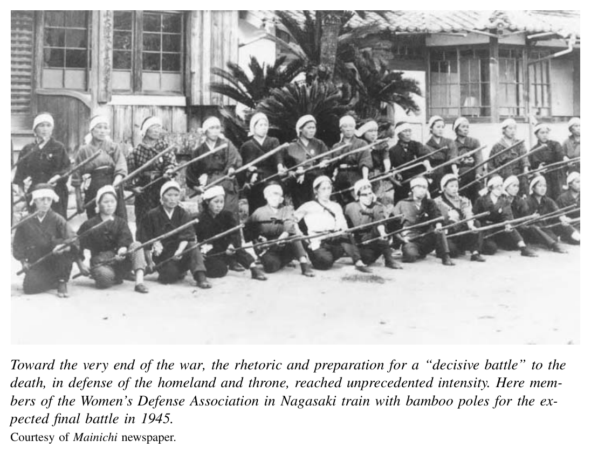

*第三编 帝国日本：从崛起到灰烬*

# 第十二章 战时日本

〔译者说明〕为兼顾中文史学常用译法与原文语境，**Manchuria** 视上下文译作“满洲”或“中国东北”；**kokutai** 译作“国体”；原文中有两处图注残缺，本文据可见内容酌情处理，并注明“原图注残缺”。

1937年7月7日夜间，日本军队在北京城南卢沟桥附近与中国士兵发生了一场小规模冲突。7月11日，当地达成停火。尽管如此，日本政府仍从朝鲜和满洲增派军队。中国军队对日军阵地提出挑战，新的摩擦接连发生。7月下旬，日军进攻并占领了北京和天津。卢沟桥事变发生不过一个月，一场全面战争便已爆发。

## 中国战事的扩大

卢沟桥到底是谁先开的第一枪，至今并不清楚。但与六年前引发日本吞并满洲的“九一八事变”不同的是，这一次可以明确无误地说：由首相近卫文麿领导的日本内阁，批准了发动大规模攻势的决定。陆军内部本有分歧：一派主张扩张，另一小部分人则担心战争旷日持久，希望通过谈判达成停火。近卫站在了扩张派一边。他们想控制华北的铁矿和煤矿资源，也认定蒋介石的国民政府无论如何都会继续威胁日本对满洲和华北的支配。扩张派希望彻底摧毁国民政府，另立一个亲日政权取而代之。

尽管是近卫把战事推向扩大，但起初他仍想借军事压力来逼迫国民政府接受和谈。1937年秋，日军从北京继续向南推进，控制了山东半岛和黄河流域大片地区。在海军支援下，日军又攻占上海，随后迅速南下，于12月中旬占领南京。但谈判陷入停滞。到1938年初，日本方面已清楚看出，国民政府不会承认其占领成果。尽管中国三大城市相继失守，蒋介石仍决定向西撤退，继续打一场持久的防御性抗战。作为回应，近卫首相在1938年1月提出了新的目标，发出令人不寒而栗的号召：要以战争“消灭”国民政府。

就在他说出这番话的时候，南京正在发生一场骇人听闻的大屠杀，可谓近百年来种种集体屠杀惨剧中

最恶劣者之一。1937年12月中旬，日军进入南京后，开始大规模搜捕平民和已投降的士兵。在此后七个星期里，一直到翌年1月底，他们屠杀了数以万计的人，并强奸了无数各个年龄层的妇女。南京大屠杀的具体规模至今仍有争议。一些日本历史学者坚持“低估”数字，称死者也许只有四万人左右；而中国政府则坚持三十万人遇害这一数字。也许永远不会出现一个获得普遍认同的死亡总数，但有一点无可否认：日本士兵实施了大规模暴行。

要解释这场大屠杀为什么会发生，和要就受害者人数达成一致一样困难。前线士兵在抵达南京的过程中，经历了激烈战斗，心中早已充满怨恨。他们苦于无法清楚区分中国士兵和平民，又时刻担心遭到游击袭击。同时，他们自己也承受着严酷的军纪约束。和世界各地的军人一样，他们被教育去憎恨那个被非人化了的敌人。处在这种境遇中的士兵，一旦失控，将暴力怒火发泄到平民或已解除武装的士兵身上，固然令人悲哀，却并不令人意外。现代战争史中，这类例子实在太多。

真正更令人费解、也更构成重大罪责的是：南京的日军高层竟然容许这种搜捕、强奸和屠杀持续了整整数周。东京的当局很可能也接到了报告，但并未采取果断措施约束部队。或许，南京和东京的高层人物因迟迟无法迫使中国接受有利条件，便寄望于用这场屠杀来摧毁中国的抵抗意志。若果真如此，那他们既残忍，又愚蠢。

在随后的数月里，日军继续扩大控制范围，攻占更多关键城市和铁路干线。到1938年秋，军事局势进入僵持。日本已向战场投入六十万大军，但这些兵力也只够勉强防守占领区内的城市与铁路。占领者对乡村几乎没有多少控制力，部队时刻面临游击袭击的威胁。战争期间，日军在其他许多事件中同样屠杀了平民和士兵，尤其是在华北。以这种方式恐吓民众，似乎正是日本军方试图“绥靖”中国人民的一项更广泛、而最终失败的军事战略。

国民政府最终退往中国西部腹地的重庆，依靠群山险阻和遥远距离躲避日军攻击。此外，1939年夏，日苏之间的紧张关系在中蒙边界的诺门罕地区爆发为一系列规模巨大、却少有报道的战斗。装备更精良的苏军压倒了不可一世的关东军。日本方面在总兵力六万余人的情况下，因战死或患病损失约两万人。〔1〕

为了更有效控制占领区内三亿中国人，日本于1940年3月扶植并承认了一个新的中国政府来管理这些地区。这个政权由国民党内蒋介石的政敌汪精卫出任首脑。他与日本人一样，对苏联和西方列强心存疑惧。他为与日本军队合作辩护，声称双方共享一种反对外来势力的泛亚洲团结理想。但日本强迫他接受了一项屈辱性的“条约”，使他根本无法赢得民众支持。汪政权始终羸弱，其存续完全依赖日军撑持。

自20世纪30年代中期以来，已有少数战略家发出警告，认为日本不应把战线拉得过长。其中，在最高层最有力主张这一点的，正是当年策划吞并满洲的石原莞尔。他最担心的始终是苏联和西方。他一再敦促政府集中经营满洲，保存实力，以应付这些潜在敌人。然而这种看法并不受欢迎。1937年秋，石原被排挤出核心，被打发去接连担任几个无足轻重的职务。但他最担忧的局面终于还是出现了。日本的统治者把本国士兵陷进了一场大陆战争的泥沼：既不肯后退，也无法战胜对手。

## 走向珍珠港

未能打破中国战场的僵局后，近卫首相于1939年1月辞职。在其后的十八个月里，日本先后有三位首相走马灯般上台：先是极端民族主义色彩浓厚的职业官僚平沼骐一郎，随后是两位军人——陆军大将阿部信行和海军大将米内光政。他们试图以多种方式打破对华僵局，孤立蒋介石，摧毁他继续坚持下去的意志和能力。对西方，他们想通过外交迫使美国和英国承认日本在中国的既得地位；对北方，他们希望通过外交中和苏联的威胁，从而把关东军兵力腾出来用于中国战场；对南方，他们则同时考虑外交与军事手段，以削弱乃至消除英国在马来亚、法国在印度支那、荷兰在印度尼西亚的统治。这么做有两个原因：其一，日本若控制东南亚，就能掌握石油、橡胶、锡等战略资源；其二，它还能据此从南面对中国国民政府形成包围和打击。

随着希特勒政权一步步走向欧洲战争，平沼内阁看中了与纳粹德国结盟这一主意，希望借此同时牵制苏联与西方在亚洲的力量。其基础早在1936年的《反共产国际协定》中便已铺设完成。该协定规定日本与德国（意大利于1937年加入）在反共问题上进行合作，并约定各国未经对方同意，不得单独与苏联达成任何协议。可是1939年8月，希特勒突然宣布与斯大林签订互不侵犯条约，等于公然背弃了这一协定。与德国合作的战略就此破产，平沼的威信也随之崩塌。他因对希特勒的背叛愤怒不已，遂辞去首相职务。

次月，希特勒相继入侵波兰和法国。阿部、米内两届内阁因此采取了在欧洲战争中保持中立的路线，并微调了其外交目标。他们曾试探性地寻求美国和英国帮助调停中国问题。但陆军依然坚持推动与轴心国结盟。米内首相更倾向于与英美谋求妥协，因此被军方逼迫辞职。

就在这时，1940年夏，近卫文麿在朝野的巨大期待中重新上台。人们希望他能提供强有力的领导，在国内外共同建立一种“新秩序”。他出身华族，又与皇室关系密切，这种身份在危机时刻赋予了他格外特殊的合法性。他上台后的第一个重大举措，是在9月与德国、意大利缔结《三国同盟条约》。条约规定，一旦美国参战，轴心国彼此支持。日本领导人希望借此为南进扫清道路。1940年6月，希特勒军队进入巴黎，并扶植了协助统治被占法国的维希政权。维希政府同时管辖法国殖民地。借助《三国同盟条约》，日本得以与维希当局达成协议，在法属印度支那（越南）北部驻军。若法国仍是一个独立自主的政府，恐怕绝不会允许日本军队进驻。

日本南进能否得手，归根结底取决于美国如何反应。事实上，日美之间的紧张关系早已逐步升高。整个20世纪30年代，美国在口头上强烈支持中国的民族自决，但并未向国民政府投入多少实质性资源。美国部分商界人士甚至希望与日本合作开发满洲经济。然而到了1939年7月，为了发出足以遏制日本扩张的强硬信号，罗斯福废除了《日美通商条约》。此举使美国得以在必要时对日本实施出口禁运。

当日本进驻印度支那北部后，美国果然以逐步扩大的出口禁运加以反制。这进一步刺激了日本国内的主战派。他们开始主张对美国及其盟友先发制人。1941年6月，希特勒又撕毁与斯大林的和平安排，向苏联发动进攻，使局势更趋复杂。日本并未追随希特勒卷入这场新战争。它在南方的战略目标要求北方保持和平；两个月前的1941年4月，近卫刚刚与苏联缔结《日苏中立条约》。随后，近卫进一步扩大日本在印度支那的控制，于1941年7月取得维希方面许可，占领整个半岛。此后，日本事实上成了这个法国旧殖民地的实际统治者。

美国则以更强硬、也更具威胁性的动作回敬了这一扩张。罗斯福立即组织起一场国际禁运，切断日本一切外国石油来源；同时，还以低于成本的价格向中国提供军需品。失去石油，日本既无法维持军事机器，也无法维持经济运转。摆在日本政府面前的是一个艰难抉择：要么接受美国解除禁运的条件，从中国全面撤军；要么听从鹰派主张，对美国和英国开战，以武力夺取东南亚油田，然后试图凭借既成事实从有利地位上逼迫对方停火。

一时间，日本两条路同时在走。日本外交官徒劳地寻求一种“局部撤出中国”的方案，既想让本国勉强接受的陆军满意，也想让美国满意。与此同时，日本军方则拟订了一套大胆的作战计划，想以一记重击逼迫西方列强承认其在亚洲的霸权。直到1941年深秋，外交努力仍在继续；就在这一过程中，近卫被陆军大将东条英机取代。元老们认为，一旦走到全面战争这一步，国家就该由一位军人掌舵。东条异常集中地握有权力，兼任陆军大臣和首相。

到11月，内阁核心人物已看出，想要达成一个令双方都满意的外交协议，几乎不可能。日本只愿意从印度支那撤军；而美国所能接受的底线，则是日本必须从中国全部撤出，除了它在1931年以前于南满拥有的既得权益外。11月5日，在天皇御前会议上，核心决策层一致同意：如果最后一轮谈判仍不能让美国接受日本在亚洲的立场，陆军就将发动大规模攻势，征服英国和荷兰在东南亚的殖民地，以及美国在菲律宾的属地；海军则将同时袭击驻泊珍珠港的美国舰队。最后关头的谈判果然毫无结果。日本外务省原本打算在珍珠港袭击前夕，把一份长篇备忘录交给美国方面，通知谈判已经终止——实质上等于宣战。但由于日本驻华盛顿使馆人员在解码、翻译和誊打这份文件时耽搁太久，结果它竟是在1941年12月7日珍珠港遇袭之后（日本时间12月8日）才送到美方手中。

至此，一整套复杂的外交与军事运作宣告结束。日本一头冲进了一场战争，而这场战争后来给整个亚洲人民都带来了灾难性的后果。在若干关键时刻，日本领导人严重误判了其行动的后果。1937年，日本军方多数人，以及文官、政治家、知识分子和媒体，都没有看清中国民族主义的力量，这种力量支撑了中国的持续抗战。同样，在1940—1941年珍珠港袭击之前，日本领导层也没有意识到：为了保卫英国与荷兰在亚洲的殖民地，美国竟会愿意切断对日贸易。到了1941年秋，当他们最终作出开战决定时，他们其实十分清楚，美国的工业力量意味着持久战根本打不赢；但他们却天真地说服自己，相信美国人并没有意志去打一场远在海外的长期战争。

确实，美国在1940年和1941年为阻止日本扩张而采取的行动，强化了日本国内那些认为战争无可避免者的看法。因此，一些历史学家将战争责任部分归咎于美国，认为它采取了把局势推向战争的步骤。但很难说，如果美国当时换一种更温和的应对方式，就真能避免战争。相反，若美国采取绥靖态度，扩张主义的逻辑几乎必然会使日本军方把这种反应视为软弱，并进一步加紧侵略。日本统治者始终看不到这样一种可能：别人未必会对他们的意志俯首帖耳。从1931年起，他们在帝国边疆每逢出现紧张局势，总是选择继续向前推进，而不是停步，更不是后退。既然这种边疆冲突几乎不可避免，那么对满洲的入侵事实上便启动了一连串最终不可逆地通向战争的事件。

## 太平洋战争

太平洋战争伊始，日本陆海军便取得了一连串迅猛而戏剧性的胜利。对珍珠港的袭击摧毁了美国太平洋舰队的核心力量。九艘战列舰中，六艘被彻底摧毁，另有两艘遭到重创。日军沿马来半岛一路南下，攻势凌厉，迫使英军撤退，并于1942年2月将新加坡收入囊中。到5月，菲律宾战役也以日军获胜告终，美国将军道格拉斯·麦克阿瑟被迫撤往澳大利亚。在战争头六个月里，日本还从英国手中夺取了缅甸，控制了从印度尼西亚到婆罗洲、再到西里伯斯的广阔荷属东印度群岛，并占领了中太平洋和南太平洋的诸多岛屿。

在美国人的集体记忆中，珍珠港一直被定格为一场不道德的“偷袭”。日本方面原本似乎打算提前发出最低限度的通知，但又不至于给美国在夏威夷作出防御准备的时间。无论如何，到1941年底，美国决策层其实已掌握大量证据，知道日本正在考虑开战，而且极可能很快会在亚洲某处发动袭击。此外，早在1905年的日俄战争时期，日本就曾成功运用过对旅顺港的突然袭击这一战法。[译注：日本突袭旅顺港实发生于1904年2月，原文作1905年。] 1941年的美国军事战略家本应预料到日本会再度采用类似战术，但美国在太平洋的指挥官们却麻痹大意、准备不足。说来也讽刺，1905年时，西方观察家还曾盛赞日本军方这种战略运用得极为高明。

尽管如此，从今天看来，单纯谴责日本发动进攻的方式，多少显得有些空洞。然而在当时，这种“偷袭”所激起的愤怒，以及一天之内就造成三千七百名美国人死亡或受伤的惨重代价，在美国社会点燃了强烈的复仇欲望。“记住珍珠港”成了整个战争时期的响亮口号，其余波甚至延续到战后，在美国社会中形成了一种把日本人刻板化为“不可信赖之人”的印象。与此同时，正是对珍珠港的愤怒，使罗斯福总统得以顺势把美国带入欧洲对轴心国的战争；在此之前，面对并不积极的国内民意，他一直对这样做犹豫不决。

日本国内则以欢欣若狂迎接这些胜利。政府与媒体高调宣称，这场战争是为了把亚洲重新交还给亚洲人。但摆在日本政府面前的现实任务却极其庞大。转眼之间，它拥有了一个南北约四千英里、东西约六千英里的广大帝国。究竟要如何统治？又凭什么原则来统治？1938年，近卫首相曾宣布日本意图建立一个“东亚新秩序”，宣称中国与日本将以平等伙伴的关系共处。到了1940年，在进军印度支那之前，政府又把这一愿景扩大为“大东亚共荣圈”，将东南亚也纳入其中。但无论军方还是官僚机构，都几乎没有为如何整合和巩固这些新领地做过周密规划。

于是，日本官员只能边走边看，临时拼凑统治方针。他们对既有殖民地的统治比以往更加严酷。在朝鲜，总督府把学生征入工厂，又强制多达四百万成年劳动力迁移。他们被迫到日本当矿工，或到中国担任狱卒、修建机场跑道的劳工。成千上万的年轻妇女被送往亚洲各地，被迫满足士兵的性欲。台湾男性则被编入所谓“志愿兵团”，在亚洲和太平洋各地承担军事及后勤支援任务；事实上，他们几乎没有选择余地。留在岛内的许多人则被动员进“奉公队”，在田野与工厂劳动。

在东南亚新征服地区，日本的统治方式因地而异。出于一种反殖民的姿态，日本在缅甸、泰国和菲律宾扶植了名义上的独立国家；而在印度支那和印度尼西亚，则由日军占领当局更直接地进行统治。直到1942年春，日本政府才开始筹划成立“大东亚省”，并于同年11月正式设立。但这个机关从未真正成长为一个强有力、能够统一协调控制全区的部门。构成“大东亚共荣圈”的五个国家——缅甸、泰国、汪精卫政权下的中国、菲律宾和满洲国——只在1943年11月于东京召开过一次“大东亚会议”。会议充斥着对泛亚洲团结的歌颂和对西方帝国主义的谴责，却几乎拿不出什么切实可行的区域整合与经济开发方案。

实际上，真正决定政策的是各地日军司令官。他们一方面镇压那些把矛头指向日本的独立运动，另一方面又扶植那些宣誓效忠日本、反对西方的民族主义武装。陆军曾扶持缅甸独立军，由反英的缅甸民族主义者领导，他们与日军一道于1942年初攻占缅甸；但到1944年，这些人又转而反抗日本殖民统治，组织起地下抵抗运动。类似地，日军也在新加坡从被俘印度士兵中招募人员，组织“印度国民军”。日本军方以“帮助驱逐英军、解放印度”的宏大承诺，说服了热烈的印度民族主义者苏巴斯·钱德拉·鲍斯来领导这支部队。1944年春，这支约一万人的军队与八万余日军一道，参加了从缅甸越境攻入印度的因帕尔战役，结果惨败。由于日军根本无法为这些部队提供必要的后勤支援，据估计，有七万五千名日军和印度士兵死于疾病或战斗。相较之下，在越南，日本直到战争最后阶段之前都一直严厉镇压越盟民族主义运动。1944年，日军还把越南大量稻米征调给其驻菲律宾部队食用，直接导致了一场夺去近百万人生命的大饥荒。

在整个帝国范围内，这类残酷事件耗尽了日本起初打着“亚洲团结”旗号、驱逐西方宗主国时所赢得的那一点好感。印尼人、菲律宾人、越南人最初都曾寄希望于日本能积极推动民族解放，而这种希望最终被背叛了。即便如此，日本统治的短暂插曲仍在长远意义上产生了重要影响。无论是在日本时而协助、时而压制之下形成的独立运动，都延续到了战后。它们最终粉碎了法国、荷兰和英国恢复战前殖民统治秩序的希望。

“大东亚共荣圈”之所以最终徒有其名，部分原因是战局很快转而对日本不利。1942年5月，日军夺取珊瑚海一带岛屿的企图受挫；紧接着，仅在珍珠港之后六个月，6月的中途岛海战便给日本以沉重打击。日本海军损失了四艘作为舰队核心的航空母舰。此后，美国及其盟国开始了漫长而艰苦的反攻，一步一步逼近日本本土。潜艇和空袭重创日本商船队，使本土与帝国各地之间的联系几近切断，国内经济也因此陷于瘫痪。美国人大体上没有理会盘踞在中国、印度支那和印度尼西亚的庞大陆军部队，而是把力量集中在横越太平洋的双线推进上：道格拉斯·麦克阿瑟将军从新几内亚一路北上，意图夺回菲律宾；切斯特·尼米兹指挥下的美国海军，则在中太平洋不断攻打由日本控制的战略岛屿。1944年7月塞班岛失守后，日本本土已进入美国轰炸机的航程。日本空防根本无法抵挡高空来袭的B-29轰炸机，它们将燃烧弹倾泻到工厂与民宅之上。到这时，战争其实已经大势已去，而距离日本正式投降，还有整整一年。

## 为总体战而动员

在对外鼓吹东亚“新秩序”的同时，官僚、军人、政治活动家和知识分子也在国内高声呼吁建立一种“新秩序”。形形色色的人——主要是男性，也有少数积极投身政治的女性——都把希望寄托在近卫文麿身上，盼他整合各路力量，重塑日本。所谓“新秩序”这一口号在1938年近卫第一届内阁时期广泛流行起来。它汇集了自20世纪20年代以来逐渐成形的多种思潮。那些自称主张“改造”的人物想重塑经济、政治和社会秩序，不仅要改组工厂和农业，也要改造文化生活。

这些“新秩序”的鼓吹者设想，一种本土传统将重新繁盛，并超越堕落的西方文明。但他们所走的道路——有时是有意为之，有时则未必自觉——与德国纳粹和意大利法西斯有着明显的平行之处。他们试图用中央计划和经济统制来取代混乱的多元格局，用建立在单一统一政党基础上的威权统治来取代政党政治，并以更严厉的社会纪律来约束国民。和西方法西斯一样，他们把战争动员颂扬为“创造之母”。战争既是变革的催化剂，也是这些变革本身的产物。

“经济新秩序”的构想主要出自商工省和企划院的一批“经济官僚”以及军方人物。他们与昭和研究会——一个与近卫关系密切的智库——中的知识分子合作推进这一设想。其主要设计者之一，是商工省官僚岸信介；在战争最激烈的时候，他后来出任军需省大臣（并在20世纪50年代末担任首相）。这类人希望用“合理的”产业控制取代混乱的竞争与逐利行为。他们认为，工业应当服务于国家的“公共”目标，而不是资本的私人目的。他们主张，自由市场经济必然带来萧条和社会冲突，从而削弱国家力量；只有一种由国家控制的资本主义，才能化解长期的冲突与危机。

在1937年6月至1939年1月、以及1940年7月至1941年10月两段近卫内阁时期，经济管制得到最显著强化。其中一个关键步骤，是1938年议会通过了《国家总动员法》。该法规定，一旦宣布进入“国家紧急状态”，官僚机构就可以不经议会批准，发布“控制物资和人力资源”所必需的一切命令。为了让法案过关，近卫曾承诺，对华战争还不构成这样的“国家紧急状态”。然而，议会通过该法不到一个月，他便照样启动了它。国家于是获得了前所未有的广泛权力，可以动员“物资与人力资源”。此后，社会和经济活动中几乎没有什么领域能置身于这一秩序之外。

1941年，近卫政府又依据《国家总动员法》，建立起“经济新秩序”的一项顶层制度：由《重要产业统制令》所创设的“统制会”体系。该法令允许商工省在各个行业设立名为“统制会”的超级卡特尔组织。这些机构拥有分配原材料和资本、决定价格、规定产量与市场份额配额的权力。实际运作中，各大财阀企业的社长与官僚一道，坐在各行业统制会的董事会上。通过与国家合作，大企业得以在这些卡特尔和统制会中保留相当大的主导权。

即便在“经济新秩序”提出后，中小企业也仍保留了几年有限的自主性。但到1943年初，政府建立起一个全国统一、强制入会的产业联合体制度（称作“联合会”）。成千上万的小制造商被迫把资源并入这些组织，自身则不再作为独立企业存在。这些产业联合体通常都被转入军需生产。比如，小型纺织厂家被命令把机器封存起来，改为给大工业企业做飞机零件的分包商。

那些主张以自上而下方式实现经济效率和社会秩序的人，也推动了一套与上述经济改革相平行的“劳动新秩序”。自20世纪30年代中期起，内务省官僚和警察当局就在筹划设立以工厂为基础的劳资代表协商会，再让这些组织逐级向上汇入一种金字塔式的地区和全国性联合体。

1938年7月，内务省和厚生省推出了名义上独立、且号称自愿加入的“产业报国联盟”（Sangyō Hōkoku Renmei，简称“产报”）。当时残存不多的工会几乎全都支持战争，也早已与资方合作，因此它们与这个联盟平静地并存下来。许多大企业只是把原本于20年代建立、用来替代工会的厂内协商会改名为“产报”单位，便算加入了联盟。相比之下，那些此前既无工会也无协商会的小工厂主则不愿加入，觉得这类组织轻则徒增麻烦，重则是外来干预。于是地方警察通常会直接出面，强迫这些工厂成立“产报”单位。到1939年底，全国已成立一万九千个企业层级的单位，覆盖员工三百万人。

1940年，在近卫第二届内阁时期，政府完全接管了“产业报国联盟”，并强令日本剩余的五百个工会（共三十六万会员）全部解散。国家规定，全国所有工作场所都必须建立厂内协商会。到1942年，“产报”下辖的工厂基层单位已达八万七千个，吸纳员工约六百万人。

联盟的支持者希望，这些协商会既能增强劳资双方的士气与团结，又能促进为亚洲“圣战”服务的生产扩张。这一做法的模板，正是几年前德国建立起来的纳粹“劳动阵线”。但在实践中，员工对这些协商会普遍冷淡。有人回忆说，“我们开会基本就是睡过去”；另一个人则称之为“纯粹浪费时间”。厂主和经理对这些组织也同样不抱期待，没有赋予它们任何真正权力。总体而言，“产报”对战时动员并没有多大实际价值。〔2〕 但它确实开创了一个先例：把白领和蓝领员工一并纳入工作场所组织之中。它以官方而高调的方式宣示了一种观念：所有雇员都是国家与企业中被重视的一员。战后工会运动正是在这些战时先例的基础上加以继承并改造的。

战时动员还在许多方面严重压缩了管理者与劳动者的自主空间。1938年后，政府依据《国家总动员法》，由内务省和厚生省官僚与学校校长合作，把新毕业生分配到军需行业。1941年，随着战争加剧、成年男性劳动者被征入军队，政府又实行了劳动征调制度来补充劳动力。它授权征调16岁至40岁的成年男性，以及16岁至25岁的未婚女性。在此后数年中，约有一百万男性和另一百万成年女性被征配到工作岗位上。女性通常是从家务劳动转入有薪工作岗位，而男性则多半从“和平时期”的工作调往军工厂或其他战略产业。1943年至1945年间，又有三百万日本男女学生被征入工厂从事战时生产。另有一百万朝鲜人和中国人从大陆被送到日本，在严酷监管和恶劣条件下从事工厂与矿山劳动。

一旦进入工作岗位，随着战争推进，劳动者自由越来越少。1939至1941年间，政府同样依据《国家总动员法》，建立起一整套就业登记和工作证制度，事实上禁止劳动者更换工作。与此同时，国家以越来越严厉的条例限制工资。官员希望以此帮助雇主、抑制通货膨胀，使劳动力成本稳定下来。

设计这些控制措施的官僚，部分也是出于对自由市场的深切怀疑。他们在法规中宣称，雇佣关系不再是私人之间的契约；无论管理者还是劳动者，其首要义务都应当是对国家负责。官僚们还希望通过强制雇主提供一种随年资增长而上升的“生活工资”，来改善士气和生产效率，使年长且有家庭负担的劳动者能够满足不断增长的生活需要。到1943年，厚生省官员已迫使数千家公司修改其人事规则：所有员工每年都应获得两次加薪；雇主只有很有限的裁量权，去奖励高产者或惩罚低效者。通过这些规定，原先已在部分企业中非正式存在的“对受重视工人按年资加薪”的做法，被制度化并扩展到数百万劳动者身上。战后工会运动也将接续这一改革。

国家在战时农业领域也比以往任何时候都更有权力，而且同样带着对自由市场的偏见。1939年，农林省开始对米价和地主向佃农收取的地租进行管制。和工资管制一样，其目标是既抑制通胀，也鼓励生产；在农业领域，则是通过保护佃农耕作者来实现。1942年的《粮食管理法》几乎把稻米和其他粮食作物的购销全部纳入国家之手。政府不仅规定稻米的批发价格，还接管了分配和零售：从农村生产者手中收购粮食，再转卖给城镇消费者。

农业管制的激励机制明显偏向实际耕作者，而损害了地主利益。《粮食管理法》建立了一套双轨价格制度。地主从佃农那里收来的“地主米”，政府按一种价格收购；而由佃农或小规模自耕农直接交售的其余“生产者米”，政府则按更高价格收购。最初，政府给“生产者米”加价20%；到战争末期，它给生产者的价格已是给地主价格的两倍。到那时，全国已有三分之二的稻米产量被纳入这一统制体系。政府由此增强了耕作者的经济处境，也削弱了地主的经济基础和社会威望。

通过改造工业劳动和农业来服务战争动员的这些计划，内部充满矛盾。劳动法规一方面追求有保障的“生活工资”，另一方面，驻厂政府监察人员又允许企业给高产的年轻工人发放大量计件奖金。农本主义话语高唱乡村和谐，实际激励却让佃农和自耕农与地主对立起来。而这种矛盾在国家对待妇女经济角色的问题上表现得尤为鲜明。数以百万计的男性离开工作岗位进入军队，使女性进入劳动力市场的现实逻辑极为明显；但与此同时，人们对恰当性别角色的根深蒂固观念，对许多人来说同样不容动摇。1942年，内务省以“顾及家族制度”为由，拒绝把女性正式征调到工作岗位。东条首相则用更堂皇的语言加以表述：

那股温暖的泉源，正是守护家庭、承担育儿责任，并使妇女、儿童、兄弟姐妹成为前线后盾的力量；它建立在家族制度之上。这正是我国妇女的天然使命，必须长久保存下去。〔3〕

到1943年底，政府官员终于意识到，必须设法“鱼与熊掌兼得”。借一位官僚的话说，就是要“在动员日本女性的同时，又能使她们展现出与家庭相连的特殊品质”。于是政府建立了一套几乎带有强制性的制度，至少先把未婚女性纳入劳动力市场。所有12岁至39岁的未婚女性都被命令登记为所谓“女子挺身勤劳队”的潜在成员。邻组和町内会的压力使得加入几乎成了必须。1943年至1945年间，有约47万名女性通过这一计划进入工作岗位，占战时女性就业增加总数的约三分之一。

然而，即使到了1943年动员达到高峰之时，东条首相仍然指出：“我们国家并不需要因为美国和英国那样做，就同样征调妇女……家族制度一旦削弱，国家也就削弱了……我们今日能在议会履行职责，正因为家中有妻子和母亲。”〔4〕 受这种来自最高层观念的影响，对女性劳动的总体动员推进得相当迟缓。1941年至1944年间，大约有150万年轻女性和成年女性进入劳动力市场，使得战时经济顶峰时在家庭之外工作的女性总数达到1400万，占全部平民劳动力的42%。这一增长既反映了市场需求，也反映了国家强制：妇女和她们的家庭需要收入，工厂也需要工人。尽管这一增幅不小，但与美国同期女性劳动者增长50%，以及苏联、德国、英国在战争中女性就业人数更大幅度增加相比，仍显得明显有限。

正如战时经济改革常常未能完全达到规划者的雄心目标，乃至受制于内部矛盾一样，一场并行推进的“政治新秩序”运动也得出了复杂而折中的结果。它最初是一些官僚和军官试图仿照希特勒纳粹模式，用一个单一的大众政党取代既有政党的努力；最终只走到半途。一个充满活力的群众性政党并没有真正诞生，但到1940年，所有现存政党都被解散，取而代之的是一个近乎政治啦啦队般的组织——大政翼赞会（Imperial Rule Assistance Association, IRAA）。

围绕组建新型大众政党的倡议者，早在1937年就聚集到近卫首相周围，劝他领导一场针对既有政党的群众运动。他们最在意的是要压制民政党和政友会，因为在1937—1938年的议会会期中，这两个政党仍有足够活力，能够迫使政府推迟或略微修改其立法议程。他们还把低投票率看成一种消极抵抗。在“新秩序”支持者看来，个人主义和社会主义已经毒害了大众，使人们无法全心投入天皇大臣们所推动的国家议程。所谓“政治新秩序”的运动，正是要把这种冷漠转化为对国家的狂热支持。

在第一届内阁时期，近卫的重心仍放在协调彼此对立的精英集团，因此他不愿冒险去领导一个新党，采取正面冲突路线。接下来的两年里，支持和反对“新秩序”的各方之间展开了错综复杂的斗争。军方、官僚体系、社会大众党以及民间右翼中的关键人物，支持一种相对纯粹的法西斯体制，都把希望寄托在近卫身上。他们认为，需要一个强有力的群众动员机构，把国民的经济和精神力量导向国家目标。与他们相对立的，则是大多数党人及其支持者，尤其是财阀领导层。

1940年7月，近卫第二次出任首相伊始，终于着手宣布“政治新秩序”，并建立大政翼赞会。所有政党都被勒令解散，而民选政治家则被要求以个人身份加入这一新组织。但就像财阀一面接受、一面又设法把经济统制体系纳入自身掌控一样，民政党和政友会也在这一新结构内部保留了部分原有权能。

1942年的议会选举很能说明这种“半吊子”的结果。约有1000名候选人角逐466个议席。大政翼赞会提出了一份由政府认可的正式候选人名单，人数正好也是466人。其中包括247位现任议员和20位前任议员，显示出与此前数十年政党政治之间有相当强的连续性。与此同时，大约还有550名无党派人士参选，其中又包括约150名原党人。结果，大政翼赞会正式候选人赢得了82%的议席（466席中的381席），而名单上的所有现任议员全部连任成功。〔5〕 无论是加入翼赞会的党人，还是以无党派身份参选并当选者，许多人都仍保有地方选民对其个人的忠诚。就相当大的程度而言，既有政党的成员并未真正被清除出统治体系。

然而，他们确实比过去驯顺得多。共有199名新人进入议会，议员更替程度高于此前选举。而所有议员如今也越来越不像人民利益的代表，反倒更像是把国家利益向下传递给民众的中介。他们已不再构成一个有组织、独立自主的政治力量。绝大多数人支持东条首相；少数不支持者，也只能把疑虑藏在心里，否则便面临逮捕与监禁。

总体来看，国家动员计划并没有达到那些更宏大、甚至带有极权色彩的“改造国家”目标。日本社会中仍保留着有限但真实的多元性。无论是“经济新秩序”、产业报国联盟，还是大政翼赞会，都没能让国家彻底控制日本臣民。然而，这场为战争动员并借机重塑社会的努力，确实改变了国家、社会与个人之间的关系。议会沦为边缘性机构。社会主义者、女性主义者、工厂工人、佃农、商人以及党人原先多少还拥有一点独立性的组织，要么被解散，要么被改造。国家比以往任何时候都更深入地侵入社会生活。政治表达则受到严密而严厉的监控。

这种新秩序借助当时最现代的技术——从广播到新闻纪录片再到电影——被大力宣传。国家通过一个庞大的组织网络，把民众与国家、与天皇联结起来；这些组织本来就是在前几十年现代化进程中建立起来的，如今则被国家更加严密地管理：青年团体、妇女团体、村落和邻里组织、工作场所协商会、农业和工业生产者联合会。战时秩序披着一层传统主义的外衣，颂扬对天皇“自古以来”的忠诚；但在许多方面，它却是极其现代的。

## 生活在战争阴影下

整个20世纪30年代的大部分时间里，尽管对华战争代价高昂且不断扩大，多数日本人仍享受着某种经济上的“好时光”。1937年至1941年，日本工业总产量增长了15%，其中特别增长显著的是为军方服务的重化工业。审查制度固然约束了公共言论，但文化生活总体上仍显得轻快而活跃。就他们的日常处境而言，多数人几乎没有理由怀疑国家领导人在内政外交上那些“新方向”的基本正确性。

然而，问题的征兆在30年代末便已逐渐显露，远早于太平洋战争在1942年开始逆转。1937年以后，日本经济增长速度已经明显慢于此前数年。中日战争全面爆发后，通货膨胀从每年大约6%的“令人担忧但尚可承受”水平，一跃升至两位数。自30年代后期起，税赋大幅增加。到1938年，军费已占政府预算的整整四分之三，占国民生产总值的30%。这已经是极端失衡的状态，其程度可与20世纪70至80年代苏联经济相比，而接下来几年只会愈演愈烈。到40年代初，消费经济几乎被彻底压扁。资源配置管制使纺织业和其他消费品行业得不到原材料与资本，动员计划又迫使这些行业改装设备、转向军需生产。价格和工资管制还带来了始料未及的副作用：它们促使消费者、雇主和劳动者在商品与就业上形成黑市。生活水准急剧下降。1934年至1945年间，日本人的实际工资下跌了60%；相比之下，同时期美国和英国的实际工资上升了20%以上，德国则基本持平。到1944年初，甚至在燃烧弹空袭大规模摧毁城市之前，平民生活就已经在匮乏与限制中艰难挨了好几年。

这种一步步滑入贫困的过程，可以从一位相对还算幸运的东京女性那段朴素而有力的回忆中窥见一斑。她与丈夫一起经营一家面包店：

有一阵子，我们还能弄到上海鸡蛋……可那东西不像真鸡蛋那样能打起泡来，蛋糕也发不起来。后来连这东西也没有了，我们只好改做三明治。糖也没了。我们买来十条面包，尽量切得薄薄的，里面夹鲸鱼火腿。真正的猪肉火腿早就没有了……很快，普通人连面包也买不到了，更别说鲸鱼火腿。我们只好把三明治生意也停了……后来，我们还得把烘焙机器交给军方，因为那东西是铁做的……最后，我们决定疏散出东京，因为几乎什么都不剩了，空袭也越来越频繁……我在门前仲町的房子，在3月9日那场空袭中烧掉了……不过我们还算走运。这场战争没有夺走我们家任何人的命。〔6〕

随着动员和战争越来越主宰普通人的生活，日本的文化领袖则扮演了各种不同角色。有些人出于自保，或出于厌倦与失望，转向审美性或“非政治”的工作。才华横溢的作家谷崎润一郎埋头于对平安时代经典长篇小说《源氏物语》的现代语译，并于1938年完成。也有一些左翼学者从激进活动中退身，转而翻译欧洲社会科学经典。久留间鲛造开始着手编纂一部极其惊人的《马克思著作全文索引》——在计算机尚未出现的时代，这几乎相当于互联网时代所谓的“马克思主义搜索引擎”。〔7〕

也有少数零星的反对者试图把批判性的声音偷偷塞过审查关卡。下面这首诗发表于1944年，想来是因为当局没有看出其中所含的反战意味：

一只老鼠

像把生命丢出去似的，  
仿佛自己不过是一尊纸板雕像，  
一只老鼠走进了繁忙的街道，  
被压扁了。  

许多车轮从老鼠身上碾过去，  
把它越轧越薄，  
越轧越平，  
摊开在路面上。  

很快，它已经认不出来了——  
不像一只老鼠，  
不像一种动物，  
甚至不像一件死去的东西。  

有一天，  
有人过街时看见一个扁平的东西，  
在阳光下被撞击得变形、扭曲。〔8〕

与这位诗人不同，多数知识分子是热情支持战争的。他们加入了政府主导的艺术家和作家团体，撰写重要文章和演说，把战时动员与改革说成一项宏大的历史使命——“克服现代性”。

对现代性与西方文化的攻击，是知识界对战争最重要的回应之一。这一思潮在1942年7月达到高峰，当时京都大学召开了著名的“克服现代性”座谈会。日本最有声望的一批知识分子齐聚一堂，深信自己的学术思考与地缘政治之间存在直接联系。他们试图揭示中日战争和太平洋战争的“世界史意义”。他们把自身的思想斗争看作正在进行的“光荣战争”的一种配合，视其为“真正推动我们精神生活的日本血脉”与“近代以来叠加在日本之上的西方知识”之间的斗争。正如解放亚洲的战争优于接受西方霸权一样，与现代性和西方展开文化战争，也优于对西方理想的“文化屈从”。〔9〕

这些“克服现代”的提倡者认为，文化上的敌人，是源出西方传统的“理性科学”；而这种传统，有人追溯到希腊，有人追溯到犹太—基督教文明。这样的传统使人类与上帝处于冲突之中。与之相反，在日本，神与人之间并不存在这种冲突或紧张。日本的精神性——比如神道实践所体现的那种精神性——被说成是一种“统一的知识”的源泉，它强调万物、众生与存在者的“整体性”。〔10〕

反现代主义者把19世纪80年代以降的几十年看作一段漫长的背叛时期。他们声称，明治维新的真正潜力，本来在于东方挺身而出对抗西方。在一个层面上，这场维新确实成功了：印度被西方压服，中国被列强瓜分，而日本却抵御住了西方的冲击。可是，接下来又发生了什么？他们说，日本的明治“现代化”让西方的物质主义淹没了整个国家。日本人变成了自私自利、处处逐利的人，忘却了自己原本应是一个在仁慈天皇治下和谐共处、没有阶级冲突的共同体。到20世纪20年代，依照这种说法，整个国家已被粗鄙的逐利和享乐主义所玷污：所谓“摩登女郎”、美国电影、快节奏生活（supiido）与情色风潮，都是这一点的象征。耐人寻味的是，尽管德川时代通俗文化本身就充满商业性和市井艳俗色彩，这些新潮流仍通常被简单地描述成西方文化的入侵，尤其是美国输出的文化毒素。美国民主则被斥为一种障眼法：它用琐碎的消费品去安抚无知的大众。

珍珠港袭击后不久，《读卖新闻》刊出的一首诗，很能概括这种批判的精神：

我们为正义与生命而立，  
他们却为利润而立。  
我们是在捍卫正义，  
他们则为利润而发动攻击。  
他们傲慢地昂起头来，  
而我们正在建设伟大的东亚家族。〔11〕

战争被颂扬为一场把整个亚洲从西方主导的现代主义中解放出来、从而恢复亚洲社会和谐的事业。正如一位评论者在1942年初所写：“东亚诸民族将建立一个联合的文化圈，就像欧洲自中世纪以来建立起来的那种文化圈一样。为此迈出的第一步……必须是把西方民族在东亚的影响驱逐出去。”〔12〕

战时政府的文化政策，与这种精神高度一致。国家几乎是字面意义上地试图把英美文化影响驱逐出境。美国和英国电影被禁映。德国和法国电影虽被允许放映，但为了保持尚武氛围，其中的爱情场面都被删去。所有“敌性音乐”一律禁止，尤其是被视为颓靡的爵士乐。1943年1月，由政府创建、聚集了大批音乐家和教师的“日本音乐文化协会”宣布，要“肃清美国爵士乐对日本的影响”，因为这种音乐已渗透进日本人的日常生活。此后，每个月第三个星期五都被定为专门讨论如何“驱逐堕落爵士乐”的日子。20年代以来数量激增的美容院，则因“败坏女性的纯洁”而遭谴责，烫发被禁止。自19世纪90年代以来便深受欢迎的棒球，在1943年也被禁绝。国家还发动了一场语言净化运动，因为几十年来日语中已充满英语和其他西方语言的表达。日式发音的“strike”和“out”（sutoraiki 与 a-u-to）被勒令改用本土词语替换；“日本阿尔卑斯山”之类名称也被要求改成更“日本化”的说法；就连民间流行的“mama”和“papa”这样的洋派称呼，也在劝止之列。〔13〕

要用符合“纯粹日本精神”的牺牲意识，来取代铺张的西方生活方式，这样的呼声既响亮又持续。它既来自知识分子，也来自国家，而且是面向全体国民发出的。消费品短缺使得节约与牺牲几乎成了不得不接受的现实。西式奢侈品从商店里消失了。城市妇女脱下时髦洋装，换上臃肿宽大的劳动裤“もんぺ”（monpe）。吹风机也被回收用于战争生产。

然而，那些没有物资匮乏或直接军事需要作为支撑的文化限制，效果其实相当有限。棒球在被禁后仍照打不误。1943年秋，当军方开始征召大学生入伍，距离禁令实施不过半年，庆应与早稻田大学的校方为送别即将从军的学生，能想到的最好礼物竟是一场两校棒球赛，而这场比赛还吸引了巨大的观众群。同样地，爵士乐遭禁后，咖啡馆的留声机只安静了几天；随后老板们又重新播放起那些老曲子，起初声音很轻，后来越来越肆无忌惮。一位神风特攻队飞行员在日记里写道：“明天就要出去杀那些迷恋爵士的美国人了，今晚却在听爵士，真是滑稽。”〔14〕

这种“克服现代文化”的努力——和建设新的政治与社会经济秩序的种种工程一样——内部矛盾重重，也并没有形成一套始终如一、得到严格执行的政策。在思想层面，反现代主义者所倚重的，其实正是尼采、海德格尔等欧洲思想家所锻造的西方概念语言。事实上，对“克服现代性”的强调本身，恰恰说明日本已经何等彻底地成为一个现代国家。在民众层面，源于西方的趣味、风尚和爱好早已根深蒂固，绝非轻易能够铲除。尽管口号上否认，战争本身却要求人们运用“理性科学”来制造飞机，以及处理生产与作战的一切事务。事实上，日本工程师在零式战斗机设计上确有出色表现。同样，臭名昭著的731部队科学家也正是以一种冷冰冰的“现代”理性，在中国人身上进行生物战实验。最后还必须看到，对现代性以及对失去传统本真的焦虑，并不只存在于日本，

〔译注：原图注在此处已截断。〕

也不只存在于轴心国。事实上，这种焦虑本身就是现代生活在世界各地的一个标志性特征。战时日本人只是以一种极端、且后果异常惨烈的方式，在与那些最典型的现代困境搏斗而已。

## 战争的终结

尽管内心的疑虑不断增长，但整个战争的大部分时期，日本人在公开场合仍表现出惊人的忍耐与坚持。可是到了后期，社会瓦解的征象越来越明显。日本各地城市工作场所的日常缺勤率就已达到20%，

〔译注：原图注在此处已截断。〕

而且这是在空袭迫使工人逃离城市之前。1944年和1945年空袭展开后，缺勤率常常高达劳动力总数的50%。围绕工资与劳动条件爆发的未经批准的自发性抗争日益增多。宪兵队还注意到，反政府涂鸦之类的消极抵抗行为出现了令人不安的增长。1943年12月，一位宫中侍从在日记中记录了一幕惊人的场景：一名醉醺醺的绅士在电车上唱着这样一首顺口溜：

他们明明打的是一场注定要输的仗，  
还嚷着会赢、会赢，这帮大傻瓜。  
看吧，我们准得输。  
仗已经输了，欧洲已经变红。  
要让亚洲变红，连早饭前都用不了。  
到那时，我也要出来了。〔15〕

在观察到这些趋势，并意识到战争已明显转向不利于日本之后，宫廷、外交界、工商界，以及少数军方高层中的一些人得出结论：即便是几乎彻底的投降，也比打一场注定失败的“最后决战”要好。最具代表性的人物，就是几年前曾被更激进改革派寄予厚望的前首相近卫文麿。近卫及其周围人士最害怕的是苏联对日参战（1941年签订的《日苏中立条约》在整个战争期间一直有效）。围绕近卫的这一群人尤其担心，拖延战争将摧毁天皇制本身。他们所看到的是一种三重威胁：外部攻击、来自下层的不安与骚动，以及来自上层的革命性计划，可能会合流起来，毁掉他们世界中精神与文化的核心。

这些恐惧——尤其是对高层军官和官僚激进派发动国内革命的担忧——其实被夸大了。战争末期的派系冲突，确实使近卫及其盟友与军方领导层特别是陆军发生对立。但这并不是一场“拥护天皇的保守派”与“军中反天皇革命派”之间的斗争。争论的核心，是谁对天皇制度构成更大威胁：美国，还是苏联。那些更惧怕美国的陆军军官，甚至设想过一种绝望的方案：在本土最后决战期间，把天皇疏散到亚洲大陆，并由苏联保护。其反对者则更愿意赌一把，接受美国提出的和平条件。

在战争终局的第一阶段，陆军路线占了上风。1944年7月，东条首相辞职。他已经失去了宫廷、海军以及自己内阁大臣们的支持。但这些上层人物认为他们无法控制军队，因此继任者依然是军人——陆军大将小矶国昭。1945年2月，近卫作出一次绝望的尝试，想从陆军强硬派手中夺回主动权。他亲自向天皇递交了一份请愿书，即所谓《近卫上奏文》。他力劝裕仁尽快与美国媾和，即便代价是几乎无条件投降。只有这样，近卫说，才能“使国民脱离战争的悲惨蹂躏，保存国体，并谋求皇室的安全”。〔16〕 天皇似乎对此颇感兴趣，但并没有采纳他的建议，去撤换首相，改由愿意走这条路的人上台。参与帮助近卫起草上奏文的几个人还一度被短暂拘押，其中就包括外交官、后来出任战后首相的吉田茂。小矶在公开场合继续摆出对战争前景充满信心的姿态，暗中却已向苏联试探，希望由其协助促成一项和平安排。

到1945年春，这条路显然也已走不通。在美国强大压力下，苏联宣布不会续签对日中立条约。1945年4月，小矶辞职。在危机四伏的气氛中，继任首相的是海军大将铃木贯太郎。就在铃木组阁之际，美军发动了惨烈的冲绳战役。到6月美国夺取冲绳时，作战已造成12500名美军死亡，而日本方面则有惊人的25万人丧生，其中15万是平民。此时德国已经投降，日本各大城市也在燃烧弹空袭中化为瓦砾。

凡是能接触到准确战况报告的人，都清楚继续战斗已经毫无希望。但铃木以及天皇周围的核心元老集团，害怕的并不是继续战争只会带来更多死伤与毁灭这一确定的结果，而是担心和平可能引发的政治后果——尤其是天皇制度可能因此垮塌的不确定性。整个7月以及8月初几天，他们仍在做外交上的周旋，寄望于一个几近幻想的前景：由苏联出面调停投降，同时确保天皇得以保留。

最终，只有三重打击叠加在一起——8月6日广岛原子弹、8月9日长崎原子弹、8月8日苏联对日宣战以及8月9日苏军入侵满洲——才迫使天皇本人下决心结束战争。即便如此，从遭受这些打击到真正走向投降，中间仍拖了将近一周。8月9日午夜，在天皇亲临的一场整日会议之后，陆海军参谋总长和陆军大臣仍然拒绝让步。他们想争取一种没有盟军占领、也没有盟军战犯审判的投降条件。天皇站在首相和最高战争指导会议另外两位成员一边，投下决定性一票，同意在唯一条件是保全皇室制度的前提下接受投降。美国方面给出的答复令人不安：天皇未来命运将由日本国民来决定；尽管华盛顿高层规划者实际上已经打定主意，要保留天皇，并利用他来确保占领统治能够顺利推进。8月14日，也许是觉得自己在美国控制之下总比落到苏联手里更安全，天皇再次打破了一场僵局会议，决定接受美国的投降条件。第二天，他通过广播直接向全国宣布了这一消息。9月2日，日本在东京湾“密苏里号”战列舰上签署投降书。

## 战争的负担与遗产

战争留下的是一种复杂的遗产。它在日本国内外都刻下了深重的肉体与心灵创伤。即使在五十多年后，这些伤口依然未能愈合。与此同时，这场战争也为一个截然不同的战后世界奠定了基础。

日本统治者把英国、荷兰、法国和美国的殖民统治者暂时逐出东南亚和菲律宾，这一行动无论是有意还是无意，都加速了亚洲殖民主义的终结。他们在朝鲜、满洲和台湾等殖民地发展近代工业，也为战后工业化埋下了条件。然而，“大东亚共荣圈”的管理者们并未因此赢得感激，反而因为其殖民统治与战时统治的压迫性做法，尤其是在朝鲜和中国，招致了持久而深重的仇恨。无休止的帝国扩张与战争追求，使数百万人陷入苦难。灾难的名单上有南京大屠杀、中国境内难以尽数的其他暴行、越南饥荒，以及印度国民军那场毫无希望的战役。此外，将近三万六千名英国和美国战俘死于拘押期间，这一数字超过了全部被俘士兵的四分之一。〔17〕 幸存者心中的强烈愤怒延续了几十年。

还有一类战争受害者，在当时和战后初期都很少获得公众关注。这就是那些被迫在前线附近、委婉地称为“慰安所”的地方劳动的成千上万少女与妇女。她们约有80%来自朝鲜，其余则包括中国人、日本人以及少数欧洲女性。招募者对一些女性谎称，她们是去当女侍者或仆役；另一些人则是被持枪直接掳走。一旦到了前线，这些女性全都被迫为日本士兵充当性奴隶。士兵通常需要为她们的“服务”付费。从军人角度看，这些慰安所与日本国内各地合法营业的娼馆并无多大不同。但许多女性根本拿不到报酬；另一些人拿到的所谓“报酬”，只是军票，而这种军票只能拿去买肥皂、食物之类的日用品。因而，这些女性的处境与其说接近卖淫，不如说更接近奴隶制。更使“慰安妇”的遭遇不同于一般意义上战时娼妓卖身给士兵的，还在于日本当局的直接介入：从内阁大臣到地方指挥官，国家官员批准、监管，甚至在某些情况下直接经营慰安所。〔18〕 和大屠杀的死亡人数一样，被迫陷入这种性奴役的女性究竟有多少，永远不可能精确统计。现有估计在十万到二十万之间。

战争对日本人民本身也造成了深重创伤。1937年至1945年间，约有170万日本士兵死亡。战后又有多达30万战俘死于苏联拘留营。空袭使900万人流离失所，并造成近20万平民死亡。两颗原子弹在瞬间又夺去了20万人生命。爆心两英里半径内的一切人类，都在顷刻间被烧成灰烬。广岛和长崎化为火焰、死亡与彻底毁灭的地狱。此后数月乃至数年间，又有十万乃至更多原爆受害者因辐射病的长期效应而死去。日本总死亡人数接近250万，而尤其是前所未有的原子弹轰炸经历，使幸存者强烈地把自己视为战争的受害者，而非加害者。失败的体验在数以百万计的日本人心中激起了一种深切的、对一切战争的厌恶。

战时政策还巩固了后来所谓的“1940年代体制”，不过更准确地说，它是一套“跨越战时与战后”的制度安排。〔19〕 战后日本著名的产业政策实践，其根源便在于从大萧条时代一直延续到1945年的那段摸索与试错。在这一过程中，官僚们建立起一整套持久存在的制度，用以引导和控制私人经济；他们也培育出大型制造商与分包供应商之间复杂而持续的网络，这些网络延续到了战后。为战争而动员的努力，还引发了土地占有制度、劳动组织方式以及性别角色的变化。地主势力衰落了。蓝领工人得到了一种在物质上空洞、在意识形态上却相当有力的承诺：他们与管理者是平等的。女性则以前所未有的规模被拉进工作岗位。毫无疑问，日本的投降是现代史上的一道巨大分水岭；但战后在社会文化生活、政治以及国际关系等各方面看似崭新的出发点，实际上都以某种微妙而令人意外的方式，建立在这些战时经验之上。

## 注释

〔1〕 Alvin Coox, *Nomonhan: Japan against Russia 1939*（Stanford, Calif.: Stanford University Press, 1985）是研究这场战争的权威之作。关于伤亡总数，见该书第914—915页。

〔2〕 Andrew Gordon, *The Evolution of Labor Relations in Japan*（Cambridge: Harvard Council on East Asian Studies, 1985）, pp. 300–310。

〔3〕 引自 Thomas R. H. Havens, *Valley of Darkness: Japanese Society in World War II*（New York: W. W. Norton, 1978）, p. 108。

〔4〕 此处以及前面那位政府官僚的引文，均见 Havens, *Valley of Darkness*, p. 109。事实上，东条关于美国的说法并不准确：美国从未在法律上采取把妇女征入工厂的步骤，尽管大量美国女性被鼓励进入工业岗位，而且确实这样做了。

〔5〕 关于这次选举的细节，见 Ben-Ami Shillony, *Politics and Culture in Wartime Japan*（Oxford: Clarendon Press, 1981）, p. 26。

〔6〕 Haruko Cook and Theodore Cook, *Japan at War: An Oral History*（New York: New Press, 1992）, p. 180。

〔7〕 久留间鲛造任职于大原社会问题研究所。他在战时编成的大批索引卡片毁于东京空袭；战后，他终于完成了这一工作，并于20世纪70年代分别以日文和德文出版。

〔8〕 作者为山之口貘。译文据 Steve Rabson 在 *Stone Lion Review* 1（Spring 1978）: 28 所载英文译本转译。

〔9〕 关于战时“现代性”论战，见 Tetsuo Najita and H. D. Harootunian, “Japanese Revolt against the West,” in *The Cambridge History of Japan*, vol. 6, ed. Peter Duus（Cambridge: Cambridge University Press, 1988）, pp. 758–767。本段引文出自第759页。另一本更艰深但极重要的研究是 Harry Harootunian, *Overcome by Modernity: History, Culture, and Community in Interwar Japan*（Princeton, N.J.: Princeton University Press, 2000）。

〔10〕 Najita and Harootunian, “Japanese Revolt against the West,” p. 763。

〔11〕 Shillony, *Politics and Culture in Wartime Japan*, p. 142。

〔12〕 Shillony, *Politics and Culture in Wartime Japan*, p. 143。

〔13〕 Shillony, *Politics and Culture in Wartime Japan*, p. 144。

〔14〕 Shillony, *Politics and Culture in Wartime Japan*, pp. 144–145。

〔15〕 引自 John W. Dower, *Empire and Aftermath: Yoshida Shigeru and the Japanese Experience*（Cambridge: Council on East Asian Studies Monographs, 1979）, p. 290。

〔16〕 引自 Dower, *Empire and Aftermath*, p. 265。

〔17〕 John W. Dower, *War without Mercy*（New York: Pantheon Books, 1986）, p. 48。

〔18〕 “慰安妇”的确切人数不可能有定论。George Hicks 在 “The ‘Comfort Women,’” 载 *The Japanese Wartime Empire, 1931–1945*, ed. Peter Duus, Ramon H. Myers, and Mark R. Peattie（Princeton, N.J.: Princeton University Press, 1996）, pp. 305–323 中估计为10万人；Watanabe Kazuko 在 “Militarization, Colonialism, and the Trafficking of Women: ‘Comfort Women’ Forced into Sexual Labor for Japanese Soldiers,” *Bulletin of Concerned Asian Scholars* 26, no. 4（Oct.–Dec. 1994）: 3–17 中估计为20万人。

〔19〕 Noguchi Yukio, *1940-nen taisei: saraba “senji keizai”*（Tokyo: Tōyō Keizai Shinpōsha, 1995）是一部畅销的通俗著作。此前大约十五年间，日本及其他地区已有许多学者提出了这种“跨战时延续至战后”的政治经济体制观点。
