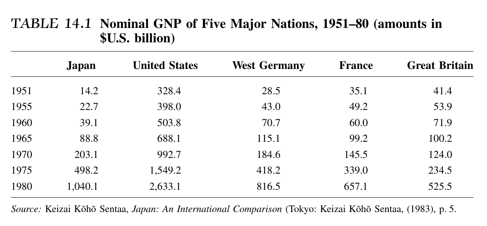
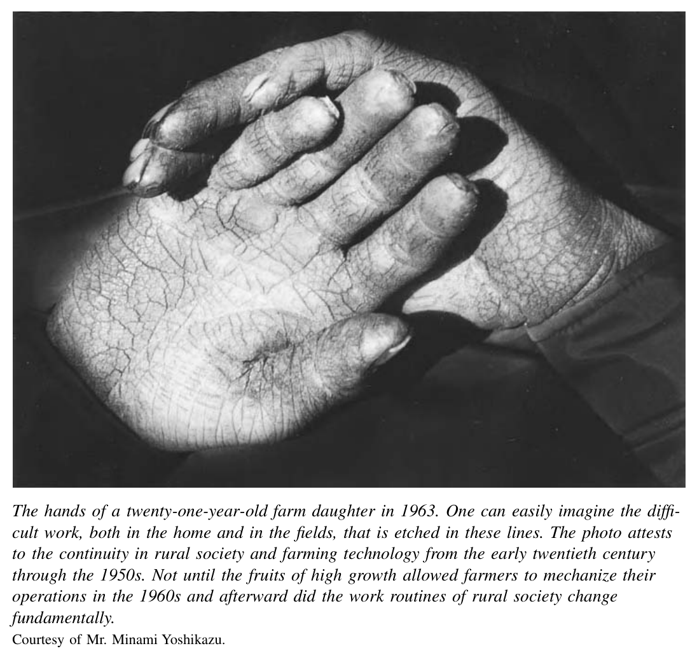
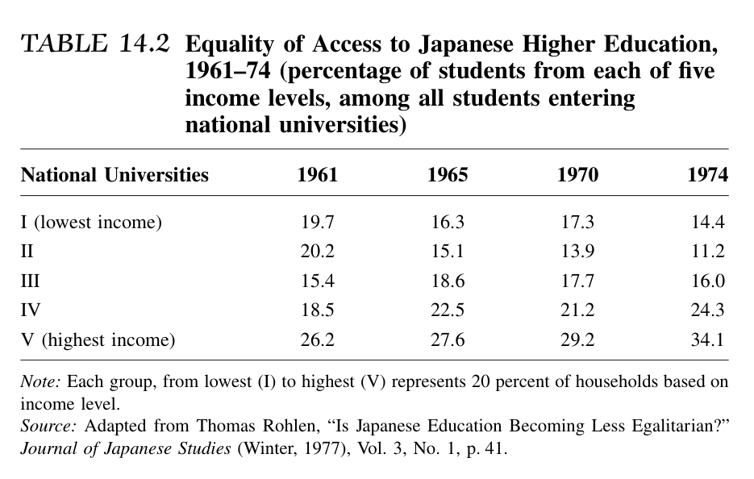
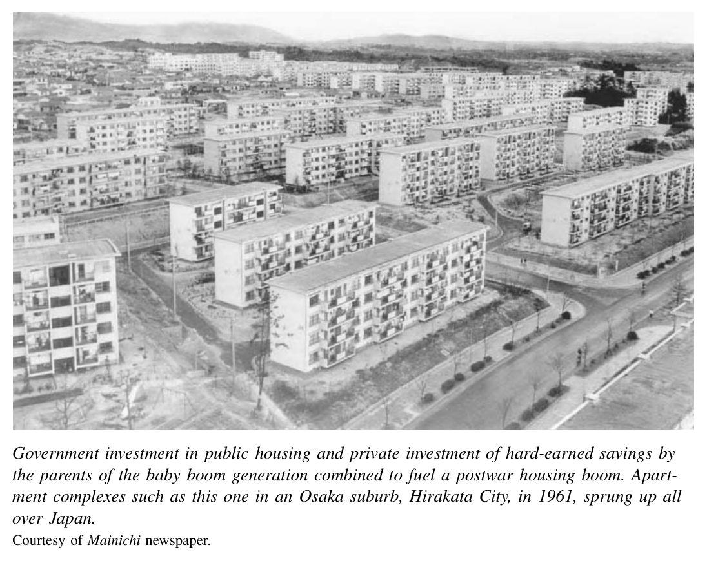
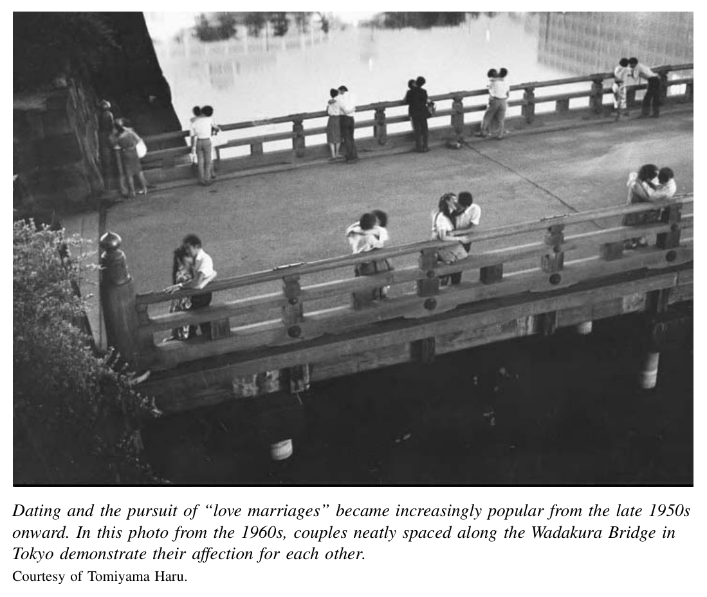
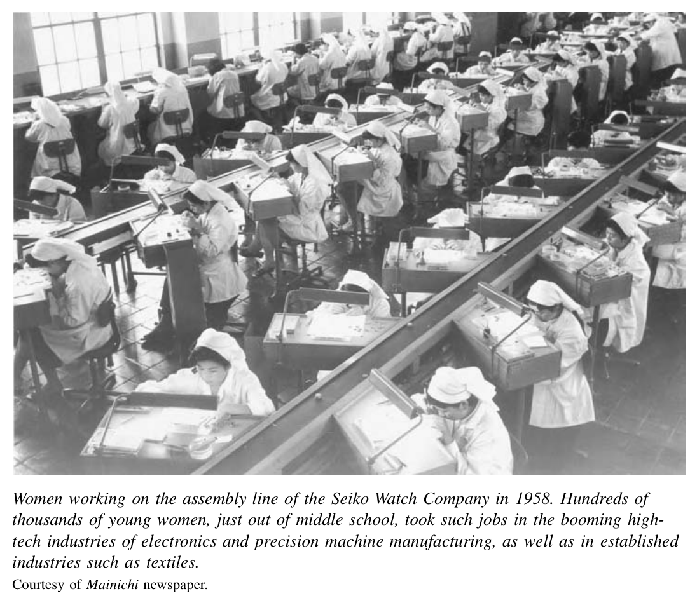
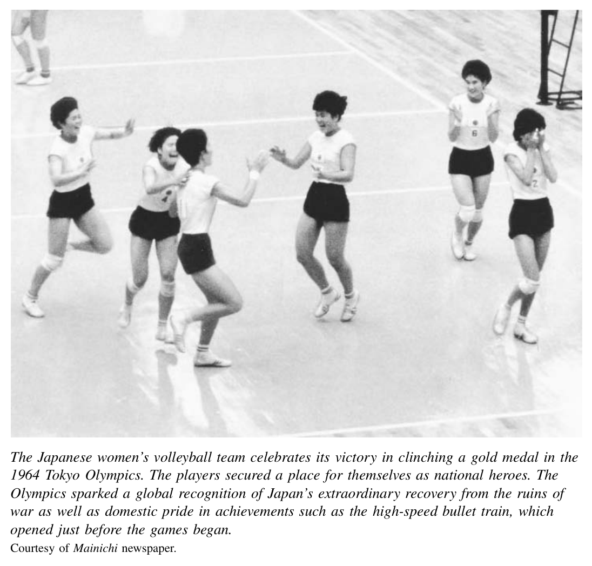

*第四编 战后与当代日本：1952—2000*

# 第十四章 经济与社会的转型

1950年至20世纪70年代初，日本经济以令人惊叹的速度扩张。以朝鲜战争景气为起点，这二十来年后来被历史学家称为“高速增长时代”。日本以空前的速度，从满目疮痍、普遍贫困之地，变成了一个繁荣富庶的国家。这一切是如何发生的？所谓“经济奇迹”，固然有一部分来自市场本身所具有的转化力量；但在若干关键而独特的方面，它同样是一场在日本国家引导之下被“管理”出来的奇迹。高速增长的代价也十分高昂。工作往往异常辛苦，工时漫长，纪律严苛。城市与乡村、男性与女性、大企业与小企业雇员之间，所得利益的分配并不均衡。环境破坏更是触目惊心。围绕这些代价以及增长内在矛盾展开的政治斗争，将在下一章讨论。

社会生活层面的变化则来得慢一些。不过，在战后经济起飞数年之后——大致从20世纪50年代末到60年代——一种真正意义上的“战后社会”开始形成，它与战时及战后初期那种“跨战时期”的日本大不相同。（译注：“跨战时期”对应 *transwar*，指跨越战前、战时与战后初期、强调延续性的历史概念。）一种被人们称为“新中间阶层”的生活方式开始走到中心位置。在日本，中间阶层塑造出了一整套关于“典型生活”的强有力标准图景。比以往任何时候都更多的人，开始共享那些被理解为中间阶层或“主流”社会的经验。尽管如此，一些重要的社会分野依然存在，另一些则只是被重新塑形，并未真正消失。

日本的官僚体制与执政党领导人，同企业高管协力合作，积极试图引导这种趋向更标准化中间阶层社会生活的变化。围绕家庭与家居生活、学校教育以及工作场所，国家推出了种种项目，扶持其所认同的特定模式。正如战后日本的经济史一样，它的社会史也深深打上了国家项目的烙印；这些项目旨在影响普通人的思想与行为。

## 战后的“经济奇迹”

1950年至1973年的23年间，日本国民生产总值（GNP，即一年内生产的商品和服务总值）年均增长率超过10%。在世界经济史上，如此长时段维持如此高速度的增长，可谓前所未有（20世纪80年代以来的中华人民共和国，增长速度大致可以与之相比）。在一条平滑而陡峭上扬的增长曲线上，只有少数几次轻微回落——例如1954年因朝鲜战争结束而出现的下滑——显出一点点凹陷而已（见图14.1）。按美元计算，1950年日本GNP总额仅为110亿美元。到1955年，这一数字已翻了一番多，达到约250亿美元。到1973年，又在此基础上增长了13倍，达到3200亿美元。若作国际比较，1955年日本经济规模仅相当于美国的7%，并且低于欧洲所有主要经济体。到1973年，日本GNP已攀升至美国总量的近三分之一，经济规模位居世界第三，仅次于美国和苏联（见表14.1）。

同样引人注目的，还有对新技术与新厂房持续而大规模的投入。衡量这类基础性投资的标准指标，是资本形成总额。在日本高速增长的核心阶段——1955年至1973年——资本形成率年均超过22%。和GNP一样，这样的比例无论放在历史上还是国际比较中，几乎都找不到先例。

尽管这样的增长前所未有，但经济结构的变化并非没有历史根基。战后这轮腾飞最前沿的，是钢铁、造船、汽车和电子等行业。正是这些重工业——以及其中许多同样的公司——曾在20世纪30年代军事化经济的扩张中领跑。如今，它们证明自己在和平时期也能像战时一样兴旺发展。重工业在整体工业生产中的比重，由1955年的45%上升到1970年的62%；纺织等轻工业的重要性则大幅下降。

早在1962年，英国《经济学人》杂志就刊出专题报道，把日本战后的发展称为“经济奇迹”。〔1〕 这个说法从此流传开来，逐渐成为对战后高增长年代的简明概括。历史学家与经济学家也围绕这一现象发展出了一门自己的“繁荣产业”，纷纷试图为这场看似惊人的发展提供合乎理性、立足现实的解释。

战后故事的重要一环，是异常有利的国际环境。其他国家的经济同样繁荣——“经济奇迹”一词也曾被用来形容德国。整个全球经济在20世纪50和60年代以每年5%的速度高速增长。美国则通过1947年的《关税及贸易总协定》（GATT）等条约，率先推动建立一个更开放的贸易体系。结果，二十年间国际贸易总量增长了三倍以上。与此同时，来自中东等地的石油为工业扩张提供了廉价而稳定的能源。最后，在这样一个更开放的世界经济中，相对低廉的技术许可协议，使日本企业（以及其他国家的企业）得以较为容易地获得从晶体管到炼钢炉在内的一整套新技术。这使劳动生产率能够迅速而持续地提高。

不过，这一轮国际机运微笑以待的，并不只是日本，而是整个资本主义世界。为什么日本经济增长得尤其快？有几项国际因素确实比别国更有利于日本。美国持续驻军，以及日本宪法对本国军备的限制，使日本政府免于承担高额国防支出。朝鲜战争又在一个关键时刻刺激了出口。再加上1949年至20世纪70年代初的有利汇率，实际上起到了某种出口补贴的作用。

图14.1　实际GNP与资本形成，1951—1976年。  
图中标示了若干经济波动阶段，如“神武景气”“岩户景气”“伊邪那岐景气”、石油危机、若干次金融紧缩与衰退等；另标有“民间企业厂房与设备投资”。  
资料来源：经济企划厅《国民所得统计年报》，转引并改编自 Nakamura Takafusa, *The Postwar Japanese Economy*（东京：东京大学出版社，1981年），第35页。经许可转载。

但要完整解释经济增长，还必须同时考察国内因素。企业家精神便是其中之一。一代胆识过人的年轻经理人接掌了老牌公司，也创办了新企业。某种程度上，他们之所以能崭露头角，也得益于占领时期的清洗——战时经济中的许多高层经营者因此被迫提早退休。在若干著名案例中，这些新企业家顶住了政府官僚审慎保守的警告，在明知海外已有经验丰富的强劲对手的情况下，仍敢于投入新领域、采用新技术。

例如，政府曾建议汽车制造商通过合并实现整合，以便更好地同底特律“三大”竞争。结果，丰田、日产、五十铃、东洋工业（马自达）和三菱都决定各自建立完整的产品线。更令人惊讶的是，由本田宗一郎创办的一家后起摩托车公司，竟无视官僚的劝阻，于1963年打入汽车市场，并在长期竞争中大获成功。类似地，川崎重工业一位敢作敢为的高管西山弥太郎，于1950年把公司的金属部门分拆出来，创办了一家新的钢铁企业。他提出要巨额投资建设一座一体化、最先进的钢铁厂。国家官僚不肯为其开放国内资本渠道，他就转而从日本之外——世界银行——取得融资。到1961年，川崎制铁已成为全国第四大钢铁生产商。又如1953年，两个年轻的“异类”经营者——盛田昭夫与井深大——同态度犹疑的官员周旋数月，终于获准购买晶体管生产许可。从20世纪50年代的收音机起步，他们那家尚在襁褓中的公司索尼，很快便成长为全球消费电子领域质量与创新的领导者。

总体而言，日本民间企业扩张得既迅速又无畏。它们从银行大量借贷，背负了高额债务。私人银行以及日本开发银行等公共机构，通过吸收个人储蓄，把资本输送给大小企业。高速增长时期，日本企业典型的负债—权益比约为75:25，这同战前经济迥然不同；战前典型的负债水平更接近40%。由于产出和收入（再加上通货膨胀的帮助）增长得如此之快，企业总体上并不难偿还这些贷款。

高质量的人力资本，是推动战后经济的另一个重要国内因素。随着占领时期把义务教育延长到初中，日本年轻劳动者的教育程度不断提高。各年龄层的雇员都为有望回归正常生活、终于能为自己工作而不必再为军队牺牲感到欣喜。加入工会的劳动者比例前所未有，在20世纪40年代末至50年代初的高峰期超过50%。有组织的工人在行动和诉求上往往斗争性很强，但他们在工作岗位上同样精力充沛、投入认真，愿意长时间劳动并掌握新技能。随着新技术不断投产并被有效使用，生产率显著提高。仅1955年至1964年这十年间，制造业劳动生产率就上升了88%。

除了辛勤生产，普通日本人还以储蓄者和消费者两种身份，在经济中扮演了重要角色。与战前时代形成鲜明对照、但也延续了战时趋势的是，日本普通工薪家庭把收入中异常高的比例存了起来。20世纪50年代初，普通家庭储蓄率还不到收入的10%；但随着经济增长，储蓄率不断攀升，1960年达到15%，1970年超过20%。此后相当长一段时间里，家庭储蓄率一直维持在20%以上。这些资金，无论存在商业银行的储蓄账户，还是存入政府经营的邮政储蓄系统，都构成了一座可供工业投资使用的巨大资本池。

但就在不断储蓄的同时，普通市民也乐于把不断增长的工资花在各类消费品上。诚然，出口市场至关重要；出口挣来的美元，是继续引进外国技术、维持投资所必需的。但从20世纪50年代到70年代初，出口仅占GNP的11%。而在同一时期，西欧资本主义国家平均出口占GNP的21%。〔2〕 因此，国内需求——包括零售消费市场——同样是增长的重要引擎。消费者与工业生产者一样，也延续了20世纪20、30年代被战争打断的趋势：他们涌入商店，购买越来越丰富的家庭与休闲用品——洗衣机、电饭煲、收音机、电唱机，接着是电视机。这些都不是便宜货。1957年，一台普通新电视售价为8.5万日元，大约相当于一个普通城市家庭两个半月的收入。尽管如此，到1963年，全国每五户人家中已有四户以上拥有电视机。总体来看，1955年至1973年间，人均实际国内消费年均增长率达到7.5%。〔3〕

战后经济史中最有争议的国内因素，是日本国家所扮演的角色。日本政府并没有建立苏联式的“指令型经济”。私营企业作出了大量主动决策，有时甚至违背官方建议。即便如此，日本战后经济的故事也绝不能简化为“自由市场创造奇迹”的单线叙事。国家管理非常广泛，而这种管理又是从战前和战争年代临时拼凑出来的做法中发展而来的。这些做法可以概括为“产业政策”，并且它们确实发挥了作用。

在占领时期盟军总司令部（SCAP）的协助下，日本政府保留了战时形成的、对外汇和技术许可等关键资源的控制权。政府正是利用这些权力作为杠杆，支持某些商业计划，压制另一些。在战后最初几年，这种正式权力发挥了重要作用。随着时间推移，国家干预的重心转向更多不写入成文法的非正式做法，也就是所谓“行政指导”。其中最重要的引导机构是通商产业省（MITI）。它的前身是战前的商工省，战事最激烈时曾改为军需省。1945年又改回商工省，1949年再次更名为通商产业省。发挥重要作用的其他政府部门还包括大藏省、运输省、建设省、邮政电信部门以及经济企划厅。

从最一般的层面说，政府通过充当经济上的鼓动者和“指路牌”树立者，营造出一种信心氛围。自1948年起，经济企划厅提出一系列“五年计划”；这些计划本身并无法律上的约束力，但它们向私人投资者释放出明确信号：国家有意扶持某些行业，并准备在必要时介入——作为贷款者，或帮助获取外汇、原材料、技术许可，或在企业出现问题时出手救助。政府如此积极为企业撑腰，也招来外国人某种轻蔑——也许还掺着几分嫉妒。1962年，法国总统戴高乐在一次著名的场合中，就把来访的首相池田勇人称作“那个推销晶体管的人”。

在更具体的层面上，政府部门保护并扶植新兴产业。直到20世纪60年代，它们仍以传统关税作为限制进口的工具之一。此外，日本公司若要进口商品，必须将日元兑换成美元，而购入美元需要政府许可。政府便可以利用这种权力阻碍进口，保护日本企业免受外国竞争者在国内市场上的冲击。国家还以各种方式向其偏好的企业输送好处：政府金融机构向目标产业提供低息贷款，官僚为增长部门中的企业安排技术许可、减免税负。对这些企业的争相投资，常常导致产能过剩。遇到这种情况，通商产业省有时会出面撮合“萧条卡特尔”——也就是由行业内主要企业协同减产，以保证大家都能活下去。

这种做法的收益可能相当可观，而且未必只限于少数特权圈内人。举一个20世纪50年代的例子：通商产业省曾迫使主要钢铁企业共同分摊——也共同分享——一项前沿技术的单一许可，即氧气顶吹转炉（*basic oxygen furnace*）技术。如果按自由市场方式运作，每一家感兴趣的企业都必须分别向这项技术的奥地利发明者购买许可。正因为采取了这种共同购买的方式，日本钢铁企业以远低于美国钢铁企业所承担的成本，获得了这一关键技术。〔4〕 随后，它们得以更快建设新一代生产设施，从而赶在国际竞争对手前面。

这种国家干预经济的非正式机制，后来被称为“行政指导”。它是日本跨战时期政治经济结构的一块基石。它依托的是20世纪20、30年代为“合理化”工业生产而首次临时摸索出来的关系网络与做法——当时政府通过鼓励或强迫主要产业结成卡特尔来调节生产。战后官僚进一步发展了这种“管理型资本主义”的做法，但采用的说服方式已不像战争年代那样强制，更给市场留出奖励善于利用国家帮助者的空间，官僚与企业家的互动也因此更具建设性。

## 跨战时期的社区、家庭、学校与工作模式

“跨战体制”这一概念，可以用来描述从大萧条、战争直到战后延续下来的政治经济安排：产业政策、企业集团的重组、劳资关系、女性在劳动中的角色变化，乃至农业土地改革等。同样，我们也可以谈论一整套“跨战时期”的社会模式。二战后的头十年左右，日本的社会结构与人们生活的肌理，仍与大致从20世纪20年代延续到50年代的那一跨战时代有许多共通之处。那是一个高度异质的社会：无论在社区与家庭生活、学校，还是工作场所，都存在持久的多样性与分化。

战时的物资匮乏、轰炸与疏散，曾在20世纪40年代初短暂摧毁城市社会。但即便在经济尚未恢复之前，充满活力的城市生活已经复苏。自19世纪以来持续不断的人口进城潮，也重新开始。20世纪50和60年代，大约每年有一百万人离开乡村进入城市。郊区生活方式的缓慢扩展，早在20世纪10和20年代随着通勤铁路和新住宅区的建设就已启动。到20世纪50和60年代，东京、大阪等城市继续向外蔓延，吸引着那些向往明亮、新颖、现代生活的人们。日本居住在城市中的人口比例，由1950年的38%上升到1975年的75%。

进城并未使农村人口迅速枯竭。战后，数以百万计的士兵返乡，与家人团聚或建立新家庭。结果和其他国家一样，日本出现了显著的婴儿潮。1947年至1949年的高峰期，每年出生人口接近270万。总体来看，1945年至1955年，日本人口增加了1860万。即使数百万人移居城市，这一急剧增长仍使农村人口维持在高位。二战结束时，日本农业人口约占总人口的一半，即3600万人。十年后的1955年，这一绝对人数几乎没有变化，尽管农村人口在总人口中的比例已经下降。充满活力的城市社会与农村社会并存，构成了跨战时期日本生活的异质性。

跨战时期的社会世界，还体现在人们受教育和谋生路径的多样性上。尽管占领时期实施了教育改革，但直到20世纪50年代，学校制度依旧是一个层级分明的体系，有三个很不相同、但都相当体面的“离校节点”：初中毕业、高中毕业，以及大学或专门学校毕业。从20世纪40年代末到50年代，进入高中的青年人数不断增加，但即便到了1955年，仍有大约一半青年在初中毕业后结束学业。另有三分之一完成高中教育，约15%继续进入大学。

这种以学历为基础、其根源可追溯到战前和战时的等级结构，同20世纪50年代的工作场所恰好严丝合缝地衔接起来。初中毕业生，无论男女，多半进入蓝领操作岗位，未来上升空间有限。高中毕业的男生则可以进入技术岗位或文职岗位，通常有望至少升至工头，有时甚至更高。高中毕业的女生，则可能进入名牌公司从事秘书一类的工作。大学毕业的男性则进入企业或政府机关的精英管理岗位。可是，和当时工业资本主义世界中的大多数国家一样，大学毕业的女性在进入这类职业时面临巨大壁垒，公共学校教师等少数职业是例外。性别与教育程度就这样结合起来，把人们分流进责任、薪酬都大不相同的工作中。

和战前一样，工作世界本身也极为多样。尽管有相当一部分人受完教育后会到家庭之外领取工资——无论是在工厂、矿山、政府机关，还是各种大小公司——但在城市与乡村中，多数成年人仍然在家庭作坊式的小企业或农场里劳动。20世纪50年代，与战前一样，全国劳动力中有一半以上是家庭成员：他们要么在自家农场、渔船上工作，要么在家庭经营的小型零售、批发或制造业店铺中劳动。丈夫通常被算作业主；妻子则在农场、菜市或理发店里一同劳作，被计作“家庭劳动者”。政府统计并不把这些女性视为“雇员”。她们通常作为家庭成员分享总收入，但并不领取工资。从20世纪30年代到50年代，远远超过三分之二的女性劳动者都属于这类家庭劳动者。她们及其家庭，正是战前及跨战时期日本“旧中间阶层”的核心：店主、小商贩和小制造业者。战后日本城镇的街区中，她们仍然占据着主导地位。

家庭形态的多样性，也是跨战时期社会的一部分。20世纪20年代，核心家庭已占到全部家庭的54%。其余大多是三代同堂的扩大家庭。跨战时期社会的重要特征之一，正是这两种家庭生活方式的并存。

20世纪50年代的日常物质生活，也保留了许多旧的、跨战时期的特征，而非真正“战后”的新面貌。20世纪50年代的照片，看上去更像30年代，而不像70年代。乡村里的人穿着草鞋和和服式日常服装；房屋还是茅草屋顶，道路未铺设，田间仍以牛耕；农业劳动几乎没有实现机械化。1963年拍摄的一位农村年轻女子的双手照片，看上去就像是本世纪初留下来的影像。农活极其辛苦，甚至会在身体上留下伤痕。城市与乡村都开始流行一些令人兴奋的消费创新品，但直到20世纪50年代末，这些商品与20、30年代相比并没有根本不同：电灯、收音机、电唱机和电话而已。

20世纪50年代的日常生活节奏，也仍在很大程度上延续着战前时代，既混合着都市的时尚，也混合着地方性的生活方式。1950年东京地区一项针对“劳动者家庭”的社会调查显示，妇女平均每天——而且是天天如此——要花两个多小时做针线活。其中一部分家务是在缝纫机上完成的，按照商店出售的纸样裁剪，这属于一种商业化时尚世界的一部分；自20世纪初以来，这个世界就已在百货公司里被大张旗鼓地加以颂扬。但更多的缝纫工作，无论手缝还是

机缝，其实都是在缝补旧衣。因此，家庭主妇这一角色，仍是一种极耗时间、且要求相当技巧的职业。现代成衣消费世界，与一个规模不小的、以家庭为基础的非商业性再生产劳动领域并存。

在其他方面也是如此：一个地方性的、以家庭为基础、半商业化的活动世界，与一个由大规模、科层化、以利润为导向的机构构成的世界并存。直到20世纪50年代，文化与休闲活动仍像战前一样，紧密依附于社区生活：如神社或佛寺的节庆、节假日对附近名胜或祖籍村落的探访。个人与家庭生活中的重大节点——出生、结婚、死亡——也大多在较为亲密的环境中完成。直到20世纪50年代末，日本绝大多数人仍是在家中而不是医院出生，由助产士而不是医生接生；大多数人也死在家中。葬礼和婚礼通常在宽敞的乡村住宅，或寺庙、神社举行，而不是在专门提供这类服务的商业场所。〔5〕

## 战后时代的共同经验与标准化生活方式

此后，在高速增长的几十年间，日本社会发生了深刻变化。在某种程度上，战争与战后初年的一系列事件——从大轰炸、盟军总司令部的土地与劳动改革，到吞噬了战前旧精英大量财富的恶性通货膨胀——已经把经济基础拉平了。在这样的背景下，随着经济增长，走向标准化生活方式的趋势明显加速。城乡生活之间的差距缩小了；比以往更多的人是在核心家庭而非扩大家庭中长大的；高等教育与基础教育之间的差距缩小了；许多工作场所内部的等级差异也减轻了。若把这种社会分化的减弱说得过头，把20世纪70年代以来的日本刻画成一个同质化天堂，那当然是错误的。但从20世纪50年代到70年代，日本人所共享的经验领域的确在扩大；跨战时期社会，正逐渐让位于战后社会。

这种共同经验的扩展，还因景观本身的物理变化而加速：人们彼此接触变得更容易、更迅速。1946年，日本90万公里道路中，仅略高于1%完成铺装。到1970年，铺装道路占比上升到15%，其中包括640公里收费高速公路，虽然还不算多。到1980年，这一比例又增长到46%。1964年，高速“子弹列车”开始在东京与大阪之间运行，把两城之间的旅行时间从8小时缩短到3小时。它在国外被称为“子弹头列车”，在日语中则更平实地叫作“新干线”（*shinkansen*）。但这列车绝不平凡：它不仅改变了日本两大都市中心之间的距离感，也成了站在世界技术进步前沿的骄傲象征。

随着景观被迅速“推平重造”，乡村在象征意义上也开始缩小。专职农户的数量与比重都大幅、持续下降：从1955年的210万户，降到1970年的83万户，不到原来的一半。到1970年，从事农业的劳动人口已降到总劳动力的20%以下。但与此同时，兼业农业却在扩张。农业机械化与平均土地规模较小，使这成为可能；新的就业形态进入乡村，也提供了条件。靠着更好的道路，再加上人们买得起摩托车和汽车，劳动年龄的村民开始从乡间通勤到附近城镇或城市的工厂、办公室上班。家里则由祖父母照看孙辈，顺便打理菜地和稻田。成年子女周末回来帮忙。于是，农村村落越来越像郊区社区：工作日里，成年的男女几乎都不在家。到20世纪70年代，这种变化缩小了日本农村、城市与郊区之间的生活方式差异。极端情况下，人口外流确实造就了空无一人的“鬼村”；但更常见的情形是，乡村以这种新形态存续下来。

贯穿全国的社会经验标准化，其核心在于一个过程：大型、科层化、商业化的机构，以前所未有的程度进入了人们的生活。自19世纪以来，公立学校教育与兵役就已定义了现代社会经验，但战后还有更多机构大大拓展了自身触角。医院几乎成了出生与死亡的普遍场所：1955年，82%的分娩发生在家中；到1975年，这一比例仅剩1.2%。〔6〕 婚礼则被改造成奢华昂贵的展示性活动，全国数以千计的饭店和婚礼会馆积极推销、专业承办。〔7〕 葬礼以及佛教仪式中的各种周年追悼法会，也越来越多由这类企业提供。随着新干线、汽车和喷气式飞机进入中间阶层的可及范围，国内外标准化商业旅游套餐也迅速流行起来。1960年，日本出国旅行者仅有12万人；到1970年，已接近100万人；到1980年，出境日本公民接近400万。

学校与工作场所，是这种社会经验标准化的两个关键场域。20世纪50年代末到60年代，教育发生了巨大变化。高中升学率急剧攀升：1955年约为50%，到1970年已达到适龄人口的82%，1980年更达94%。进入两年制或四年制高等院校的学生比例也相当高。到1975年，每年有35%的高中毕业生进入大学，这一比例高于多数欧洲社会，已接近美国。只有极少数人在进入高中之前就结束学业。教育等级结构由原来的三层，压缩成了两层。

和此前一样，公立大学仍是通往精英职位最有声望的入口。但大众高等教育有一点同跨战时期（以及后来若干年代）形成鲜明对照：入学机会异常平等。20世纪60年代，全国最贫困家庭的子女，其进入大学的人数比例，几乎精确地等同于他们在总人口中的比重（见表14.2）。〔8〕 这是一幅令人惊异的平等主义图景。这并非源于“平权行动”，而是全国公立学校普遍较高且相对整齐划一的教学质量所致。与此同时，以成绩为基础的考试制度，也堵住了富裕父母通过向中意大学捐款来“买”入学资格的路径。

战争造成的破坏以及战后初年的通货膨胀，削弱了旧精英阶层的地位、拉平了财富分布，也可能是原因之一。

这种新近形成的平等化学校体系，成了对大批中间阶层青年进行分拣的机器。其结果，便是臭名昭著的“考试地狱”。要进入顶尖高中，再进入最好的大学，唯一重要的尺度就是入学考试成绩。学生们花费漫长时日、甚至数年时间为这些考试死记硬背。若未能考入心仪的名校，他们常常会在高中毕业后再花一年甚至两年补习，重新应考。这些徘徊在高中与大学之间的年轻人，被称作“浪人”（*rōnin*，古代原指“无主武士”）。以考试为中心的学校课程，让许多希望强调其他学习方式的教师十分反感。它的设计目标，既是分流青年，也是规训青年。尤其对于男生而言，在单调考试中反复应试、刷题的巨大经验，恰好为他们日后进入高要求、强竞争性的成年工作节奏预作了训练。

日本的工作场所也逐渐形成了新的、带有“战后”特征的标准化面貌。多数劳动者不再从事以家庭为基础的工作，而是在家庭之外领取工资。家庭劳动者在劳动力中的比例，从20世纪50年代末的三分之二下降到60年代末的一半以下。这种变化同样影响了女性。1960年至1970年间，女性劳动者中在家庭之外受雇工作的比例，由42%上升到53%。〔9〕

工作场所的第二个关键变化，与学校里的变化相互呼应：等级被压缩，更平等的气氛开始扩散。随着20世纪60和70年代几乎所有人都升入高中，高中文凭不再代表一种受人羡慕的中层入口，而成了进入社会的“地板”。其结果之一，是劳动力队伍受教育程度更高，纪律性也更强。另一个结果则是，尤其在男性之间，白领与蓝领工作的差距明显缩小。战前，拥有大学学历的管理者和拥有高中学历的技术人员，所管理的是只受过初中甚至小学教育的生产工人，彼此经验与期待差异很大。到了20世纪70年代，几乎所有雇员都已接受到18岁为止的学校教育，而大学教育本身传授的新知识和新技能也相对有限，因此，高中毕业进入蓝领岗位者与大学毕业进入白领岗位者在入职时所具备技能的差距已小得多。

在高速增长时代的新社会秩序中，家庭生活的经验也在相当程度上被标准化。核心家庭比例在20世纪60年代持续上升，到1975年稳定在全部家庭的约三分之二稍低一点的水平。与此同时，单身户——通常是住在公司宿舍或公寓里的未婚青年工薪者——从1955年的3%增加到1975年的14%。扩大家庭则由三分之一降至五分之一。“扩大家庭”的定义其实并不总是清晰。多数没有与子女同住的老人，也都住在离子女和孙辈步行或开车一小段距离的地方。〔10〕

这种家庭形式，或许可以称为“扩展型核心家庭”。但无论如何，单身户的上升与扩大家庭的下降，使由两代人构成的家庭比以往更鲜明地成为家庭生活的规范形态。

核心家庭，正是评论家们自20世纪50年代末起所说的日本“新中间阶层”的核心。〔11〕 “新”这个形容词，是相对于旧的中间阶层而言——即乡村里的自耕农，以及城市中的商人和小制造业者。不断扩张的新中间阶层，定居在东京、横滨、名古屋、大阪等地不断蔓延的郊区。20世纪60至80年代的繁荣岁月里，被称作 *danchi* 的大型公寓住宅区（译注：即“团地”，大规模集合住宅）如雨后春笋般出现在原先的稻田和菜地上。仅公共住房机构就建起了超过一百万套住宅。私人开发商也为那些更成功的中间阶层人士，在这些城市外缘向四面八方兴建独栋住宅。

新的建筑样式借用了战前时代已有的革新，推广一种“现代的”居住空间。卧室同餐厅/厨房区域分开；桌椅取代了席地而坐；孩子往往有自己独立的卧室。在高速增长年代最典型的核心家庭中，丈夫每天从这样的家里坐火车通勤，去办公室或工厂从事高强度的全职工作。妻子有时也打零工，但主要还是把精力放在照顾子女上，而子女通常不超过两个。

当人们向往这种新型住宅的时候，他们彼此相爱的方式也在改变。20世纪初的日本，上流与中间阶层婚姻大体仍以包办为主，虽然一种多少带有反叛意味的观念——把爱情视为婚姻基础——也已经出现。到了20世纪50年代，在白领工薪族构成的新中间阶层中，相亲结婚依然十分普遍。

对象通常由父母、亲戚、朋友，或专业媒人介绍。双方经过几次短暂的“相看”（*omiai*）后，再决定是否结婚。〔12〕 但在这些年里，大学青年和年轻劳动者之间，“约会”这种习俗逐渐流行起来，连“约会”（*deeto*）这个词本身也是从英语借来的。慢慢地、却又稳稳地，“恋爱结婚”的理想占了上风。为庆祝这类婚姻而办得越来越铺张的婚礼，也逐渐成为战后日本标准家庭得以成立的标志性时刻。

与此同时，对许多中间阶层男女而言，工作世界与家庭世界依旧相当分离。一个男人——尤其是白领雇员——对公司的忠诚，通常意味着他必须投入下班后的生活：同事间、客户间的饮酒应酬，而且常常是在女性酒吧陪侍的陪伴之下进行。所谓女性陪酒的“水商卖”（*mizushōbai*，译注：即酒吧、陪酒等夜间服务业；名称来自女招待为客人调制、斟倒混合酒水），兼具20世纪20年代咖啡馆文化与高级艺伎世界的某些元素；一般并不等同于卖淫，但同客人发生偶发关系也并非完全被排除。自20世纪60年代起，这类“水商卖”在日本极其兴旺，为数以千计的酒吧老板（往往是当年做过陪酒女的年长女性）及其雇员创造了数十亿美元的收入。〔13〕

## 持续存在并重新排列的差异

必须看到，战后社会中共同经验的范围确实显著扩大了；同样重要的是，也必须明白，若干关键性的社会差异依然存在，另一些则以新形式出现：旧中间阶层与新中间阶层之间；进入大学预备型高中的学生与进入那些“分流学校”的职业轨学生之间；男女之间；以及日本多数族群与那些被视为族裔“他者”的少数群体之间——包括在日朝鲜人、部落民（*burakumin*，译注：日本历史上长期受歧视的群体，并非一般意义上的“部落居民”）、北方的阿伊努原住民和南方的冲绳人。

一个持续存在的重要分界，是城乡中旧中间阶层与新中间阶层生活之间的差异。正如高速增长时代的乡村生活虽被改造却未被摧毁，城市中庞大的自营业家庭人口也并未消失。旧中间阶层仍然人数众多，而新中间阶层则不断扩张。地方零售商和小商贩努力让自己家里也摆上与“工薪族”家庭一样的消费品。他们的子女接受着相似的基础教育，进入名声不错的上级学校的机会也大致相近。由店主和小制造业者构成的密集地方网络，构成了城市街区的社会黏合剂，使这些地方成为安全而富有活力的居住和购物空间，也成了城市生活活力的来源。〔14〕 但是，尽管他们的生活方式在某些方面向一种共同的中间阶层模式靠拢，旧中间阶层的经济前景仍远不如大企业雇员稳定。小企业破产数量相当可观：在高速增长年代，每年都有3%到5%的小企业倒闭。〔15〕

在教育领域，新的分化轴线也以新的形式出现。随着高中教育几乎普及，基础教育与高等教育之间的差距缩小了，但高中之间、大学之间的新差别却凸显出来。以考试为基础的高中和大学入学制度，加上小学和初中公立教育质量相对均衡，使高等教育的竞争比以往更公平。然而，这种机会平等与结果不平等，却是并行不悖的。各大城市里，某些公立高中发展出名副其实的一流“升学预备校”声誉。那些通过严格入学考试进入这些学校的学生，接下来又会被训练三年，准备攻克精英大学的入学考试。另一些高中则同样名副其实地成了平庸的“分流学校”，专门接纳那些在应试刷题上动力不足或成绩不佳的学生。

制造业迅速扩张的过程中，也发生了类似的重新分层。教育体制的变化、工会力量的增强以及新的管理政策，使大企业男性蓝领与白领雇员在待遇上的平等程度大幅提高。但在这些幸运者——大约占全部劳动者的四分之一到三分之一——与其余劳动人口之间，不平等依旧存在。20世纪60年代，中小企业男性劳动者的工资，仅相当于大企业工人收入的50%到60%。〔16〕 他们的工作保障也明显更弱。

或许，战后几十年间最重要的社会差异，还是体现在性别关系领域。以高速增长时期的工作场所为例，男女劳动的分工变化之小，令人意外。战前制造业中，绝大多数重工业工人是男性，而女性工人中约有三分之二是纺织工人。到20世纪50年代初，从事制造业的女性中仍有多达55%在纺织厂工作。这时，电子设备制造商的大规模生产工厂开始以惊人的速度发展，雇用了成千上万的年轻女性。从20世纪50年代中期到60年代，站在晶体管收音机、继而电视机装配线上的女工，成了日本经济奇迹崛起的国际象征。女性制造业劳动者中从事纺织业的比例，从1955年的半数以上骤降到1965年的18%。但电子女工的特征，与早年纺织女工几乎如出一辙：她们是刚完成义务教育就被直接招募的少女，住在公司宿舍，享受着带有强烈约束性的家长式管理福利。而电视机装配线上劳动密集型工作的本质，也与纺织工人的活计并无多大差别。

在不断扩张的日本公司办公室里，女性则被雇来充当所谓“办公室之花”，职责是让男性同事的工作环境显得更明快悦人。她们被训练成始终保持开朗表情，从事低层文书工作，几乎没有晋升前景。她们通常会在

雇佣合同中被要求一旦结婚就辞职。一些女性对这种就业歧视发起了挑战，既通过集体谈判，也更重要地通过诉讼。自1966年住友水泥案的一项著名判决开始，法院通常都会支持女性劳动者婚后保有工作的权利。但许多雇主仍执意维持职场中的性别分工。它们通过修改招聘政策，始终抢先法律一步：开始回避那些更可能主张这一新权利的女性，比如四年制大学毕业生；转而招聘两年制短期大学毕业生，因为经验表明，即便法律不要求，后者婚后也更可能自愿辞职。〔17〕

宗教行为，也使战后日本人的生活呈现差异。有些在追逐成功与富裕的竞赛中被甩在后面的人，转向五花八门的新宗教，以寻求精神与社会支持。这些宗教有些创立于19世纪或20世纪初，有些则兴起于战后初年。它们中有些规模很小，昙花一现；在世俗观察者看来，甚至显得颇为怪诞。比如，它们可能宣称，通过按手可以进行信仰治疗，或借由某位魅力型领袖的身体来传导神力。

其中有少数宗教吸引了数百万信徒。规模最大的是创价学会。它原本是20世纪30年代末一个很小的日莲宗支派，到20世纪50年代迅速扩张，到60年代末已号称拥有七百万信徒。战后拥有数百万成员、同样兴盛的新宗教，还包括立正佼成会（也是日莲宗支派）和天理教。与那些只是被动维系大多数人忠诚的传统佛寺和神社不同，这些新宗教培养的是一种更加主动的投入——无论在祈祷还是在金钱支持上都是如此。它们往往既承诺来世的拯救，也提供今世的慰藉。创价学会尤其以激进布教而闻名。其仪式实践包括每天在佛坛前诵经三十分钟。人们被告知，这种虔诚可以解决眼前的问题，不管是经济上的还是情感上的。新信徒常被告知，这种宗教有点像信用卡：不是“先买后付”，而是“先祈祷，后相信”。也就是说，你完全可以在半信半疑的状态下先祈祷，等好事真的发生了，再慢慢生出信念。由于一个强大而互助的信众网络能帮助新皈依者找到工作、结交朋友，许多祈祷也的确得到了“应验”，于是宗教本身便蓬勃发展起来。

族裔与种族少数群体，也构成了战后社会持续分裂的另一领域。到战争结束时，大约已有两百万朝鲜人移居日本，或被强制带到日本。大多数人后来返回朝鲜，但到美国占领结束时，仍有约54万人留在日本。他们的法律地位已从日本天皇的臣民变成了侨居外国人。他们维持着紧密的社区，也有自己的私立学校网络，但同时面临经济困苦与歧视。他们之中很少有人真正分享到整个社会不断增长的富裕成果；多数人几乎别无选择，只能从事建筑工地临时工之类艰苦、低薪的工作。

第二类“族裔”少数群体是部落民。他们在明治时代名义上已摆脱贱民身份，但一个世纪之后，歧视依然存在。20世纪50和60年代，名望较高的用人单位通常会查阅求职者的户籍，以此筛掉出身部落地区的申请者。这之所以做得到，是因为部落民主要通过其传统村落或街区被辨识出来（*burakumin* 一词字面意思正是“村落之人”），而自明治时代以来实行的户籍制度，又恰恰为这种社会出身提供了官方记录。部落解放同盟是一个组织极其严密、斗争性也极强的维权团体，它施加了巨大政治压力，试图阻止这类信息被用于歧视。政府随后在20世纪60年代末进行法律改革，限制外部人士接触个人户籍。但若干私人调查机构为了迎合持续存在的歧视性社会风气，又编制了非官方的部落地址名单，并将其卖给私营公司。政府谴责这种做法，却并未将其定为违法。到20世纪70年代末，流通中的此类名单多达八种之多。

面对这种歧视，部落解放同盟支持了一种“隔离但平等”式的改革运动。他们动员起来，为部落社区争取更好的集体待遇：如补贴、建设项目以及学校改善等。这些扶助项目在1969年的《部落特别措施法》中得到制度化。随着时间推移，部落社区的生活水平显著提高，逐渐接近主流社会。但歧视并未消失，部落居民要进入主流企业和职业道路，依然极其困难。〔18〕

## 对社会稳定与变化的管理

日本的国家官僚机构和执政党，往往与企业精英协同行动，积极关心如何减轻社会紧张并引导社会变迁。大量旨在“管理社会”的项目，与“管理经济”的项目并行推进。比如，除了重建部落民聚居的贫困街区之外，政府住房政策还像美国那样，为中间阶层家庭提供低息住房贷款。政府还设立了公共住宅机构，大规模建设高层“新城”。到20世纪70年代初，这一公共住宅机构已建成近两百万个住房单元，包括公寓和独栋住宅。中间阶层市民踊跃申请这些低租金、带补贴的住房，有时中签概率甚至高达100:1。

社会政策与经济政策交汇处的一项重要工作，是鼓励人们提高储蓄率。在继承战前和战时项目的基础上，大藏省于20世纪50年代发动了一场大规模的储蓄动员。它与妇女组织建立起强有力的联盟，把说服工作的重点放在主妇身上——因为家庭财务通常由她们掌管。到20世纪60年代，日本家庭平均储蓄已约占家庭收入的15%。这是当时世界上最高的储蓄率，也显著高于战前水平。日本银行得以将这些资金投入蓬勃发展的经济中。储蓄率提高的原因固然复杂，也包括寿命延长后为养老而储蓄的需要，但无处不在的储蓄宣传，很可能也是一个重要因素。〔19〕

教育是社会政策努力的另一重要竞技场。20世纪60年代初，商界顾问委员会与教育官僚一道，呼吁建立一种以考试为中心的公立学校教育，为不断扩大的新型劳动力队伍提供基本技能。他们想要的是既能适应生产技术和办公室技术快速变化的蓝领和白领雇员，也想让学校按照高中、短期大学、大学的不同文凭，给青年男女分配不同层级的资格，以便把他们安插到工作场所中恰当的位置和角色上。总的来说，他们得到了自己想要的东西。随着企业经营规模的扩大，企业比以往更有系统地直接从学校招聘长期雇员。各种杂志也开始刊登详尽榜单，按入学难度和受欢迎程度给学校和公司排位。媒体因此进一步标准化了人们对“主流而成功的人生路径”的想象。

国家的强力机构以及工商界本身，对界定和管理“适当”的性别角色尤为上心。文部行政机关与日本企业界领袖共同设计学校课程，以强化一种带有性别分工色彩的标准家庭与工作生活图景。在初中和高中，课程按性别分流：女生而非男生被安排去上家政与保健课程，在那里学习成为贤妻良母所需的技能。高速增长时代的高等教育中，两年制短期大学学生约90%是女性；她们通常主修被认为适合女性的科目，如家政、教育或文学。相比之下，四年制大学学生中有四分之三是男性；绝大多数主修工程学和社会科学。

一些维持职场与家庭性别分工的政策，体现为国家通过经济激励所施加的导向。从20世纪50年代到70年代，日本逐步建立起扩展的社会保障体系。其福利结构默认丈夫是家庭主要养家者，因此实际上支持了“标准”核心家庭中的性别分工。与此同时，配偶年收入若低于约1万美元，则完全免税；一旦超过这一数额，就会按主要收入者的较高税率征税。这极大地抑制了已婚女性从事全职或较长工时工作的意愿。

国家和企业还有一些更直接的项目，鼓励女性把自己的首要角色定义为家庭主妇，而非劳动者。从20世纪40年代末起，政府各部门便与妇女组织合作，推动若干相互关联但并不完全一致的倡议；这些活动后来汇合成一场名为“新生活运动”的运动。（译注：这里的“新生活运动”指日本战后政府与企业推动的家庭生活改良运动，与中国近代同名运动并非一回事。）这场运动在战后最初是从农村地区起步的。其活动承接了20世纪20年代开始面向城市女性、到30年代又扩展到乡村的诸种战前与战时“生活改良”运动。由于特别强调厨房设计与垃圾卫生处理，讽刺者甚至开玩笑说，这场运动无非就是一群女人在打苍蝇。通过讲座、小册子，尤其是成千上万的地方学习小组，运动推广了新的卫生习惯（保护食物不受昆虫侵害、及时清理垃圾）、厨房设计理念（让厨房更明亮），以及家庭记账方法（细致记录收支）。就这样，农业、厚生、教育等部门的官僚，同乡村里的地方妇女组织合作，推动他们心目中“开明而现代”的家庭管理方式。自1955年起，首相官邸开始资助一个协会，以协调各种“新生活”活动。日本大企业也迅速搭上这趟“新生活”的顺风车。20世纪50和60年代，日本五十多家大型企业、总计超过一百万名员工，都为本公司工人的妻子组织了新生活小组。正如某钢铁公司的人事经理所说：

家庭生活是第二天工作生活的晴雨表。原则上，家庭生活由主妇掌管，而丈夫也正是在她的主持之下休养身心、蓄积精力。因此，我们希望提升承担这一角色的主妇，由此奠定明朗愉快的家庭、明朗的社会，进而还有明朗愉快的工作场所的基础。〔20〕

节育，是政府与企业“新生活”项目都格外关心的一个问题。战后初期，官僚和企业领袖一直担心，激增的人口会把战后复兴的经济成果生生吞掉。作为对策之一，日本在1948年将堕胎合法化。到20世纪50年代末高峰期，每年堕胎数量超过一百万例。许多人批评把堕胎当作首选节育方式的做法：有人出于道德反对，也有人担心这会给女性带来不必要的健康风险。一个较为务实的应对方式，是推广安全套，并且不是把它们发给丈夫，而是发给参加新生活小组的妻子。尽管新生活运动是自上而下组织起来的，但它也以这种和其他方式赋予参与者一定能力。它给了女性新的实用知识，也让她们在家庭中获得了新的发言权。后来投身公民运动、关注环境保护到核不扩散等议题的许多女性，最初体验公共参与，正是在这些新生活小组中。

## 社会稳定与变迁的图像和意识形态

20世纪20、30年代，地主与佃农、财阀所有者与贫困工人、城市与乡村之间的社会紧张，构成了一种动荡混合体，最终把日本推向灾难性的战争。二战后的高速增长时代，旧有和新生的社会分化虽仍存在，但爆炸性稍弱。一方面，政府政策对这些持续存在或重新构造的差异进行了管理；另一方面，强有力的文化图像也对其起到缓冲作用：日本被描绘成一个同质性民族的国度，几乎人人都能够在某种程度上分享现代中间阶层生活日益增长的富足与安全感。

大众传媒在战后社会史中发挥了关键作用：它不断放大日本人“共享同一种经验”的感觉。这个作用并不新鲜。自19世纪后期以来，报纸和出版业——以及20世纪20年代兴起的新闻纪录片、电影和广播——就已经使人们强烈感到自己属于同一个民族共同体。20世纪30年代及战争时期受到政府控制的媒体，以及随后处于美国占领之下的媒体，也分别塑造出不同的国家使命：先是总动员打仗，继而是拥抱民主。尽管高速增长时代的媒体形式更加多样，但它们传播的“日本人民”图像却极其标准化。

出版业蓬勃发展。战后最初只有寥寥几种杂志，而到了战后几十年间，新闻与娱乐周刊这一类型爆炸式增长。新刊物针对年轻女性、年轻男性、家庭主妇、成年男性等不同受众群体。到1960年，这类杂志每周平均发行量达到1150万册。此外，日本报纸每日总发行量达到2400万份。同年，图书出版商推出约2.4万种新书，售出1.25亿册。就这些指标而言，日本的读者群是世界上最“嗜字如命”的群体之一。若按人均计算，只有英国、德国、苏联和美国的出版业规模可与之相比，甚至略大一些。

与此同时，电视广播也随着电视机的普及而迅速腾飞。受到公共监管的NHK（日本放送协会）于1953年初开始播出；第一批商业电视台也在当年稍后开播。到20世纪60年代，电视已经成为日本家庭中的常驻存在。民意调查显示，普通观众平均每天看电视2.5小时。

在这个被媒体深度浸润的环境中，关于正常中间阶层生活的标准化图像广泛传播。对特殊事件的报道，也帮助定义了普通人的梦想。1959年皇太子明仁（裕仁天皇之子）的婚礼便是一例。他打破旧例，选择了自己的配偶——出身旧华族之外的正田美智子。她虽是大企业家的女儿，但毕竟属于平民。据说，为了观看这一盛事而购买电视机的愿望，引发了电视销售热潮，而大众传媒则提供了共享这段经验的手段。〔21〕 在播音员的叙述中，他们的结合象征着一种现代战后理想：因爱情而结婚，建立新的核心家庭，同时又与更大的家庭圈保持密切联系。

平常的媒体作品也以同样的方式，把受过教育的城市中间阶层家庭的生活界定为“所有日本人的典型经验”。在这一过程中，最重要的虚构家庭之一，便是战后不久由先驱性女漫画家长谷川町子创造的“《海螺小姐》”（*Sazae-san*）一家。20世纪50和60年代的连环漫画，以及1969年至90年代持续播出的长寿电视节目《海螺小姐》，既捕捉也塑造了大众想象。它以亲切而幽默的方式，描绘了一个三代同堂的中间阶层家庭：父亲去某个普通得不能再普通的办公室上班，下班路上先去喝几杯；母亲做饭、操持家务、和邻居来往，还一边唠叨活蹦乱跳的孩子们要用功读书。

无论是日常节目还是重大事件报道，都清楚地表明：日本战后的现代生活，是全球现代文化的一部分，是先进资本主义世界所共享的现代性。20世纪60和70年代，有几场盛事被宣传成日本重返国际社会、重新成为体面正式成员的标志。政府利用这些场合来提振社会秩序与爱国情绪。其一是1970年的大阪世博会，其二是1972年的札幌冬奥会；但最早、也最重要的一次，则是1964年在东京举行的第十八届夏季奥运会。

从某些方面看，这场奥运会并未完全达到预期。筹资计划争议不断，外国游客人数也远低于预测。与此同时，出于其管理社会的惯性冲动，政府把这次赛事当成了

发动多项社会改革运动的契机：号召国民改善公共卫生与环境整洁，敦促商家收敛各种不正当零售手段。文部行政机关也借机扩大“爱国主义”教育内容，并增强学校中“道德教育”或“公民教育”课程的必修性质。

但真正让奥运会成为高冲击力文化事件的，是大众传媒，尤其是电视。比赛收视率之高前所未有：开幕式的收视份额达84%，女子排球决赛达85%。日本队夺得金牌，成为民族英雄。来自94个国家的7500名运动员、丹下健三为体育馆和游泳馆设计的纪念碑式建筑、通往大阪的新干线开通及与之并行发展的高速公路网，再加上日本运动员的成功——他们拿下空前的16枚金牌（总计29枚奖牌）——在媒体推动下，激发了一股民族自豪感：为经济、技术、体育和文化领域的和平集体成就而自豪。

庞大的广告产业也不断强化这样一种观念：“日本人民”生活在一个共同的社会文化世界中。20世纪50年代间，广告业收入增长了九倍。到50年代末，广告支出约占日本GNP的1.5%。报刊、广播和电视纷纷劝说消费者，通过购买从日本工厂源源不断流出的产品——尤其是家用电器——来分享现代时代“明亮的新生活”。到20世纪70年代，20世纪初已经萌芽、起初主要局限于城市中间阶层的消费主义商业文化，已覆盖到绝大多数人。日本社会不再是一个大多数人仅为满足衣食住基本需要而劳作的社会。家庭预算中用于食品的比重，从20世纪50年代初的约一半下降到70年代末的不到四分之一。〔22〕

当人们在大众广告的魅惑下被“解放”出来，开始追逐欲望和想要的东西时，一批批耐用消费品便从不可想象的奢侈品，变成了可以企及的梦想。20世纪50年代中期，评论家借用了皇室“三神器”（玉、镜、剑）的典故，把现代生活的“新三神器”说成是：黑白电视、洗衣机、冰箱。到20世纪60年代中期，90%以上的人口已经拥有这些物品。此后，人们又开始谈论“新的新三神器”，也就是“三C”：汽车（car）、冷气机/空调（cooler）和彩色电视（color TV）。

随着越来越多人买得起这种由这些物品象征的“典型”现代生活，或者至少有理由相信自己或子女终将过上这种生活，日本社会中有越来越多的人把自己认定为主流社会成员，也就是中间阶层的一部分。这种社会意识的变化，极清楚地反映在20世纪50年代以来的社会调查中。调查显示，自认为属于“中间阶层”上层、中层或下层的人口比例迅速攀升。到20世纪70年代中期，在一项权威性全国调查中，这一比例超过了75%（见图14.2）。〔23〕 在其他调查里——包括首相官邸的一些调查——这种“自认为是中间阶层”的比例甚至超过90%。尤为值得注意的是，自认“中下阶层”的人数显著减少，而自认为处于“中间阶层正中央”的人，则从约35%激增到60%。观察者看到这些调查及类似结果时，无不惊叹：一个不久前还在社会地位、财富与权力上分化明显的社会，竟然出现了几乎普遍的中间阶层意识。

图14.2　中间阶层意识的上升。  
全国社会调查中，受访者对自身社会阶层的认定。  
资料来源：1975 nen SSM zenkoku chōsa hōkoku iinkai, ed., *Shakai kaisō to shakai idō 1975 nen SSM zenkoku chōsa hōkoku*（东京：1978年），第310页。

一些作家和知识分子对这些战后社会变化持赞许态度。他们写到一种明亮的新生活的到来：个人从旧束缚中解放出来，可以追求并实现自己的欲望。政治立场偏左、思想不拘一格的哲学家吉本隆明在1960年写道：“一种私人性的利害感受，构成了战后‘民主主义’（资产阶级民主主义）的基础。如果我们不承认这种发展在根底上有某种积极意义，那么我们就根本无法承认战后日本社会有任何进步可言。这样的私人化意识，既不把组织神圣化，也不把国家权威抬到至高地位。”当时正值围绕日美安全保障条约的大规模抗议风潮，吉本这番话，实际上是在反驳丸山真男等自由主义思想家的一种看法：他们认为，对物质欲望的追逐催生出一种“私人化”的“冷漠”精神，而这种精神“对于那些希望‘遏制’政治行动的统治精英来说，极其方便”。〔24〕

政治光谱左右两端的其他文化批评者，也以不同方式呼应了丸山对现状的批判以及对未来的忧惧。日本左翼中的一个思想流派，借鉴了欧洲法兰克福学派的社会理论，尖锐抨击日本版的“被管理社会”，痛惜大众传媒、企业雇主以及学校等国家机构如何共同规定了一个“合格公民”应走的人生常轨，压抑了个人冲动与多样性。他们批评日本过分崇拜GNP增长，却牺牲了社会连带、环境保护、本土文化以及自我人格的培育。大约从1970年前后起，“脱离工薪族生活”（*datsu-sara*，“脱サラ”）这个说法开始流行。它表达的是一种反主流理想：想要摆脱以组织为中心的工薪族那种压抑而繁重的生活磨盘。吉本本人似乎也徘徊在两种心情之间：一方面想尊重普通人私人的奋斗；另一方面又相信他们一定感受到了“一种不断加重的感性负担——被一种无定形的倦怠所攫住，享受着臃肿的物质生活和相对改善的生活水准，却又处于一种绝对的贫乏之中”。〔25〕

在右翼那一边，批评者一方面赞赏经济力量的增长，另一方面又哀叹富裕生活正在侵蚀他们所谓日本传统的忍耐精神和对更大集体的牺牲意识。这样的感叹有时也带着几分讽刺甚至可笑，比如有汽车业高管抱怨，自家被宠坏的孩子居然也想拥有属于自己的车。事实上，左右两边不少观察者都可能共享同一种喟叹：物质主义与消费主义淹没了人们对政治价值的任何真正投入，不论那种价值是复兴的民族主义，还是更具人情味的资本主义。

一个较早引发战后文化变迁争论的事件，是1959年的皇室婚礼。它很好地展示了战后社会变化所引发的批判与礼赞何其复杂。左翼中有人把“美智子热”批评为对皇权崇拜的不祥复活；但另一些人则欢迎它，认为这表明“群众的天皇制”已经实现了民主化。他们强调，如今人们看待皇室，已不再是敬畏或恐惧，而是带着一种玩笑式的亲切感。〔26〕

十年之后，作家三岛由纪夫的戏剧性自杀，再次把人们的注意力集中到对日本现代化、物质主义战后文化的激进批判上。自20世纪40年代到1970年间，他的小说探索了爱情、执念、男子气概与同性渴望等多重主题。他同时也试图界定并捍卫所谓“传统的”日本审美价值，并逐渐把这种价值同一种军国主义式的天皇崇拜与国家崇拜联系在一起。20世纪60年代末，三岛组织了一支小型右翼民兵，崇尚健美和武道训练。1970年11月，他以极富戏剧性的方式结束生命：闯入东京一处自卫队总部，发表演讲，号召士兵发动起义，恢复战前政治秩序。听众对此反应冷淡，三岛遂以所谓“切腹”或“剖腹”（*harakiri / seppuku*）的仪式性方式自尽。日本公众对此深感震惊，但并不认同他这种通过戏剧性行为呼吁回归旧价值的做法。

尽管几乎没有人愿意追随三岛这种反动文化政治，但20世纪70年代的另外两起事件，却成为人们持续不安与争论战后变迁的一个焦点。令人惊讶的是，在战败投降二十五年之后，竟然还发现了两名帝国军队的“最后士兵”在悲凉孤绝中继续战斗，坚信战争尚未结束。横井庄一于1972年从关岛归来；小野田宽郎则在1974年从菲律宾回国。两人都是在战争结束时同部队失散，此后一直藏匿于偏远山地或丛林中，偶尔袭击附近村落，或设法靠山野生存。这两场媒体事件引发了一阵怀旧式评论热潮：人们把这两人身上的坚韧与无私奉献，同战后日本青年所体现的个人主义和物质消费主义作对照。这类争论常常被表述为有关某种“日本民族性”品质及其战后转变、衰落的讨论。但实际上，它们所触及的，与其说是日本独有的问题，不如说是现代性的全球性问题：富裕带来的收益，应当如何被享受、被分享？在一个物质不断增长、分裂却仍旧存在的时代，人们之间应当以怎样的社会价值和承诺联结起来？

## 注释

〔1〕 引自 Chalmers Johnson, *MITI and the Japanese Miracle: The Growth of Industrial Policy*（Stanford, Calif.: Stanford University Press, 1982）, p. 3。正如第11章所述，经济学家有泽广巳其实也曾用类似表述来形容20世纪30年代的日本经济，但《经济学人》的那篇报道似乎是战后首次如此使用这一说法。

〔2〕 Johnson, *MITI and the Japanese Miracle*, p. 16.

〔3〕 关于电视机价格与市场普及率，见 Simon Partner, *Assembled in Japan: Electrical Goods and the Making of the Japanese Consumer*（Berkeley: University of California Press, 1999）, pp. 140, 166, 247。若按相似的收入倍数来计算，2000年的美国家用电视每台价格将达到8000至10000美元！关于整体消费趋势，见 Charles Yuji Horioka, “Consuming and Saving,” in *Postwar Japan as History*, ed. Andrew Gordon（Berkeley: University of California Press, 1993）。

〔4〕 Leonard Lynn, “Institutions, Organizations and Technological Innovation: Oxygen Steelmaking in the U.S. and Japan” (Ph.D. diss., 1980), pp. 124–33, 252.

〔5〕 关于出生、婚礼、死亡、葬礼以及其他仪式，见 Irokawa Daikichi, *Shōwa shi: sesō hen*（Tokyo: Shogakkan, 1990）, pp. 25–32。

〔6〕 Irokawa, *Shōwa shi: sesō hen*, p. 27.

〔7〕 Walter Edwards, *Modern Japan through its Weddings: Gender, Person, and Society in Ritual Portrayals*（Stanford, Calif.: Stanford University Press, 1989）。

〔8〕 Thomas P. Rohlen, “Is Japanese Education Becoming Less Egalitarian? Notes on High School Stratification and Reform,” *Journal of Japanese Studies* 3, no. 1（Winter 1977）: 41.

〔9〕 See Sakiko Shioda, “Innovation and Change in the Rapid Economic Growth Period,” in *Technology Change and Female Labor in Japan*, ed. Masanori Nakamura（Tokyo: United Nations University, 1994）, pp. 163–64。

〔10〕 Erdman Palmore, *The Honorable Elders: A Cross-Cultural Analysis of Aging in Japan*（Durham, N.C.: Duke University Press, 1975）, p. 48.

〔11〕 Ezra Vogel, *Japan’s New Middle Class: The Salary Man and His Family in a Tokyo Suburb*（Berkeley: University of California Press, 1963）使这一术语在英语世界广为人知。

〔12〕 Vogel, *Japan’s New Middle Class*, pp. 175–78.

〔13〕 See Anne Allison, *Nightwork: Sexuality, Pleasure, and Corporate Masculinity in a Tokyo Hostess Club*（Chicago: University of Chicago Press, 1994）。

〔14〕 关于日本城市中间阶层的经典与较新研究，见 Ronald Dore, *City Life in Japan: A Study of a Tokyo Ward*（Berkeley: University of California Press, 1958）；Theodore C. Bestor, *Neighborhood Tokyo*（Stanford, Calif.: Stanford University Press, 1989）；Jennifer Robertson, *Native and Newcomer*（Berkeley: University of California Press, 1991）。

〔15〕 See Takafusa Nakamura, *The Postwar Japanese Economy: Its Development and Structure*（Tokyo: University of Tokyo Press, 1981）, p. 183.

〔16〕 Koji Taira, *Economic Development and the Labor Market in Japan*（New York: Columbia University Press, 1970）, p. 175。该书显示，4至9人企业中的工人工资，仅为1000人以上大企业工人工资的50%；50至99人企业中的工资，则为大企业工资的63%。

〔17〕 关于这些法律斗争及其结果，见 Frank Upham, “Unplaced Persons and Struggles for Place,” in *Postwar Japan as History*, ed. Andrew Gordon（Berkeley: University of California Press, 1993）, pp. 335–37。

〔18〕 See Upham, “Unplaced Persons,” pp. 327–32。

〔19〕 Sheldon Garon, “Luxury Is the Enemy: Mobilizing Savings and Popularizing Thrift in Wartime Japan,” *The Journal of Japanese Studies* 26, no. 1（Winter 2000）: 41–78，其中也讨论了部分战后储蓄问题。

〔20〕 关于这一运动，见 Andrew Gordon, “Managing the Japanese Household: The New Life Movement in Postwar Japan,” *Social Politics* 4, no. 2（Summer 1997）: 245–83。

〔21〕 这种直接的因果关系未必成立，因为无论如何，这场婚礼恰好发生在电视制造业腾飞之际。

〔22〕 这就是所谓的恩格尔系数。参见 Charles Horioka, “Consuming and Saving,” in *Postwar Japan as History*, pp. 264–73。

〔23〕 关于阶层结构与阶层认同的两项主要调查，见 Naikaku sōridaijin kanbō chōkan kōhō shitsu, *Kokumin seikatsu ni kan suru yoron chōsa*（Tokyo: Naikaku sōridaijin kanbō chōkan kōhō shitsu, 1958–present），以及 1975-nen SSM Zenkoku Chōsa Iinkai, ed., *Shakai kaisō to shakai idō: 1975-nen SSM zenkoku chōsa hōkoku*（Tokyo: 1978）。关于这些调查及其意义的英文讨论，见 Koji Taira, “The Middle-Class in Japan and the United States,” *Japan Echo* 6, no. 2（1979）: 18–28；Shigeru Aoki, “Debunking the 90%-Middle-Class Myth,” *Japan Echo* 6, no. 2（1979）: 29–33。

〔24〕 这些引文出自 Yoshimoto Takaaki, “The End of a Fictitious System,” in *The Myth of Democracy*（October 1960），以及 Maruyama Masao, “8/15 and 5/15,” *Chūō Kōron*（August 1960）；两文英译均见 Theodore DeBary, *Sources of the Japanese Tradition*, rev. ed.（New York: Columbia University Press, forthcoming）。

〔25〕 Yoshimoto, “The End of a Fictitious System,” and Maruyama, “8/15 and 5/15,” in DeBary, *Sources of the Japanese Tradition*, rev. ed.

〔26〕 Matsushita Keiichi, “The Emperor System of the Masses,” *Chūō Kōron* 74, no. 5（April 1959）；其部分内容英译见 DeBary, *Sources of the Japanese Tradition*, rev. ed.
