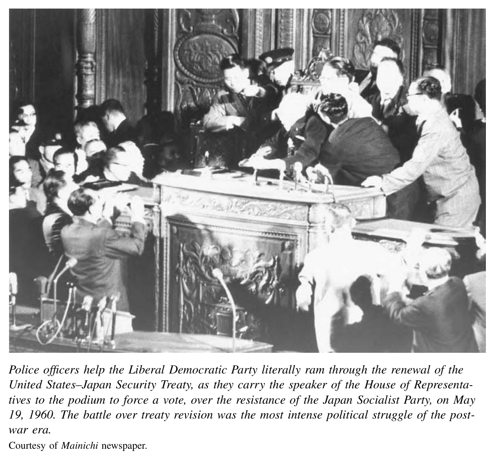
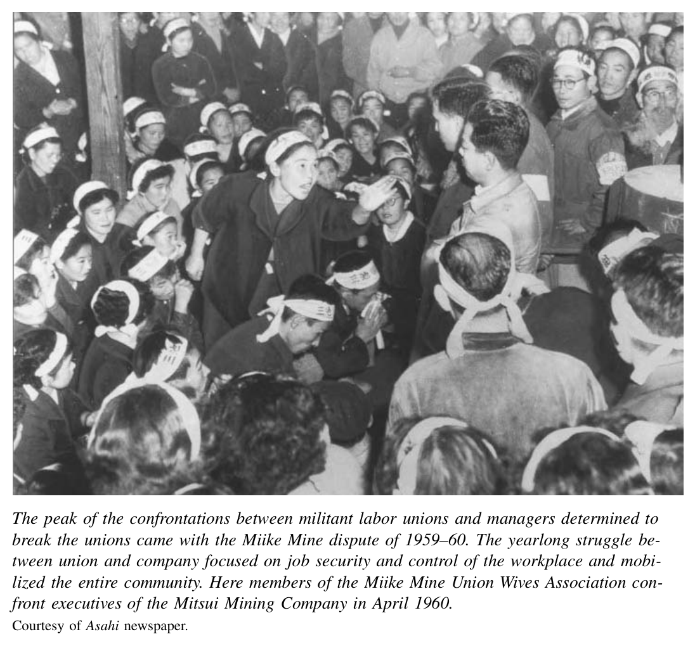
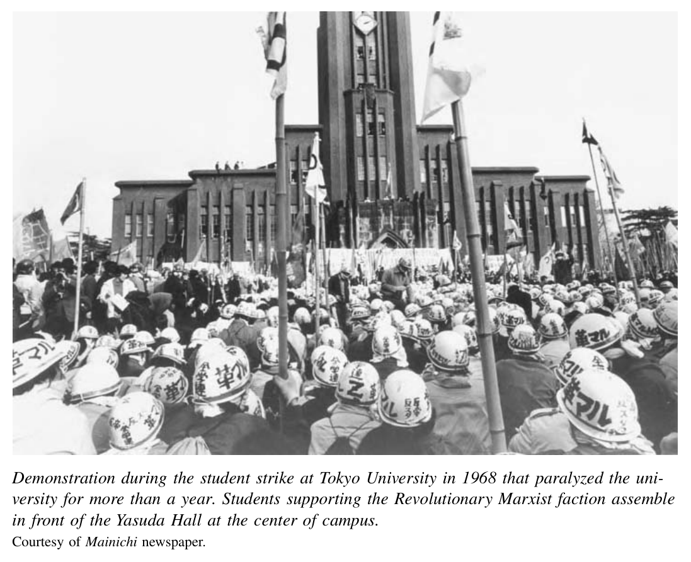
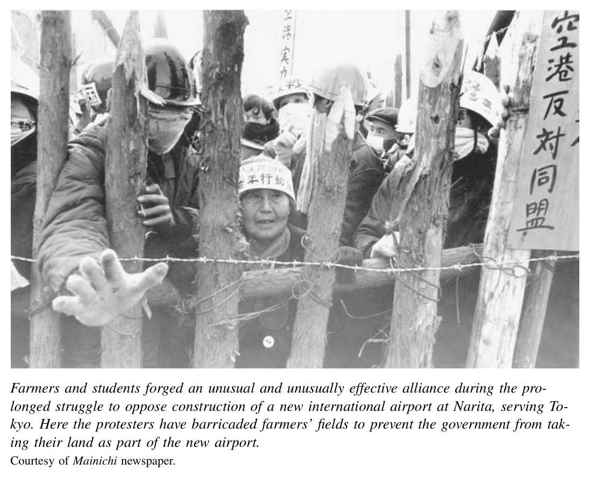

*第四编 战后与当代日本：1952—2000*

# 第十五章 高速增长时代的政治斗争与妥协

战后日本的政治史与经济史，构成了一组鲜明的对照。三十年间，日本经济增长之迅猛、之持续，甚至连美国也开始研究所谓“日本模式”，试图从中汲取成功经验。相比之下，政治领域却屡见尖锐冲突。人们围绕如何分配经济增长的成果争论不休，也围绕日本在国际格局中究竟应站在哪一边这一高度分裂性的问题激烈对立。自20世纪60年代延至70年代，前一个十年那种白热化的政治对抗虽然有所缓和，但新的议题又浮上台面，核心是富裕社会的代价与困境。在国内，超高速增长带来了惊人的环境成本，日本不得不面对如何使人民免受污染之害的问题；在国际上，日本在资本主义与共产主义两大阵营冷战对立中的位置不再像从前那样充满争议，而资本主义世界内部围绕贸易失衡与经济摩擦的紧张关系却日益加剧。因此，战后日本经济的故事，与其动荡不安的战后政治斗争与妥协史，是根本分不开的。

## 政治斗争

占领结束时，全国政治版图仍分裂为两大阵营，当时分别被称作“保守”与“革新”。双方敌意极深，彼此间的全面冲突构成了20世纪50年代最重要的政治事件。不过，这两个阵营内部同样裂痕重重。若不看到这些内部的重大分歧，就无法理解后来政治斗争的结果，也无法理解其后出现的各种妥协与定型。

保守势力的首领是自由党，它与官僚精英和工商界精英关系密切。条约签订时，自由党领袖吉田茂担任首相。1952年10月，占领结束后的第一次国会大选中，自由党获得48%的选票，占据52%的议席。然而，这个党在人物关系与政策路线两方面都存在严重内裂。党内反对派由鸠山一郎领头。和左翼许多批评者一样，他尤其反对吉田甘于在美国霸权之下接受一种“从属的独立”。

民主党则代表了另一种保守主义：它更重视社会问题，也更强调国家主导，其思想渊源可以追溯到战前的民政党。1948年，它曾短暂地与社会党联合组阁。进入50年代初，该党重组为改进党（Kaishintō）。在全国选举中，它的得票与席位都略低于五分之一。与自由党不同，改进党领导人如三木武夫，愿意与社会党内部某些力量合作。随后，1954年，鸠山率领三十七名国会议员脱离自由党，另组新阵营，并与改进党合流，重建日本民主党。在社会党的支持下，他们推动通过了对吉田内阁的不信任案，使吉田下台，并由鸠山出任首相组织新内阁。

革新派内部同样四分五裂。1951年至1955年，日本社会党正式分裂为“左派社会党”和“右派社会党”。左派主张在国内对资本主义进行革命性改造，同时反对片面媾和条约，也反对《日美安全保障条约》。右派则只希望改革资本主义；它接受片面媾和条约，但反对依据安保条约驻扎外国军队。双方各自提出候选人名单，实力可谓旗鼓相当。1952年和1953年的选举中，两派大体平分了约四分之一的选票。到1955年，两个社会党虽然仍然不和，但合计支持率有所上升，共获得29%的选票和略高于三分之一的议席。〔1〕

日本共产党的命运在50年代则急转直下，几乎可以说是灾难性的。1949年，日共曾取得空前进展：赢得10%的选票，并有三十五名代表进入国会。然而，1950年初，苏联严厉批评日共的议会路线。斯大林坚持要求他在日本的盟友采取更激进、甚至带有暴力性质的行动。驻日盟军总司令部（SCAP）便借机推动“红色清洗”，迫使党的领导层转入地下。朝鲜战争爆发后，日共也确实策动了一些恐怖或破坏活动。这一策略反而彻底失败，政党几乎丧尽民望。直到50年代结束，它在选举中得票从未超过3%，在国会中的席位也从未超过2席。即便如此，由于许多知识分子对它抱有强烈支持，其实际影响力仍大于数字所显示的程度。

1955年，日本的政治版图大为简化。社会党两派重新统一。几乎与此同时，作为回应，自由党与民主党也合并成立了自由民主党（LDP，自民党）。工商界精英对社会党的重新统一及其支持率上升感到不安，便动用其作为保守派候选人主要金主的力量，推动这一合并。此后，自民党在接下来的三十八年间始终执政。它不仅巩固了与企业界领袖的长期联盟，也与国家官僚建立了持久同盟。官僚为自民党提供政策专长和组织人力；自民党通过的大多数法律，其实都由官僚执笔起草。许多处于职业中期的高级官僚离开行政岗位，以自民党候选人身份投身选举，并在党内扮演关键角色。自20世纪50年代后期起，其中数人还出任首相。由于这三类精英——政治家、企业家与官僚——关系紧密，人们便将其称为日本的“铁三角”。自民党长期上升并持续执政的几十年，也因此被称为“一党统治”时代。（完整选举结果见附录B。）

虽然1955年之后保守派与革新派在形式上都更加统一，但两大阵营之间、乃至各自内部的重要分歧并未消失。所有保守派都希望实现经济稳定与增长，但官僚、自民党政治家及其经济顾问在如何达成这一目标的问题上，存在根本分歧。整个50年代，最重要的争论之一，是日本究竟应在多大程度上把自身经济命运系于一个日益一体化的全球经济。以有泽广巳、都留重人等著名经济学家，以及经济企划厅的官僚为代表的一派，强调开发日本国内资源的重要性，例如煤炭与水力发电。他们把美国田纳西河流域管理局（TVA）那类由国家支持的大型工程视为典范。由于担心国际冲突会危及石油供应，他们主张尽量减少对进出口的依赖。事后看来，这种看法似乎并不高明；但刚刚经历战争的记忆，以及对未来战争的担忧，使人们对一个相对封闭、自立自足的日本经济抱有相当强的认同。尤其是在能源和粮食供应方面，对外部依赖的恐惧，在此后几十年里始终具有强大的心理与政治影响。

另一派则主张贸易与相互依存，后来也最终占了上风。他们的旗手，很可能是战后最重要的政策型经济学家——中山伊知郎。自20世纪40年代到60年代，他一直活跃于国家在劳动和经济领域的各种咨询机构。中山认为，尽管风险不小，日本其实别无选择，只能拥抱全球经济。日本的资源基础太过薄弱，根本不足以支撑经济自主。他把50年代日本的处境比作一个世纪前的英国，认定日本实现增长的道路在于：进口原材料，出口制成品。〔2〕

在保守派内部，政治战略上的争议也同样尖锐。鸠山及其盟友希望摆脱对美国的依附，走一条更独立的道路。他们希望与苏联实现关系正常化，并在1956年成功做到了这一点；他们也试图与中国建立经济联系，但成效远不如与苏联的和解。相比之下，吉田阵营虽然也未必不厌恶美国的高压作风，却更愿意追随美国，对共产主义阵营实行“遏制”。

在国内政治中，最敏感的问题则是宪法。自民党多数政治家一心想修改这部他们斥为被强行加诸日本的“麦克阿瑟宪法”。鸠山首相（1954—1956）就是其中最激烈的修宪派之一。他尤其希望把天皇明确提升为国家元首，并废除禁止使用军事力量的第九条。与此同时，出于对激进左翼的戒备，其支持者还希望通过宪法设立危机状态下的行政紧急权，从而限制公民自由。

1956年，在鸠山的推动下，国会设立了宪法问题咨询委员会，由三十名国会议员和二十名外部专家组成。不出所料，社会党抵制了这一委员会，坚决维护现行宪法。委员会中的多数成员虽然支持某种程度的修宪，但最终提交的报告态度并不热切，主要只是并列陈述赞成与反对修改的理由。自民党若要完成修宪，需要获得三分之二多数；而即便在其势力最强的1960年，自民党也只有63%的议席，仍然不够。但同样重要的是，保守阵营内部已有相当一部分人开始转而支持战后宪法。在他们看来，天皇作为象征性君主的地位是恰当的：它既使天皇超越于现实政治纷争之上，又能保有其作为国家认同与秩序象征的功能。至于禁止军事力量，他们往往也认为多少带有理想主义的过头之处；但他们同时判断，若真的推动修宪，政治代价会更难承受。到了60年代，修宪的动力逐渐减弱，尽管它长期仍是一个潜藏于台面之下、随时可能引爆激烈争论的问题。

社会党对宪法委员会的公开抵制，只是50年代左右两翼激烈斗争的一个缩影。国会之外，政治左翼还拥有若干相互交叠的社会基础，它们一方面试图捍卫并深化战后国内改革，另一方面则明确反对日美同盟。

其中规模最大的是劳动运动。1949年是战后工会组织率的高峰：共有670万男女加入工会，占就业人口的56%。但工会内部在关键问题上并不一致。相当一部分人愿意听从经营者的呼吁，放缓工资要求，并接受更灵活的岗位调配和新技术引进。他们认为，只有通过这种合作，才能提高生产率和利润，从而从长远上保住工作与工资。这些工会人士也不愿让自己的组织积极卷入反安保条约的政治斗争。在50年代若干具有示范意义的劳资纠纷中，这类工人甚至另组与原有工会对抗的“第二工会”，并与资方联手，削弱围绕工资和就业保障展开的罢工行动。每当原有罢工失败，这些分裂出去的第二工会往往最终占了上风，并逐渐整合出一个主张合作的新多数派。

但到50年代末，这场内部竞争远未分出胜负。多数工会仍采取更激进、也更积极介入政治的立场。它们在全国总工会评议会这一伞形组织之下联合起来，该组织日文简称“总评”（Sōhyō），正式名称为日本工会总评议会，成立于1950年，是由若干反共工会合并而成。美国占领当局在总评成立之初曾表示支持，总评本身也确实与日本共产党保持了一定距离；但与美国人的期待相反，总评很快便成为《日美安全保障条约》的激烈反对者、左翼社会党的盟友，同时也是职场上激进口号与斗争方式的坚定支持者。

整个50年代，在钢铁厂、造船厂、国有与私营铁路、化工厂、汽车厂与煤矿，总评都推行一套被称为“职场斗争”的路线。工会活动家鼓励成员在生产现场发声，争取在工作安全、岗位分配、加班安排等问题上拥有更大话语权。在许多重要企业中，他们正是通过这种自下而上的战术建立起了充满活力的工会。他们所指向的，是一种工会得以分享车间控制权的政治与社会秩序。

这些工会同时还提出大幅加薪的要求。罢工频繁发生，而且斗争十分激烈。1955年，总评开始组织来自不同公司、不同产业的工会，发起一种相对松散协调的全国性工资斗争。尽管资方成功拒绝了正式的产业别集体谈判，这种一年一度的“春季攻势”仍逐渐扎根下来。到50年代末，它已能够为各公司层面的工资谈判设定颇有实效的目标。

和平运动是50年代“革新”推进中的第二个核心组成部分。除工会、社会党和共产党之外，大量市民组织、妇女团体和学生团体也都扛起了战后和平运动的大旗。激发这一运动的两个关键议题，一是《日美安全保障条约》，二是依据该条约得以驻扎在日本的美军基地。到1960年，也就是反安保抗议最激烈的一年，日本本土四大岛上驻有四万六千名美军士兵，分散在数百处军事设施中；而冲绳另有三万七千名驻军。

基地所在地的居民厌恶基地噪音，也痛恨驻军所犯下的暴力和强奸等恶性案件。1952年至70年代间，与非执勤美军人员及日本市民有关的交通事故有数以万计，更发生了十余万起刑事案件，其中大多数是袭击，包括强奸和谋杀。在这些年中，约有五百名日本人死于事故或袭击。批评者尤其愤怒的是，这类案件往往由美国军事司法体系管辖。于是，美军基地便成了“治外法权”的象征，勾起人们对19世纪不平等条约的历史记忆。基地周边密布酒吧和按摩店，抗议者不断唤起“日本女性遭外国人凌辱”的强烈意象。他们还认为，一旦苏美之间爆发战争，这些基地就会成为军事攻击目标，使日本再次沦为核战争的受害者。

和平运动所关切的第二项事业，是核裁军。广岛、长崎的毁灭，以及数万名原子弹幸存者——即“被爆者”（hibakusha）——长期持续的痛苦，使日本的反核运动带有一种特别强烈的道义力量。1954年，日本渔船“第五福龙丸”（Lucky Dragon）在太平洋中部比基尼岛附近遭遇美国热核试验所带来的放射性尘埃，这一事件促使反对核武器与反对核试验的组织动员急剧高涨。50年代出现的最重要反核组织，是“日本禁止原子弹氢弹协议会”（Gensuikyō）。它逐渐成为每年“反核大会”的主要召集者，该会议都在广岛、长崎遭原爆周年之际举行。左翼政党之间的分歧，也导致和平运动内部出现分裂和冲突。但无论各种正式组织如何争执，超出这些组织成员范围之外，反战、反基地、反核情绪在广大日本民众中始终十分强烈。在“第五福龙丸”事件之后，反对核试验的请愿书上，签名者超过三千万人。

妇女与学生也各自建立了种类繁多的政治组织。它们所关注的问题，大多都处在左翼政治议程的核心，包括反基地运动与反核武器运动。无论是妇女还是学生，自明治时代以来就一直活跃于政治之中。一些重要的妇女团体甚至早在世纪之交便已成立，如“基督教妇女改革会”。新的重要组织则包括1948年成立的“主妇联合会”（Shufuren），以及1955年成立的伞形组织“母亲大会”。其下属团体覆盖了极广泛的议题，从劳动权、和平主义、教育，到药物问题、卫生、消费者安全，无所不包。〔3〕

和全世界的女权主义者一样，日本妇女团体在一个关键问题上并不一致：她们究竟应当以普遍人权为基础提出诉求，还是应当从女性特有的关切与特质出发？她们是应该要求同工同酬，并主张女性有权从事任何职业；还是应该强调对女工的特殊保护——而这种保护事实上又可能把她们排除在某些艰苦岗位之外？在某些场合，日本女性主义者确实以普遍人权为基础，主张妇女权利。但即便如此，这些活动家通常也会把这类论述与“母性主义”立场结合起来，即强调女性作为母亲所具有的独特角色。尤其是反战团体，在发表反对核试验或反对安保条约的声明时，往往会诉诸母亲“守护我们孩子幸福”的特殊愿望。〔4〕

这类诉求借用了战前国家“贤妻良母”的话语，却又有力地把这套话语翻转过来，用以推动女性获得新的角色与权利。

妇女在工会中也很活跃。50年代，当男性工人的激进行动往往屡遭挫败之时，女工却取得过一些引人注目的成功。1954年，近江缫丝公司的1500名女工组织罢工，要求公司承认她们的工会，废除严格的宿舍管理规定，停止检查她们的信件和私人物品，并承认女性婚后继续工作的权利。她们的行动聚焦于许多人当时已开始视作战后民主之下日本人基本权利的那些诉求——而女性当然也包括在内。缫丝女工的斗争赢得了广泛关注与支持，最终取得胜利。1959至1960年间，东京及其他地区工会化的护士和医院工作人员也取得了类似成果。她们除了争取更高工资，也要求获得类似的基本自由，尤其是婚后继续工作的权利。其结果是，已婚护士的比例从1958年的区区2%，到20世纪80年代上升为69%。这一行动使护理工作不再只是年轻女性婚前的一份短期差事，而转变为一种成年女性可以长期从事的职业。

学生运动也是革新派推进中的另一支关键力量。其核心组织是1948年成立的“全日本学生自治会总联合会”，简称“全学联”（Zengakuren）。这些“自治会”几乎存在于所有大学校园，就像实行“闭锁工会制”的工会那样，把全体学生自动纳为成员。最初，全学联由日本共产党的学生成员所主导。50年代初，日本共产党遭到打击并丧失社会支持，全学联也因此受到重创。但“第五福龙丸”事件重新激活了学生运动，也重新点燃了反战运动。到50年代末，学生已经成为各种政治事业和街头示威中的重要力量，其活动范围远远超出校园之内。

进入50年代后期，这些“革新”力量充满信心，也精力充沛，给人的印象是正在上升。尽管遭遇过一些挫折，许多工会仍保持相当激进的姿态；学生与妇女团体都拥有热情高涨的支持者；和平运动则拥有数以百万计同情者构成的广泛基础。社会党已经重新统一。无论城市、村镇还是乡村，又都出现了许多市民自发组织起来的各种“小组”或“圈子”。这些团体一方面从事音乐欣赏、诗歌写作等文化活动，另一方面也常常编入更大的网络，并与工会或政党建立联系。

正是从这股活力之中，50年代末掀起了一波民众抗议浪潮，并在1960年爆发为一场重大危机。这场大戏的第一幕，是1958年围绕拟议中新《警察官职务执行法》而起的抗议。自民党原本打算利用这部法律，强化警方的“紧急权力”，以便压制示威并监视左翼。结果，这项法案反倒激起了它本想遏制的运动。工会和政党领导了一轮声势浩大的示威。由于民意反对，再加上国会中反对派团结一致，自民党最终退让，再也没有把该法案付诸表决。

紧接着，1960年，两股大规模抗议浪潮汇合，使这一年成为战后日本历史上最动荡的一年。冲突的起点，是《日美安全保障条约》，亦即“安保”（Anpo）。原条约规定八年后到期，因此若要使条约在1960年6月后继续生效，就必须由美国国会和日本国会批准一份新的续约文本。经过数年的谈判，两国政府终于在1960年初就修订后的安保条约达成一致。其基本结构并未改变：美国基地负责“保卫”日本，而日本则接受这些基地的存在，为其支付部分费用，并在紧急状态下协助保护这些基地。为了回应一些关键批评，条约作了若干小修改，例如美方承诺，如计划将核武器运入日本领土，将事先通知日方。但条约同时规定，除非任何一方主动要求变更或终止，否则以后均自动续期。

随着1960年6月期限逼近，一股强大的反对续约浪潮出现了。社会党、学生团体、妇女团体，甚至连自民党内部某些人，都反对日本几乎永久性地继续维持在美国霸权之下这种“从属的独立”。他们也反对日本继续冒着被卷入更大战争的风险。从4月起，东京街头爆发了数十场示威。面对日益高涨的舆论喧哗，岸信介内阁于5月19日深夜几乎是“硬把”法案推过了国会。国会警察横着抬起众议院议长，像人肉撞木般穿过反对党议员组成的人墙，把他送上主席台；他随即宣布开会，并以闪电表决方式通过了法案。

这一做法立刻引发更大、更激烈的抗议。此后数周，每天都有大规模示威在国会附近举行。规模最大的一次，按最保守估计也有十几万人，实际人数甚至可能超过二十万。艾森豪威尔总统已经接受邀请，准备于6月19日亲赴东京参加隆重的签字仪式；这原本将是美国在任总统首次访日。6月10日，艾森豪威尔的新闻秘书詹姆斯·哈格蒂先抵达日本，为总统访问作准备。愤怒的示威者包围了他的汽车；当他从机场前往美国大使馆途中，人群甚至威胁要把汽车掀翻。最后，哈格蒂是靠美军直升机才脱险。6月15日的另一场示威中，一名年轻女性丧生。抗议者指责这是警方暴力所致，而警方则称她是在示威者溃退时被踩踏致死。由于担心安全无法保障，艾森豪威尔在最后一刻取消了访日。岸信介的政治信誉因此彻底瓦解，最终辞职。但他的目标已经实现：条约顺利通过，日美军事同盟得以长期固定下来。

6月19日新条约正式生效后，街头示威逐渐平息。但反对派的政治能量很快转向另一场正在远在九州南部展开的就业斗争——三井公司的三池煤矿劳资冲突。

日本采矿业在几年前便已开始缓慢而痛苦的衰退。随着经济高歌猛进，能源需求也同步飙升。到50年代末，石油已经明确证明自己比煤炭更便宜，而国外供应看起来也大体可靠。包括三井在内的矿业公司为了求生，纷纷试图通过引进新设备提高生产率，并大幅裁减岗位。三池工会在

〔译注：原图注在此处已截断。〕

这种险恶环境下，站到了总评旗下激进工会所推动的车间斗争最前线。经过50年代数次劳资冲突，矿工们凭借这个相对封闭、同质性较强的社区所形成的强大团结，建立起了一个力量惊人的工会。工会的“职场委员会”甚至已开始掌控岗位分配、加班安排以及安全标准等事务。他们这种草根式的工会行动，不仅成为其他工会争相效法的典范，也被全国工业界视为重大威胁。因此，1960年的三池斗争具有超出一矿一厂的全国性意义。借用战争时期的政治语言，当时有人把它称为“劳资之间的一场总体战”。

公司拟裁掉约一万三千名工会成员中的两千人，这一计划直接引爆了冲突。三井不仅决意通过引进设备和削减劳动力来“合理化”煤矿，还打定主意要借此清除工会活动家、打垮工会，从而夺回车间控制权。1959年10月，工会首先发起了数次限时罢工中的第一次，以反对这一“合理化”方案。12月，公司正式宣布裁员，而裁撤对象确实特别针对工会领导人。到1960年1月，公司实施停工封厂（lockout）；工会则宣布全面罢工。约有四千名矿工在公司支持下，立即另组一个支持资方的“第二工会”，并试图恢复工作。

然而，绝大多数矿工仍站在原有工会一边。工会成员表现出惊人的纪律性与坚忍，靠着相当于正常工资约三分之一的工会补助，坚持了整整十个月。到了6月和7月，安保条约续签之后，大约一万到两万名先前参加反安保示威的群众和工会同情者又赶到三池，声援罢工者。几个月里，纠察队一直阻止第二工会成员进入矿区工作。双方多次在极度紧张的对峙中几乎爆发大规模暴力冲突。资方雇来的带有黑社会色彩的打手杀死了一名矿工，整个斗争期间受伤的矿工则超过一千七百人。

为了维持秩序，政府出动了一万五千名警察，约占全国警力总数的10%。与此同时，其他煤矿保持开工，并临时向三池的客户供煤，哪怕这意味着不得不减少本矿原有客户的供应。依靠这种资方之间的团结以及国家的默认支持，三井最终拖垮了工会。1960年秋，原工会被迫

接受政府出面斡旋的和解方案。经过313天的罢工，公司赢得了实施全部“合理化”计划的权利。

同年10月，一名隶属极右组织的青年在一次政治集会上刺杀了日本社会党委员长浅沼稻次郎。这位深受欢迎的政治家曾于前一年发表言论，称美国帝国主义是中国人民与日本人民共同的敌人，因此引发巨大争议。而此案之所以震动格外强烈，还因为刺杀发生在电视直播中的一场演讲现场。正当三池斗争行将结束之际，这场恐怖袭击更使全国的政治危机气氛陡然加重。

## 妥协政治

经历了1960年的一连串剧变与创伤之后，日本政治气候逐渐趋于平静。在右翼一方，自民党、官僚机构以及工商界中的关键人物开始淡化修宪和对抗工会的议题，转而强调推动经济增长、改善民众福祉，以争取至少一部分政治反对派的支持。他们在国会中的策略也有所改变：对许多法案，他们开始先私下与反对党协商，再作一些象征性修改，以换取其支持。左翼方面，工会运动中主张合作——或者说已被体制吸纳——的一支，以及日本社会党内部较保守的一翼，也开始回应这一变化，放弃在车间问题和国际问题上坚持对抗政治。由此，日本的高速增长时代形成了一种以调适与妥协为特征的新政治。

这一自民党新路线的核心，是池田勇人首相提出的“所得倍增计划”。该计划于1960年9月公布，提出的目标是：到1970年，通过使国民生产总值翻一番，“迅速实现充分就业并大幅提高人民生活水平”。〔5〕这项计划正体现了学界后来所谓“发展型国家”的核心理念，即国家对市场经济进行引导。〔6〕计划为重点产业投资设定了明确目标，主张企业之间并购与协作，并承诺由政府在引导民间部门朝这些目标前进的过程中发挥积极作用。池田还通过减税和降低利率进一步刺激经济。结果，日本经济事实上比预定时间提早大约三年就实现了规模翻番。

所得倍增计划，其实只是保守派一套政治战略的组成部分；这套战略在表面动荡的政治冲突之下，已经悄然酝酿了将近十年。整个50年代，自民党一直试图与若干社会群体建立联盟，藉此超越自己战前那种以地主和工商界精英为核心的传统基础。首先，自民党与因土地改革而获得土地所有权的数百万农民之间，达成了第一批隐形“社会契约”之一。50年代，政府通过管制米价，使农民免受市场波动冲击。随后在1961年，新的《农业基本法》又建立了更为慷慨的价格支持制度。作为交换，自民党赢得了农村选民的稳固支持。而且，由于自民党在城市化推进、人口持续向城市流动的过程中，迟迟不愿调整选区边界，农村选区在国会中一直占有比例失衡的较多席位。

自民党的第二个核心支持群体，是大量小规模企业主及其家属、雇员。整个战后时期，在制造、零售和批发等行业中，员工不足三十人的小企业，一直占据非农就业人口的一半以上。依托战前既有的组织基础，这些小企业形成了一套强有力的利益游说网络。自50年代初起，自民党便以多种方式予以回应。政府对小企业征税较轻，而且执法并不严厉。1956年，自民党还通过了《百货店法》。这部法律实际上使大型零售商和超级市场几乎不可能进入成千上万由“夫妻店”式小商铺主导的城市与郊区商业街。这些商店使高速增长时代蔓延扩张的日本城市景观，仍保有一种小城镇般的气息；而它们的老板和雇员，也为自民党在城市选区提供了至关重要的选票支持。〔7〕

构成自民党统治社会基础的第三方，来自一个看似不太可能的来源：大企业中那些薪资雇员，包括白领和蓝领，而且他们大多集中在工会组织率较高的部门。美国在推动自民党、企业经营者与有组织劳工之间建立良性关系方面，也发挥了作用。1953年，日本政府在美国帮助下成立并资助了一个半独立机构，名为“日本生产率中心”（JPC）。该机构宣称，提高生产率将“扩大市场、增加就业、提高实际工资与生活水平，并推进劳资消费者的共同利益”，很快便把活动扩展到全国各地的工厂。〔8〕成立头两年，它就派出五十三个由管理者和工会领袖组成的小型考察团，赴美学习“生产率”之道。此后，这类交流的规模不断扩大。

一些重要工会认同这一“生产率运动”，这些劳工组织也逐渐成为执政体制的非正式组成部分。较为保守的两个工会联合体——总同盟（Sōdōmei）和全劳（Zenrō）——同意接受新技术引进，条件是资方必须保证工作岗位，并把生产率提高所带来的收益以加薪的形式分享给工人。相反，总评则强烈反对日本生产率中心，认为如果工会不能在工作条件的设定上拥有更强的话语权，那么新技术最终只会导致失业增加、劳动条件恶化。不过，从整体看，工会的反应仍使劳动省在1957年高兴地宣布：日本主要制造企业中已经出现了“对于生产率运动的一种实践性的、而非抽象的回应”。〔9〕

这种合作精神并不是立刻就占据主导。1957年和1959年，钢铁业爆发了使生产一度陷入停顿的激烈产业斗争；1960年，三池煤矿更是如此。总评所代表的激进战术和“革新”政治纲领，在公营部门雇员当中仍然拥有相当支持。国铁工会、邮政工会、都道府县与市町村政府雇员工会、公立学校教师工会，都希望争取更高工资，并要求在工作节奏与工作条件上拥有更大话语权。他们尤为不满的是，自1949年以来，自己一直被剥夺罢工权。作为50、60年代每年春季工资攻势的一部分，这些公营部门工会发展出一整套介于正常工作与公开罢工之间的“怠工”战术。国铁工会试图通过争取一定的工会控制权，使职场“民主化”，例如在监督者权威、晋升与工资中能力与年功资历各占多少比重等问题上施加影响。到1967年，工会已经迫使铁路系统设立“职场协商委员会”，使工会得以左右岗位分配和晋升。到70年代初，这一工会更迫使铁路管理层恢复把年功资历作为晋升和加薪的重要标准。〔10〕

然而，在私营部门，自50年代后期至整个60年代，劳动运动的激进力量在“生产率运动”的吸引之下逐渐衰落。〔11〕

经历了一系列苦涩的冲突之后，主张合作的工会领导层在大多数私营部门工会中取得控制权。他们的理由是：在国内外竞争都日益激烈的情形下，若想获得长期的就业和工资保障，就必须在短期内对工资要求保持节制，并在工作条件和技术引进上表现出灵活性。公营部门职工因其工作较少直接暴露于全球经济竞争之中，通常不太接受这套说法；而私营部门工人则在软硬兼施的激励之下，往往被说服接受。大企业中的劳务管理者也通过种种方式笼络员工。他们扩大了各种企业福利项目，这显然是有意识地要先发制人，压制工会所提供的类似福利活动的吸引力，并在员工心中培养对公司的归属感与义务感。这些福利中，有些可以追溯到战前或战争时期，有些则是新设的。到了60年代，大企业员工几乎享有一整套从“摇篮到坟墓”的福利：公司医院、医疗诊所和商店，单身员工宿舍，已婚员工家庭公寓，公司所有的度假设施，公司组织的旅游、运动队和音乐节，通勤列车上的社交俱乐部，面向员工妻子的社团，等等。与此同时，那些坚持激进立场的异议者，则不得不面对管理层在晋升与加薪上进行区别对待的严峻现实。

管理层还逐渐向员工作出了某种隐性的就业保障承诺。在整个高速增长时期——甚至在其后——除极少数情况外，大企业即便在景气低迷时，也很少直接解雇工人。它们会与工会协商，尽力把多余员工调往其他部门或附属公司。这类政策后来常被概括为“永久雇用”或“终身雇佣”，但这一说法多少带有误导性。一方面，日本大企业中所谓“终身雇用”的男性员工中，其实有相当多人是主动离开的。以60年代制造业为例，新招募的年轻男性工人中，通常有三分之一到三分之二会在五年内辞去第一份工作。另一方面，公司也发展出了一套不诉诸直接解雇、却足以迫使多余或“不受欢迎”员工离开的手段，例如要求其“自愿退休”。

随着这些企业政策逐步落实，职场上经理与员工之间的敌意程度明显下降。与此相伴，在国家政治层面，主张合作秩序的人士推动了一次重大的重新组合。1960年1月，日本社会党的“右派”再次脱离，这一次组成了民主社会党（DSP）。该党成立之初，在众议院拥有41席；而社会党本流在革新阵营中仍保持明显多数，拥有125席。工会运动中较为保守的两个联合体——总同盟与全劳——都支持这一分裂。1962年，它们进一步合并组成新的工会联合体“同盟会议”（Dōmei Kaigi），拥有140万成员。相比之下，总评的成员数则有410万。〔12〕无论在政党还是工会组织方面，“革新”政治力量如今都分裂为左翼多数与右翼少数两部分。不过，即便人数不占优势，这个偏保守的少数派一旦成为自民党的潜在合作者，其政治意义仍远大于表面数字。

1964年，这种走向非正式中间联盟的趋势又向前迈出了关键一步。总评体系内部分私营部门工会——来自汽车、造船、电子和钢铁产业——联合起来，跨越原有全国总联合的界限，结成一个合作派联盟，名为“国际金属工人工会日本协议会”（简称 IMF-JC）。该组织与总部设在北美和西欧的反共国际金属工联相呼应，主张工资要求应当克制，罢工作为谈判手段也应更为节制。

自民党内部的战略家则加紧拉拢这些盟友。他们非常清楚地意识到，人口正在从农村流向城市，从农业转向制造业和服务业。他们认为，这种趋势虽然使社会党天然成为受益者，却并不意味着社会党必然得利。因此，他们主张自民党应提出一项“劳工契约”，主动向“合作派”工会伸出橄榄枝，为大多数劳动者提供安全感与更好的生活前景。〔13〕1964年，在 IMF-JC 成立的鼓舞下，池田首相前所未有地与总评议长太田薰会面，讨论工资问题。双方同意，把公营部门雇员的工资增长幅度与私营部门工会所争取到的加薪幅度挂钩。池田希望借助更合作的私营部门工会，来压低公营部门的工资诉求；而太田则希望利用这次坐上谈判桌的机会，在未来争取更大的发言权。自由民主党正逐渐变成一个“包容性大帐篷式”政党。政治世界正在从对抗政治，转向妥协政治。

即便如此，紧张关系并未完全消失。总评的规模仍远大于同盟；日本社会党的规模也仍远大于民主社会党。事实上，民主社会党在选举中的表现并不理想。1962年，也就是该党成立后的第一次众议院大选中，它的席位大幅从41席跌至17席，而日本社会党则跃升到145席；此后民主社会党再也没有恢复到创建时的声势。激进工会仍在积极组织春季工资攻势，并继续支持各种政治事业。

与此同时，新的重大冲突也不断出现，新的政治行动形式也随之发展。观察者把它称为“市民运动政治”。这是一种以非党派精神和相对分散的草根组织方式为特征的行动形态。市民运动的浪潮在60年代后期和70年代初达到高峰，但其中一些团体在此后仍然持续发挥作用。

推动50年代反安保抗议的那种和平主义情绪，以及对日本主权受损的愤怒，也同样为新的市民运动注入了动力。到了60年代中期，这种精神凝聚成一种富有创造力的新型抗议形式，成为反对日本充当美国越南战争后方基地运动的一部分。抗议者既担心日本会被拖入更大规模的战争，也认为美国是在一场内战中以残酷而帝国主义的方式进行干预。1965年，基层市民团体组成了一个松散而非等级化的网络，名为“给越南和平！市民联合”，日文简称“贝平连”（Beheiren）。〔14〕几个设在东京的刊物将各地团体联结起来；到60年代后期高峰时，地方团体数量接近五百个。贝平连最引人注目的地方，在于它没有正式成员名册、没有规章、也没有会费。一项估计认为，仅在1967年至1970年的高峰期，就有超过1800万人以某种方式参加过反战抗议。1970年6月，针对《日美安全保障条约》自动续期的最大一次抗议，单次就有77万人走上街头。较少为人所知、却同样重要的是，贝平连支持者还曾援助从美军中出逃的士兵，并帮助组织基地内士兵的反战活动。〔15〕

随着战争接近尾声，贝平连在1974年解散。对其中许多人来说，一大失望在于，他们未能在1970年成功掀起一场足以阻止《日美安全保障条约》第二次续期的运动。1960年，条约续期必须经表决批准，因此主张续约的一方必须承担推动议会行动的政治负担；而1970年的续期则是自动生效，除非日本国会（或美国国会）主动决定终止。这一程序差异，使议会行动的负担落到了反对者一方。这在很大程度上解释了为何1970年的抗议即便规模巨大，却收效甚微。但参加过这些反战、反基地行动的许多学生与成人，后来转而投身于其他议题和其他形式的市民抗议。

与贝平连并行，在60年代后期，日本大学生也像世界各地的同龄人一样，发动了激烈而且常常诉诸暴力的抗议。在此之前十多年里，学生运动核心组织全学联就一直深陷派系冲突：一边是与共产党有关联的派别，另一边则是非共产主义的“新左翼”。不过，到了1968—1969年反战运动高峰时期，全国超过一半的大学校园里，学生激进派前所未有地联合起来，发动了罢课与抵制运动。他们反对学费上涨，要求课程改革，并要求在大学治理中拥有更大权力。1969年春，许多大学校园几乎完全停摆。全学联转向一种被称作“格巴”（geba）的武斗战术，这个词源自德语 Gewalt，在日语里常与“暴力”或“强制”相连。头戴安全帽、挥舞木棒的游行者如蛇阵般占领教学楼和宿舍。同年春天，东京大学历史上第一次没有招收新生。这场运动在1969年夏天迅速崩溃，原因是公众舆论开始反感学生所采用的手段。政府随后向全国各校园派遣防暴警察，重新夺回控制权。

在这些暴力抗议及其被镇压之前，日本主要大学里的学生活动家毕业后进入企业或政府机构任职，是相当常见的事。当时据说主流雇主看重的是他们所表现出的“领导能力”，哪怕这种能力是在反体制抗议中展现出来的。1969年的危机之后，这种态度似乎发生了变化。社会上开始流传企业将学生活动家列入黑名单的说法。从70年代开始，学生运动的力量与影响迅速下滑。

也许，最有效的新型市民行动领域，反而是环境问题。随着工业扩张毫不松懈、甚至常常鲁莽行事，空气和水质都迅速恶化。环境被破坏的代价，以及工人和居民健康受损的代价，既没有被强加给生产者，也没有由政府承担；当然，它们也没有从不断飙升的国民生产总值中扣除。甚至，如果环境破坏反过来又刺激出新的经济活动，比如修建净水设施，或在医院治疗污染受害者，那么这些商品和服务还会被直接记入“增长”的经济数字之中。

早在50年代，各种与污染有关的严重疾病症状就已

出现。日本南部水俣附近的化工厂周边居民，以及北部新潟地区的居民，都因汞中毒而患病乃至死亡。富山县神通川流域妇中地区居民因镉中毒而剧痛不已，这种病被称作“痛痛病”（itai-itai byō）。位于日本中部工业化海岸带上的三重县炼油厂周边，则爆发了大规模严重哮喘。横滨、川崎（均近东京）以及尼崎（近大阪）等重工业城市，也出现了类似病症。在这些以及其他案例中，受害者其实从一开始就试图寻求补偿，但50年代和60年代初的努力几乎毫无效果。污染企业通常否认责任，阻挠调查，而地方政府与中央政府都相对消极。

到了60年代中期至70年代初，与反战抗议者一样，各地公害受害者开始主动联络，建立起强有力的全国性支援网络。他们创造出静坐、抵制等抗议方式；购买污染企业的象征性股份，借此闯入股东大会进行抗争；同时也转向法院，以诉讼方式要求赔偿。1971年至1973年间，在被称作“四大公害诉讼”的一系列标志性判决中——包括水俣病、新潟水俣病、镉中毒案以及大气污染哮喘案——受害者全部胜诉。

这些判决树立了重要先例，迫使政府和企业在此后不仅要承担补救责任，也必须采取预防措施。

其中有一场格外激烈的抗争，把学生运动中的某些力量与通常立场相对保守的农户家庭联系到了一起，这就是反对在千叶县成田镇附近修建新国际机场的长期斗争。东京现有的羽田机场容量显然无法适应迅速增长的航空运输需求，因此新机场规划于1966年启动。政府之所以选定该址，是因为所需土地中有一半很容易取得——它属于皇室，原本是狩猎场。但政府处理此事的方式既高压又笨拙，试图迫使当地农民出售其余土地。于是，一个强有力的农民—学生联盟迅速形成。对学生活动家而言，这场斗争是一个攻击官僚国家傲慢与压迫性的机会，而他们认为这种国家正是战后资本主义体制的核心；对农民而言，起初的目标则很简单：保住土地，守住社区。只是到了后来，许多人也逐渐接受了学生所提出的更广泛政治批判。抗议者几乎真是掘地为营，准备进行长期抗争。他们在争议土地下修筑起复杂的地道系统，拒绝搬离。机场工程于1969年开工，但抗议者使跑道建设从原定1971年拖延到1975年，又继续阻挠机场开放，直到1978年才终于启用。其间，身披重装的警察与顽强抵抗的农民、学生之间，曾发生过多次广受媒体报道的激烈冲突。尽管大多数市民并不赞成部分活动家所采取的暴力手段，成田斗争仍迫使政府在此后类似大型工程中，更认真地回应市民关切，采取更为和缓的方式。〔16〕

20世纪60年代和70年代，还发展出其他若干重要的市民行动形式。〔17〕这些包括监督产品安全的运动，以及力求以合理价格向消费者提供新鲜食品的大众消费合作社网络。妇女和男性一样，活跃于各种市民抗议中，从反战与学生运动到环境组织，无不有她们的身影；但在与家庭生活相关的领域中，她们尤其突出。消费者运动并不支持那种毫无批判的物质主义式“消费主义”。它们强调产品质量与纯净性，甚于强调低价；同时还与农民合作组织以及主张保护本国产品的政府机构建立了密切联系。事实上，它们对安全标准的强调，有时也遭到国外批评，且这种批评并非毫无根据——因为这些标准确实常常成为一种伪装的保护主义形式。

从60年代后期到70年代，这股新的市民运动政治又与较早形成的政党政治结合起来。在全国各地的大中小城市中，居民围绕环境问题、改善公共住房、反基地斗争等议题组织起来，帮助社会主义者或共产党人赢得地方政权。到1975年高峰时，全国多达147个城市、城镇或都道府县——其中包括东京、大阪、京都、横滨、名古屋、川崎、神户七大城市——都由左翼政党的市长或知事领导。

这一趋势被称作“革新地方政府”时代。这是日本近代史上颇为特殊的一个时刻：地方政府在某种意义上走在了中央政府前面。它们在环境

〔译注：原图注在 “N” 处中断，依上下文判断应指成田（Narita）。〕

立法、社会福利等诸多领域率先采取行动。最著名的革新派地方领导人大概是美浓部亮吉——一位由教授转型为政治家的学者，他在1967年至1980年间担任东京都知事。〔18〕他因率先推行诸如东京都居民免费医疗保险等政策，而赢得了广泛支持并引人注目。

面对反对派在地方层面的空前进展，中央官僚机构和自由民主党采取的策略不是硬碰硬，而是“跟进并吸纳”。自民党把地方政府倡导的措施纳入了全国政治议程。1973年，它宣布这一年为“福利元年”，大幅扩充了养老金和医疗保险制度。同年，自民党还强化了环境立法，通过了《公害健康损害补偿法》。这部法律使公害受害者更容易获得一定程度的经济补偿和医疗照护。尽管到70年代后期经济放缓后，政府各部和自民党又通过提高保险费或削减福利的方式，对这些更为慷慨的新方案有所收缩，但上述举措仍帮助保守派重新赢回了城市地区的支持。

推动中间路线政治的另一个新因素，是以宗教为基础的公明党（Clean Government Party，CGP）。它的支持基础来自极受欢迎的新兴宗教“创价学会”（Sōka Gakkai，“价值创造学会”）。创价学会中的一些领导人自50年代起便开始以“清洁政治”为口号谋求公职。1964年，创价学会正式推出与之相联系的公明党。到60年代末，公明党已成为国会中继自民党和日本社会党之后的第三大政治力量。此时，社会上开始批评它违反了战后宪法所规定的政教分离原则。公明党于是宣布切断与创价学会的一切正式关系，尽管实际上，党的许多候选人与绝大多数选票支持仍然来自创价学会信徒。公明党自称为“中间政党”。它支持更强的社会福利政策，也维护战后宪法，但同时接受资本主义体制的基本框架。在地方选举中，它往往支持日本社会党的革新派候选人；同时，它也迫使社会党与自民党在争夺公明党支持者选票的过程中，双双向中间靠拢。

60年代草根行动的繁荣，并不限于政治左翼或中间派。右翼最引人注目的行动之一，是恢复纪念日本“建国”的节日。明治国家在19世纪70年代曾相当武断地把2月11日定为“纪元节”（Kigensetsu），并宣称这是公元前660年传奇中的神武天皇创建帝国国家的周年日。这个节日于1948年被占领当局废除。自50年代至60年代，一场恢复这一节日的运动逐渐展开。值得注意的是，这场运动不仅得到从吉田茂开始的保守政治领袖支持，还在战术上呼应了“市民运动”的做法，通过分散于各地的网络动员了大批支持者。神社神职人员协会在运动中发挥了关键作用，各地乡镇中的保守派市长和地方议员也同样积极参与。1966年，国会通过法律，将2月11日定为“建国纪念日”，运动看来似乎大获成功。但与更意识形态化的支持者所期待的不同，这个节日并没有恢复战前那种以崇拜天皇为核心的强烈宗教色彩。

## 全球联系：石油危机与高速增长的终结

日本长达多年、以两位数增速狂飙突进的经济增长时代，在1973年秋天戛然而止。那年10月中东战争爆发后，主要阿拉伯产油国限制了向包括日本在内、与以色列结盟国家的石油出口。短短数周内，油价暴涨至原来的四倍。日本政府很快——有人说甚至近乎屈辱地——与以色列拉开距离，突然转而表示支持巴勒斯坦人建立家园的权利。这样做缓解了眼前危机，使阿拉伯产油国重新恢复对日供油。但巨额石油进口成本仍导致国际收支出现逆差，更高的能源价格又引发严重衰退，也带来了自40年代以来最严重的通货膨胀。1974年，消费价格上涨了25%；而且，自40年代以来，国民生产总值第一次出现负增长：1974年下降了1.4%。

这场后来被称为“石油冲击”的危机，带来了深远的社会与文化影响。日本经济命脉所依赖的能源供应一旦受阻，恰恰印证了那些主张经济自给自足者最坏的担心。它凸显出资源贫乏的经济体在一个相互依存世界中的脆弱性，同时也强烈唤起了战争时期和战后初年那种匮乏记忆——对当时四十岁以上、亲历过那个时代的数百万成年人来说，这并非遥远往事。消费者于是突然开始囤积各种商品，最先遭抢购的就是洗涤剂等石化制品。由于成千上万的主妇涌入超市，把货架上的生活必需品一扫而空，舆论甚至把这一现象称作“卫生纸恐慌”。

危机也促使政府制定长期计划，以减少日本对石油总体上的依赖，尤其是对中东石油的依赖。官僚体系加快了兴建核电站和更多水力发电站的计划，同时资助开发各种替代能源项目，从页岩油、太阳能，到试图利用海浪运动发电的平台，无不在列。与此同时，政府还发出“节约能源”的号召，这种语调分明让人想起战时的节俭话语。通商产业省（MITI）的大臣们在冬天调低暖气，在夏天减少空调使用，并要求学校和政府机关照办，也呼吁其他机构跟进。夏天，他们还以一种新的办公室装束上班：不打领带，穿短袖衬衫。节约与多元化并举的结果，多少取得了成效：来自中东的石油在日本石油总供应中的比重，从1970年的85%下降到1980年的73%。

短时期内，两位数的通货膨胀也刺激了激进劳工抗议的短暂回潮。整个60年代，有组织劳工在要求和策略上已相对温和，但在1974年春季工资攻势中，许多行业的工会又一次发出了可信的罢工威胁。结果，它们赢得了历史上最大幅度的加薪：起薪平均上涨33%。

公营部门雇员尤为激烈。与私营部门工会不同，它们的激进性在60年代不断增强，并在70年代初达到顶点。然而，工会领导人显然忽视了更广泛社会舆论已经转向敌对这一事实。1973年春季工资攻势期间，铁路工人以严格照章作业的方式制造高峰时段延误和极端拥挤，激怒了通勤乘客，结果在27个车站爆发骚乱：愤怒的人群殴打司机，砸毁列车。

真正的转折点出现在1975年末。超过一百万公营部门职工参加了“争取罢工权大罢工”。〔19〕这场公营部门总罢工最终失败。劳动运动未能形成广泛动员，例如私营铁路公司的工人就没有加入。社会公众反应冷淡。与15年前的三池斗争相比，这一次几乎没有学生前来声援。一周之后，工会在毫无重大收获的情况下宣布罢工结束。政府随后对大约一百万名职工作出惩戒处理，并开除了1015名参与非法罢工的领导人。从此，公营部门工会开始了漫长而缓慢的衰落。〔20〕

与此同时，私营部门的主要工会也迅速收缩了前一年那种咄咄逼人的要求。企业经营者和政府领袖都呼吁，为了抑制通胀、恢复企业利润并保障长期就业安全，工会必须在工资要求上保持克制。以 IMF-JC 为中心的主要出口产业工会干部认同了这套逻辑，并开始为私营部门每年的工资要求定调。1975年，它们接受的工资增长平均只有13%，仅为上一年的三分之一。在造船等受打击最严重的行业中，它们还接受了大规模裁员；成千上万的老职工被迫提前退休。工会把这种牺牲施加于部分成员身上，以换取对其余成员作出的长期安全与共享利益承诺。普通工人往往会怀疑这种过于迅速的合作是否明智，但反对者已无力改变工会高层所作出的决定。在环境政策、福利政策以及劳资关系等诸多领域，一种以妥协与调适为特征的政治体制，至此已经牢固扎根。

从20世纪50年代到70年代，日本由贫穷走向富裕、由对抗走向调适的轨迹，本就是战后全球历史的一部分。欧洲那些满目疮痍的经济体，尤其是德国与意大利，也在这些年代里经历了各自的“奇迹式”复苏。起初，美国援助在所有这些国家都发挥了关键作用；美国推动建立一个更开放的世界贸易体系，也同样重要。无论在欧洲还是日本，美国的电视节目和电影都传播着对富足生活的想象，以及中产阶级消费者那种崭新的光明生活梦想。美国输出的技术，以及冷战时期扶植非共产主义政治力量的项目，也影响了世界各地的经济和政治历史。

美国对日本的一部分影响是隐蔽进行的。20世纪50年代，美国中央情报局曾向自由民主党中的反共盟友提供资金。〔21〕情报人员还致力于扶持亲企业的工会人士，阻挠那些拥有激进愿景和强硬斗争策略的力量。美国在战后日本——以及世界许多地方——所扮演的这种隐蔽角色，究竟有多大，已无法完全考知。但可以相当有把握地说，它使政治天平更倾向于后来逐渐形成的那种调适性安排。

冷战高峰时期，美国对日本的其他政治外展则更加公开。1961年，新当选的总统约翰·肯尼迪任命爱德温·O·赖肖尔（Edwin O. Reischauer）为驻日大使。由一位大学教授、而且还是日本史学家出任大使，本身就是极不寻常的人事安排。但赖肖尔在1960年发表的一篇文章引起了肯尼迪的注意，那篇文章呼吁在安保危机中的暴动和总统取消访日之后，修复美国与日本之间“破裂的对话”。〔22〕赖肖尔任职至1966年。他积极工作，试图削弱日本政治左右两端的反美情绪，也试图影响日本的文化与思想生活。他反驳了那些带有马克思主义色彩的、对日本历史与社会的批判性评价，转而提出一种更为乐观的看法：把日本视为非共产主义现代化的成功典范。

然而，许多日本人强烈反对美国介入越南战争，这限制了赖肖尔在改善日美关系方面的即时效果。除此之外，美军基地继续驻扎，尤其是美国继续控制冲绳，也使日本各政治光谱的人都感到愤怒。1968年，美国总统林登·约翰逊承诺将冲绳归还日本。1972年，在占领结束整整二十年之后，这一“归还”终于实现。这是走向较为融洽的日美关系的重要一步，但也只是中途的一步。因为美军依旧在冲绳保持着极为庞大的存在。直到今天，这些基地仍覆盖着冲绳中南部约20%的优良农业用地。〔23〕这一点始终是日美关系中，无论在冲绳当地还是在日本本土，都难以消除的痛点。

因此，日本人一方面对自己在美国战略保护伞下那种“从属的独立”地位深感不满；另一方面，在一个由美国主导的经济环境中，他们又凭借加工商品并将其销往整个非共产主义世界而获得繁荣。日本高速增长时代的国际意义，部分就在于这种既在政治上施加约束、又在经济上释放机会的复杂格局所具有的力量。

但同样重要的是，我们必须看到，日本人所经历的，并不只是一个由华盛顿或华尔街遥控安排的现代化过程。他们实际上也在参与一种全世界共同经历的现代体验：从50年代到70年代，在一个彼此依存却仍被分裂的世界秩序中，日本人与其他国家的人一样，都在努力应对一系列共同问题。学生运动、妇女运动、环境运动，大体都在世界各地几乎同步地兴起。世界各地许多工会，也在差不多同一时期由反抗性力量逐渐转变为合法的谈判主体，有时甚至成为执政联盟的一部分。发达资本主义世界——而日本此时已跻身其中——各国政府也大致在同一时期发展出更广泛的社会福利制度，把福利扩展到中产阶层。日本国家与其公民，和世界其他地方的人们一样，都在试图寻找一种平衡：一边是利润追求的动力，一边是对稳定、健康和有意义生活的渴望。

## 注释

〔1〕两派合计共取得467个议席中的33.4%。右派社会党得67席，左派社会党得89席。

〔2〕Laura Hein, “Growth versus Success,” 载 Andrew Gordon 编 *Postwar Japan as History*（伯克利：加州大学出版社，1993年），第111—112页。

〔3〕关于这类团体，以及以“母性主义”还是“平等”作为行动基础之间的张力，可参见 Kathleen S. Uno, “The Death of ‘Good Wife, Wise Mother’?”，载 *Postwar Japan as History*，第308—312页。

〔4〕Uno, “The Death of ‘Good Wife, Wise Mother’?”，第309页。

〔5〕Economic Planning Agency, *New Long-Range Economic Plan of Japan (1961–1970): Doubling National Income Plan*（东京，1961年）。

〔6〕关于“发展型国家”，最重要的著作是 Chalmers Johnson, *MITI and the Japanese Miracle*（加州斯坦福：斯坦福大学出版社，1981年）。

〔7〕Sheldon Garon and Mike Mochizuki, “Negotiating Social Contracts,” 载 *Postwar Japan as History*，第148—155页。

〔8〕Andrew Gordon, *Wages of Affluence*（剑桥：哈佛大学出版社，1998年），第47页。

〔9〕Andrew Gordon, “Contests for the Workplace in Postwar Japan,” 载 *Postwar Japan as History*，第377页。

〔10〕Kumazawa Makoto, “Suto-ken suto: 1975 nen Nihon,” 载 Shimizu Shinzō 编 *Sengo rōdō kumiai undō shiron*（东京：Nihon Hyōronsha，1982年），第486—488页。关于1949年至1975年的公营部门工会，见 Hyōdō Tsutomu, “Shokuba no rōshi kankei to rōdō kumiai,” 载 *Sengo rōdō kumiai undō shiron*，第245—258页。

〔11〕关于其全球背景，见 Charles Maier, “The Politics of Productivity: Foundations of American International Economic Policy after World War II,” 载 Peter Katzenstein 编 *Between Power and Plenty: Foreign Economic Policies of the Advanced Industrial States*（麦迪逊：威斯康星大学出版社，1978年）。

〔12〕Dōmei Kaigi 是 Zen Nihon Rōdō Sōdōmei Kumiai Kaigi 的简称，即“全日本劳动总同盟会议”。

〔13〕Ishida Hirohide, “Hoshutō no bijiyon,” *Chūō Kōron* 78卷1号（1963年1月）：88—97。

〔14〕日文原名为“Betonamu ni heiwa o! Shimin rengō”。

〔15〕关于反越战抗议，参见 Thomas R. H. Havens, *Fire across the Sea: The Vietnam War and Japan, 1965–1975*（普林斯顿：普林斯顿大学出版社，1987年）；相关人数见第133页、第207页。

〔16〕关于成田抗议，参见 David Apter and Sawa Nagayo, *Against the State*（剑桥：哈佛大学出版社，1984年）。

〔17〕这些运动在战前时代其实都能找到某种先例。

〔18〕美浓部亮吉之父美浓部达吉，即第11章中提到的那位东京大学宪法学者；他在战前因对天皇地位持相对自由主义的看法，遭右翼批评并被迫离开学界。

〔19〕参加这场“争取罢工权”罢工的八个公营单位工会分别是：日本国有铁路、烟草专卖、邮政、NTT、政府印刷局、造币局、酒类专卖、林野部门。

〔20〕关于这场罢工的进程及其失败原因，见 Kumazawa Makoto, “Suto-ken suto,” 载 *Sengo rōdō kumiai undō*，第491—503页。

〔21〕关于这一事件，参见 “CIA Spent Millions to Support Japanese Right in ’50s and ’60s,” *New York Times*（1994年10月9日）；以及 “CIA Keeping Historians in the Dark about Its Cold War Role in Japan,” *Los Angeles Times*（1995年3月20日）。

〔22〕E. O. Reischauer, “The Broken Dialogue with Japan,” *Foreign Affairs*（1960年10月）：11—26。

〔23〕Chalmers Johnson, *Blowback: The Costs and Consequences of American Empire*（纽约：Metropolitan Books，2000年），第36页。
