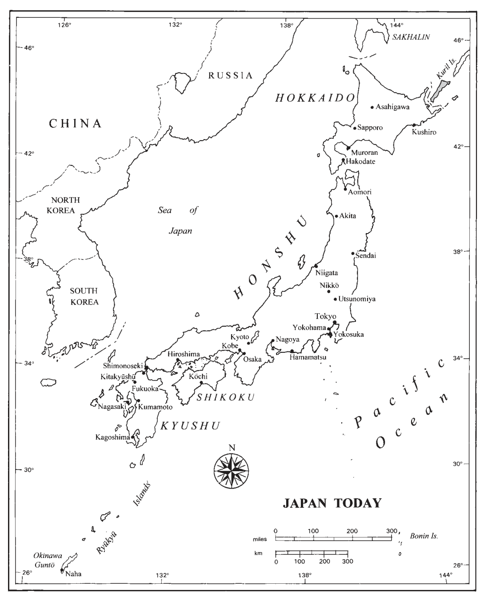
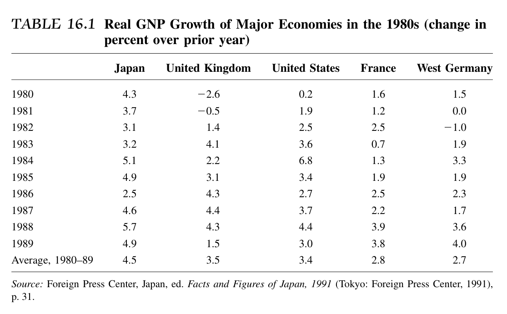
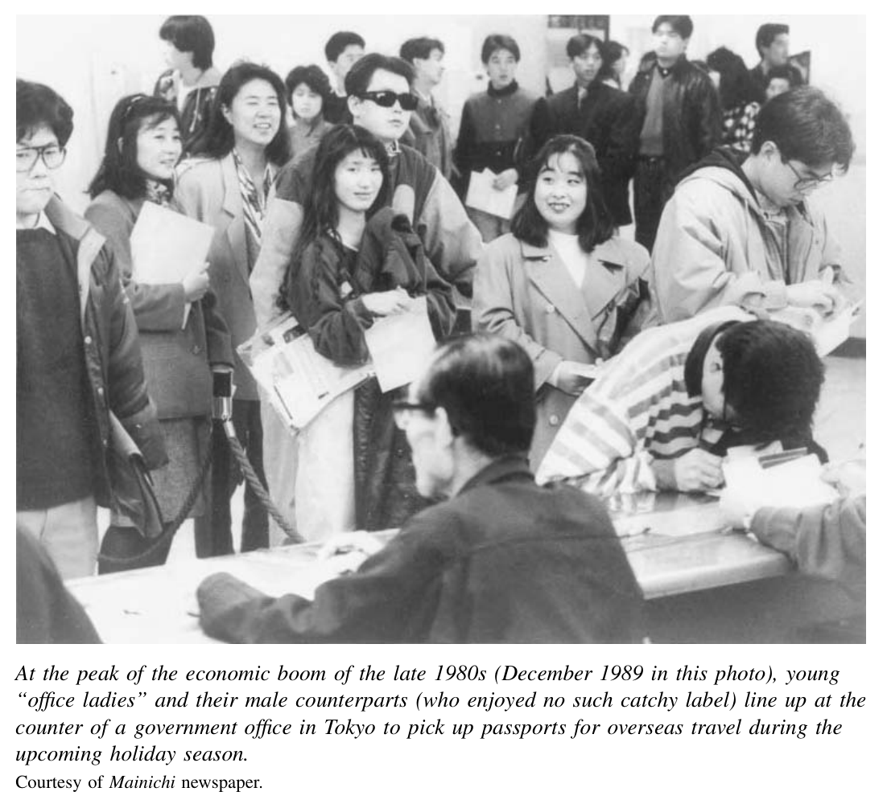

*第四编 战后与当代日本：1952—2000*

# 第十六章 两极世界中的全球强国：1980年代的日本

日本成长为一个富裕、自信而又和平的国家，是战后全球史上一项极为醒目的发展。20世纪70年代至80年代间，在日本国内，有些人因国家取得的成就而心怀自豪，几近自负；他们对外国人夹杂嫉妒的批评颇为恼火。也有人怀着怀旧之情，感叹旧式生活方式正在消逝；他们担忧，年轻一代已经失去了前辈那种专注而投入的精神。还有一些人则主张，日本应当更向世界开放，对多样性更为宽容，在男女关系上也应更加平等。他们抗议说，普通日本人长时间工作，从狭小住宅里长途通勤，却并没有真正分享到富裕社会的果实。

从外部世界看，日本同样引发了交织着艳羡与钦佩的复杂情绪。在一些人眼里，日本的形象陡然从“经济奇迹”变成了“经济威胁”。另一些人则把“日本模式”看作资本主义的另一种形态，似乎比西方或美国版本更为成功。从这个意义上说，尤其是整个80年代，构成了一个异常引人注目的自我满足与相互庆贺的时刻——在战后初期，这样的局面根本不可想象；而从后来回望，又未免显得乐观得太早。

## 世界中的新角色与新的紧张

1972年，冲绳归还日本管辖，消除了美国占领留下的一项重要法律遗迹。尽管美军和军事基地依然留在岛上，但这一迟来的主权回归，毕竟让日美关系似乎有可能走向一种新的平等。然而，前一年发生的两件事——所谓“尼克松冲击”——却削弱了这种希望。1971年7月，美国总统理查德·尼克松突然宣布，他计划访问中华人民共和国（PRC）。很快，美国与中华人民共和国实现了邦交正常化。紧接着在8月，尼克松又宣布，美国将放弃金本位制，允许美元对其他货币的汇价自由浮动。日元随之大幅升值，这固然反映出日本经济实力的增强，但也使日本出口商品的价格明显上涨。

这两项宣布都给日本带来了重大后果。尼克松事先既未与日方磋商，甚至连预告都没有，这让日本政府和公众大为恼火。他们得出结论——而且并非没有道理——美国政府并未充分信任日本国家，也未真正把它视作平等伙伴。最让人难堪的是，在此前二十年间，尽管国内反对声音不小，日本政府始终忠实追随美国对中国共产党政权进行“孤立”和“遏制”的政策。可是一旦美国政策骤然转向，日本便只剩下尴尬，仓促追赶。日本的应对办法，是在1972年与中华人民共和国建立外交关系。整个70年代，中日经济联系缓慢发展；到了80年代，随着中国转向一种事实上的资本主义体制，双方关系迅速升温，中国也成为日本最重要的贸易伙伴之一。

因此，尽管冲绳已经归还，“尼克松冲击”仍标志着日美伙伴关系进入了一个长期紧张的新时期，尤其是在经济领域。自1965年起，日本对美贸易收支已从长期逆差转为略有顺差；进入70年代之后，日本商品大量涌入美国，逐渐压倒了美国对日出口的规模（见图16.1）。到80年代中期，日本对美出口额已超过美国对日出口额的两倍。美国对日年度贸易逆差大约高达500亿美元。

图16.1　1963—1979年美国—日本贸易差额。  
图中项目包括“日本对美出口”“美国对日出口”；纵轴为“金额（十亿美元）”，横轴为“年份”。  
资料来源：美国商务部《美国统计摘要》（华盛顿特区：美国政府印刷局，1963—1979年）。

基本格局相当稳定：日本大量进口石油、原材料和粮食，同时出口价值和质量不断提高的制成品。结果不仅是日本对发达资本主义世界长期保持出口顺差，也带来了持续不断的政治摩擦，其中尤以同美国的摩擦最为突出。美国最著名的制造商，已经无法在价格和质量上与日本商品竞争。以电子业为例，1955年时，美国还有27家公司在本土工厂生产电视机；到了80年代，还继续在美国制造电视机的，只剩下真力时（Zenith）一家。

面对如此强劲的竞争，美国企业高管和工会早在60年代就开始高声抱怨，他们认为这种贸易并不公平。他们指责日本生产者——而且并非全无依据——在受保护的国内市场维持高价，同时在海外以低于成本的价格“倾销”产品，以便夺取市场份额。他们说，日本企业可以在进入市场的初期靠亏本销售打开局面，等美国竞争者退出或倒闭后，再提高价格弥补损失。这样的策略究竟该算不道德，还是聪明的商业手段——这一点，很大程度上取决于观察者站在哪一边。

无论如何，美国人动用政治杠杆来遏制日本在贸易上的攻势。一系列激烈而不愉快的谈判，最终达成了一些协议：日本出口商“自愿”限制对美销售，最著名的例子包括纺织品（1972年）、钢铁（1969年和1978年）、彩色电视机（1977年），以及后来持续至1993年的汽车（1981—1993年）。1988年，美国国会通过一项贸易法，其中的“超级301条款”（Super 301）授权美国政府单方面认定日本或其他外国的国内市场是否对进口品设置了不公平壁垒，并可单方面对这些国家的出口商实施报复性惩罚。这项法律极有可能被用于针对日本，于是招来日本方面的激烈批评：他们说，这让人想起19世纪的“炮舰外交”，那时美国或英国的军舰在世界各地向弱小国家强行规定贸易条件。事实上，这项法律通过后不久，美国就以援引“超级301”为威胁，迫使日本在超级计算机、卫星和木材制品等市场上开放准入。

尤其是汽车配额，戏剧性地凸显出日美国运此消彼长的现实。通用汽车和福特汽车曾长期是美国工业腹地的骄傲，也是战后繁荣的引擎；几十年来，它们的产品一直象征着“美国梦”中的美好生活。如今，如果没有政府出手以贸易配额相助，这些昔日的工业巨人已经无法说服美国人购买它们的汽车。数以百万计的消费者转而选择来自丰田、日产、马自达和斯巴鲁的省油而且愈发可靠的汽车。〔1〕

贸易摩擦有时还会爆发为丑陋的象征性表演，例如美国汽车工人当着电视摄像机的面，把一辆日本车砸得粉碎。它甚至引发了至少一起带有种族色彩的悲剧性暴力事件。1982年，两名汽车工人在底特律用棒球棍将一名年轻的华裔美国男子活活打死。看来，他们之所以袭击他，是把他误认为日本人。审判结果竟只是三年缓刑和数额不大的罚金，轻得令人震惊。〔2〕

整个70年代和80年代，美国政府还试图推动日美贸易及整体经济关系的更广泛重组。1979年，两国政府同意任命一个由所谓“贤人”组成的小组，就如何从长远上减少贸易摩擦提出建议。十年后，到1989—1990年，美国与日本的贸易谈判代表仍在围绕广泛的结构性问题展开交涉，即所谓“结构性障碍倡议”（Structural Impediments Initiative，简称SII）。其基本思路，是改变造成经济失衡的深层结构，例如美国的财政赤字和低储蓄率，以及日本的进口壁垒，尤其是阻碍价格竞争的繁复流通体系。这些谈判提出了不少合理建议，但真正能在政治上落实的，寥寥无几。

随着日本的银行和企业积累起巨大的外汇储备，资本投资也沿着贸易路线流动起来。日本机构开始购买美国国债，这些购买实际上为80年代不断膨胀的美国财政赤字提供了融资。与此同时，日本企业还投入巨资，在美国、欧洲和亚洲建设制造工厂。20世纪60年代中期，日本全球外国直接投资（FDI）总额还不到10亿美元；到1975年，已超过150亿美元；到80年代末，累计外国直接投资大约达到500亿美元。其中约40%投向北美，其后依次是欧洲、亚洲和拉丁美洲。随着日本经济腾飞、地价飙升，日本投资者还高调收购了一些美国著名地产——在他们看来，这些资产的价格还算便宜，例如圆石滩高尔夫球场（1990年）以及位于曼哈顿中心、极负盛名的洛克菲勒中心（1989年）。这些交易在美国激起了“日本收购”“日本入侵”之类的标题。某些批评的口吻，让人想起20世纪初直到二战期间，针对日本人的种族主义排外言论。一个著名例子是，知名记者西奥多·H·怀特于1985年在《纽约时报杂志》发表头版文章，题为〈来自日本的危险〉。文章配图把一座闪闪发亮的日本新钢厂，与一座锈蚀荒废的美国工厂并置对照。怀特指责日本正在“拆毁美国工业”，并声称日本的经济扩张源于一个旨在支配全球经济的阴险长期计划。〔3〕

尽管有这些谴责，日美两国经济却比以往任何时候都更加彼此依赖。政策制定者对此心知肚明。政府谈判代表一方面就贸易问题不断争吵，另一方面，国家官员也在多边与双边层面合作推进经济政策。1964年，日本加入了经济合作与发展组织（OECD）；这一机构主要讨论发达工业国家之间，以及它们与世界其他地区之间的共同问题。又从1975年起，包括日本在内的七个最重要资本主义国家的首脑开始定期举行年度“峰会”。〔4〕 东道主在成员国之间轮流担任，这些国家后来被称为“七国集团”（G-7）。他们讨论如何协调宏观经济政策，以抑制通胀、促进增长和贸易。此外，七国集团的财政官员以及以日本为成员之一的核心“五国集团”（G-5），也在80年代开始定期会晤。日本能够参与这些会议，正说明它在全球经济中的核心地位。这固然是日本人的骄傲来源，但同时也意味着日本在制定经济政策时，必须兼顾国际利益，而不仅仅是本国利益。

五国集团最重要的决定之一，是1985年的《广场协议》（Plaza Accord，因会议地点纽约广场饭店而得名）。为了扶助本国工业，这些财政部长协调外汇干预，推动日元升值，以促使日本增加进口；他们还要求日本政府刺激内需。日本大藏省随即配合，实行低利率政策并扩大财政支出。为了推动国内消费，它向地方政府大笔拨款，支持各种各样的投资项目，从道路桥梁到游乐园、博物馆，几乎无所不包。宽松资金带来了复杂后果。一方面，它帮助企业投资于最先进技术，从而即使在日元升值的情况下也能降低生产成本、维持国际竞争力；另一方面，它也引发了80年代后期惊人的资产膨胀，即日本所谓的“泡沫经济”。

日本与亚洲以及世界其他地区的关系，同样包含着紧张与合作交织的复杂面向。战后，日本与亚洲国家的经济关系发展得并不快。50年代，日本政府通过赔偿协定恢复了同东南亚的经济联系。在与缅甸、菲律宾、印度尼西亚和南越签订的四项条约中，日本企业向这些国家政府提供了价值15亿美元的制成品，而费用则由日本政府支付。依托这些赔偿协议所建立的联系，贸易逐渐扩展。到80年代，美国约占日本出口贸易的三分之一；但中国、韩国、台湾以及东南亚国家合计已紧随其后，远远超过欧洲。

这一发展颇具历史反讽意味。随着盟军占领接近尾声，美国战略家原本支持日本恢复其“南方帝国”的经济版图。他们曾预期，东南亚会成为日本最重要的经济伙伴，以一种半殖民地式的角色，既充当日本制成品的买主，又成为原材料来源地。事实上，日本的确在亚洲建立起坚实的经济联系；但尽管美军长期驻扎在日本土地上，从50年代到80年代，在这种半殖民地式分工中，扮演更重要角色的却是美国——它向日本出售原材料，又购买日本的制成品。

战争年代遗留下来的诸多未决问题，既塑造了日本战后、后殖民时代与亚洲其他国家政府及人民之间的关系，也损害了这些关系。1956年，苏联与日本实现外交关系正常化并恢复贸易往来，但两国并未缔结和平条约，原因就在于领土争议。双方都声称对日本所谓“北方领土”（位于千岛群岛南端）拥有主权。这一分歧直到今天仍未解决。尽管签署了赔偿协定、经济往来也在增长，东南亚人仍常常批评日本企业，认为其贸易和投资做法带有掠夺性，东道国并未从中获益。1974年，首相田中角荣访问曼谷和雅加达时，迎接他的竟是大规模反日骚乱，日本公众对此大感震惊。

最复杂的后殖民关系，是日本与朝鲜半岛的关系。由于日本左派、朝鲜民主主义人民共和国以及韩国国内许多人的反对，日本与韩国直到1965年才签署《韩日基本关系条约》。该协议最终确认大韩民国（韩国）是唯一合法的朝鲜政府，宣布1910年日本吞并韩国及其此前一切相关条约均属无效。韩国放弃了

今后的赔偿要求，而日本则提供了8亿美元的经济援助。此后双方经贸关系在70年代不断发展，尤其在80年代发展迅速。到1990年，韩国已成为日本第三大贸易伙伴。

但严重的紧张并未消失。1973年，韩国中央情报部特工在东京一家酒店绑架了韩国总统朴正熙威权统治的重要反对者金大中，并强行将其带往首尔。此举显然侵犯了日本主权，也激起日本公众的强烈愤怒。另一方面，韩国人仍对日本在殖民统治和战争年代对待他们的方式怀有深切愤恨。因此，当1974年一名旅居日本的在日韩裔居民试图刺杀朴正熙时，在这种历史积怨背景下，刺客长期居住日本一事，也让日本背上了某种“连带嫌疑”。

从70年代中期这一低点出发，日本政府做出了相当大的努力，试图改善与亚洲国家的关系。1977年，在东南亚国家联盟（ASEAN）的会议上，首相福田赳夫强烈表达了希望加强日本与东南亚合作的意愿。此后，日本与东盟官员开始定期会晤。80年代，日本大幅增加了外国援助支出，即所谓官方发展援助（official development assistance，ODA）。1991年，日本超过美国，成为世界上最大的援助国。此后，日本在年度发展援助的美元总额上一直居于世界前列。日本ODA中最大的一部分（约60%）流向亚洲。与此同时，能够提供就业机会的直接投资也显著增加。

80年代初，中曾根康弘首相带头推动与韩国建立更紧密的关系。他承诺提供数额可观的经济援助（40亿美元）。在中曾根任内，一个重要的象征性步骤是，昭和天皇（裕仁）在接见来访的韩国总统全斗焕时，小心翼翼地就殖民时代的残酷表示歉意，称自己对那段“不幸的过去”怀有“真诚的遗憾”。

然而，日本政府和国民始终难以消除许多亚洲人对他们的不信任。1982年，日本文部省在审定公立学校历史教科书时提出修改意见，要求作者淡化日本侵略行为，这在中国和韩国引发了巨大抗议。例如，教科书审定部门建议把1937年对中国的“侵略”改称为“进入”或“进出”之类较轻的说法。【译注：此处对应的争议，常与日文“侵略／进出”表述之争相关。】日本国内和国际媒体普遍将这些描述为“必须改正”的要求。实际上，政府给出的只是没有法律约束力的“建议”，而且教科书最终并未改动。但即便只是提出这种淡化战争责任的建议，也已经足以激怒韩国人，尤其是中国人。韩国政府和中华人民共和国政府都就此正式向日本提出抗议。1986年，文部大臣又进一步激怒韩国人，他声称韩国在1910年被日本吞并一事上“自己也负有部分责任”，结果被迫辞职。

从80年代到90年代，一些重要政治人物接连作出这类火上浇油的评论：有时淡化南京大屠杀的规模，有时宣称朝鲜是“自愿”被殖民，而非遭受武力吞并。几乎每一次这种言论都会在国外引发公愤，也往往使发言者丢掉官职。这些争议的根源，在于人们对日本二战责任的看法高度两极分化。日本人与其他国家民众之间如此，日本社会内部亦然。

日本左派把责任归咎于军部和官僚精英，以及腐败、反自由主义的政治人物和垄断资本家；他们认为，这些人不顾人命代价，推行扩张主义与军事征服。他们主张，这场战争不仅在战略上愚蠢，在道德上也不可接受；不过，他们一般质疑的是领导者的道德，而不是普通民众。他们认为，民众之所以支持战争，是因为言论审查、教育制度与大众传媒的操控，以及对异议者的公开打压。〔5〕

与此相对，许多政府官员和保守派知识分子则形成了完全不同的近代史理解。较早而重要的一部代表作，是林房雄于1963年写成的《大东亚战争肯定论》。林房雄在20年代原是无产阶级小说作家，后来转向极端民族主义立场。林及其同道为日本战时的动机辩护，声称日本发动战争的目标纯正，是为把亚洲从西方帝国主义的掌控下解放出来。他们指出，日本对东南亚的占领终结了荷兰和英国的殖民统治，也开启了法国势力被逐出印度支那的进程。但对那些不便多谈的事实——例如日本自己在朝鲜、台湾，以及后来在满洲和中国的殖民统治——他们则着墨甚少。

事实上，围绕“战争责任”的争论并没有随着战争远去而平息，反而越发激烈。每逢经济摩擦加剧、许多日本人觉得自己只是努力工作并取得成功，却仍遭到不公正批评时，否认责任的声音就越容易获得响应。因此，从80年代起，亚洲社会对日本的敌意之所以持续存在，并不只是因为旧日记忆未曾消散；更因为许多日本人——包括一些内阁大臣——不愿或不能以同情他者经验的方式回望那段过去，从而一次次重新点燃了这种敌意。

## 经济：在石油危机中继续繁荣

整个70年代和80年代，日本与亚洲及西方的紧张关系虽持续不断，但总体上都受到控制，并未在国内酿成重大危机，其中一个重要原因，就是持续的经济增长与日益扩大的富裕对社会起到了安抚作用。第一次石油危机之后，日本经济虽然短暂衰退，但很快便有力复苏。从1975年到80年代末，日本国民生产总值（GNP）年均增长率始终相当稳定，大致维持在4%到5%之间。

同其他发达资本主义经济体相比，更不用说同苏联相比，这样的表现极其突出。70年代和80年代的西欧，经济增长疲弱，通货膨胀和失业率居高不下，劳工抗议频仍。欧洲主要经济体的增长率只有日本的一半，甚至还不到一半。在美国，70年代后期是所谓“滞胀”时期：经济增长停滞，而通胀却达到两位数。里根总统执政初期，即1980年至1983年间，美国工业腹地——此时已被称为“铁锈地带”（rust belt）——陷入深度衰退，中西部几个主要州的失业率升至10%到13%。

在日本，不仅经济持续增长，通胀也较为温和，失业率始终低于2%。此外，在整个70年代和80年代，日本工业劳动生产率的增长速度居世界之首。〔6〕 到80年代后期，“企业日本”在国内外都显得格外亢奋。企业掀起了创纪录的厂房和设备投资浪潮。1985年至1989年间，固定资本形成总额每年都接近GNP的30%，这一数字几乎可与60年代高速增长高峰时期的投资速度相提并论。难怪日本人环顾世界时，会对自身的成功与好运愈发充满信心（见表16.1）。

许多人尤其以所谓“日本式经营制度”为荣。60年代，日本制造商已经证明，它们能够在扩张与全球增长的时代生产出高质量商品；而到了70年代和80年代，它们又表现出在艰难时期调整并继续繁荣的能力。70年代，它们面对的是能源成本飙升和海外需求疲软；80年代，则是由于日元升值而出口成本猛增。它们的应对之道，是掀起一场评论家称之为“精简经营”的运动。〔7〕

面对产能过剩、需求疲软或成本高企的企业，在工会配合下，使成千上万的工人离开原有岗位。例如，造船业在1974年至1979年间就裁减了11.5万个岗位，约占行业总就业人数的三分之一。到了80年代后期，面对来自韩国新兴钢厂的激烈竞争，日本五大钢铁企业也将员工人数削减了三分之一。不过，在这两种情况下，很少有人是被直接解雇的。被列为“精简对象”的工人，往往被调往分包企业，或者在各种优惠条件诱导下“自愿”提前退休。大型企业为了增强用工弹性，还大量雇佣女性兼职工，她们在景气转弱时最容易被辞退；企业还把许多辅助性职能外包给其他公司。与此同时，企业提高年度业绩考核在升迁和加薪中的权重，以此刺激留下来的员工更加卖力。

就在压缩劳动力规模的同时，企业管理者还开展了一场著名的工作场所创新运动，既要提高质量，也要控制成本。这场运动的标志，便是质量管理（QC）运动。它起初在50年代被称为“统计质量控制”（SQC），是从美国引进的。无论在美国还是日本，最初都是由专家型职员借助图表

与复杂分析来研究工作流程，然后自上而下地推行改进，以提升生产率或产品质量。

真正引起全球关注的日本式创新，是把整个劳动者群体都纳入QC运动。从60年代到70年代，先是班组长等基层管理者，后来是一线工人和文员，组成了成千上万个学习小组，称为“QC小组”（QC Circles）。通常约有八至十名男女员工定期聚会，有时甚至在下班后自发参加，学习基本的问题解决方法和统计技巧；随后再分析自己的工作内容，提出使工作更高效、更有生产力，或者在某些情况下更安全、负担更小的改进方案。

这场运动之所以能够推行，一方面得益于员工普遍受教育程度较高，另一方面也仰赖管理层对就业保障的承诺——因为QC小组提出的改进方案，常常会减少某个工作组所需的人手，而这些“多余”人员通常会被调往其他岗位。到80年代后期，日本曾经登记参加过QC小组的劳动者超过200万人，QC小组总数超过26万个。〔8〕 批评者有充分理由指出，管理层所谓“自愿参加”，并不真实；不参加的人往往会在晋升和加薪上遭到报复。民意调查显示，相当一部分参与者觉得QC小组“负担沉重”或“压力很大”。但也不能否认，许多小组确实为工人提供了一个难得机会，使他们能够运用自己对岗位的丰富了解，既提升技能，也提高生产率和质量。

到了富裕的80年代，曾在企业内部高声反抗的激进工会人士，以及企业外部的市民活动家，声音都已几乎听不见了。外国人纷纷涌入日本工厂，研究日本式管理的秘诀；收入不菲的日本顾问，则把经过改造的“全面质量控制”（TQC）反向输出回美国。

日本已经变成一个异常以企业为中心的社会。大多数人都相信，只要对公司有利，对整个社会也必然有利。评论家们不吝辞藻地歌颂“日本制度”的成功。1986年，日本式质量管理的重要鼓吹者唐津一甚至这样写道：“我相信，日本在产业经营方面的实验成果，应当传播到全世界……更根本地说，日本应当对西方经营方式背后那些笛卡尔式前提，提出一种积极的挑战。”〔9〕

唐津的分析，正是所谓“日本人论”（Nihonjinron）这一写作类型的典型。此类著作通常强调日本在思想传统、美学、社会或经济组织、政治文化，乃至某些神经生物学特征——例如偏重使用某一侧大脑——等方面的特殊独特性。“日本人论”源远流长，至少可以追溯到明治中期的三宅雪岭、冈仓天心，以及当时的外国观察者如费诺罗萨。随着80年代日本经济日益繁荣，生产“日本人论”的文化产业也同样兴盛起来。一如既往，这类论述强调“日本人”作为一个整体的统一与凝聚，却掩盖了其内部重要的差异与紧张。书店里往往会专门开辟一个区域陈列这类书籍。

其中有些作品相当浅薄，甚至荒唐。作者们会把如厕方式、挖鼻孔习惯，甚至日本式弹珠机“柏青哥”，都说成是日本独特文化的象征。〔10〕 这种思路也让日本贸易谈判代表说出过一些惊人的话。有人曾为限制牛肉进口辩护，声称日本人的肠胃结构特殊，无法适应进口牛排；也有人为保护国产体育用品辩护，说日本的雪有其特殊性质，因此不能进口外国滑雪板。

较有意思的一部“日本人论”作品，是《依赖的结构》（《甘えの構造》）。这本书把一种“依赖”心理——日语称“甘え”（amae，带有“撒娇式依赖”之意）【译注】——视为日本文化的界定性特征。作者是著名精神科医生土居健郎。不过，土居并不把“日本人”描绘成绝对独特的存在；他认为，这种心理机制虽在日本表现得尤为突出，却也能在世界许多社会中找到。〔11〕

这一时期由外国人撰写、论述日本特殊性的畅销书，当属《日本第一》。其作者、哈佛大学教授傅高义，既反映了那个时代日本人的自信精神，也进一步推动了这种自信。他认为，日本已经综合出一种极其成功的社会与经济体系，美国人和其他国家的人都可以从中汲取教训。这本书在美国卖得不错，但它真正的读者群，却是日本语译本的读者——那些乐于从别人嘴里听到本民族特殊而正面成就的日本人。〔12〕

## 政治：保守派的黄金时代

在这样一种意气昂扬的氛围中，自由民主党（自民党）继续执政，也就不足为奇了。执政党内部主要由两类人主导。其一是职业政治家。他们通常在日本农村拥有稳固的地方基础，依靠为农民、建筑业等组织严密的利益群体谋利来积累权力，并从这些群体的支持中获益。这类人物的典型，就是被称为“电脑推土机”的田中角荣。他白手起家，先在故乡新潟、后又在全国范围内建立起自己在建筑业中的“王国”。他在1972年至1974年间担任首相，同时还利用个人财富以及企业界的慷慨捐输，巩固了自民党内部最强大的派系。他的主要手法很简单：为追随者的竞选提供资金。自他因丑闻下台后近二十年间，田中派一直在幕后主导着日本政治。其派系中有两人后来出任首相：竹下登（1987—1989年）与桥本龙太郎（1996—1998年）；另有数位首相，尤其是中曾根康弘，也得力于田中派的支持。1982年，自民党推举中曾根出任首相时，中曾根曾带着几分敬畏说道：“田中军团的威力，我从未像今天这样切身感受到。”〔13〕（有关历任首相与选举结果，详见附录A、B。）

第二类自民党领导人，是由官僚转入政界的人物。他们依靠自身精英资历以及与原任部会之间的密切联系——尤其是大藏省与通商产业省（MITI）——建立权势。50年代与60年代的主要政治领袖，如岸信介（1957—1960年）、池田勇人（1960—1963年）和佐藤荣作（1963—1972年），都出身这些部会或其战时前身。70年代最重要的两位“官僚型政治家”，是带领自民党度过石油危机并实现复苏的福田赳夫（1976—1978年）和大平正芳（1978—1980年）。官僚出身的政治家需要职业政客的财力和选举动员力，而职业政客也离不开官僚的专业能力。双方常常彼此轻蔑，尤其是福田派与田中派之间的斗争最为有名。1972年田中即将当选首相之际，所谓“福角战争”几乎使自民党一分为二。

但自民党的统一仍然维持住了。直到80年代末，反对党始终无力打破自民党在国会中的多数地位，也无法撼动其对首相职位和内阁的控制。按人口结构来看，反对党似乎本有优势。日本社会党、共产党以及公明党（CGP）都从城市“浮动选民”的增加中获益，而这些选民并不属于保守派的有组织基本盘。因此，1967年众议院选举中，自民党总得票率首次跌破50%；此后，它便再也未能在众议院选举中赢得过半数选票。但它仍能依靠选区划分，使农村铁票区获得过高权重，从而维持议席多数。到70年代，观察者已把日本称为一个“一党半制”国家。与自民党关系密切的官僚起草法律、编列预算；自民党则确保这些法案和预算在国会获得通过；大企业为自民党的选战提供资金，并从其政策中获益。这个“铁三角”看上去几乎牢不可破。

然而，也有两股“腐蚀力量”开始对这个执政三角造成些许裂缝。第一股力量，是腐败。考虑到自民党长期执政，以及它用政策回报金主的运作方式，丑闻偶尔浮上台面几乎在所难免。1974年，一位不循常规的记者在一份重要月刊上发表犀利揭黑报道，详细揭露了为田中角荣政治帝国提供资金的各种灰色交易，尤其是建筑业中的交易。主流媒体随即群起跟进。就在那一年，田中因受到猛烈审视和公众批评而辞去首相职务。两年后，田中的政治麻烦又带上了惊人的国际色彩。一名在美国参议院委员会作证的证人指控：1972年，田中从美国洛克希德公司收受了数百万美元贿款，以交换让日本的民用与军用飞机采购偏向洛克希德；而该公司的高管又与尼克松政府关系密切。1983年，田中因受贿被判有罪，尽管他最终并未真正入狱服刑。

到了80年代后期，政治丑闻更成为政坛上的长期因素。1988年的“利库路特事件”（Recruit scandal）牵连到前首相中曾根及其内阁中的多数成员。卷入其中的还有数十名政治人物，包括一部分反对党人士；他们被指控收受这家新兴Recruit公司的非法捐款和未上市股票。1992年，另一宗围绕成功快递企业“佐川急便”的类似丑闻，又让田中角荣最亲近的一些追随者名誉受损。在这些案件中，最高层政治家虽然从未真正被判有罪，但接二连三的丑闻，却使公众对自民党乃至整个政治人物阶层的犬儒与不信任不断加深。

削弱保守派霸权的另一股力量，是人们对“富裕的果实并未均等分享”，以及“追逐富裕的过程中破坏了环境、忽视了社会福利”的不满。1976年和1983年的选举中，这种不满与田中丑闻的影响叠加起来，使自民党的选票明显流失。两次选举中，自民党都只差几席便无法单独过半，只得各自拉拢少数无党籍议员，才勉强保住多数。反对党合计的议席数几乎与自民党相当，国会规则也使它们得以掌控若干委员会。媒体将此称为“均势政治”的新时代。

然而，反对党议价能力的增强，并没有带来政策上的重大转向。70年代自民党在走向政治调和的过程中，早已吸纳了反对派有关扩大社会福利的关键诉求。中间派政党的兴起，也进一步钝化了政治对立的锋芒。日本社会党仍是最大的在野力量，但它对自民党的批评却日渐温吞。从某种意义上说，它最大的贡献反倒是保守性的：在偶尔出现的修宪言论面前，社会党维护了战后民主宪法的现状。与此同时，各党领导层都越来越固化，也越来越少愿意提出大胆倡议。到1980年，众议院512个席位中，多达140席属于所谓“世袭议员”——也就是资深国会议员的儿女、孙辈，甚至曾孙辈。近90%的这类“门阀政治家”都在自民党，另有7%在社会党。

这些年真正重要的政策倡议，仍来自保守派阵营。日本政治此时与英国、美国的趋势同步发展。英国首相撒切尔夫人和美国总统里根都在削减福利、放松管制并推动大型产业私有化。80年代中期，日本政府，尤其是中曾根内阁，也发起了一场类似的“财政与行政改革”。到1987年，中曾根已将年度财政赤字大致削减了一半。这套政策赢得了相当支持，自民党也在1986年众议院选举中重新获得稳固多数。到1990年，在消费税新政带来的税收增加和经济繁荣的帮助下，日本财政预算已大致实现平衡。

中曾根政府还把几家庞大的公营机构私有化，尤其是负债沉重的日本国有铁道（JNR）和电信公社。除了通过迫使新公司脱离财政补贴、自负盈亏来节省支出之外，这些改革的一个关键目标，是打垮国铁工会——那是日本仅存的大型激进劳工据点。社会党和国铁工会都强烈反对私有化：前者在国会内施加政治压力，后者则在工作场所组织各种抗议。数以千计的工会干部因此失去工作，被指控采取非法劳资斗争手段。反对私有化的人认为，由政府运营并补贴如此重要的公共服务完全合理，但最终中曾根占了上风。国铁和公营电话事业被改组为私营公司，即JR（日本铁路）和NTT（日本电信电话公司）。JR管理层采取了不少重要举措，例如关闭亏损的乡村线路，集中经营盈利较高的城际干线。相比之下，私有化后的NTT则继续以近乎垄断者的姿态安于现状，多年来一直以收费高昂、推出新型通信服务的速度慢得像糖浆流淌一般而闻名。

老龄化社会中的福利成本，也在80年代成为一项关键政治议题。随着医疗改善，日本人的平均寿命不断上升。到1977年，日本人的预期寿命已居世界之首，超过瑞典：男性平均73岁，女性78岁。此后整个80年代和90年代，这些数字还在缓慢提高。与此同时，生育率（即妇女一生平均生育子女数）持续下降，到1990年跌至1.6这一历史最低点，引发了人们对“婴儿荒”逼近的忧虑。许多评论者哀叹，结婚年龄越来越晚，家庭规模也越来越小。政府中的男性往往把责任归咎于“自私”的年轻女性。女权主义观察者则颇有说服力地指出，许多女性之所以推迟结婚和生育，很可能是为了避免陷入同时照料孩子与老年父母的双重负担——而她们的丈夫却要远距离通勤，并长时间工作。

长寿与少子这两种趋势叠加，使日本老年人口与年轻人口之比的上升速度超过世界上任何国家。中曾根主张建立一个更“有效率”的社会福利体系，在国家资助项目之外，更多依赖家庭与社区服务——尤其是依赖在家中承担照料职责的女性。这种仰赖家庭和社区的方针，与日本自战前以来的社会福利传统一脉相承。〔14〕 到80年代中期，医疗保险费提高了，福利体系的其他成本也从政府转移到公民个人身上。

80年代另一项引人注目的政治改革，延续了70年代保守派“吸纳进步议程”的路数。70年代，要求扩大性别平等的呼声在全球范围内兴起，联合国也因此通过了消除对妇女歧视的公约。日本宪法本身就明确承诺男女平等，因此日本政府几乎别无选择，只能在1980年签署这项公约。不过，它对真正的重大改革其实并无热情。在日本国内日益增长的女性主义运动推动下，政府还是采取了一些行动。它修改了国籍法，使嫁给外国男子的日本女性，也能为子女取得日本国籍；在此之前，只有娶外国女子的日本男性才拥有这种权利。政府还起草了《男女雇用机会均等法》（EEOL），并于1985年在国会通过。该法要求雇主在录用、培训和晋升机会方面给予女性平等待遇；但它并未赋予政府真正有力的执法权，也没有规定对违法者实施何种制裁。尽管如此，作为对一种理想社会目标的象征性宣示，它仍对企业用工政策产生了一些影响。多数大型公司把职位重新划分为名义上不分性别的“综合职”（原本仅面向男性的职业发展轨道）和“一般职”（原本仅面向女性的文书轨道）。理论上，男女如今都可以申请这两类岗位。少数女性开始进入综合职，追求与男性相当的私营企业职业生涯。

## 狂飙的80年代：社会与文化

在战后复苏与增长的年代里，数以百万计的日本人把自己的努力理解为一种有目的的奋斗：既为了国家的经济实力，也为了自己和家人的更好生活。到了富裕的80年代，社会精神却明显不同了。尤其是年轻人和城市居民，纷纷投入一场占有与消费的狂热。单身年轻女性成为消费经济中一支不可忽视的力量。她们往往从事的是前景有限、薪水不高的工作，典型身份就是“OL”（office lady，办公室女职员），这个缩写多少带有一点轻蔑意味；但她们常常住在家里，不必支付房租。媒体描绘这些女性生活时的口吻，既兴奋又轻蔑，和20年代谈论“摩登女郎”时如出一辙。80年代的“办公室小姐”拥有相当可观的可支配收入。空闲时，她们涌进大城市的商店，追逐最新时装；和男友一起，寻找提供异国风味和奢华菜式的高级餐厅，甚至会去吃裹着金箔的寿司。她们也争相购买最新的电子消费品，从传真机到随身听（Walkman），无所不包。

和各个年龄层的人一样，她们也以前所未有的规模出国旅行。1965年，出境的日本人只有30万，而且大多数是因公出差。到1980年，日本人每年出国旅行已多达300万人次；到80年代末，这一数字更跃升到1000万人次。〔15〕 此时其中绝大多数已经是休闲旅行者。大约40%的出境者是女性，年龄则从年轻到年长不等。团队套装游依旧流行，但越来越多的人也开始自由行。由于多数雇主给假吝啬，旅行时间通常很短，平均只有8天。不过，日本游客因出手阔绰，受到世界各地商店和酒店的欢迎。在夏威夷和整个亚洲的旅游商店里，会说日语甚至成了招聘条件之一。到1990年，日本人的海外旅游支出每年已超过200亿美元。

在80年代步入中年的那一代人，是在政治剧烈动荡和经济惊人转型的时代里长大的。他们对这些变化多少感到不安。他们自己也会出国旅行，也会把更大的冰箱和更强劲的空调搬进家门；但他们担心，自己的孩子已经失去了那种严肃而专注的投入感。于是，他们把年轻人称作“新人类”（shinjinrui），这个词既可以译作“新物种”，甚至也带点“外星人”的意味。一个常被引用的“新人类”行为例子是：某位年轻公司职员竟然为了和女友约会，拒绝了加班任务。与此相关的80年代新词还有“自由打工族”（furiitaa，后来的“フリーター”），大致是英语“free”和德语“Arbeiter”的混合体，指的是一些年轻人——尤其是年轻男性——放弃稳定的企业正式职位，转而选择自由、临时性的工作，而这类工作当时多得很。

与此相对，老一代人走到极端时，表现几乎完全相反。80年代另一个新流行起来的词，是“过劳死”（karōshi），它成了中年男性工作狂病理的著名象征。这个词被用来描述这样一些案例：某个男子（几乎总是男子）原本并无特别病史，却在一段时间内承受极端而紧张的工作时间——每周也许长达100小时以上——随后突然死于心脏病或中风。社会活动家设立了“过劳死热线”，为死者家属以及那些自觉有风险的人提供法律咨询。1987年，政府放宽了对职业病的界定，为遗属申请补偿打开了通道。活动人士依据热线来电

〔译注：原图注在此处已截断。〕

估算，1988至1990年间，过劳死案例每年可达500起。可是真正被劳动省正式认定、可获赔偿的案例却只有少数：1987年21起，1988年29起，1989年30起。〔16〕

尽管有这些极端案例，尽管也出现了“新人类”文化，但日本人继续长时间、强度极高地工作的事实仍不容否认。在日本，许多加班并未被申报出来，因为雇员承受着向公司提供所谓“服务加班”——也就是无偿加班——的压力，因此官方统计低估了工时。即便如此，政府数据仍显示，从70年代末到整个80年代，平均年工作时数是在上升的。到1990年，日本雇员每年平均工作约2200小时。虽然韩国人的工时还要高出许多，但日本人的这一数字仍比美国工人高出约10%，比西欧工人平均多出近30%，折合下来，大约相当于每年多工作12周。

面对日本创纪录的贸易顺差，外国人一面批评，一面又带着几分出于自身利益的“同情”说：“日本人工作得太辛苦了。”仿佛这正是他们竞争优势的来源。〔17〕 在日本国内，也有人附和这种声音，呼吁企业减轻对员工的要求；但另一些人则带着防御性的自豪反问：“努力工作到底有什么错？”他们反过来指责西方人懒惰而自满。例如，1992年，日本众议院议长樱内义雄宣称：“（贸易）问题的根源在于美国劳动力质量低下……美国工人太懒了。他们不工作，却想拿高工资。”〔18〕 这种言论在国外广遭批评，具有讽刺意味的是，它倒让人想起早年欧美殖民者对殖民地劳工“懒惰”的陈旧刻板印象。

对大众文化的看法，也同样分裂在批评与赞美之间。日本知识分子和社会评论家围绕这样一个问题展开争论：一个日益分裂为“微型大众”（micro-masses）的社会，其内部更强的异质性到底意味着什么。80年代，人们用这个概念指称那些从更大社会体中分化出来的小群体；在富裕生活与更灵活的营销、制造体系支持下，这些群体如今可以追求各自独特的兴趣与嗜好。出版业于是推出了数以百计的周刊和月刊，分别迎合不同年龄层和不同趣味。批评者说，这种分化其实很肤浅：大众不过是在“拼命工作，只为了不往下掉”，仍旧在一场盲目追逐“更新”“更潮”的竞赛中狂奔，还错误地以为那些细小差别真的意义重大。〔19〕 对一些保守派来说，即便日本员工按国际标准看依然工作得极长，富裕社会带来的消费主义，还是意味着那种曾经造就战后日本世界强国地位的工作伦理正在被掏空。对一些进步派来说，这个物质主义社会则令人遗憾地变得冷漠政治、只顾自己。

但并非所有人都赞同这种批评。重要思想家鹤见俊辅就认为，普通日本人在过度工作和过度享乐之间维持着一种健康平衡。他说，人们会嘲笑那些“干劲过头的公司男人”，以及那些“为了子女教育而焦虑过度的母亲”，因为他们“为了获得高地位而付出惊人的努力”；而他所赞赏的，恰恰是普通人那种“相信过一种中等水准的生活与生计就已经足够”的坚实信念。〔20〕

也许，真正积极拥抱80年代社会变化的最重要异端思想家，是吉本隆明。延续他在1960年围绕安保条约危机与丸山真男争论时的立场，吉本及其同道对年轻人，尤其是大众文化中更嬉戏化、更私人化、往往也更具反传统色彩的精神，抱持欣赏态度。他们认为，这体现了普通人主观欲望的一种解放，而这种欲望也许能够超越单纯的物质主义。他们注意到，广告不再去宣讲某种产品，甚至某家公司究竟有何实用优点，而是创造出一种诱人的图像，似乎与赞助者本身毫无直接关系。他们的写作，构成了日本围绕“后现代”社会与文化所展开辩论的一部分，而这种辩论在其他发达资本主义社会中也同样存在。〔21〕

广告图像还在一个重要方面重塑了日本的物理景观。到1985年，农业就业人口已降至劳动人口的10%以下，日本乡村向郊区化空间不断转变的过程仍在持续。然而，广告业与旅游业、交通运输业联手，开始逆转高速增长时代那种趋于同质化的趋势。它们把日本乡村重新塑造成整个民族都可怀念的“故乡”。在70年代一次著名的广告宣传中，人们被劝说搭乘火车去“发现日本”（Discover Japan），也就是前往乡村。到了80年代，现代都市与“传统”乡村之间的距离又被进一步拉开，新的广告词歌颂前往“异域日本”（Exotic Japan）旅行的魅力。在繁荣经济带来的丰厚税收支持下，数十个都道府县、城镇和村庄纷纷与私人开发商联手，匆忙兴建高尔夫球场、博物馆和主题公园，试图把游客重新带回“故乡”。〔22〕

高速增长年代的另一种“同质化趋势”，则在教育领域出现了反转。到了70年代和80年代，原本以能力考试为基础、相当平等的高中与大学升学制度，其平等性显著退化。这在某种讽刺意义上，部分恰恰是由于公立学校不愿一味把教学变成应试训练。家长和孩子于是急切寻找任何可能的竞争优势，而私人部门迅速做出回应。课后补习学校，尤其是在大城市中大量涌现。雄心勃勃的高中生放学后还要再上四五个小时的补习班，晚上九点、十点疲惫回家后，还得继续完成白天学校留下的作业。与此同时，私立高中，甚至某些作为升学“直通车”的私立初中和小学，也因能把学生送进顶尖国立或私立大学而声誉鹊起。于是，又出现了专门帮助学生考入这些私立学校的补习机构。父母的财富，给孩子在这场竞赛中带来了相当大的优势。来自富裕家庭的学生，在顶尖大学中的比例显著上升。

其他令人不安的社会趋势，还包括关于校园霸凌日益残酷的报道增多。评论家担心，学生把考试竞争带来的挫败与压力，发泄到了更弱小的同学身上。与此同时，随着80年代初地价猛涨，拥有房地产者与没有房地产者之间的财富差距，也开始迅速拉大。

不过，在80年代的大部分时间里，诸如贫富差距扩大这类问题，在多数日本人眼中仍不过是可控的、细小的瑕疵。民意调查与投票率下降都表明，这个愈发富裕的国家正变得越来越不关心政治，也越来越自满。1985年至1990年间，日本经济继续压倒北美和西欧的其他发达资本主义竞争者，日本企业在金融和生产两方面的力量，都攀升到了令人目眩的高度。

这种自满很快转变成傲慢。股价飞涨，普通个人投资者也纷纷投身投机热潮。人们造出了“财技”（zai-tekku）这个词，与人尽皆知的“高科技”（hai-tekku）形成双关。到1989年底，日经指数在短短三年中已经上涨了三倍。东京证券交易所上市公司的总市值，占到了全世界股票市场总价值的40%以上。地价在80年代初已经翻倍；几年后又翻了一番，有些地段甚至涨了三倍。有组织犯罪集团也冲进土地投机市场，有时会威逼住户卖房，再迅速倒手赚取暴利。按照某些估算，到1989年，东京房地产的总值甚至超过整个美国。日本投资者还把欧洲艺术品市场，尤其是法国印象派作品的价格，推到了前所未有的高度。有一位商人以令人咋舌的1.6亿美元，买下了两幅画：一幅梵高，一幅雷诺阿。

这种过热并不只限于年轻人、黑帮或古怪商人。一些一向以稳健著称的大银行，比如住友和富士，也以近乎鲁莽的方式跳进了靠不住的投机项目。其中最臭名昭著的一桩，是日本兴业银行——这家日本最“蓝筹”的银行之一，曾在50至60年代经济奇迹的融资中发挥关键作用——竟向一名经营大阪几家小餐馆的女子贷出20亿美元。她的餐馆常有黑道人物及其女伴出入。此人把钱拿去炒股，而她的投资决策竟是依据一位算命师的降灵占卜来进行的。她拿来抵押的存单，后来被发现只是某地方信用机构存款证明的粗劣伪造品。事后回头看，这些趋势显然正在合力酿成一个危险而不可持续的投机泡沫。但在当时，很多人却以为好日子会一直持续下去。

这段从战后复兴走向前所未有富裕的历史，究竟是一则奇迹与典范的故事？是一部危险的全球怪物崛起的传奇？还是一曲德性流失、传统价值侵蚀的哀歌？在日本国内外，这些看法都曾出现。支撑它们的，却都是同一个带有误导性的前提：日本是一个格外不同、甚至独一无二的地方。与其如此，我们不如把日本的经验看作一种迷人却并不那么例外的经验——它只是世界日益共同面对现代性与富裕问题时，所呈现出的一个变体。

## 注释

〔1〕 关于汽车产业故事的一种富于戏剧性的叙述，可参见戴维·哈尔伯斯坦（David Halberstam）《清算》（*The Reckoning*）（纽约：William Morrow，1986）。

〔2〕 这一事件可参见克里斯汀·崔（Christine Choy）与蕾妮·田岛（Renee Tajima）获得奖项的纪录片《是谁杀了文森特·陈？》（*Who Killed Vincent Chin?*，1988）。

〔3〕 西奥多·H·怀特（Theodore H. White）〈来自日本的危险〉（“The Danger from Japan”），《纽约时报杂志》，1985年7月28日，第18—23、27、37—43、57—58页。

〔4〕 参加者为加拿大、法国、德国、英国、意大利、日本和美国。加拿大自第二次会议起参与。

〔5〕 对这一立场的有力表述，可参见家永三郎《太平洋战争》（*The Pacific War*）（纽约：Pantheon，1978）；此书译自他1968年的日文著作《太平洋戦争》。

〔6〕 参见 Ronald Dore，《证券市场资本主义，福利资本主义：日本与德国对英美模式》（*Stock Market Capitalism, Welfare Capitalism: Japan and Germany versus the Anglo Saxons*）（牛津：牛津大学出版社，2000），第225页。

〔7〕 日文原词为 *genryō keiei*，意指以压缩冗余、削减成本为核心的“精简经营”。

〔8〕 参见 Paul Lillrank 与 Noriaki Kano，《持续改进》（*Continuous Improvement*）（安娜堡：密歇根大学日本研究中心，1989），第1页。

〔9〕 唐津一〈日本诀窍与美国工业〉（“Japanese Know-How for American Industry”），《Japan Echo》13卷4号（1986）：64。本文译自〈美国经济的崩溃〉（“Beikoku keizai no hatan”），《Voice》1986年10月号，第115—125页。请注意，其英文标题比日文原标题温和得多。

〔10〕 对此类作品的分析与综述，可参见 Peter N. Dale，《日本独特性的神话》（*The Myth of Japanese Uniqueness*）（伦敦：Croom Helm 与牛津大学日产日本研究所，1986）。关于文中提及的具体例子，见该书第16、23、65—67、72—73、189—190页。

〔11〕 土居健郎《依赖的结构》（*The Anatomy of Dependence*）（东京：Kodansha International，1973），原著为《甘えの構造》（东京：弘文堂，1971）。

〔12〕 傅高义（Ezra F. Vogel）《日本第一》（*Japan as Number One*）（剑桥：哈佛大学出版社，1979）。日文译本同年出版，据说销量超过100万册，成为日本有史以来销量最高的翻译类非虚构作品。

〔13〕 参见 Jacob Schlesinger，《影子将军：日本战后政治机器的兴衰》（*Shadow Shoguns: The Rise and Fall of Japan’s Postwar Political Machine*）（纽约：Simon and Schuster，1997），第120页。

〔14〕 参见 Sheldon Garon，《塑造日本人的心灵》（*Molding Japanese Minds*）（普林斯顿：普林斯顿大学出版社，1997）。

〔15〕 参见日本首相府《观光白书》（*Kankō hakusho*）（东京，1991），第37—40页。

〔16〕 参见“过劳死受害者全国对策会议”编，《过劳死：当“企业战士”死去之时》（*Karōshi: When the “Corporate Warrior” Dies*）（东京：窓社，1990），第7、12页。

〔17〕 参见《华尔街日报》1989年9月14日〈美国在贸易谈判中的新友好姿态，在一些日本人看来只是出于私利〉（“Friendly New U.S. Line in Trade Talks Strikes Some Japanese as Self-Serving”），A17版。

〔18〕 《纽约时报》，1992年1月21日，D版第1页。

〔19〕 参见熊泽诚《日本职场群像》（*Portraits of the Japanese Workplace*）（博尔德：Westview Press，1996），第249页。

〔20〕 鹤见俊辅《战后日本大众文化史》（*Sengo Nihon no taishū bunka-shi*；副题 *A History of Mass Culture in Postwar Japan*）（东京：岩波书店，1984），第189—190页，转引自熊泽诚《日本职场群像》第249页。其英译本题为 *A Cultural History of Postwar Japan, 1945–1980*（伦敦：KPI，1987）。

〔21〕 关于这些争论，可参见 Marilyn Ivy〈大众文化的形成〉（“Formations of Mass Culture”），收于 Andrew Gordon 编《作为历史的战后日本》（*Postwar Japan as History*）（伯克利：加州大学出版社，1993），第253—255页。

〔22〕 关于这些广告宣传，见 Marilyn Ivy〈大众文化的形成〉，第251、256页。关于乡村旅游开发项目，见 Jennifer Robertson〈一个村庄的意义：战后日本的国际化与怀旧〉（“It Takes a Village: Internationalization and Nostalgia in Postwar Japan”），收于 Steven Vlastos 编《现代性的镜像》（*Mirror of Modernity*）（伯克利：加州大学出版社，1999），第110—129页。
