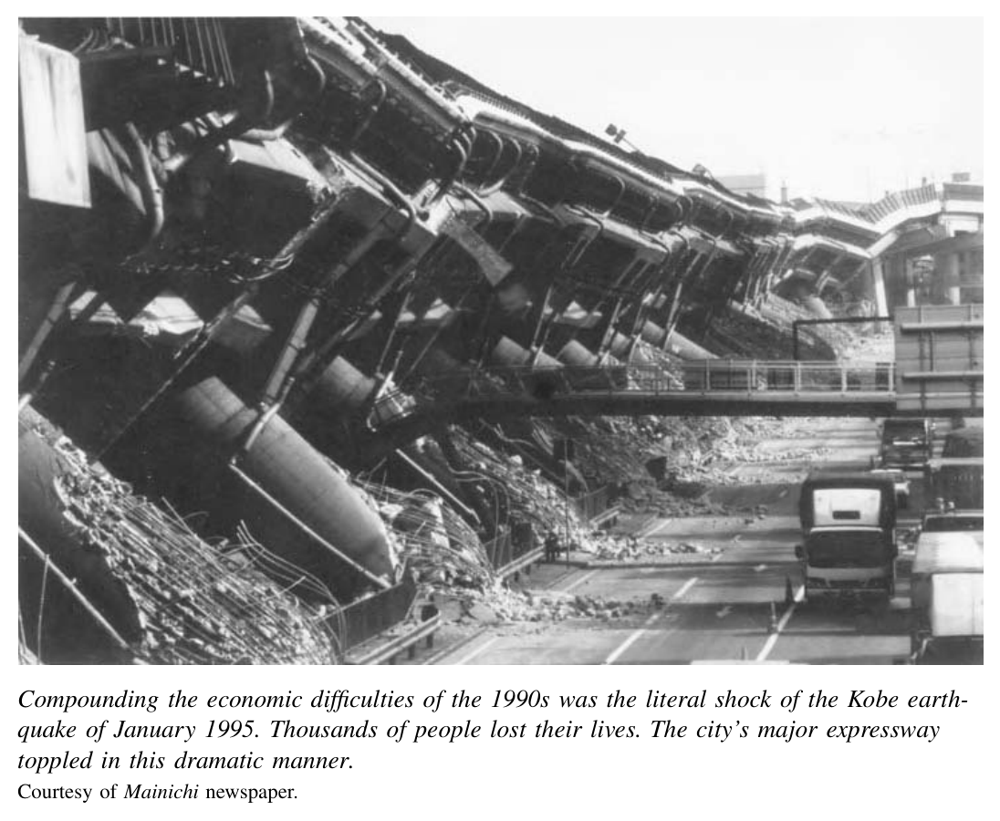
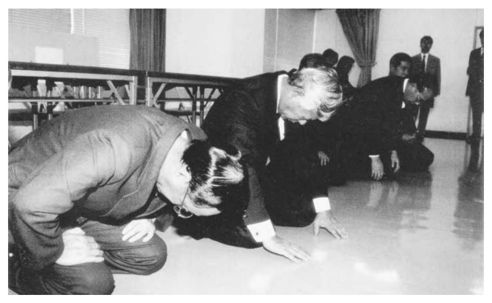

*第四编 战后与当代日本：1952—2000*

# 第十七章 超越战后时代

把1990年前后视为日本乃至世界历史分期的一个分界点，理由十分充分。1989年，柏林墙倒塌；1990年，两德统一。1989年，苏联帝国开始解体；1991年，苏联本身也随之崩溃。就在这场欧洲革命风暴来临前夕的1989年1月，日本的昭和天皇去世。同年7月，自由民主党在参议院选举中惨败，这是该党自成立以来第一次失去该院多数席位。1990年，80年代的投机泡沫以惊人的方式破裂，日本由此进入长达十余年的经济停滞期。无论是国际环境，还是日本国内的时代氛围，90年代都与80年代迥然有别。

## 昭和的终结与象征天皇制的转型

1987年9月，裕仁天皇〔即昭和天皇〕接受手术，以治疗胰腺肿胀。1988年9月，他又因内出血而倒下。社会上广泛流传他实则罹患癌症的传闻，这一说法后来被证明属实，只是政府直到他去世后才予以确认。日本民众被卷入了一场漫长而煎熬的临终守候：在整整四个月里，天皇不断出血、输血，生命一点点流逝。1989年1月7日，天皇去世，昭和时代宣告结束。这是日本皇室历史上持续时间最长的一次单一在位。政府随即公布新年号为“平成”，意为“成就和平”。裕仁之子、皇太子明仁，于1990年11月12日正式即位。

天皇之死暴露出皇室制度在日本社会中若干重要的延续性。在他病危的数月之间，各大报纸每天刊载天皇的生命体征与身体苦况：体温、脉搏，以及吐血、直肠出血、输血等情况。尽管政府掩盖了癌症这一事实，但对于一位一生之中私生活、思想乃至身体状况几乎从不示人的君主而言，这种方式无疑构成了一场异样而侵入性的公共临终展示。然而，以这种方式侵犯皇室隐私，并不是战后民主时代的创新；恰恰相反，把天皇病况公布于民众，是在1912年明治天皇去世时“发明”出来的一种现代传统。政府官员之所以发布这类信息，目的正在于通过这种临终时的特殊显现，把现代天皇与民众之间营造出一种亲密联系。

因为天皇垂危而呼吁全国“自肃”〔译注：原文self-restraint，对应日语“自粛”〕，同样也是一种起源于明治时代、在1988年被重新启用的“传统”。官员们要求人们“自愿”克制一切带有庆贺意味的日常活动。文学研究者诺玛·菲尔德曾深刻描绘过这种“带有强制性的共识”氛围。邻里祭典和学校运动会被取消；电视广告中的喜庆口号被删去。菲尔德还指出，对天皇战时责任进行批评，在当时依然是力量强大的禁忌。1988年12月，长崎市长本岛等公开表示：“我认为天皇对战争负有责任。”这并不是什么全新的、离奇的见解，但维护天皇的人士却以异常激烈的方式谴责他。到了1990年，在一种让人联想到30年代压迫政治的氛围中，这位市长遭枪击，虽未丧命，却险遭暗杀。〔1〕

不过，与其父亲或祖父去世时相比，这位天皇之死所引发的社会反应，也呈现出重要差异。公民如今可以自由地选择对这场公共哀悼置之不理。当电视节目全天候改为播放天皇葬礼相关内容时，人们涌向录像带出租店，把货架上的影片一扫而空，只为看点别的。还有一些人批评政府强加的“自肃”做法过了头。也有人抗议国家为葬礼拨款，因为其中包含宗教性仪式。长崎“争取言论自由市民委员会”则强烈声援本岛市长。该委员会发起请愿，要求打破围绕天皇问题的政治言论禁忌，几个月间便征集到近四十万人的签名。〔2〕这样的举动，在战前几乎是不可想象的。

1990年11月，明仁天皇的即位仪式，又一次引发了围绕国家应在多大程度上支持具有宗教色彩的皇室仪式的争论。政府官员和保守派知识分子主张，国家在皇室人生礼仪中应当扮演较宽泛的角色；自由派和左翼人士则坚持应当严格限缩国家作用，因为他们担心国家与神道之间会重新建立联系。新天皇本人承诺，将恪守战后宪法所界定的、天皇有限的象征性角色。民意调查显示，绝大多数日本国民支持天皇仅作为“象征性君主”存在，不多也不少。至于到底由谁承担哪一项仪式的费用，多数人似乎并不特别在意。

三年后，皇室又上演了一场大型公众景观。1993年6月，明仁天皇的长子、皇太子德仁，追随父亲旧例，与宫廷华族圈子之外的女性结婚。他的新娘是小和田雅子，一位高级外交官的女儿。皇太子追求她长达近七年之久。她之所以格外引人瞩目，一是因为她拥有跨越三大洲的精英教育背景：本科毕业于哈佛大学，并曾在牛津大学和东京大学攻读研究生；二是因为她作为皇室新娘，其职业经历也颇为罕见——订婚之前，她曾在外务省担任了七年青年外交官。

围绕这场婚礼的海量媒体报道，以及许多人对三十三岁的德仁皇太子终于成婚所表现出的欣喜，都表明皇室的命运仍然是公众高度关注的话题。然而，公众的反应却耐人寻味地兼具疏离与明星崇拜。一些年轻女性惋惜地说，这样一位才华出众的女性放弃自己的事业，即便是为了嫁入皇室，也未免“太可惜了”。还有人担心，宫中的封闭生活会给这位未来太子妃带来怎样的影响。面对这样一种多少带着保留的公众心态，媒体便把这场“皇室婚礼”包装成一出迪士尼式的灰姑娘故事。不过，这场隆重的婚礼庆典，仍不如1959年明仁与正田美智子成婚时所引起的轰动来得强烈。

从威严对象转为明星式存在，这一变化在90年代末同样清晰可见。1999年11月，政府举办了盛大的庆典，以纪念平成天皇即位十周年。现场许多年轻人却坦率承认，他们前来主要是为了听几位大牌摇滚歌星演出。〔3〕

进入平成第二个十年、也是新千年的第一个十年之初，皇室制度面临着一个耐人寻味的难题。德仁皇太子与雅子妃婚后头八年一直没有子嗣。2001年12月，在两年前经历过一次流产之后，雅子妃生下了一名女婴。依照《皇室典范》，皇位只能由男性继承，而由于皇太子的弟弟也已有两个女儿，新一代中并无男性继承人。一个合乎逻辑的解决办法，便是向女性开放皇位继承。历史上并非没有先例：仅德川时代及更早时期，日本就曾有十位女性天皇，其中八位在6世纪到8世纪之间，两位在17、18世纪。19世纪80年代起草宪法时，明治政府官员也曾认真考虑过允许女性即位的可能性。在1947年宪法之下，修改继承法的权力掌握在国会手中。2001年皇室孙女的出生表明，天皇制度依然是保守派与改革派寄托希望与焦虑的焦点。政界人物和普通民众纷纷发表看法；虽有一些“传统派”表示反对，但包括自民党关键领导人在内的多数意见都赞成修法，允许女性即位，相关变更一度看来颇有可能实现。皇位已不再像战前和战争期间那样令人畏惧、令人仰望，但其未来依然牵动着大多数人的神经。

## 自民党霸权的终结

昭和的结束，也标志着自民党长期霸权开始走向尽头。1985年，党内最有权势的大佬田中角荣中风，实际上退出了权力中心；1993年，他去世。田中中风之后，其亲信仍然控制着党机器，但他们彼此间的争斗却不断制造混乱。与此同时，两起重大丑闻也重创了该党：一是1989年的利库路特事件，二是1992年的佐川急便事件。或许最重要的是，冷战结束后，那个曾迫使自民党即便内部派阀长期争斗、仍必须保持统一的外在压力，终于消失了。

第一轮重击出现在1988—1989年。首相竹下登及其盟友因接受利库路特公司的利益输送而遭到尖锐批评。此外，竹下还因为承诺财政紧缩而损害了自己的人气。1988年12月，他与大藏省继承了中曾根首相试图减轻日益沉重公债负担的努力，推动开征新的消费税。他还因顺应外国压力、同意适度扩大农产品进口而得罪了农民。到1989年5月，竹下的支持率竟低到区区4%，创下日本历史最低纪录。他最终在耻辱中辞职。

继任的宇野宗佑，则必须面对7月即将到来的参议院选举。参议院共252名议员，任期六年，每三年改选半数。选举前，自民党只是在该院勉强维持多数。更糟的是，宇野被揭发长期包养情妇；在许多人看来，比包养本身更糟糕的是，他在结束关系时对对方极为薄情。

性丑闻、金钱丑闻和不得人心的新税制，这三记重拳给了反对派一个意外的助推。巧的是，日本社会党早在1986年就首次选出了一位女性党首——土井多贺子。她带领该党在媒体所谓的“麦当娜旋风”〔译注：指女性候选人掀起的选举热潮〕中取得胜利。民调显示，选票中存在明显的性别差异：女性选民对宇野的行为和消费税都极为反感。在当次改选的126个席位中，女性候选人赢得22席，其中仅社会党女性候选人就拿下12席。社会党总共获得46席，而自民党只有36席，自民党由此第一次失去了国会一院的多数地位。

不过，对执政党而言幸运的是，根据战后宪法，参议院在国会中属于较弱的一院。最关键的是，它不能否决众议院已经通过的预算案。只要自民党还能控制众议院多数，它就能继续执政。此后的几个月里，社会党未能把其选举成功转化为对自民党政策的有效挑战。结果，在1990年2月的大选中，自民党反而扩大了自己在众议院中的多数席位（见附录B）。

这一结果使自民党重拾信心，也让它对1989年惨败所发出的警讯置若罔闻。田中角荣的长期追随者、职业政客金丸信接掌田中派，成为幕后新霸主。他所控制的派系掌握着决定自民党总裁选举胜负的选票，而总裁随即便成为首相。绰号“教父”的金丸，是海部俊树（1989—1991）与宫泽喜一（1991—1993）两任首相背后真正拉线操纵的人。

宫泽与金丸几乎是截然相反的两类人物。宫泽在从政前是职业大藏官僚，英语流利，对全球金融与国际政治有着娴熟而高明的理解。他极端厌恶金丸这类人热衷交易、迷恋金钱的政治风格。可为了实现自己出任首相的夙愿，在政策与人事问题上，他仍不得不服从金丸的意志。

1992年，佐川急便丑闻爆发，宫泽的前景随之暗淡下来。这一事件比利库路特事件更严重得多。佐川公司的掌门人不仅用金钱收买政客，以确保本行业获得有利规制，还利用黑社会关系支持其政治盟友、恐吓对手。金丸正处于这出肮脏戏码的中心：他曾会见黑帮头目，感谢他们提供的帮助；他大规模逃税；更令人咋舌的是，人们还发现他在东京市中心的豪华公寓里私藏了一百公斤金条。

金丸的腐败固然极端，但见不得光的做法，数十年来一直就是自民党统治的阴暗一面。冷战结束后，自民党的支持者不再像从前那样不愿批评自己的政党，媒体也更敢于攻击腐败政客。金丸被迫于1992年末辞去国会议员职务。社会舆论普遍要求宫泽推动选举制度改革，以削弱金钱在政治中的作用；但宫泽却坚持说，问题出在个别腐败分子身上，而不在制度本身。自满的自民党因此没有拿出任何真正有意义的改革方案。

1993年夏，自民党这座城堡终于坍塌。反对党照例提出了一项不信任案，以抗议自民党迟迟拿不出可信的改革方案。由于反对派原本并不具备足够票数，不少人以为这不过是一次象征性的抗议。谁知，一名叫小泽一郎的政客突然跳上了改革列车。小泽在90年代的政治中，成为一个关键、却始终带着反复无常色彩的人物。他同样是田中角荣一手提携出来的门生。比起“教父”金丸，这位较年轻、也更急躁的政治家，试图以一次大胆行动夺取导师留下的衣钵。他与追随者倒戈支持反对派的不信任案，这一戏剧性的转向使不信任案竟然获得通过。宫泽内阁被迫总辞，并提前举行选举。

自民党在这次选举中表现不佳，远远未能保住多数席位。小泽与其追随者另组“日本新生党”，高举政治改革旗号，成绩不俗。另一个改革党派表现得更为亮眼，这就是由细川护熙领导、于前一年创立的“日本新党”。细川是一位极具吸引力的政治领袖。他出身显赫：父系可以追溯到九州最强大的大名家系之一，母系祖父则是战时首相近卫文麿。但他的风格却十分开放，政治修辞也带有鲜明的民粹色彩。他以清理政治过程、推行有利于普通民众的政策为号召，赢得了相当可观的支持。选举之后，在一片混乱的合纵连横之中，小泽的新生党与细川的日本新党，同老牌反对党——日本社会党与公明党——联手，拼凑出了自1947年以来第一个非自民党政府。小泽在幕后搭建起这一联盟，细川则出任首相。他虽然致力于改革，却仍需面对经济和外交方面的棘手挑战，以及依旧实力雄厚的自民党的政治阻力。

## 经济泡沫破灭

自民党失去政权的一个原因，无疑是日本经济辉煌岁月的终结。那段在世界范围内独领风骚的长期高速增长，在90年代初走到了尽头。最早显现出来的，是股市暴跌。这其实源自大藏省强势官僚的一项有意识的政策决定。1985年，在七国集团部长签署《广场协议》之后，他们启动了一套刺激投资和国内消费的方案。到80年代末，金融官僚开始认为，土地和股票价格的飙升已经到了危险地步。他们于是逐步收紧信贷，希望遏制投机性投资，让泡沫温和破裂。1989年秋到1990年夏之间，官方一系列加息措施使借贷利率从2.5%提高到6%，翻了一倍还多。投资者立刻作出反应：东京证券交易所的日经指数〔相当于华尔街的道琼斯工业平均指数〕从1989年12月接近四万点的高峰，一路跌到1990年10月的两万点，整整腰斩。〔4〕

股价下跌使投机者陷入绝境，无力偿还贷款。第16章中提到的那位大阪餐馆老板兼投机客，1991年就因伪造银行票据被捕。一家涉足股票交易的钢铁贸易公司也宣告破产。利率上升同样毁掉了数十个房地产开发计划，因为开发商原先预计的收益已不足以覆盖新增借款的利息成本。这些失败进一步触发了地价下跌，而地价一跌，作为贷款抵押物的土地价值便随之缩水。从1990年末一家名为“伊藤万”的大型高尔夫球场开发商倒闭开始，一家又一家房地产企业相继破产。取代之前地价、股价螺旋式上涨循环的，是企业倒闭、价格继续下跌、更多企业倒闭的恶性循环。泡沫就此彻底破裂。

尽管股票和土地投机者已从高处坠落，实体经济本身却并未立刻显出颓势。经济官僚声称，他们正在挤出泡沫中的过剩成分，而不会伤及经济核心。日本依然保持着巨额贸易顺差：对美国每年约四百亿到五百亿美元，对欧盟则约为两百亿到三百亿美元。1990年和1991年，日本的GNP〔国民生产总值〕仍以每年4%的速度稳健增长。企业资本支出从1990年到1991年增长了10%。工业界看上去似乎正在为未来重新奠定基础——那个未来将再次以生产而非投机为中心。世界各地的评论者甚至半开玩笑地说：“冷战结束了，而日本赢了。”

美国及其他七国集团成员的贸易谈判代表却一点也笑不出来。他们不断要求日本进一步开放国内市场。所谓“乌拉圭回合”多边谈判，目标是扩大《关税与贸易总协定》（GATT）的适用范围，尽可能消除全球残存的贸易限制、关税与国家补贴。日本农民是世界上受保护和补贴程度最高的群体之一，他们及其政治盟友拼命想把国内市场继续关起来。但1993年底最终达成的新GATT协议，还是迫使日本承诺逐步开放稻米及其他农产品进口。

日本与美国之间的双边谈判，则主要集中在高科技产品上。美国对“自由贸易”的优点采取了一种十分方便的态度：口头上赞美自由贸易，行动上却通过向日本施压，要求其设定贸易配额，公然违背这一原则。有些措施表现为汽车或钢铁出口上限。除此以外，1991年最具争议的一项协议，则为美国企业在日本半导体市场的份额设定了一个最低门槛：到1992年底，不得低于20%。日本谈判代表同样以不输给对方的“便利方式”把自己包裹在自由贸易的修辞之中：他们坚持说，这项安排不过是一个民间企业可以努力达成的“目标”。美国人则期待日本政府确保足够数量的进口。日本政府否认自己会直接干预，但这个“目标”不知怎地，还是在承诺期限内实现了。

美国还不断向日本施压，要求其在军事上扮演更积极的伙伴角色。1991年的海湾战争，使这个问题达到高潮。日本宪法中的和平条款，以及国内舆论，都不允许日本派兵参加为抵抗伊拉克占领科威特而组成的多国部队。美国主导对伊拉克的空袭与地面进攻、将其逐出科威特之时，不断要求日本以某种方式提供支持。最终，日本政府向战争成本捐助了130亿美元。尽管这是波斯湾地区以外任何国家中最大的一笔捐款，但围绕这一决定的漫长拉扯，仍让各方都感到不快。许多日本人觉得自己没有得到应有的感谢；许多美国人则认为，日本一面依赖中东石油，一面却让别人去打仗，以维持输油管线安全，这实在太自私。

到90年代初，美国施压、日本抵制、继而妥协的模式，已在贸易与军事两个领域根深蒂固。愤世嫉俗者注意到社会党或公明党在国内政治中的无力，甚至把美国称作“日本最有力的在野党”。不过，整个90年代的发展表明，美日经济关系最终并没有演变成公开的贸易战。尽管双方多次谈判都伴随着愤怒的威胁和反威胁，但绝大多数争端仍是在未诉诸报复性关税或单边壁垒的情况下得以解决。颇具讽刺意味的是，日本经济的走弱与美国经济的繁荣，反而降低了这类长期紧张关系的政治爆炸性。

日本股市在最初崩盘后，于1991年一度反弹。但到了第二年，股票市场泡沫的破裂开始波及整个经济，衰退由此启动。工业生产指数、建筑开工数和批发价格指数全都开始下滑；企业信心和消费者信心也同时下降。股市再次转头向下，日经指数到1992年夏天已跌至一万四千点。此时，日本当局意识到，自己的紧缩货币政策可能走得太远了，于是开始降息以刺激经济。借贷利率降到了日本乃至世界都罕见的低位。到1995年，优质借款人几乎可以用2%的利率拿到资金；而银行存款年利率则不到0.5%。但银行已被此前多年的坏账吓破了胆。更糟的是，它们虚弱的资产负债表使其即便面对资质良好的客户，也无力发放新贷款。投资陷入停滞。1991年至1994年间，工业生产竟实际下降了11%。1993年GNP仅增长1%，1994年几乎原地不动（见图17.1）。

图17.1 日本1983—1999年实际GNP增长率。  
资料来源：日本银行国际局编《日本与其他主要国家比较经济金融统计》，2000年12月，东京。

日本经济所面临的问题，和美国80年代的“储贷危机”颇为相似。由于外部监管不力，银行——尤其是对房地产开发商——发放了大量草率而高风险的贷款。许多银行在技术上已经资不抵债。它们既无法收回失败项目的贷款，又因作为抵押品持有的土地与股票价值暴跌而动弹不得。早在1992年夏天，日本高层官员就已意识到，银行必须通过剥离坏账来清理体系。他们开始筹划一种政府救助方案，类似于美国由“清理信托公司”实施的计划。美国正是通过这一机构动用数十亿美元纳税人资金，处理无力偿债的储贷机构坏账。但如果日本也如此办理，就意味着其官僚、银行和大企业必须公开承认自身错误，也意味着一些主要金融机构势必倒闭。于是，政府最终只采取了有限措施来处理银行危机。

在瘫痪的金融体系拖累之下，日本经济在90年代前半程踉跄前行。政府希望借由提振消费者与私人部门的信心和活力来打破僵局，于是诉诸公共工程，投入数十亿美元修建水坝与公路。为了扶助出口，它也乐见日元在1995年跌至史上最便宜的水平——一美元甚至低于一百日元。1995年和1996年确曾出现复苏迹象：强劲的美国经济和廉价日元带动了出口，尽管代价是围绕汽车出口等问题的政治紧张升级。GNP年增长率回升到2%至3%。

然而，这种复苏基础薄弱。尽管GNP有所增加，失业率却在上升；物价依然下跌。工薪阶层担心，企业削减成本终究会连带砍掉他们的饭碗、取消奖金、压缩加薪。1995年和1996年，居民消费仍然疲弱，年增幅只有3%。银行以及农业合作社等大型非银行放贷机构，仍持有数额巨大的不良资产，严重扭曲其资产负债表。所谓不良资产，主要是向房地产开发商发出的贷款，这些贷款既未获偿还，未来也几乎不可能追回。由于大藏省等政府部门的大批退休监管官员纷纷进入这些可疑金融机构担任董事，外界根本无法信任官方公布的不良贷款规模。1995年，一些小型银行倒闭，这一不祥信号说明更大的问题仍未解决。仅农业合作社的不良债权，据估计就高达10万亿日元（约合1000亿美元）。

在这样一个前景不明的局势中，政府却以财政审慎之名迈出了一步危险的棋。首相桥本龙太郎（1996—1998）认定，日益扩大的预算赤字必须得到控制。鉴于日本人口老龄化加剧、未来社会保障支出庞大，1997年夏天，他把消费税从3%提高到5%。这一举措进一步打击了原本已经脆弱的消费者信心，抑制了消费支出，也掐断了刚刚萌芽的复苏势头。

在这些经济表现反复、政策摇摆的年份里，人们对日本经济的看法在国内外都发生了深刻变化。观察家们开始指出日本存在深层结构性问题，并谈论一种“制度性失败”。从国家层面看，批评者指责政府对私人经济干预过多，主张“放松管制”；从企业层面看，人们又造出一个由英语转写来的新词——“risutora”，即通过裁员和关闭亏损业务来进行“重组”。然而，银行危机本身恰恰表明，日本的问题并不是简单一句“放松管制”或“企业重组”所能概括的，它更像是过度保护与监管不足交织而成的复杂病症。

90年代中期——尤其是1995年——也是日本核心体制机构公信力下滑的时期。1995年1月，港口城市神户及其周边地区发生大地震，近6400人遇难，30万人无家可归。灾民从成千上万志愿者的无私行动中得到鼓舞：震后一个月内，每天参与救援者多达两万人，此后数月，每天仍有五百到一千人持续投入。但在一个地震本应被视为常在威胁的国家里，中央与地方政府在灾害应对上的明显失措，严重动摇了民众对政府的信心。

仅仅两个月后，东京地铁发生的恐怖袭击，更给这个一向以低犯罪率、大城市安全、警方破案效率高而自豪的社会带来沉重打击。1995年3月20日，东京一列经过政府商务区核心地带的地铁在早高峰时段遭到袭击，一个名为“奥姆真理教”的新兴宗教团体成员在车厢中释放了少量致命的沙林毒气。该组织由一位名叫麻原彰晃、几近失明的前瑜伽教师于1987年创建。他把对自己边缘出身的不满，与一套自创的“东方宗教思想”

以及激烈的反西方情绪混杂在一起，形成了强大的煽动性。该团体在90年代初迅速扩张，到1995年自称拥有5万名信徒（虽然这一数字无法证实，且很可能当时其实已在下降）。在这位魅力型领袖的蛊惑之下，奥姆成员试图通过此举加速他们所预期的末日来临。这次袭击造成12人死亡，近5500名乘客受伤。事实上，奥姆早已与此前几起可疑的死亡与失踪事件有关联；再加上该团体能够轻易获取非法武器与化学品，警方因此遭到严厉批评。

这次袭击还促成了针对宗教团体的法律修订，目的是加强监督。《宗教法人法》原本规定宗教与国家、社会的法律关系；修法之后，文部省得以拥有更大权限去收集宗教团体的财务资料。宗教自由的捍卫者担心，公民自由会为公共安全而被牺牲，但从国际标准看，这一步其实仍相对温和。事实上，除奥姆之外，政府并未因此获得多少直接打击其他宗教团体的新权力。尽管如此，沙林事件之后的法律变化仍然意味着日本宗教法制背后基本假定的转移：与战后以来始终强调国家必须克制、避免侵犯宗教自由不同，如今的前提逐渐变成国家有责任保护公民，免受宗教组织滥权之害。未来这一原则在实践中将如何运用，尚待观察。

在此前十年的各类丑闻中，商人和政治人物因贪婪腐败而声名狼藉，相比之下，官僚通常仍保有清廉声誉。但进入90年代后，一连串新丑闻也使官僚的威望急剧下跌。最恶名昭彰的一起，是1996年曝出的厚生省未能在80年代初及时禁止生产可能致命的血液制品。当时，艾滋病刚刚被发现，研究正逐步得出结论：血液能够传播该病，而为了确保安全，输血所用血液制品应进行加热处理。数年之间，只有美国制药公司能够生产加热处理的血液制品，而厚生省的一个委员会却阻挠其进口。即便后来允许进口加热产品，厚生省仍继续容许国产未加热血浆制品流通。长达十八个月之久，日本生产商明知有更安全的外国制品可用，却依然向血友病患者供应未加热血液。到80年代末，日本已有两万名血友病患者、约占总数的40%，检测出HIV阳性。其中一些人当然可能是在加热制品出现之前就已感染；但厚生省的行为足以使人怀疑，官僚和医生是否为了保护日本本土医疗供应企业免受外国竞争，而牺牲了公众健康。〔5〕

1996年，改革派政治家菅直人出任厚生大臣。菅是一位在60年代反越战运动中崭露头角的行动派人物。1996年时，他是执政联盟中一个小型改革政党“新党先驱”的重要成员。他因将这一问题公之于众、并明确承认政府责任而赢得广泛赞誉。绿十字公司——明知未加热血液存在风险却仍继续销售——其社长也以极富戏剧性的方式向公众和艾滋病受害者道歉。

不过，职业官僚的声誉已经受到沉重打击。此后几年里，又陆续曝出官僚用公款大肆宴请享乐的非法行为，进一步侵蚀了公众对国家官员的尊重。

## 世纪末的“日本病”？

面对经济停滞与丑闻迭起，90年代后半叶要求改革的呼声高涨到顶点。自战后初期以来，从来没有一个时期像那时一样，如此广泛地讨论“必须改革”。关于日本将要崩溃还是转型的预言，以及呼吁日本继明治维新和战后改革之后迎来“第三次开国”的种种方案，几乎成了陈词滥调。然而值得记住的是，前两次“革命”都是在威权体制之下完成的：一次是明治日本的政府，一次是盟军总司令部（SCAP）。相比之下，90年代民主政治下的改革却显得格外无力。尽管人人都在谈改革，却没有哪位政治领袖真正站出来，去创造改革共识，或建立足以推行改革的权威。

政治舞台上的混乱，既反映了这种缺乏共识，也进一步加深了它。一个明显的信号，是最高领导层的极度不稳定。自民党1955年成立起，到1989年风云突变之前的44年间，共有12人担任首相，平均任期为3.7年；而从1989年至2000年的12年间，却有10人先后出任首相，平均任期只有1.2年。

1993年，自民党让位于联合内阁时，大多数观察家都预测，日本即将出现一个近似两党制的新局面。人们原本以为，一个能够与自民党分庭抗礼的稳定对手即将成形，其成员应包括细川、小泽等从自民党出走的改革派，以及公明党、民社党和社会党中相对温和的力量。此后数年，旧有左右对立的政治版图的确被彻底改写了；然而，至少在短期内，这一预期并未实现。相反，自民党反而卷土重来。

自民党回归的开端，方式之离奇，几乎令人瞠目。细川护熙在上台仅八个月后便辞去了首相职务。自民党以他也存在可疑财务往来为武器，反将这位“清廉政治”的代表一军。但细川迅速退场更深层的原因，恐怕是他本来就厌倦日复一日的政治缠斗。1994年4月，联合政府由羽田孜接手掌舵。羽田同样是一位与小泽一郎一道在1993年脱离自民党的改革派政治家。但他在位仅两个月便告下台。到这时，自民党通过不断攻击并设法拉拢部分出走议员，已经成功削弱了这一脆弱联盟的团结。

取代反自民党联盟而来的，是1994年6月一幕令人震惊的政治景象：自民党竟与其长期的意识形态宿敌——日本社会党——联合组阁。更令人意外的是，自民党还同意由社会党党首村山富市出任首相。打个美国式的比方，这几乎相当于一位共和党总统任命民主党人担任副总统。

促成这对政治上“同床异梦”者结盟的，有两个因素。其一是赤裸裸的现实主义。社会党认为，自民党伸来的橄榄枝，几乎就是自己参与权力的最后机会；而自民党则需要某个反对党盟友，才能拼出国会多数。由于党内领袖与“叛徒”小泽之间积怨过深，他们宁可与昔日最瞧不起的社会党对手合作，也不愿与小泽联手。其二，是国内外政治气候的变化——这既是长期渐变的结果，也是近期剧变的产物。抛开选举口号不谈，自民党与社会党议员早已在议会中合作起草并通过法案。事实上，自60年代以来，经由两党共同支持而通过的法律就占了多数，而这种跨党派的议会合作在70年代后更趋频繁。工会与企业关系日益合作，也早已削弱了左右对立的锋芒。此外，自70年代以来，两党在地方选举中也时常支持同一名候选人。最后，冷战结束与全球资本主义的胜利，进一步消除了双方互不信任的大部分基础。

尽管如此，即便从这些角度能够解释自民党与社会党的联盟，日本选民仍然觉得惊讶，甚至反感。受到最大伤害的，首先是社会党。人们原本就把自民党视为一群务实交易者所组成的政党；自民党的支持者更期待它带来政治与经济上的实惠，而非意识形态上的一贯性。相较之下，社会党的选民基础却在相当程度上建立于原则：捍卫和平宪法、反对日美安保同盟、警惕企业与国家之间过于亲密的关系。

加入政府之后，社会党也确实迫使自民党在意识形态层面作出了一些不情愿的让步。比如，首相村山就“慰安妇”奴役等战争暴行，作出了有记录以来最为直率的道歉。若仅靠自民党自己，态度本不会如此坦承。然而，社会党依然被普遍视为为了权力而放弃原则。不久之后，它的政治存在感便迅速消退。

1996年1月，村山首相辞职，表面理由是个人原因，实则面对来自自民党盟友的强大压力。首相职位转交给自民党老将、田中派旧部桥本龙太郎。此时，显然是自民党重新掌握了政府主导权。社会党虽仍留在执政联盟中，却已沦为虚弱的次要伙伴。联盟内另一成员是小党“新党先驱”，其领导层中包括因揭露污染血液丑闻而广受赞誉的改革派政治家菅直人。

1996年秋，众议院选举将至，日本政党格局又经历了一次重新洗牌。社会党中的多数成员、新党先驱中的菅直人等人，以及细川日本新党的残余力量，共同组建了“民主党”（DPJ）。这些政治人物希望取代小泽一郎集团，成为自民党的主要对手。小泽从自民党分裂出来的派系，最初于1993年成立为“新生党”，一年后改名为“新进党”。在当年10月的选举中，民主党表现尚可，赢得52席；小泽集团则获得156席，声势不小。但社会党的残余势力几乎蒸发，从70席骤降到15席。它作为主要反对力量的漫长历史，实际上就此结束。自民党略有增益，拿到500席中的239席，接近单独过半。

选举之后，桥本成功组建了自1993年以来第一个完全由自民党构成的内阁。社会党退出执政联盟，但同意对政府实行“议题式支持”。在其后整个90年代，自民党重新掌控政府。起初它尚未达到单独多数，便与中间派和保守派盟友结盟，而不再依赖社会党或其他改革派。1998年，小泽的政党分裂为二，分裂出去的一派加入了民主党；留在小泽身边的人则再次更名，这次改称“自由党”。在尝试组建反对势力五年之后，小泽又回到了自己熟悉的老路上：他的自由党与自民党联合组成执政联盟。1999年，公明党也跟着加入。一些小泽支持者甚至干脆直接回归自民党，使得自民党六年来第一次重新在众议院获得单独多数。表面看来，日本政治似乎又回到了旧日的常态：自民党在台，面对零散而弱小的多个在野党。

但90年代后半叶的自民党霸权，远远弱于过去。尽管它在众议院的势力增强，但在1998年的参议院选举中却表现极差，最终只拿到37%的席位，创下历史最低。选民普遍认为，首相桥本加税之举把经济重新推回衰退深渊，这次投票被看作对其经济政策的否定。他随即辞职，由另一位自民党老将小渊惠三（1998—2000）接任。小渊起初还被人讥讽为一个“像冷披萨一样毫无滋味”的幕后交易型政客。〔6〕在其后两年里，小渊以大规模赤字开支试图振兴经济，成效有限。2000年5月，他大概因劳累过度而中风身亡。继任者森喜朗于同年7月举行众议院选举。由于经济依旧疲弱，自民党继续遭到选民归咎，选举成绩不佳，再次未能在众议院取得单独多数。它之所以得以继续执政，只是因为有小泽自由党和公明党的联盟支持。

民主党则取得了迄今为止最好的成绩，多少显示出它最终成长为有力反对党的潜力。然而，进入21世纪之际，更可能出现的局面似乎仍是：一个已明显削弱的自民党继续执政，而反对派则四分五裂。与美国一样，大量选民干脆不去投票，因为他们对所有政党都失去了信任。面对遏制政府支出的强大压力，自民党已经失去了继续以“猪肉桶”利益奖赏其传统地方支持者的手段。至于民主党，它内部在修宪、自卫队在日美同盟中的地位等关键问题上分歧尖锐。对于所有政党、官僚机构以及企业精英来说，更大的难题在于：究竟如何才能让长期停滞的经济重新复苏，根本缺乏共识。于是，国内外评论界一反70年代、80年代的赞美口吻，开始谈论一种表现为面对重大社会经济问题时政治瘫痪的“日本病”。

2001年春，森喜朗的支持率跌至个位数，在党内压力之下辞职。党内人士担心，如果不更换领导人，选举必将遭遇灾难。在出人意料的结果中，一位多少游离于党内主流之外、却颇受欢迎的自民党政治家小泉纯一郎当选为党总裁并出任首相。他尤其承诺在经济政策上进行大刀阔斧的变革，更进一步，他还任命了创纪录的五位女性入阁。但他所承诺的严厉经济药方，却威胁到自民党在日本农村地区和大型金融机构中的许多关键支持者。他要贯彻这一套新自由主义改革议程，势必面临重重障碍。

除了增长停滞和金融体系失能这些显而易见的经济问题之外，90年代末、世纪之交的日本政界和普通民众还面临着围绕人口结构与教育展开的重大社会议题。80年代开始出现的少子化趋势，在90年代并未得到遏制，哪怕厚生省推出了数额不大的“育儿补贴”。1999年，总和生育率〔即一名妇女一生平均生育子女数〕降至1.34。人口学家据此推算：如果这一趋势不变，且日本不增加移民，那么日本人口将在2005年达到1.3亿峰值，此后一路下降，到2100年将仅剩5500万。

也有人指出，人口减少未必全是坏事。城市会不那么拥挤；住房条件会改善；越来越稀缺、也因此更有价值的女性雇员——当然还有她们的男性同事——将能够在职场中争取到更好的条件。再说，从生态角度看，人口减少本身也是一件好事。〔7〕

人口走势当然未必会在整整一个世纪里如此单向、如此整齐地发展；从长期看，一个规模较小的人口也确实值得欢迎。但在短期内，这类人口预测恐怕大体不会出错，而许多观察者担心的是：如何应对一个规模更小、年龄更老的人口结构所带来的迫在眉睫的负担。劳动人口减少，将使社会保障收入下降；老年人口增加，则会抬高社会保障成本。提高税收或大幅削减福利，看上去都难以避免。而即使未来更高生产率的经济并不会创造多少净就业，人口下滑也势必带来劳动力短缺。2000年3月，一份广受关注的报告预言：仅仅为了维持现有劳动力规模，日本今后就必须每年引进大约60万名移民劳工。可是，无论是因降低福利而激怒选民，还是因加税而阻碍经济复苏，都会让政府在社会保障问题上举步维艰；而社会对外国人的顾虑，又使日本短期内不大可能成为一个主要移民输入国。

教育与青年，在90年代同样仿佛长期处于危机之中。文部省以及日本生产力中心等权威机构的一系列报告都呼吁高等教育进行根本改革。大学普遍被批评教学乏力，既不能培养年轻人的批判性思维，也不能使其适应不断变化的全球环境。中学教育则仍如以往一样，因为过分依赖死记硬背而遭到指责。专家与评论员还更深地忧虑：学校似乎未能向学生灌输恰当的社会价值观。欺凌和“拒学”自80年代以来就已被视为社会问题；到了90年代，一系列骇人听闻的犯罪案件，更使学校看上去仿佛成了滋生异常行为的温床。东京大学工学部的毕业生竟成为奥姆真理教的重要成员，并参与制造毒气，这一事实带给公众的震撼几乎不亚于毒气袭击本身。1997年，一名14岁的初中生无缘无故杀死一名11岁男童，并将受害者的头颅放在自己学校门前。1999年，又有数起青少年施虐或杀人的案件登上头版。人们纷纷猜测，这种以应试为中心的温室式教育环境，未能赋予这些年轻人任何道德感。

90年代另一个广为诟病的社会问题，是一种新的青少年卖春形式，委婉地被称为“援助交际”。大量少女以相当高的报酬，向成年男性提供性服务。研究这一现象的人震惊地发现，这些女孩大多“看起来再正常不过”。她们并不贫困，家庭生活表面上也很平静。有位批评者写到两名偶尔卖淫、却就读于一所著名女校——一所强调高学业水准的名门基督教女子学校——的九年级女生时说：

如果她们染了白发，鼻子和舌头上打着环，我反倒会觉得自在些。可事实上，她们看起来就是再普通不过的年轻女孩。她们穿着蓝色裙子和西装外套，里面是白衬衫。

分析者把这种现象归咎于物质主义与浅薄的家庭关系，认为这是一场灵魂危机的产物。正是这种危机，使得“援助交际”成为一种为买名牌衣服、或者仅仅为了获得关注与陪伴而出现的普遍性失德行为。〔8〕

然而，尽管这些社会问题在整个90年代看上去颇为严峻，但经济困境与热衷于制造耸动故事的媒体结合起来，很可能夸大了日本民众对社会腐败与失序的印象。残忍犯罪并非日本独有，也并非日本新近才有。批评者反复强调神户少年杀人案中凶手年龄之“前所未有”，但事实上，这绝不是战后史上第一次未成年人犯下杀人案。面对要求加重未成年人犯罪刑罚的呼声，冷静的法律人士指出，青少年暴力犯罪的发生率并未明显上升；相反，它在50年代和60年代其实还要更高。〔9〕

沉迷于用手机发邮件、听音乐，张扬奇装异服和怪异发型的年轻人，在世纪之交的日本随处可见。但正如20年代的“摩登女郎”“摩登男孩”那样，与父母不同、并因此惹恼父母的年轻人，在日本整个现代史中从未缺席。总的来看，90年代的青年人，或许并不比他们的长辈更缺乏社会责任感。1995年神户地震后，年轻人就是大批志愿者中的重要力量。90年代后期，志愿服务总体上似乎也在上升。政府于1998年通过了一项新法，使公民更容易组织非营利机构。对于绝大多数人而言，迈入新世纪之初的日本，依然是一个安全而宜居的社会。

与其说社会问题构成了“制度危机”的主要来源，不如说经济困境才真正塑造了这种普遍感受。1995—1996年的复苏很快便戛然而止。次年，日本进入长期衰退。1997年至1998年，实际GDP下跌了2%；1999年和2000年几乎零增长。外国观察者把日本称为“已经变了味的体制”，并把90年代称作“失落的十年”。〔10〕日本国内的许多观察者也同样悲观（见图17.2）。

图17.2 1999年主要经济体实际GDP增长率比较。  
图中比较对象为日本、美国、德国、法国、意大利和英国。  
资料来源：日本银行国际局编《日本与其他主要国家比较经济金融统计》，2000年12月，东京。

为应对日本经济顽疾，政府在90年代后期采取了三项重要举措。第一步是1996年11月，桥本首相宣布了一项全面放松金融市场管制的计划，称为“金融大爆炸”（big bang）。其基本假设是，日本的产业与技术进步正受制于一个低效率的金融体系。桥本的方案，与英国和美国此前的类似项目遥相呼应，旨在松动束缚银行、保险和证券业的繁复规制。

第二步出现在1998年秋，国会通过《金融再生法》。该法设立“金融再生委员会”（FRC），其任务是重建一个已被坏账压垮的银行体系。它的模式，正是美国80年代处理储贷危机时使用的“清理信托公司”。金融再生委员会动用公共资金接管资不抵债的银行，并清理其坏账。因夏季选举获胜而士气大振的民主党，也在与自民党协商草拟该法过程中发挥了重要作用。这显示出，一个具有竞争性的政党体制，确有可能塑造政府政策。该法本来很有希望最终让银行体系恢复健康，当然，前提是委员会负责人愿意大胆运用其权力。然而事实上，官方在此后数年仍迟迟不愿出手。到2001年，大型银行持有的不良债权水平几乎没有下降；按某些统计口径看，坏账甚至还在增加。

国家对衰退的第三项关键回应，是一场以刺激国内停滞经济为目标的赤字开支狂潮。从1997年到2000年，日本政府每年的财政赤字都超过GDP的8%。这些支出避免了更严重的衰退，到2000年，经济复苏的某些迹象也确实显现出来。日本的“新经济”部门——尤其是高科技和部分制造业——增长相当迅猛。

然而，“旧经济”部门，如农业、交通运输、零售和重工业，仍在走下坡路，内需也依旧疲弱。例如，电子设备企业的劳动生产率在1999年飙升近20%，而大多数其他行业的效率则要么停滞，要么下降。新旧经济之间的鸿沟十分深刻。

更重要的是，反复不断的财政赤字已堆积出一座惊人的公共债务大山。到2000年底，中央与地方政府债务合计已超过GDP的140%。在此前40年里，没有哪个主要经济体承担过如此高比例的债务。同时，日本的社会保障体系长期处于赤字状态，必须依靠一般财政收入持续大量输血才能维持运转。随着老龄人口比重继续上升，这项成本还会不断增加。

进入21世纪之际，日本政府面前摆着几项都极为艰难的选择。它或许会走上一条在政治上颇具诱惑、在经济上却风险不小的道路——鼓励温和通胀。只要通胀不失控，这将有助于减轻累计债务的实际负担。它也可能被迫采取政治代价高昂的步骤：削减开支、提高税收、重组社会保障制度。日本继续停滞，甚至再度爆发银行危机，并非不可能；而某种形式的公共部门债务危机，也像一片阴云一样悬在前方。〔11〕

就在政治家踌躇不决之际，私人部门同样承受着巨大的变革压力。日本经济持续挣扎，而美国经济至少直到2000年都依旧蓬勃增长，于是80年代的那套说辞彻底倒转过来。观察家不再呼吁美国、欧洲或世界其他地区向日本学习，相反，日本国内和华尔街的评论者尤其热衷于要求日本改采所谓“英美模式”。经理人被告知，股东应当成为企业之王；利润下降时，就应迅速裁员。政府则被要求减少规制、强化透明度与竞争。长期以来，日本经济走的是另一条路：它强调管理层的自主权，而非股东至上；人事管理更围绕组织，而非市场；规则常常不透明，甚至带有强烈的非正式性；政府对经济的管制与指导也十分广泛。可是，凭借这一套做法，日本经济毕竟曾经繁荣了整整四十年。〔12〕

然而，进入21世纪之初，尽管经历了十年的疲弱表现和数年的改革压力，日本的经济制度仍仅仅在自由市场改革派所开出的方向上作了有限调整。企业管理者确实在继续朝着更大灵活性迈进，但这类变化其实从70年代就已经开始。公司越来越多地依赖临时工、兼职工和合同工；到1999年，超过四分之一的雇员已属于这些类别。〔13〕企业还在继续扩大与业绩挂钩的薪酬比例，并降低年功序列在工资和晋升中的权重。

但如果看一看90年代后期数以百计的大企业纷纷宣布“重组”时的实际情形，就会发现，不变反而比变化更加醒目。新闻标题总在高喊“X公司裁减20%员工”或“Y公司削减三千个岗位”，但翻到细部才知道，这些削减通常会在三到五年间逐步完成，而且主要依靠自然减员和提前退休。事实上，1993年至1997年间离职者中，绝大多数都是退休或自愿离职；仅有8%属于“因雇主方便而遭解雇”。这一比例甚至低于1975年石油危机衰退时期的非自愿离职水平。〔14〕年轻员工流动性比过去有所增加，但日本短期内并不大可能变成一个人人频繁跳槽的社会。到了2000年，仍有多数公司在招聘时设定年龄上限——而这一做法在日本当时仍属合法。多数企业甚至不会考虑40岁以上的求职者。〔15〕

向股东主权转变的幅度，同样有限。2000年，人们津津乐道于日本为新创企业融资而设立的新制度，例如“纳斯达克日本”和东京证券交易所旗下的“Mothers”新兴企业市场。但这类市场上市公司数量有限，扩张速度也不快。日本企业并未大规模抛弃长期以来的“交叉持股”惯例——即关联企业之间长期相互持股，以限制外部力量对公司的控制。尽管关于企业应重视“股东权益回报率”的议论甚嚣尘上，日本企业并未像以往那样，把股息分配显著置于稳定就业和研发投资之上。〔16〕

那么，这种“日本式资本主义”的顽强延续，究竟意味着既得利益集团阻挠了必要变革、从而造成一种结构性瘫痪吗？这种严厉判断，的确有其道理。1999—2000年，日本政府很可能曾操纵国内经济增长数据，以保护自身并提振公众信心。整个90年代，官方显然也一直在淡化坏账问题的严重性，以便照顾主要银行及其大客户。再者，考虑到日本国民的教育水平和对新技术的兴趣，到了2000年，日本家庭的互联网接入率竟在工业国家中排不进前十二，只能名列第十三；只有21%的人口生活在“已联网”的家庭中。〔17〕造成这一落后的主要原因，或许正是电信服务价格过高，而高价又是日本电信体系垄断结构的结果。日本政府似乎并不愿意修改规制，让国内外竞争者真正挑战新近私有化的电信巨头NTT的支配地位。

但如果把全部图景放在一起看，情况仍然远比“体制瘫痪”复杂。世纪之交遭到猛烈抨击的许多做法和制度，其实就在几年前，还曾被大加赞誉为“日本成功的秘密”。这些做法包括长期雇佣关系，也包括企业管理层能够不受季度利润压力束缚、着眼长期增长而进行高成本投资的能力。很难想象，重视经验积累和长远眼光的制度，本身竟会成为21世纪信息密集型经济的障碍。90年代日本经济的困境，也许首先是连续一系列灾难性宏观经济决策的结果，而不必然是整个制度根本失败的产物。

## 未来议题

进入新世纪之际，和世界其他地方一样，日本社会也面临着多种社会、文化与国际层面的重要问题。首先，男女角色的多样性已经比以往任何时期都更为明显，但关于男女何为“适当”“可以接受”的角色，争议依然激烈。女性主义写作在大众媒体和学术圈中的受众都比以往更广。在家庭内部，离婚率创下新高，与法国和德国大体相当，尽管仍约为美国的一半。有人把更多离婚视作社会瓦解的征兆，也有人认为这是女性获得了力量的表现。老年夫妇离婚明显增加，这很可能与法律变更有关——新法使女性在离婚时更容易主张分割夫妻财产。〔18〕

在学校领域，1994年可谓某种转折点：家政课开始对男生与女生一体必修。但到了1997年，文部省在审查首批供男女共修家政课使用的教材时，却又暴露出自己对更加多元家庭观的深切不安。按照该省的意见，这些教材没有足够明确地说明：对当代家庭来说，异性恋双亲家庭才是更可取、更正当的结构。〔19〕

在职场上，反对性别歧视与性骚扰的人，也不像从前那样经常被讥为神经过敏的麻烦制造者。1996年，东京地方法院判决一家银行向13名资深女员工支付总额近100万美元的赔偿金，以弥补“男女在晋升上明显且极端的差别”。法院明确指出：“该银行的人事政策依现行法律显然不被允许。”〔20〕1999年还出现了一个强有力的迹象，说明公众如今已严肃看待性骚扰：大阪府知事、曾是喜剧演员的横山诺克，被一名年轻女性竞选工作人员指控在两人乘车参加政治活动途中对其作出不受欢迎的性挑逗。公众并未把这件事一笑置之。横山承认了指控，并辞去职务。随后案件进入刑事审判程序，他被判有罪，处以18个月有期徒刑、缓刑执行。

90年代，日本政府也开始在一定程度上支持扩大性别平等。1995年，国会通过了政府提出的《男女雇用机会均等法》强化法案，同时设立“男女共同参画审议会”，其中一位成员便是社会政策领域的重要女性主义学者。1996年，首相桥本鼓励该审议会起草《男女共同参画社会基本法》，该法于1999年获国会通过。它以总括性的方式承诺，国家将制定措施，使男女能够在整个社会中作为平等主体参与其中。甚至一些保守派领导人也开始相信，在出生率持续下滑、未来可能出现劳动力短缺的情况下，提高性别平等、让女性更充分地参与劳动力市场，或许对经济也有好处。但在政界和商界精英中，“女人应主要做贤妻良母，男人应专心工作养家”的观念依然根深蒂固。谁也无法保证，这部法律所描绘的“性别平等社会”，将来一定会落实为实质性的具体政策。〔21〕

第二个未来议题，是外国人在日本社会中的位置。80年代劳动力短缺、经济繁荣时期，政府曾稍稍打开移民之门。1990年，移民法大幅修订，赋予日裔海外移民后代优先返回日本的权利。其中，尤其是大量巴西日裔响应了这一政策。与此同时，还有许多外国人非法进入日本，寻找他们在伊朗、孟加拉、中国及亚洲其他地区无法获得的机会。这些移民劳动者从事的是日本本地人越来越不愿去干的工作，尤其是所谓“三K”劳动：危险（kiken）、肮脏（kitanai）、辛苦（kitsui）。到90年代中期，官方统计在日外国居民——无论合法还是非法——已超过160万。其中，长期定居的韩国和中国居民加起来不过60万左右，其余约100万则是较近时期才来到日本的移民或短期居留者。

尽管90年代乃至21世纪初日本经济一直低迷，移民人数却仍在持续增加。若干关键问题随之而来：合法外国居民，尤其是那些具有高技能和高学历者，是否会在就业机会方面获得平等待遇？争议尤其集中于教育系统，一些外国籍大学教授抱怨自己遭受歧视性待遇。〔22〕日本政府又会在多大程度上慷慨地向短期移民开放教育、医疗等公共服务？

媒体观察者批评新闻界总喜欢把外国人与犯罪联系起来进行负面报道。2000年4月，民族主义色彩浓厚的东京都知事石原慎太郎公开发表了一番令人震惊的、充满对外国人恐惧的言论。他在对自卫队发表演说时表示，由于越来越多的外国人犯罪，自卫队必须准备在日本国内承担更大的维持治安职责。他重新启用了战后初期用来指称在日朝鲜人的词汇，并声称如果发生地震等自然灾害，“第三国人”可能会趁乱抢掠，甚至伤害日本人。〔23〕这一表述令人无法不想起1923年那场大灾难中，以相似言辞为借口而纵容对数千名朝鲜人的屠杀。围绕这番言论爆发的争议中，多数日本人明确谴责石原的偏见，但也有相当一部分人认同他的恐惧，认为他的说法并无不妥。随着人口减少和劳动力短缺日益逼近，经济很可能在不久将来要求日本接纳更多移民工人。日本社会将如何回应一个愈发多民族化的现实，仍有待历史作答。〔24〕

同样充满不确定性的，还有日本在全球事务中的角色。半个多世纪以来，美国军队一直驻扎在日本领土上，尽管社会上一直存在强烈不满与反对。驻冲绳的大规模美军尤其是一个持久的痛点。到了90年代，日本境内美军总兵力的四分之三驻扎在冲绳；美军设施占去了冲绳全岛五分之一的面积。1995年，三名美军士兵绑架并强奸了一名12岁的冲绳女孩。这只是多年来士兵侵害平民的众多罪行中最残忍的一起，却足以引发几十年来最为激烈的反基地抗议，不仅席卷冲绳，也波及日本本土。规模最大的示威吸引了8.5万人参加。随后数月乃至数年间，美日官员匆忙采取安抚措施，并取得了一定效果：他们制订计划，略微减少驻军，并把部分设施迁往岛上人口较少地区。

长期以来，日本公民支持日美同盟最有说服力的理由，是美国基地能保护日本免受苏联、中国和朝鲜等所谓敌对共产主义政权的威胁。这些基地同时也服务于美国更广泛的战略目标，例如确保从中东到东亚的石油运输线安全——而这显然也直接符合日本利益。此外，二战结束五十多年之后，日本的亚洲邻国仍然担心日本可能重新武装。在它们看来，也在美国战略家的眼中，美国军事存在一方面保护日本，另一方面又在某种意义上“遏制”了日本，因为这使日本没有必要重新走上军备扩张道路。

冷战结束之后，“美国基地保护日本免受共产主义威胁”的说法不再像从前那样有说服力，这也是90年代中期反基地抗议尤其猛烈的一个原因。2000年以后，随着朝鲜半岛和解势头上升，日本所面临的直接军事威胁进一步减轻。美国军队继续驻扎日本本土，注定还会是一个充满争议的问题。

与之相关的另一个持续争论，是日本自身在亚洲乃至更广范围内应扮演怎样的军事角色。海湾战争之后，日本政府授权自卫队参加联合国维和行动。第一次这样的行动是在1992年的柬埔寨。此后四年中，自卫队又四度参与联合国行动：监督安哥拉（1992）、莫桑比克（1993—1995）和萨尔瓦多（1994）的选举，以及在戈兰高地执行以色列与叙利亚之间停火观察任务（1996）。这些行动都意味着日本国际角色的显著扩展。

即便如此，美国政府仍持续施压，要求日本让自卫队在军事伙伴关系中发挥更积极的作用，把其任务从狭义的“保卫本土”扩大出去。1998年，日本政府顺势制定了更为宽松的自卫队活动“指针”。根据新指针，在发生“地区紧急事态”时，自卫队可以在日本境外为美军提供后勤支援；新获授权的活动还包括检查第三国船只，以及执行搜救海外美军人员或日本国民的任务。2001年9月11日美国遭受恐怖袭击后，日本政府迅速行动，在国内存在相当反对声浪的情况下，还是通过了新的《反恐怖主义特别措施法》，使自卫队得以在阿富汗问题上为美国军事行动提供多种后勤支持。

然而，尽管美国一再要求日本在军事上扮演更前沿的角色，当日本试图在经济上扮演更积极的地区角色时，美国人却又满怀戒心。1997年，日本政府提议设立“亚洲货币基金”，帮助韩国和其他国家应对金融危机，但这一设想遭到美国轻蔑而坚决的否决。美国的这一反应清楚显示出其政策中的持续张力：一方面希望把日本提升为盟友，另一方面又总想遏制日本的军事与经济力量。尽管如此，日本官员仍继续推进更积极的对外经济政策。他们向整个地区陷入困境的商业项目提供了数额可观的贷款援助。国家利益当然发挥了作用，因为这些资金往往支持与日本企业相关联的项目；但与美国主导的国际货币基金组织相比，日本贷款条件通常更加宽松，也更受其他亚洲领导人的欢迎。〔25〕

而“历史”本身，则依然是日本试图在亚洲建立稳定建设性关系时的一道持续障碍。颇具讽刺意味的是，随着战争越来越远去，关于如何理解日本帝国主义和第二次世界大战的争论，反而在日本国内和国外愈发尖锐。1991年，在日本女性主义者支持下，三位韩国前“慰安妇”向日本政府提起诉讼，引发新一轮争议。日本军队曾在中国和东南亚前线附近设立供士兵使用的军中妓院，这一点并无争议；其中大多数“慰安妇”为韩国女性，这一点也同样无可否认。但日本政府依旧否认军方曾正式参与这些慰安所的设立、管理，或曾强迫妇女从事这一工作。1992年初，一位日本历史学者发掘出政府档案，证实军方在建立战时“慰安所”体系时确实扮演了密切而直接的角色。随着这些新证据被发现，再加上原先其实已存在但并未广泛传播的其他材料，人们终于清楚地看到：日本军方不仅直接参与设立慰安所，而且其中相当数量的女性并非“娼妓”，而是奴隶。首相宫泽喜一由此改变官方立场，承认政府确曾在这一性奴役制度中扮演角色。1992年，他访问首尔时为此道歉。然而，仍然在世、并公开站出来的慰安妇，以及日本和世界各地的支持者，都要求的不只是道歉，还包括赔偿。

围绕这一问题以及其他战争罪责的指控，在90年代直至新世纪初激起了一股民族主义式的反扑。一波新的“修正主义”历史学家批评所谓“受虐史观”，认为它过分强调日本过去的阴暗面。有些人甚至公然否认1937—1938年的南京大屠杀曾经发生。他们主张，尤其在学校教育中，应讲授一种能够激发“日本民族”自豪感的历史，重点强调日本如何迅速崛起为一个独立的现代国家。呼应林房雄在60年代的论调，他们把第二次世界大战描绘成一场旨在把亚洲从西方帝国主义枷锁下解放出来的高贵事业；他们反对在课堂上教授慰安妇问题或平民大屠杀等主题。

2001年，“新历史教科书编纂会”编写出一部采取这种狭隘民族主义立场的教科书。日本文部省迫使作者修改其中一百多处措辞与事实错误，使其语气有所收敛，但最终仍批准该书进入可供学校选用的教科书名单。日本国内的历史学家、教师和许多公民，以及中国、韩国等国的公众与政府，尤其对此提出尖锐批评。第一轮由都道府县和市町村教育委员会作出的选用决定，在2001年夏天陆续出炉；实际采用这部教科书的学校寥寥无几，远不足1%。然而，如何向日本年轻人讲授这段历史，显然仍将是一个长期争议不休的问题。

围绕如何记忆现代史中那段血腥往事的争论，当然并非日本一国所独有，而是全球性的现象。1995年，在美国史密森学会博物馆举行的一场关于投下广岛原子弹飞机的展览中，美国退伍军人团体最终阻止了围绕使用原子弹问题展开更充分的讨论。在日本，尽管许多历史学家提出尖锐批评，退伍军人组织及其遗属团体仍在90年代推动国家出资兴建“战争死难者纪念馆”，其展览则刻意回避日本战时侵略的问题。进入21世纪之初，日本人仍在继续参与一场关于如何界定民族现代史、以及如何把这段历史放进全球经验中的辩论。人究竟应如何在为自己的传统感到骄傲，与诚实地审视过去的不平等、不正义和权力运作之间取得平衡？而所谓“自己的传统”，边界又究竟在哪里？无论从思想、人口、商品还是技术的流动与互动来看，历史与遗产的主题，终究都无法被牢牢封闭在民族国家的边界之内。

## 注释

〔1〕诺玛·菲尔德：《垂死天皇的领域：世纪末的日本》（*In the Realm of a Dying Emperor: Japan at Century’s End*），纽约：Vintage Books，1991年，第19—25页，论天皇病情及由此引发的“自肃”氛围。该书第三章讲述了长崎市长本岛等的发言及其引发的争议。

〔2〕菲尔德：《垂死天皇的领域》，第233—234页。

〔3〕参见《“像参加活动一样就来了”》，《产经新闻》1999年11月11日，第28版。

〔4〕关于这些决策及其后果，可参见理查德·塔格特·墨菲：《日元之重：否认如何危及美国未来并毁掉一个同盟》（*The Weight of the Yen: How Denial Imperils America’s Future and Ruins an Alliance*），纽约：诺顿出版社，1996年，第三部分。

〔5〕关于日本对艾滋病的应对及这一事件，可参见埃里克·A. 费尔德曼：《日本的权利仪式：日本的法律、社会与卫生政策》（*The Ritual of Rights in Japan: Law, Society and Health Policy in Japan*），剑桥：剑桥大学出版社，2000年。

〔6〕这句说法出自居住在日本的美国政治与经济分析家约翰·F. 纽弗，他在1998年7月23日《纽约时报》的一篇报道中首次被引用，此后很快广为流传。

〔7〕参见B. 梅雷迪思·伯克：《日本的婴儿荒：是否比我们的前景更光明？》（*Japan’s Baby Bust: A Brighter Prospect Than Ours?*），《日本文摘》（*The Japan Digest*），2000年7月11日，第5页。

〔8〕引文出自黑沼克史《援助交际》（*Enjo kōsai*），东京：文艺春秋，1996年；转引自河合隼雄《来自日本女学生卖春者的信息》（*The Message from Japan’s Schoolgirl Prostitutes*），载《日本回声》（*Japan Echo*）第24卷第2期，1997年6月。河合是著名精神科医生和公共评论者，他将这一现象归咎于浅薄的人际关系与灵魂危机。

〔9〕《少年凶恶事件，高峰是在四十年前》，《朝日新闻》2000年10月11日，第38版。

〔10〕理查德·卡茨：《日本：变了味的体制——日本经济奇迹的兴衰》（*Japan: The System That Soured: The Rise and Fall of the Japanese Economic Miracle*），纽约州阿蒙克：M.E. Sharpe，1998年；以及《失落的十年》（*The Lost Decade*），《新闻周刊》1998年7月27日。

〔11〕参见戴维·阿舍、罗伯特·H. 达格：《日本的金融富士山会不会喷发？》（*Could Japan’s Financial Mount Fuji Blow Its Top?*），麻省理工学院日本项目工作论文系列，2000年5月15日。

〔12〕关于这些改革主张及其近期趋势的良好概述和分析，可参见罗纳德·多尔：《股票市场资本主义、福利资本主义：日本与德国对英美模式》（*Stock Market Capitalism, Welfare Capitalism: Japan and Germany versus the Anglo Saxons*），纽约：牛津大学出版社，2000年。

〔13〕《日本文摘》，2000年6月27日，第3页。

〔14〕多尔：《股票市场资本主义、福利资本主义》，第105页。

〔15〕《日本文摘》，2000年6月27日，第4页。

〔16〕多尔：《股票市场资本主义、福利资本主义》，第111—123页。

〔17〕《日本文摘》，2000年7月27日，第5页。

〔18〕《日本文摘》，2000年6月30日，第3—4页。

〔19〕《高中家政课教科书有四册未获通过》，《朝日新闻》1997年7月5日，第25版。

〔20〕《男女晋升差别“不可容许”》，《朝日新闻》国际卫星版，1996年11月28日，第22版。

〔21〕大泽真理：《90年代中期政府对性别平等的政策取向》（*Government Approaches to Gender Equality in the mid-1990s*），《日本社会科学学刊》（*Social Science Japan Journal*）第3卷第1期（2000年）：3—19。

〔22〕伊万·霍尔：《思想的卡特尔：日本知识界的封闭小圈子》（*Cartels of the Mind: Japan’s Intellectual Closed Shop*），纽约：W.W. Norton，1998年。

〔23〕“第三国人”（*san kokujin*）原指占领时期既非日本人、亦非盟军总司令部（SCAP）人员的人，后来尤其用来指称前殖民地朝鲜和台湾的在日居民。

〔24〕关于日本的族群与外国人问题，可参见约翰·李：《多民族日本》（*Multiethnic Japan*），剑桥：哈佛大学出版社，2001年。

〔25〕参见伊迪丝·特里：《亚洲如何致富：日本与亚洲奇迹》（*How Asia Got Rich: Japan and the Asian Miracle*），纽约州阿蒙克：M.E. Sharpe，1998年。
